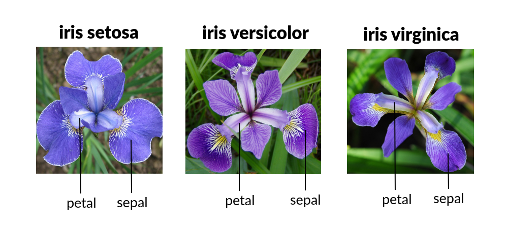
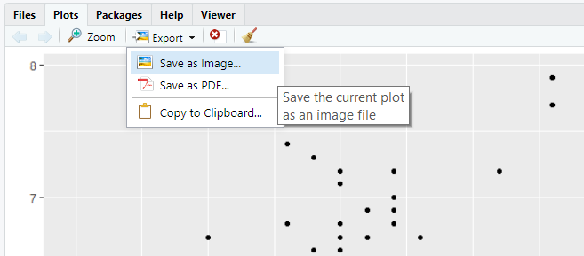
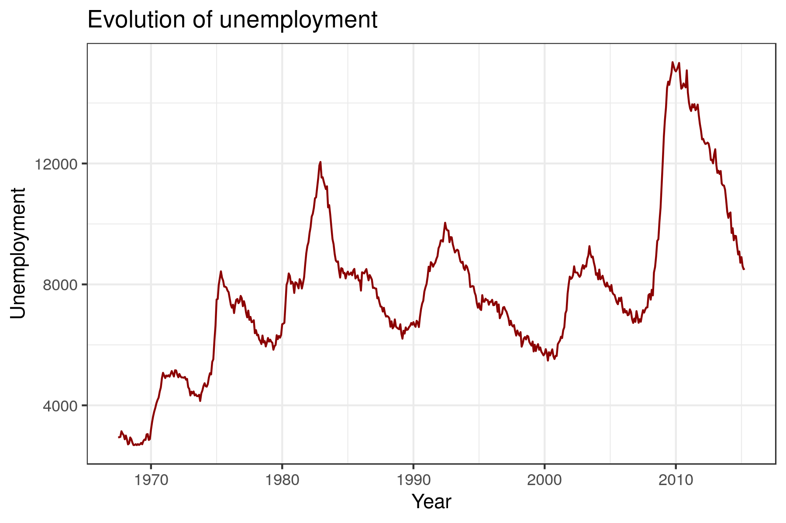
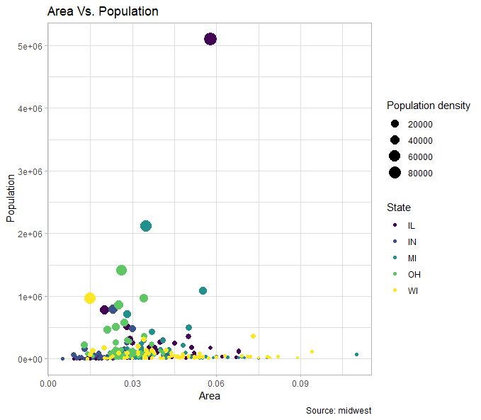
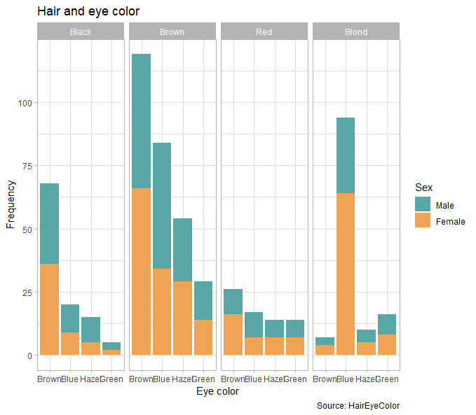

```{r setup, include=FALSE}
knitr::opts_chunk$set(echo = TRUE, fig.width = 6, fig.height = 4)
# install.packages("prettydoc")
library(DT)
library(ggplot2)
library(tidyverse)
```

<style>
  @import url(https://fonts.googleapis.com/css?family=Fira+Sans:300,300i,400,400i,500,500i,700,700i);
  @import url(https://cdn.rawgit.com/tonsky/FiraCode/1.204/distr/fira_code.css);
  @import url("https://use.fontawesome.com/releases/v5.10.1/css/all.css");
  
  body {
    font-family: 'Fira Sans','Droid Serif', 'Palatino Linotype', 'Book Antiqua', Palatino, 'Microsoft YaHei', 'Songti SC', serif;
  }
  
  /* Make bold syntax compile to red */
  strong {
    color: #D60B51;
  }
</style>


## Introduction

The following examples will walk you through the basic components of the `ggplot2` grammar. The examples use data from the `datasets` package, which is already loaded by default in the `R` session, as well as some data sets loaded with `ggplot2` package. `ggplot2` requires data to be stored in **data frames** (tables) and in a **tidy format**: one observation per row and one variable per column:

<center>

</center>

There are two types of tidy data structures:

1. **Wide format** (most common): in a wide form, the multiple measures of a single observation are stored in a single row. 

```{r, eval = TRUE, echo = F}
wide_df <- data.frame(
  Student = c("A", "B", "C"),
  Math = c(99, 73, 12),
  Literature = c(45, 78, 96),
  PE = c(56, 55, 57)
)
wide_df
```


2. **Long format**: each row corresponds to one measure on one observation.


```{r, eval = TRUE, echo = F}
library(tidyverse)
long_df <- pivot_longer(
  wide_df,
  cols = c(Math, Literature, PE),
  names_to = "Subject",
  values_to = "Score"
)
long_df
```


### Organization of the practical

You will see different icons through the document, the meaning of which is:

&emsp;<i class="fas fa-info-circle"></i>: additional or useful information<br>
&emsp;<i class="fas fa-search"></i>: a worked example<br>
&emsp;<i class="fa fa-cogs"></i>: a practical exercise<br>
&emsp;<i class="fas fa-comment-dots"></i>: a space to answer the exercise<br>
&emsp;<i class="fa fa-key"></i>: a hint to solve an exercise<br>
&emsp;<i class="fa fa-rocket"></i>: a more challenging exercise<br><br>

<i class="fas fa-info-circle"></i> `ggplot2` is a data visualization package for the statistical programming language R. Created by Hadley Wickham in 2005, `ggplot2` is an implementation of Leland Wilkinson's Grammar of Graphics — a general scheme for data visualization which breaks up graphs into semantic components such as scales and layers. This practical will introduce you to the `ggplot2` syntax and basic usage. Let's start!

----------------------------------------------------------------------------------

## **<i class="fas fa-search"></i> Example 1** | Creating a scatter plot

### **1a** | Basic scatter plot

For the first problem we want to represent the **relationship** between
the variables `Sepal.Width` and `Sepal.Length` from the `iris` data
frame. This data frame a collection of data that quantifies the
morphologic variation of **iris flowers** of three related species
(setosa, versicolor and virginica).

<center>



</center>

```{r iris, fig.align='center'}
datatable(iris)
```

<i class="fas fa-info-circle"></i> This famous (Fisher's or Anderson's)
`iris` dataset gives the measurements in centimeters of the variables
sepal length and width and petal length and width, respectively, for 50
flowers from each of 3 species of iris. You can type `??iris` in the `R`
console to read a description of the data.

To represent any graph in `ggplot2` we need two basic functions that are
combined with a `+` sign:

```{r scatter-ggplot2}
ggplot(data = iris, mapping = aes(x = Sepal.Width, y = Sepal.Length)) +
  geom_point()
```

The variables that we want to represent are wrapped within an `aes()`
function, that specifies the ***mapping*** between the variables and the
***aesthetic attributes*** (in this case we map them to spatial
positions, `x` and `y`). We call the variables directly by their names,
because we also pass the entire data frame to the call with the data
argument, so `ggplot` knows were to get them from. Finally, we need to
add the ***geometric object*** we want to represent. In this case,
points.

### **1b** |  Represent extra variables

Another variable in the data indicates the species (`Species`) it was
measured. There are three species: setosa, versicolor and virginica.

```{r table-species}
table(iris$Species)
```

Let's say we want to represent the different types of species in
different colours. In this case we want to use `Species` as a
**categorical variable**, i.e., as a factor. By default, this variable
is already a factor:

```{r check class}
class(iris$Species)
```

We use `Species` in the `colour` aesthetic:

```{r groups-ggplot2}
ggplot(data = iris, mapping = aes(x = Sepal.Width, y = Sepal.Length, colour = Species)) +
  geom_point()
```

<i class="fas fa-info-circle"></i> Note that `ggplot` adds a **legend** by default for all the variables that have been mapped to some aesthetic attribute. This way we can read all the variables without extra effort.

### <i class="fa fa-cogs"></i> Exercise

Try mapping `Species` to another aesthetic attribute instead of
`colour`, such as `shape`, `size`, `alpha`. Are you getting any warning
message? Why?

```{r answer1.1, fig.align='center'}

```

<div style="background-color:#F0F0F0">
##### &emsp;<i class="fas fa-comment-dots"></i> Answer:
&emsp;
</div>

----------------------------------------------------------------------------------

## <i class="fas fa-search"></i> **Example 2** | Creating a bar plot

For this second exercise we are going to use `mtcars` dataset, which
contains information about the **fuel consumption and 10 aspects of
automobile design and performance for 32 automobiles**.


```{r}
datatable(mtcars)
```


<i class="fas fa-info-circle"></i> The data was extracted from the 1974
Motor Trend US magazine, and comprises fuel consumption and 10 aspects
of automobile design and performance for 32 automobiles (1973--74
models). You can type `??mtcars` in the `R` console to read a
description of the data.

One of the variables of interests in the data indicates the number of
cylinders of the car engines (`cyl`). There are cars with 4, 6 or 8
cylinders.

### **2a** | Basic bar plot

We want to summarize this data in a simple **bar plot** representing the
number of cars in each cylinder category; i.e., how many cars have 4, 6
or 8 cylinders. However, the number of cars with 4 cylinders is not a
piece of information present in the dataset, for example. To know the
number it is necessary to count the rows where `cyl == 4`, and we are not
going to do it <i class="fas fa-smile-wink"></i>.

`ggplot2` is capable to do simple summary operations with the input
variables, referred as **statistical tranformations**. One of them is to
count the occurrences of each value in a variable, which is precisely
what we want to do. And `geom_bar` function happen to use the `count`
statistical transformation by default on the variable mapped to the `x`
axis.

The first thing that we are going to do is to check the class of the
`cyl` variable:

```{r class-cyl}
# First we check the class of cyl
class(mtcars$cyl)
```

We see that it's a numeric variable. In this case we want to use `cyl`
as a categorical variable, distinguishing groups rather than indicating
a value in a numerical continuous scale. For that, we need to change its
class before giving it to `ggplot` using the `as.factor()` function.

```{r factor-cyl}
# We create a new variable in the dataframe, cyl_f, that is cyl converted to factor
mtcars$cyl_f <- as.factor(mtcars$cyl)
```

Now we can create the bar plot:

```{r barplot-ggplot2, fig.align='center'}
ggplot(data = mtcars, mapping = aes(x = cyl_f)) +
  geom_bar()
```

Imagine that we have already a table with the number of cars with each
cylinder category. If we had a pre-computed data frame with `cyl` and
`number_of_cars` instead, we could pass `number_of_cars` variable to
`geom_col` function instead of `geom_bar`, that by default takes the
variables mapped to `x` and `y` without transformation.

```{r barplot-table, fig.align='center'}
# Let's create the data frame
counts_by_cyl_data_frame <- as.data.frame(table(mtcars$cyl))
names(counts_by_cyl_data_frame) <- c("cyl", "number_of_cars")

# See the data frame
counts_by_cyl_data_frame

# New graph with geom_col
ggplot(data = counts_by_cyl_data_frame, mapping = aes(x = cyl, y = number_of_cars)) +
  geom_col()
```

<i class="fas fa-hand-point-up"></i> We'll use `geom_bar` if the dataset
is not processed and we need to count the occurrences of a category. If
we have a processed dataset with the counts, we'll use `geom_col`.


### **2b** | Groups and position

We have seen in the scatter plot example how to represent groups encoded
in extra variables as colours. Say we now want to show transmission type
(`am`) in the bar plot, in addition to the number of cylinders. We can
map `am` to the filling colour of the bars, `fill` (`colour` aesthetic
would change the edges of the rectangles). There are two types of
transmission: `0` for automatic cars and `1` for manual cars.

```{r groups-bar, fig.align='center'}
# First we check the class of the variable
class(mtcars$am)

# We make am factor, and we can change the 0/1 notation for a more informative notation: automatic/manual
mtcars$am_f <- factor(mtcars$am, levels = c(0, 1), labels = c("automatic", "manual"))

# Plot
ggplot(data = mtcars, mapping = aes(x = cyl_f, fill = am_f)) +
  geom_bar()
```

Each geometric object in `ggplot2` also has a **position** argument that
controls how groups are arranged. In `geom_bar` the default position is
to stack the groups. We can change it for a side-by-side position with
`position = "dodge"`.

```{r position-bar-ggplot2, fig.align='center'}
ggplot(data = mtcars, mapping = aes(x = cyl, fill = am_f)) +
  geom_bar(position = "dodge")
```

### <i class="fa fa-cogs"></i> Exercise

Update the plot above with the `"fill"` position adjustment instead of
`"dodge"`. What it is doing?

```{r positions-ggplot2 answer2.1, fig.align='center'}

```

<div style="background-color:#F0F0F0">
##### &emsp;<i class="fas fa-comment-dots"></i> Answer:
&emsp;
</div>

Update the previous plot to group by the variable `gear` instead of the
transmission type (`am_f`). `gear` variable is the number of forward
gear: cars can have 3, 4 and 5 gears. Check if you need to transform
`gear` to a factor.

##### <i class="fas fa-comment-dots"></i> Answer:

```{r positions-ggplot2 answer2.2}

```

----------------------------------------------------------------------------------

## <i class="fas fa-search"></i> **Example 3** | Showing the distribution of a variable

### **3a** | Simple histogram

Now we have a new dataset called `diamonds` and we need to understand
the distribution of some of its continuous variables. A good place to
start is a histogram, that represents the number of observations in
different ranges as bars.

<i class="fas fa-info-circle"></i> Note that histograms deal with _continuous_ variables while bar plots with _discrete_, but are sometimes [confused](https://www.google.com/search?q=histograms+and+bar+graphs+difference).

```{r}
datatable(diamonds)
```

<i class="fas fa-info-circle"></i> `diamonds` is a dataset containing
the prices and other attributes of almost 54,000 diamonds. You can type
`??diamonds` in the `R` console to read a description of the data.


The function that we need is called `geom_histogram()` and has the
statistical transformation `bin` by default. In this case, `bin` divides
the variable mapped to `x` in ranges and counts the number of values in
each bin. The number of bins is controlled with the argument `binwidth`.
In this example we show the distribution of the weights of diamonds
(`carat`).


```{r histogram, fig.align='center'}
ggplot(data = diamonds, mapping = aes(x = carat)) +
  geom_histogram(binwidth = 0.3)
```

### **3b** | Multiple histograms

The `diamonds` dataset contains more information about diamonds, such as
the quality (`cut`) or the color (`color`). To see the distribution of
the weight we can try to map it to the filling `cut`:

```{r histogram-fill, fig.align='center'}
ggplot(data = diamonds, mapping = aes(x = carat, fill = cut)) +
  geom_histogram(binwidth = 0.3) 
```

Stacked histograms are difficult to interpret. We can use another
position instead of the default "`stacked`" position. For example, using
`position = "dodge"`.


```{r histogram dodge}
ggplot(data = diamonds, mapping = aes(x = carat, fill = cut)) +
  geom_histogram(position = "dodge", binwidth = 0.3)
```

But there's even a better option. `ggplot2` provides a simple way of
creating small multiples or **facets** with the function `facet_grid`:

```{r facets}
ggplot(data = diamonds, mapping = aes(x = carat, fill = cut)) +
  geom_histogram(position = "dodge", binwidth = 0.3) + 
  facet_grid(cut ~ .)
```


### <i class="fa fa-cogs"></i> Exercise

What happens if you change the order of the `facet_grid` elements, i.e.,
`(. ~ cut)`?

##### <i class="fas fa-comment-dots"></i> Answer:
```{r diamonds-facets answer 3.1}

```

Which is the best subplot configuration to compare the distributions and
why?

##### <i class="fas fa-comment-dots"></i> Answer:


----------------------------------------------------------------------------------

## <i class="fas fa-search"></i> **Example 4** | Customizing a plot

### **4a** | Simple boxplot

Another way of showing the distribution of numerical data is by means of
a boxplot. It allows to better understand the skewness through
displaying the data quartiles and averages. It also shows outliers as
separated dots.

The function that we are going to use is `geom_boxplot()`. In this
example we show the distribution of the weights of diamonds (`carat`).

```{r boxplot}
ggplot(data = diamonds, mapping = aes(y = carat)) +
  geom_boxplot()
```

One characteristic of boxplots is that you can show the distribution of
one variable (`carat`) with respect to another categorical variable. For
example, we can show the distribution of `carat` based on the color of
the diamond (`color`).

```{r boxplot2}
ggplot(data = diamonds, mapping = aes(y = carat, x = color)) +
  geom_boxplot()
```

### <i class="fa fa-cogs"></i> Exercise

Try to fill with a color the boxplot. How would you do it?

##### <i class="fas fa-comment-dots"></i> Answer:

```{r diamonds-facets answer 4.1}

```


------------------------------------------------------------------------

## <i class="fas fa-search"></i> **Example 5** \| Customizing a plot

### **5a** \| Modify colours

So far we have used the **default colour palettes** for all our
representations. We may need to change them to make them accessible to
**colour blind people**, match the colour palette of our project or give
**meaningful values** (e.g., red for positive and blue for negative). We
can control the exact mapping of a variable to an aesthetic attribute
with the functions `scale_*`.

In the following example we manually set the color of the five type of
diamond qualities. You can use other color names checking the following
[R color guide](http://www.stat.columbia.edu/~tzheng/files/Rcolor.pdf).

```{r change-col-ggplot2}
ggplot(data = diamonds, mapping = aes(x = carat, fill = cut)) +
  geom_histogram(position = "dodge", binwidth = 0.3) + 
  facet_grid(cut ~ .) +
  scale_fill_manual(values = c("sienna1", "orange", "lightseagreen", "orangered", "red4"))
```

<i class="fas fa-info-circle"></i> Note that scale functions update both
the aesthetic mappings in the plot and in the legend.


### **5b** | Change (or add) axis, legend and plot titles

We may also need to add a **title** to the plot or change the **axis
titles**. There are several options for that: \* In `ggplot2`, axis and
legend titles can be specified with `name` argument within a `scale_*`
function \* The title can be changed with `+ ggtitle("Title name")` \*
You can also use the convenience function `labs()`, with `fill = ""` you
will set a new legend title and `title = ""` a new title. See the
working example:

```{r titles-ggplot2}
# We save the common part of the plot in a variable and then we can add more components with the "+" sign
p <- ggplot(data = diamonds, mapping = aes(x = carat, fill = cut)) +
  geom_histogram(position = "dodge", binwidth = 0.3) + 
  facet_grid(cut ~ .)
  
# Option A:
p + scale_fill_manual(values = c("sienna1", "orange", "lightseagreen", "orangered", "red4"), name = "Quality") +
  scale_x_continuous(name = "Weight of the diamond") + 
  ggtitle("Diamond weight variation")

# Option B:
# p + scale_fill_manual(values = c("sienna1", "orange", "lightseagreen", "orangered", "red4")) +
#   labs(title = "Diamond weight variation", x = "Weight of the diamond", fill = "Quality")
```

### **5c** | Change theme

The appearance of `ggplot2` plots is controlled by the **themes**. The
default `ggplot2` theme has a gray background and "*is designed to put
the data forward yet make comparisons easy*". You can change the general
appearance by choosing a different theme with `theme_*` functions. There
are [eight different
themes](https://ggplot2.tidyverse.org/reference/ggtheme.html) available.
The following example uses the "black and white" theme (`theme_bw()`):

```{r theme}
ggplot(data = diamonds, mapping = aes(x = carat, fill = cut)) +
  geom_histogram(position = "dodge", binwidth = 0.3) + 
  facet_grid(cut ~ .) +
  scale_fill_manual(values = c("sienna1", "orange", "lightseagreen", "orangered", "red4"), name = "Quality") +
  scale_x_continuous(name = "Weight of the diamond") + 
  ggtitle("Diamond weight variation") +
  theme_bw()
```

### <i class="fas fa-cogs"></i> Exercise

Using the following code, try other `scale_fill_*` functions in
`ggplot2` with pre-defined palettes, such as `scale_fill_hue()`,
`scale_fill_brewer()`, `scale_fill_viridis_d()` (default) and
`scale_fill_grey()`. Which palette would you use to ensure that
colou rblind people can distinguish the colours, `scale_fill_hue()` or
`scale_fill_viridis_d()`?

##### <i class="fas fa-comment-dots"></i> Answer:

```{r answer5.1}

```

Try `subtitle = ""`, `caption =""` and `tag =""` arguments from the
`labs()` function. What are they for?

##### <i class="fas fa-comment-dots"></i> Answer:

```{r answer5.2}

```

Which theme of the [eight
available](https://ggplot2.tidyverse.org/reference/ggtheme.html) do you
think that maximizes the data-ink ratio?

##### <i class="fas fa-comment-dots"></i> Answer:

```{r answer5.3}

```

------------------------------------------------------------------------

## <i class="fas fa-info-circle"></i> Saving the plots

There are several ways to save a plot to a file. Here you have a couple
of examples:

A. Export button from `RStudio` plot panel:



B. `ggsave` function from `ggplot2` package

```{r ggsave, eval = FALSE}

p <- ggplot(data = iris, mapping = aes(x = Sepal.Width, y = Sepal.Length)) + geom_point()

ggsave(filename = "plot.png", plot = p, width = 6, height = 4) # In inches by default
```

Plots can be saved using different image file formats. Option **A**
gives you the format options in a drop list (image format: PNG, JPG,
...), option **B** guesses the format from the extension (e.g.
`plot.png` or `plot.pdf`).

The main formats can be classified into:

-   Raster/bitmat formats, where information is stored in pixels and
    have a maximum resolution.

    -   **PNG**: extension .png, supports transparent background, good
        compression, doesn't lose quality
    -   **JPEG**: extensions .jpg and .jpeg, very good compression, used
        in personal photography but suffers from quality degradation
        with repeated modifications
    -   **TIFF**: extensions .tif and .tiff, preferred format for
        professional printing

-   Vector formats, where information is encoded in geometric shapes
    that can be rendered at any size without losing resolution.

    -   **SVG**: extension .svg, standard for vector graphics, requires
        `svglite` package

-   Hybrid

    -   **PDF**: can contain both vector graphics and raster images

### <i class="fas fa-cogs"></i> Exercise

Save the plot `p` in a raster and a vector format with the same size
using `ggsave()` (e.g.: `width = 6, height = 4`). What
differences do you observe when you zoom in them?

<i class="fas fa-info-circle"></i> Note: svg devices require `svglite` R
package and other system libraries (`libcairo2-dev` and
`libfontconfig1-dev`). Skip the exercise if you get an error!

##### <i class="fas fa-comment-dots"></i> Answer:

```{r answer 6.1}

```

------------------------------------------------------------------------

## <i class="fa fa-cogs"></i> Wrap up exercise

If for representing a scatter plot we use `geom_point()`, a bar plot
`geom_bar()` ... could you guess how to represent a **line** plot with
`ggplot2` syntax?

-   Represent how `unemploy` variable changes over time (`date`
    variable) from `economics` dataset with a line plot using `ggplot2`
    syntax
-   Modify axis names and add a title
-   Use a theme
-   Save the plot to a file using a raster image format (png)

##### <i class="fas fa-comment-dots"></i> Answer:

```{r wrap-exercise-line-plot}

```

<i class="fa fa-key"></i> The final image should look like this:

<center>



</center>

# <i class="fa fa-rocket"></i> Try to reproduce a plot!

Pick one (or more!) of the following figures. With your knowledge on `ggplot2` try to write the code that reproduce the same figure.

| Plot | Dataset      | Description                                                       | Hint                                                                            |
|-------|--------------|-------------------------------------------------------------------|---------------------------------------------------------------------------------|
| 1     | `Titanic`    | Survival of passengers on the Titanic                             | Color palette is: "#79AEB2", "#4A6274"                                          |
| 2     | `ToothGrowth`  | The Effect of Vitamin C on Tooth Growth in Guinea Pigs            | Color palette is: "#58A6A6", "#EFA355"                                          |
| 3     | `msleep`       | An updated and expanded version of the mammals sleep dataset.     | You can color in gray the NA values inside the scale_fill (na.value = "grey80") |
| 4     | `mpg`          | Fuel economy data from 1999 and 2008 for 38 popular models of car | Color palette is: "#4CC3CD", "#FEE883"                                          |
| 5     | `midwest`      | Midwest demographics.                                             | Two aesthetics are combined inside geom_point(), color and size.                |
| 6     | `diamonds`     | Prices of 50,000 round cut diamonds                               | The viridis palette is used.                                                    |
| 7     | `HairEyeColor` | Hair and Eye Color of Statistics Students                         | Color palette is: "#58A6A6", "#EFA355"                                          |
| 8     | `infert`       | Infertility after Spontaneous and Induced Abortion                | Color palette is: "#900C3F", "#C70039", "#FF5733"                               |                              |


<a href="img/titanic2020_11_7D10_3_14.png" target="new">

</a><a href="img/toothGrowth2020_11_7D10_6_32.png" target="new">

</a><a href="img/msleep2020_11_7D10_9_41.png" target="new">

</a>
<a href="img/mpg2020_11_7D10_10_11.png" target="new">

</a><a href="img/midwest2020_11_7D10_10_38.png" target="new">

</a>
<a href="img/diamonds2020_11_7D10_11_9.png" target="new">

</a><a href="img/HairEyeColor2020_11_7D10_11_42.png" target="new">

</a>
<a href="img/infert2020_11_7D10_11_54.png" target="new">

</a>

```{r reproducing-ggplot2}

```

