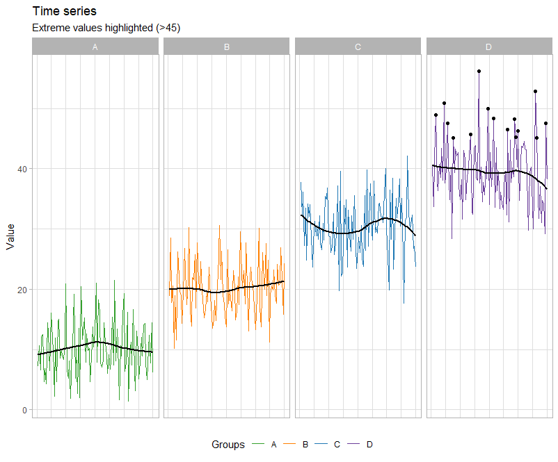

```{r setup, include=FALSE}
knitr::opts_chunk$set(echo = TRUE, fig.width = 9, fig.height = 6, fig.align = "center")
library(ggplot2)
library(shiny)
library(plotly)
library(dplyr)
```

```{=html}
<style>
  .fig {width: 50%}
  @import url(https://fonts.googleapis.com/css?family=Fira+Sans:300,300i,400,400i,500,500i,700,700i);
  @import url(https://cdn.rawgit.com/tonsky/FiraCode/1.204/distr/fira_code.css);

.center {
  text-align: center;
}
</style>
```
<hr>

<b><i>Directions</i>:</b>
<b>1.</b> The Data visualization will last a total of 2 hours. Ask us any questions during that time.
<b>2.</b> You may consult with any allowed materials you wish from the MATERIALS.zip (screens will be recorded).
<b>3.</b> Deliver the rendered HTML and Rmd with your answers to Atenea.
<b>4.</b> Answers must be written in English.
<b>5.</b> Plagiarism and cheating (including the use of ChatGPT) are forbidden and will result in failing of the exam with grade 0.
<b>6.</b> Good luck!

<hr>

### **1. Short exercises and questions (5 points)**

#### **QUESTION 1**

**Fix and/or improve the following `ggplot2` calls and briefly explain why they were wrong and what have you done to solve them. (1 point)**

```{r q1.1, eval = T}

ggplot(mpg, aes(displ, hwy, fill = class)) +
    geom_point()

# Answer:

```

```{r q1.2, eval = T}

ggplot(mpg) +
    geom_bar(data = mpg, aes(drv, color = as.factor(cyl))) +
    scale_fill_viridis_d()

# Answer:

```

```{r q1.3, eval = T}

ggplot(airquality, aes(as.factor(Month), Temp)) +
    geom_boxplot(aes(color = "blue"))

# Answer:

```

```{r q1.4, eval = T}

ggplot(iris, aes(iris$Species, iris$Sepal.Length)) +
  geom_boxplot(aes(x = iris$Species, y = iris$Sepal.Length, fill = iris$Species))

# Answer:

```

```{r q1.5, eval = T}

ggplot(Orange, aes(age, circumference, Tree)) +
    geom_line()

# Answer:

```


#### **QUESTION 2**

**The following code generates a data.frame named `df`. Is it in long or wide format? Justify your answer. (0.5 point)**

```{r q2.1, eval = TRUE}

set.seed(123)
df <- data.frame(
  time = rep(1:100, each = 4),
  value = rep(c(10, 20, 30, 40), times = 100) + rnorm(400, sd = 5),
  group = rep(LETTERS[1:4], times = 100)
)

# Answer:

```


#### **QUESTION 3**

**Reproduce the following figure using the previous `df` data.frame (1.5 point).**



🗝️  **Hint**: colour codes for points for the complete version ar "#33A02C", "#FF7F00", "#1F78B4", "#6A3D9A.

```{r q3}

# Answer:

```

#### **QUESTION 4**

**Write the code or propose a way to save the previous figure in pdf format (0.5 points). What are the advantages of a plot saved using a vector format? (0.5 points)**


```{r q4, eval = T}

# Answer

```

#### **QUESTION 5**

**What aspects would you take into account for creating a “ready-to-publish” figure? Mention at least 3 items (maximum 100 words) (1 point)**

Answer:
-

<hr>

### **2. Problem (5 points)**

**The `CO2` dataset contains 84 rows and 5 columns, representing data from an experiment on the cold tolerance of the grass species *Echinochloa crus-galli*. In this analysis, we will explore the dataset by creating various static and interactive visualizations.** 

```{r see the data}
CO2_df <- as.data.frame(CO2)
head(CO2_df)

# more info: ??CO2
```

We aim to test the following hypothesis: **"The grass species *Echinochloa crus-galli* exhibit higher CO2 uptake under non-chilled conditions."** If cold tolerance influences CO2 uptake, we expect plants in non-chilled conditions to show higher CO2 uptake compared to those in chilled conditions.

- Create a `ggplot2` visualization that allows us to visually assess whether this hypothesis holds. Show the raw data and annotations (0.5 points) and finish it with publication-quality details (0.35 points). Interpret the results (0.15 points)

! Important: You do not need to perform a statistical test. Focus on using the visualization to explore the trend.

```{r problem1}

# Answer:

```

The second hypothesis we want to test is: **CO2 uptake increases with ambient CO2 concentration, but the effect differs by treatment.** We can compare the relationship between CO2 concentration and uptake under chilled vs. non-chilled treatments. If chilling affects photosynthesis efficiency, we might see a weaker correlation in chilled plants.

- Create a ggplot2 visualization that allows us to visually assess whether this hypothesis holds. Show the raw data and annotations (0.5 points) and finish it with publication-quality details (0.35 points). Interpret the results (0.15 points)

! Important: You do not need to perform a statistical test. Focus on using the visualization to explore the trend.

```{r problem2}

# Answer:

```

**Transform the previous plots into the interactive version with the `plotly` package. (0.5 points)**

```{r problem3}

# Answer:

```

##### **Open `shiny` application (2.5 points):**

**Create a shiny application that allows to create an interactive version of one of the previous plots you created. The app should at least have 2 input widgets that dynamically affect the visualization (2 point) (for example: a widget to filter the data by treatment type, type, select a range of CO2 or uptake, ...). Show a table with the data selected (0.5 points). Make sure that the `shiny` application has a title and your name on it.**

```{r problem4}

# Answer:

```

<hr>
