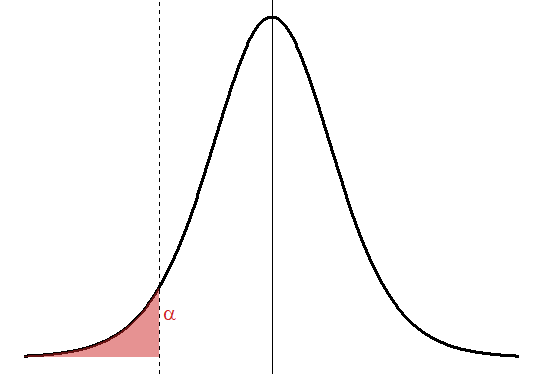

## Contexto del problema

**Asignatura:** Bioestadística | Grado en Genética (UAB)  
**Rol:** Analista de Datos en *Bellaterra Pharma Solutions S.L.*

Vuestra empresa ha desarrollado **tres variantes de un fármaco basado en edición génica** para reducir el volumen tumoral en ratones con una mutación hereditaria predisponente. Existe un fármaco ya aprobado por otra compañía competidora que tiene una magnitud del efecto de 0.5. 

Se han realizado **tres ensayos independientes**. Los datos están disponibles en tres ficheros con formato `.tsv` en los siguientes enlaces:

- Ensayo 1: https://raw.githubusercontent.com/marta-coronado/biostatistics-uab/refs/heads/main/EP/Data/dfA.tsv
- Ensayo 2: https://raw.githubusercontent.com/marta-coronado/biostatistics-uab/refs/heads/main/EP/Data/dfB.tsv
- Ensayo 3: https://raw.githubusercontent.com/marta-coronado/biostatistics-uab/refs/heads/main/EP/Data/dfC.tsv

Los valores numéricos (columna `Valor`) representan el **número de semanas de supervivencia** de los ratones tras la administración del tratamiento (grupo tratamiento) o del placebo (grupo control). Los dos grupos de ratones son **independientes**.

Como analistas senior, vuestra misión es entregar un **informe técnico** a la dirección científica. No basta con decir *qué funciona*; hay que justificar la **fiabilidad** y la **relevancia estadística** de los resultados.

```{r warning=FALSE, message=FALSE}
# carga las librerías
library(ggplot2)
library(car)
library(dplyr)
library(infer)
library(tidyverse)
```

---

# INFORME TÉCNICO

### 1. Exploración y diagnóstico (4 puntos)

#### Análisis descriptivo visual

**1. Realizad un análisis descriptivo visual.** (1 punto)

Utiliza `ggplot2` para generar tres gráficos, uno por ensayo, para visualizar los datos. Basta con un gráfico estadístico sencillo que permita explorar los datos de estudio, no es necesario (ni se valorará) personalizar colores, temas o formatos.

```{r}

```

**2. Evaluad la normalidad de los grupos (de manera estadística y gráfica) y la homogeneidad de varianzas** (0.7 puntos). **Explorad si la aplicación de algún método de transformación mejora la normalidad de los datos.** (0.3 puntos)

Recuerda comprobar la normalidad dentro de cada grupo (tratamiento y  control).

```{r}

```

#### Inferencia básica

**3. Decidid y aplicar los tests que mejor se ajusten a vuestros datos. Justificad muy brevemente la elección de cada test.** (2 puntos)
Las opciones de test disponibles son: t-test pareado, t-test de muestras independientes, t-test de una muestra, ANOVA, Wilcoxon test y test de Kruskal-Wallis.

- Elección y justificación del test/s (1 punto)
- Aplicar el test (0.5 puntos)
- Interpretar el resultado del test (0.5 puntos)

```{r}

```


---

### 2. Significación vs. magnitud del efecto (2 puntos)

**1. Calcula la magnitud del efecto, como la diferencia (resta) entre la media del grupo tratamiento y la media del grupo control para cada ensayo**. (1 punto) 

```{r}

```

**2. Rellena la siguiente tabla con un resumen de los resultados obtenidos hasta ahora.** (1 punto)

| Ensayo | Test | P-valor test | Magnitud del efecto |
|--------|------|--------------|---------------------|
| A      |      |              |                     |
| B      |      |              |                     |
| C      |      |              |                     |


---

### 3. Inferencia robusta: el Bootstrap (2 puntos)

**1. Un directivo (familiar de  Bradley Efron) le interesaría mucho hacer un Boostrap para uno de los ensayos, pero no tiene claro en qué ensayo sería más adecuado aplicarlo, si en el B o en el C. ¿Le puedes ayudar a elegir con la evidencia que tienes?** (0.25 puntos)

Respuesta:


**2. En el ensayo escogido en el punto anterior, debéis realizar un Bootstrap (5000 réplicas con reemplazamiento será suficiente) para evaluar la diferencia de medias entre los grupos de control y tratamiento.** (0.75 puntos)


El directivo nos facilita los siguientes apuntes para calcular la diferencia de medias con Boostrap, aunque admite que tendremos que modificar algo de código en la función de `rep_sample_n()`. Corrige el código (0.25), añade comentarios para explicar qué hace (0.25), y obtén las diferencias de medias para las 5000 replicas (0.25):

```{r eval = F}

many_resampled_fireflies <- firefly  %>%   
  rep_sample_n(size = nrow(firefly)), replace = F, reps = 100)

boot_diff <- many_resampled_fireflies %>%
  group_by(replicate) %>%
  summarise(
    diff_means = mean(subset(Valor, Grupo == "Tratamiento")) -
                 mean(subset(Valor, Grupo == "Control"))
  )

boot_diff <- na.omit(boot_diff) # elimina filas que no contengan datos (NaN)

```

**3. Calculad el intervalo de confianza de la cola inferior al 99% de la diferencia de medias que has obtenido en `boot_diff`.** (0.5 puntos)

</img>

```{r}

```


**4. Interpretación y justificación del resultado del IC.** (0.5 puntos)

¿Existe alguna diferencia respecto al test que has hecho en el apartado 1.3 de inferencia básica?

Respuesta:


---

### 4. Dictamen final (2 puntos)

**Redactad una recomendación de máximo 300 palabras dirigida a la junta directiva que incluya los siguientes puntos:**

- ¿Qué ensayo es el más prometedor?
- ¿Cuál dirías que es el punto débil de cada ensayo?
- ¿Qué riesgos estadísticos asumimos con cada uno?

Respuesta:


---