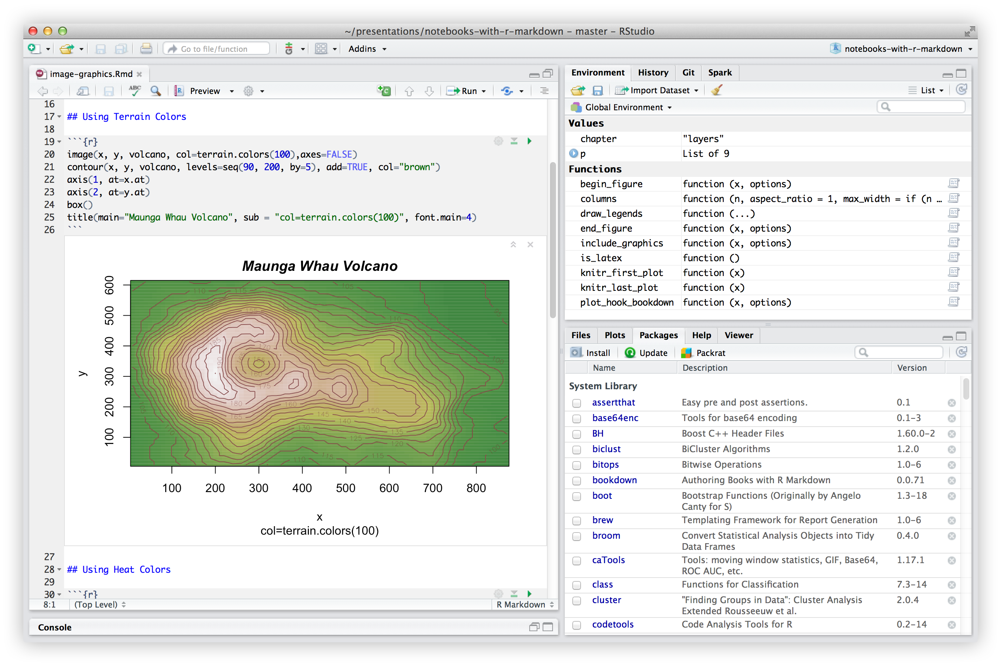

```{r setup, include=FALSE}
knitr::opts_chunk$set(echo = TRUE, warning = F, message = F, fig.retina = 5)
library(dplyr)
library(tibble)
library(ggplot2)
# install.packages("prettydoc")
library(prettydoc)
```


<style>
  @import url(https://fonts.googleapis.com/css?family=Fira+Sans:300,300i,400,400i,500,500i,700,700i);
  @import url(https://cdn.rawgit.com/tonsky/FiraCode/1.204/distr/fira_code.css);
  @import url("https://use.fontawesome.com/releases/v5.10.1/css/all.css");
  
  body {
    font-family: 'Fira Sans','Droid Serif', 'Palatino Linotype', 'Book Antiqua', Palatino, 'Microsoft YaHei', 'Songti SC', serif;
  }
  
  /* Make bold syntax compile to RU-red */
  strong {
    color: #DE1144;
  }

</style>

# Datos de estudio

En este ejemplo práctico utilizaremos datos de un [estudio](https://academic.oup.com/jimmunol/article/196/5/2004/7974320) sobre la expresión génica en células infectadas con el virus de la gripe ([Bajwa et al., 2016](https://academic.oup.com/jimmunol/article/196/5/2004/7974320)). En este estudio se infectó células dendríticas plasmocitoides humanas con el virus de la gripe y se comparó la expresión génica en estas células con la expresión génica en células no infectadas. El objetivo era ver cómo el virus de la gripe afectaba la función de estas células del sistema inmunitario.  

::: {style="background-color: #86CBBB; 1px; height:3px "}
:::

# Organización de las prácticas

En esta práctica vamos a usar el entorno de desarrollo integrado
[**RStudio**](https://posit.co/products/open-source/rstudio/) (IDE) para R.  
R es un lenguaje de programación para computación estadística y gráficos.

<center>



</center>

El documento actual en el que estamos trabajando es un documento **R Markdown**.  Son totalmente reproducibles y permiten combinar texto, imágenes y código —en lenguaje R.

Para **renderizar** un documento R Markdown a un archivo HTML, solo necesitas hacer clic en el botón `Knit` que verás en la barra de RStudio. Este archivo HTML puede compartirse como un informe.

No necesitas renderizar todo el documento cada vez que quieras ver el resultado de tu código en R. Puedes hacer clic en el
botón `Run current chunk` o usar el atajo de teclado `Ctrl`+`Alt`+`C`, y el resultado del código aparecerá debajo.

<center>


</center>

A lo largo del documento verás diferentes iconos, cuyo significado es:

<i class="fas fa-info-circle"></i>: información adicional o útil<br>
<i class="fas fa-search"></i>: un ejemplo<br>
<i class="fa fa-cogs"></i>: un ejercicio práctico<br>
<i class="fas fa-comment-dots"></i>: un espacio para responder al ejercicio<br>
<i class="fa fa-key"></i>: una pista para resolver un ejercicio<br>

::: {style="background-color: #86CBBB; 1px; height:3px "}
:::

## Instalación de herramientas

Recomendamos encarecidamente usar un sistema operativo **Linux** y acostumbrarse a trabajar con la **terminal**.  
En esta práctica, sin embargo, no la usaremos y casi no hay diferencias entre usar RStudio en Windows o en Linux.

### Instalación de R

El lenguaje de programación R puede descargarse desde
[este enlace](https://cran.rediris.es/), y está disponible para Windows, Linux y macOS.

### Instalación de RStudio

RStudio se puede descargar desde
[este enlace](https://posit.co/download/rstudio-desktop/?utm_source=downloadrstudio&utm_medium=Site&utm_campaign=home-hero-cta).  
Se instala fácilmente en Windows, Linux y macOS.

### Instalación de un paquete

Los paquetes de R son colecciones de funciones y/o datos desarrollados por la comunidad.

Para instalar un paquete, usamos la función `install.packages()`,
indicando entre comillas el nombre del paquete que queremos instalar.

#### Instalación de `ggplot2`

`ggplot2` es un paquete de visualización de datos para el lenguaje de programación R ([Wickham 2009](https://www.springer.com/gp/book/9780387981413)).  
Fue creado por Hadley Wickham, implementando la *Grammar of Graphics* de Leland Wilkinson —un esquema general para la visualización de datos que divide los gráficos en componentes semánticos ([Wilkinson 2010](https://onlinelibrary.wiley.com/doi/full/10.1002/wics.118)).

Para instalar el paquete `ggplot2`, utiliza lo siguiente:

> `install.packages("ggplot2")`

### Cargar un paquete

Para cargar un paquete, usamos la función `library()`, indicando el nombre de la librería que queremos cargar.

En el caso de `ggplot2`, usarás:

> `library("ggplot2")`

¡Ya estás listo para empezar a usar R!

```{r example, echo = FALSE}
# Simulate data
set.seed(170513)
n <- 5000
d <- data.frame(a = rnorm(n))
d$b <- .4 * (d$a + rnorm(n))

# Compute first principal component
d$pc <- predict(prcomp(~a+b, d))[,1]

# Plot
ggplot(d, aes(a, b, color = pc)) +
  geom_point(shape = 16, size = 5, show.legend = FALSE, alpha = 0.4) +
  theme_minimal() +
  scale_color_gradient(low = "#0091FF", high = "#F0650E") + labs(x = "", y = "") +
  scale_x_continuous(breaks = round(seq(-2,2, by = 1),0))
```

::: {style="background-color: #86CBBB; 1px; height:3px "}
:::

# Introducción a `R` y RStudio

## Directorio de trabajo

El directorio de trabajo es la carpeta de tu ordenador donde R busca por defecto los archivos que necesitas importar y donde guardará los resultados que exportes (tablas, gráficos, etc.).

Para saber cuál es el directorio de trabajo (`working directory`) utilizamos la funcion `getwd()`:

```{r}
getwd()
```

Podemos definir una nueva ruta de trabajo con `setwd()`:

```{r, eval = F}
setwd("/ruta/nou/directori")
```

O de manera gráfica dentro de RStudio a *Session > Set Working Directory > Choose Directory...*). 

#### **<i class="fa fa-cogs"></i>** Actividad 1.1  
**Decide una ruta de trabajo en tu ordenador con `setwd()` o de manera gráfica. Comprueba que sea correcta con `getwd()`.**

<i class="fa fa-key"></i> Por ejemplo, puedes escoger la carpeta donde te hayas descargado el material del Moodle.


```{r, respuesta 1, eval = F}
setwd("C:/Users/eduar/OneDrive - UAB/Bioestadística/Prácticas/P1")
getwd()
```

En este directorio de trabajo que hayas escogido, realizaremos todos los análisis.  

## Leer el archivo con los datos de expresión  

Lee en `R` el archivo ["**GSE68849_expression.csv**"](https://github.com/marta-coronado/biostatistics-uab/blob/main/P/1/data/GSE68849_expression.csv) que encontrarás en la carpeta [**data**](https://github.com/marta-coronado/biostatistics-uab/blob/main/P/1/data/). Puedes abrirlo primero con Excel o con otro programa de visualización de datos (como un editor de texto) para comprobar si tiene nombres de columnas y cómo están separadas.  

#### **<i class="fa fa-cogs"></i>** Actividad 1.2  
**¿Cuál será el código en R para abrir el archivo?** Guarda el contenido del archivo en un objeto llamado `expressionData`.  

<i class="fa fa-key"></i> Puedes utilizar los comandos que vimos en la diapositiva 12 de teoría del Tema 2: Introducción a R. Ten en cuenta que quizás necesites cargar una librería, como `library(readr)`.

```{r, respuesta 2}
library(readr)

expressionData <- read_csv("data/GSE68849_expression.csv", col_names = T)

```

#### **<i class="fa fa-cogs"></i>** Actividad 1.3  
**Explora el archivo**. Utiliza comandos como `head(expressionData)` y `View(expressionData)` para explorar el contenido de `expressionData`. ¿Qué información contiene?  


```{r, respuesta 3}
head(expressionData)
# Contiene los datos de expresión génica en dos grupos de sujetos: control y con infección
```

## Tipos de variables

#### **<i class="fa fa-cogs"></i>** Actividad 1.4

Para saber el tipo de variable que contiene `expressionData`, podemos utilizar la función `str()`. Rellena la siguiente tabla indicando qué tipo de variable contiene `expressionData`.

| Variable           | Tipo de variable (Cuantitativa / Cualitativa) | Tipo específico (Discreta / Continua / Nominal / Ordinal) | Observaciones |
|-------------------|-----------------------------------------------|-----------------------------------------------------------|---------------|
| _Subject_           | Cualitativa                                   | Nominal                                                   | Identificador único de cada sujeto |
| _Treatment_         | Cualitativa                                   | Nominal                                                   | Dos categorías: "control" e "influenza" |
| _Gene_              | Cualitativa                                   | Nominal                                                   | Nombre del gen analizado |
| _Expression level_  | Cuantitativa                                  | Continua                                                  | Niveles de expresión génica |


## Estadística descriptiva

R contiene muchas funciones `built-in` para realizar estadística descriptiva básica.

#### **<i class="fa fa-cogs"></i>** Actividad 1.5

Dada la columna con el nivel de expresión de los genes `expressionData$expression_level`.  

Calcula la **media**, la **mediana** y la **desviación estándar** del vector `expressionData$expression_level`.


```{r, respuesta 5}
mean(expressionData$expression_level)
median(expressionData$expression_level)
sd(expressionData$expression_level)
```


# `Tidyverse`

#### **<i class="fa fa-cogs"></i>** Actividad 1.6 
¿Cuántos genes distintos hay en el set de datos?  

Primero, podemos seleccionar la columna `gene` de nuestro dataframe `expressionData` y luego usar `distinct()` para quedarnos solo con los valores únicos.  
Después, aplicamos `count()` para contar cuántos elementos hay en total.  

Como queremos contar todas las filas resultantes, no hace falta especificar ningún argumento dentro de `count()`.

<i class="fa fa-key"></i> Recuerda usar `%>%` para concatenar comandos.

```{r, respuesta 6}
expressionData %>%
  select(gene) %>%
  distinct() %>%
  count()
```

Alternativamente, te mostramos una función que no se ha visto en la teoría y que permite hacer lo mismo: `n_distinct` junto con `summarize`:

```{r, n_distinct}
expressionData %>%
  summarize(n=n_distinct(gene))
```


#### **<i class="fa fa-cogs"></i>** Actividad 1.7

Una de las columnas es `subject`. Extrae todos los datos correspondientes al sujeto `GSM1684096` y guárdalos en un nuevo objeto llamado `expressionData_GSM1684096`:

<i class="fa fa-key"></i> Utiliza la función `filter()`

```{r, respuesta 7}
expressionData_GSM1684096 <- expressionData %>% filter(subject=="GSM1684096")
```


#### **<i class="fa fa-cogs"></i>** Actividad 1.8 
**Explora `expressionData`**. Estamos interesados en conocer el nivel de expresión del gen *IFNA5* en condición de infección para el sujeto `GSM1684096`. ¿Cómo lo harías? Combina `filter()` y `select()`:

```{r, respuesta 8}
expressionData_GSM1684096 %>% filter(gene=="IFNA5", treatment=="influenza") %>% select(expression_level)
```


#### **<i class="fa fa-cogs"></i>** Actividad 1.9  
Calcula la media de expresión para cada tratamiento. Deberás combinar `group_by()` y `summarize()`. La diapositiva 42 puede servir de guía:


```{r, respuesta 9}
expressionData %>% group_by(treatment) %>%
  summarize(avg = mean(expression_level, na.rm = T))
```


#### **<i class="fa fa-cogs"></i>** Actividad 1.10

Crea una nueva columna basada en el nivel de expresión de los genes: <10 → "bajo",10-100 → "moderado", 100-1000 → "alto", >1000 → "muy alto"  

En la diapositiva 32 viste cómo hacerlo con `ifelse()` para dos grupos. Ahora lo haremos con `case_when()`, que permite trabajar con múltiples condiciones. Un ejemplo que puede servirte:


```{r, eval = F}

surv_raw <- surv_raw %>%
  mutate(age_group = case_when(
    age < 12 ~ "infante",
    age >= 12 & age < 18 ~ "adolescente",
    age >= 18 & age < 65 ~ "adulto",
    age >= 65 ~ "anciano"
  ))
  
```

```{r, respuesta 10}
expressionData <- expressionData %>%
  mutate(expression_level_group = case_when(
    expression_level < 10 ~ "bajo",
    expression_level >= 10 & expression_level < 100 ~ "moderado",
    expression_level >= 100 & expression_level < 1000 ~ "alto",
    expression_level >= 1000 ~ "muy alto"
  ))
```

#### **<i class="fa fa-cogs"></i>** Actividad 1.11

En qué grupo de tratamiento estan los genes con categoría de expresión `muy alto`? en los controles, en los de influenza, o ambos?


```{r, respuesta 11}
expressionData %>% filter(expression_level_group=="muy alto") %>% distinct(treatment)
```


## Visualización de datos

#### **<i class="fa fa-cogs"></i>** Actividad 1.12

Con esta actividad aprenderás a hacer paso a paso un **heatmap**.  

Haremos un heatmap (con `geom_tile`) con el número de genes (`gene`) por categoría de `subject` usando los datos del archivo `expressionData`.  

En la siguiente imagen puedes ver el gráfico final que haremos:


**Paso 1**. Visualizar los datos

Primero, crearemos el objeto del heatmap con la función `ggplot`, y generaremos un gráfico. Queremos un heatmap donde se muestren los diferentes sujetos en el eje `x` (`subject`) y los genes en el eje `y` (`gene`), y el color de cada celda refleje cuánto se expresa cada gen dentro de cada sujeto (`fill = log(expression_level)`). Para ello, utilizaremos `geom_tile()`.

Modifica los ??? del siguiente código:


```{r}
exp.heatmap <- ggplot(data = expressionData,
                      mapping = aes(x = subject,
                                    y = gene,
                                    fill = log(expression_level))) +
  geom_tile()
exp.heatmap
```

Aunque es un buen comienzo, podemos mejorar varias cosas:

- Los ejes se podrían visualizar mejor, ya que no podemos leer los nombres de los sujetos.
- Estaría bien saber qué muestras corresponden a control y cuáles a infección.
- Usar otra escala de colores.

**Paso 2**. Mejorar el gráfico

Para mejorar los ejes, haremos lo siguiente:

1. Utilizaremos una etiqueta más clara para el título del eje `x` (por ejemplo, "Sujeto").
2. Giraremos las etiquetas del eje `x` con un ángulo de 45 grados para poder leer los nombres de los sujetos.
3. Omitiremos el título del eje `y`.


```{r}
exp.heatmap <- exp.heatmap +
  labs(x = "Subjecte", y = "") + 
  theme(axis.text.x = element_text(angle = 45, vjust = 0.5)) # Rotar les etiquetes de l'eix x
exp.heatmap

```

A continuación, necesitamos separar las muestras de control de las muestras infectadas con el virus de la gripe. Para hacerlo, utilizaremos la función `facet_grid()` de `ggplot`, usando la variable `treatment` para separar los dos grupos.


```{r}
# Faceting
exp.heatmap <-  exp.heatmap +
  # facet_grid makes two panels, one for control, one for flu:
  facet_grid(. ~ treatment, scales = "free_x", space = "free_x")
exp.heatmap
```

<i class="fas fa-info-circle"></i> Añade `scales = "free_x", space = "free_x"` dentro de `facet_grid()` para eliminar los espacios vacíos del gráfico. ¡Prueba a no añadirlos y observa qué pasa!

Y finalmente, podemos cambiar la escala de color; por ejemplo, podríamos utilizar la escala de color `scale_fill_viridis()`: 

```{r}
library(viridis)
# Change scale colour
exp.heatmap <- exp.heatmap+ 
  scale_fill_viridis()
exp.heatmap
```

Si has seguido todos los pasos, ¡ahora tu gráfico debería ser exactamente como el que se proporcionó al inicio!

**¿Qué genes están sobreexpresados en el grupo infectado?**

<div style="background-color:#F0F0F0">
##### &emsp;<i class="fas fa-comment-dots"></i> Respuesta:
&emsp;
_IFNW1, IFNA5, IFNA2, IFNA16, IFNA13_
</div>

## Entrega

Entrega en el **Campus Virtual** el documento renderizado (HTML) (botón knitr). Recuerda eliminar `eval = F` de los chunks para poder visualizar el resultado del código.

## Referencias

<i class="fas fa-info-circle"></i> Este ejemplo se ha creado basándose en el [tutorial](https://jcoliver.github.io/learn-r/009-expression-heatmaps.html) de Jeff Oliver para hacer el `heatmap`.

