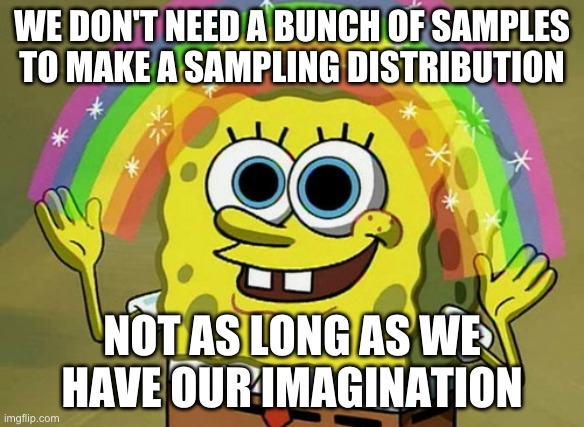
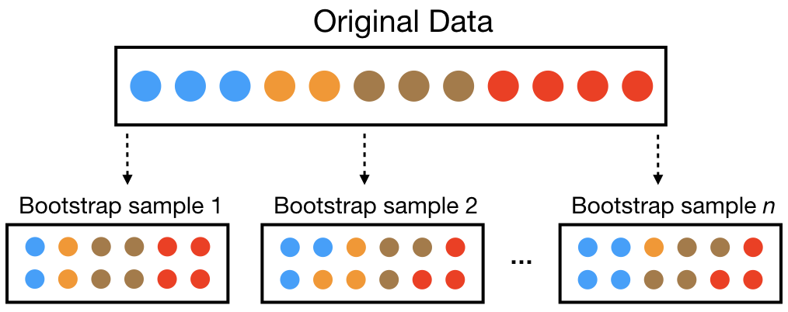

```{r setup, include=FALSE}
knitr::opts_chunk$set(echo = TRUE, warning = F, message = F, fig.retina = 5, fig.align = 'center', fig.height = 3, fig.width = 3)
library(dplyr)
library(tibble)
library(ggplot2)
library(prettydoc)
library(data.table)
library(ggpubr)
library(car)
library(boot)
library(tidyverse)
library(infer)
```

<style>
  @import url(https://fonts.googleapis.com/css?family=Fira+Sans:300,300i,400,400i,500,500i,700,700i);
  @import url(https://cdn.rawgit.com/tonsky/FiraCode/1.204/distr/fira_code.css);
  @import url("https://use.fontawesome.com/releases/v5.10.1/css/all.css");
  
  body {
    font-family: 'Fira Sans','Droid Serif', 'Palatino Linotype', 'Book Antiqua', Palatino, 'Microsoft YaHei', 'Songti SC', serif;
  }
  
  /* Make bold syntax compile to RU-red */
  strong {
    color: #DE1144;
  }

</style>


# Incertidumbre

Tienes una muestra y has obtenido una estimación, y quieres comunicar la precisión de dicha estimación. Dado que las estimaciones basadas en muestras varían por azar, es irresponsable y engañoso presentar una estimación sin describir la **incertidumbre** asociada, por ejemplo informando del **error estándar** u otras medidas de variabilidad.

 
## Generar una distribución muestral

**Pregunta:**  
Normalmente solo tenemos **una** muestra, no toda la población. Entonces, ¿cómo generamos una distribución muestral?

**Respuesta:**  
¡Con nuestra imaginación!

<center>

</center>

### ¿Qué herramientas pueden usar nuestra imaginación?

- Podemos utilizar **trucos matemáticos** que conectan la variabilidad de nuestra muestra con la incertidumbre de nuestra estimación.  
- Podemos **simular** el proceso que creemos que generó nuestros datos.  
- Podemos **re-muestrear** a partir de nuestra muestra mediante **bootstrapping**: lo que haremos en esta práctica.

<hr>

# Bootstrap

## Remuestreo de nuestra muestra (Bootstrapping)

> *Aunque la estadística no ofrece una píldora mágica para las investigaciones científicas cuantitativas, el bootstrap es el mejor analgésico estadístico jamás creado.*  
> — **Xiao-Li Meng**  
> citado en Cochran (2019)  “What Is the Bootstrap?” *Significance* 16 (1): 8–9. https://doi.org/10.1111/j.1740-9713.2019.01225.x.

Solo tenemos una muestra, pero necesitamos imaginar nuevos remuestreos como si vinieran de la población.  
Una forma de construir una **distribución muestral** en esta situación es asumir que nuestra muestra es una **representación razonable de la población**, y remuestrear a partir de ella.

Por supuesto, si simplemente volviéramos a recoger todos los valores observados sin más, obtendríamos exactamente la misma estimación que antes.  Por eso hacemos **remuestreo con reemplazo**, y calculamos una estimación a partir de ese remuestreo. Es decir, hacemos lo siguiente:

1. Elegir una observación de la muestra de forma aleatoria.  
2. Registrar su valor.  
3. Devolverla a la “bolsa” (reemplazo).  
4. Volver al paso (1) hasta obtener tantas observaciones remuestreadas como el tamaño original de la muestra.  
5. Calcular una estimación a partir de este nuevo conjunto de observaciones.

<center>

</center>

Al finalizar este procedimiento, tenemos una **réplica bootstrap**.

## 🐒🧠 Centros del lenguaje en chimpancés

Vamos a trabajar con los datos de 20 chimpancés del estudio de [Cantalupo y Hopkins (2001)](https://www.nature.com/articles/35107134). Este conjunto de datos contiene información sobre la **asimetría cerebral** en chimpancés, centrada en el **Área de Brodmann 44 (BA44)**, que en humanos forma parte del área de Broca, importante para el lenguaje.

Cada fila del dataset corresponde a un chimpancé e incluye:

- **chimpName:** nombre del individuo.  
- **sex:** sexo del individuo (M = macho, F = hembra).  
- **asymmetryScore:** medida de asimetría del BA44 entre hemisferio izquierdo y derecho.  
  - Valores **positivos** indican mayor volumen/actividad en el hemisferio izquierdo.  
  - Valores **negativos** indican mayor volumen/actividad en el hemisferio derecho.  
  - Valores **cercanos a 0** indican simetría entre hemisferios.

Estos datos permiten estudiar la **lateralización cerebral** en chimpancés y compararla con la de los humanos.

Los datos están disponibles en: https://raw.githubusercontent.com/marta-coronado/biostatistics-uab/refs/heads/main/P/2/chap19e2ChimpBrains.csv

**Nuestra pregunta:** ¿hay evidencia de asimetría en el BA44 de los chimpancés, o es compatible con que, en la población, no haya asimetría?

- $H_0$: la **mediana** poblacional de asimetría es 0 (no hay lateralización).
- $H_A$: la mediana poblacional de asimetría es distinta de 0 (hay lateralización, hacia un lado u otro).

Vamos a contestarla **sin usar ninguna fórmula ni asumir una distribución concreta**, con el intervalo de confianza *bootstrap*. Recuerda lo que vimos con los IC: **si el IC del 95% no contiene el valor de $H_0$, rechazamos $H_0$ al 5% (dos colas)**. Aquí, el valor de $H_0$ es 0.

#### **Paso 1: leer los datos**
Lee el fichero desde este [enlace](https://raw.githubusercontent.com/marta-coronado/biostatistics-uab/refs/heads/main/P/2/chap19e2ChimpBrains.csv), que tiene formato .csv (`read.csv`) y encabezado (`header=TRUE`), y guárdalo en un objeto que se llame `chimp`.

```{r}

```

Comprueba que se ha leído bien: mira las primeras filas (`head(chimp)`) y cuántos chimpancés hay (`nrow(chimp`).

```{r}

```

Vamos a transformar la columna del nombre de los chimpancés (`chimpName`) a factor, para indicar que es una variable categórica.

```{r, eval = F}
chimp$chimpName <- as.factor(chimp$chimpName)
```


#### **Paso 2: crea un histograma**
Visualiza la distribución de la asimetría (`asymmetryScore`) con `ggplot` y `geom_histogram`. [Ejemplo](https://marta-coronado.github.io/biostatistics-uab/T/3/3.VisualizacionDatos.html#26).

```{r fig.width = 5, fig.height = 3.5, eval = F}

# estructura del histograma:
ggplot(dataframe, aes(x = variable_en_eje_x)) +
  geom_histogram()

```

**¿Qué forma tiene la distribución? Con solo 20 datos, ¿te fiarías de asumir que es normal?**

#### **Paso 3: cálculo de la estimación a partir de los datos**

Ahora vamos a calcular una estimación a partir de los datos. Podemos aplicar *bootstrapping* a cualquier tipo de estimador: una media, una mediana, una desviación estándar, una correlación, un estadístico F, una filogenia... lo que sea. Aquí usaremos la **mediana**, que es un buen ejemplo de estadístico sin una fórmula sencilla para su error estándar.

Calcula la **mediana** de la asimetría (`asymmetryScore`) con la función `median()` y guárdala en el objeto `sample_estimate`. Esta mediana será nuestro **estadístico de la muestra**.

```{r}

```

Esta es solo una estimación basada en *nuestra* muestra. No podemos conocer el valor real del parámetro poblacional, pero sí podemos usar **bootstrapping** para entender **cuán lejos** podría estar nuestra estimación del valor verdadero, y en concreto, si 0 es un valor razonable.

#### **Paso 4: re-muestreo de nuestros datos (con reemplazo) para generar una réplica bootstrap**

Primero, vamos a usar la función `sample_n()` para generar una muestra del mismo tamaño que la original.

- El muestreo será **con reemplazo**, es decir, cada observación vuelve a la bolsa después de ser seleccionada.
- Tomamos una muestra re-muestreada del **mismo tamaño** que la muestra original, no un subconjunto más pequeño.
  - Para obtener el tamaño de la muestra original, podemos usar la función `nrow` sobre la tabla de datos, ya que contará el número de filas que tenemos.

Completa los "???":

```{r eval = FALSE}
library(dplyr)

resampled_chimps <- chimp  %>% 
  sample_n(size = ???, replace = ???)

```

Para confirmar que el re-muestreo **con reemplazo** funcionó, podemos comprobar que **algunos individuos aparecen más de una vez** y que **otros no aparecen en la muestra re-muestreada**. Ejecuta el siguiente bloque de código y visualiza el gráfico que genera:

```{r eval = FALSE, fig.width = 5, fig.height = 3.5}
library(ggplot2)

resampled_chimps                   %>%
  group_by(chimpName, .drop=FALSE)        %>%   # .drop = FALSE  significa que mantenemos el conteo para los individuos con cero, en lugar de perderlos
  tally(sort = TRUE)               %>%   # contar cuántas veces aparece cada individuo en el remuestreo, y ordenar de mayor a menor
  mutate(id = fct_reorder(chimpName, n, .desc = TRUE)) %>%  # indicamos a R que queremos listar los números en orden de número de observaciones, no de 1 a n
  ggplot(aes(x=id, y = n)) +      # configurar el ggplot
  geom_col() +                     # crear un gráfico de barras
   labs(title = "Distribución de los individuos remuestreados en nuestro bootstrap",
       x = "Chimpancé", y = "# veces remuestreado") +
    theme(axis.text.x = element_text(angle = 90, hjust = 1, vjust = 0.5))

```

#### **Paso 5: estimación a partir de los datos remuestreados**

Ahora que hemos verificado que el remuestreo **con reemplazo** funcionó correctamente (algunos individuos aparecen varias veces y otros no aparecen), vamos a calcular una estimación a partir de estos datos remuestreados.

Calcula la **mediana** de la asimetría usando los datos remuestreados (`resampled_chimps`):

```{r}

```

**¿Coincide con la mediana de la muestra original? ¿Por qué crees que no?**

#### **Paso 6: repetir el proceso 10.000 veces**

Ahora vamos a repetir el proceso muchas veces (**10000**) utilizando la función `rep_sample_n()`, que permite indicar el número de repeticiones (`rep`) que queremos.

Completa los "???":

```{r eval = F}
library(infer)

many_resampled_chimps <- chimp  %>%
  rep_sample_n(size =  ???, replace = ???, reps = ???)

View(many_resampled_chimps)
```

**¿Cuántas filas tiene la tabla resultante? ¿Por qué?** (Fíjate en la columna `replicate`.)

<i class="fa fa-key"></i>: utilitza la función `nrow(df)`.

```{r}

```


#### **Paso 7: calcular la mediana de cada réplica**

Con la función `summarize()` calcula la mediana de cada réplica. Para eso, primero agrupa con `group_by` por réplica (`replicate`) y luego calcula la mediana de `asymmetryScore` con `summarize` y `median`. [Ejemplo](https://marta-coronado.github.io/biostatistics-uab/T/2/2.IntroR.html#66). Guarda el resultado en `chimp_boot`, llamando `median_asymmetry` a la columna con las medianas.

```{r}

```

**¿Cuántas filas tiene la tabla resultante `chimp_boot`? ¿Por qué?**


#### **Paso 8: visualización de la distribución bootstrap**

Genera un histograma para **visualizar la distribución de las medianas bootstrap**.

```{r fig.width = 5, fig.height = 3.5}

```

Teníamos una muestra, no la población completa, pero hicimos **remuestreo con reemplazo** para generar una **distribución muestral**. Este histograma muestra el **error muestral esperado** de una población que podría haber generado nuestra muestra. Podemos usar esto para tener una idea del **error de muestreo esperado** en la población real, que no exploramos más allá de esta muestra.

> Nota: Esto es una **buena guía**, pero no es infalible.  
> Como partimos de una muestra de la población, la distribución muestral bootstrap **diferirá** de la distribución muestral real de la población, pero sigue siendo una **estimación razonable**.

#### **Paso 9: intervalo de confianza bootstrap**

Podemos estimar un **intervalo de confianza** específico como la región central que contiene esa proporción de réplicas bootstrap.  
Por ejemplo, los **límites que abarcan el 95% central** de las réplicas bootstrap, dejando fuera las réplicas más extremas, definen el **intervalo de confianza del 95%**.  

En R, podemos usar la función `quantile()` para encontrar estos **puntos de corte** en la distribución bootstrap. [Ejemplo](https://marta-coronado.github.io/biostatistics-uab/T/1/1.EstadisticaDescriptiva.html#47).

Completa los "???":

```{r eval = F}
chimp_boot_CI <- chimp_boot %>% 
  reframe(CI               = c("lower 95", "upper 95"),  # añade una columna para indicar qué límite del intervalo de confianza estamos calculando
          median_asymmetry = quantile(???, probs = c(???, ???)))  # límites numéricos que separan el 95% central del resto de las réplicas bootstrap

chimp_boot_CI
```

Podemos añadir estos intervalos de confianza a nuestro histograma anterior usando `geom_vline()` con el siguiente código. Añade además una línea roja en 0, el valor de $H_0$.

```{r eval = F, fig.width = 5, fig.height = 3.5}
# código ggplot histograma +  
  geom_vline(xintercept = pull(chimp_boot_CI, median_asymmetry))
```

**¿Cuál es la interpretación correcta del IC anterior?** (Pista: recuerda que el 95% es la confianza del *procedimiento*, no la probabilidad de que la mediana poblacional esté en este intervalo concreto.)

**Completa la conclusión:**

A partir del bootstrap con XXXX réplicas, estimamos que la mediana de asimetría del Área de Brodmann 44 en chimpancés se encuentra entre XXXX y XXXX con un XXXX% de confianza. Dado que el intervalo incluye 0, [sí/no] hay evidencia estadística de asimetría lateralizada.

**Reflexiona:** si el intervalo incluye 0, ¿significa que *no hay* asimetría, o solo que *no tenemos evidencia suficiente* para afirmar que la hay? Con solo 20 chimpancés, ¿qué precaución tomarías con un IC bootstrap por percentiles?


<hr>

# Test de permutación

## 🐒🐒 Ejemplo: ¿son igual de asimétricos los chimpancés y los bonobos?

Con el *bootstrap* vimos que los 20 chimpancés, por sí solos, no daban evidencia de asimetría en el BA44 (el IC incluía el 0). Ahora queremos **comparar dos grupos**: nuestros 20 chimpancés y otros 20 monos, los **bonobos**.

<i class="fa fa-exclamation-triangle"></i> **Los datos de los bonobos son totalmente inventados**, con fines didácticos. No corresponden a ningún estudio real ni dicen nada sobre los bonobos de verdad.

**Nuestra pregunta:** ¿la asimetría del BA44 es distinta en chimpancés y bonobos?

Las hipótesis, que planteamos **antes de mirar los datos**:

- $H_0: \mu_{Chimp} = \mu_{Bonobo}$ (no hay diferencia de asimetría entre especies).
- $H_A: \mu_{Chimp} \neq \mu_{Bonobo}$ (hay diferencia, en cualquier dirección). Es una hipótesis de **dos colas**, porque no tenemos ninguna razón previa para esperar una dirección.

Una hipótesis nula habitual al comparar grupos es que **no hay diferencia entre ellos**. Bajo este modelo, podemos tratar todos los datos como **un único grupo grande** en lugar de dos grupos distintos. Es decir, juntamos los datos, los **mezclamos**, y asignamos al azar los datos a dos grupos con el tamaño original. Este es nuestro **modelo generativo**. Después de cada permutación, calculamos y guardamos el estadístico de prueba del efecto observado (la **diferencia de medias** entre los dos grupos). Cuando hayamos hecho muchas simulaciones, veremos **dónde cae nuestro dato real** respecto a los datos virtuales.

#### **Paso 1: crear el conjunto de datos**
Ejecuta el siguiente código. Crea los 20 bonobos ficticios y los junta con los 20 chimpancés en una sola tabla, `monkeys`, con una columna `species` (especie) y otra `asymmetryScore` (asimetría).

Ejecuta el siguiente código:

```{r eval = F}
# 20 bonobos ficticios (valores inventados)
bonobo <- data.frame(
  species        = "Bonobo",
  asymmetryScore = c(0.71, 0.53, 0.60, 0.38, 0.84, 0.55, 0.05, 0.69, 0.78, 0.50,
                     0.58, 1.04, 0.44, 0.67, 0.53, 0.81, 0.21, 0.59, 0.77, 0.54)
)

# Chimpancés reales + bonobos ficticios
monkeys <- chimp %>%
  transmute(species = "Chimpanzee", asymmetryScore = asymmetryScore) %>%
  bind_rows(bonobo)

head(monkeys)
```

#### **Paso 2: revisar los datos**
Cuenta cuántos individuos hay de cada especie (`n()`) y calcula la **mediana** de la asimetría de cada especie (con `group_by` y `summarize`).

<i class="fa fa-key"></i> [Esta diapositiva](https://marta-coronado.github.io/biostatistics-uab/T/2/2.IntroR.html#66) muestra ambas funciones en acción.

```{r}

```

**¿Qué especie parece más asimétrica? ¿Crees que la diferencia podría deberse al azar?**


#### **Paso 3: visualizar con un boxplot**
Completa el siguiente código para hacer un boxplot de la asimetría (`y`=`asymmetryScore`) por especie (`x`=`species`):

```{r eval = F, fig.width = 5, fig.height = 3.5}

ggplot(monkeys, aes(x = ???, y = ???)) +
    geom_boxplot() 
```

#### **Paso 4: calcular el estadístico observado**
Nuestro **estadístico de prueba** es la diferencia de medias entre las dos especies:

$$
\text{estadístico observado} = \bar{x}_{Chimp} - \bar{x}_{Bonobo}
$$

Guarda la diferencia (Chimp − Bonobo) en el objeto `baseline_difference`. Puedes utilizar los valores calculados anteriormente.

```{r}

```

**¿Qué signo tiene la diferencia? ¿Qué significa?**


#### **Paso 5: generar la distribución nula con permutaciones (10000)**

Vamos a generar el **modelo nulo** con la librería `infer`. Ejecutamos cuatro funciones encadenadas:

- `specify(asymmetryScore ~ species)`: indica la variable respuesta (`asymmetryScore`) y la explicativa (`species`).
- `hypothesize(null = "???")`: indica la hipótesis nula. Aquí, que la asimetría es **independiente** de la especie (las etiquetas son intercambiables).
- `generate(reps = ???, type = "???")`: genera las réplicas. Aquí, **10000 permutaciones** de las etiquetas, sin reemplazamiento.
- `calculate(stat = "diff in means", order = c("Chimp", "Bonobo"))`: calcula la diferencia de medias en cada réplica, en el mismo orden que nuestro estadístico observado.

Ejecuta el código:

```{r eval = F}
library(infer)

perm <- monkeys %>%
  specify(asymmetryScore ~ species) %>%
  hypothesize(null = "independence") %>%
  generate(reps = 10000, type = "permute") %>%
  calculate(stat = "diff in means", order = c("Chimpanzee", "Bonobo"))

head(perm)
```

**¿Cuántas filas tiene `perm`? ¿Qué contiene la columna `stat`?**


#### **Paso 6: visualizar la distribución nula y dónde cae nuestro dato**
Haz un histograma con `perm` de las diferencias de medias permutadas (`x` = `stat`). Prueba con `geom_histogram(binwidth = 0.02)` y ajusta el `binwidth` si hace falta. Guarda el gráfico en `diffs_histogram_plot`.

```{r fig.width = 5, fig.height = 3.5}

```

Acabamos de simular muchos experimentos bajo la hipótesis nula. Estos datos virtuales nos dicen qué diferencias de medias observaríamos **si realmente no hubiera diferencia entre las especies**. Como es de esperar, casi siempre la diferencia está en torno a 0, pero de vez en cuando se ve una diferencia notable **solo por azar**.

Ahora añade dos líneas verticales discontinuas: una en la diferencia observada (`baseline_difference`) y otra en su valor simétrico (`-baseline_difference`), porque nuestra prueba es de **dos colas**. Guarda el resultado en `g1`.

```{r eval = F, fig.width = 5, fig.height = 3.5}
g1 <- diffs_histogram_plot + 
  geom_vline(xintercept = c(baseline_difference, -baseline_difference), 
             linetype   = "dotted", 
             color      = "#2c3e50", 
             linewidth  = 1) 

g1
```

**¿Es nuestro dato extremo respecto a la distribución nula? ¿Qué sugiere esto?**

#### **Paso 7: el umbral del 5%**
El valor 0.05 es un umbral habitual para declarar significación estadística. Como la prueba es de dos colas, el 5% se reparte entre las dos: **2.5% en cada cola**. Calcula los **cuantiles del 2.5% y del 97.5%** de la distribución simulada, con `quantile()`, y guárdalos en `cutoffs`.

```{r eval = F}
cutoffs <- quantile(perm$???, probs = c(???, ???))
cutoffs
```

Añade ahora estas dos líneas continuas a `g1`:

```{r eval = F, fig.width = 5, fig.height = 3.5}
g3 <- g1 +
  geom_vline(xintercept = cutoffs, 
             color      = "#2c3e50", 
             linewidth  = 1)

g3
```

**¿Queda nuestra diferencia observada más allá de esos límites? ¿Qué implica sobre el p-valor?**


#### **Paso 8: calcular el p-valor de dos colas**
Para obtener el p-valor exacto, necesitamos la **proporción de datos simulados que son tan extremos o más que nuestro dato observado, en cualquiera de las dos direcciones**. Por eso usamos el **valor absoluto** de la diferencia. Completa los "???":

```{r eval = F}
n_sims <- nrow(perm)

p_value <- perm %>% 
  filter(abs(stat) >= abs(???)) %>%
  nrow() / n_sims

p_value
```

$$
p\text{-valor} = \frac{\#\{|\text{diff}_{perm}| \geq |\text{diff}_{obs}|\}}{n_{perm}}
$$

> Si ninguna permutación fuera tan extrema, se escribe $p < 1/10000$, **nunca** $p = 0$.


**Completa la conclusión:**

A partir del test de permutación con XXXX permutaciones, la diferencia de medias observada (Chimpanzee - Bonobo) fue de XXXX. El p-valor de dos colas es XXXX, [menor/mayor] que 0.05, por lo que [rechazamos/no rechazamos] la hipótesis nula: [sí/no] hay evidencia de que la asimetría del BA44 es distinta entre chimpancés y bonobos.
