```{r setup, include=FALSE}
options(htmltools.dir.version = FALSE)
#knitr::include_graphics()
knitr::opts_chunk$set(
  cache = TRUE,
  echo = TRUE,
  message = FALSE, 
  warning = FALSE,
  hiline = TRUE,
  fig.retina = 5
)
library(ggplot2)
library(readr)
library(knitr)
#pagedown::chrome_print("PresentacionBioestadistica.html")
```

```{r xaringan-themer, include=FALSE, warning=FALSE}
library(xaringanthemer)
style_mono_accent(
  base_color = "#1c5253", link_color =  "#DE1144", code_inline_color = "#DE1144",
  header_font_google = google_font("Josefin Sans"),
  text_font_google   = google_font("Montserrat", "400", "400i"),
  code_font_google   = google_font("Roboto Mono"),
    
)
```


```{r xaringanExtra-clipboard, echo=FALSE}
library(xaringanExtra)
htmltools::tagList(
  xaringanExtra::use_clipboard(
    button_text = "<i class=\"fa fa-clipboard\"></i>",
    success_text = "<i class=\"fa fa-check\" style=\"color: #90BE6D\"></i>",
  ),
  rmarkdown::html_dependency_font_awesome()
)
```


class: animated, fadeIn
## Contacto

<div style="margin-top: 20vh; text-align:center;">

| Marta Coronado Zamora | David Castellano | 
|:-:|:-:|
| <a href="mailto:marta.coronado@uab.cat"><i class="fa fa-paper-plane fa-fw"></i> marta.coronado@uab.cat</a> | <a href="mailto:david.castellano@uab.cat"><i class="fa fa-paper-plane fa-fw"></i>&nbsp; david.castellano@uab.cat</a> | 
| <a href="https://bsky.app/profile/geneticament.bsky.social"><i class="fab fa-bluesky fa-fw"></i>&nbsp; @geneticament.bsky.social</a> |                 <a href="https://bsky.app/profile/castellanoed.bsky.social"><i class="fab fa-bluesky fa-fw"></i>&nbsp; @castellanoed.bsky.social</a> |
| <a href="https://www.uab.cat"><i class="fa fa-map-marker fa-fw"></i>&nbsp; Universitat Autònoma de Barcelona</a> |    <a href="https://gutengroup.mcb.arizona.edu/"> <i class="fa fa-map-marker fa-fw"></i>&nbsp; University of Arizona</a> |


<style>
.title-slide {
  background-image: url('img/1.png');
  background-size: 100%;
}
</style>


---
class: animated, fadeIn
# Visión general del curso

#### **1. Fundamentos de bioestadística y visualización de datos**
- Introducción a la bioestadística y estadística descriptiva
- Introducción a la programación con `R` y visualización de datos con `ggplot2`

#### **2. Probabilidad e inferencia estadística**

- Introducción a probabilidad: distribución binomial y normal (en `R`)
- Proceso científico, hipótesis, introducción a inferencia estadística

#### **3. Comparaciones y análisis de datos**

- T-tests (uno y dos grupos), ANOVA (uno y dos factores), ANCOVA, regresión simple y múltiple, análisis de datos categóricos y tests no paramétricos

#### **4. Aplicaciones avanzadas y bioestadística actual**

- Introducción a estadística Bayesiana

---
class: animated, fadeIn

# Objetivos de aprendizaje

#### 1. Una comprensión sólida de la bioestadística básica
- Tener una visión general de los métodos disponibles  
- Ser capaz de valorar la aplicabilidad de cada método  

#### 2. Competencia básica en el uso de `R`
- Conocer los comandos básicos y cómo funcionan  
- Ser capaz de preparar conjuntos de datos biológicamente relevantes para su análisis y visualización 
- Poder aplicar métodos estadísticos básicos a esos conjuntos de datos  

#### 3. Diseño de investigación
- Comprender cómo formular hipótesis contrastables  
- Conocer la importancia de aplicar enfoques estadísticos adecuados en investigación  
- Ser capaz de evaluar críticamente los métodos estadísticos empleados en publicaciones científicas

---
class: animated, fadeIn
# Organización

#### **1. Clases de teoría**: 30h de teoría - diapositivas interactivas (`Rmd`).
#### **2. Seminarios**: 11 seminarios - resolución de problemas y dudas.
#### **3. Prácticas**: 6 prácticas de ordenador. Aplicación de `R` a datos reales.

.pull-left[
### Diapositivas interactivas 

**Documentos de <i class="fab fa-r-project fa-fw"></i></i> interactivos**  

Código de `R` ejecutable dentro de la diapositiva.

```{r, echo=TRUE}
values <- c(31.45, 78.1, 93.6, 12.3)
mean(values)
```
]

.pull-right[
```{r, echo = F, fig.height=4, fig.width=6}

library(ggplot2)

# Simular datos
set.seed(123)
df <- data.frame(
  x = rnorm(20, mean = 50, sd = 10),
  y = rnorm(20, mean = 50, sd = 10)
)

# Graficar correlación
ggplot(df, aes(x = x, y = y)) +
  geom_point(color = "#69b3a2", size = 4, alpha = 0.7) +   # puntos grandes y pastel
  geom_smooth(method = "lm", color = "#404080", se = TRUE, fill = "#B0C4DE", alpha = 0.3) + # línea de tendencia con banda
  labs(
    x = "X",
    y = "Y"
  ) +
  theme_minimal(base_size = 16) +
  theme(
    plot.background = element_rect(fill = "#FFF8F0", color = NA),
    panel.grid.minor = element_blank(),
    panel.grid.major = element_line(color = "#E0E0E0")
  )
```

]


---
class: animated, fadeIn
# Evaluación

#### **Exámenes** (70%)
- Primer parcial (30%)
- Segundo parcial (40%)

#### **Seminarios** (15%)
- Participación en clase (5%)
- Presentación en grupo (10%)

#### **Prácticas** (15%)
- Participación en clase (5%)
- Exámen práctico (10%)


---
class: animated, fadeIn

# Lecturas útiles

<center>
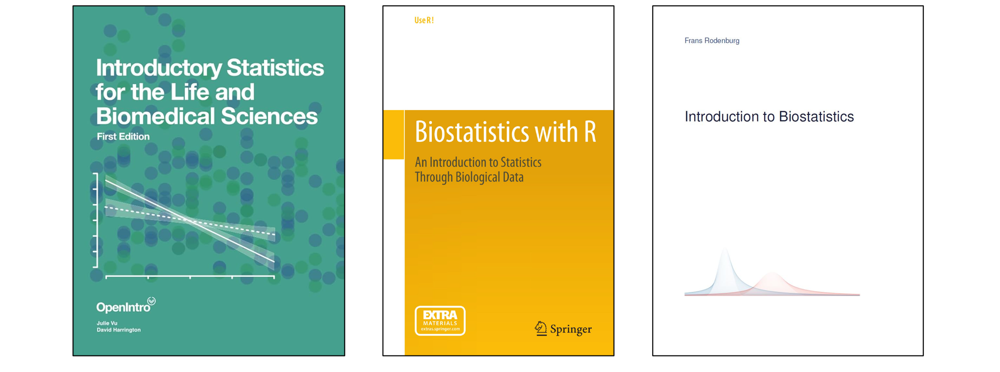</img>
</center>
<br><br>
Si quieres más recursos para la asignatura, pídenoslo!

---

layout: false
class: left, bottom, inverse, animated, bounceInDown
# 01
## La importancia de la estadística

---
class: animated, fadeIn

# *When mistakes happen*
.pull-left[
Los artículos científicos pasan por un sistema de revision riguroso (*peer-review system*), que puede no ser infalible.

]
.pull-right[
<center>
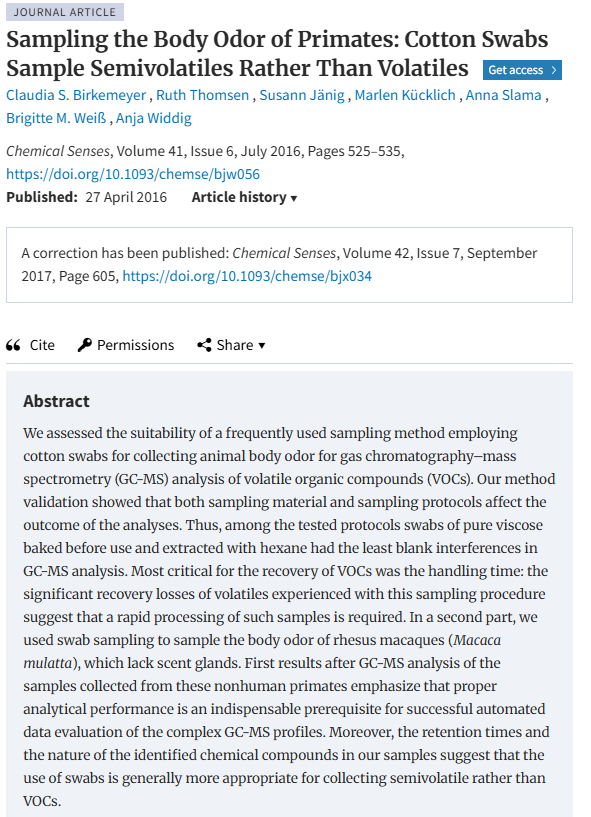</img>

]

---
class: animated, fadeIn

# *When mistakes happen*
.pull-left[
Los artículos científicos pasan por un sistema de revision riguroso (*peer-review system*), que puede no ser infalible.

Un ejemplo:
- Birkenmeyer *et al.* publicaron un artículo con errores en [2016](https://doi.org/10.1093/chemse/bjw056).

]
.pull-right[
<center>
</img>

]

---
class: animated, fadeIn

# *When mistakes happen*
.pull-left[
Los artículos científicos pasan por un sistema de revision riguroso (*peer-review system*), que puede no ser infalible.

Un ejemplo:
- Birkenmeyer *et al.* publicaron un artículo con errores en [2016](https://doi.org/10.1093/chemse/bjw056).

El error en los datos fue detectado por la Dra. B. M. Weiß a principios de [2017](https://doi.org/10.1093/chemse/bjx034).
- Se publicó una fe de erratas ([*corrigendum*](https://doi.org/10.1093/chemse/bjx034)).
- Se subió una versión corregida del artículo.


]
.pull-right[
<center>
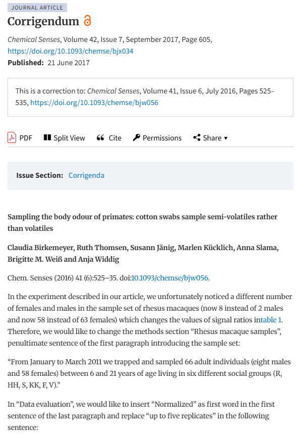</img>

]

---
class: animated, fadeIn

# *When mistakes happen*
.pull-left[
Los artículos científicos pasan por un sistema de revision riguroso (*peer-review system*), que puede no ser infalible.

Un ejemplo:
- Birkenmeyer *et al.* publicaron un artículo con errores en [2016](https://doi.org/10.1093/chemse/bjw056).

El error en los datos fue detectado por la Dra. B. M. Weiß a principios de [2017](https://doi.org/10.1093/chemse/bjx034).
- Se publicó una fe de erratas ([*corrigendum*](https://doi.org/10.1093/chemse/bjx034)).
- Se subió una versión corregida del artículo.

Ninguna de las conclusiones del trabajo cambió.

**No pasa nada grave siempre que notifiques los errores y des las correcciones.**

]
.pull-right[
<center>
</img>

]


---
class: animated, fadeIn

## Prácticas fraudulentas: el caso de Andrew Wakefield

<center>


---
class: animated, fadeIn

## Prácticas fraudulentas: el caso de Andrew Wakefield

.pull-left[
- Afirmó haber encontrado una relación entre vacunas y autismo (artículo de <a href="https://doi.org/10.1016/s0140-6736(97)11096-0">1998</a>)  

]

.pull-right[
<div style="display: flex; align-items: center;">
<center>


</div>
]

---
class: animated, fadeIn

## Prácticas fraudulentas: el caso de Andrew Wakefield

.pull-left[
- Afirmó haber encontrado una relación entre vacunas y autismo (artículo de <a href="https://doi.org/10.1016/s0140-6736(97)11096-0">1998</a>)  

- El artículo fue **retractado** por la editorial *The Lancet* 12 años después  

- El Consejo Médico General de Gran Bretaña le revocó la licencia médica  

- Su carrera académica terminó, a pesar de contar con una gran comunidad de seguidores en EE.UU., Australia y Brasil  
]

.pull-right[
<div style="display: flex; align-items: center;">
<center>
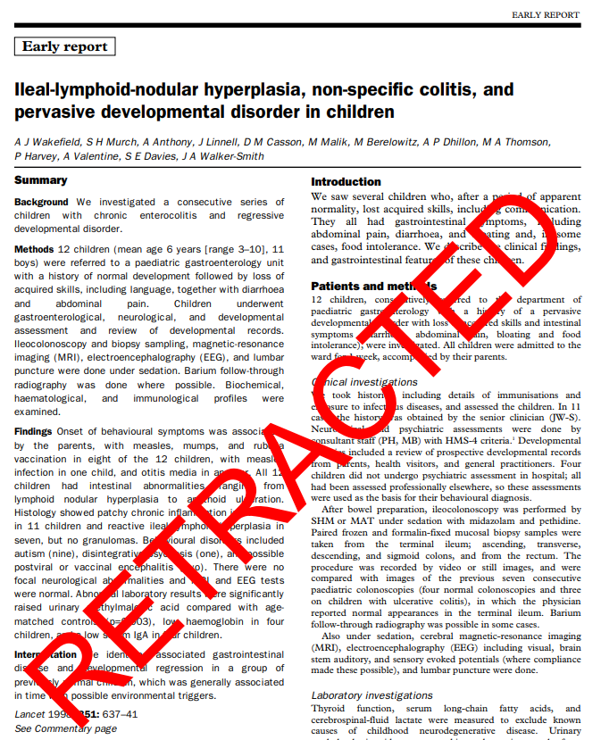

</div>
]

---
class: animated, fadeIn

## Prácticas fraudulentas: el caso de  Diederik Stapel

.pull-left[
- Manipuló datos y fabricó estudios enteros

- Fue despedido de su puesto como profesor en la Universidad de Tilburg

- 58 artículos retractados

- También tuvieron que retractarse artículos de otros co-autores
<center>


]

.pull-right[
<div style="display: flex; align-items: center;">
<center>
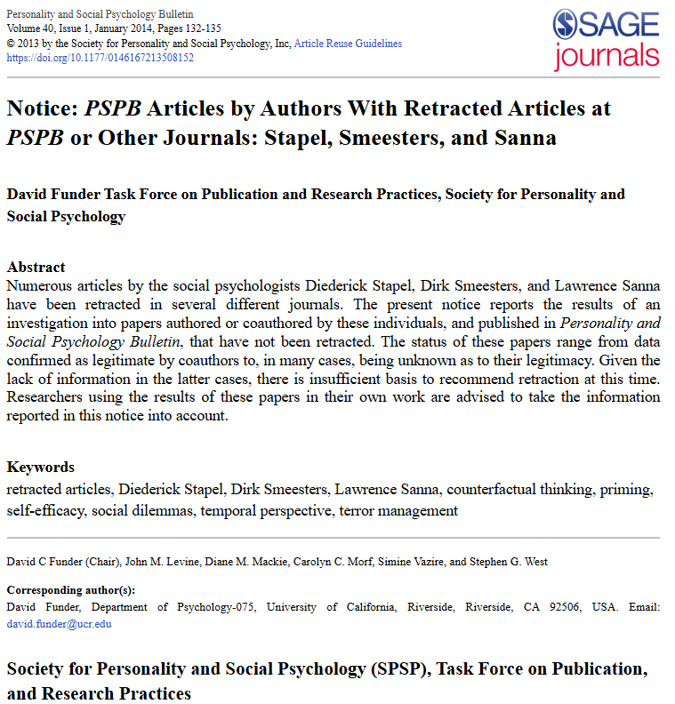

</div>
]

---
class: animated, fadeIn

## Prácticas fraudulentas: el caso de  Diederik Stapel

.pull-left[
- Manipuló datos y fabricó estudios enteros

- Fue despedido de su puesto como profesor en la Universidad de Tilburg

- 58 artículos retractados

- También tuvieron que retractarse artículos de otros co-autores

<br>
<i class="fa fa-warning fa-fw"></i> **Las prácticas fraudulentas conscientes pueden costarte la carrera, desacreditar a tu institución y a tu campo de investigación, e incluso perjudicar seriamente la carrera de colaboradores.**
]

.pull-right[
<div style="display: flex; align-items: center;">

<center>


</div>
]

---
class: animated, fadeIn

# Uso incorrecto de la estadística

<br>
### Falta de conocimiento estadístico

**Aplicar métodos estadísticos a datos para los que no están pensados**
→ Los métodos pueden "fallar"

**Comprensión defectuosa de la metodología** → Conclusiones incorrectas

### Falta de conocimiento biológico

**Identificación de asociaciones sin sentido pero estadísticamente significativas** → *p-hacking*

**Desconocimiento sobre cómo formular hipótesis contrastables y factibles** → Pérdida de tiempo

---
class: animated, fadeIn

# Advertencia

.pull-left[
**A menudo en biología tenemos ideas preconcebidas sobre lo que esperamos encontrar** → ¿Ajustar los datos para que coincidan con las expectativas?

<br>

<div style="background-color: #fff9c4;
  border-left: 6px solid #fbc02d;
  padding: 12px 16px;
  font-size: 1.2em;
  margin: 0 auto;">
  No dejar que el sesgo personal influya en el análisis.
</div>

Los estudios biológicos sin análisis estadísticos **rigurosos** son casi impublicables.


]

.pull-right[
<div style="display: flex; align-items: center;">
<center>
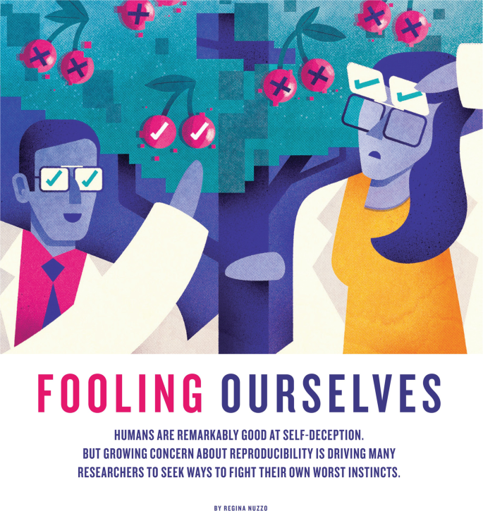

</div>
<small><a href="https://doi.org/10.1038/526182a">Nuzzo, R. How scientists fool themselves – and how they can stop. Nature 526, 182–185 (2015)</a>
]


---
layout: false
class: left, bottom, inverse, animated, bounceInDown

# 02
## Terminología

---
class: animated, fadeIn

# _ The big picture of statistics_

Toda investigación estadística comienza con una **pregunta de investigación**.  
El proceso continúa con los siguientes pasos:  

.pull-left[
**1. Producir datos**:  un buen muestreo y diseño de estudio son esenciales. Importancia de la aleatorización (permite utilizar las leyes de la probabilidad)

**2. Explorar los datos**: estadística descriptiva (mostrar y resumir los datos, numérica y gráficamente)

**3. Probabilidad**: conecta la muestra con la población, nos dice qué resultados son más o menos esperables por azar

**4. Extraer conclusiones**: estadística inferencial para llegar a conclusiones sobre la población a partir de una muestra
]

.pull-right[
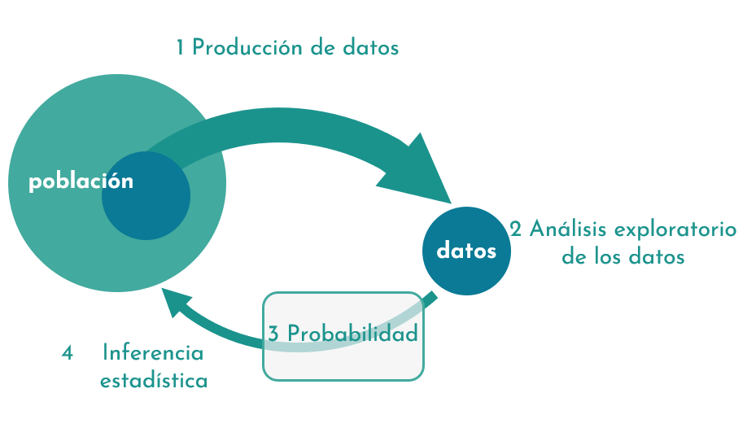</img>
]

---
class: animated, fadeIn

# Población *vs.* muestra

.pull-left[**Población**: describe el total de todos los valores existentes de una variable según una pregunta de investigación determinada. Esto incluye datos no medidos.
]

.pull-right[**Muestra**: describe el total de todos los valores disponibles de una variable para un análisis determinado. Solo puede incluir datos medidos.
]

<br>

--

*Ejemplo*:
.right-column[
- En un experimento, crías una colonia de hormigas de exactamente 10.000 individuos.

- Te interesa la fuerza promedio de la mandíbula de las hormigas dentro de la colonia.

- El problema: No es posible medir a los 10.000 individuos.

- La solución: Tomar medidas sobre una **muestra** (por ejemplo, 1.000 individuos) dentro de la **población** (10.000 individuos).
]


.left-column[
<br>
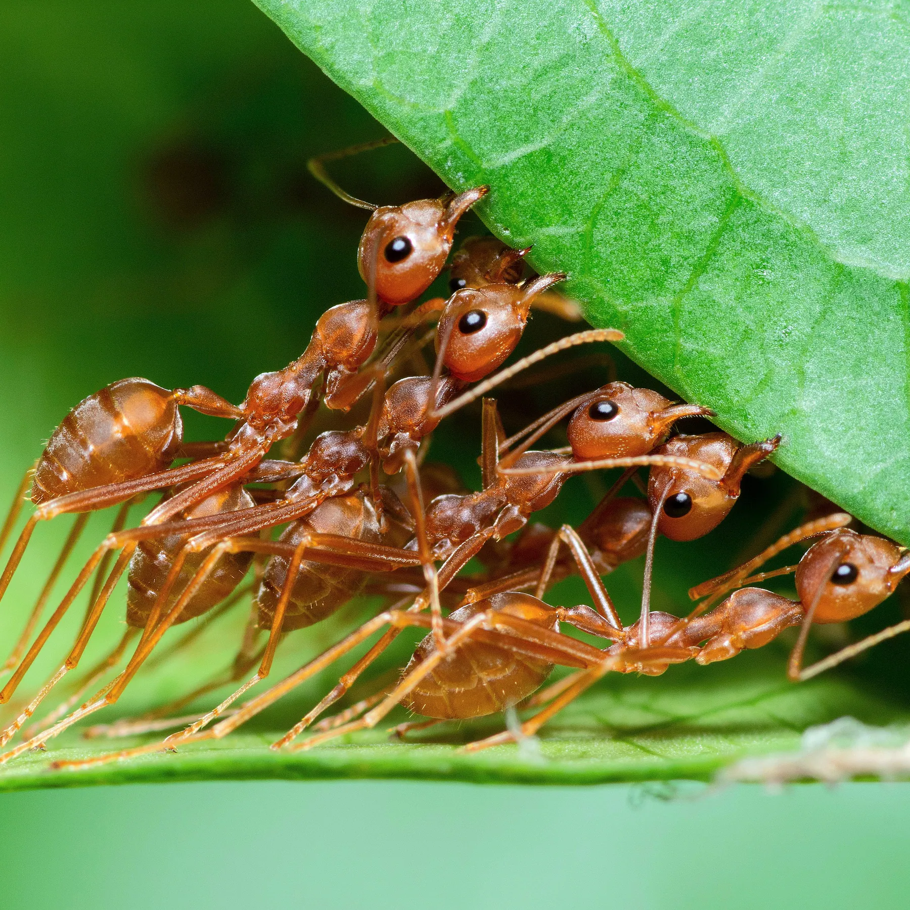</img>
]

---
class: animated, fadeIn

# Señal y ruido

- **Señal:** información significativa que queremos detectar.

- **Ruido:** variación aleatoria que interfiere con la señal.  

--

<br>

*Ejemplo*:

- **Hipótesis**: "La dieta rica en proteína aumenta la fuerza de la mandíbula en las hormigas" 

  - **Señal:** diferencia real en la fuerza promedio de la mandíbula entre colonias con distinta dieta  
  
  - **Ruido:** variación por edad de las hormigas, errores de medición, diferencias individuales o microambiente
  
  
---
class: animated, fadeIn

# ¿Qué es la estadística?

- La estadística es la **ciencia de entender datos** y de **tomar decisiones frente a la variabilidad** y la **incertidumbre**.
  
- Nos ayuda a separar **señal** (información significativa) de **ruido** (variación aleatoria).

--

.pull-left[

#### Variabilidad

- La **variabilidad** es la diferencia natural entre observaciones.  

- Ejemplos:  
  - Altura de plantas en el mismo experimento  
  - Tiempo de desarrollo de larvas de mosca  
  - Fuerza de la mandíbula en hormigas de la misma colonia
  
]

.pull-right[

#### Incertidumbre

- La **incertidumbre** refleja **lo poco que sabemos con certeza** sobre un resultado o estimación.  

- Ejemplos:

  - Muestra no significativa
  - Resolución limitada en el instrumento de medición
  - Medir solo 1.000 hormigas de una colonia de 10.000 

]
- La estadística nos permite **cuantificar y entender la variabilidad** y la **incertidumbre**.


???
variabilidad: Range, variance, and standard deviation are used to quantify variability. 

Incertidumbre: - Se puede cuantificar con: intervalos de confianza, desviación estándar, probabilidad.  
- Incluso un buen experimento tiene incertidumbre.  

---
class: animated, fadeIn

## ¿Qué hace que los datos sean realmente aleatorios?

### Aleatorización
- La aleatorización es una de las prácticas más importantes en los estudios biológicos.  
- Un procedimiento de muestreo es **aleatorio** cuando **cualquier miembro de la población** tiene la **misma probabilidad** de ser seleccionado en la muestra.  

.pull-left[
### Recolección de datos
- Numerar todas las unidades dentro del diseño experimental.  

- Seleccionar aquellas unidades que correspondan a **números aleatorios**.  
]

.pull-right[
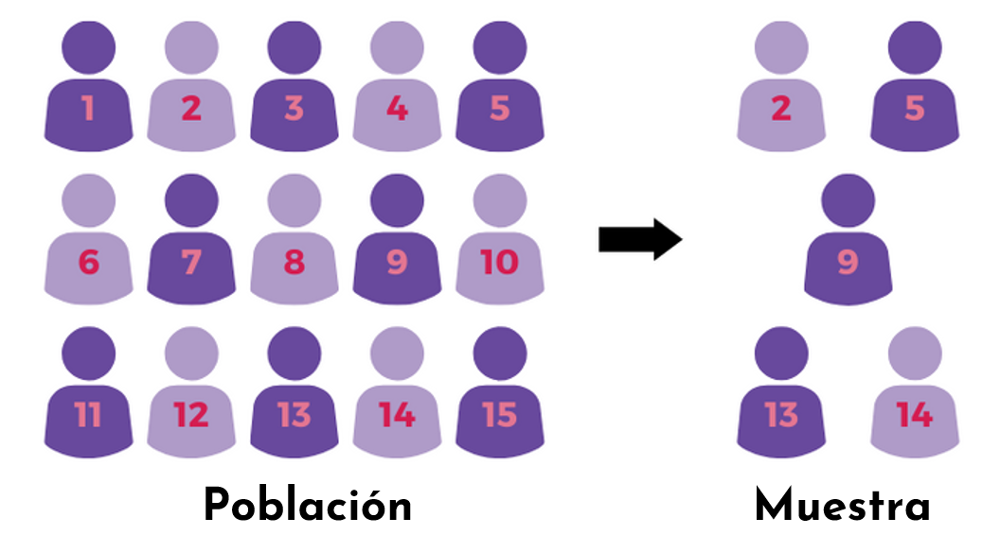</img>

]


---
class: animated, fadeIn

## Muestreo aleatorio en R

1. Hacemos el muestreo **reproducible** con `set.seed()`  

2. Definimos una **población**  

3. Usar la función `sample()` para crear una **muestra aleatoria**  

--

```{r, echo=TRUE}
# Hacemos que sea reproducible
set.seed(42)

# Definimos una población
pop <- c(1:15)
pop
```

--

```{r, echo=TRUE}
# Obtenemos una muestra aleatoria
sam <- sample(pop, 5, replace = FALSE)
sam
```

---
class: animated, fadeIn

# El poder de R

.pull-left[

R no es solo un **lenguaje de programación**, es un **entorno para estadística** y **creación de gráficos**:

- Código abierto, con una gran comunidad

- Fácil de instalar en cualquier plataforma

- Gestión de grandes conjuntos de datos

- Facilidad para crear gráficos

- Herramientas integradas

- Lenguaje de programación simple y efectivo

**_All-in-one_**!

]

.pull-right[
<center>
</img>
</center>
]

---
class: animated, fadeIn

# El poder de R

.pull-left[

R no es solo un **lenguaje de programación**, es un **entorno para estadística** y **creación de gráficos**:

- Código abierto, con una gran comunidad

- Fácil de instalar en cualquier plataforma

- Gestión de grandes conjuntos de datos

- Facilidad para crear gráficos

- Herramientas integradas

- Lenguaje de programación simple y efectivo

**_All-in-one_**!

]

.pull-right[
<center>
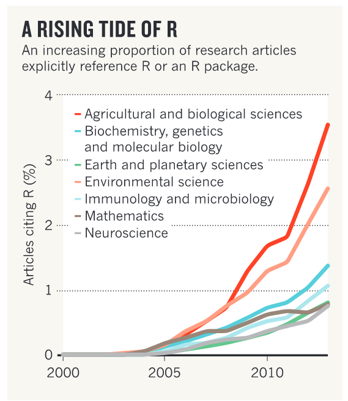</img>
<br><font size="3"> <a href="https://www.nature.com/articles/517109a">Tippmann, S. Programming tools: Adventures with R. <br>Nature 517, 109–110 (2015)</a>.</font> 
</center>
]

---
class: animated, fadeIn
# ¿Qué es RStudio?

.pull-left[
Es un _entorno de desarrollo integrado_ (**IDE**) para R: proporciona un espacio con muchas funcionalidades para usar R de manera fácil y efectiva.

- GUI, no solo terminal (CLI)  

- Ideal para aprender  

- _Código abierto_ y gratuito  

- Disponible para cualquier plataforma

]

.pull-right[
<center>
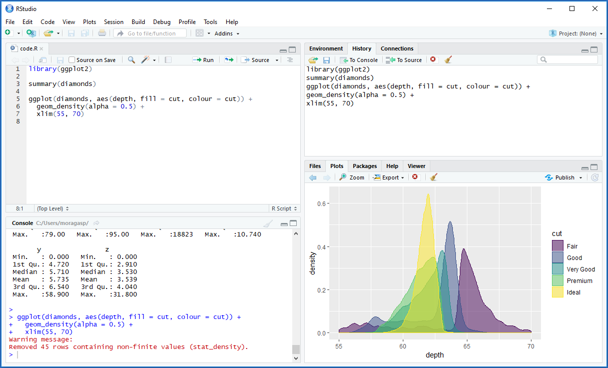</img>
</center>
]
---
class: animated, fadeIn

# Las partes de RStudio

.pull-left[
La GUI de RStudio se divide en **cuatro paneles**:
- **Consola**: donde escribimos los comandos y vemos los resultados. Si usas R sin RStudio, esto es lo que verías (CLI).  

- **Editor de _script_**: donde escribimos los comandos para que queden guardados en un archivo (_script_, `.R`). También se pueden ejecutar los comandos (`Run`).  

- **Environment/History**: muestra todos los objetos activos y el historial de todas las órdenes ejecutadas en la consola.  

- ***Files/Plots/Packages/Help***: podemos ver los archivos que existen en el directorio actual, los gráficos creados, los paquetes instalados y consultar el manual de ayuda.
]

.pull-right[
<center>
</img>
</center>
]

---
class: animated, fadeIn

# Instalando R y RStudio

- R está disponible en [https://cloud.r-project.org/](https://cloud.r-project.org/)  para Windows, Linux y MacOS.

- RStudio está disponible en [https://posit.co/download/rstudio-desktop/] (https://posit.co/download/rstudio-desktop/)  para Windows, Linux y MacOS.

### ¿Y si necesito ayuda?

- Foros especializados y muy activos:  
  - [https://stackoverflow.com/](https://stackoverflow.com/)  
  - [https://stackexchange.com/](https://stackexchange.com/)  
  

---
class: animated, fadeIn

# La evolución del código

.pull-left[
- Tu código y tus prácticas de programación **evolucionan** con el tiempo  

- Comenta cada línea de código

- Un código **elegante** hace que un análisis sea más fácil de reproducir  

- Evita el **hard-coding**!
]
.pull-right[
<center>
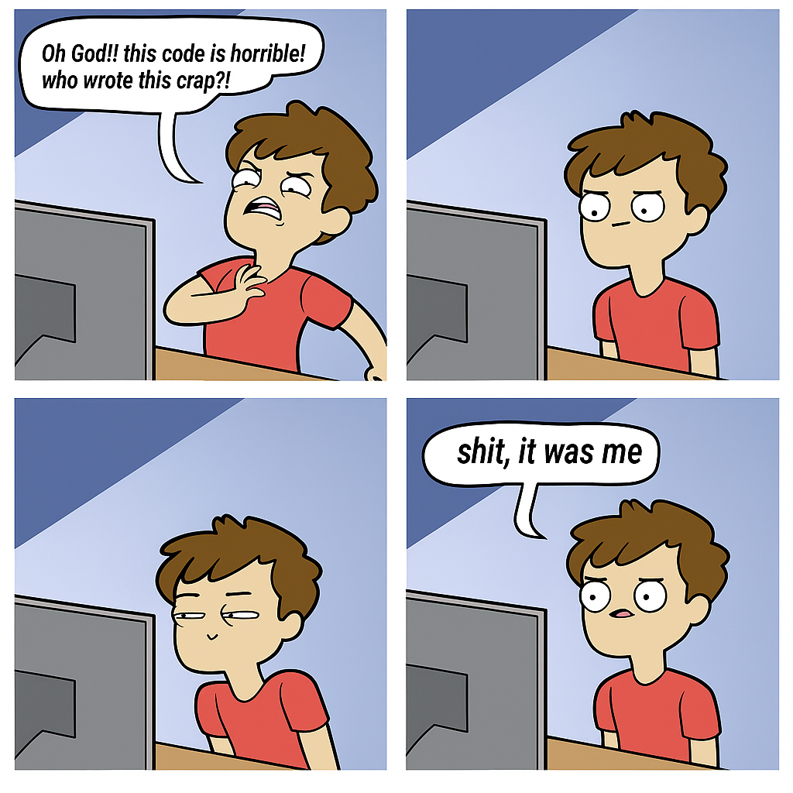</img>
</center>
]

---
class: animated, fadeIn

# Uso de ChatGPT


.pull-left[
- El uso de ChatGPT es bienvenido

- Se espera un uso crítico y reflexivo (no copiar/pegar sin revisar)

- Si lo usas para completar una práctica o entrega, repórtalo


]
.pull-right[
<center>
</img>
</center>
]

---
layout: false
class: left, bottom, inverse, animated, bounceInDown
### Agradecimientos
#### Dr. Hafid Laayouni (profesor de Bioestadística UAB-UPC-UPF), Erik Kusch (Aarhus University)  


