```{r setup, include=FALSE}
options(htmltools.dir.version = FALSE)
#knitr::include_graphics()
knitr::opts_chunk$set(
  cache = TRUE,
  echo = TRUE,
  message = FALSE, 
  warning = FALSE,
  hiline = TRUE
)
library(dplyr)
library(ggplot2)
library(knitr)
# pagedown::chrome_print("S1.html")
```

```{r xaringan-themer, include=FALSE, warning=FALSE}
library(xaringanthemer)
style_mono_accent(
  base_color = "#1c5253", link_color =  "#DE1144", code_inline_color = "#DE1144",
  header_font_google = google_font("Josefin Sans"),
  text_font_google   = google_font("Montserrat", "400", "400i"),
  code_font_google   = google_font("Roboto Mono"),
    
)
```

class: animated, fadeIn
### <i>"El mejor gráfico estadístico jamás dibujado"</i> ~Edward Tufte

<center>


--

El gráfico es notable por su representación en dos dimensiones de seis tipos de datos: el número de tropas de Napoleón; la distancia; la temperatura; la latitud y la longitud; la dirección del viaje; y la ubicación en relación con fechas específicas. <a href="https://en.wikipedia.org/wiki/Charles_Joseph_Minard">Wikipedia</a>.

<style>
.title-slide {
  background-image: url('img/1.png');
  background-size: 100%;
}
</style>

---
layout: false
class: left, bottom, inverse, animated, bounceInDown
# 01
## Una introducción a la visualización de datos

---
class: animated, fadeIn

## Integridad de los gráficos — Edward Tufte (1942-)

.pull-left[
### **Seis principios de Tufte**:

1. **Comparaciones**: Muestra comparaciones para ilustrar contrastes y diferencias.

2. **Causalidad**: Demuestra cómo una o más variables independientes afectan o influyen en las variables dependientes.

3. **Multivariable**: Combina diferentes tipos de datos.

4. **Integración**: Incorpora diversos modos de información.

5. **Documentación**: Incluye atribuciones, títulos detallados y mediciones (escalas).

6. **Contexto**: Describe el estado antes y después.
]

.pull-right[
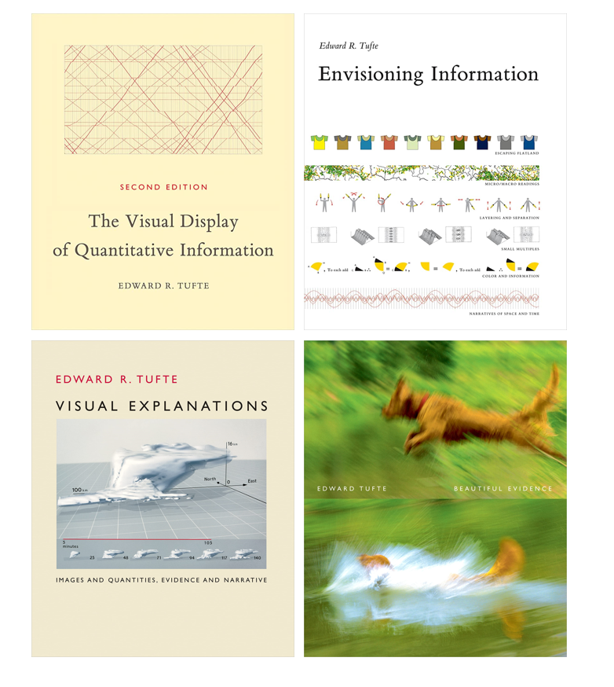
]

---
class: animated, fadeIn

## <i>“Above all, show the data”</i> 


| Chartjunk | Excellence | 
|:-:|:-:|
| Uso excesivo e innecesario de efectos gráficos en los gráficos | Comunicación de ideas complejas con claridad, precisión y eficiencia | 

--
<br>
<center>

<br>
<br>
<i class="fa fa-question-circle"></i> <b>¿Qué problemas identificas en esta figura?</b>
</center>


---

layout: false
class: left, bottom, inverse, animated, bounceInDown
# 02
##  <i>“Above all, show the data”</i> 

---
class: animated, fadeIn

### **Límites justos de los ejes **

Promedio de horas de trabajo/semana (Eurofund 2014).
Gráfico creado por la agencia de desarrollo económico alemana GTAI.  <a src="https://www.gtai.de/GTAI/Navigation/EN/invest,t=motivated-and-dependable-employees,did=214428.html">Fuente</a>.

```{r echo=F, eval=T, fig.height=6, fig.width=7}
# Cargar librerías
library(ggplot2)
library(dplyr)

# Datos (promedio de horas semanales, 2013, fuente Eurofound)
df <- data.frame(
    country = c("Romania", "UK", "Germany", "Poland", "Netherlands",
                "Slovak Republic", "Czech Republic", "EU-28 average", "Spain",
                "Hungary", "Sweden", "Belgium", "Italy", "France"),
    hours = c(41.2, 40.8, 40.4, 39.9, 39.8,
              39.8, 39.7, 39.5, 39.5,
              39.2, 38.6, 38.1, 38.0, 37.4)
)

# Ordenar por horas
df$country <- factor(df$country, levels = df$country[order(df$hours, decreasing = F)])

# --- Figura 1 (estilo original con etiquetas numéricas) ---
p1 <- ggplot(df, aes(x = hours, y = country)) +
  geom_col(fill = "grey80") +
  geom_col(data = filter(df, country == "Germany"), 
           aes(x = hours, y = country), fill = "gold") +
  geom_text(aes(label = hours), hjust = -0.1, size = 4) +
  coord_cartesian(xlim = c(36, 42)) + 
  labs(caption = "Source: Eurofound 2014", x = NULL, y = NULL) +
  theme_minimal(base_size = 18) +
  theme(panel.grid.major = element_blank(),
        panel.grid.minor = element_blank(),
        axis.text.y = element_text(face = ifelse(df$country == "Germany", "bold", "plain")))

p1
 
```


---
class: animated, fadeIn

### **Límites justos de los ejes **

Promedio de horas de trabajo/semana (Eurofund 2014).
Gráfico creado por la agencia de desarrollo económico alemana GTAI.  <a src="https://www.gtai.de/GTAI/Navigation/EN/invest,t=motivated-and-dependable-employees,did=214428.html">Fuente</a>.

```{r echo=F, eval=T, fig.height=5.5, fig.width=13, fig.align="center"}
# Cargar librerías
library(ggplot2)
library(dplyr)

# Datos (promedio de horas semanales, 2013, fuente Eurofound)
df <- data.frame(
    country = c("Romania", "UK", "Germany", "Poland", "Netherlands",
                "Slovak Republic", "Czech Republic", "EU-28 average", "Spain",
                "Hungary", "Sweden", "Belgium", "Italy", "France"),
    hours = c(41.2, 40.8, 40.4, 39.9, 39.8,
              39.8, 39.7, 39.5, 39.5,
              39.2, 38.6, 38.1, 38.0, 37.4)
)

# Ordenar por horas
df$country <- factor(df$country, levels = df$country[order(df$hours, decreasing = F)])

# --- Figura 1 (estilo original con etiquetas numéricas) ---
p1 <- ggplot(df, aes(x = hours, y = country)) +
  geom_col(fill = "grey80") +
  geom_col(data = filter(df, country == "Germany"), 
           aes(x = hours, y = country), fill = "gold") +
  geom_text(aes(label = hours), hjust = -0.1, size = 4) +
  coord_cartesian(xlim = c(36, 42)) + 
  labs(caption = "Source: Eurofound 2014", x = NULL, y = NULL) +
  theme_minimal(base_size = 18) +
  theme(panel.grid.major = element_blank(),
        panel.grid.minor = element_blank(),
        axis.text.y = element_text(face = ifelse(df$country == "Germany", "bold", "plain")))

# Cargar librerías
library(patchwork)


# Datos (promedio de horas semanales, 2013, fuente Eurofound)
df <- data.frame(
    country = c("Romania", "UK", "Germany", "Poland", "Netherlands",
                "Slovak Republic", "Czech Republic", "EU-28 average", "Spain",
                "Hungary", "Sweden", "Belgium", "Italy", "France"),
    hours = c(41.2, 40.8, 40.4, 39.9, 39.8,
              39.8, 39.7, 39.5, 39.5,
              39.2, 38.6, 38.1, 38.0, 37.4)
)

# Ordenar por horas
df$country <- factor(df$country, levels = df$country[order(df$hours, decreasing = F)])

# --- Figura 1 (estilo original con etiquetas numéricas) ---
p2 <- ggplot(df, aes(x = hours, y = country)) +
  geom_col(fill = "grey80") +
  geom_col(data = filter(df, country == "Germany"), 
           aes(x = hours, y = country), fill = "gold") +
  geom_text(aes(label = hours), hjust = -0.1, size = 4) +
  labs(caption = "Source: Eurofound 2014", x = NULL, y = NULL) +
  theme_minimal(base_size = 18) +
  theme(panel.grid.major = element_blank(),
        panel.grid.minor = element_blank(),
        axis.text.y = element_text(face = ifelse(df$country == "Germany", "bold", "plain")))

p1 + p2
 
```

<i class="fa fa-info-circle"></i> Las **barras** en un **gráfico de barras** deben (casi) siempre **extenderse al cero** (magnitud absoluta de los valores). No es necesario en gráficos lineares (cambio en la variable dependiente a medida que cambia la variable independiente).


---
class: animated, fadeIn

### **Límites justos de los ejes **
.pull-left[
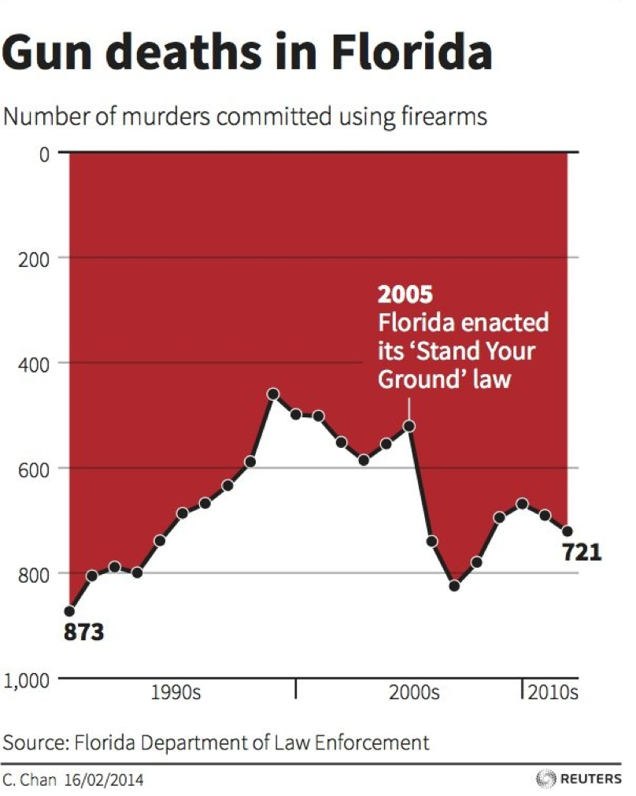
]

--

.pull-right[
- Impresión visual inmediata de que las muertes por armas de fuego disminuyeron drásticamente tras la aprobación de la ley de defensa propia (_"Stand Your Ground"_) en Florida

- **El descenso es una ilusión**
]


---
class: animated, fadeIn

### **Límites justos de los ejes **
<center>


---
class: animated, fadeIn

### **Límites justos de los ejes **

```{r  echo=F, eval=T, fig.height=6, fig.width=7}
temp_df <- data.table::fread("img/combined_temperature.csv")

library(dplyr)
library(ggplot2)

# Average across all countries per year
yearly_avg <- temp_df %>%
  group_by(Year) %>%
  summarise(
    mean_temp = mean(`Annual Mean`, na.rm = TRUE),
    mean_smooth = mean(`5-yr smooth`, na.rm = TRUE)
  )

# Plot
p1<-ggplot(yearly_avg[yearly_avg$Year<2005,], aes(x = Year)) +
  geom_line(aes(y = mean_temp), color = "steelblue", size = 1) +
  labs(
    title = "Temperatura promedio anual",
    y = "Temperatura (°C)",
    x = "Año",
    caption = "Data source: NCEI"
  ) +
  theme_minimal(base_size = 14) + 
    coord_cartesian(ylim = c(0, 110)) +
  scale_y_continuous(breaks=seq(0,110,10)) +
  scale_x_continuous(breaks=seq(1900,2010,25))


# Plot
p2 <- ggplot(yearly_avg[yearly_avg$Year<2005,], aes(x = Year)) +
  geom_line(aes(y = mean_temp), color = "steelblue", size = 1) +
  labs(
    title = "Temperatura promedio anual",
    y = "Temperatura (°C)",
    x = "Año",
    caption = "Data source: NCEI"
  ) +
  theme_minimal(base_size = 14) + 
  scale_x_continuous(breaks=seq(1900,2010,25))

p1
``` 

---

### **Límites justos de los ejes **

```{r  echo=F, eval=T, fig.height=6, fig.width=14}
temp_df <- data.table::fread("img/combined_temperature.csv")

library(dplyr)
library(ggplot2)

# Average across all countries per year
yearly_avg <- temp_df %>%
  group_by(Year) %>%
  summarise(
    mean_temp = mean(`Annual Mean`, na.rm = TRUE),
    mean_smooth = mean(`5-yr smooth`, na.rm = TRUE)
  )

# Plot
p1<-ggplot(yearly_avg, aes(x = Year)) +
  geom_line(aes(y = mean_temp), color = "steelblue", size = 1) +
  labs(
    title = "Temperatura promedio anual",
    y = "Temperatura (°C)",
    x = "Año",
    caption = "Data source: NCEI"
  ) +
  theme_minimal(base_size = 14) + 
    coord_cartesian(ylim = c(0, 110)) +
  scale_y_continuous(breaks=seq(0,110,10)) +
  scale_x_continuous(breaks=seq(1900,2030,25))


# Plot
p2 <- ggplot(yearly_avg, aes(x = Year)) +
  geom_line(aes(y = mean_temp), color = "steelblue", size = 1) +
  labs(
    title = "Temperatura promedio anual",
    y = "Temperatura (°C)",
    x = "Año",
    caption = "Data source: NCEI"
  ) +
  theme_minimal(base_size = 14) + 
  scale_x_continuous(breaks=seq(1900,2030,25))

p1 + p2
```

Cuando hablamos de temperatura global, un cambio de 1-2ºC es muy significativo.<br>
<small><a href="https://doi.org/10.1126/science.abn7950">Armstrong McKay, David I. (2022). "Exceeding 1.5°C global warming could trigger multiple climate tipping points". Science. 377 (6611): eabn7950</a>.

---
class: animated, fadeIn

### **Uso de los dobles ejes**

```{r  echo=F, eval=T, fig.height=6, fig.width=7}
library(scales)

world <- data.table::fread("img/Mundo_ Producto interior bruto (2024).csv")
eeuu <- data.table::fread("img/Estados Unidos_ Producto interior bruto (2024).csv")

world <- world[,c("Variable observation date", "Variable observation value")]
eeuu <- eeuu[,c("Variable observation date", "Variable observation value")]

# Unir por Year
gdp <- left_join(world, eeuu, by = "Variable observation date")

# Calcular factor de escala (para el eje secundario)
scaling_factor <- max(gdp$`Variable observation value.x`, na.rm = TRUE) / max(gdp$`Variable observation value.y`, na.rm = TRUE)

# Gráfico con doble eje (engañoso)
a <- ggplot(gdp, aes(x = `Variable observation date`)) +
  geom_line(aes(y = `Variable observation value.x`, color = "Mundo"), size = 1.2) +
  geom_line(aes(y = `Variable observation value.y` * scaling_factor, color = "EE.UU."), size = 1.2) +
  scale_y_continuous(
    name = "PIB mundial (billones USD)",
    labels = label_number(scale = 1e-12, big.mark = ".", decimal.mark = ","),
    sec.axis = sec_axis(~ . / scaling_factor, name = "PIB EEUU (billones USD)", labels = label_number(scale = 1e-12, big.mark = ".", decimal.mark = ","))
  ) +
  scale_color_manual(values = c("Mundo" = "steelblue", "EE.UU." = "firebrick")) +
  theme_minimal(base_size = 14) +
  labs(
    title = "PIB mundial y de EEUU",
    x = "Año",
    color = ""
  ) +
  theme(
    plot.title = element_text(face = "bold"),
    legend.position = "top"
  )

a
```

¿El PIB de EEUU es igual al mundial?

---
class: animated, fadeIn

### **Uso de los dobles ejes**

```{r  echo=F, eval=T, fig.height=6, fig.width=14}

world <- data.table::fread("img/Mundo_ Producto interior bruto (2024).csv")
eeuu <- data.table::fread("img/Estados Unidos_ Producto interior bruto (2024).csv")

world <- world[,c("Variable observation date", "Variable observation value")]
eeuu <- eeuu[,c("Variable observation date", "Variable observation value")]

# Unir por Year
gdp <- left_join(world, eeuu, by = "Variable observation date")

# Calcular factor de escala (para el eje secundario)
scaling_factor <- max(gdp$`Variable observation value.x`, na.rm = TRUE) / max(gdp$`Variable observation value.y`, na.rm = TRUE)

a <- ggplot(gdp, aes(x = `Variable observation date`)) +
  geom_line(aes(y = `Variable observation value.x`, color = "Mundo"), size = 1.2) +
  geom_line(aes(y = `Variable observation value.y` * scaling_factor, color = "EE.UU."), size = 1.2) +
  scale_y_continuous(
    name = "PIB mundial (billones USD)",
    labels = label_number(scale = 1e-12, big.mark = ".", decimal.mark = ","),
    sec.axis = sec_axis(~ . / scaling_factor, name = "PIB EEUU (billones USD)", labels = label_number(scale = 1e-12, big.mark = ".", decimal.mark = ","))
  ) +
  scale_color_manual(values = c("Mundo" = "steelblue", "EE.UU." = "firebrick")) +
  theme_minimal(base_size = 14) +
  labs(
    title = "PIB mundial y de EEUU",
    x = "Año",
    color = ""
  ) +
  theme(
    plot.title = element_text(face = "bold"),
    legend.position = "top"
  )


b <- ggplot(gdp, aes(x = `Variable observation date`)) +
  geom_line(aes(y = `Variable observation value.x`, color = "Mundo"), size = 1.2) +
  geom_line(aes(y = `Variable observation value.y`, color = "EE.UU."), size = 1.2) +
  scale_color_manual(values = c("Mundo" = "steelblue", "EE.UU." = "firebrick")) +
   scale_y_continuous(
    name = "PIB (billones USD)",
    labels = label_number(scale = 1e-12, big.mark = ".", decimal.mark = ","))+
  theme_minimal(base_size = 14) +
  labs(
    title = "PIB mundial y de EEUU",
    x = "Año",
    y = "PIB (USD trillones)",
    color = ""
  ) +
  theme(
    plot.title = element_text(face = "bold"),
    legend.position = "top"
  )


a + b
```

Los datos con las mismas unidades de medida se muestran mejor usando **la misma escala** en un único eje.

---
class: animated, fadeIn

### Evitar el uso de dobles ejes

<center>
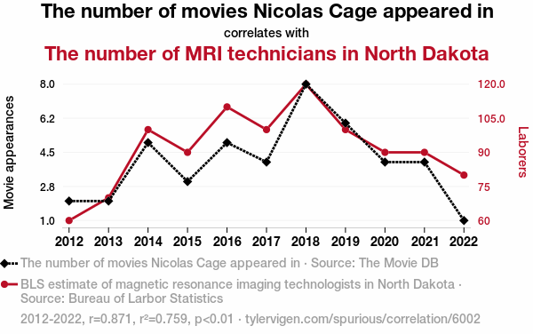

Correlaciones espúreas (<a href="https://tylervigen.com/spurious-correlations">link</a>).
</center>
Cuando se trata de ejes dobles con dos unidades de medida diferentes, en la mayoría de los casos es preferible usar dos gráficos separados en lugar de un gráfico con doble eje.

---

layout: false
class: left, bottom, inverse, animated, bounceInDown
# 03
## *How humans see data*


---
class: animated, fadeIn

# Las tres operaciones visuales de percepción de patrones de Cleveland

.pull-left[
1. **Detección**: el reconocimiento visual de que un objeto geométrico codifica un valor físico.

2. **Agrupación**: la organización de los elementos gráficos detectados.

3. **Estimación**: la evaluación visual de la magnitud relativa de dos o más valores físicos cuantitativos.


##### Crédito: John Rauser

]


.pull-right[
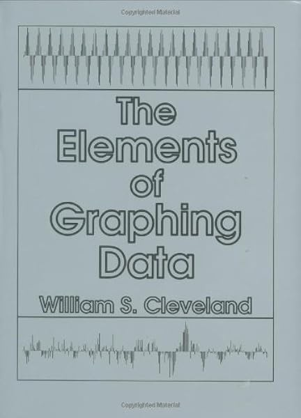
]

---
class: animated, fadeIn

# Las tres operaciones visuales de percepción de patrones de Cleveland

<center>


<br>

<a>https://www.youtube.com/watch?v=fSgEeI2Xpdc</a>

</center>

##### Crédito: John Rauser

---
class: animated, fadeIn

## Niveles de estimación

##### Crédito: John Rauser

Tres niveles diferentes de estimación:


1. **Discriminación**: dos valores son diferentes  &nbsp;   &nbsp;   &nbsp;   &nbsp;   &nbsp; &nbsp;   &nbsp;&nbsp;   &nbsp;&nbsp;   &nbsp;&nbsp;   &nbsp;&nbsp;   &nbsp;&nbsp;   &nbsp;&nbsp;   &nbsp;&nbsp;   &nbsp;&nbsp;   &nbsp;   &nbsp;&nbsp;   &nbsp;   <code>X=Y X!=Y</code>
2. **Ranking**: un valor es mayor   &nbsp;   &nbsp;   &nbsp;   &nbsp;   &nbsp;   &nbsp;   &nbsp;   &nbsp;   &nbsp;   &nbsp;   &nbsp;   &nbsp;&nbsp;   &nbsp;&nbsp;   &nbsp;&nbsp;   &nbsp;&nbsp;   &nbsp;&nbsp;   &nbsp;&nbsp;   &nbsp;&nbsp;   &nbsp;&nbsp;   &nbsp;&nbsp;   &nbsp;&nbsp;   &nbsp;&nbsp;   &nbsp;&nbsp;   &nbsp;&nbsp;   &nbsp; &nbsp;   &nbsp;   &nbsp;   &nbsp;   <code>X>Y   X&lt;Y</code>
3. **Comparación de razones**: un valor es dos veces más grande   &nbsp;   &nbsp;   &nbsp;   &nbsp;   &nbsp;    <code>X/Y = ?</code>

--
<br>
<br>

Todas estas implican comparación:
<br>

<center>
<b>La comparación eficiente entre diferentes puntos de datos es casi siempre el objetivo de una visualización.</b>

</center>
---
class: animated, fadeIn

## Ranking de Cleveland
##### Crédito: John Rauser
<i class="fa fa-file"></i> Cleveland and McGill (1985) Graphical Perception and Graphical Methods for Analyzing Scientific Data. Science 29(4716):828-833

| Rango | Aspecto evaluado |
| :---: | --- |
| 1 | Posición en una escala común |
| 2 | Posición en escalas idénticas pero desalineadas |
| 3 | Longitud |
| 4 | Ángulo o pendiente |
| 5 | Área |
| 6 | Volumen, densidad o saturación del color |
| 7 | Tonalidad del color |

Qué tan precisos somos los humanos al estimar cantidades que se codifican de diferentes maneras.


<center>
**Siete formas diferentes de codificar un valor cuantitativo, clasificadas de la más efectiva a la menos efectiva.**


---
class: animated, fadeIn

## Ejemplo con el color
##### Crédito: John Rauser
.pull-left[
<center>
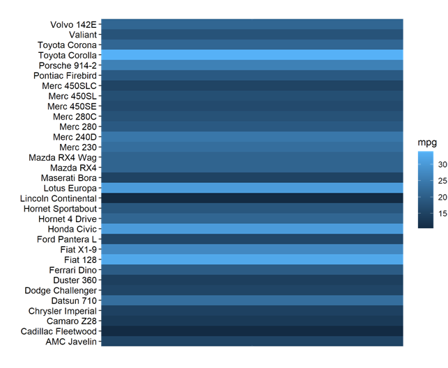
</center>
**Gráfico que codifica información utilizando el color** - <small>Conjunto de datos de 32 automóviles que fueron evaluados en una edición de 1974 de la revista Motor Trend. Eficiencia de combustible en millas por galón (mpg).</small>
]

---
class: animated, fadeIn

## Ejemplo con el color
##### Crédito: John Rauser
.pull-left[
<center>
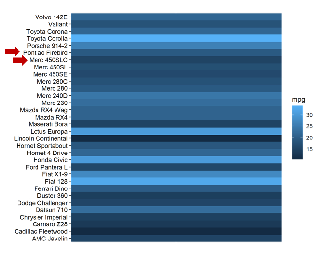
</center>
**Gráfico que codifica información utilizando el color** - <small>Conjunto de datos de 32 automóviles que fueron evaluados en una edición de 1974 de la revista Motor Trend. Eficiencia de combustible en millas por galón (mpg).</small>

]

.pull-right[
La primera tarea de estimación de Cleveland es **discriminación**: 
<br>
<i class="fa fa-question-circle"></i> ¿Qué piensas sobre estos dos valores: Pontiac Firebird y Merc450SLC? ¿Son iguales o diferentes?
]

---
class: animated, fadeIn

## Ejemplo con el color
##### Crédito: John Rauser

.pull-left[
<center>
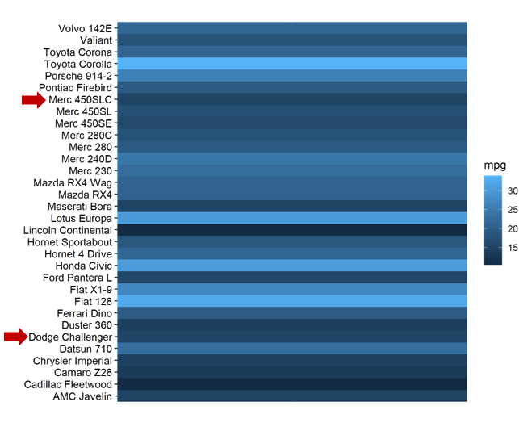
</center>
**Gráfico que codifica información utilizando el color** - <small>Conjunto de datos de 32 automóviles que fueron evaluados en una edición de 1974 de la revista Motor Trend. Eficiencia de combustible en millas por galón (mpg).</small>

]

.pull-right[
La primera tarea de estimación de Cleveland es **discriminación**: 
<br>
<i class="fa fa-question-circle"></i>  ¿Qué hay de Merc450SLC frente a Dodge Challenger? ¿Son iguales o diferentes?
]

---
class: animated, fadeIn

## Ejemplo con el color
##### Crédito: John Rauser

.pull-left[
<center>
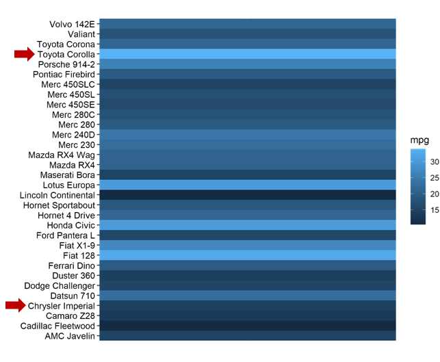
</center>
**Gráfico que codifica información utilizando el color** - <small>Conjunto de datos de 32 automóviles que fueron evaluados en una edición de 1974 de la revista Motor Trend. Eficiencia de combustible en millas por galón (mpg).</small>

]

.pull-right[
La segunda tarea de estimación de Cleveland es **ranking**:
<br>
<i class="fa fa-question-circle"></i> ¿Qué hay de Toyota Corolla frente a Chrysler Imperial? ¿Cuál tiene mejor eficiencia de combustible?
]

---
class: animated, fadeIn

## Ejemplo con posición (escala común)
##### Crédito: John Rauser
Así es como los datos deberían haber sido representados: ¡la discriminación, la comparación de razones y el ranking son triviales!

<center>
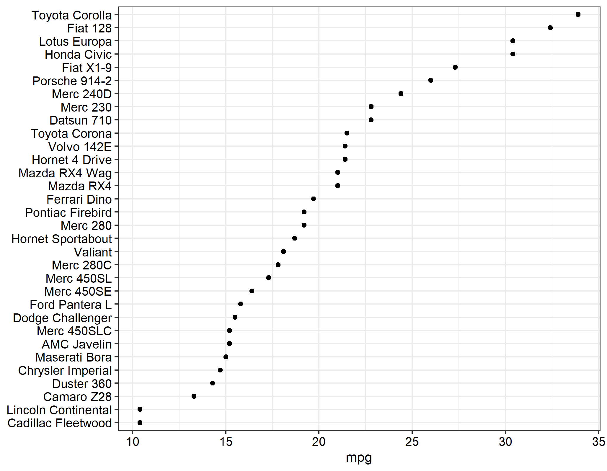
</center>

---
class: animated, fadeIn

## ¿Por qué es malo apilar datos?
##### Crédito: John Rauser
<center>
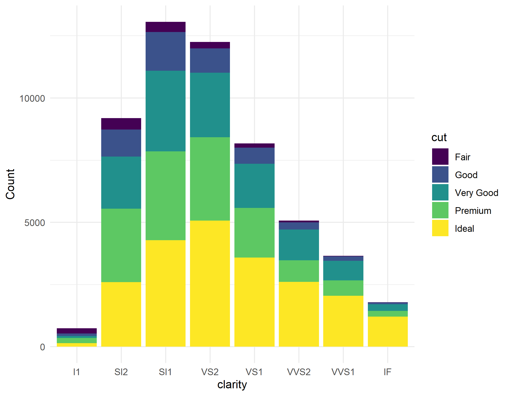
<br>

Conjunto de datos de 54,000 diamantes. <b>Gráfico de barras apiladas</b>: Conteo de diamantes en cada combinación de corte y claridad.
<br>
<i class="fa fa-question-circle"></i> ¿Hay más diamantes de corte premium con claridad SI1 o con claridad SI2?

</center>

---
class: animated, fadeIn

## ¿Por qué es malo apilar datos?
##### Crédito: John Rauser
<center>
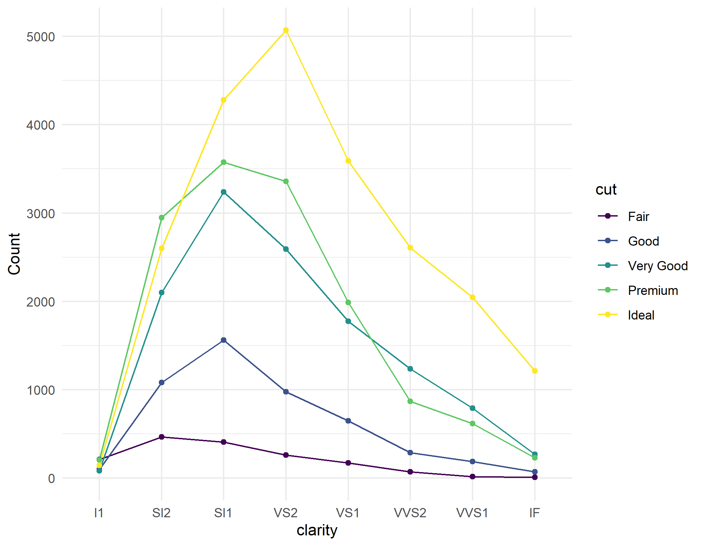
<br>

Conjunto de datos de 54,000 diamantes. <b>Gráfico de coordenadas paralelas</b>.<br>

<i class="fa fa-info-circle"></i> Si quieres comunicar el conteo en cada combinación de corte y claridad, <b>codifica esa información utilizando la posición en una escala común</b>.

</center>

---
class: animated, fadeIn

## ¿Tienen algún problema estas notícias?

<center>
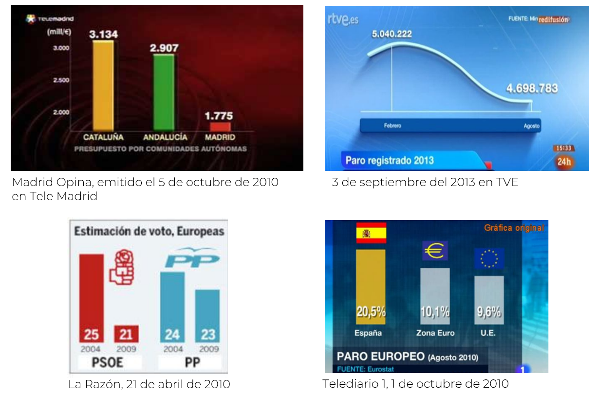
<br>

--
Si encuentras más notícias como esta, añádela al foro del CV.


---
layout: false
class: left, bottom, inverse, animated, bounceInDown
