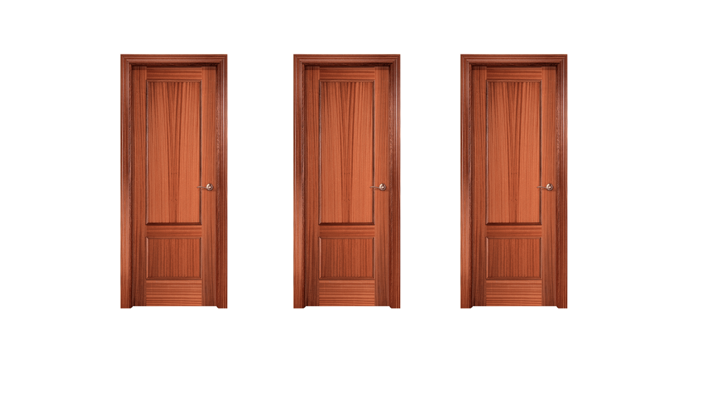
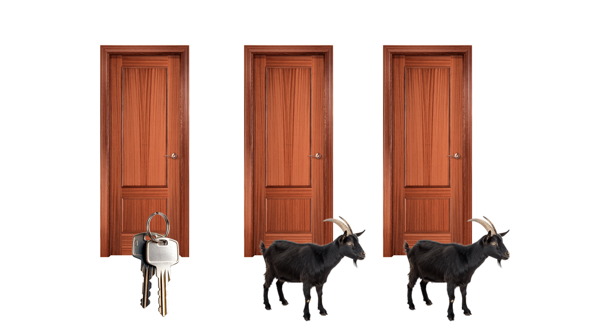
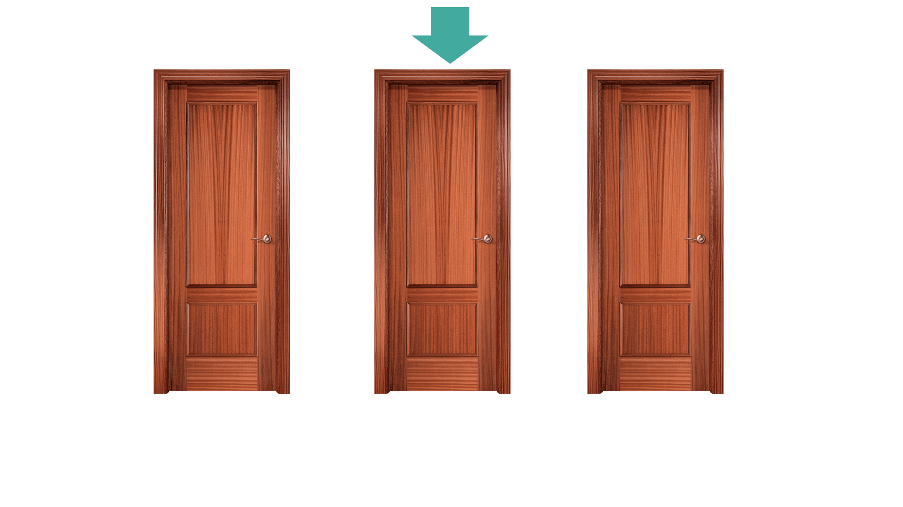
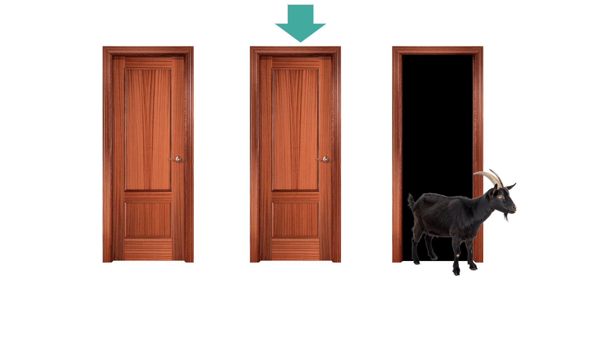
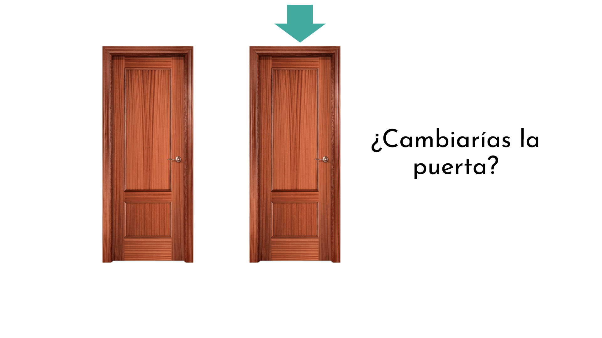
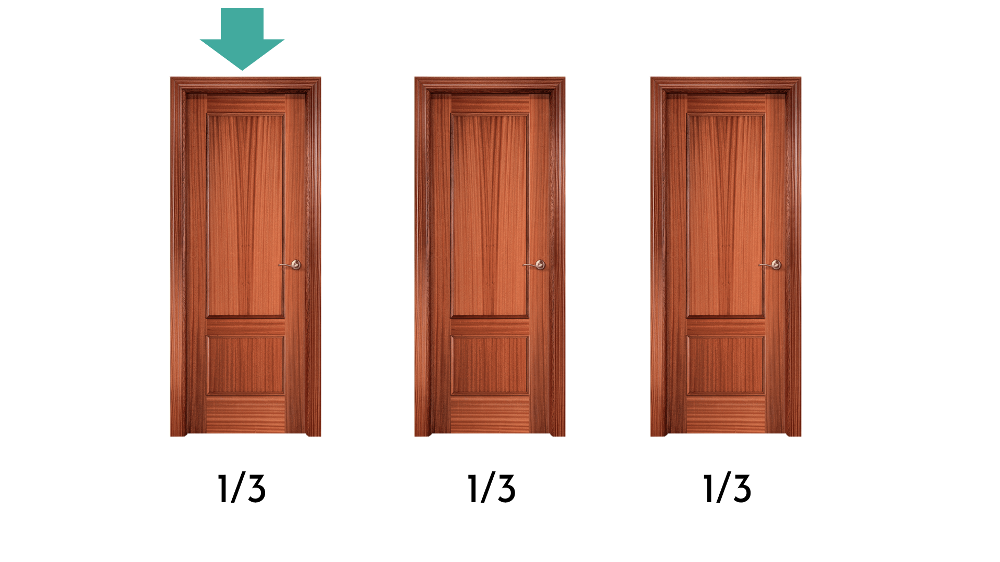
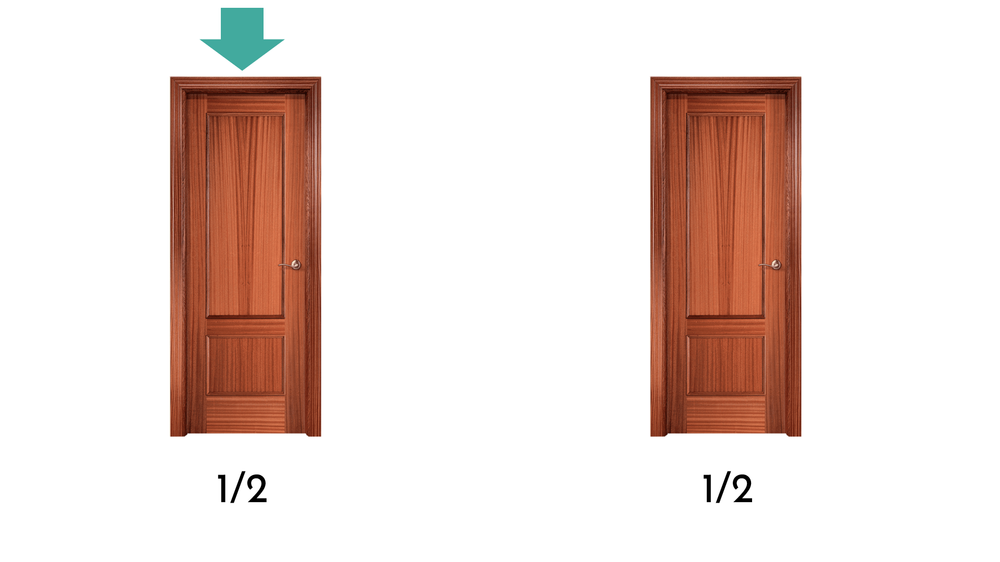
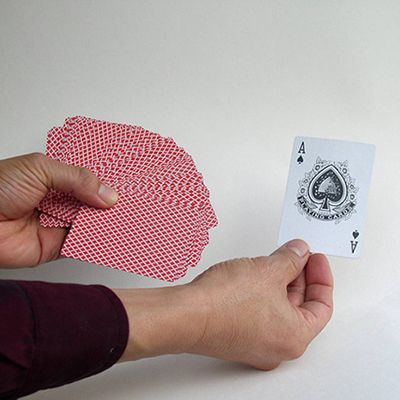

```{r setup, include=FALSE}
options(htmltools.dir.version = FALSE)
#knitr::include_graphics()
knitr::opts_chunk$set(
  cache = TRUE,
  echo = TRUE,
  message = FALSE, 
  warning = FALSE,
  hiline = TRUE,
  fig.retina = 5
)
knitr::opts_chunk$set(
  comment = "")

library(ggplot2)
library(readr)
library(knitr)
#pagedown::chrome_print("PresentacionBioestadistica.html")
```

```{r xaringan-themer, include=FALSE, warning=FALSE}
library(xaringanthemer)
style_mono_accent(
  base_color = "#1c5253", link_color =  "#DE1144", code_inline_color = "#DE1144",
  header_font_google = google_font("Josefin Sans"),
  text_font_google   = google_font("Montserrat", "400", "400i"),
  code_font_google   = google_font("Roboto Mono"),
    
)
```


```{r xaringanExtra-clipboard, echo=FALSE}
library(xaringanExtra)
htmltools::tagList(
  xaringanExtra::use_clipboard(
    button_text = "<i class=\"fa fa-clipboard\"></i>",
    success_text = "<i class=\"fa fa-check\" style=\"color: #90BE6D\"></i>",
  ),
  rmarkdown::html_dependency_font_awesome()
)
```


class: title-slide, animated, fadeIn

.left-top[
# Seminarios de
.subtitle[Bioestadística]

]

.left-bottom[
.authors[
**Seminario 4 | Pensamiento estadístico**
<br><br><br><br>

Marta Coronado ([marta.coronado@uab.cat](mailto:marta.coronado@uab.cat))  
]

.footer-info[
**Grado en Genética | Curso 2026/2027**
]
]

.right-panel[]


<style>
.title-slide {
  background-image: none;
}

/* Contenedor teal superior (solo título) */
.title-slide .left-top {
  position: absolute;
  top: 0; left: 0;
  width: 60%;
  height: 62%;
  background-color: #163a3a;
  color: white;
  padding: 50px 45px 30px 65px;
  margin: 0;
  display: flex;
  flex-direction: column;   /* ← esto faltaba */
  align-items: flex-start;  /* ← con column, flex-end alinearía a la derecha; usa flex-start para pegar a la izquierda */
  justify-content: flex-end;
  box-sizing: border-box;
}

/* Contenedor blanco inferior (autores, fecha) */
.title-slide .left-bottom {
  position: absolute;
  bottom: 0; left: 0;
  width: 60%;
  height: 38%;
  background-color: white;
  color: #222;
  display: flex;
  flex-direction: column;
  justify-content: center;
  box-sizing: border-box;
  padding: 20px 45px 30px 65px;
  margin: 0;
}

.title-slide .right-panel {
  position: absolute;
  top: 0; right: 0; bottom: 0;
  width: 41%;
  background-color: white;
  background-image: url('img/1.png');
  background-size: contain;
  background-repeat: no-repeat;
  background-position: center;
  padding: 40px;
  box-sizing: border-box;
}

.title-slide h1 {
  font-size: 1.9em;
  line-height: 1.25;
  margin: 0;
  font-weight: 400;
}

.title-slide .subtitle {
  display: block;   /* ← esto es la clave: sin esto, margin-top se ignora */
  font-size: 2em;
  font-weight: bold;
  color: #7ac142;
  margin-top: -35px;
  margin-bottom: 15px;
}

.title-slide .authors {
  font-size: 0.95em;
  line-height: 1.6;
  margin-bottom: 12px;
}

.title-slide .authors a {
  color: #e8846b;
  text-decoration: none;
}

.title-slide .footer-info {
  font-size: 0.9em;
  color: #444;
}

.remark-slide-content h2,
.remark-slide-content h3,
.remark-slide-content h4,
.remark-slide-content h5 {
  margin-top: 1em;
  margin-bottom: 0.6em;
}

.remark-slide-content p,
.remark-slide-content ul,
.remark-slide-content ol {
  margin-top: 0.2em;
  margin-bottom: 0.2em;
}

.remark-slide-content li {
  margin-bottom: 0.1em;
}

.practica::before {
  content: "\f303";
  font-family: "Font Awesome 6 Free";
  font-weight: 900;
  position: absolute;
  top: 15px;
  right: 15px;
  font-size: 1.3em;
  color: #1c5253;
}

.R::before {
  content: "\f4f7";
  font-family: "Font Awesome 6 Brands";
  font-weight: 400;
  position: absolute;
  top: 15px;
  right: 15px;
  font-size: 1.3em;
  color: #1c5253;
}

</style>


---
## El razonamiento estadístico

- El razonamiento estadístico **ni es espontáneo**  **ni es intuitivo**

--

- Nos ayuda a distinguir entre lo que **parece cierto** y lo que **los datos realmente apoyan**

--

- Aprender estadística es **aprender a pensar con evidencia**

--

> **¿Crees que necesitamos tener un razonamiento estadístico?**

<center>


<style>
.title-slide {
  background-image: url('img/1.png');
  background-size: 100%;
}
</style>

---
class: animated, fadeIn

## El razonamiento estadístico

.pull-left[Linda tiene 31 años de edad, soltera, inteligente y muy brillante. Se especializó en filosofía. Como estudiante, estaba profundamente preocupada por los problemas de discriminación y justicia social, participando también en manifestaciones anti-nucleares.

<br>

¿Qué es más probable?

1. Linda es una cajera de banco.
2. Linda es una cajera de banco y es activista de movimientos feministas.

]

.pull-right[

]

---
class: animated, fadeIn

## El razonamiento estadístico

.pull-left[Linda tiene 31 años de edad, soltera, inteligente y muy brillante. Se especializó en filosofía. Como estudiante, estaba profundamente preocupada por los problemas de discriminación y justicia social, participando también en manifestaciones anti-nucleares.

<br>

¿Qué es más probable?

1. **Linda es una cajera de banco.**
2. Linda es una cajera de banco y es activista de movimientos feministas.

]

.pull-right[

]

**Falacia de la conjunción**: la probabilidad de que los dos eventos ocurran juntos es siempre menor o igual que la probabilidad de que cada uno ocurra por separado:

$$
Pr(A) \ge Pr(A \cap B) \le Pr(B)
$$

---

class: animated, fadeIn

## El razonamiento estadístico

### La paradoja de Linda

- Asumimos que la probabilidad de que Linda sea cajera del banco es del 5% y la probabilidad de que sea feminista es del 95%

$$
Pr(\text{Linda es cajera del banco})=0.05 \quad\quad Pr(\text{Linda es feminista})=0.95
$$
--

Si asumimos que ambas cosas ocurren de forma independiente:

$$
Pr(\text{Linda es cajera del banco} \cap \text{Linda es feminista})=0.05 \times 0.95 = 0.0475
$$

--

La probabilidad de que ambas cosas ocurran juntas es más baja que $Pr(\text{Linda es cajera del banco})$.

---

class: animated, fadeIn

## El razonamiento estadístico

Imagina un grupo de personas, por ejemplo, nuestra clase (52 alumnos)

--

**¿Qué tamaño crees que tendría que tener el grupo para tener más de un 50% de probabilidad de que dos personas en el grupo compartan el mismo día de cumpleaños?**

- Asumimos que no hay gemelos y que todas las fechas de cumpleaños son igualmente probables (ignoramos los años bisiestos)

<center>


</center>
Posibles opciones:
- 23  
- 96  
- 183  
- 253

---

class: animated, fadeIn

## El razonamiento estadístico

- En un grupo de **23 personas** hay un 50.73% de probabilidad de que dos personas tengan el mismo día de cumpleaños.

--

> ¿Habiendo 365 días, cómo es posible que sólo se necesiten 23 personas?

--

**¿Cuál es la probabilidad de que dos personas no compartan el día de cumpleaños?**

- Persona A: su cumpleaños es el día X
- Persona B: cualquiera de los otros 364 días

La probabilidad de diferentes cumpleaños para A y B es 364/365: 99.7% ¡muy alta!

--

Añadimos la persona C:
- Persona C: 363/365, ya que hay 2 días con los que puede coincidir

--
- Persona D: 362/365
- ...

Si multiplicamos todas las probabilidades hasta la persona número 23, tenemos que:

$$
\frac{365}{365} \times
\frac{364}{365} \times
\frac{363}{365} \times
\frac{362}{365} \times
\frac{361}{365} \times
\cdots \times
\frac{343}{365}=49.27\%
$$

---

class: animated, fadeIn

## El razonamiento estadístico

### La paradoja del cumpleaños

> La clave para una probabilidad alta de coincidencia en un grupo tan pequeño es el gran número de posibles combinaciones a pares 

--

El número de combinaciones a pares que podemos hacer con 23 personas es: 

$$
\frac{23\times 22}{2}=253
$$

¡253 posibles combinaciones!

- Es una función no lineal, y puede costar más ver intuitivamente el resultado

--

.pull-left[
En nuestra clase, con 52 personas, hay 1326 posibles combinaciones. La probabilidad de que dos personas compartan el día de cumpleaños es más alta del 97%.  ]
.pull-right[
```{r}
n <- 52
prob_no_comparten <- prod((365:(365-n+1))/365)
prob_al_menos_uno <- 1 - prob_no_comparten
prob_al_menos_uno
```

]

---

class: animated, fadeIn

## El razonamiento estadístico

<center>



---

class: animated, fadeIn

## El razonamiento estadístico

<center>


---

class: animated, fadeIn

## El razonamiento estadístico

<center>


---

class: animated, fadeIn

## El razonamiento estadístico

<center>


---

class: animated, fadeIn

## El razonamiento estadístico

<center>



---

class: animated, fadeIn

## El razonamiento estadístico

> ¿Deberías cambiar de opción?

--

La respuesta es SÍ. Tienes el **doble de probabilidades de acertar**. 

---

class: animated, fadeIn

## El razonamiento estadístico

<center>



---

class: animated, fadeIn

## El razonamiento estadístico

<center>


---

class: animated, fadeIn

## El razonamiento estadístico

.pull-left[
- Escoge una carta de una baraja de 52 cartas

- La probabilidad de que escojas el as de espadas es 1/52

- Alguien que sabe dónde está el as le da la vuelta a 50 de las 51 cartas restantes, ninguna de las cuales es el as de espadas. Queda 1 carta boca abajo

- De las 2 cartas que quedan, ¿cuál es más probable que sea el as de espadas?

  - La que escogiste al principio (probabilidad 1/52)
  - La que queda después de darle la vuelta a todas (probabilidad 51/52)
  
> El mismo principio se cumple con el problema de las 3 puertas

]
.pull-right[

]

---

class: animated, fadeIn

## El razonamiento estadístico

### El problema de Monty Hall

- Cambiar de puerta te hace ganar 2 de cada 3 veces, mantener la puerta tiene una probabilidad 1/3... a pesar de que parece que no tenga consecuencia (50-50)

```{r echo = F, fig.align='center', fig.height=5.5, fig.width=10, fig.retina=5}
library(ggplot2)

# number of times to repeat the experiment
set.seed(1234)
iter<-  10000 

# defining the doors
doors <- c("goat","goat","car")

# initialize dataframe to store the result per iteration

monty_hall <- function(iteration){
        
        contestant_door <-  sample(doors, size = iteration, replace = TRUE)
        i=1:iteration
        
        #stick_win which is equal to 1 if the contestant_door in current i is car, 0 otherwise.
        #switch_win which is equal to 0 if the contestant_door is equal to car, 1 otherwise.
        stick_win <- ifelse(contestant_door == 'car',1,0)
        switch_win <- ifelse(contestant_door == 'car',0,1)
        
        stick_prob <- cumsum(stick_win)/i
        switch_prob <- cumsum(switch_win)/i
        
        #store result in a dataframe
        results <- data.frame(i=i, contestant_door=contestant_door, 
                              stick_win=stick_win,  switch_win=switch_win,
                              stick_prob=stick_prob, switch_prob=switch_prob)
        
        return(results)
}

monty_hall_results <- monty_hall(iter)

ggplot(monty_hall_results, mapping = aes(x=i, y=stick_prob)) + geom_line(color="cadetblue4") +
        geom_hline(yintercept = 1/3, color = 'cadetblue4') +
        geom_line(aes(y=switch_prob), color= "orange2") +
        geom_hline(yintercept = 2/3, color = 'orange2') +
        ylab('Probabilidad estimada')+xlab('Iteración') +
        geom_label(data = data.frame(label = c('Cambiar', 'Mantener'), i = c(9000,9000), stick_prob = c(0.75,0.25)), 
                   aes(label = label, color=label),
                   show.legend = FALSE
                   )+
        scale_color_manual(values = c("orange3","cadetblue4" ))+
        ggtitle("Probabilidad estimada de ganar") +
  theme_classic(base_size = 18)
```


---

class: animated, fadeIn

# Hipótesis

**¿Cuál de estas hipótesis es falsable?**

1. Hay vida inteligente en otros planetas

2. La Luna está hecha completamente de queso

3. Isaac Newton fue el mejor científico

4. Hay belleza en una puesta de sol

5. Hay queso en la Luna


---

class: animated, fadeIn

# Hipótesis

**¿Cuál de estas hipótesis es falsable?**

1. Hay vida inteligente en otros planetas

2. **La Luna está hecha completamente de queso**

3. Isaac Newton fue el mejor científico

4. Hay belleza en una puesta de sol

5. Hay queso en la Luna

<br>
**Explicación:**

- Basta con encontrar algo en la Luna que no sea queso para refutarla

- Las opciones 3 y 4 son **subjetivas** y por tanto no falsables

- Las opciones 1 y 5 son **existenciales** ("hay..."): un solo hallazgo las confirmaría, pero para refutarlas habría que demostrar que algo *no existe*:
  - La 1 no es falsable en la práctica: tendríamos que explorar todo el universo para descartarla
  - La 5 es falsable, pero necesitarías realizar una búsqueda exhaustiva de toda la Luna, y aun así nunca podrías convencer a los verdaderos creyentes del “queso lunar” de que la búsqueda se hizo correctamente

---

class: animated, fadeIn

# Hipótesis

### Universal vs. existencial

| | **Universal** <br> *"La Luna está hecha completamente de queso"* | **Existencial** <br> *"Hay queso en la Luna"* |
|---|---|---|
| **Si es falsa** | Basta con **un contraejemplo** para refutarla | Nada la refuta, salvo mirar **toda** la Luna |
| **Si es verdadera** | Nunca se refuta, pero cada prueba la **corrobora** | Basta con **un hallazgo** para confirmarla |
| **¿Falsable?** | **Sí** | **No** (en la práctica) |

<br>

- **Falsable no significa que se vaya a refutar**, sino que **existe un resultado posible** que la refutaría

  - *"La Luna está hecha completamente de roca lunar"* es falsable (y cierta): nunca la refutaremos, pero la aceptamos **provisionalmente** mientras resista las pruebas

- Una hipótesis nunca se demuestra: solo se **rechaza** o **no se rechaza**

---

class: animated, fadeIn

# Hipótesis

**¿Cuál de estas hipótesis es falsable?**

1. Los minoicos fueron la primera civilización en Creta.
2. Los minoicos fueron la mejor civilización en Creta.
3. Los minoicos no fueron la primera civilización en Creta.
4. Los minoicos no fueron la mejor civilización en Creta.
5. Los minoicos fueron una civilización en Creta.

---

class: animated, fadeIn

# Hipótesis

**¿Cuál de estas hipótesis es falsable?**

1. **Los minoicos fueron la primera civilización en Creta.**
2. Los minoicos fueron la mejor civilización en Creta.
3. Los minoicos no fueron la primera civilización en Creta.
4. Los minoicos no fueron la mejor civilización en Creta.
5. Los minoicos fueron una civilización en Creta.

<br>
**Explicación:**

- La 1 es **falsable**: basta con encontrar restos de una civilización anterior en Creta para refutarla

- Las opciones 2 y 4 son **subjetivas** ("la mejor") y por tanto no falsables

- La 3 equivale a decir "*hubo* una civilización anterior": es **existencial**. Se podría confirmar, pero para refutarla habría que demostrar que no existió ninguna

- La 5 es cierta por definición (llamamos "minoicos" a la civilización de la Creta de la Edad del Bronce): no hay ninguna observación que pueda refutarla

---

class: animated, fadeIn

# Hipótesis

**¿Cuál de estas hipótesis es falsable?**

1. Las palomas migratorias están extintas.
2. Las palomas migratorias no están extintas.
3. Las palomas migratorias saben bien.
4. Las palomas migratorias saben terrible.
5. Las palomas migratorias eran una plaga.

---

class: animated, fadeIn

# Hipótesis

**¿Cuál de estas hipótesis es falsable?**

1. **Las palomas migratorias están extintas.**
2. Las palomas migratorias no están extintas.
3. Las palomas migratorias saben bien.
4. Las palomas migratorias saben terrible.
5. Las palomas migratorias eran una plaga.

<br>
**Explicación:**

- La 1 es **falsable**: equivale a "no queda *ninguna* paloma migratoria viva", y basta con encontrar una para refutarla

- La 2 es **existencial** ("queda al menos una viva"): para refutarla habría que buscar en todo el planeta

- Las opciones 3 y 4 son **subjetivas**

- La 5 es un **juicio de valor**: "plaga" no está definido de forma objetiva. Sería falsable solo si lo definiésemos con un criterio medible (p. ej., daños a las cosechas)


---

class: animated, fadeIn

# Hipótesis

**¿Cuál de estas hipótesis es falsable?**


1. Todos los peces del lago Nyak son hermosos.
2. Hay peces en el lago Nyak.
3. Todos los peces del lago Nyak son verdes.
4. Algunos peces del lago Nyak son verdes.
5. El lago Nyak tiene demasiados peces.

---

class: animated, fadeIn

# Hipótesis

**¿Cuál de estas hipótesis es falsable?**

1. Todos los peces del lago Nyak son hermosos.
2. Hay peces en el lago Nyak.
3. **Todos los peces del lago Nyak son verdes.**
4. Algunos peces del lago Nyak son verdes.
5. El lago Nyak tiene demasiados peces.

<br>
**Explicación:**

- La 3 es **falsable**: es una afirmación **universal** ("todos"), y basta con pescar un solo pez que no sea verde para refutarla

- La 1 también es universal, pero "hermoso" es **subjetivo**: no hay ninguna observación que la pueda refutar

- La 2 es **existencial**: un solo pez la confirmaría, pero para refutarla tendríamos que demostrar que no hay *ningún* pez en todo el lago

- La 4 también es **existencial** ("algunos"): fíjate en la diferencia con la 3. Un pez verde la confirma, pero ningún pez de otro color la refuta

- La 5 es un **juicio de valor**: ¿cuántos peces son "demasiados"?

---

class: animated, fadeIn

# Hipótesis

**¿Cuál de estas hipótesis es falsable?**

1. No hay flamencos en el Delta de l'Ebre.
2. Todos los flamencos del Delta de l'Ebre son bonitos.
3. Hay flamencos en el Delta de l'Ebre.
4. Algún flamenco del Delta de l'Ebre es de color blanco.
5. Los flamencos son el ave más importante del Delta de l'Ebre.

---

class: animated, fadeIn

# Hipótesis

**¿Cuál de estas hipótesis es falsable?**

1. **No hay flamencos en el Delta de l'Ebre.**
2. Todos los flamencos del Delta de l'Ebre son bonitos.
3. Hay flamencos en el Delta de l'Ebre.
4. Algún flamenco del Delta de l'Ebre es de color blanco.
5. Los flamencos son el ave más importante del Delta de l'Ebre.

<br>
**Explicación:**

- La 1 es **falsable** (¡y falsa!): basta con ver un solo flamenco en el Delta para refutarla

- La 2 es **subjetiva** ("bonitos")

- La 3 es **existencial**: es fácil confirmarla, pero no se puede refutar (no podemos demostrar que no hay *ningún* flamenco)

- La 4 también es **existencial** ("algún"): bastaría con ver un flamenco blanco para confirmarla, pero para refutarla habría que revisar todos los flamencos del Delta

- La 5 es **subjetiva**: "el más importante" depende del criterio que usemos

---

class: animated, fadeIn

# Hipótesis

### Resumen: ¿cuándo es falsable una hipótesis?

- **Afirmaciones universales** ("todos...", "ninguno...", "no hay...", "fueron los primeros"): **falsables**. Basta con **un solo contraejemplo** para refutarlas

- **Afirmaciones existenciales** ("hay...", "existe al menos uno..."): **verificables**, pero no falsables en la práctica. Un solo caso las confirma, pero refutarlas exige demostrar que algo *no existe* en ningún sitio

- **Juicios subjetivos o de valor** ("el mejor", "bonito", "sabe bien"): **no falsables**. No hay ninguna observación que pueda refutarlos

<br>

> Una hipótesis científica tiene que ser **falsable**: tiene que existir algún resultado posible que demuestre que es falsa (Karl Popper)

---
layout: false
class: left, bottom, inverse, animated, bounceInDown
