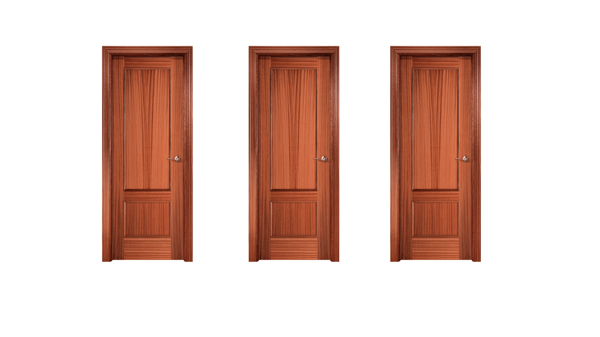
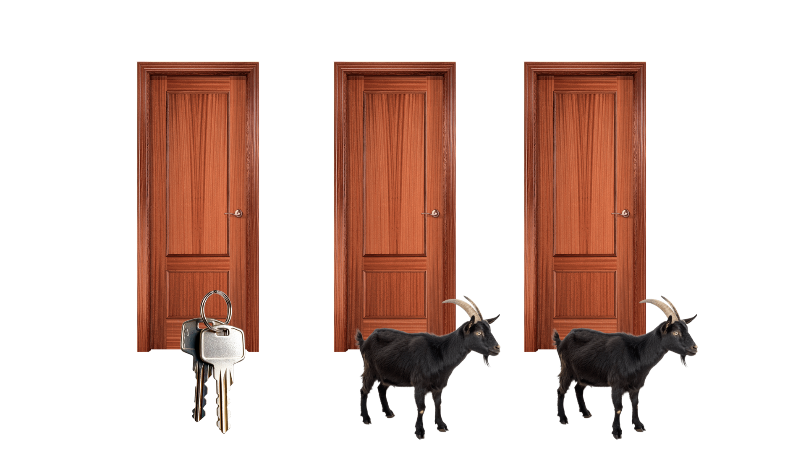
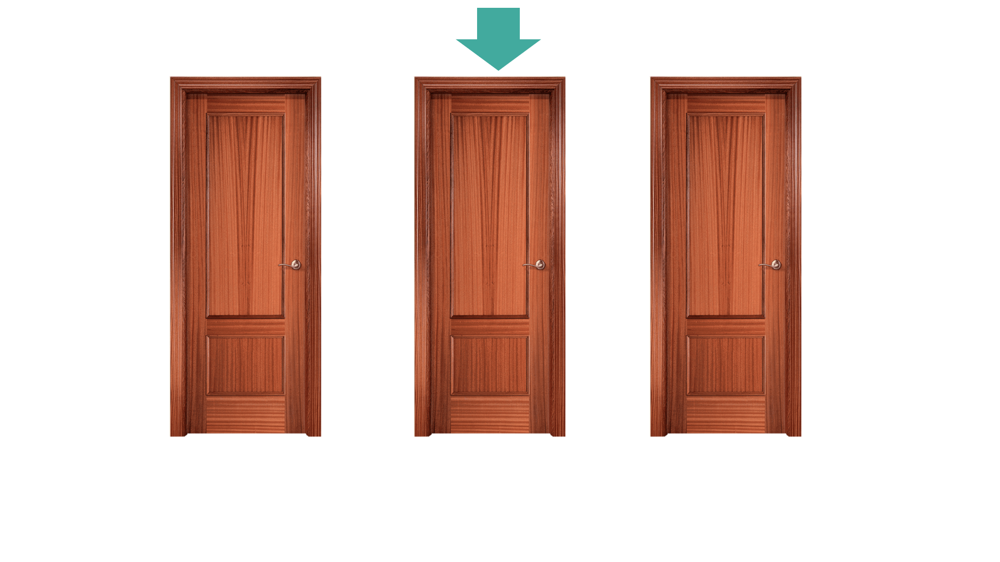
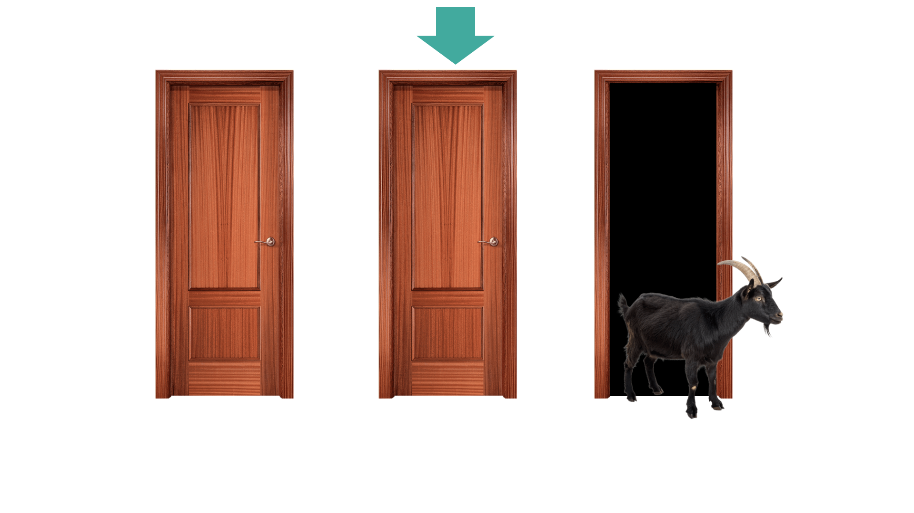
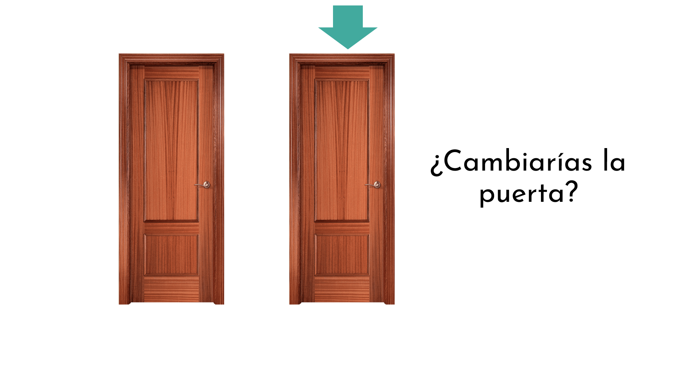
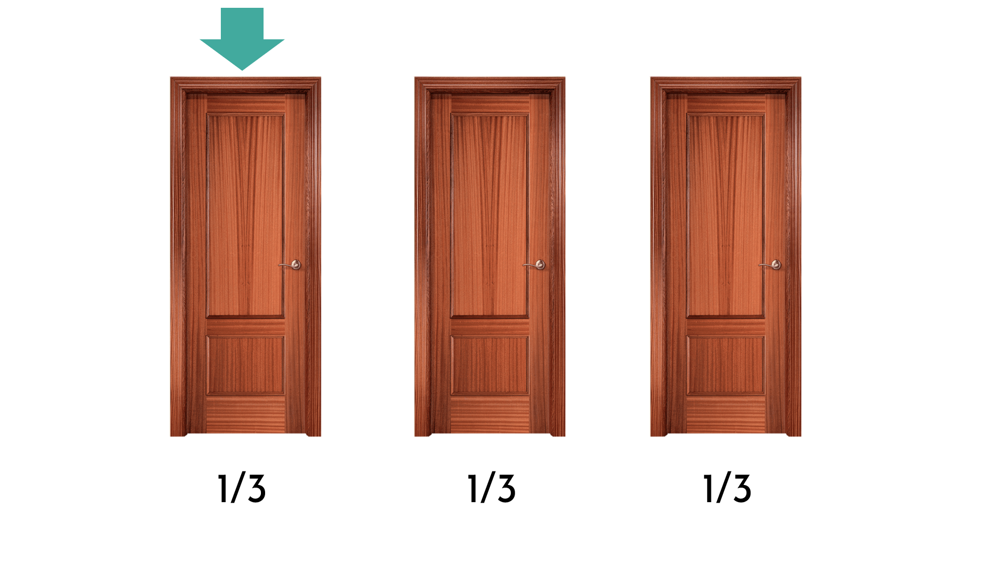
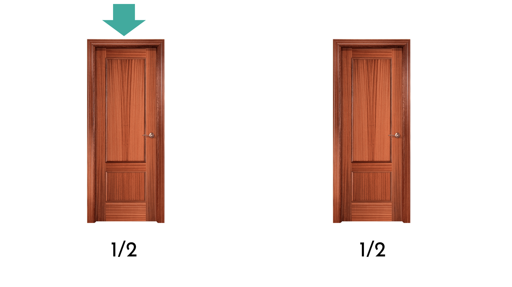
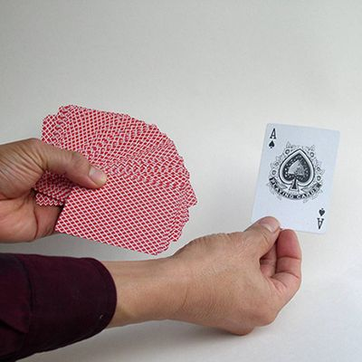

```{r setup, include=FALSE}
options(htmltools.dir.version = FALSE)
#knitr::include_graphics()
knitr::opts_chunk$set(
  cache = TRUE,
  echo = TRUE,
  message = FALSE, 
  warning = FALSE,
  hiline = TRUE
)
library(dplyr)
library(ggplot2)
library(knitr)
# pagedown::chrome_print("S1.html")
```

```{r xaringan-themer, include=FALSE, warning=FALSE}
library(xaringanthemer)
style_mono_accent(
  base_color = "#1c5253", link_color =  "#DE1144", code_inline_color = "#DE1144",
  header_font_google = google_font("Josefin Sans"),
  text_font_google   = google_font("Montserrat", "400", "400i"),
  code_font_google   = google_font("Roboto Mono"),
    
)
```

## El razonamiento estadístico

- El razonamiento estadístico **ni es espontáneo**  **ni es intuitivo**

--

- Nos ayuda a distinguir entre lo que **parece cierto** y lo que **los datos realmente apoyan**

--

- Aprender estadística es **aprender a pensar con evidencia**

--

> **¿Crees que necesitamos tener un razonamiento estadístico?**

<center>


<style>
.title-slide {
  background-image: url('img/1.png');
  background-size: 100%;
}
</style>

---
class: animated, fadeIn

## El razonamiento estadístico

.pull-left[Linda tiene 31 años de edad, soltera, inteligente y muy brillante. Se especializó en filosofía. Como estudiante, estaba profundamente preocupada por los problemas de discriminación y justicia social, participando también en manifestaciones anti-nucleares.

<br>

¿Que es más probable?

1. Linda es una cajera de banco.
2. Linda es una cajera de banco y es activista de movimientos feministas.

]

.pull-right[

]

---
class: animated, fadeIn

## El razonamiento estadístico

.pull-left[Linda tiene 31 años de edad, soltera, inteligente y muy brillante. Se especializó en filosofía. Como estudiante, estaba profundamente preocupada por los problemas de discriminación y justicia social, participando también en manifestaciones anti-nucleares.

<br>

¿Qué es más probable?

1. **Linda es una cajera de banco.**
2. Linda es una cajera de banco y es activista de movimientos feministas.

]

.pull-right[

]

**Falacia de la conjunción**: la probabilidad de que los dos eventos ocurran juntos es siempre menor o igual que la probabilidad de que cada uno ocurra por separado:

$$
Pr(A) \ge Pr(A ∩ B) \le Pr(B)
$$

---

class: animated, fadeIn

## El razonamiento estadístico

### La paradoja de Linda

- Asumimos que la probabilidad de que Linda sea cajera del banco es del 5% y la probabilidad de que es feminista es del 95%

$$
Pr(\text{Linda es cajera del banco})=0.05 \quad\quad Pr(\text{Linda es feminista})=0.95
$$
--

Si asumimos que ambas cosas ocurren de forma independiente:

$$
Pr(\text{Linda es cajera del banco ∩ Linda es feminista})=0.05 \times 0.95 = 0.0475
$$

--

La probabilidad de que ambas cosas ocurran juntas es más baja de $Pr(\text{Linda es cajera del banco})$.

---

class: animated, fadeIn

## El razonamiento estadístico

Imagina un grupo de personas, por ejemplo, nuestra clase (~60 alumnos)

--

**¿Qué tamaño crees que tendría que tener el grupo para tener más de un 50% de probabilidad de que dos personas en el grupo compartan el mismo día de cumpleaños?**

- Asumimos que no hay gemelos y que todas las fecha de cumpleaños son igualmente probable

<center>


</center>
Posibles opciones:
- 23  
- 96  
- 183  
- 253

---

class: animated, fadeIn

## El razonamiento estadístico

- En un grupo de **23 personas** hay un 50.73% de probabilidad de que dos personas tengan el mismo día de cumpleaños.

--

> ¿Habiendo 365 días, cómo es posible que sólo se necesiten 23 personas?

--

**¿Cuál es la probabilidad de que dos personas no compartan el día de cumpleaños?**

- Persona A: su cumpleaños es el día X
- Persona B: cualquiera de los otros 364 días

La probabilidad de diferentes cumpleaños para A y B es 364/365: 99.7% ¡muy alta!

--

Añadimos la persona C:
- Persona C: 363/365, ya que ya hay 2 días que pueden coincidir

--
- Persona D: 362/365
- ...

Si multiplicamos todas las probabilidades hasta la persona número 23, tenemos que:

$$
\frac{365}{365} \times
\frac{364}{365} \times
\frac{363}{365} \times
\frac{362}{365} \times
\frac{361}{365} \times
\cdots \times
\frac{343}{365}=49.27%
$$

---

class: animated, fadeIn

## El razonamiento estadístico

### La paradoja del cumpleaños

> La clave para una probabilidad alta de coincidencia en un grupo tan pequeño es el gran número de posibles combinaciones a pares 

--

El número de combinaciones a pares que podemos hacer con 23 personas es: 

$$
\frac{23\times 22}{2}=253
$$

¡253 posibles combinaciones!

- Es una función no lineal, y puede costar más ver intuitivamente el resultado

--

.pull-left[
En nuestra clase, con 60 personas, hay 1770 posibles combinaciones. La probabilidad de que dos personas compartan el día de cumpleaños es mas alta del 99%.  ]
.pull-right[
```{r}
n <- 60
prob_no_comparten <- prod((365:(365-n+1))/365)
prob_al_menos_uno <- 1 - prob_no_comparten
prob_al_menos_uno
```

]

---

class: animated, fadeIn

## El razonamiento estadístico

<center>



---

class: animated, fadeIn

## El razonamiento estadístico

<center>


---

class: animated, fadeIn

## El razonamiento estadístico

<center>


---

class: animated, fadeIn

## El razonamiento estadístico

<center>


---

class: animated, fadeIn

## El razonamiento estadístico

<center>



---

class: animated, fadeIn

## El razonamiento estadístico

> ¿Deberías cambiar de opción?

--

La respuesta es SÍ. Tienes el **doble de probabilidades de acertar**. 

---

class: animated, fadeIn

## El razonamiento estadístico

<center>



---

class: animated, fadeIn

## El razonamiento estadístico

<center>


---

class: animated, fadeIn

## El razonamiento estadístico

.pull-left[
- Escoge una carta de una baraja de 52 cartas

- La probabilidad de que escogas el as de espadas es 1/52

- Le damos la vuelta a 50 cartas -que no son el as de espadas- excepto a 1 carta

- De las 2 cartas que quedan, ¿cuál es más probable que sea el as de espadas?

  - La que escogiste al principio (probabilidad 1/52)
  - La que queda después de darle la vuelta a todas (probabilidad 51/52!)
  
> El mismo principio se cumple con el problema de las 3 puertas

]
.pull-right[

]

---

class: animated, fadeIn

## El razonamiento estadístico

### El problema de Monty Hall

- Cambiar de puerta te hace ganar 2/3 veces, mantener la puerta tiene una probabilidad 1/3... a pesar de que parece que no tenga consecuencia (50-50)

```{r echo = F, fig.align='center', fig.height=5.5, fig.width=10, fig.retina=5}
library(ggplot2)

# number of times to repeat the experiment
iter<-  10000 

# defining the doors
doors <- c("goat","goat","car")

# initialize dataframe to store the result per iteration

monty_hall <- function(iteration){
        
        contestant_door <-  sample(doors, size = iteration, replace = TRUE)
        i=1:iteration
        
        #stick_win which is equal to 1 if the contestant_door in current i is car, 0 otherwise.
        #switch_win which is equal to 0 if the contestant_door is equal to car, 1 otherwise.
        stick_win <- ifelse(contestant_door == 'car',1,0)
        switch_win <- ifelse(contestant_door == 'car',0,1)
        
        stick_prob <- cumsum(stick_win)/i
        switch_prob <- cumsum(switch_win)/i
        
        #store result in a dataframe
        results <- data.frame(i=i, contestant_door=contestant_door, 
                              stick_win=stick_win,  switch_win=switch_win,
                              stick_prob=stick_prob, switch_prob=switch_prob)
        
        return(results)
}

monty_hall_results <- monty_hall(iter)

ggplot(monty_hall_results, mapping = aes(x=i, y=stick_prob)) + geom_line(color="cadetblue4") +
        geom_hline(yintercept = 1/3, color = 'cadetblue4') +
        geom_line(aes(y=switch_prob), color= "orange2") +
        geom_hline(yintercept = 2/3, color = 'orange2') +
        ylab('Probabilidad estimada')+xlab('Iteración') +
        geom_label(data = data.frame(label = c('Cambiar', 'Mantener'), i = c(9000,9000), stick_prob = c(0.75,0.25)), 
                   aes(label = label, color=label),
                   show.legend = FALSE
                   )+
        scale_color_manual(values = c("orange3","cadetblue4" ))+
        ggtitle("Probabilidad estimada de ganar") +
  theme_classic(base_size = 18)
```


---

class: animated, fadeIn

# Hipótesis

**¿Cuál de estas hipótesis es falsable?**

1. Hay vida inteligente en otros planetas

2. La Luna está hecha completamente de queso

3. Isaac Newton fue el mejor científico

4. Hay belleza en una puesta de sol

5. Hay queso en la Luna


---

class: animated, fadeIn

# Hipótesis

**¿Cuál de estas hipótesis es falsable?**

1. Hay vida inteligente en otros planetas

2. **La Luna está hecha completamente de queso**

3. Isaac Newton fue el mejor científico

4. Hay belleza en una puesta de sol

5. Hay queso en la Luna

<br>
**Explicación:**

- Basta con encontrar algo en la Luna que no sea queso para refutarla

- Las opciones 3 y 4 son **subjetivas** y por tanto no falsables

- Las opciones 1 y 5 tambien son falsables, pero no son tan **definitvas** como la 2:
  - La 1 es falsable en teoría pero difícil de comprobar empíricamente
  - La 5 es falsable, pero necesitarías realizar una búsqueda exhaustiva de toda la Luna, y aun así nunca podrías convencer a los verdaderos creyentes del “queso lunar” de que la búsqueda se hizo correctamente

---

class: animated, fadeIn

# Hipótesis

**¿Cuál de estas hipótesis es falsable?**

1. Los minoicos fueron la primera civilización en Creta.
2. Los minoicos fueron la mejor civilización en Creta.
3. Los minoicos no fueron la primera civilización en Creta.
4. Los minoicos no fueron la mejor civilización en Creta.
5. Los minoicos fueron una civilización en Creta.

---

class: animated, fadeIn

# Hipótesis

**¿Cuál de estas hipótesis es falsable?**

1. Las palomas migratorias están extintas.
2. Las palomas migratorias no están extintas.
3. Las palomas migratorias saben bien.
4. Las palomas migratorias saben terrible.
5. Las palomas migratorias eran una plaga.


---

class: animated, fadeIn

# Hipótesis

**¿Cuál de estas hipótesis es falsable?**


1. Todos los peces del lago Nyak son hermosos.
2. Hay peces en el lago Nyak.
3. Todos los peces del lago Nyak son verdes.

---

class: animated, fadeIn

# Hipótesis

**¿Cuál de estas hipótesis es falsable?**

1. No hay flamencos en el Delta de l'Ebre.
2. Todos los flamencos del Delta de l'Ebre son bonitos.
3. Hay flamencos en el Delta de l'Ebre.

---
layout: false
class: left, bottom, inverse, animated, bounceInDown
