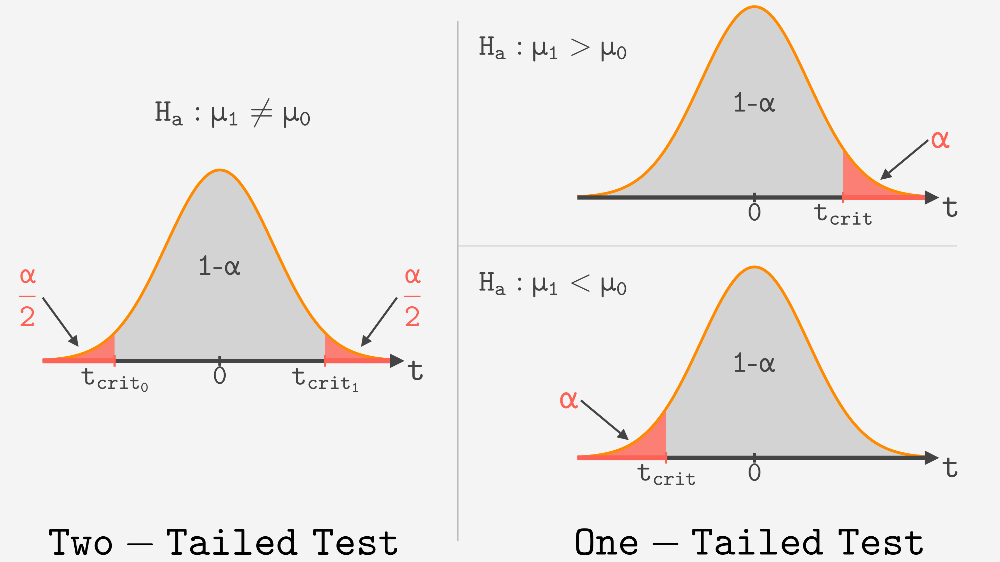
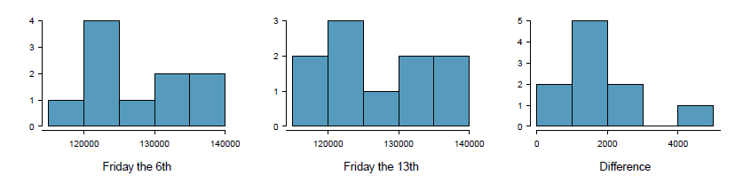
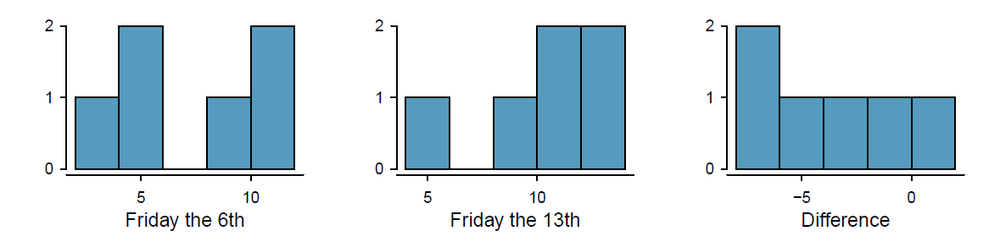
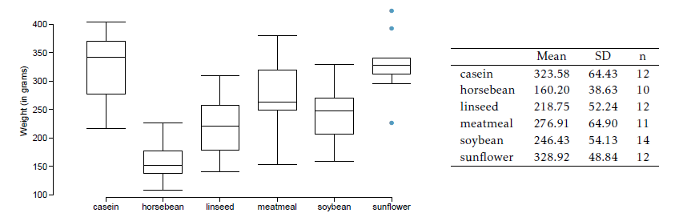

```{r setup, include=FALSE}
# Load useful packages
library(rmdformats)   # for extra formatting if needed
knitr::opts_chunk$set(echo = TRUE, warning = F, message = F, fig.retina = 5)
library(ggplot2)
```

```{=html}
<style>
body {
  font-size: 14px;   /* un poco más grande */
  color: black;      /* asegura texto en negro */
}

h1, h2, h3, h4, h5, h6 {
  color: #D9230F;        /* títulos en rojo */
}

h3, h4, h5, h6 {
  color: black;        /* títulos en rojo */
}

h3 {
  font-size: 1em;   /* tamaño igual al texto normal */
}

@import url('https://fonts.googleapis.com/css2?family=Handlee&display=swap');

.handwritten {
  font-family: 'Handlee', monospace;
  font-size: 1.1em;
}

.respuesta {
  background-color: #F0F0F0;
  padding: 15px;
  margin: 10px 0;
  border-radius: 8px;
  line-height: 1.2;
}
</style>
```

<center>

</center>

## 🧭 Recordatorio: cuándo y cómo usar la distribución t

Usamos la distribución **t de Student** para hacer inferencia sobre una **media** cuando **no conocemos** la desviación estándar de la población ($\sigma$) y la estimamos con la de la muestra ($s$). Al estimar $\sigma$ añadimos incertidumbre, y por eso la t tiene colas más gruesas que la normal. Cuantos más **grados de libertad** ($gl$), más se parece a la normal.

**Condiciones** para poder usarla:

1. **Independencia**: las observaciones son independientes entre sí (muestra aleatoria, o asignación aleatoria en un experimento, y $n$ < 10% de la población).
2. **Normalidad**: la población es aproximadamente normal. Con $n < 30$ comprobamos que no haya asimetría fuerte ni outliers claros. Con $n \ge 30$ podemos relajar esta condición, salvo que haya outliers muy extremos.

**Los tres tipos de test t**

| Situación | Estadístico | Error estándar ($SE$) | $gl$ |
| --- | --- | --- | --- |
| Una muestra | $t = \dfrac{\bar{x} - \mu_0}{SE}$ | $\dfrac{s}{\sqrt{n}}$ | $n - 1$ |
| Datos pareados | $t = \dfrac{\bar{x}_{dif} - 0}{SE}$ | $\dfrac{s_{dif}}{\sqrt{n_{dif}}}$ | $n_{dif} - 1$ |
| Dos muestras independientes | $t = \dfrac{(\bar{x}_1 - \bar{x}_2) - 0}{SE}$ | $\sqrt{\dfrac{s_1^2}{n_1} + \dfrac{s_2^2}{n_2}}$ | $\min(n_1 - 1, n_2 - 1)$ (conservador) |

En dos muestras independientes, R usa por defecto la aproximación de **Welch**, que da unos $gl$ no enteros, entre $\min(n_1-1, n_2-1)$ y $n_1 + n_2 - 2$. Con la aproximación conservadora el p-valor sale un poco mayor (es decir, nos cuesta un poco más rechazar $H_0$).

**Intervalo de confianza**: $\text{estimación} \pm t^*_{gl} \times SE$

**Valor crítico y p-valor en R**

| Pregunta | R |
| --- | --- |
| $t^*$ bilateral con nivel de confianza $NC$ | `qt(1 - (1 - NC)/2, df)` |
| $t^*$ unilateral con $\alpha$ | `qt(1 - alpha, df)` (o `qt(alpha, df)` para la cola izquierda) |
| p-valor bilateral | `2 * pt(-abs(t), df)` |
| p-valor unilateral, $H_1: \mu > \mu_0$ | `pt(t, df, lower.tail = FALSE)` |
| p-valor unilateral, $H_1: \mu < \mu_0$ | `pt(t, df)` |

**Test e intervalo van de la mano**: un test bilateral con $\alpha$ rechaza $H_0$ exactamente cuando el IC al $(1-\alpha)$ **no contiene** el valor de $H_0$. Un test **unilateral** con $\alpha = 0.05$ se corresponde con un IC bilateral del **90%**.

En todos los problemas seguimos los mismos pasos: **(1)** identificar el tipo de datos (una muestra, pareados, independientes); **(2)** plantear $H_0$ y $H_1$; **(3)** comprobar las condiciones; **(4)** calcular $SE$, $t$ y $gl$; **(5)** comparar con $t^*$ o calcular el p-valor; **(6)** concluir **en el contexto** del problema.

---

# Inferencia de una única muestra con la distribución de t

## 🎯 Problema 1 - Identifica el valor t crítico

Se obtiene una muestra aleatoria e independiente de una población que sigue una distribución normal y una desviación estándar desconocida. Encuentra los grados de libertad y el valor crítico de t para los siguientes tamaños de muestra y niveles de confianza.

### a) $n=6$, $NC=90\%$
### b) $n=21$, $NC=98\%$
### c) $n=29$, $NC=95\%$
### d) $n=12$, $NC=99\%$

<br>
<details>
<summary>Solución desarrollada</summary>

**Planteamiento**

- Los grados de libertad son $gl = n - 1$.
- Para un intervalo con nivel de confianza $NC$, dejamos $\alpha = 1 - NC$ repartido entre **las dos colas**: $\alpha/2$ en cada una. Buscamos el valor que deja por debajo una probabilidad $1 - \alpha/2$.

Por ejemplo, en a): $\alpha = 0.10$, así que $\alpha/2 = 0.05$ y buscamos el cuantil $0.95$ de una $t_5$.

| Caso | $gl$ | $\alpha/2$ | Cuantil | $t^*$ |
| --- | --- | --- | --- | --- |
| a) | 5 | 0.05 | 0.95 | 2.015 |
| b) | 20 | 0.01 | 0.99 | 2.528 |
| c) | 28 | 0.025 | 0.975 | 2.048 |
| d) | 11 | 0.005 | 0.995 | 3.106 |

Fíjate en dos patrones: cuanto **mayor es el NC**, mayor es $t^*$ (el intervalo es más ancho); y cuantos **menos gl**, mayor es $t^*$ (las colas de la t son más gruesas). Como referencia, con la normal el valor para el 95% sería 1.96, y en c) es 2.048.

**Comprobación con R**

```{r p1}
n  <- c(6, 21, 29, 12)
NC <- c(0.90, 0.98, 0.95, 0.99)
gl <- n - 1
t_crit <- qt(1 - (1 - NC) / 2, df = gl)
data.frame(n, NC, gl, t_crit = round(t_crit, 3))
```

| Caso | Resultado |
|:------:|:-----------:|
| a) $n=6$, $NC=90\%$ | $gl=5$, $t^*=2.02$ |
| b) $n=21$, $NC=98\%$ | $gl=20$, $t^*=2.53$ |
| c) $n=29$, $NC=95\%$ | $gl=28$, $t^*=2.05$ |
| d) $n=12$, $NC=99\%$ | $gl=11$, $t^*=3.11$ |

</details>


## 📏 Problema 2 - Del intervalo a la media y la desviación estándar

Un intervalo de confianza del 95% para la media de una población $\mu$ es $(18.985, 21.015)$. El intervalo de confianza está basado en una muestra aleatoria de 36 observaciones. Calcula la media y la desviación estándar de la muestra. Asume que se cumplen todas las condiciones para hacer inferencia. Utiliza la distribución de `t` para los cálculos.

<br>
<details>
<summary>Solución desarrollada</summary>

**Planteamiento**

El intervalo tiene la forma $\bar{x} \pm ME$, con $ME = t^* \cdot \dfrac{s}{\sqrt{n}}$. Es **simétrico** alrededor de $\bar{x}$, así que:

- la media muestral es el **punto medio** del intervalo;
- el margen de error es la **mitad de la amplitud**.

**Media muestral y margen de error**

$$\bar{x} = \frac{18.985 + 21.015}{2} = 20 \qquad ME = \frac{21.015 - 18.985}{2} = 1.015$$

**Desviación estándar**

Con $n = 36$, $gl = 35$ y, para el 95%, $t^*_{35} = 2.030$. Despejamos $s$ del margen de error:

$$ME = t^* \cdot \frac{s}{\sqrt{n}} \;\Rightarrow\; s = \frac{ME \cdot \sqrt{n}}{t^*} = \frac{1.015 \cdot 6}{2.030} = 3.00$$

Atención: 20 es la media **de la muestra** ($\bar{x}$), no $\mu$. La media poblacional $\mu$ es desconocida: es justamente lo que el intervalo intenta estimar.

**Comprobación con R**

```{r p2}
li <- 18.985; ls <- 21.015; n <- 36
x_barra <- (li + ls) / 2
ME <- (ls - li) / 2
t_crit <- qt(0.975, df = n - 1)
s <- ME * sqrt(n) / t_crit
c(x_barra = x_barra, ME = ME, t_crit = t_crit, s = s)
```

| Caso | Resultado |
|:------:|:-----------:|
| $\bar{x}$ | 20 |
| $s$ | 3 |

</details>


## 😴 Problema 3 - La ciudad que nunca duerme

Nueva York es conocida como "la ciudad que nunca duerme". Se preguntó a una muestra aleatoria de 25 neoyorquinos cuántas horas dormían por las noches. A continuación, se muestra un resumen estadístico de los datos. ¿Demuestran estos datos que los habitantes de Nueva York duermen, en promedio, más o menos de 8 horas por noche?

|  $n$  |   $\bar{x}$  | $s$  | $min$  |  $max$ |
|:-----:|:-----:|:----:|:----:|:----:|
| 25 | 7.73 |  0.77 | 6.17 | 9.78 |

### a) Escribe la hipótesis, con palabras y con símbolos.
### b) Comprueba las condiciones, calcula el estadístico t, y los grados de libertad asociados.
### c) Encuentra el valor t crítico (considera $\alpha=0.05$).
### d) ¿Cuál es la conclusión del test?
### e) Si fueras a construir un intervalo de confianza del 90% que correspondiera con este test de hipótesis, ¿esperarías que las 8h estuvieran dentro del intervalo?

<br>
<details>
<summary>Solución desarrollada</summary>

**a) Hipótesis**

- $H_0: \mu = 8$. Los neoyorquinos duermen, en promedio, 8 horas por noche.
- $H_1: \mu \ne 8$. Los neoyorquinos duermen, en promedio, **más o menos** de 8 horas por noche.

El test es **bilateral** porque la pregunta dice "más o menos": nos interesa una diferencia en cualquier dirección.

**b) Condiciones y estadístico**

- **Independencia**: la muestra es aleatoria y 25 personas son mucho menos del 10% de la población de Nueva York.
- **Normalidad**: $n = 25 < 30$, así que necesitamos que no haya asimetría fuerte ni outliers. No tenemos los datos, pero sí el mínimo y el máximo. El mínimo está a $(6.17 - 7.73)/0.77 = -2.0$ desviaciones estándar de la media y el máximo a $(9.78 - 7.73)/0.77 = 2.7$. Ninguno es un outlier claro, así que aceptamos la condición.

$$SE = \frac{s}{\sqrt{n}} = \frac{0.77}{\sqrt{25}} = 0.154$$

$$t = \frac{\bar{x} - \mu_0}{SE} = \frac{7.73 - 8}{0.154} = -1.75 \qquad gl = 25 - 1 = 24$$

La media muestral está 1.75 errores estándar **por debajo** de 8.

**c) Valor crítico**

Test bilateral con $\alpha = 0.05$: dejamos 0.025 en cada cola, $t^*_{24} = 2.064$. Rechazamos $H_0$ si $|t| > 2.064$.

**d) Conclusión**

$|-1.75| = 1.75 < 2.064$: el estadístico **no cae** en la región de rechazo. El p-valor es

$$p = 2 \cdot P(t_{24} < -1.75) = 0.092 > 0.05$$

**No rechazamos $H_0$**. Los datos no aportan evidencia suficiente de que los neoyorquinos duerman en promedio una cantidad de horas distinta de 8.

**e) Intervalo del 90%**

Para el 90% dejamos 0.05 en cada cola: $t^*_{24} = 1.711$.

$$7.73 \pm 1.711 \times 0.154 = 7.73 \pm 0.264 = (7.47,\ 7.99)$$

El intervalo del 90% **no contiene** el 8. ¿Contradice el apartado d)? **No**. Un IC del 90% se corresponde con un test bilateral con $\alpha = 0.10$, y como $p = 0.092 < 0.10$, a ese nivel sí rechazaríamos $H_0$. El intervalo que corresponde a nuestro test ($\alpha = 0.05$) es el del **95%**:

$$7.73 \pm 2.064 \times 0.154 = (7.41,\ 8.05)$$

que **sí contiene** el 8, de acuerdo con la conclusión de d).

**Comprobación con R**

```{r p3}
n <- 25; x_barra <- 7.73; s <- 0.77; mu0 <- 8
SE <- s / sqrt(n)
t  <- (x_barra - mu0) / SE
gl <- n - 1
c(SE = SE, t = t, gl = gl)

# c) valor crítico bilateral, alfa = 0.05
qt(0.975, gl)

# d) p-valor bilateral
2 * pt(-abs(t), gl)

# e) IC del 90% y del 95%
x_barra + c(-1, 1) * qt(0.95, gl) * SE
x_barra + c(-1, 1) * qt(0.975, gl) * SE
```

| Caso | Resultado |
|:------:|:-----------:|
| a) | $H_0:\mu=8$, $H_1:\mu \ne 8$ |
| b) | Muestra aleatoria; sin outliers claros. $t=-1.75$, $gl=24$ |
| c) | $t^*=2.064$ |
| d) | $p = 0.092$ → No rechazamos $H_0$ |
| e) | IC 90% $= (7.47, 7.99)$: el 8 queda fuera (corresponde a $\alpha = 0.10$). IC 95% $= (7.41, 8.05)$: el 8 queda dentro |

</details>


## 🔁 Problema 4 - ¿Para qué media el p-valor es 0.05?

Se te dan las siguientes hipótesis:

$$
H_0: \mu = 60 \qquad H_1: \mu < 60
$$

Sabemos que la desviación estándar de la muestra es 8 y el tamaño de la muestra es 20. ¿Para qué media de muestra sería el p-valor igual a 0.05? Asume que todas las condiciones para hacer inferencia se cumplen.

<br>
<details>
<summary>Solución desarrollada</summary>

**Planteamiento**

Es un problema "al revés": conocemos el p-valor y buscamos el $\bar{x}$ que lo produce.

- El test es **unilateral por la izquierda** ($H_1: \mu < 60$), así que el p-valor es el área a la **izquierda** del estadístico $t$.
- $p = 0.05$ cuando $t$ es exactamente el valor que deja un 5% a su izquierda en una $t_{19}$: $t^* = -1.729$.

**Despejamos $\bar{x}$**

$$t^* = \frac{\bar{x} - \mu_0}{s/\sqrt{n}} \;\Rightarrow\; \bar{x} = \mu_0 + t^* \cdot \frac{s}{\sqrt{n}}$$

$$\bar{x} = 60 + (-1.729) \cdot \frac{8}{\sqrt{20}} = 60 - 1.729 \cdot 1.789 = 60 - 3.093 = 56.91$$

Con una media muestral de 56.91 el p-valor es exactamente 0.05. Cualquier media **menor** daría $p < 0.05$ (y rechazaríamos $H_0$); cualquier media mayor, $p > 0.05$.

**Comprobación con R**

```{r p4}
mu0 <- 60; s <- 8; n <- 20
t_crit <- qt(0.05, df = n - 1)
x_barra <- mu0 + t_crit * s / sqrt(n)
c(t_crit = t_crit, x_barra = x_barra)

# comprobación: el p-valor con esa media es 0.05
pt((x_barra - mu0) / (s / sqrt(n)), df = n - 1)
```

| Caso | Resultado |
|:------:|:-----------:|
| $t^*$ | $-1.729$ |
| $\bar{x}$ | 56.91 |

</details>


## 🎹 Problema 5 - Clases de piano

Georgianna afirma que en una ciudad reconocida por su escuela de música, los niños, en promedio, toman menos de 5 años de lecciones de piano. Tenemos una muestra aleatoria de 20 niños de la ciudad, con una media de 4.6 años de clases de piano y una desviación estándar de 2.2 años.

### a) Evalúa la afirmación de Georgianna utilizando una prueba de hipótesis.
### b) Construye un intervalo al 95% de confianza para el número de años que los estudiantes han tomado clases de piano, e interprétalo en el contexto de los datos.
### c) ¿Los resultados de la prueba de hipótesis y el IC concuerdan? Explícalo.

<br>
<details>
<summary>Solución desarrollada</summary>

**a) Prueba de hipótesis**

La afirmación de Georgianna ("menos de 5 años") va en la hipótesis alternativa:

- $H_0: \mu = 5$. Los niños de la ciudad toman en promedio 5 años de clases.
- $H_1: \mu < 5$. Toman en promedio **menos** de 5 años. Test **unilateral por la izquierda**.

Condiciones: la muestra es aleatoria (independencia). Con $n = 20$ necesitamos que la distribución no sea muy asimétrica; no tenemos los datos, así que lo asumimos. (Ojo: $s = 2.2$ es grande respecto a la media 4.6, y los años no pueden ser negativos, así que podría haber algo de asimetría a la derecha.)

$$SE = \frac{2.2}{\sqrt{20}} = 0.492 \qquad t = \frac{4.6 - 5}{0.492} = -0.81 \qquad gl = 19$$

Valor crítico (cola izquierda, $\alpha = 0.05$): $t^*_{19} = -1.729$. Como $-0.81 > -1.729$, no estamos en la región de rechazo. El p-valor es

$$p = P(t_{19} < -0.81) = 0.21 > 0.05$$

**No rechazamos $H_0$**. Los datos no aportan evidencia suficiente para apoyar la afirmación de Georgianna: una media muestral de 4.6 años es compatible con una media poblacional de 5.

**b) Intervalo de confianza del 95%**

$t^*_{19} = 2.093$ (bilateral, 0.025 en cada cola):

$$4.6 \pm 2.093 \times 0.492 = 4.6 \pm 1.03 = (3.57,\ 5.63) \text{ años}$$

Interpretación: con un 95% de confianza, el número medio de años de clases de piano de **todos** los niños de esta ciudad está entre 3.57 y 5.63 años.

**c) ¿Concuerdan?**

**Sí**. El test no rechaza $\mu = 5$, y el intervalo contiene el 5.

Un matiz: nuestro test es **unilateral** con $\alpha = 0.05$, así que su equivalente exacto es el IC bilateral del **90%**, $(3.75, 5.45)$, o el intervalo unilateral $(-\infty, 5.45)$. Ambos contienen el 5 y llevan a la misma conclusión.

**Comprobación con R**

```{r p5}
n <- 20; x_barra <- 4.6; s <- 2.2; mu0 <- 5
SE <- s / sqrt(n)
t  <- (x_barra - mu0) / SE
gl <- n - 1
c(SE = SE, t = t, t_crit = qt(0.05, gl), p = pt(t, gl))

# b) IC 95% bilateral
x_barra + c(-1, 1) * qt(0.975, gl) * SE
# c) IC 90% bilateral (equivalente al test unilateral con alfa = 0.05)
x_barra + c(-1, 1) * qt(0.95, gl) * SE
```

| Caso | Resultado |
|:------:|:-----------:|
| a) | $H_0: \mu = 5$, $H_1: \mu < 5$; $t = -0.81$, $gl = 19$, $t^* = -1.729$, $p = 0.21$ → No rechazamos $H_0$ |
| b) | IC 95% $= (3.57, 5.63)$ años |
| c) | Sí concuerdan: no rechazamos $H_0$ y el IC contiene 5 años |

</details>


## 🚗 Problema 6 - Tamaño de muestra para los seguros

Un investigador de mercado quiere evaluar los ahorros en seguros de automóvil en una compañía competidora. Basándose en estudios previos, asume que la desviación estándar de los ahorros es de 100€. Quiere recoger datos de manera que el margen de error no sea superior a 10€ con un nivel de confianza del 95%. ¿Cuál debe ser el tamaño de la muestra que debe recolectar?

<br>
<details>
<summary>Solución desarrollada</summary>

**Planteamiento**

Queremos que el margen de error $ME = z^* \cdot \dfrac{\sigma}{\sqrt{n}}$ sea como mucho $E = 10$€. Despejando $n$:

$$z^* \cdot \frac{\sigma}{\sqrt{n}} \le E \;\Rightarrow\; n \ge \left(\frac{z^* \cdot \sigma}{E}\right)^2$$

¿Por qué $z$ y no $t$? Porque aquí **suponemos conocida** $\sigma = 100$€ (de estudios previos) y, además, para usar la $t$ necesitaríamos saber $n$ (los $gl$), que es justamente lo que buscamos.

**Cálculo**

Para el 95%, $z^* = 1.96$:

$$n \ge \left(\frac{1.96 \times 100}{10}\right)^2 = 19.6^2 = 384.16$$

El tamaño de muestra se redondea **siempre hacia arriba** (con 384 el margen sería un poquito mayor que 10€): **$n = 385$**.

Si hiciéramos el cálculo con la $t$ (probando valores de $n$ hasta que cuadre), saldría $n = 387$. Con muestras tan grandes $t^* \approx z^*$ y la diferencia es mínima.

**Comprobación con R**

```{r p6}
sigma <- 100; E <- 10
z_crit <- qnorm(0.975)
n <- (z_crit * sigma / E)^2
c(z_crit = z_crit, n = n, n_redondeado = ceiling(n))
```

| Caso | Resultado |
|:------:|:-----------:|
| $z^*$ | 1.96 ($\sigma$ conocida) |
| $n$ mínima | 384.16 → 385 |

</details>

---

# Problemas de t-test con datos pareados

## 🌡️ Problema 7 - Días de calor en 1948 y 2018

Consideremos un conjunto limitado de datos climáticos, examinando las diferencias de temperatura en 1948 frente a 2018. Muestreamos 197 ubicaciones de los datos históricos de la Administración Nacional Oceánica y Atmosférica (NOAA), donde los datos estaban disponibles para ambos años de interés. Queremos saber: ¿hubo más días con temperaturas superiores a 90°F en 2018 o en 1948?

La diferencia en el número de días con temperaturas superiores a 90°F (número de días en 2018 − número de días en 1948) se calculó para cada una de las 197 ubicaciones. El promedio de estas diferencias fue de 2.9 días con una desviación estándar de 17.2 días. Nos interesa determinar si estos datos proporcionan evidencia sólida de que hubo más días en 2018 con temperaturas superiores a 90°F en las estaciones meteorológicas de la NOAA.

<center>

</center>

### a) ¿Existe una relación entre las observaciones recogidas en 1948 y en 2018? ¿O las observaciones en los dos grupos son independientes? Explica.
### b) Escribe las hipótesis para esta investigación, tanto en símbolos como en palabras.
### c) Verifica las condiciones requeridas para realizar esta prueba. Se proporciona un histograma de las diferencias arriba.
### d) Calcula el estadístico de prueba y encuentra el valor t crítico.
### e) Usa $\alpha$=0.05 para evaluar la prueba e interpreta tu conclusión en contexto.
### f) ¿Qué tipo de error podríamos haber cometido? Explica, en contexto, qué significa este error.
### g) Basándote en los resultados de esta prueba de hipótesis, ¿esperarías que un intervalo de confianza para la diferencia promedio entre el número de días superiores a 90 °F en 1948 y 2018 incluya el 0? Explica tu razonamiento.

<br>
<details>
<summary>Solución desarrollada</summary>

**a) ¿Pareados o independientes?**

**Pareados**. Cada estación meteorológica aporta **dos** observaciones: el número de días de calor en 1948 y en 2018. Las dos medidas de una misma estación están relacionadas, porque comparten su localización: una estación en Arizona tendrá muchos días de calor ambos años, y una en Alaska pocos. Por eso no comparamos los dos grupos, sino la **diferencia** dentro de cada estación, que elimina esa variabilidad entre lugares.

**b) Hipótesis**

Con $dif$ = días en 2018 − días en 1948:

- $H_0: \mu_{dif} = 0$. En promedio, no hay diferencia en el número de días por encima de 90°F entre 1948 y 2018.
- $H_1: \mu_{dif} > 0$. En promedio, hubo **más** días por encima de 90°F en 2018.

Es **unilateral**, porque el enunciado pregunta si hay evidencia de que hubo **más** días en 2018.

**c) Condiciones**

- **Independencia**: las 197 estaciones se muestrearon de forma aleatoria y son menos del 10% de todas las estaciones de la NOAA.
- **Normalidad**: $n = 197 \ge 30$. El histograma de las diferencias es unimodal y bastante simétrico. Hay una estación con una diferencia de unos $-65$ días, pero con una muestra tan grande no es preocupante.

**d) Estadístico y valor crítico**

$$SE = \frac{s_{dif}}{\sqrt{n_{dif}}} = \frac{17.2}{\sqrt{197}} = 1.225$$

$$t = \frac{\bar{x}_{dif} - 0}{SE} = \frac{2.9}{1.225} = 2.37 \qquad gl = 196$$

Valor crítico unilateral (cola derecha, $\alpha = 0.05$): $t^*_{196} = 1.653$.

**e) Conclusión**

$t = 2.37 > 1.653$, y el p-valor es

$$p = P(t_{196} > 2.37) = 0.0095 < 0.05$$

**Rechazamos $H_0$**. Los datos aportan evidencia de que, en promedio, las estaciones de la NOAA registraron **más días por encima de 90°F en 2018 que en 1948**.

**f) Tipo de error**

Como hemos rechazado $H_0$, solo podemos haber cometido un **error de tipo I**: concluir que en 2018 hubo más días de calor cuando, en realidad, en el conjunto de estaciones no hay diferencia. (El error de tipo II solo es posible cuando **no** rechazamos $H_0$.)

**g) ¿Contiene el 0 el intervalo de confianza?**

**No**. Como hemos rechazado $H_0: \mu_{dif} = 0$, el intervalo correspondiente no debe contener el 0. Para un test unilateral con $\alpha = 0.05$, el intervalo equivalente es el bilateral del **90%**:

$$2.9 \pm 1.653 \times 1.225 = (0.88,\ 4.92) \text{ días}$$

Con un 90% de confianza, en 2018 hubo en promedio entre 0.88 y 4.92 días más por encima de 90°F que en 1948.

**Comprobación con R**

```{r p7}
n <- 197; x_dif <- 2.9; s_dif <- 17.2
SE <- s_dif / sqrt(n)
t  <- x_dif / SE
gl <- n - 1
c(SE = SE, t = t, gl = gl)

# d) valor crítico unilateral (cola derecha)
qt(0.95, gl)

# e) p-valor unilateral
pt(t, gl, lower.tail = FALSE)

# g) IC 90% (equivalente al test unilateral con alfa = 0.05)
x_dif + c(-1, 1) * qt(0.95, gl) * SE
```

| Caso | Resultado |
|:------:|:-----------:|
| a) | Datos pareados (dos medidas por estación) |
| b) | $H_0: \mu_{dif}=0$, $H_1: \mu_{dif}>0$ |
| c) | Muestra aleatoria, $n \ge 30$, sin outliers extremos |
| d) | $SE=1.225$, $t=2.37$, $gl=196$, $t^*=1.653$ |
| e) | $p = 0.0095$ → Rechazamos $H_0$: más días de calor en 2018 |
| f) | Error de tipo I |
| g) | No: IC 90% $= (0.88, 4.92)$ días |

</details>


## 🥚 Problema 8 - El color de los huevos

Se hipotetiza que el color azul-verde de la cáscara de los huevos de muchas especies de aves representa una señal informativa sobre la salud de la hembra que puso los huevos. Para investigar esta hipótesis, los investigadores realizaron un estudio en el que las aves asignadas al grupo de tratamiento recibieron alimento suplementario antes y durante la puesta; predicen que, si la coloración de la cáscara está relacionada con la salud de la hembra al momento de poner los huevos, las hembras que recibieron alimento suplementario pondrán huevos de color azul-verde más intenso que las hembras del grupo control. Los nidos fueron emparejados según el momento en que comenzó la construcción del nido, y el estudio examinó 16 pares de nidos.

### a) Se midió la croma azul-verde (BGC) de los huevos el día de la puesta; BGC se refiere a la proporción de la reflectancia total que se encuentra en la región azul-verde del espectro, siendo un valor más alto indicativo de un color azul-verde más intenso. En el grupo con alimento suplementario, la croma BGC tenía $\bar{x}=0.594$ y $s=0.010$. En el grupo control, la croma BGC tenía $\bar{x}=0.586$ y $s=0.009$. Una prueba t pareada resultó en $t=2.28$ y $p-valor=0.038$. Interpreta los resultados en el contexto de los datos.
### b) En general, se sabe que las aves más saludables también ponen huevos más pesados. También se midió la masa del huevo en ambos grupos: grupo con alimento suplementario: $\bar{x}=1.70$ gramos y $s=0.11$ gramos; grupo control: $\bar{x}=1.62$ gramos y $s=0.10$ gramos. El estadístico de prueba de una prueba t pareada fue $t=2.64$ con valor $p-valor= 0.019$. Calcula e interpreta un intervalo de confianza del 95% para la diferencia media poblacional en la masa del huevo entre los grupos.

<br>
<details>
<summary>Solución desarrollada</summary>

**Planteamiento**

Los nidos están **emparejados** (por la fecha de inicio de construcción): cada par tiene un nido suplementado y uno control. Por eso se usa un **test t pareado** con $n_{dif} = 16$ pares y $gl = 15$. Definimos $dif$ = suplementado − control.

**a) Croma azul-verde**

- $H_0: \mu_{dif} = 0$. El alimento suplementario no cambia, en promedio, la croma azul-verde de los huevos.
- $H_1: \mu_{dif} \ne 0$. La cambia.

La diferencia observada es $\bar{x}_{dif} = 0.594 - 0.586 = 0.008$. El test da $t = 2.28$ y $p = 0.038 < 0.05$, así que **rechazamos $H_0$**.

Interpretación: las hembras que recibieron alimento suplementario pusieron huevos con un color azul-verde **más intenso** que las del grupo control. Como el alimento se asignó de forma **experimental**, podemos atribuir la diferencia al tratamiento. El resultado apoya la hipótesis de que el color de la cáscara refleja la condición de la hembra en el momento de la puesta.

**b) Masa del huevo: intervalo de confianza**

Para el IC necesitamos $\bar{x}_{dif}$ y su error estándar $SE$. La diferencia de medias es

$$\bar{x}_{dif} = 1.70 - 1.62 = 0.08 \text{ g}$$

¿Y el $SE$? En datos pareados, $SE = s_{dif}/\sqrt{n}$, y $s_{dif}$ (la desviación estándar **de las diferencias**) no nos la dan. Las desviaciones estándar de cada grupo (0.11 y 0.10) **no sirven** para esto. Pero sí nos dan el estadístico $t$, y de su fórmula podemos despejar el $SE$:

$$t = \frac{\bar{x}_{dif}}{SE} \;\Rightarrow\; SE = \frac{\bar{x}_{dif}}{t} = \frac{0.08}{2.64} = 0.0303 \text{ g}$$

(Equivale a $s_{dif} = 0.0303 \times \sqrt{16} = 0.121$ g.)

Con $gl = 15$, $t^*_{15} = 2.131$:

$$0.08 \pm 2.131 \times 0.0303 = 0.08 \pm 0.065 = (0.015,\ 0.145) \text{ g}$$

Interpretación: con un 95% de confianza, los huevos de las hembras con alimento suplementario pesan **en promedio entre 0.015 y 0.145 g más** que los del grupo control. El intervalo no contiene el 0, de acuerdo con el resultado del test ($p = 0.019 < 0.05$).

**Comprobación con R**

```{r p8}
n <- 16; gl <- n - 1

# a) croma azul-verde
0.594 - 0.586
2 * pt(-2.28, gl)        # p-valor a partir de t

# b) masa del huevo
x_dif <- 1.70 - 1.62
t <- 2.64
SE <- x_dif / t
c(x_dif = x_dif, SE = SE, s_dif = SE * sqrt(n), t_crit = qt(0.975, gl))
x_dif + c(-1, 1) * qt(0.975, gl) * SE
```

| Caso | Resultado |
|:------:|:-----------:|
| a) | $p = 0.038 < 0.05$ → Rechazamos $H_0$: los huevos de las hembras suplementadas son de un azul-verde más intenso |
| b) | $\bar{x}_{dif} = 0.08$ g, $SE = 0.030$, $t^* = 2.131$. IC 95% $= (0.015, 0.145)$ g |

</details>


## 🐈‍⬛ Problema 9 - Tráfico el viernes 13

A principios de la década de 1990, investigadores en el Reino Unido recopilaron datos sobre el flujo de tráfico, el número de compradores y las admisiones a urgencias relacionadas con accidentes de tráfico los viernes 13 y el viernes anterior, el viernes 6. Los histogramas a continuación muestran la distribución del número de coches que pasaban por una intersección específica el viernes 6 y el viernes 13 para muchos pares de fechas de este tipo. También se proporcionan algunas estadísticas muestrales, donde la diferencia se calcula como el número de coches el día 6 menos el número de coches el día 13.

<center>

</center>

| Estadístico | Viernes 6 | Viernes 13 | Diferencia |
|:------:|:------:|:-----------:|:------:|
| $\bar{x}$ | 128385 | 126550 | 1835 |
| $s$ | 7259 | 7664 | 1176 |
| $n$ | 10 | 10 | 10 |

### a) ¿Existen estructuras subyacentes en estos datos que deban considerarse en el análisis? Explica.
### b) ¿Cuáles son las hipótesis para evaluar si el número de coches el viernes 6 es diferente del número de coches el viernes 13?
### c) Verifica las condiciones necesarias para llevar a cabo la prueba de hipótesis del apartado (b).
### d) Calcula el estadístico de prueba y valor t crítico.
### e) ¿Cuál es la conclusión de la prueba de hipótesis?
### f) ¿Qué tipo de error podría haberse cometido en la conclusión de la prueba? Explica.

<br>
<details>
<summary>Solución desarrollada</summary>

**a) Estructura de los datos**

Sí: los datos son **pareados**. Cada par compara el viernes 6 y el viernes 13 **del mismo mes** en la **misma intersección**, así que las dos observaciones comparten la época del año, el tiempo, las obras, etc. Por eso analizamos la **diferencia** (día 6 − día 13) de cada par.

Fíjate en la tabla: la desviación estándar de cada grupo es de unos 7,500 coches, pero la de las diferencias es solo de 1,176. Gran parte de la variabilidad se debe a las diferencias entre meses, y el emparejamiento la elimina. Si analizáramos los datos como independientes, perderíamos esa ventaja.

**b) Hipótesis**

- $H_0: \mu_{dif} = 0$. En promedio, pasan los mismos coches el viernes 6 que el viernes 13.
- $H_1: \mu_{dif} \ne 0$. En promedio, el número de coches es **diferente**. Test **bilateral**.

**c) Condiciones**

- **Independencia**: los pares de fechas corresponden a meses distintos; es razonable suponer que lo que pasa en un par no afecta a otro.
- **Normalidad**: $n = 10$ es pequeño, así que miramos el histograma de las diferencias. Es algo asimétrico a la derecha, con una diferencia entre 4,000 y 5,000 coches, pero no hay outliers extremos. Aceptamos la condición, con cierta precaución.

**d) Estadístico y valor crítico**

$$SE = \frac{1176}{\sqrt{10}} = 371.9 \qquad t = \frac{1835 - 0}{371.9} = 4.93 \qquad gl = 9$$

Valor crítico bilateral, $\alpha = 0.05$: $t^*_9 = 2.262$.

**e) Conclusión**

$4.93 > 2.262$, y el p-valor es $p = 2 \cdot P(t_9 > 4.93) = 0.0008$. **Rechazamos $H_0$**: los datos aportan evidencia muy fuerte de que el número medio de coches es diferente; en concreto, pasan **más coches el viernes 6** que el viernes 13.

Intervalo de confianza del 95%: $1835 \pm 2.262 \times 371.9 = (994,\ 2676)$ coches más el día 6.

**f) Tipo de error**

Hemos rechazado $H_0$, así que podríamos haber cometido un **error de tipo I**: concluir que el tráfico es diferente los viernes 13 cuando en realidad no lo es. Con un p-valor tan pequeño (0.0008), es poco probable.

**Comprobación con R**

```{r p9}
n <- 10; x_dif <- 1835; s_dif <- 1176
SE <- s_dif / sqrt(n)
t  <- x_dif / SE
gl <- n - 1
c(SE = SE, t = t, gl = gl, t_crit = qt(0.975, gl), p = 2 * pt(-abs(t), gl))
x_dif + c(-1, 1) * qt(0.975, gl) * SE
```

| Caso | Resultado |
|:------:|:-----------:|
| a) | Datos pareados (mismo mes, misma intersección) |
| b) | $H_0: \mu_{dif}=0$, $H_1: \mu_{dif} \ne 0$ |
| c) | Independencia razonable; sin outliers extremos en las diferencias |
| d) | $t = 4.93$, $gl = 9$, $t^* = 2.262$ |
| e) | $p = 0.0008$ → Rechazamos $H_0$: más coches el viernes 6 |
| f) | Posible error de tipo I |

</details>


## 🚑 Problema 10 - Accidentes el viernes 13

A partir del estudio del viernes 13 (problema 9), se proporcionan datos sobre admisiones a urgencias relacionadas con accidentes de tráfico. Se muestran las distribuciones de los recuentos de admisiones para seis pares de fechas (viernes 6 y viernes 13), junto con estadísticas resumidas. Se puede asumir que se cumplen las condiciones para inferencia.

<center>

</center>

| Estadístico | Viernes 6 | Viernes 13 | Diferencia |
|:------:|:------:|:-----------:|:------:|
| $\bar{x}$ | 7.5 | 10.83 | -3.33 |
| $s$ | 3.33 | 3.6 | 3.01 |
| $n$ | 6 | 6 | 6 |

### a) Realiza una prueba de hipótesis para evaluar si existe una diferencia entre el número promedio de admisiones por accidentes de tráfico entre viernes 6 y viernes 13.
### b) Calcula un intervalo de confianza del 95% para la diferencia entre el número promedio de admisiones por accidentes entre viernes 6 y viernes 13.
### c) El estudio original concluye: "El viernes 13 es de mala suerte para algunos. El riesgo de admisión hospitalaria por un accidente de tráfico puede aumentar hasta un 52%. Se recomienda quedarse en casa." ¿Estás de acuerdo con esta afirmación? Explica tu razonamiento.

<br>
<details>
<summary>Solución desarrollada</summary>

**a) Prueba de hipótesis**

Como en el problema 9, los datos son **pareados** (cada viernes 6 con el viernes 13 del mismo mes). $dif$ = viernes 6 − viernes 13, $n = 6$, $gl = 5$.

- $H_0: \mu_{dif} = 0$. En promedio, hay las mismas admisiones por accidente de tráfico ambos viernes.
- $H_1: \mu_{dif} \ne 0$. El número medio de admisiones es diferente.

$$SE = \frac{3.01}{\sqrt{6}} = 1.229 \qquad t = \frac{-3.33 - 0}{1.229} = -2.71 \qquad gl = 5$$

Valor crítico bilateral: $t^*_5 = 2.571$. Como $|-2.71| > 2.571$, y $p = 2 \cdot P(t_5 < -2.71) = 0.042 < 0.05$, **rechazamos $H_0$**. Hay evidencia de que el número medio de admisiones es diferente: es **mayor el viernes 13** (la diferencia día 6 − día 13 es negativa).

**b) Intervalo de confianza del 95%**

$$-3.33 \pm 2.571 \times 1.229 = -3.33 \pm 3.16 = (-6.49,\ -0.17)$$

Con un 95% de confianza, el viernes 13 hay **en promedio entre 0.17 y 6.49 admisiones más** por accidente de tráfico que el viernes 6. El intervalo no contiene el 0, de acuerdo con el apartado a).

**c) ¿Quedarse en casa?**

**No estamos de acuerdo**, por varios motivos:

- **Es un estudio observacional**: no podemos asignar al azar qué días son viernes 13. La diferencia podría deberse a otros factores (por ejemplo, la ansiedad de algunos conductores ese día), no a la fecha en sí. No podemos hablar de causalidad.
- **La muestra es muy pequeña** (6 pares). El p-valor (0.042) está cerca de 0.05 y el intervalo es muy ancho: el efecto podría ser de solo 0.17 admisiones.
- **Generalización**: los datos son de una zona concreta del Reino Unido a principios de los 90.
- **Más riesgo, menos tráfico**: según el problema 9, el viernes 13 circulan **menos** coches. Así que, si hay más accidentes con menos coches, el riesgo por conductor parecería mayor... pero con estos datos no podemos separar el efecto de la fecha del de quién decide conducir ese día.

**Comprobación con R**

```{r p10}
n <- 6; x_dif <- -3.33; s_dif <- 3.01
SE <- s_dif / sqrt(n)
t  <- x_dif / SE
gl <- n - 1
c(SE = SE, t = t, gl = gl, t_crit = qt(0.975, gl), p = 2 * pt(-abs(t), gl))
x_dif + c(-1, 1) * qt(0.975, gl) * SE
```

| Caso | Resultado |
|:------:|:-----------:|
| a) | $H_0: \mu_{dif}=0$, $H_1: \mu_{dif} \ne 0$; $t = -2.71$, $gl = 5$, $t^* = 2.571$, $p = 0.042$ → Rechazamos $H_0$ |
| b) | IC 95% $= (-6.49, -0.17)$ |
| c) | No: estudio observacional (no implica causalidad), muestra muy pequeña y difícil de generalizar |

</details>

---

# Problemas t-test muestras independientes

## 🐣 Problema 11 - Suplementos para pollos

Se realizó un experimento para medir y comparar la efectividad de distintos suplementos de alimento en la tasa de crecimiento de los pollos. Los pollitos recién nacidos fueron asignados aleatoriamente a seis grupos, y cada grupo recibió un suplemento distinto. Se muestran los resultados en la siguiente tabla resumen, y los boxplots que muestran la distribución:

<center>

</center>

### a) Describe las distribuciones de los pesos de los pollos que fueron alimentados con linaza (linseed) y con haba de caballo (horsebean).
### b) ¿Proporcionan estos datos evidencia sólida de que los pesos promedio de los pollos alimentados con linaza y con haba de caballo son diferentes? Usa un nivel de significación del 5%.
### c) ¿Qué tipo de error podríamos haber cometido? Explica.

<br>
<details>
<summary>Solución desarrollada</summary>

**a) Descripción de las distribuciones**

- **Linaza** ($n = 12$): media 218.75 g, desviación estándar 52.24 g. La mediana (unos 220 g) está muy cerca de la media, y los bigotes tienen una longitud parecida: distribución **aproximadamente simétrica**. Rango aproximado de 140 a 310 g, sin outliers.
- **Haba de caballo** ($n = 10$): media 160.20 g, desviación estándar 38.63 g. La mediana (unos 152 g) está algo por debajo de la media y el bigote superior es más largo: **ligeramente asimétrica a la derecha**. Rango aproximado de 108 a 227 g, sin outliers.
- En comparación, los pollos alimentados con linaza **pesan más** y tienen **más variabilidad**.

**b) Prueba de hipótesis**

Ahora los grupos son **independientes**: cada pollito está en un solo grupo, y no hay ningún emparejamiento entre los pollos de un grupo y los del otro.

- $H_0: \mu_{ls} = \mu_{hb}$. El peso medio es el mismo con linaza y con haba de caballo.
- $H_1: \mu_{ls} \ne \mu_{hb}$. Los pesos medios son diferentes.

Condiciones:

- **Independencia**: los pollitos se asignaron **aleatoriamente** a los grupos, así que las observaciones son independientes dentro de cada grupo y entre grupos.
- **Normalidad**: los grupos son pequeños ($n = 12$ y $n = 10$), pero los boxplots no muestran asimetría fuerte ni outliers.

$$SE = \sqrt{\frac{s_{ls}^2}{n_{ls}} + \frac{s_{hb}^2}{n_{hb}}} = \sqrt{\frac{52.24^2}{12} + \frac{38.63^2}{10}} = \sqrt{227.4 + 149.2} = 19.41$$

$$t = \frac{218.75 - 160.20}{19.41} = \frac{58.55}{19.41} = 3.02$$

Grados de libertad (aproximación conservadora): $gl = \min(12 - 1, 10 - 1) = 9$, con $t^*_9 = 2.262$.

$3.02 > 2.262$, y el p-valor es $p = 2 \cdot P(t_9 > 3.02) = 0.015 < 0.05$. **Rechazamos $H_0$**: hay evidencia de que el peso medio de los pollos alimentados con linaza es **mayor** que el de los alimentados con haba de caballo. (Con la aproximación de Welch que usa R, $gl \approx 19.8$ y $p = 0.007$: la misma conclusión.)

Intervalo de confianza del 95% para la diferencia ($gl = 9$): $58.55 \pm 2.262 \times 19.41 = (14.7,\ 102.4)$ g.

**c) Tipo de error**

Hemos rechazado $H_0$, así que podríamos haber cometido un **error de tipo I**: concluir que los dos suplementos producen pesos medios diferentes cuando en realidad no es así.

**Comprobación con R**

```{r p11}
x1 <- 218.75; s1 <- 52.24; n1 <- 12   # linaza
x2 <- 160.20; s2 <- 38.63; n2 <- 10   # haba de caballo
SE <- sqrt(s1^2 / n1 + s2^2 / n2)
t  <- (x1 - x2) / SE
gl <- min(n1 - 1, n2 - 1)
c(SE = SE, t = t, gl = gl, t_crit = qt(0.975, gl), p = 2 * pt(-abs(t), gl))
(x1 - x2) + c(-1, 1) * qt(0.975, gl) * SE

# grados de libertad de Welch (lo que usa t.test por defecto)
gl_welch <- (s1^2/n1 + s2^2/n2)^2 / ((s1^2/n1)^2/(n1-1) + (s2^2/n2)^2/(n2-1))
c(gl_welch = gl_welch, p_welch = 2 * pt(-abs(t), gl_welch))

# Los datos originales están en R: datasets::chickwts
# t.test(weight ~ feed, data = subset(chickwts, feed %in% c("linseed", "horsebean")))
```

| Caso | Resultado |
|:------:|:-----------:|
| a) | Linaza: media 218.75 g, aproximadamente simétrica, más variabilidad. Haba: media 160.20 g, ligeramente asimétrica a la derecha, menos variabilidad. Sin outliers |
| b) | $H_0: \mu_{ls} = \mu_{hb}$, $H_1: \mu_{ls} \ne \mu_{hb}$; $t = 3.02$, $gl = 9$, $t^* = 2.262$, $p = 0.015$ → Rechazamos $H_0$ |
| c) | Posible error de tipo I |

</details>


## 🍪 Problema 12 - Distracciones y galletas

Un grupo de investigadores está interesado en los posibles efectos de estímulos distractores durante la comida, como un aumento o disminución en la cantidad de comida consumida. Para probar esta hipótesis, monitorizaron la ingesta de galletas en un grupo de 44 pacientes, divididos aleatoriamente en dos grupos iguales:

- Grupo tratamiento: comió mientras jugaba al solitario.
- Grupo control: comió sin distracciones adicionales.

Resultados:

- Grupo tratamiento: media = 52.1 g de galletas, SD = 45.1 g
- Grupo control: media = 27.1 g de galletas, SD = 26.4 g

Se quiere evaluar si existe evidencia de que la ingesta promedio difiere entre los grupos. Se asume que se cumplen las condiciones de inferencia.

### a) Escribe las hipótesis, con palabras y con símbolos.
### b) Calcula el estadístico de prueba, los grados de libertad y el valor t crítico ($\alpha=0.05$). ¿Cuál es la conclusión?
### c) Interpreta el resultado en el contexto del estudio.

<br>
<details>
<summary>Solución desarrollada</summary>

**a) Hipótesis**

Los dos grupos son **independientes** (cada paciente está en un solo grupo), con $n_T = n_C = 22$.

- $H_0: \mu_T = \mu_C$. La distracción no cambia la cantidad media de galletas consumida.
- $H_1: \mu_T \ne \mu_C$. La cantidad media consumida es diferente con distracción. Test **bilateral**.

**b) Estadístico, grados de libertad y conclusión**

$$SE = \sqrt{\frac{45.1^2}{22} + \frac{26.4^2}{22}} = \sqrt{92.5 + 31.7} = 11.14$$

$$t = \frac{52.1 - 27.1}{11.14} = \frac{25}{11.14} = 2.24$$

Grados de libertad (aproximación conservadora): $gl = \min(22 - 1, 22 - 1) = 21$, con $t^*_{21} = 2.080$.

$2.24 > 2.080$, y el p-valor es $p = 2 \cdot P(t_{21} > 2.24) = 0.036 < 0.05$. **Rechazamos $H_0$**. (Con Welch, $gl \approx 33.9$ y $p = 0.032$: la misma conclusión.)

Intervalo de confianza del 95% ($gl = 21$): $25 \pm 2.080 \times 11.14 = (1.8,\ 48.2)$ g.

**c) Interpretación**

Hay evidencia de que los pacientes que comieron mientras jugaban al solitario consumieron, **en promedio, más galletas** que los del grupo control: unos 25 g más (entre 1.8 y 48.2 g, con un 95% de confianza).

Como los pacientes se asignaron **aleatoriamente** a los grupos, se trata de un **experimento**, y podemos atribuir la diferencia a la distracción: jugar al solitario mientras se come **causa** un aumento en la ingesta.

Un matiz sobre las condiciones: en el grupo tratamiento la desviación estándar (45.1 g) es casi tan grande como la media (52.1 g). Como la ingesta no puede ser negativa, esto indica una distribución **asimétrica a la derecha**. Con $n = 22$ por grupo, la condición de normalidad es discutible.

**Comprobación con R**

```{r p12}
x1 <- 52.1; s1 <- 45.1; n1 <- 22   # tratamiento
x2 <- 27.1; s2 <- 26.4; n2 <- 22   # control
SE <- sqrt(s1^2 / n1 + s2^2 / n2)
t  <- (x1 - x2) / SE
gl <- min(n1 - 1, n2 - 1)
c(SE = SE, t = t, gl = gl, t_crit = qt(0.975, gl), p = 2 * pt(-abs(t), gl))
(x1 - x2) + c(-1, 1) * qt(0.975, gl) * SE

gl_welch <- (s1^2/n1 + s2^2/n2)^2 / ((s1^2/n1)^2/(n1-1) + (s2^2/n2)^2/(n2-1))
c(gl_welch = gl_welch, p_welch = 2 * pt(-abs(t), gl_welch))
```

| Caso | Resultado |
|:------:|:-----------:|
| a) | $H_0: \mu_T = \mu_C$, $H_1: \mu_T \ne \mu_C$ |
| b) | $t = 2.24$, $gl = 21$, $t^* = 2.080$, $p = 0.036$ → Rechazamos $H_0$ |
| c) | Los pacientes distraídos consumen más galletas; como es un experimento aleatorizado, la distracción causa el aumento |

</details>

<br>

## 📚 Fuentes

- Moreno J. et al. (2006). Experimental evidence that egg color indicates female condition at laying in a songbird. *Behavioral Ecology* 17(4): 651–655.
- Scanlon T.J. et al. (1993). Is Friday the 13th bad for your health? *BMJ* 307: 1584–1586.
- Datos de pollos: `datasets::chickwts` en R.
- Varios problemas están adaptados de Diez D., Çetinkaya-Rundel M. y Barr C. *OpenIntro Statistics*, 4ª ed.
