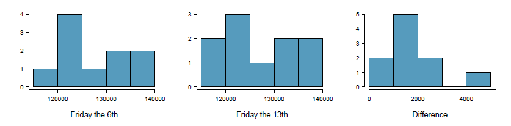
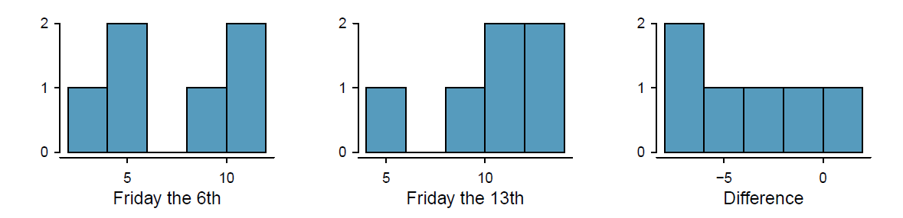
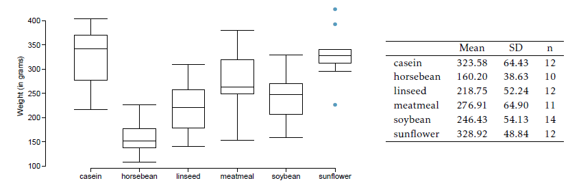

```{r setup, include=FALSE}
# Load useful packages
library(rmdformats)   # for extra formatting if needed
knitr::opts_chunk$set(echo = TRUE, warning = F, message = F, fig.retina = 5)
library(ggplot2)
```

```{=html}
<style>
body {
  font-size: 14px;   /* un poco más grande */
  color: black;      /* asegura texto en negro */
}

h1, h2, h3, h4, h5, h6 {
  color: #D9230F;        /* títulos en rojo */
}

h3, h4, h5, h6 {
  color: black;        /* títulos en rojo */
}

h3 {
  font-size: 1em;   /* tamaño igual al texto normal */
}

@import url('https://fonts.googleapis.com/css2?family=Handlee&display=swap');

.handwritten {
  font-family: 'Handlee', monospace;
  font-size: 1.1em;
}

.respuesta {
  background-color: #F0F0F0;
  padding: 15px;
  margin: 10px 0;
  border-radius: 8px;
  line-height: 1.2;
}
</style>
```

<center>

</center>

# Inferencia de una única muestra con la distribución de t

## Problema 1

**Identifica el valor t crítico**. Se obtiene una muestra aleatoria e independiente de una población que sigue una distribución normal y  una desviación estándard desconocida. Encuentra los grados de libertad y el valor crítico de t para los siguientes tamaños de muestra y niveles de confianza.

### a) $n=6$, $NC=90%$ 

### b) $n=21$, $NC=98%$ 

### c) $n=29$, $NC=95%$ 

### d) $n=12$, $NC=99%$ 

<br>
<details>
<summary>Respuestas</summary>

| Caso | Resultado |
|:------:|:-----------:|
| a) $n=6$, $NC=90%$  | gl=5, t=2.02 |
| b) $n=21$, $NC=98%$  | gl=20, t=2.53 |
| c) $n=29$, $NC=95%$  | gl=28, t=2.05 |
| d) $n=12$, $NC=99%$  | gl=11, t=3.11 |
</details>


## Problema 2

Un intervalo de confianza del 95% para la media de una población $\mu$ es $(18.985,21.015)$. El intervalo de confianza está basado en una muestra aleatoria de 36 observaciones. Calcula la media y la desviación estándard. Asume que se cumplen todas las condiciones para hacer inferencia. Utiliza la distribución de `t` para los cálculos.

### Fórmulas esenciales

1. **Estadístico t:**

$$
t = \frac{\bar{x} - \mu}{\frac{s}{\sqrt{n}}}
$$

2. **Intervalo de confianza (IC) para la media:**

$$
\bar{x} \pm t_{df} \times \frac{s}{\sqrt{n}}
$$

3. **Margen de error (ME):**

$$
ME = t_{df} \times \frac{s}{\sqrt{n}}
$$

<details>
<summary>Respuestas</summary>

| Caso | Resultado |
|:------:|:-----------:|
| $\mu$ | 20 |
| $s$  | 3 |
</details>


## Problema 3

Nueva York es conocida como "la ciudad que nunca duerme". Se preguntó a una muestra aleatoria de 25 neoyorquinos cuántas horas dormían por las noches. A continuación, se muestra un resumen estadístico de los datos. ¿Demuestran estos datos que los habitantes de Nueva York duermen, en promedio, más o menos de 8 horas por noche?

|  $n$  |   $\bar{x}$  | $s$  | $min$  |  $max$ |
|:-----:|:-----:|:----:|:----:|:----:|
| 25 | 7.73 |  0.77 | 6.17 | 9.78 |

### a) Escribe la hipótesis, con palabras y con símbolos.

### b) Comprueba las condiciones, calcula el estadístico t, y los grados de libertad asociados.

### c) Encuentra el valor t crítico (considera $\alpha=0.05$).

### d) ¿Cuál es la conclusión del test?

### e) Si fueras a construir un intervalo de confianza del 90% que correspondiera con este test de hipótesis, esperarías que las 8h estuvieran dentro del intervalo?


<details>
<summary>Respuestas</summary>

| Caso | Resultado |
|:------:|:-----------:|
| a)    | $H_0:\mu=8$, $H_1:\mu \ne 8$ |
| b)     | Independencia: la muestra es aleatoria. El min/max sugieren que no hay outliers. $t=-1.75$, $df=24$ |
| c)  |  $t_{crit}=2.06$ |
| d) | No rechazamos la $H_0$ |
| e) | $t_{crit}=1.71$, quedaría fuera del IC ($[7.4665,7.9935]$) |

</details>


## Problema 4

Se te dan la siguientes hipótesis:

$$
H_0: \mu = 60
$$

$$
H_1: \mu < 60
$$

Sabemos que la desviación estándard de la muestra es 8 y el tamaño de la muestra es 20. Para qué media de muestra sería el p-valor igual a 0.05? Asume que todas las condiciones para hacer inferencia se cumplen.

<details>
<summary>Respuestas</summary>
| Caso | Resultado |
|:------:|:-----------:|
| $t_{crit}$ | -1.7291 |
| Posible $x$ | 56.907 |

</details>


## Problema 5

Georgianna afirma que en una ciudad reconocida por su escuela de música, los niños, en promedio, toman menos de 5 años de lecciones de piano. Tenemos una muestra aleatoria de 20 niños de la ciudad, con una media de 4.6 años de clases de pianos y una desviación estándard de 2.2 años.

### a) Evalua la afirmación de Georgianna utilizando una prueba de hipótesis.

### b) Construye un intervalo al 95% de confianza para el número de años que los estudiantes han tomado clases de piano, e interpétalo en el contexto de los datos.

### c) Los resultados de la prueba de hipótesis y el IC concurdan? Explícalo.

<details>
<summary>Respuestas</summary>
| Caso | Resultado |
|:------:|:-----------:|
| a) | $H_0:\ \mu = 5$, $H_1:\ \mu < 5$   |
| b) | $t_{stat} = -0.81$, $t_{crit} = -1.729$. IC95%= $(-\infty, 5.45)$  |
| c) | No rechazamos $H_0$. El IC contiene 5 años. |

</details>


## Problema 6
Un investigador de mercado quiere evaluar los ahorros en seguros de automóvil en una compañía competidora. Basándose en estudios previos, asume que la desviación estándar de los ahorros es de 100€. Quiere recoger datos de manera que el margen de error no sea superior a 10€ con un nivel de confianza del 95%. ¿Cuál debe ser el tamaño de la muestra que debe recolectar?

Fórmula esencial:

$$
N \ge (\frac{t_{crit}\times\sigma}{E})^2
$$

<details>
<summary>Respuestas</summary>
| Caso | Resultado |
|:------:|:-----------:|
| $t_{crit}$ | $t_{crit}=1.96$ (si la muestra es grande)  |
| $n$ mínima | 384.16 -> 385 |

</details>

# Problemas de t-test con datos pareados

## Problema 7

Consideremos un conjunto limitado de datos climáticos, examinando las diferencias de temperatura en 1948 frente a 2018. Muestreamos 197 ubicaciones de los datos históricos de la Administración Nacional Oceánica y Atmosférica (NOAA), donde los datos estaban disponibles para ambos años de interés. Queremos saber: ¿hubo más días con temperaturas superiores a 90°F en 2018 o en 1948?

La diferencia en el número de días con temperaturas superiores a 90°F (número de días en 2018 − número de días en 1948) se calculó para cada una de las 197 ubicaciones. El promedio de estas diferencias fue de 2,9 días con una desviación estándar de 17,2 días. Nos interesa determinar si estos datos proporcionan evidencia sólida de que hubo más días en 2018 con temperaturas superiores a 90°F en las estaciones meteorológicas de la NOAA.

<center>

</center>

### a) ¿Existe una relación entre las observaciones recogidas en 1948 y en 2018? ¿O las observaciones en los dos grupos son independientes? Explica.

### b) Escribe las hipótesis para esta investigación, tanto en símbolos como en palabras.

### c) Verifica las condiciones requeridas para realizar esta prueba. Se proporciona un histograma de las diferencias a la derecha.

### d) Calcula el estadístico de prueba y encuentra el valor t crítico.

### e) Usa $\alpha$=0.05 para evaluar la prueba e interpreta tu conclusión en contexto.

### f) ¿Qué tipo de error podríamos haber cometido? Explica, en contexto, qué significa este error.

### g) Basándote en los resultados de esta prueba de hipótesis, ¿esperarías que un intervalo de confianza para la diferencia promedio entre el número de días superiores a 90 °F en 1948 y 2018 incluya el 0? Explica tu razonamiento.


<details>
<summary>Respuestas</summary>
| Caso | Resultado |
|:------:|:-----------:|
| a) | Los datos son pareados  |
| b) | $H_0: \mu_{dif}=0$,  $H_1: \mu_{dif}\ne0$ |
| c) | N de almenos 30. Localizaciones muestreadas de manera aleatoria. No outliers extremos (histograma) |
| d) | $SE=1.225$, $t=2.366$, $t_{crit}=1.96$ |
| e) | Rechazamos $H_0$ |
| f) | Error de tipo 1, ya que puede ser que erróneamente rechamos $H_0$. |
| g) | No, porque hemos rechazado la $H_0$ |


</details>


## Problema 8

Se hipotetiza que el color azul-verde de la cáscara de los huevos de muchas especies de aves representa una señal informativa sobre la salud de la hembra que puso los huevos. Para investigar esta hipótesis, los investigadores realizaron un estudio en el que las aves asignadas al grupo de tratamiento recibieron alimento suplementario antes y durante la puesta; predicen que, si la coloración de la cáscara está relacionada con la salud de la hembra al momento de poner los huevos, las hembras que recibieron alimento suplementario pondrán huevos de color azul-verde más intenso que las hembras del grupo control. Los nidos fueron emparejados según el momento en que comenzó la construcción del nido, y el estudio examinó 16 pares de nidos.

### a) Se midió la croma azul-verde (BGC) de los huevos el día de la puesta; BGC se refiere a la proporción de la reflectancia total que se encuentra en la región azul-verde del espectro, siendo un valor más alto indicativo de un color azul-verde más intenso. En el grupo con alimento suplementario, la croma BGC tenía $\bar{x}=0.594$ y $s=0.010$. En el grupo control, la croma BGC tenía $\bar{x}=0.586$ y $s=0.009$. Una prueba t pareada resultó en $t=2.28$ y $p-valor=0.038$. Interpreta los resultados en el contexto de los datos.

### b) En general, se sabe que las aves más saludables también ponen huevos más pesados. También se midió la masa del huevo en ambos grupos: grupo con alimento suplementario: $\bar{x}=1.70$ gramos y $s=0.11$ gramos; grupo control: $\bar{x}=0.586$ gramos y $s=0.009$. El estadístico de prueba de una prueba t pareada fue $t=2.64$ con valor $p-valor= 0.019$. Calcula e interpreta un intervalo de confianza del 95% para la diferencia media poblacional en la masa del huevo entre los grupos.


<details>
<summary>Respuestas</summary>
| Caso | Resultado |
|:------:|:-----------:|
| a) | Rechazamos $H_0$ |
| b) | Con un 95% de confianza, el intervalo (0.215,2.01)g contiene la diferencia de la media poblacional |


</details>


# Problemas t-test muestras independientes

## Problema 9

A principios de la década de 1990, investigadores en el Reino Unido recopilaron datos sobre el flujo de tráfico, el número de compradores y las admisiones a urgencias relacionadas con accidentes de tráfico los viernes 13 y el viernes anterior, el viernes 6. Los histogramas a continuación muestran la distribución del número de coches que pasaban por una intersección específica el viernes 6 y el viernes 13 para muchos pares de fechas de este tipo. También se proporcionan algunas estadísticas muestrales, donde la diferencia se calcula como el número de coches el día 6 menos el número de coches el día 13.

<center>

</center>

| Estadístico | Viernes 6 | Viernes 13 | Diferencia | 
|:------:|:------:|:-----------:|:------:|
| $\bar{x}$ | 128385 | 126550 |1835
| $s$ | 7259 | 7664 | 1176 |
| $n$ | 10 | 10 |


### a) ¿Existen estructuras subyacentes en estos datos que deban considerarse en el análisis? Explica.

### b) ¿Cuáles son las hipótesis para evaluar si el número de personas presentes el viernes 6 es diferente del número presente el viernes 13?

### c) Verifica las condiciones necesarias para llevar a cabo la prueba de hipótesis del apartado (b).

### d) Calcula el estadístico de prueba y valor t crítico.

### e) ¿Cuál es la conclusión de la prueba de hipótesis?

### f) ¿Qué tipo de error podría haberse cometido en la conclusión de la prueba? Explica.


<details> <summary>Respuestas</summary> 
| Caso | Resultado | 
|:------:|:-----------:| 
| a) | Datos pareados (los mismos meses se comparan) | 
| b) | $H_0: \mu_{diff}=0$, $H_1: \mu_{diff} \ne 0$ | 
| c) | Independencia razonable; normalidad: no outliers extremos significativos | 
| d) | $t = 4.93$, $df = 9$, $t_{crit}=2.26$ | 
| e) | Rechazamos $H_0$: más coches el viernes 6 que el 13 | 
| f) | Posible error Tipo I | 
</details>


## Problema 10

A partir del estudio del viernes 13 (problema 9), se proporcionan datos sobre admisiones a urgencias relacionadas con accidentes de tráfico.
Se muestran las distribuciones de los recuentos de admisiones para seis pares de fechas (viernes 6 y viernes 13), junto con estadísticas resumidas.
Se puede asumir que se cumplen las condiciones para inferencia.

<center>

</center>

Estadístico | Viernes 6 | Viernes 13 | Diferencia | 
|:------:|:------:|:-----------:|:------:|
| $\bar{x}$ | 7.5 | 10.83 | -3.33 |
| $s$ | 3.33 | 3.6 | 3.01 |
| $n$ | 6 | 6 | 6 |

### a) Realiza una prueba de hipótesis para evaluar si existe una diferencia entre el número promedio de admisiones por accidentes de tráfico entre viernes 6 y viernes 13.

### b) Calcula un intervalo de confianza del 95% para la diferencia entre el número promedio de admisiones por accidentes entre viernes 6 y viernes 13.

### c) El estudio original concluye: “El viernes 13 es de mala suerte para algunos. El riesgo de admisión hospitalaria por un accidente de tráfico puede aumentar hasta un 52%. Se recomienda quedarse en casa.” ¿Estás de acuerdo con esta afirmación? Explica tu razonamiento.

<details> <summary>Respuestas</summary>

| Caso | Resultado | 
|:------:|:-----------:| 
| a) | $H_0: \mu_{diff}=0$, $H_1: \mu_{diff} \ne 0$; $t = -2.71$, $df = 5$, $t_crit = 2.57$ → Rechazamos $H_0$ | 
| b) | IC 95% para la diferencia promedio: $(-6.49, -0.17)$ | 
| c) | No podemos concluir causalidad; sí hay diferencia observacional, pero no implica que salir el viernes 13 sea inherentemente más riesgoso | 
</details>


## Problema 11

Se realizó un experimento para medir y comparar la efectividad de distintos suplementos de alimento en la tasa de crecimiento de los pollos.
Los pollitos recién nacidos fueron asignados aleatoriamente a seis grupos, y cada grupo recibió un suplemento distinto. Se muestran los resultados en la siguiente tabla resumen, y los boxplots que muestran la distribución:

<center>

</center>

### a) Describe las distribuciones de los pesos de los pollos que fueron alimentados con linaza (linseed) y con haba de caballo (horsebean).

### b) ¿Proporcionan estos datos evidencia sólida de que los pesos promedio de los pollos alimentados con linaza y con haba de caballo son diferentes? Usa un nivel de significación del 5%.

### c) ¿Qué tipo de error podríamos haber cometido? Explica.


<details> <summary>Respuestas</summary> 
| Caso | Resultado | 
|:------:|:-----------:| 
| a) | Linaza: media 218.75 g, simétrica, más variabilidad; Haba: media 160.20 g, simétrica, menos variabilidad | 
| b) | $H_0: \mu_{ls} = \mu_{hb}$, $H_1: \mu_{ls} \ne \mu_{hb}$; $t = 3.02$, $df = 20$ → Rechazamos $H_0$ | 
| c) | Posible error Tipo I, ya que rechazamos $H_0$ | 
</details>


## Problema 12

Un grupo de investigadores está interesado en los posibles efectos de estímulos distractores durante la comida, como un aumento o disminución en la cantidad de comida consumida. Para probar esta hipótesis, monitorizaron la ingesta de galletas en un grupo de 44 pacientes, divididos aleatoriamente en dos grupos iguales: 

- Grupo tratamiento: comió mientras jugaba al solitario.

- Grupo control: comió sin distracciones adicionales.

Resultados:

- Grupo tratamiento: media = 52.1 g de galletas, SD = 45.1 g

- Grupo control: media = 27.1 g de galletas, SD = 26.4 g

Se quiere evaluar si existe evidencia de que la ingesta promedio difiere entre los grupos. Se asume que se cumplen las condiciones de inferencia.


<details> <summary>Respuestas</summary>
| Caso | Resultado | 
|:------:|:-----------:| 
| a) | $H_0: \mu_T = \mu_C$, $H_1: \mu_T \ne \mu_C$ | 
| b) | $t = 2.24$, $df = 42$, $t_{crit}=2.018$ → Rechazamos $H_0$ | 
| c) | Los pacientes del grupo distraído (tratamiento) consumen más galletas que los del grupo control | </details>


