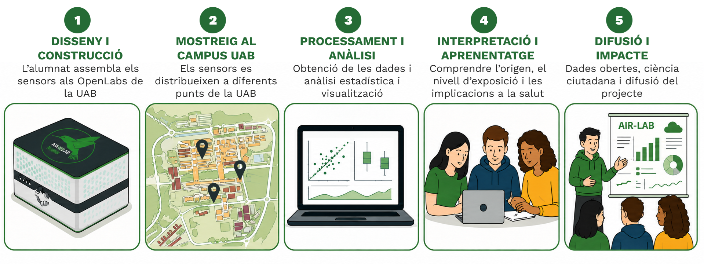
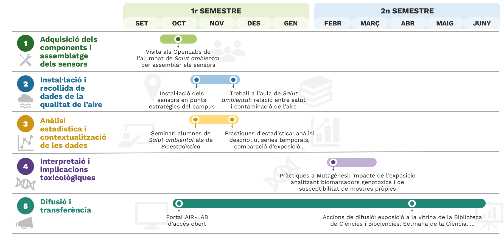
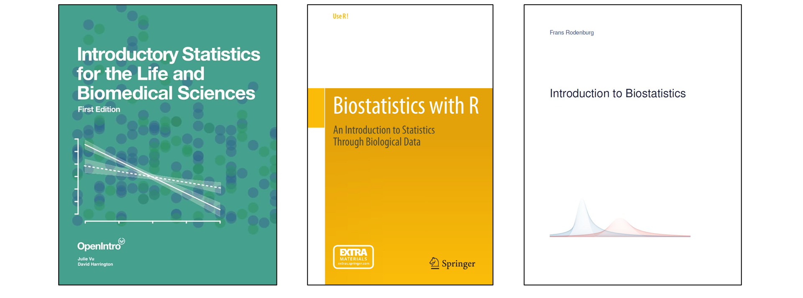
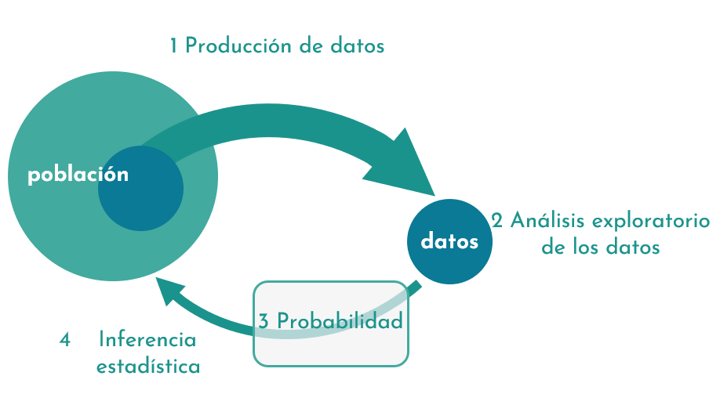
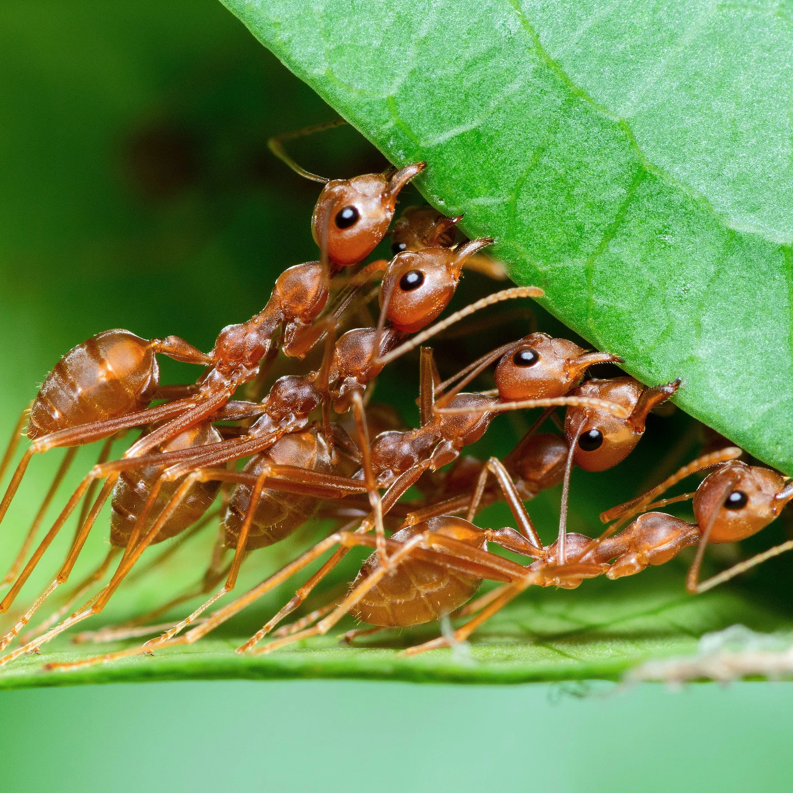
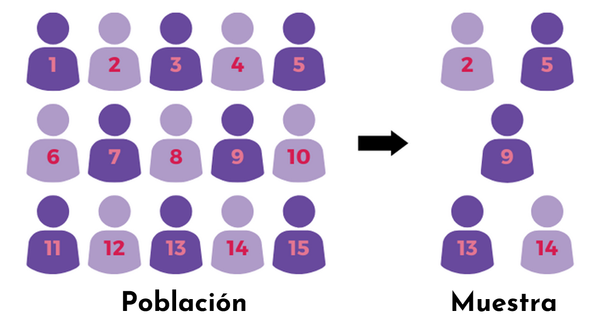
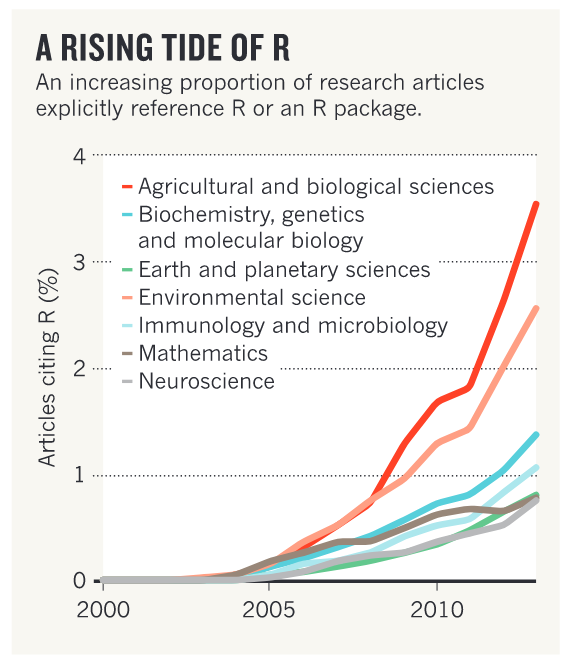
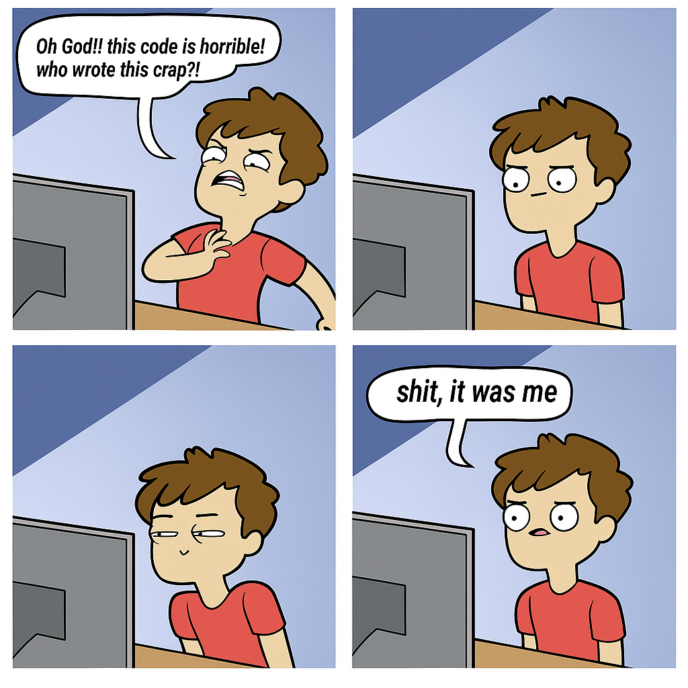

```{r setup, include=FALSE}
options(htmltools.dir.version = FALSE)
#knitr::include_graphics()
knitr::opts_chunk$set(
  cache = TRUE,
  echo = TRUE,
  message = FALSE, 
  warning = FALSE,
  hiline = TRUE,
  fig.retina = 5
)
knitr::opts_chunk$set(
  comment = "")

library(ggplot2)
library(readr)
library(knitr)
#pagedown::chrome_print("PresentacionBioestadistica.html")
```

```{r xaringan-themer, include=FALSE, warning=FALSE}
library(xaringanthemer)
style_mono_accent(
  base_color = "#1c5253", link_color =  "#DE1144", code_inline_color = "#DE1144",
  header_font_google = google_font("Josefin Sans"),
  text_font_google   = google_font("Montserrat", "400", "400i"),
  code_font_google   = google_font("Roboto Mono"),
    
)
```


```{r xaringanExtra-clipboard, echo=FALSE}
library(xaringanExtra)
htmltools::tagList(
  xaringanExtra::use_clipboard(
    button_text = "<i class=\"fa fa-clipboard\"></i>",
    success_text = "<i class=\"fa fa-check\" style=\"color: #90BE6D\"></i>",
  ),
  rmarkdown::html_dependency_font_awesome()
)
```


class: title-slide, animated, fadeIn

.left-top[
# Presentación de la asignatura
.subtitle[Bioestadística]

]

.left-bottom[
.authors[
Marta Coronado ([marta.coronado@uab.cat](mailto:marta.coronado@uab.cat))  
David Castellano ([david.castellano@uab.cat](mailto:david.castellano@uab.cat))
]

.footer-info[
**Grado en Genética | 14/09/2026**
]
]

.right-panel[]


<style>
.title-slide {
  background-image: none;
}

/* Contenedor teal superior (solo título) */
.title-slide .left-top {
  position: absolute;
  top: 0; left: 0;
  width: 60%;
  height: 62%;
  background-color: #163a3a;
  color: white;
  padding: 50px 45px 30px 65px;
  margin: 0;
  display: flex;
  flex-direction: column;   /* ← esto faltaba */
  align-items: flex-start;  /* ← con column, flex-end alinearía a la derecha; usa flex-start para pegar a la izquierda */
  justify-content: flex-end;
  box-sizing: border-box;
}

/* Contenedor blanco inferior (autores, fecha) */
.title-slide .left-bottom {
  position: absolute;
  bottom: 0; left: 0;
  width: 60%;
  height: 38%;
  background-color: white;
  color: #222;
  display: flex;
  flex-direction: column;
  justify-content: center;
  box-sizing: border-box;
  padding: 20px 45px 30px 65px;
  margin: 0;
}

.title-slide .right-panel {
  position: absolute;
  top: 0; right: 0; bottom: 0;
  width: 41%;
  background-color: white;
  background-image: url('img/1.png');
  background-size: contain;
  background-repeat: no-repeat;
  background-position: center;
  padding: 40px;
  box-sizing: border-box;
}

.title-slide h1 {
  font-size: 1.9em;
  line-height: 1.25;
  margin: 0;
  font-weight: 400;
}

.title-slide .subtitle {
  display: block;   /* ← esto es la clave: sin esto, margin-top se ignora */
  font-size: 2em;
  font-weight: bold;
  color: #7ac142;
  margin-top: -35px;
  margin-bottom: 15px;
}

.title-slide .authors {
  font-size: 0.95em;
  line-height: 1.6;
  margin-bottom: 12px;
}

.title-slide .authors a {
  color: #e8846b;
  text-decoration: none;
}

.title-slide .footer-info {
  font-size: 0.9em;
  color: #444;
}

.remark-slide-content h2,
.remark-slide-content h3,
.remark-slide-content h4,
.remark-slide-content h5 {
  margin-top: 1em;
  margin-bottom: 0.6em;
}

.remark-slide-content p,
.remark-slide-content ul,
.remark-slide-content ol {
  margin-top: 0.2em;
  margin-bottom: 0.2em;
}

.remark-slide-content li {
  margin-bottom: 0.1em;
}

</style>


---

class: animated, fadeIn
## Contacto

<div style="margin-top: 20vh; text-align:center;">

| Marta Coronado Zamora | David Castellano | 
|:-:|:-:|
| <a href="mailto:marta.coronado@uab.cat"><i class="fa fa-paper-plane fa-fw"></i> marta.coronado@uab.cat</a> | <a href="mailto:david.castellano@uab.cat"><i class="fa fa-paper-plane fa-fw"></i>&nbsp; david.castellano@uab.cat</a> | 
| <a href="https://bsky.app/profile/geneticament.bsky.social"><i class="fab fa-bluesky fa-fw"></i>&nbsp; @geneticament.bsky.social</a> |                 <a href="https://bsky.app/profile/castellanoed.bsky.social"><i class="fab fa-bluesky fa-fw"></i>&nbsp; @castellanoed.bsky.social</a> |
| <a href="https://www.uab.cat"><i class="fa fa-map-marker fa-fw"></i>&nbsp; Universitat Autònoma de Barcelona</a> |    <a href="https://gutengroup.mcb.arizona.edu/"> <i class="fa fa-map-marker fa-fw"></i>&nbsp; University of Arizona</a> |

---
class: animated, fadeIn

## Objetivos de la asignatura 


<center>
</img>
</center>

- Comprender los conceptos fundamentales de la **estadística descriptiva** e **inferencial**
- Desarrollar la **capacidad de aplicar métodos estadísticos** a preguntas de Genética
- Aprender a **formular hipótesis**, interpretar resultados y reconocer sus limitaciones
- Adquirir competencias en el **uso de `R`** para el manejo de datos, análisis y visualización
- **Comunicar resultados** con tablas y figuras claras y rigurosas
- Introducir **estadística Bayesiana** y **aprendizaje automático** (*Deep Learning*)

---
class: animated, fadeIn
## Visión general del curso

.pull-left[
#### **Bloque 1. Introducción a la bioestadística y visualización de datos**
<span style="font-size:0.8em">Estadística descriptiva ● Introducción a `R` ● Visualización de datos con `ggplot2` ● Importancia de mostrar los datos</span>


#### **Bloque 2. Distribuciones de probabilidad e intervalos de confianza**
<span style="font-size:0.8em">Distribuciones de probabilidad (binomial, Poisson, normal) ● Teorema central del límite ● Estimación: error estándar e intervalos de confianza</span>

#### **Bloque 3. Inferencia estadística y contraste de hipótesis**
<span style="font-size:0.8em">Razonamiento estadístico y creación de hipótesis ● Contraste por remuestreo: permutación y *bootstrap* ● Errores I/II, tamaño de efecto y potencia ● T-test ● ANOVA de una y dos vías ● Alternativas no paramétrica </span>
]

--

.pull-right[
#### **Bloque 4. Modelos lineales y relaciones entre variables cuantitativas y categóricas**
<span style="font-size:0.8em">Correlación ● Regresión lineal: simple y múltiple ● Regresión logística y modelos lineales generalizados, GLM ● Test de χ² y test exacto de Fisher </span>

#### **Bloque 5. Corrección de contrastes múltiples e inferencia causal**
<span style="font-size:0.8em">Comparaciones múltiples: FWER y FDR, con los métodos de Bonferroni, Holm y Benjamini-Hochberg ● Inferencia causal: correlación, confusión y grafos causales o DAGs</span>


#### **Bloque 6. Métodos y temas avanzados**
<span style="font-size:0.8em">Estadística Bayesiana: Bayes, priors, posteriors e intervalos creíbles, estimación de la posterior y MCMC ● *Deep learning* y modelos de lenguaje LLM: del perceptrón a las redes neuronales</span>
]

---
class: animated, fadeIn
## Evaluación

### Evaluación continua

.pull-left[
#### **Exámenes** (50%)
- Primer parcial (20%)
- Segundo parcial (30%)

#### **Seminarios** (30%)
- Participación en clase (10%)
- Presentación en grupo (20%)

#### **Prácticas** (20%)
- Exámen práctico (20%)

###  Evaluación única
- Exámen de teoría (70%), examen práctico (15%) y entrega problemas (15%)
]

--

.pull-right[

<i class="fa fa-warning fa-fw"></i> El alumnado deberá notificar por correo electrónico, durante el primer día de clase, si opta por la **evaluación continua** o por la **evaluación única**.


]

---
class: animated, fadeIn

### Participación en el proyecto de innovación docente **AIR-LAB**

#### *El campus com a laboratori viu per a l’avaluació i la conscienciació de la qualitat de l’aire a la UAB*

<center></img>
</center>

Profesorado colaborador: David Castellano y Marta Coronado (*Bioestadística*, Genética), Helen Cole (*Salud ambiental*, Ciencias Ambientales) y Laura Rubio y Álba González (*Módulo de Mutagénesis*, Genética).

---
class: animated, fadeIn

### Participación en el proyecto de innovación docente **AIR-LAB**

### Calendario

<center></img>
</center>

<i class="fa fa-warning fa-fw"></i>  22 de octubre de 15-16h: clase conjunta con *Salud ambiental*<br>
<i class="fa fa-info-circle fa-fw"></i> Clase práctica analizando datos (práctica 3 o 4)

---
class: animated, fadeIn

# Lecturas útiles

<center>
</img>
</center>
<br><br>

- Libros disponibles en línea en la Biblioteca de Biociències: https://apps.uab.cat/guies/public/html/2026/assignatura/101965/ca

- Si quieres más recursos para la asignatura, pídenoslo!


---
layout: false
class: left, bottom, inverse, animated, bounceInDown

# 01
## Organización del Bloque 1

---
class: animated, fadeIn
## Organización

#### **1. Clases de teoría**: 30h de teoría - diapositivas interactivas (`Rmd`).
#### **2. Seminarios**: 11 seminarios - resolución de problemas y dudas, presentaciones.
#### **3. Prácticas**: 6 prácticas de ordenador (2h/práctica). Aplicación de `R` a datos reales.

- Material del curso: https://marta-coronado.github.io/biostatistics-uab/

--

.pull-left[
### Diapositivas interactivas 

**Documentos de <i class="fab fa-r-project fa-fw"></i></i> interactivos**  

Código de `R` ejecutable dentro de la diapositiva.

```{r, echo=TRUE}
values <- c(31.45, 78.1, 93.6, 12.3)
mean(values)
```
]

.pull-right[
<br>
```{r, echo = F, fig.height=4, fig.width=6}

library(ggplot2)

# Simular datos
set.seed(123)
df <- data.frame(
  x = rnorm(20, mean = 50, sd = 10),
  y = rnorm(20, mean = 50, sd = 10)
)

# Graficar correlación
ggplot(df, aes(x = x, y = y)) +
  geom_point(color = "#69b3a2", size = 4, alpha = 0.7) +   # puntos grandes y pastel
  geom_smooth(method = "lm", color = "#404080", se = TRUE, fill = "#B0C4DE", alpha = 0.3) + # línea de tendencia con banda
  labs(
    x = "X",
    y = "Y"
  ) +
  theme_minimal(base_size = 16) +
  theme(
    plot.background = element_rect(fill = "#FFF8F0", color = NA),
    panel.grid.minor = element_blank(),
    panel.grid.major = element_line(color = "#E0E0E0")
  )
```

]


---
layout: false
class: left, bottom, inverse, animated, bounceInDown

# 02
## Organización del Bloque 2

---

---
layout: false
class: left, bottom, inverse, animated, bounceInDown

# 03
## Introducción a la bioestadística

---
class: animated, fadeIn

# _ The big picture of statistics_

Toda **investigación** empieza con una **pregunta**:

<br>

.pull-left[

1. **Producir datos**:  diseñar bien el estudio y aleatorizar los datos<br><br>

2. **Explorar los datos**: describir numérica y gráficamente los datos (estadística descriptiva)<br><br>

3. **Probabilidad**: conecta la muestra con la población<br><br>

4. **Extraer conclusiones**: estadística inferencial para llegar a conclusiones sobre la población a partir de una muestra
]

.pull-right[
</img>
]

---
class: animated, fadeIn

# Población *vs.* muestra

.pull-left[**Población**: describe el total de todos los valores existentes de una variable según una pregunta determinada. Esto incluye datos no medidos.
]

.pull-right[**Muestra**: describe el total de todos los valores disponibles de una variable para un análisis determinado. Solo puede incluir datos medidos.
]

<br>

--

*Ejemplo*:
.right-column[
<i class="fa fa-microscope fa-fw"></i> En un experimento, crías una colonia de hormigas de exactamente 10.000 individuos.

<i class="fa fa-teeth fa-fw"></i> Te interesa la fuerza promedio de la mandíbula de las hormigas dentro de la colonia.

<i class="fa fa-square-xmark fa-fw"></i> El problema: No es posible medir a los 10.000 individuos.

<i class="fa fa-thumbs-up fa-fw"></i> La solución: Tomar medidas sobre una **muestra** (por ejemplo, 1.000 individuos) dentro de la **población** (10.000 individuos).
]


.left-column[
<br>
</img>
]

---
class: animated, fadeIn

# Señal y ruido

- **Señal:** información relevante que queremos detectar

- **Ruido:** variación aleatoria que la esconde  

--

<br>

<br>
*Ejemplo*:

.right-column[
- **Hipótesis**: "Una dieta rica en proteína aumenta la fuerza de la mandíbula en las hormigas"<br><br>
  
  - **Señal:** la diferencia real en fuerza de mandíbula entre colonias con distinta dieta
  
  - **Ruido:** todo lo demás que también hace variar la fuerza: edad de las hormigas, errores de medición, diferencias entre individuos, microambiente...
]

.left-column[
<br>
</img>
]

---
class: animated, fadeIn

# ¿Qué es la estadística?

- La estadística es la **ciencia de entender datos** y de **tomar decisiones frente a la variabilidad** y la **incertidumbre**.
  
  - Nos ayuda a separar la **señal** (información relevante) del **ruido** (variación aleatoria).

--

.pull-left[

#### Variabilidad

- La **variabilidad** es la diferencia natural entre observaciones.  

- Ejemplos:  
  - Fuerza de la mandíbula en hormigas de la misma colonia
  - Altura de plantas en el mismo experimento  
  - Tiempo de desarrollo de larvas de mosca  
]

.pull-right[

#### Incertidumbre

- La **incertidumbre** refleja **cuánto podemos confiar** en un resultado o estimación.  

- Ejemplos:

  - Medir solo 1.000 hormigas de una colonia de 10.000 (muestra pequeña)
  - Resolución limitada en el instrumento de medición
  
]

<br>
- La estadística nos permite **cuantificar y entender la variabilidad** y la **incertidumbre**.


???
variabilidad: Range, variance, and standard deviation are used to quantify variability. 

Incertidumbre: - Se puede cuantificar con: intervalos de confianza, desviación estándar, probabilidad.  
- Incluso un buen experimento tiene incertidumbre.  

"El ruido en este ejemplo es la variabilidad de las hormigas (edad, microambiente, medición...). Cuanta más de esta variabilidad haya, y cuantas menos hormigas midamos, más incertidumbre tendremos sobre si la señal (efecto de la dieta) es real."

---
class: animated, fadeIn

## **Hipótesis**: "Una dieta rica en proteína aumenta la fuerza de la mandíbula en las hormigas"<br><br>

### Con cuál te quedas: ¿A o B?
```{r, echo = FALSE, fig.align='center',fig.width=15}
library(ggplot2)
library(patchwork)

set.seed(42)

# --- Panel A: ALTA variabilidad ---
# Diferencia real entre grupos (5 unidades) pero con mucho ruido (sd alta)
# -> los boxplots se solapan a pesar de que SI hay diferencia real
n <- 10
control_A <- rnorm(n, mean = 50, sd = 12)
dieta_A   <- rnorm(n, mean = 80, sd = 12)

dfA <- data.frame(
  fuerza = c(control_A, dieta_A),
  grupo  = rep(c("Control", "Dieta"), each = n)
)

# --- Panel B: BAJA variabilidad ---
# Diferencia real MAS PEQUEÑA (3 unidades) pero con muy poco ruido (sd baja)
# -> los boxplots NO se solapan, la diferencia es clara pese a ser mas pequeña
control_B <- rnorm(n, mean = 50, sd = 1.2)
dieta_B   <- rnorm(n, mean = 55, sd = 1.2)

dfB <- data.frame(
  fuerza = c(control_B, dieta_B),
  grupo  = rep(c("Control", "Dieta"), each = n)
)

# --- Tema comun ---
tema_comun <- theme_classic(base_size = 18) +
  theme(
    axis.title.x = element_blank(),
    panel.grid.minor = element_blank(),
    legend.position = "none",
  )
 
colores <- c("Control" = "#8DA3A6", "Dieta" = "#1B6E77")
 
# --- Panel A ---
pA <- ggplot(dfA, aes(x = grupo, y = fuerza, fill = grupo)) +
  geom_boxplot(width = 0.5, alpha = 0.9, outlier.shape = NA) +
  geom_jitter(width = 0.08, size = 2, alpha = 0.6, color = "black") +
  stat_summary(
    fun = mean, geom = "text",
    aes(label = sprintf("%.1f", after_stat(y))),
    position = position_nudge(y = 6),
    size = 4.2, fontface = "bold", color = "firebrick4"
  ) +
  scale_fill_manual(values = colores) +
  labs(y = "Fuerza de mandíbula") +
  ylim(20, 100) +
  tema_comun
 
# --- Panel B ---
pB <- ggplot(dfB, aes(x = grupo, y = fuerza, fill = grupo)) +
  geom_boxplot(width = 0.5, alpha = 0.9, outlier.shape = NA) +
  geom_jitter(width = 0.08, size = 2, alpha = 0.6, color = "black") +
  stat_summary(
    fun = mean, geom = "text",
    aes(label = sprintf("%.1f", after_stat(y))),
    position = position_nudge(y = 3),
    size = 4.2, fontface = "bold", color = "firebrick4"
  ) +
  scale_fill_manual(values = colores) +
  labs(y = "Fuerza de mandíbula") +
  ylim(20, 100) +
  tema_comun

# --- Combinar en una sola figura, con etiquetas A/B tipo plot_grid ---
figura_final <- (pA + pB) +
  plot_annotation(tag_levels = "A") &
  theme(
    plot.tag = element_text(face = "bold", size = 20),
    plot.tag.position = c(0, 1)
  )
figura_final

```


---
exclude: true
class: animated, fadeIn

## ¿Qué hace que los datos sean realmente aleatorios?

### Aleatorización
- La aleatorización es una de las prácticas más importantes en los estudios biológicos.
- Un procedimiento de muestreo es **aleatorio** cuando **todos los miembros de la población** tienen **la misma probabilidad** de ser seleccionados para la muestra.
.pull-left[
### Recolección de datos
- Numerar todas las unidades del diseño experimental.
- Seleccionar las unidades cuyo número coincida con una secuencia de **números aleatorios**.
]
.pull-right[
</img>

]


---
exclude: true
class: animated, fadeIn

## Muestreo aleatorio en R

1. Hacemos el muestreo **reproducible** con `set.seed()`  

2. Definimos una **población**  

3. Usar la función `sample()` para crear una **muestra aleatoria**  

--

```{r, echo=TRUE}
# Hacemos que sea reproducible
set.seed(42)

# Definimos una población
pop <- c(1:15)
pop
```

--

```{r, echo=TRUE}
# Obtenemos una muestra aleatoria
sam <- sample(pop, 5, replace = FALSE)
sam
```

---
class: animated, fadeIn

# El poder de R

.pull-left[

R no es solo un **lenguaje de programación**, es un **entorno para estadística** y **creación de gráficos**:

- Código abierto, con una gran comunidad

- Fácil de instalar en cualquier plataforma

- Gestión de grandes conjuntos de datos

- Facilidad para crear gráficos

- Herramientas integradas

- Lenguaje de programación simple y efectivo

**_All-in-one_**!

]

.pull-right[
<center>
</img>
<br><font size="3"> <a href="https://www.nature.com/articles/517109a">Tippmann, S. Programming tools: Adventures with R. <br>Nature 517, 109–110 (2015)</a>.</font> 
</center>
]

---
class: animated, fadeIn

# Instalando R y RStudio

- **R** está disponible en [https://cloud.r-project.org/](https://cloud.r-project.org/)  para Windows, Linux y MacOS.

- **RStudio** está disponible en [https://posit.co/download/rstudio-desktop/](https://posit.co/download/rstudio-desktop/)  para Windows, Linux y MacOS.

### ¿Y si necesito ayuda?

- Foros especializados y muy activos:  
  - [https://stackoverflow.com/](https://stackoverflow.com/)  
  - [https://stackexchange.com/](https://stackexchange.com/)  
  

---
class: animated, fadeIn

# La evolución del código

.pull-left[
- Tu código y tus hábitos de programación **evolucionan** con el tiempo 

- omenta tu código, línea por línea si hace falta

- Un código **elegante** y **orgenado** es mucho más fácil de reproducir y entender

]
.pull-right[
<center>
</img>
</center>
]

---
class: animated, fadeIn

# Uso de la IA


.pull-left[
- El uso de IA (Claude, ChatGPT, ...) es bienvenido

- Se espera un uso crítico y reflexivo (no copiar/pegar sin revisar)

- Si lo usas para completar una práctica o entrega, repórtalo


]
.pull-right[
<center>
</img>
</center>
]

---
layout: false
class: left, bottom, inverse, animated, bounceInDown
### Agradecimientos
#### Dr. Hafid Laayouni (profesor de Bioestadística UAB-UPC-UPF), Erik Kusch (Aarhus University)  


