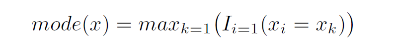

```{r setup, include=FALSE}
options(htmltools.dir.version = FALSE)
#knitr::include_graphics()
knitr::opts_chunk$set(
  cache = TRUE,
  message = FALSE, 
  warning = FALSE,
  hiline = TRUE,
  fig.retina = 5
)
library(ggplot2)
library(readr)
library(knitr)
#pagedown::chrome_print(".html")
```

```{r xaringan-themer, include=FALSE, warning=FALSE}
library(xaringanthemer)
style_mono_accent(
  base_color = "#1c5253", link_color =  "#DE1144", code_inline_color = "#DE1144",
  header_font_google = google_font("Josefin Sans"),
  text_font_google   = google_font("Montserrat", "400", "400i"),
  code_font_google   = google_font("Roboto Mono"),
    
)
```

```{r xaringanExtra-clipboard, echo=FALSE}
library(xaringanExtra)
htmltools::tagList(
  xaringanExtra::use_clipboard(
    button_text = "<i class=\"fa fa-clipboard\"></i>",
    success_text = "<i class=\"fa fa-check\" style=\"color: #90BE6D\"></i>",
  ),
  rmarkdown::html_dependency_font_awesome()
)
```


class: animated, fadeIn
# Outline

#### **1. Variables**
- ¿Qué es una variable?
- Tipos de variables
- Variables y escalas

#### **2. Estadística descriptiva**

- Métodos
- Parámetros de tendencia central
- Parámetros de posición 
- Parámetros de dispersión
- En `R`

<style>
.title-slide {
  background-image: url('img/1.png');
  background-size: 100%;
}
</style>


---

layout: false
class: left, bottom, inverse, animated, bounceInDown
# 01
## Variables

---
class: animated, fadeIn

# Variables

.pull-left[
Una **variable** representa **información** acerca de diferentes **características** de un sistema de estudio (**población**).
]

.pull-right[
<style>
  table.custom {
    border-collapse: collapse;
    width: 100%;
    margin: 0 auto;
    font-size: 16px; /* Cambia el tamaño según lo necesites */
  }
  table.custom th, table.custom td {
    border: 1px solid #444;
    padding: 8px 12px;
    text-align: center;
  }
  table.custom th {
    background-color: #0E8A8A;
    color: white;
  }
  table.custom tr:nth-child(even) {
    background-color: #f2f2f2;
  }
</style>

<table class="custom">
  <thead>
    <tr>
      <th>Muestra</th>
      <th>Variable</th>
      <th>Unidad de observación</th>
    </tr>
  </thead>
  <tbody>
    <tr>
      <tr>
  <td>150 bebés nacidos en un determinado hospital</td>
  <td>Peso al nacer (kg)</td>
  <td>Un bebé</td>
</tr>
<tr>
  <td>73 polillas <em>Cecropia</em> capturadas en una trampa</td>
  <td>Sexo</td>
  <td>Una polilla</td>
</tr>
<tr>
  <td>81 plantas descendientes de un cruce parental único</td>
  <td>Color de la flor</td>
  <td>Una planta</td>
</tr>
<tr>
  <td>Colonias bacterianas en cada uno de seis platos de Petri</td>
  <td>Número de colonias</td>
  <td>Un plato de Petri</td>
</tr>
    </tr>
  </tbody>
</table>

]

---
class: animated, fadeIn

# Variables

.pull-left[
Una **variable** representa **información** acerca de diferentes **características** de un sistema de estudio (**población**).

- El muestreo siempre es **limitado**: solo podemos observar una fracción de todos los valores posibles que existen para una variable.

- Cada variable sigue una cierta **distribución** de valores, y cada medición que realizamos se espera que refleje, en mayor o menor grado, esa **distribución global**.

]

.pull-right[
<style>
  table.custom {
    border-collapse: collapse;
    width: 100%;
    margin: 0 auto;
    font-size: 16px; /* Cambia el tamaño según lo necesites */
  }
  table.custom th, table.custom td {
    border: 1px solid #444;
    padding: 8px 12px;
    text-align: center;
  }
  table.custom th {
    background-color: #0E8A8A;
    color: white;
  }
  table.custom tr:nth-child(even) {
    background-color: #f2f2f2;
  }
</style>

<table class="custom">
  <thead>
    <tr>
      <th>Muestra</th>
      <th>Variable</th>
      <th>Unidad de observación</th>
    </tr>
  </thead>
  <tbody>
    <tr>
      <tr>
  <td>150 bebés nacidos en un determinado hospital</td>
  <td>Peso al nacer (kg)</td>
  <td>Un bebé</td>
</tr>
<tr>
  <td>73 polillas <em>Cecropia</em> capturadas en una trampa</td>
  <td>Sexo</td>
  <td>Una polilla</td>
</tr>
<tr>
  <td>81 plantas descendientes de un cruce parental único</td>
  <td>Color de la flor</td>
  <td>Una planta</td>
</tr>
<tr>
  <td>Colonias bacterianas en cada uno de seis platos de Petri</td>
  <td>Número de colonias</td>
  <td>Un plato de Petri</td>
</tr>
    </tr>
  </tbody>
</table>

]

---
class: animated, fadeIn

### Distribuciones según el tipo de variable

#### Variables cuantitativas

```{r eval=T, echo = F, fig.height=2.8,fig.width=12, fig.align="center", fig.retina=5}
library(ggplot2)
library(dplyr)
library(patchwork)

# Función para simplificar el tema de cada gráfico
clean_theme <- function() {
  theme_void() + 
    theme(
      plot.title = element_text(hjust = 0.5), # centrar títulos
      panel.border = element_rect(colour = "black", fill = NA, size = 0.8) # marco exterior
    )
}

# Distribuciones continuas
# Uniforme
df_unif <- data.frame(x = seq(0, 1, 0.01), y = dunif(seq(0, 1, 0.01), 0, 1))
p_unif <- ggplot(df_unif, aes(x, y)) +
  geom_area(fill = "#0E8A8A", alpha = 0.6) +
  labs(title = "Uniforme") +
  clean_theme()

# Exponencial
df_exp <- data.frame(x = seq(0, 5, 0.01), y = dexp(seq(0, 5, 0.01), 1))
p_exp <- ggplot(df_exp, aes(x, y)) +
  geom_area(fill = "#0E8A8A", alpha = 0.6) +
  labs(title = "Exponencial") +
  clean_theme()

# Normal
df_norm <- data.frame(x = seq(-4, 4, 0.01), y = dnorm(seq(-4, 4, 0.01), 0, 1))
p_norm <- ggplot(df_norm, aes(x, y)) +
  geom_area(fill = "#0E8A8A", alpha = 0.6) +
  labs(title = "Normal") +
  clean_theme()

# Distribuciones discretas
# Binomial
x_binom <- 0:20
df_binom <- data.frame(x = x_binom, y = dbinom(x_binom, size = 20, prob = 0.5))
p_binom <- ggplot(df_binom, aes(x, y)) +
  geom_col(fill = "#0E8A8A", alpha = 0.6) +
  labs(title = "Binomial") +
  clean_theme()

# Geométrica
x_geom <- 1:15
df_geom <- data.frame(x = x_geom, y = dgeom(x_geom-1, prob = 0.3))
p_geom <- ggplot(df_geom, aes(x, y)) +
  geom_col(fill = "#0E8A8A", alpha = 0.6) +
  labs(title = "Geométrica") +
  clean_theme()

# Hipergeométrica
x_hyper <- 0:10
df_hyper <- data.frame(x = x_hyper, y = dhyper(x_hyper, m = 30, n = 70, k = 20))
p_hyper <- ggplot(df_hyper, aes(x, y)) +
  geom_col(fill = "#0E8A8A", alpha = 0.6) +
  labs(title = "Hipergeométrica") +
  clean_theme()

# Organizar en cuadrícula 2x3
(p_unif | p_exp | p_norm)


```

#### Variables cualitativas


```{r eval=T, echo = F, fig.height=2.8,fig.width=12, fig.align="center", fig.retina=5}
(p_binom | p_geom | p_hyper)
```


---
class: animated, fadeIn

## Tipos de variables y sus escalas

.pull-left[
**Variables categóricas** o **cualitativas**

   - Las escalas pueden ser:
   
     - Nominales
     
     - Ordinales
]
.pull-right[
**Variables continuas** o **cuantitativas**

   - Las escalas pueden ser:
   
     - Discretas
     
     - Continuas
]

<br>

<table style="border-collapse:collapse;border-color:#ccc;border-spacing:0;border:none;table-layout: fixed; width: 663px" class="tg"><colgroup><col style="width: 272px"><col style="width: 100px"><col style="width: 92px"><col style="width: 102px"><col style="width: 97px"></colgroup>
<thead>
<tr><th style="background-color:#f0f0f0;border-color:inherit;border-style:solid;border-width:0px;color:#333;font-size:16px;font-weight:bold;overflow:hidden;padding:10px 5px;text-align:center;vertical-align:top;word-break:normal">Nivel de medición</th><th style="background-color:#f0f0f0;border-color:inherit;border-style:solid;border-width:0px;color:#333;font-size:16px;font-weight:bold;overflow:hidden;padding:10px 5px;text-align:center;vertical-align:top;word-break:normal">Nominal</th><th style="background-color:#f0f0f0;border-color:inherit;border-style:solid;border-width:0px;color:#333;font-size:16px;font-weight:bold;overflow:hidden;padding:10px 5px;text-align:center;vertical-align:top;word-break:normal">Ordinal</th>
<th style="background-color:#f0f0f0;border-color:inherit;border-style:solid;border-width:0px;color:#333;font-size:16px;font-weight:bold;overflow:hidden;padding:10px 5px;text-align:center;vertical-align:top;word-break:normal">Intervalo</th><th style="background-color:#f0f0f0;border-color:inherit;border-style:solid;border-width:0px;color:#333;font-size:16px;font-weight:bold;overflow:hidden;padding:10px 5px;text-align:center;vertical-align:top;word-break:normal">Ratio</th></tr>
</thead>
<tbody>
<tr><td style="background-color:#fff;border-color:inherit;border-style:solid;border-width:0px;color:#333;font-size:16px;overflow:hidden;padding:10px 5px;text-align:left;vertical-align:top;word-break:normal">Categoriza las variables</td><td style="background-color:#fff;border-color:inherit;border-style:solid;border-width:0px;color:#333;font-size:16px;font-weight:bold;overflow:hidden;padding:10px 5px;text-align:center;vertical-align:top;word-break:normal">✔</td><td style="background-color:#fff;border-color:inherit;border-style:solid;border-width:0px;color:#333;font-size:16px;font-weight:bold;overflow:hidden;padding:10px 5px;text-align:center;vertical-align:top;word-break:normal">✔</td>
<td style="background-color:#fff;border-color:inherit;border-style:solid;border-width:0px;color:#333;font-size:16px;font-weight:bold;overflow:hidden;padding:10px 5px;text-align:center;vertical-align:top;word-break:normal">✔</td><td style="background-color:#fff;border-color:inherit;border-style:solid;border-width:0px;color:#333;font-size:16px;font-weight:bold;overflow:hidden;padding:10px 5px;text-align:center;vertical-align:top;word-break:normal">✔</td></tr>
<tr><td style="background-color:#fff;border-color:inherit;border-style:solid;border-width:0px;color:#333;font-size:16px;overflow:hidden;padding:10px 5px;text-align:left;vertical-align:top;word-break:normal">Ordena las categorías en un orden</td><td style="background-color:#fff;border-color:inherit;border-style:solid;border-width:0px;color:#333;font-size:16px;overflow:hidden;padding:10px 5px;text-align:center;vertical-align:top;word-break:normal"></td><td style="background-color:#fff;border-color:inherit;border-style:solid;border-width:0px;color:#333;font-size:16px;font-weight:bold;overflow:hidden;padding:10px 5px;text-align:center;vertical-align:top;word-break:normal">✔</td>
<td style="background-color:#fff;border-color:inherit;border-style:solid;border-width:0px;color:#333;font-size:16px;font-weight:bold;overflow:hidden;padding:10px 5px;text-align:center;vertical-align:top;word-break:normal">✔</td><td style="background-color:#fff;border-color:inherit;border-style:solid;border-width:0px;color:#333;font-size:16px;font-weight:bold;overflow:hidden;padding:10px 5px;text-align:center;vertical-align:top;word-break:normal">✔</td></tr>
<tr><td style="background-color:#fff;border-color:inherit;border-style:solid;border-width:0px;color:#333;font-size:16px;overflow:hidden;padding:10px 5px;text-align:left;vertical-align:top;word-break:normal">Tiene intervalos conocidos</td><td style="background-color:#fff;border-color:inherit;border-style:solid;border-width:0px;color:#333;font-size:16px;overflow:hidden;padding:10px 5px;text-align:center;vertical-align:top;word-break:normal"></td><td style="background-color:#fff;border-color:inherit;border-style:solid;border-width:0px;color:#333;font-size:16px;overflow:hidden;padding:10px 5px;text-align:center;vertical-align:top;word-break:normal"></td>
<td style="background-color:#fff;border-color:inherit;border-style:solid;border-width:0px;color:#333;font-size:16px;font-weight:bold;overflow:hidden;padding:10px 5px;text-align:center;vertical-align:top;word-break:normal">✔</td><td style="background-color:#fff;border-color:inherit;border-style:solid;border-width:0px;color:#333;font-size:16px;font-weight:bold;overflow:hidden;padding:10px 5px;text-align:center;vertical-align:top;word-break:normal">✔</td></tr>
<tr><td style="background-color:#fff;border-color:inherit;border-style:solid;border-width:0px;color:#333;font-size:16px;overflow:hidden;padding:10px 5px;text-align:left;vertical-align:top;word-break:normal">Tiene un 0 real o con significado</td><td style="background-color:#fff;border-color:inherit;border-style:solid;border-width:0px;color:#333;font-size:16px;overflow:hidden;padding:10px 5px;text-align:center;vertical-align:top;word-break:normal"></td><td style="background-color:#fff;border-color:inherit;border-style:solid;border-width:0px;color:#333;font-size:16px;overflow:hidden;padding:10px 5px;text-align:center;vertical-align:top;word-break:normal"></td>
<td style="background-color:#fff;border-color:inherit;border-style:solid;border-width:0px;color:#333;font-size:16px;overflow:hidden;padding:10px 5px;text-align:center;vertical-align:top;word-break:normal"></td><td style="background-color:#fff;border-color:inherit;border-style:solid;border-width:0px;color:#333;font-size:16px;font-weight:bold;overflow:hidden;padding:10px 5px;text-align:center;vertical-align:top;word-break:normal">✔</td></tr>
</tbody></table>

---

class: animated, fadeIn

## Variables categóricas (cualitativas)

.pull-left[
**Las variables categóricas son aquellas que permiten clasificar la información en grupos o categorías claramente diferenciados.**

<br>
- Solo pueden tomar un número limitado de valores

- Cada elemento de la población se asigna a uno de esos grupos finitos

- En algunos casos, esas categorías pueden tener un orden lógico (ordinales)
]

.pull-right[
```{r echo=F, fig.height=3}
library(ggplot2)

# --- Variable nominal (Grupo sanguíneo) ---
set.seed(123)
df_nom <- data.frame(
  grupo_sanguineo = sample(c("A", "B", "AB", "O"), size = 100, replace = TRUE)
)

p_nominal <- ggplot(df_nom, aes(x = grupo_sanguineo, fill = grupo_sanguineo)) +
  geom_bar(alpha = 0.8) +
  scale_fill_brewer(palette = "Set2") +
  labs(title = "Distribución de grupos sanguíneos", x = NULL, y = NULL) +
  theme_minimal(base_size=18) +
  theme(
    legend.position = "none",
    axis.text.y = element_blank(),
    axis.ticks.y = element_blank(),
    panel.grid = element_blank(),
    axis.text = element_text(color="black")
  )

p_nominal


# --- Variable ordinal (Nivel de tratamiento) ---
df_ord <- data.frame(
  nivel_tratamiento = factor(
    sample(c("Bajo", "Medio", "Alto"), size = 100, replace = TRUE),
    levels = c("Bajo", "Medio", "Alto"), ordered = TRUE
  )
)

p_ordinal <- ggplot(df_ord, aes(x = nivel_tratamiento, fill = nivel_tratamiento)) +
  geom_bar(alpha = 0.8) +
  scale_fill_brewer(palette = "Oranges") +
  labs(title = "Distribución de nivel de tratamiento", x = NULL, y = NULL) +
  theme_minimal(base_size=18) +
  theme(
    legend.position = "none",
    axis.text.y = element_blank(),
    axis.ticks.y = element_blank(),
    panel.grid = element_blank(),
    axis.text = element_text(color="black")
  )

p_ordinal

```

]

---
class: animated, fadeIn

## Variables categóricas (cualitativas)

.pull-left[
#### Nominales
Los valores no se pueden ordenar.
- Tipo sanguíneo (A, B, AB, O)
- Sexo (macho, hembra)
- Tipo de suelo (arenoso, arcilloso, permafrost, etc.)
- Forma de una semilla (arrugada, lisa, etc.)

#### Ordinales
Los valores se pueden ordenar.
- Intensidad de dolor (bajo, medio, alto)
- Respuesta a un tratamiento (ninguno, parcial, completo)
]

.pull-right[
```{r echo=F, fig.height=3}
library(ggplot2)

# --- Variable nominal (Grupo sanguíneo) ---
set.seed(123)
df_nom <- data.frame(
  grupo_sanguineo = sample(c("A", "B", "AB", "O"), size = 100, replace = TRUE)
)

p_nominal <- ggplot(df_nom, aes(x = grupo_sanguineo, fill = grupo_sanguineo)) +
  geom_bar(alpha = 0.8) +
  scale_fill_brewer(palette = "Set2") +
  labs(title = "Distribución de grupos sanguíneos", x = NULL, y = NULL) +
  theme_minimal(base_size=18) +
  theme(
    legend.position = "none",
    axis.text.y = element_blank(),
    axis.ticks.y = element_blank(),
    panel.grid = element_blank(),
    axis.text = element_text(color="black")
  )

p_nominal


# --- Variable ordinal (Nivel de tratamiento) ---
df_ord <- data.frame(
  nivel_tratamiento = factor(
    sample(c("Bajo", "Medio", "Alto"), size = 100, replace = TRUE),
    levels = c("Bajo", "Medio", "Alto"), ordered = TRUE
  )
)

p_ordinal <- ggplot(df_ord, aes(x = nivel_tratamiento, fill = nivel_tratamiento)) +
  geom_bar(alpha = 0.8) +
  scale_fill_brewer(palette = "Oranges") +
  labs(title = "Distribución de nivel de tratamiento", x = NULL, y = NULL) +
  theme_minimal(base_size=18) +
  theme(
    legend.position = "none",
    axis.text.y = element_blank(),
    axis.ticks.y = element_blank(),
    panel.grid = element_blank(),
    axis.text = element_text(color="black")
  )

p_ordinal

```

]

--

En R, este tipo de variables suelen representarse como `factor` o como `character`.

---
class: animated, fadeIn

## Variables categóricas (cualitativas)

En R, este tipo de variables suelen representarse como `factor` o como `character`.

```{r}
# Variable categórica nominal (no tiene orden)
color_flores <- factor(c("rojo", "blanco", "rosa", "rojo", "blanco"))
levels(color_flores)

# Variable categórica ordinal (tiene un orden lógico)
dolor <- factor(
  c("bajo", "medio", "alto", "bajo", "alto"), 
  levels = c("bajo", "medio", "alto"), ordered = TRUE
)
levels(dolor)
```

---
class: animated, fadeIn

## Variables continuas (cuantitativas)

.pull-left[
**Las variables continuas son aquellas que pueden tomar un rango de valores posibles, no solo valores específicos.**

- Pueden tener infinitos valores posibles dentro de ese rango.

- Pueden variar de manera gradual, pudiendo tener un valor diferente para cada unidad o medida.

- Siempre se pueden ordenar de menor a mayor.


]

.pull-right[

```{r echo=F, fig.height=3}
library(ggplot2)

# --- Variable continua ---
set.seed(123)
df_cont <- data.frame(
  altura = rnorm(100, mean = 170, sd = 10)
)

p_continuo <- ggplot(df_cont, aes(x = altura)) +
  geom_histogram(binwidth = 5, fill = "#0E8A8A", alpha = 0.5) +
  labs(title = "Distribución de altura", x = NULL, y = NULL) +
  theme_minimal(base_size=18) +
  theme(
    axis.text.y = element_blank(),
    axis.ticks.y = element_blank(),
    panel.grid = element_blank(),
    axis.text = element_text(color="black")
  )

p_continuo


# --- Variable discreta ---
df_disc <- data.frame(
  num_hijos = sample(0:5, size = 100, replace = TRUE)
)

p_discreto <- ggplot(df_disc, aes(x = factor(num_hijos))) +
  geom_bar(fill = "salmon", alpha = 0.8) +
  labs(title = "Distribución del número de hijos", x = NULL, y = NULL) +
  theme_minimal(base_size=18) +
  theme(
    axis.text.y = element_blank(),
    axis.ticks.y = element_blank(),
    panel.grid = element_blank(),
    axis.text = element_text(color="black")
  )

p_discreto

```

]

---
class: animated, fadeIn

## Variables continuas (cuantitativas)

.pull-left[
#### Continua
Variable numérica que se mide en una escala continua (incluyendo decimales).
- Peso de un bebé
- Concentración del colesterol en sangre

#### Discreta
Variable numérica para la cual podemos enumerar todos los posibles valores (no incluye decimales).

- Número de colonias de bacterias en una placa de Petri
- Número de ganglios linfáticos cancerosos detectados en un paciente
]

.pull-right[


```{r echo=F, fig.height=3}
library(ggplot2)

# --- Variable continua ---
set.seed(123)
df_cont <- data.frame(
  altura = rnorm(100, mean = 170, sd = 10)
)

p_continuo <- ggplot(df_cont, aes(x = altura)) +
  geom_histogram(binwidth = 5, fill = "#0E8A8A", alpha = 0.5) +
  labs(title = "Distribución de altura", x = NULL, y = NULL) +
  theme_minimal(base_size=18) +
  theme(
    axis.text.y = element_blank(),
    axis.ticks.y = element_blank(),
    panel.grid = element_blank(),
    axis.text = element_text(color="black")
  )

p_continuo


# --- Variable discreta ---
df_disc <- data.frame(
  num_hijos = sample(0:5, size = 100, replace = TRUE)
)

p_discreto <- ggplot(df_disc, aes(x = factor(num_hijos))) +
  geom_bar(fill = "salmon", alpha = 0.8) +
  labs(title = "Distribución del número de hijos", x = NULL, y = NULL) +
  theme_minimal(base_size=18) +
  theme(
    axis.text.y = element_blank(),
    axis.ticks.y = element_blank(),
    panel.grid = element_blank(),
    axis.text = element_text(color="black")
  )

p_discreto

```


]
--
<br>
En R, las variables continuas normalmente se almacenan como numéricas (`numeric` o `integer`).

---
class: animated, fadeIn

## Variables continuas (cuantitativas)

En R, las variables continuas normalmente se almacenan como numéricas (`numeric` o `integer`).


```{r}
# Crear un vector de temperatura (con decimales)
temperatures <- c(23.5, 30.2, 45.8, 50.1, 60.0)

# Comprobar tipo de objeto
class(temperatures)
```


```{r}
# Crear un vector de mutaciones observadas en distintas secuencias
dna_mutations <- c(0L, 3L, 12L, 1L, 8L)

# Comprobar tipo de objeto
class(dna_mutations)

dna_mutations
```

---
class: animated, fadeIn

### Conversión de variables continuas a categóricas

Las **variables continuas** se pueden transformar en **variables categóricas** mediante un proceso llamado **_binning_**:

- Consiste en dividir el **rango de valores de la variable** en varios “intervalos” o **categorías** (**_bins_**).  
- Se puede decidir cuántos intervalos queremos crear según la necesidad del análisis.

--

**Ejemplo:**  
Supongamos que tenemos un rango de temperaturas de −2.15°C a 17.85°C, y queremos dividirlo en 4 intervalos de igual tamaño:

- Intervalo 1: −2.15°C ≤ X ≤ 2.85°C
- Intervalo 2: 2.85°C < X ≤ 7.85°C
- Intervalo 3: 7.85°C < X ≤ 12.85°C
- Intervalo 4: 12.85°C < X ≤ 17.85°C 

--
<br>
> Nota: Una variable continua puede representarse tanto como **continua** como **categórica**, mientras que una variable categórica **solo puede ser categórica**.

---
class: animated, fadeIn

## Variables según su escala

Otra forma de clasificar las variables es según la **escala** en la que se representan.

> **Cada escala de variable** requiere **procedimientos estadísticos distintos** para su análisis.

--

Las principales escalas de variables son:

- Nominal
- Binaria
- Ordinal
- De intervalo (_Interval_)
- De razón o relación (_Ratio_)

<table style="border-collapse:collapse;border-color:#ccc;border-spacing:0;border:none;table-layout: fixed; width: 663px" class="tg"><colgroup><col style="width: 272px"><col style="width: 100px"><col style="width: 92px"><col style="width: 102px"><col style="width: 97px"></colgroup>
<thead>
<tr><th style="background-color:#f0f0f0;border-color:inherit;border-style:solid;border-width:0px;color:#333;font-size:16px;font-weight:bold;overflow:hidden;padding:10px 5px;text-align:center;vertical-align:top;word-break:normal">Nivel de medición</th><th style="background-color:#f0f0f0;border-color:inherit;border-style:solid;border-width:0px;color:#333;font-size:16px;font-weight:bold;overflow:hidden;padding:10px 5px;text-align:center;vertical-align:top;word-break:normal">Nominal</th><th style="background-color:#f0f0f0;border-color:inherit;border-style:solid;border-width:0px;color:#333;font-size:16px;font-weight:bold;overflow:hidden;padding:10px 5px;text-align:center;vertical-align:top;word-break:normal">Ordinal</th>
<th style="background-color:#f0f0f0;border-color:inherit;border-style:solid;border-width:0px;color:#333;font-size:16px;font-weight:bold;overflow:hidden;padding:10px 5px;text-align:center;vertical-align:top;word-break:normal">Intervalo</th><th style="background-color:#f0f0f0;border-color:inherit;border-style:solid;border-width:0px;color:#333;font-size:16px;font-weight:bold;overflow:hidden;padding:10px 5px;text-align:center;vertical-align:top;word-break:normal">Ratio</th></tr>
</thead>
<tbody>
<tr><td style="background-color:#fff;border-color:inherit;border-style:solid;border-width:0px;color:#333;font-size:16px;overflow:hidden;padding:10px 5px;text-align:left;vertical-align:top;word-break:normal">Categoriza las variables</td><td style="background-color:#fff;border-color:inherit;border-style:solid;border-width:0px;color:#333;font-size:16px;font-weight:bold;overflow:hidden;padding:10px 5px;text-align:center;vertical-align:top;word-break:normal">✔</td><td style="background-color:#fff;border-color:inherit;border-style:solid;border-width:0px;color:#333;font-size:16px;font-weight:bold;overflow:hidden;padding:10px 5px;text-align:center;vertical-align:top;word-break:normal">✔</td>
<td style="background-color:#fff;border-color:inherit;border-style:solid;border-width:0px;color:#333;font-size:16px;font-weight:bold;overflow:hidden;padding:10px 5px;text-align:center;vertical-align:top;word-break:normal">✔</td><td style="background-color:#fff;border-color:inherit;border-style:solid;border-width:0px;color:#333;font-size:16px;font-weight:bold;overflow:hidden;padding:10px 5px;text-align:center;vertical-align:top;word-break:normal">✔</td></tr>
<tr><td style="background-color:#fff;border-color:inherit;border-style:solid;border-width:0px;color:#333;font-size:16px;overflow:hidden;padding:10px 5px;text-align:left;vertical-align:top;word-break:normal">Ordena las categorías en un orden</td><td style="background-color:#fff;border-color:inherit;border-style:solid;border-width:0px;color:#333;font-size:16px;overflow:hidden;padding:10px 5px;text-align:center;vertical-align:top;word-break:normal"></td><td style="background-color:#fff;border-color:inherit;border-style:solid;border-width:0px;color:#333;font-size:16px;font-weight:bold;overflow:hidden;padding:10px 5px;text-align:center;vertical-align:top;word-break:normal">✔</td>
<td style="background-color:#fff;border-color:inherit;border-style:solid;border-width:0px;color:#333;font-size:16px;font-weight:bold;overflow:hidden;padding:10px 5px;text-align:center;vertical-align:top;word-break:normal">✔</td><td style="background-color:#fff;border-color:inherit;border-style:solid;border-width:0px;color:#333;font-size:16px;font-weight:bold;overflow:hidden;padding:10px 5px;text-align:center;vertical-align:top;word-break:normal">✔</td></tr>
<tr><td style="background-color:#fff;border-color:inherit;border-style:solid;border-width:0px;color:#333;font-size:16px;overflow:hidden;padding:10px 5px;text-align:left;vertical-align:top;word-break:normal">Tiene intervalos conocidos</td><td style="background-color:#fff;border-color:inherit;border-style:solid;border-width:0px;color:#333;font-size:16px;overflow:hidden;padding:10px 5px;text-align:center;vertical-align:top;word-break:normal"></td><td style="background-color:#fff;border-color:inherit;border-style:solid;border-width:0px;color:#333;font-size:16px;overflow:hidden;padding:10px 5px;text-align:center;vertical-align:top;word-break:normal"></td>
<td style="background-color:#fff;border-color:inherit;border-style:solid;border-width:0px;color:#333;font-size:16px;font-weight:bold;overflow:hidden;padding:10px 5px;text-align:center;vertical-align:top;word-break:normal">✔</td><td style="background-color:#fff;border-color:inherit;border-style:solid;border-width:0px;color:#333;font-size:16px;font-weight:bold;overflow:hidden;padding:10px 5px;text-align:center;vertical-align:top;word-break:normal">✔</td></tr>
<tr><td style="background-color:#fff;border-color:inherit;border-style:solid;border-width:0px;color:#333;font-size:16px;overflow:hidden;padding:10px 5px;text-align:left;vertical-align:top;word-break:normal">Tiene un 0 real o con significado</td><td style="background-color:#fff;border-color:inherit;border-style:solid;border-width:0px;color:#333;font-size:16px;overflow:hidden;padding:10px 5px;text-align:center;vertical-align:top;word-break:normal"></td><td style="background-color:#fff;border-color:inherit;border-style:solid;border-width:0px;color:#333;font-size:16px;overflow:hidden;padding:10px 5px;text-align:center;vertical-align:top;word-break:normal"></td>
<td style="background-color:#fff;border-color:inherit;border-style:solid;border-width:0px;color:#333;font-size:16px;overflow:hidden;padding:10px 5px;text-align:center;vertical-align:top;word-break:normal"></td><td style="background-color:#fff;border-color:inherit;border-style:solid;border-width:0px;color:#333;font-size:16px;font-weight:bold;overflow:hidden;padding:10px 5px;text-align:center;vertical-align:top;word-break:normal">✔</td></tr>
</tbody></table>


---
class: animated, fadeIn

## Escalas nominal y binaria


Las **escalas nominales** de variables corresponden a _variables categóricas_ que no se pueden ordenar de una manera lógica/con significado.

.pull-left[

Ejemplos:

- Color del pétalo (rojo, verde, azul, etc.)
- Identificador

> Las **escalas binarias** son un caso especial de las nominales, solo pueden tomar dos valores posibles: 0 y 1.
]

.pull-right[
```{r eval = T, echo = F, fig.height=5, fig.width=6, fig.align='center', fig.retina=5}
# --- Variable nominal (Grupo sanguíneo) ---
set.seed(123)
df_nom <- data.frame(
  grupo_sanguineo = sample(c("A", "B", "AB", "O"), size = 100, replace = TRUE)
)

p_nominal <- ggplot(df_nom, aes(x = grupo_sanguineo, fill = grupo_sanguineo)) +
  geom_bar(alpha = 0.8) +
  scale_fill_brewer(palette = "Set2") +
  labs(title = "Distribución de grupos sanguíneos", x = NULL, y = NULL) +
  theme_minimal(base_size=18) +
  theme(
    legend.position = "none",
    axis.text.y = element_blank(),
    axis.ticks.y = element_blank(),
    panel.grid = element_blank(),
    axis.text = element_text(color="black")
  )

p_nominal

```
]


---
class: animated, fadeIn

## Escala ordinal


La **escala ordinal** de variables corresponden a _variables categóricas_ que se pueden ordenar de una manera lógica/con significado.

.pull-left[

Ejemplos:

- Tamaño (pequeño, mediano, grande, etc.)
- Variables continuas _binneadas_
]

.pull-right[
```{r eval = T, echo = F, fig.height=5, fig.width=6, fig.align='center'}
# --- Variable ordinal (Nivel de tratamiento) ---
df_ord <- data.frame(
  nivel_tratamiento = factor(
    sample(c("Bajo", "Medio", "Alto"), size = 100, replace = TRUE),
    levels = c("Bajo", "Medio", "Alto"), ordered = TRUE
  )
)

p_ordinal <- ggplot(df_ord, aes(x = nivel_tratamiento, fill = nivel_tratamiento)) +
  geom_bar(alpha = 0.8) +
  scale_fill_brewer(palette = "Oranges") +
  labs(title = "Distribución de nivel de tratamiento", x = NULL, y = NULL) +
  theme_minimal(base_size=18) +
  theme(
    legend.position = "none",
    axis.text.y = element_blank(),
    axis.ticks.y = element_blank(),
    panel.grid = element_blank(),
    axis.text = element_text(color="black")
  )

p_ordinal

```
]


---
class: animated, fadeIn

## Escala de intervalo

Las **escalas de intervalo** corresponden a una mezcla de variables continuas.

- Las variables en escalas de intervalo se miden en intervalos iguales a partir de un punto de origen definido.
- El punto de origen (por ejemplo, 0) no significa ausencia de la característica que se está midiendo.

.pull-left[

Ejemplos:

- Temperatura (°C)
- pH
]

.pull-right[
```{r eval = T, echo = F, fig.height=5, fig.width=5, fig.align='center'}
# --- Variable continua: pH ---
set.seed(123)
df_cont <- data.frame(
  ph = rnorm(100, mean = 7, sd = 0.5) # pH típico alrededor de 7
)

p_continuo <- ggplot(df_cont, aes(x = ph)) +
  geom_histogram(binwidth = 0.2, fill = "#0E8A8A", alpha = 0.5) +
  labs(title = "Distribución de pH", x = NULL, y = NULL) +
  theme_minimal(base_size=18) +
  theme(
    axis.text.y = element_blank(),
    axis.ticks.y = element_blank(),
    panel.grid = element_blank(),
    axis.text = element_text(color="black")
  )

p_continuo

```
]

???
pH 0 es un punto arbitrario, no significa que no tenga ph


---
class: animated, fadeIn

## Escala de relación/proporción

Las escalas de razón/proporción de las variables corresponden a variables continuas.

- Las variables en escalas de razón/proporción se miden en intervalos iguales a partir de un punto de origen definido.

- El punto de origen sí indica ausencia de la característica que se está midiendo.

.pull-left[
> Las escalas enteras son un caso especial de las escalas de razón, ya que solo permiten números enteros.

Ejemplos:

- Temperatura (K)
- Peso
]

.pull-right[
```{r eval = T, echo = F, fig.height=5, fig.width=5, fig.align='center'}
# --- Variable continua: peso ---
set.seed(123)
df_cont <- data.frame(
  ph = rnorm(1000, mean = 70, sd = 4)
)

p_continuo <- ggplot(df_cont, aes(x = ph)) +
  geom_histogram(binwidth = 0.2, fill = "#0E8A8A", alpha = 0.5) +
  labs(title = "Distribución de peso", x = NULL, y = NULL) +
  theme_minimal(base_size=18) +
  theme(
    axis.text.y = element_blank(),
    axis.ticks.y = element_blank(),
    panel.grid = element_blank(),
    axis.text = element_text(color="black")
  )

p_continuo

```
]

---
class: animated, fadeIn

### Temperatura en Celsius _vs._ Kelvin

Un cambio de 1 grado Celsius es equivalente a un cambio de 1 Kelvin, porque ambos comparten la misma magnitud de intervalo, **pero las escalas tienen puntos cero diferentes**:

#### **Celsius como escala de intervalo**

- **Cero arbitrario:** 0°C es el punto de congelación del agua, un punto de referencia arbitrario.

- **Sin cero verdadero:** Como no tiene un cero verdadero, no puedes decir que 30°C es el doble de 15°C.

- **Intervalos iguales:** La diferencia entre 1°C y 2°C es la misma que la diferencia entre 25°C y 26°C.

#### **Kelvin como escala de razón**

- **Cero verdadero:** 0K representa el cero absoluto, la temperatura más baja posible, donde hay ausencia completa de energía térmica.

- **Relaciones significativas:** Gracias al cero verdadero, los ratios son significativos, así que 20K es el doble de caliente que 10K.

- **Mismos intervalos que Celsius:** Un cambio de 1K representa la misma diferencia de temperatura que 1°C.


---

layout: false
class: left, bottom, inverse, animated, bounceInDown
# 02
## Estadística descriptiva

---
class: animated, fadeIn

# Introducción a la estadística descriptiva

La estadística descriptiva se utiliza para **resumir los datos**.

- **Objetivo:** Describir un conjunto de datos dado ($n$) respecto a una variable ($p_j$) o a un conjunto de variables ($p$).  

- **Procedimiento:** Utilizar un conjunto de métodos adecuadamente seleccionados para resumir o visualizar los datos disponibles.  

Las características de las variables se expresan con frecuencia mediante **parámetros**.

---
class: animated, fadeIn

# Métodos y particularidades

En `R`, solemos trabajar con **tablas** (`data.frames`) de $n \times p$ (número de filas × número de columnas). 

Esta información se utiliza para calcular **parámetros informativos**:

#### Medidas de tendencia central
- Media aritmética
- Mediana
- Moda

#### Parámetros de dispersión (medidas de dispersión)
- Rango (mínimo-máximo)
- Varianza
- Desviación estándar
- Rango de cuantiles

#### Parámetros de posición
- Cuartiles, deciles, percentiles, ...

---
class: animated, fadeIn
## Parámetros y su significado

**¿Qué es un parámetro?**  

En estadística descriptiva, un parámetro proporciona información sobre la **forma de la distribución** de los valores de una determinada variable.  

**¿Por qué es importante?**  

Los parámetros se pueden utilizar para **resumir las propiedades de los datos** y hacer que grandes conjuntos de datos, con múltiples valores por variable, sean más accesibles.  

**Entonces...**  

Para saber qué parámetros usar, es necesario **conocer cuáles existen y cómo calcularlos**.  

<br>
> En esencia, los parámetros son datos **ya digeridos o resumidos**.

---
class: animated, fadeIn

## Vamos a generar unos datos 

Para el cálculo de distintos parámetros de estadística descriptiva, necesitaremos datos:

```{r}
set.seed(42) # para hacer el código reproducible
data_vec <- rexp(100, rate = 0.1) + 10
```
```{r echo=F}
matrix(round(data_vec,3), ncol = 10)  

```

---
class: animated, fadeIn

## Media aritmética

**Definición:**  
También llamada **promedio**, esta métrica es el **promedio matemático** de los valores de los datos proporcionados.

> No es resistente a valores atípicos (_outliers_) ni a distribuciones asimétricas.

<br>
**Cálculo:**  

$$
\bar{x} = \mu = \frac{1}{n} \sum_{i=1}^{n} x_i
$$

donde:  
- $\bar{x} = \mu$ : media aritmética  
- $n$ : número de muestras (igual al número de valores de la variable en cuestión)  
- $i$ : índice de los valores de la variable ($i = 1, 2, \dots, n$)  
- $x_i$ : valor $i$-ésimo de la variable $x$


---
class: animated, fadeIn

## Media aritmética

.pull-left[
La media aritmética se calcula aplicando la función `mean()` de `R base`.

```{r}
# calculo
mean(data_vec)
```

]

.pull-right[
```{r echo=F}
df <- data.frame(valor=data_vec)
# Calcular densidad en R base
d <- density(df$valor)

# Crear data frame con la densidad "cerrada"
dens_df <- data.frame(
  x = c(min(df$valor), d$x, max(df$valor)),
  y = c(0, d$y, 0)
)

# Valores de resumen
mean_val <- mean(df$valor)


# Gráfico
ggplot(dens_df, aes(x = x, y = y)) +
  # Curva de densidad (R base)
  geom_area(fill = "#0E8A8A", alpha = 0.5, color = NA) +
  
  # Líneas de referencia
  geom_vline(xintercept = mean_val, color = "firebrick4", linetype = "dashed", size = 1) +

  # Anotaciones
  annotate("text", x = mean_val, y = max(dens_df$y)*0.3,
           label = paste0("Media = ", round(mean_val, 2)),
           color = "firebrick4", angle = 90, vjust = -0.5, hjust = -0.2, size =6)  +
  
  # Títulos y tema
  labs(title = "Distribución de los datos",
       x = "", y = "") +
  theme_minimal(base_size = 18) +
  theme(panel.grid = element_blank(),
        axis.text.y = element_blank(),
        axis.ticks.y = element_blank(),
    axis.text = element_text(color="black")
    )
```
]


---
class: animated, fadeIn

## Mediana

**Definición:**<br>
La **mediana** es el valor que separa la mitad superior de los datos de la mitad inferior.  

> Es resistente a **valores atípicos (_outliers_)** y a distribuciones asimétricas.  

<br>
**Cálculo**

- Para un número **impar** de observaciones ($n$):

$$
\text{mediana}(x) = \left(\frac{n+1}{2}\right)^{\text{th}}
$$

- Para un número **par** de observaciones:

$$
\text{mediana}(x) = \frac{\left(
{\left(\tfrac{n}{2}\right)}^{th} + {\left(\tfrac{n}{2}+1\right)}^{th}\right)
}{2}
$$


- $\text{mediana}(x)$: mediana de los valores disponibles de la variable $x$.  
- $n$: número de observaciones disponibles para $x$.  


---
class: animated, fadeIn

## Mediana

.pull-left[
La mediana se calcula utilizando la función `median()` de `R base`.

```{r}
# calculo
median(data_vec)
```

]

.pull-right[
```{r echo=F}
# Calcular densidad en R base
d <- density(df$valor)

# Crear data frame con la densidad "cerrada"
dens_df <- data.frame(
  x = c(min(df$valor), d$x, max(df$valor)),
  y = c(0, d$y, 0)
)

# Valores de resumen
mean_val <- mean(df$valor)
median_val <- median(df$valor)

# Gráfico
ggplot(dens_df, aes(x = x, y = y)) +
  # Curva de densidad (R base)
  geom_area(fill = "#0E8A8A", alpha = 0.5, color = NA) +
  
  # Líneas de referencia
  geom_vline(xintercept = mean_val, color = "firebrick4", linetype = "dashed", size = 1) +
  geom_vline(xintercept = median_val, color = "orange3", linetype = "dashed", size = 1) +

  # Anotaciones
  annotate("text", x = mean_val, y = max(dens_df$y)*0.4,
           label = paste0("Media = ", round(mean_val, 2)),
           color = "firebrick4", angle = 90, vjust = -0.5, hjust = -0.2, size =6)  +
   annotate("text", x = median_val, y = max(dens_df$y)*0.001,
           label = paste0("Mediana = ", round(median_val, 2)),
           color = "orange3", angle = 90, vjust = -0.5, hjust = -0.2, size =6)  +
  # Títulos y tema
  labs(title = "Distribución de los datos",
       x = "", y = "") +
  theme_minimal(base_size = 18) +
  theme(panel.grid = element_blank(),
        axis.text.y = element_blank(),
        axis.ticks.y = element_blank(),
    axis.text = element_text(color="black")
    )
```
]


---
class: animated, fadeIn

## Moda

**Definición:**<br>
La **moda** de un conjunto de datos es el valor que aparece con mayor frecuencia.  

> Es resistente a **valores atípicos (outliers)**, aunque la **forma de la distribución** puede ser crucial.  

**Cálculo**

<center>

</center>

donde

- $\text{moda}(x)$: moda de los valores disponibles de la variable $x$.  
- $\max_{k=1}()$: argumento que maximiza sobre $k$ en $1$ a $p$.  
- $I_i()$: función indicadora que devuelve 1 si la condición interna es cierta para $i$ en $1$ a $n$.

???

$$
\text{moda}(x)=\max_{k=1}(\text{I}_{i=1}(x_i=x_k))
$$

---
class: animated, fadeIn

## Moda

Una forma de calcular la moda en `R` es usando las funciones `max()` y `table()` de **base R**. 

```{r}
# cuentas de valores en un vector redondeado (0 decimales)
table <- table(round(data_vec))
table
```

```{r}
# número máximo de apariciones de un mismo valor
max <- max(table)
max
```

---
class: animated, fadeIn

## Moda

Una forma de calcular la moda en `R` es usando las funciones `max()` y `table()` de **base R**. 

```{r}
# posición del valor máximo en la tabla
pos <- which(table == max)
pos
```

```{r}
# valor en la posición máxima
mode <- names(table)[pos]
as.numeric(mode) # moda
```

--

<br>
> <i class="fa-solid fa-rocket"></i> **Reto**: haz una función que se llame "`moda()`" en `R` con el código anterior.

```{r eval=F}
moda(data_vec)
```

---
class: animated, fadeIn

## Moda

```{r echo=F, fig.align="center", fig.height=7, fig.width=15}
# Calcular densidad en R base
d <- density(df$valor)

# Crear data frame con la densidad "cerrada"
dens_df <- data.frame(
  x = c(min(df$valor), d$x, max(df$valor)),
  y = c(0, d$y, 0)
)

# Valores de resumen
mean_val <- mean(df$valor)
median_val <- median(df$valor)

# Gráfico
ggplot(dens_df, aes(x = x, y = y)) +
  # Curva de densidad (R base)
  geom_area(fill = "#0E8A8A", alpha = 0.5, color = NA) +
  
  # Líneas de referencia
  geom_vline(xintercept = mean_val, color = "firebrick4", linetype = "dashed", size = 1) +
  geom_vline(xintercept = median_val, color = "orange3", linetype = "dashed", size = 1) +
  geom_vline(xintercept = as.numeric(mode), color = "gray20", linetype = "dashed", size = 1) +

  # Anotaciones
  annotate("text", x = mean_val, y = max(dens_df$y)*0.4,
           label = paste0("Media = ", round(mean_val, 2)),
           color = "firebrick4", angle = 90, vjust = -0.5, hjust = -0.2, size =6)  +
   annotate("text", x = median_val, y = max(dens_df$y)*0.001,
           label = paste0("Mediana = ", round(median_val, 2)),
           color = "orange3", angle = 90, vjust = -0.5, hjust = -0.2, size =6)  +
     annotate("text", x = as.numeric(mode), y = max(dens_df$y)*0.5,
           label = paste0("Moda = ", as.numeric(mode)),
           color = "gray20", angle = 90, vjust = -0.5, hjust = -0.2, size =6)  +
  # Títulos y tema
  labs(title = "Distribución de los datos",
       x = "", y = "") +
  theme_minimal(base_size = 18) +
  theme(panel.grid = element_blank(),
        axis.text.y = element_blank(),
        axis.ticks.y = element_blank(),
    axis.text = element_text(color="black")
    )
```


---
class: animated, fadeIn

### ¿Qué parámetro de posición usar?

Todas las medidas de tendencia central describen la posición central de la distribución de frecuencias de los valores de una variable en el conjunto de datos.

- La **media aritmética** solo es realmente útil cuando la distribución de los datos es **simétrica**. 

- La **mediana** se comporta de manera **robusta** frente a distribuciones **asimétricas** de los datos.  

- La **moda** es más aplicable en **contextos de clasificación** y se usa con poca frecuencia (se utiliza con variables cualitativas).  

<br>
> En general, la **mediana suele ser suficiente** en la mayoría de los análisis descriptivos.

---
class: animated, fadeIn

## Rango (mínimo-máximo)

.pull-left[
**Máximo**: el valor más alto disponible para una variable dada.  
```{r}
max(data_vec)
```

**Mínimo**: el valor más bajo disponible para una variable dada.  
```{r}
min(data_vec)
```

**Rango**: la amplitud de valores que abarca la distribución de los datos.
```{r}
range(data_vec)
```

]

```{r eval=T, echo=F}

library(ggplot2)

# Calcular densidad en R base
d <- density(df$valor)

# Crear data frame con la densidad "cerrada"
dens_df <- data.frame(
  x = c(min(df$valor), d$x, max(df$valor)),
  y = c(0, d$y, 0)
)

# Valores de resumen
min_val <- min(df$valor)
max_val <- max(df$valor)
mean_val <- mean(df$valor)
median_val <- median(df$valor)

# Gráfico
ggplot(dens_df, aes(x = x, y = y)) +
  # Curva de densidad (R base)
  geom_area(fill = "#0E8A8A", alpha = 0.5, color = NA) +
  
  # Líneas de referencia
  geom_vline(xintercept = mean_val, color = "firebrick4", linetype = "dashed", size = 1) +
  geom_vline(xintercept = min_val, color = "purple4", linetype = "dashed", size = 1) +
  geom_vline(xintercept = max_val, color = "purple4", linetype = "dashed", size = 1) +

  # Anotaciones
  annotate("text", x = mean_val, y = max(dens_df$y)*0.4,
           label = paste0("Media = ", round(mean_val, 2)),
           color = "firebrick4", angle = 90, vjust = -0.5, hjust = -0.2, size =6)  +
     annotate("text", x = min_val, y = max(dens_df$y)*0.001,
           label = paste0("Min. = ", round(min_val, 2)),
           color = "purple4", angle = 90, vjust = -0.5, hjust = -0.2, size =6)  +
     annotate("text", x = max_val, y = max(dens_df$y)*0.001,
           label = paste0("Max. = ", round(max_val, 2)),
           color = "purple4", angle = 90, vjust = -0.5, hjust = -0.2, size =6)  +
  # Títulos y tema
  labs(title = "Distribución de los datos",
       x = "", y = "") +
  theme_minimal(base_size = 18) +
  theme(panel.grid = element_blank(),
        axis.text.y = element_blank(),
        axis.ticks.y = element_blank(),
    axis.text = element_text(color="black")
    )

```

---
class: animated, fadeIn

## Varianza

**Definición:**  
La varianza mide **qué tanto se dispersan los valores de los datos respecto a su valor promedio**.  
No es resistente a **valores atípicos (_outliers_)** ni a **distribuciones asimétricas**.  

**Cálculo:**

$$
s^2 = \frac{1}{n-1} \sum_{i=1}^{n} (x_i - \bar{x})^2
$$

donde

- $s^2$: varianza  
- $n$: número de muestras (igual al número de valores de la variable en cuestión)  
- $i$: índice de los valores de la variable ($i = 1, 2, \dots, n$)  
- $x_i$: valor $i$-ésimo de la variable $x$  
- $\bar{x}$: media aritmética 

---
class: animated, fadeIn

## Varianza

La varianza se calcula usando la función `var()` de `base R`.

.pull-left[
```{r}
var(data_vec)
```

La varianza se mide en unidades cuadráticas.

]

.pull-right[
```{r eval=T, echo=F}
library(ggplot2)

# Calcular densidad en R base
d <- density(df$valor)

# Crear data frame con la densidad "cerrada"
dens_df <- data.frame(
  x = c(min(df$valor), d$x, max(df$valor)),
  y = c(0, d$y, 0)
)

# Valores de resumen
var_val <- var(df$valor)
sd_val <- sqrt(var_val) 
min_val <- min(df$valor)
max_val <- max(df$valor)

# Gráfico
ggplot(dens_df, aes(x = x, y = y)) +
  # Curva de densidad (R base)
  # Zona de varianza alrededor de la media (±1 desviación estándar)
  annotate("rect", xmin = mean_val - sd_val, xmax = mean_val + sd_val,
           ymin = 0, ymax = Inf, alpha = 0.1, fill = "purple") +
  
  geom_area(fill = "#0E8A8A", alpha = 0.5, color = NA) +
  
  # Líneas de referencia
  geom_vline(xintercept = mean_val, color = "firebrick4", linetype = "dashed", size = 1) +
  geom_vline(xintercept = min_val, color = "purple4", linetype = "dashed", size = 1) +
  geom_vline(xintercept = max_val, color = "purple4", linetype = "dashed", size = 1) +

  # Anotaciones
  annotate("text", x = mean_val, y = max(dens_df$y)*0.4,
           label = paste0("Media = ", round(mean_val, 2)),
           color = "firebrick4", angle = 90, vjust = -0.5, hjust = -0.2, size =6)  +
     annotate("text", x = min_val, y = max(dens_df$y)*0.001,
           label = paste0("Min. = ", round(min_val, 2)),
           color = "purple4", angle = 90, vjust = -0.5, hjust = -0.2, size =6)  +
     annotate("text", x = max_val, y = max(dens_df$y)*0.001,
           label = paste0("Max. = ", round(max_val, 2)),
           color = "purple4", angle = 90, vjust = -0.5, hjust = -0.2, size =6)  +
  # Títulos y tema
  labs(title = "Distribución de los datos",
       x = "", y = "") +
  theme_minimal(base_size = 18) +
  theme(panel.grid = element_blank(),
        axis.text.y = element_blank(),
        axis.ticks.y = element_blank(),
    axis.text = element_text(color="black")
    )

```

]

---

## Desviación estándar

**Definición:**  
La desviación estándar cuantifica la **cantidad de variación o dispersión** de un conjunto de valores de datos.  

> No es resistente a **valores atípicos (outliers)** ni a **distribuciones asimétricas**.  

<br>
**Cálculo:**

$$
SD = s = \sqrt{s^2}
$$

donde

- $SD = s$: desviación estándar  
- $s^2$: varianza  


---
class: animated, fadeIn

## Desviación estándar

La desviación estándar se calcula usando la función `sd()` de `base R`.

.pull-left[
```{r}
sd(data_vec)
```

La desviación estándar sí está en la misma unidad que los datos.

El gráfico muestra el intervalo de una desviación estándar por encima y por debajo de la media.

]

.pull-right[
```{r eval=T, echo=F}
library(ggplot2)

# Calcular densidad en R base
d <- density(df$valor)

# Crear data frame con la densidad "cerrada"
dens_df <- data.frame(
  x = c(min(df$valor), d$x, max(df$valor)),
  y = c(0, d$y, 0)
)

# Valores de resumen
var_val <- var(df$valor)
sd_val <- sqrt(var_val) 
min_val <- min(df$valor)
max_val <- max(df$valor)

# Gráfico
ggplot(dens_df, aes(x = x, y = y)) +
  # Curva de densidad (R base)
  # Zona de varianza alrededor de la media (±1 desviación estándar)
  annotate("rect", xmin = mean_val - sd_val, xmax = mean_val + sd_val,
           ymin = 0, ymax = Inf, alpha = 0.1, fill = "purple") +
  
  geom_area(fill = "#0E8A8A", alpha = 0.5, color = NA) +
  
  # Líneas de referencia
  geom_vline(xintercept = mean_val, color = "firebrick4", linetype = "dashed", size = 1) +

    # Flechas ±1 SD
  annotate("segment",
           x = mean_val - sd_val, xend = mean_val,
           y = max(dens_df$y)*0.8, yend = max(dens_df$y)*0.8,
           arrow = arrow(ends = "both", type = "closed", length = unit(0.15, "inches")),
           color = "purple4", size = 1) +
  annotate("text", x = mean_val - sd_val/2, y = max(dens_df$y)*0.85,
           label = "-1 SD", color = "purple4", size = 5) +

  annotate("segment",
           x = mean_val, xend = mean_val + sd_val,
           y = max(dens_df$y)*0.8, yend = max(dens_df$y)*0.8,
           arrow = arrow(ends = "both", type = "closed", length = unit(0.15, "inches")),
           color = "purple4", size = 1) +
  annotate("text", x = mean_val + sd_val/2, y = max(dens_df$y)*0.85,
           label = "+1 SD", color = "purple4", size = 5) +
  
  # Anotaciones
  annotate("text", x = mean_val, y = max(dens_df$y)*0.4,
           label = paste0("Media = ", round(mean_val, 2)),
           color = "firebrick4", angle = 90, vjust = -0.5, hjust = -0.2, size =6)  +

  # Títulos y tema
  labs(title = "Distribución de los datos",
       x = "", y = "") +
  theme_minimal(base_size = 18) +
  theme(panel.grid = element_blank(),
        axis.text.y = element_blank(),
        axis.ticks.y = element_blank(),
    axis.text = element_text(color="black")
    )

```

]


---
class: animated, fadeIn

## Rango de cuantiles 

**Definición:**  
Los cuantiles son **puntos de corte** que dividen el rango de una distribución de valores en intervalos adyacentes con **igual probabilidad**.  

Al calcular cuantiles, siempre se obtiene **un punto de corte menos** que el número de cuantiles producidos.  

<br>
> Son resistentes a **valores atípicos (outliers)** y a **distribuciones asimétricas**.  

**Cuantiles más utilizados:**

- **Cuantil 50**: corresponde a la **mediana**.  
- **Cuantil 25 y 75**: también conocidos como **cuartiles Q1 y Q3**.  

--
La diferencia entre Q3 y Q1 es el **rango intercuartílico (IQR)**, contiene el 50% central de los datos.

---
class: animated, fadeIn

## Rango de cuantiles

.pull-left[
Los cuantiles se calculan usando la función `quantile()` de **base R**.  

Se puede indicar un **segundo argumento** para especificar los cuantiles que queremos obtener. 


```{r}
# Cuantiles que queremos calcular
q <- c(0.25, 0.5, 0.95, 0.99)

# Cálculo de los cuantiles
quantile(data_vec, q)
```

```{r}
median(data_vec)
```

]
.pull-right[
```{r eval=T, echo=F}
library(ggplot2)

# Cuantiles que queremos calcular
q <- c(0.1, 0.5, 0.95, 0.99)
quants <- quantile(data_vec, q)

# Calcular densidad en R base
d <- density(data_vec)

# Crear data frame con la densidad "cerrada"
dens_df <- data.frame(
  x = c(min(data_vec), d$x, max(data_vec)),
  y = c(0, d$y, 0)
)

# Valores de resumen
mean_val <- mean(data_vec)

# Gráfico
ggplot(dens_df, aes(x = x, y = y)) +
  # Curva de densidad
  geom_area(fill = "#0E8A8A", alpha = 0.5, color = NA) +
  
  # Línea de la media
  geom_vline(xintercept = mean_val, color = "firebrick4", linetype = "dashed", size = 1) +
  
  # Líneas de los cuantiles
  geom_vline(xintercept = quants, color = "purple4", linetype = "dotted", size = 1) +
  
  # Texto de la media
  annotate("text", x = mean_val, y = max(dens_df$y)*0.4,
           label = paste0("Media = ", round(mean_val, 2)),
           color = "firebrick4", angle = 90, vjust = -0.5, hjust = -0.2, size = 6) +
  
  # Texto de los cuantiles
  annotate("text", x = quants, y = max(dens_df$y)*0.2,
           label = paste0(names(quants), " = ", round(quants, 2)),
           color = "purple4", angle = 90, vjust = -0.5, hjust = -0.2, size = 5) +

  # Títulos y tema
  labs(title = "Distribución de los datos con cuantiles",
       x = "", y = "") +
  theme_minimal(base_size = 18) +
  theme(panel.grid = element_blank(),
        axis.text.y = element_blank(),
        axis.ticks.y = element_blank(),
        axis.text = element_text(color = "black"))

```

]

---
class: animated, fadeIn

## ¿Qué parámetro de dispersión debo usar?

Todas las medidas de dispersión describen la **extensión de la distribución de frecuencias** de los valores de una variable en el conjunto de datos.

- La **varianza** solo es realmente útil cuando la distribución de los datos es **simétrica**.  
- La **desviación estándar** también es útil principalmente para distribuciones **simétricas**.  
- Los **cuantiles** se comportan de manera **robusta** frente a distribuciones **asimétricas**.  

> En la práctica, el **rango intercuartílico** suele ser suficiente para describir la dispersión de los datos, salvo que se busque una interpretación ligada a la media (donde se prefiere la **desviación estándar**).

---
class: animated, fadeIn

### La función `summary()`

.pull-left[
La función `summary()` se puede usar sobre un **vector en R** para obtener información rápida sobre **medidas de tendencia central** y **medidas de dispersión**.

```{r}
# Cálculo de resumen
set.seed(21)
data_vec <- rnorm(100, mean = 20, sd = 3) 

summary(data_vec)
```
]

.pull-right[
```{r echo=F}
library(ggplot2)
set.seed(21)
data_vec <- rnorm(100, mean = 20, sd = 3) 


# Calcular densidad en R base
d <- density(data_vec)

# Crear data frame con la densidad "cerrada"
dens_df <- data.frame(
  x = c(min(data_vec), d$x, max(data_vec)),
  y = c(0, d$y, 0)
)

# Resumen
summ_vals <- summary(data_vec)

# Gráfico
ggplot(dens_df, aes(x = x, y = y)) +
  # Curva de densidad
  geom_area(fill = "#0E8A8A", alpha = 0.5, color = NA) +

  # Líneas de referencia (summary)
  geom_vline(xintercept = summ_vals, color = "purple4", linetype = "dashed", size = 1) +
  
  # Texto de cada estadístico
    annotate("text", 
           x = summ_vals[names(summ_vals) != "Mean"], 
           y = max(dens_df$y)*0.3,
           label = paste0(names(summ_vals)[names(summ_vals) != "Mean"], 
                          " = ", round(summ_vals[names(summ_vals) != "Mean"], 2)),
           color = "purple4", angle = 90, vjust = -0.5, hjust = -0.2, size = 5) +

  # Texto de la media más arriba para que no se solape
  annotate("text", 
           x = summ_vals["Mean"], 
           y = max(dens_df$y)*0.6,
           label = paste0("Media = ", round(summ_vals["Mean"], 2)),
           color = "purple4", angle = 90, vjust = -0.5, hjust = -0.2, size = 6) +


  # Títulos y tema
  labs(title = "Distribución de los datos con medidas resumen",
       x = "", y = "") +
  theme_minimal(base_size = 18) +
  theme(panel.grid = element_blank(),
        axis.text.y = element_blank(),
        axis.ticks.y = element_blank(),
        axis.text = element_text(color = "black"))

```

]
---
class: animated, fadeIn

## Diagramas de Tukey (boxplot)

.pull-left[
- Resumen de la información con **5 números**:  
  - Mínimo, máximo y **cuartiles**.  
  - Suelen dar una **buena idea de la distribución** de los datos.  

- La **zona central**, llamada “caja” (**box**), contiene el **50% central de las observaciones**.  
- Esa zona central corresponde al **rango intercuartílico** (diferencia entre el cuartil 3 y el cuartil 1):
  
  $$
  IQR = Q3 - Q1
  $$
  
]

.pull-right[  
```{r echo=F, fig.width=6, fig.align='center'}
df1<-data.frame(valor=data_vec)
# Calcular cuantiles
q_vals <- quantile(df1$valor, probs = c(0.25, 0.5, 0.75))

ggplot(df1, aes(x = 1, y = valor)) +
  geom_boxplot(width = 0.1, fill = "orange", alpha = 0.7, outlier.color = "red") +  # boxplot
  stat_summary(fun = mean, geom = "point", shape = 23, size = 3, fill = "firebrick3") +  # media
  
  # Anotaciones de Q1, Mediana y Q3
  annotate("text", x = 1.08, y = q_vals[1],
           label = paste0(sprintf('\u2190'), " Q1 ", round(q_vals[1], 2)), 
           hjust = 0, size = 5, color = "purple4") +
  annotate("text", x = 1.08, y = q_vals[2],
           label = paste0(sprintf('\u2190'), " Mediana ", round(q_vals[2], 2)), 
           hjust = 0, size = 5, color = "blue4") +
  annotate("text", x = 1.08, y = q_vals[3],
           label = paste0(sprintf('\u2190'), " Q3 ", round(q_vals[3], 2)), 
           hjust = 0, size = 5, color = "darkgreen") +

  labs(title = "Boxplot",
       x = "", y = "") +
  theme_minimal(base_size = 18) +
  theme(panel.grid = element_blank(),
        axis.text.x = element_blank(),
        axis.ticks.x = element_blank(),
        axis.text = element_text(color = "black")) +
  xlim(c(0.7,1.5))
```
]

---
class: animated, fadeIn

## Valores atípicos (_outliers_)

.pull-left[
- A veces, un **dato** difiere tanto del resto que parece no pertenecer al mismo conjunto de datos.  

- Un _outlier_ puede aparecer por **errores de registro**, fallos en el experimento u otras causas.  

- Los **outliers** se pueden definir como **valores que exceden 1.5 veces el rango intercuartílico**.  

- Para mostrarlos en un **boxplot**, se calculan valores llamados **“cercas” (fences)**:  

$$
\text{Cerca inferior} = Q1 - 1.5 \times IQR
$$

$$
\text{Cerca superior} = Q3 + 1.5 \times IQR
$$

- Los **outliers** son los valores que caen **fuera de estas cercas**.

]


.pull-right[  
```{r echo=F, fig.width=6, fig.align='center'}
# Calcular cuantiles
set.seed(42) # para hacer el código reproducible
data_vec <- rexp(100, rate = 0.1) + 10
df <- data.frame(valor=data_vec)

q_vals <- quantile(df$valor, probs = c(0.25, 0.5, 0.75))

ggplot(df, aes(x = 1, y = valor)) +
  geom_boxplot(width = 0.1, fill = "orange", alpha = 0.7, outlier.color = "orange3") +  # boxplot
  stat_summary(fun = mean, geom = "point", shape = 23, size = 3, fill = "firebrick3") +  # media
  
  # Anotaciones de Q1, Mediana y Q3
  annotate("text", x = 1.08, y = q_vals[1],
           label = paste0(sprintf('\u2190'), " Q1 ", round(q_vals[1], 2)), 
           hjust = 0, size = 5, color = "purple4") +
  annotate("text", x = 1.08, y = q_vals[2],
           label = paste0(sprintf('\u2190'), " Mediana ", round(q_vals[2], 2)), 
           hjust = 0, size = 5, color = "blue4") +
  annotate("text", x = 1.08, y = q_vals[3],
           label = paste0(sprintf('\u2190'), " Q3 ", round(q_vals[3], 2)), 
           hjust = 0, size = 5, color = "darkgreen") +

  labs(title = "Boxplot con outliers",
       x = "", y = "") +
  theme_minimal(base_size = 18) +
  theme(panel.grid = element_blank(),
        axis.text.x = element_blank(),
        axis.ticks.x = element_blank(),
        axis.text = element_text(color = "black")) +
  xlim(c(0.7,1.5))
```
]

---
class: animated, fadeIn

## Valores atípicos (_outliers_)

.pull-left[
```{r}
# Calcular estadísticas
Q1 <- quantile(df$valor, 0.25)
Q3 <- quantile(df$valor, 0.75)
IQR_val <- Q3 - Q1
lower_fence <- Q1 - 1.5 * IQR_val
upper_fence <- Q3 + 1.5 * IQR_val
lower_fence
upper_fence
```
]

.pull-right[  
```{r echo=F, fig.width=6, fig.align='center'}
# Calcular cuantiles
set.seed(42) # para hacer el código reproducible
data_vec <- rexp(100, rate = 0.1) + 10
df <- data.frame(valor=data_vec)

q_vals <- quantile(df$valor, probs = c(0.25, 0.5, 0.75))

ggplot(df, aes(x = 1, y = valor)) +
  geom_boxplot(width = 0.1, fill = "orange", alpha = 0.7, outlier.color = "orange3") +  # boxplot
  stat_summary(fun = mean, geom = "point", shape = 23, size = 3, fill = "firebrick3") +  # media
  
  # Anotaciones de Q1, Mediana y Q3
  annotate("text", x = 1.05, y = upper_fence,
           label = paste0(sprintf('\u2190'), " Upper fence ", round(upper_fence, 2)),
           hjust = 0, size = 5, color = "black") +
   annotate("text", x = 1.05, y = lower_fence,
           label = paste0(sprintf('\u2190'), " Lower fence ", round(lower_fence, 2)), 
           hjust = 0, size = 5, color = "black") +
  annotate("text", x = 1.08, y = q_vals[1],
           label = paste0(sprintf('\u2190'), " Q1 ", round(q_vals[1], 2)), 
           hjust = 0, size = 5, color = "purple4") +
  annotate("text", x = 1.08, y = q_vals[2],
           label = paste0(sprintf('\u2190'), " Mediana ", round(q_vals[2], 2)), 
           hjust = 0, size = 5, color = "blue4") +
  annotate("text", x = 1.08, y = q_vals[3],
           label = paste0(sprintf('\u2190'), " Q3 ", round(q_vals[3], 2)), 
           hjust = 0, size = 5, color = "darkgreen") +

  labs(title = "Boxplot con outliers",
       x = "", y = "") +
  theme_minimal(base_size = 18) +
  theme(panel.grid = element_blank(),
        axis.text.x = element_blank(),
        axis.ticks.x = element_blank(),
        axis.text = element_text(color = "black")) +
  xlim(c(0.7,1.5))
```
]


---
class: animated, fadeIn

## Contacto

<div style="margin-top: 20vh; text-align:center;">

| Marta Coronado Zamora | David Castellano | 
|:-:|:-:|
| <a href="mailto:marta.coronado@uab.cat"><i class="fa fa-paper-plane fa-fw"></i> marta.coronado@uab.cat</a> | <a href="mailto:david.castellano@uab.cat"><i class="fa fa-paper-plane fa-fw"></i>&nbsp; david.castellano@uab.cat</a> | 
| <a href="https://bsky.app/profile/geneticament.bsky.social"><i class="fab fa-bluesky fa-fw"></i>&nbsp; @geneticament.bsky.social</a> |                 <a href="https://bsky.app/profile/castellanoed.bsky.social"><i class="fab fa-bluesky fa-fw"></i>&nbsp; @castellanoed.bsky.social</a> |
| <a href="https://www.uab.cat"><i class="fa fa-map-marker fa-fw"></i>&nbsp; Universitat Autònoma de Barcelona</a> |    <a href="https://gutengroup.mcb.arizona.edu/"> <i class="fa fa-map-marker fa-fw"></i>&nbsp; University of Arizona</a> |

