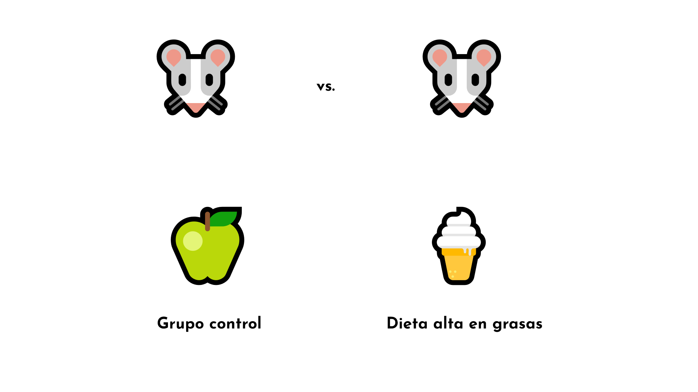
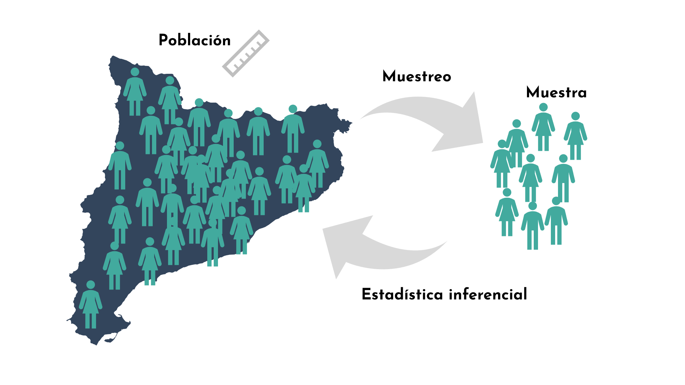
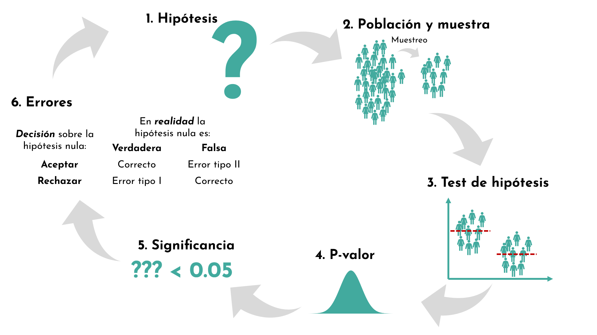
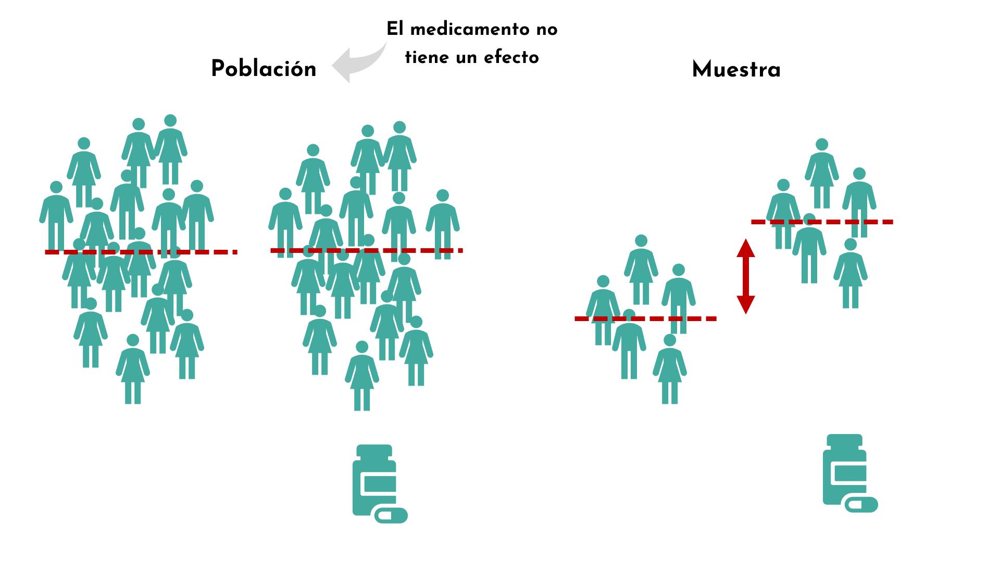
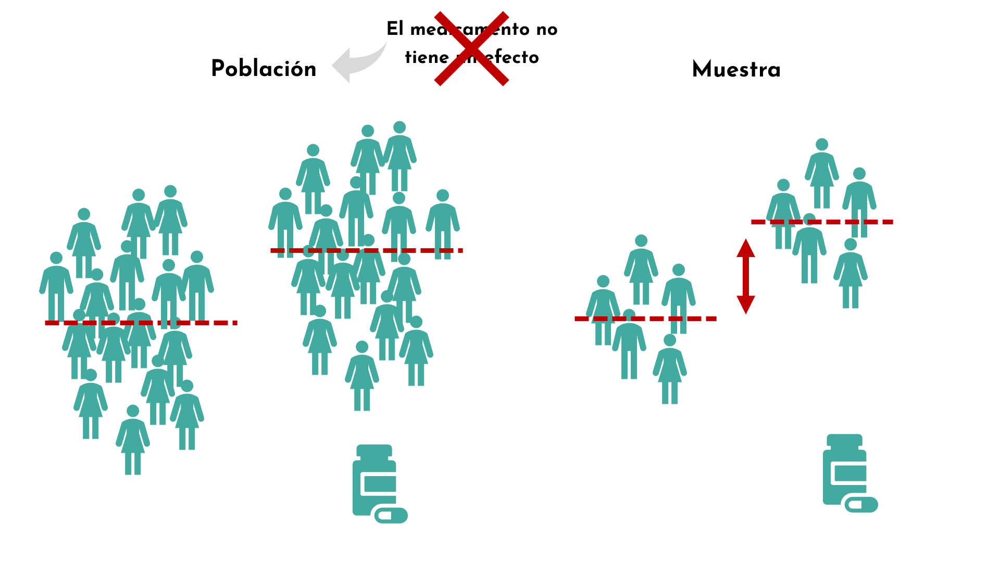
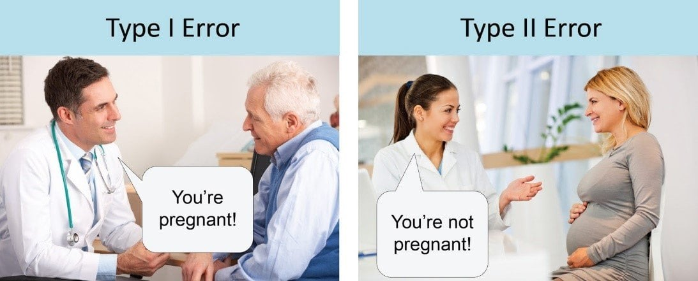
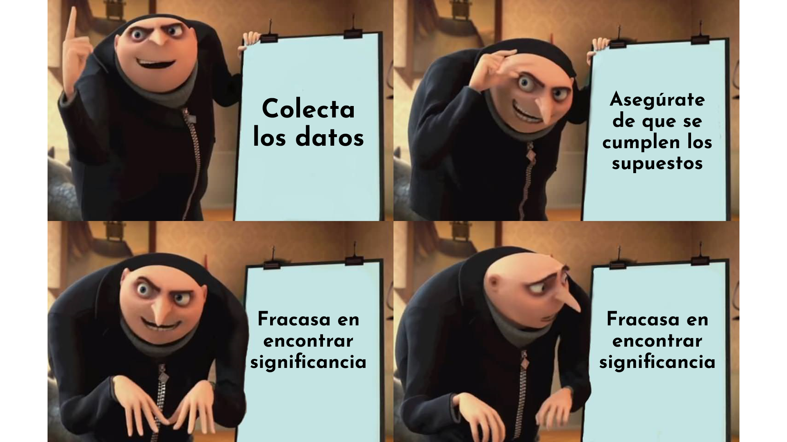
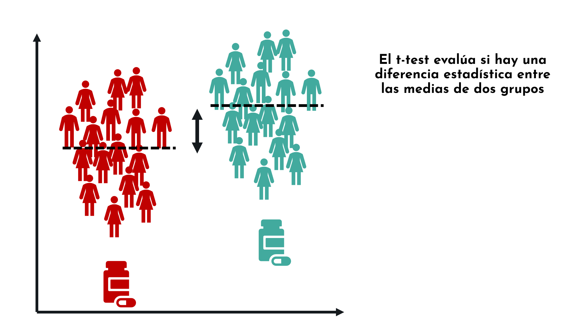
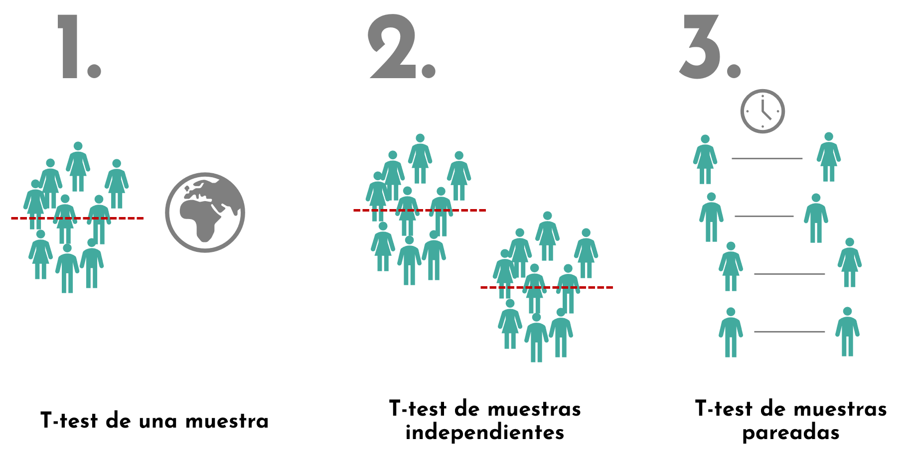

```{r setup, include=FALSE}
options(htmltools.dir.version = FALSE)
#knitr::include_graphics()
knitr::opts_chunk$set(
  cache = TRUE,
  message = FALSE, 
  warning = FALSE,
  hiline = TRUE,
  fig.retina = 5
)
library(ggplot2)
library(readr)
library(knitr)
#pagedown::chrome_print(".html")
```

```{r xaringan-themer, include=FALSE, warning=FALSE}
library(xaringanthemer)
style_mono_accent(
  base_color = "#1c5253", link_color =  "#DE1144", code_inline_color = "#DE1144",
  header_font_google = google_font("Josefin Sans"),
  text_font_google   = google_font("Montserrat", "400", "400i"),
  code_font_google   = google_font("Roboto Mono"),
    
)
```

```{r xaringanExtra-clipboard, echo=FALSE}
library(xaringanExtra)
htmltools::tagList(
  xaringanExtra::use_clipboard(
    button_text = "<i class=\"fa fa-clipboard\"></i>",
    success_text = "<i class=\"fa fa-check\" style=\"color: #90BE6D\"></i>",
  ),
  rmarkdown::html_dependency_font_awesome()
)
```


class: animated, fadeIn
# Outline

#### **Inferencia estadística**
- Motivación
- Proceso de inferencia estadística
- Hipótesis
- Muestra
- Pruebas de hipótesis
- Significancia y p-valor
- Tipos de errores
- Importancia diseño de estudio
- Visión general de las pruebas estadísticas
- Data snooping/HARKing
- Relación entre las pruebas de hipótesis y los IC
- Test de dos colas y de una cola
- Introducción al t-test

<style>
.title-slide {
  background-image: url('img/1.png');
  background-size: 100%;
}
</style>


---
class: animated, fadeIn

## Motivación

¿Qué es un test de hipotesis? ¿por qué lo necesitmaos?

<center>


---
class: animated, fadeIn

#### Ejemplo: peso de ratones

.pull-left[
```{r, echo = F, fig.height=4, fig.width=5}
url <- 'https://raw.githubusercontent.com/genomicsclass/dagdata/master/inst/extdata/mice_pheno.csv'
mice <- read.csv(url)

ggplot(mice, aes(x=Diet, y =Bodyweight, fill=Diet)) +
  geom_boxplot(show.legend = F) +
  ggthemes::theme_base(base_size = 16) +
  theme(panel.grid=element_blank(),
        axis.text=element_text(color="black"),
        panel.background = element_rect(fill = "white")) +
  scale_fill_manual(values=c("cadetblue4", "orange2"))

```

**Modelo estadístico**
$$
peso = dieta + residuos
$$
- $dieta$: promedio de los grupos
- $residuos$: siguen una distribución estadística

]

.pull-right[
**Pregunta**: hay diferencia en el peso en ratones control *vs.* con una dieta alta en grasas?

**Problema**: la diferencia en las medias puede deberse al azar:
- Sólo tenemos una muestra de ratones en cada muestra
- Hay variación en los pesos

Saber las reglas de la aleatoriedad/variación nos dirá cuán probable es que estas diferencias se deban al azar.
]


---
class: animated, fadeIn

#### Ejemplo: peso de ratones

.pull-left[
```{r, echo = F, fig.height=4, fig.width=5}

library(gghalves)
n <- 0.1

ggplot(mice, aes(x=Diet, y =Bodyweight, fill=Diet)) +
    geom_half_boxplot(center=TRUE, errorbar.draw=FALSE,width=0.5, nudge=n,show.legend = F) +
  geom_half_violin(side="r", nudge=n,show.legend = F) +
  ggthemes::theme_base(base_size = 16) +
  theme(panel.grid=element_blank(),
        axis.text=element_text(color="black"),
        panel.background = element_rect(fill = "white")) +
  scale_fill_manual(values=c("cadetblue4", "orange2"))

```

**Modelo estadístico**
$$
peso = dieta + residuos
$$
- $dieta$: promedio de los grupos
- $residuos$: siguen una distribución estadística (no siempre siguen una distribución Gaussiana...)

]

.pull-right[
**Pregunta**: hay diferencia en el peso en ratones control *vs.* con una dieta alta en grasas?

**Problema**: la diferencia en las medias puede deberse al azar:
- Sólo tenemos una muestra de ratones en cada muestra
- Hay variación en los pesos

Saber las reglas de la aleatoriedad/variación nos dirá cuán probable es que estas diferencias se deban al azar.
]

---
class: animated, fadeIn


## Hipótesis nula y alternativa

#### Hipótesis nula (H₀)
- No hay diferencia entre los dos grupos de dieta. 
- Modelo nulo:  

$$
\text{peso} = \text{media general} + \text{residuos}
$$
- La media general representa promedio de todos los ratones, sin importar el grupo de dieta

--

#### Hipótesis alternativa (H₁)
- Existe una diferencia entre los dos grupos de dieta.  
- Modelo alternativo: 

$$
\text{peso} = \text{efecto de la dieta} + \text{residuos}
$$

#### Rechazo de H₀

- Rechazamos la hipótesis nula cuando, **asumiendo que H₀ es verdadera**, es muy poco probable observar una diferencia tan extrema como la que muestran nuestros datos **por azar**.

---

layout: false
class: left, bottom, inverse, animated, bounceInDown

## Proceso de inferencia estadística


---
class: animated, fadeIn

## Introducción

> La estadística inferencial se utiliza para **extraer conclusiones a partir de una muestra**.

- **Objetivo:** formular hipótesis y testarlas para hacer **generalizaciones sobre una población** a partir de una muestra.  
- **Procedimiento:** usar **muestreo aleatorio** y **pruebas de hipótesis** para evaluar la validez de hipótesis previamente establecidas.

> La estadística inferencial suele invocar **medidas de significancia estadística**.

<center>


---
class: animated, fadeIn

## Introducción

<center>



---
class: animated, fadeIn

## Introducción


<center>



---
class: animated, fadeIn

## 1. Hipótesis

#### ¿Qué es una hipótesis?

Una hipótesis es una **afirmación** sobre **cómo se comportan los datos** o el **fenómeno que estudiamos**, que **podemos poner a prueba usando métodos estadísticos**.

#### ¿Por qué son importantes?

- Las hipótesis son **simplificaciones de posibles normas de procesos naturales** y permiten que las afirmaciones sean **testables**.  

- Formular la hipótesis correcta es esencial para **obtener las respuestas correctas**.  


--

**Ejemplo**:
.pull-left[
> Queremos saber si un medicamento tiene un efecto positivo sobre la presión arterial en personas con hipertensión.
]
.pull-right[
<center>

]

---

class: animated, fadeIn

## 2. Muestra

- La población de estudio serán todas las personas con hipertensión de Catlunya
- Muestreamos un subconjunto 
<center>


---

class: animated, fadeIn

## 3. Prueba de hipótesis

> La **prueba de hipótesis** es un método para evaluar una afirmación sobre un **parámetro poblacional** utilizando datos **obtenidos de una muestra**.

--

- Hay muchísimas pruebas de hipótesis:
  - T-test
  - ANOVA
  - Prueba de  $\chi^2$
  - Pruebas de regresión y correlación
  - ...
  
- La elección de la prueba depende de:
  - El tipo de variable (numérica, categórica)
  - El número de grupos o comparaciones
  - Supuestos sobre la distribución de los datos (normalidad)
  - El tamaño de la muestra

En general, cada prueba está diseñada para responder una pregunta específica sobre los datos, garantizando que la inferencia sea válida.

---


class: animated, fadeIn

## 3. Prueba de hipótesis

> ¿Cómo funciona un test de hipótesis? 

Cuando llevamos a cabo una prueba de hipótesis, empezamos con una **hipótesis** de investigación, también llamada **hipótesis alternativa**.

- La hipótesis alternativa es por la que intentamos encontrar evidencia a favor.

--

Nuestra hipótesis alternativa es que **el medicamento tiene un efecto en la presión arterial**.

<center>

</center>

- Pero, no podemos comprobar esta hipotesis directamente, comprobamos lo contrario:

---


class: animated, fadeIn

## 3. Prueba de hipótesis

> ¿Cómo funciona un test de hipótesis? 

Cuando llevamos a cabo una pruebad de hipótesis, empezamos con una **hipótesis** de investigación, también llamada **hipótesis alternativa**.

- La hipótesis alternativa es por la que intentamos encontrar evidencia a favor.


**Comprobamos que el medicamento NO tiene un efecto sobre la presión arterial**:

<center>

</center>

---

class: animated, fadeIn

## 3. Prueba de hipótesis

<center>

</center>

---

class: animated, fadeIn

## 3. Prueba de hipótesis

- Asumimos que el medicamento no tiene un efecto sobre la población: asumimos que las personas que toman el medicamento y las que no tienen en promedio una presión sanguínea similar.

<center>

</center>

---

class: animated, fadeIn

## 3. Prueba de hipótesis

- Si cogemos una muestra al azar y observamos un efecto grande, podemos preguntarnos qué tan probable sería obtener una muestra así si el medicamento realmente no tuviera efecto.

<center>

</center>

---

class: animated, fadeIn

## 3. Prueba de hipótesis

- Si esa probabilidad es muy baja, entonces sí tenemos suficiente evidencia de que el medicamento tiene un efecto sobre la población. Rechazamos la hipótesis nula. Esta probabilidad es el **p-valor**.

<center>

</center>

---
class: animated, fadeIn

## 3. Prueba de hipótesis

1. La hipótesis nula dice que **no** hay diferencia en la población.

2. La prueba de hipótesis mide cuánto se desvía la evidencia de la muestra respecto a lo que predice la hipótesis nula.

3. El p-valor indica la probabilidad de obtener un resultado tan extremo (o más) que el observado bajo el supuesto de que la hipótesis nula es verdadera.

<center>

</center>


---
class: animated, fadeIn

## 4. Significancia y p-valor

- Si el p-valor es más pequeño que un umbral predefinido (p < 0.05) el resultado se considera estadísticamente significativo.

- El resultado observado sería muy poco probable que ocurriera por azar si la hipótesis nula fuera cierta.

- Tenemos suficiente evidencia para rechazar la hipótesis nula.

.pull-left[
- Un p-valor pequeño (< 0.05) sugiere que:
  - Los datos observados, nuestra muestra, es incompatible con la hipótesis nula
  - Rechazamos la hipótesis nula a favor de la hipótesis alternativa
]

.pull-right[
- Un p-valor grande (> 0.05) sugiere que:
  - Los datos observados son consistentes con la hipótesis nula 
  - Rechazamos la hipótesis alternativa
]

--

> **Siempre hay un riesgo de cometer un error!**

- Un p-valor pequeño NO demuestra que la hipotesis alternativa sea verdadera 
  - Solo nos dice que es muy improbable obtener un resultado como el que hemos obtenido (o más extremo) en nuestra muestra
  
- Un p-valor grande NO demuestra que la hipótesis nula sea verdadera
  - Solo nos dice que es probable obtener un resultado como el que hemos obtenido (o más extremo) en nuestra muestra 


---
class: animated, fadeIn

## 5. Tipos de errores

Si realizamos un test y decidimos **rechazar o no H₀**, existen cuatro posibles resultados:

| Realidad / Decisión | Rechazamos H₀ | No rechazamos H₀ |
|--------------------|---------------|-----------------|
| **H₀ verdadera**   | Error Tipo I   | Correcto        |
| **H₀ falsa**       | Correcto      | Error Tipo II   |

- **Error tipo I ($\alpha$)**:
rechazamos la H₀ cuando es verdadera  
- **Error tipo II ($\beta$)**: no rechazamos H₀ cuando es falsa

**Ejemplo:**

- El medicamento no tiene un efecto y por lo tanto no hay diferencias en la presión arterial, pero en nuestra muestra los valores están tan alejados que por error pensamos que sí hay un efecto del medicamento.

- El medicamento sí tiene un efecto, y por lo tanto sí hay diferencias en la presión arterial, pero nuestra muestra no muestra diferencias, pensamos erróneamente que no tiene un efecto  

---
class: animated, fadeIn

## 5. Tipos de errores


<center>


---
class: animated, fadeIn

## 5. Tipos de errores

### Clasificaciones incorrectas

- **Falso positivo (Error tipo I)**: rechazamos H₀ cuando es verdadera  
  - Ocurre por azar en un cierto porcentaje de casos (por ejemplo, 5% si α = 0.05)  

- **Falso negativo (error tipo II)**: no rechazamos H₀ aunque H₀ sea falsa  
  - Suele ocurrir si hay **muy pocos datos** o métodos poco sensibles  
  - Se evita usando **métodos con alta potencia estadística**


---
class: animated, fadeIn

### Proceso para probar hipótesis

#### 1. Establecer la hipótesis
- Definir la **hipótesis nula (H₀)** y la **hipótesis alternativa (H₁)**.  

#### 2. Planificación del estudio y recolección de datos
- Diseñar la **estrategia de muestreo** (aleatorio, estratificado, etc.).  
- Determinar el **tamaño de muestra** necesario según precisión deseada.  
- Recolectar los datos siguiendo **protocolos consistentes y confiables**.

#### 3. Prueba de hipótesis
- **Verificación de supuestos:** normalidad, homogeneidad de varianzas, independencia, etc.  
- **Análisis exploratorio de datos:** inspección de distribuciones, outliers y tendencias.  
- **Visualización de datos:** histogramas, boxplots, gráficos de dispersión.  
- **Análisis final:** aplicar la prueba estadística adecuada y calcular p-valores o intervalos de confianza.

#### 4. Interpretación y comunicación de resultados
- Determinar si se **rechaza o no H₀** basándose en los resultados.  
- Presentar los resultados de manera clara, incluyendo **gráficos finales** y **resumen de hallazgos**.  
- Documentar **limitaciones** y posibles sesgos.


---
class: animated, fadeIn

## Importancia de un buen diseño de estudio

.pull-left[*“To call in the statistician after the experiment is done may be no more than asking them to perform a post mortem examination: they may be able to say what the experiment died of.”*

— Ronald A. Fisher 
]
.pull-right[
<center>

]

--

Al recolectar datos, asegúrate de:  

- Utilizar **estándares relevantes** y **esquemas de medición estandarizados y consistentes**.

- Asegurar **réplicas** suficientes, y un  tamaño de muestra (**N**) adecuado


---
class: animated, fadeIn

## Importancia de un buen diseño de estudio

Dependiendo de cómo esté estructurado tu proyecto, necesitarás **extraer muestras** de tus datos. Los métodos de muestreo más comunes son:

.pull-left[
#### 1. Muestreo aleatorio (random sampling)
- El más utilizado.  
- Aplicable cuando se desea **verdadera aleatoriedad**.
]

.pull-right[
#### 2. Muestreo estratificado (*stratified sampling*)
- Se usa para asegurarse de que **subgrupos específicos de la población estén bien representados** en la muestra.  
- Procedimiento:  
  1. Dividir la población en **estratos** (grupos).  
  2. Realizar **muestreo aleatorio dentro de cada estrato**.  
  3. Combinar las muestras de todos los estratos para obtener la muestra final.  
- Útil cuando se desea **pseudo-aleatoriedad controlada**.
]

---
class: animated, fadeIn

<center>


---
class: animated, fadeIn

## Importancia de un buen diseño de estudio

### Supuestos de las pruebas de hipótesis

.pull-left[
Los tests estadísticos se basan en **supuestos específicos** sobre los datos. Los más importantes son:

- **Normalidad:** los datos siguen una **distribución normal**  
- **Aleatoriedad:** los datos son **verdaderamente aleatorios**  
- **Independencia:** los datos son **independientes** entre sí.  
- **Homogeneidad de varianzas:** los datos de distintos grupos tienen **la misma varianza**.  
- **Linealidad:** los datos presentan una **relación lineal** cuando corresponde.
]

.pull-right[
<center>

]

---
class: animated, fadeIn


## Visión general de las pruebas estadísticas

<center>


---
class: animated, fadeIn


## Visión general de las pruebas estadísticas

.pull-left[
#### 1. Pruebas paramétricas

Requieren supuestos estrictos sobre la distribución de los datos (por ejemplo, normalidad) y generalmente comparan medias o varianzas.

- Más restrictivas.  
- Requieren **supuestos estrictos** sobre la distribución de los datos.  
- Fácil de interpretar.  
- Requieren **menos datos**.
]

.pull-right[
#### 2. Pruebas no paramétricas
No requieren supuestos fuertes sobre la distribución. Suelen basarse en **rangos** o **medianas**.

- Menos restrictivas.  
- Hacen **pocos o ningún supuesto** sobre la distribución.  
- A veces funcionan como una "caja negra".  
- Requieren **más datos**.
]

---
class: animated, fadeIn

## El p-valor

- El **p-valor** es la medida de **significancia estadística** más utilizada en la ciencia actual.  
- Un p-valor por debajo del **nivel de significancia** ($\alpha$, normalmente 0.05) indica que la prueba es **estadísticamente significativa**.  
- Los p-valores son objeto de **debate** porque:  
  - Todos buscan resultados significativos.  
  - El concepto de p-valor suele **malinterpretarse**.  

> Un p-valor **no mide la probabilidad de que la hipótesis nula sea verdadera**, sino la probabilidad de observar datos tan extremos como los obtenidos **asumiendo que H₀ es cierta**.

.pull-left[
#### Conceptos erróneos:
- “El p-valor es la probabilidad de que la hipótesis nula sea verdadera.”  
- “El p-valor es la probabilidad de que los efectos observados se hayan producido únicamente por azar.”  
- “El p-valor indica el tamaño o la importancia del efecto observado.”
]

.pull-right[
#### Concepto correcto:
-  “El p-valor es la probabilidad de obtener, de manera aleatoria, un efecto al menos tan extremo como el observado en tus datos muestrales, **asumiendo que la hipótesis nula es verdadera**.”
]

> El nivel de significancia de 0.05 es una **convención arbitraria**, no una regla absoluta.


---
class: animated, fadeIn

## *Data Snooping / HARKing*

- Decidir **qué hipótesis investigar** después de **ver los resultados**.
- El nivel de significancia ($\alpha$) ya **no es válido**, porque los datos influyen en la elección de la hipótesis. 
- Esto puede **inflar la probabilidad de obtener resultados “significativos” falsamente**.  

> HARKing: *Hypothesizing After the Results are Known*

--

.pull-left[
**Ejemplos:**

- Cambiar la hipótesis original después de ver los datos.
- Analizar subgrupos solo porque muestran un efecto “significativo”.
- Ajustar la dirección del efecto para que coincida con los resultados.

**Consecuencias:**

- Resultados engañosos o irreproducibles.
- Inflación de la tasa de falsos positivos.
- Pérdida de confianza en la investigación.
]
.pull-right[
<center>
<br>
<small>[Baker et al. 2016](https://www.nature.com/articles/533452a)
]

---

layout: false
class: left, bottom, inverse, animated, bounceInDown

## Relación entre las pruebas de hipótesis y los IC

---
class: animated, fadeIn

## Relación entre pruebas de hipótesis  y los IC

- La relación entre un test de hipótesis y el intervalo de confianza correspondiente se define por el **nivel de significancia $\alpha$**. 

- Ambos enfoques se basan en la misma lógica inferencial y difieren únicamente en la **perspectiva**.

  - El test de hipótesis evalúa si un valor específico es plausible.
  - El intervalo de confianza muestra el rango de valores plausibles para el parámetro.

---
class: animated, fadeIn

## Test de dos colas y CI

- Si queremos probar:  
$$
  H_0: \mu = \mu_0 \quad \text{vs.} \quad H_A: \mu \neq \mu_0
$$

- Entonces, **rechazamos H₀** al nivel de significancia $\alpha$ **si el intervalo de confianza del $100(1-\alpha)\%$ para $\mu$  no contiene $\mu_0$**.

--

Supongamos que queremos probar si la altura media de la clase difiere de 170cm.

- Hipótesis: $H_0: \mu = 170 \quad \text{vs.} \quad H_A: \mu \neq 170$

- Tomamos una muestra de 50 estudiantes y obtenemos una media muestral $\bar{x}=166.5\text{ cm}$ y un error estándard $SE = 2\text{ cm}$.

- Calculamos el IC del 95%:
$$
IC_{95\%} = \bar{x} \pm 1.96 \times SE = 166.5 \pm 1.96 \times 2 = (162.58, 170.42)
$$
- Como $\mu_0 = 170$ **queda dentro del intervalo**, **no rechazamos $H_0$** al nivel $\alpha = 0.05$.

> Conclusión: la muestra **no proporciona evidencia suficiente** para afirmar que la altura media difiere de 170cm.


---
class: animated, fadeIn

## Test de una cola y CI

Queremos probar
$$
  H_0: \mu = \mu_0 \quad \text{vs.} \quad H_A: \mu \lt \mu_0
$$


- Rechazamos H₀ al nivel $\alpha$ **si el límite superior del IC unilateral** es menor que $\mu_0$:  
  
$$
(-\infty, \bar{x} + m)
$$ 

--

Supongamos que queremos probar si la altura media de la clase es menor a 170cm.

- Hipótesis: $H_0: \mu = 170 \quad \text{vs.} \quad H_A: \mu \lt 170$

- Tomamos una muestra de 50 estudiantes y obtenemos una media muestral $\bar{x}=166.5\text{ cm}$ y un error estándard $SE = 2\text{ cm}$.

- Calculamos el IC del 95% (límite superior):

$$
IC_{95\%} = (-\infty, \bar{x} + 1.645 \times SE) = (-\infty, 166.5 + 1.645 \times 2) \approx (-\infty, 169.79)
$$
- Observa que $\mu_0 = 170$ **no queda dentro del IC**, por lo que **no rechazamos $H_0$** al nivel $\alpha = 0.05$.

> Conclusión: la muestra **sí proporciona evidencia** para afirmar que la altura media es menor que 170cm.

---
class: animated, fadeIn

## Test de una cola y CI

```{r echo=FALSE, fig.height=5, fig.width=13, fig.align='center'}


library(ggplot2)
library(ggthemes)

# Datos
mu0 <- 170          # valor bajo H0
xbar <- 166.5       # media muestral
SE <- 2             # error estándar
alpha <- 0.05

# IC bilateral 95%
z_bilateral <- 1.96
x_lower_bi <- xbar - z_bilateral*SE
x_upper_bi <- xbar + z_bilateral*SE

# IC unilateral 95% (test inferior)
z_unilateral <- 1.645
x_upper_uni <- xbar + z_unilateral*SE

# Secuencia para curva normal de la media muestral
x <- seq(xbar - 4*SE, xbar + 4*SE, length=1000)
y <- dnorm(x, mean=xbar, sd=SE)
df <- data.frame(x=x, y=y)

# Gráfico bilateral
p_bi <- ggplot(df, aes(x=x, y=y)) +
    geom_line(size=1.2, color="black") +
    geom_area(data=subset(df, x >= x_lower_bi & x <= x_upper_bi), aes(x=x, y=y), fill="cadetblue3", alpha=0.5) +
    geom_area(data=subset(df, x < x_lower_bi), aes(x=x, y=y), fill="firebrick3", alpha=0.4) +
    geom_area(data=subset(df, x > x_upper_bi), aes(x=x, y=y), fill="firebrick3", alpha=0.4) +
    geom_vline(xintercept = c(x_lower_bi, x_upper_bi), linetype="dashed", color="firebrick3", size=1) +
    annotate("text", x=x_lower_bi - 1.5, y=max(y)*0.1, label="α/2") +
    annotate("text", x=x_upper_bi + 1.5, y=max(y)*0.1, label="α/2") +
    annotate("text", x=xbar, y=max(y)*0.5, label="95% IC", fontface="bold", color="orange4") +
    labs(title="IC bilateral de 95% (dos colas)",
         x="Altura (cm)", y="Densidad") +
    ggthemes::theme_base(base_size = 16) +
    theme(panel.grid=element_blank(),
          axis.text=element_text(color="black"),
          panel.background = element_rect(fill = "white"))

# Gráfico unilateral
p_uni <- ggplot(df, aes(x=x, y=y)) +
    geom_line(size=1.2, color="black") +
    geom_area(data=subset(df, x <= x_upper_uni), aes(x=x, y=y), fill="cadetblue3", alpha=0.5) +
    geom_area(data=subset(df, x > x_upper_uni), aes(x=x, y=y), fill="firebrick3", alpha=0.4) +
    geom_vline(xintercept = x_upper_uni, linetype="dashed", color="firebrick3", size=1) +
    annotate("text", x=x_upper_uni + 0.5, y=max(y)*0.1, label="α") +
    annotate("text", x=xbar, y=max(y)*0.5, label="95% IC unilateral", fontface="bold", color="orange4") +
    labs(title="IC unilateral de 95% (cola inferior)",
         x="Altura (cm)", y="Densidad") +
    ggthemes::theme_base(base_size = 16) +
    theme(panel.grid=element_blank(),
          axis.text=element_text(color="black"),
          panel.background = element_rect(fill = "white"))

# Mostrar ambos
library(gridExtra)
grid.arrange(p_bi, p_uni, ncol=2)
```

--

Ejemplo de **data snooping o HARKing**, hemos cambiado nuestra hipótesis para que el resultado salga significativo.

---
class: animated, fadeIn

## Test de una cola y CI

Queremos probar
$$
  H_0: \mu = \mu_0 \quad \text{vs.} \quad H_A: \mu \lt \mu_0
$$


- Rechazamos H₀ al nivel $\alpha$ **si el límite superior del IC unilateral** es menor que $\mu_0$:  
  
$$
(-\infty, \bar{x} + m)
$$ 

Queremos probar
$$
  H_0: \mu = \mu_0 \quad \text{vs.} \quad H_A: \mu \gt \mu_0
$$


- Rechazamos H₀ al nivel $\alpha$ **si el límite inferior del IC unilateral** es mayor que $\mu_0$:  
  
$$
(\bar{x} - m,\infty)
$$ 


---
layout: false
class: left, bottom, inverse, animated, bounceInDown

## Introducción al t-test

---
class: animated, fadeIn

## ¿Por qué usamos el t-test?

- En la mayoría de los casos no conocemos la desviación estándar poblacional ($\sigma$) y debemos estimarla a partir de la muestra. 
- El t-test ajusta la incertidumbre adicional que se introduce al estimar $\sigma$. 
- Por eso, en la práctica, el t-test es más usado que el test z para muestras pequeñas o cuando $\sigma$ es desconocida.

<center>


---

class: animated, fadeIn

## Tipos de t-test

<center>


---
class: animated, fadeIn

## Contacto

<div style="margin-top: 20vh; text-align:center;">

| Marta Coronado Zamora | David Castellano | 
|:-:|:-:|
| <a href="mailto:marta.coronado@uab.cat"><i class="fa fa-paper-plane fa-fw"></i> marta.coronado@uab.cat</a> | <a href="mailto:david.castellano@uab.cat"><i class="fa fa-paper-plane fa-fw"></i>&nbsp; david.castellano@uab.cat</a> | 
| <a href="https://bsky.app/profile/geneticament.bsky.social"><i class="fab fa-bluesky fa-fw"></i>&nbsp; @geneticament.bsky.social</a> |                 <a href="https://bsky.app/profile/castellanoed.bsky.social"><i class="fab fa-bluesky fa-fw"></i>&nbsp; @castellanoed.bsky.social</a> |
| <a href="https://www.uab.cat"><i class="fa fa-map-marker fa-fw"></i>&nbsp; Universitat Autònoma de Barcelona</a> |    <a href="https://gutengroup.mcb.arizona.edu/"> <i class="fa fa-map-marker fa-fw"></i>&nbsp; University of Arizona</a> |

