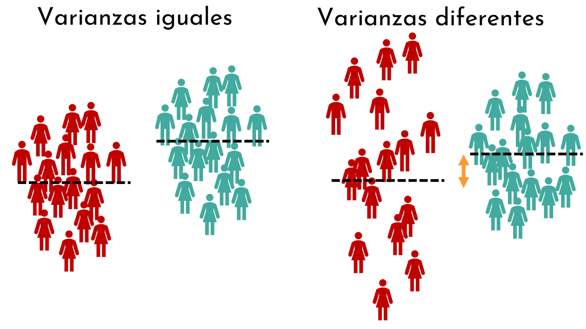
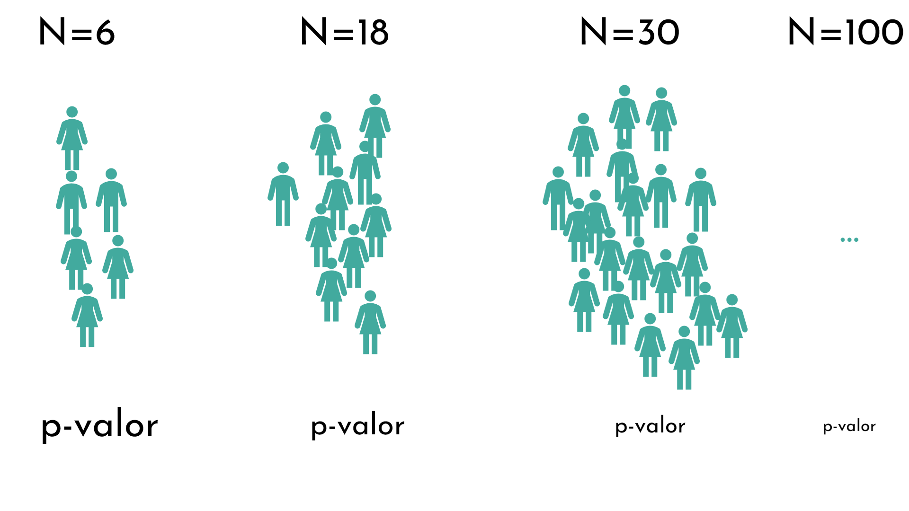
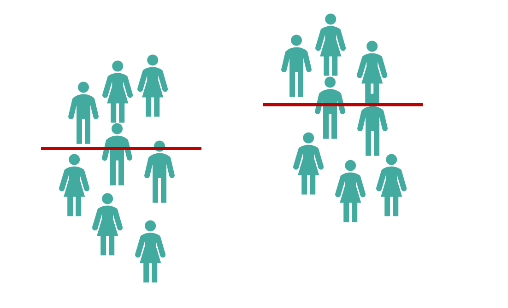
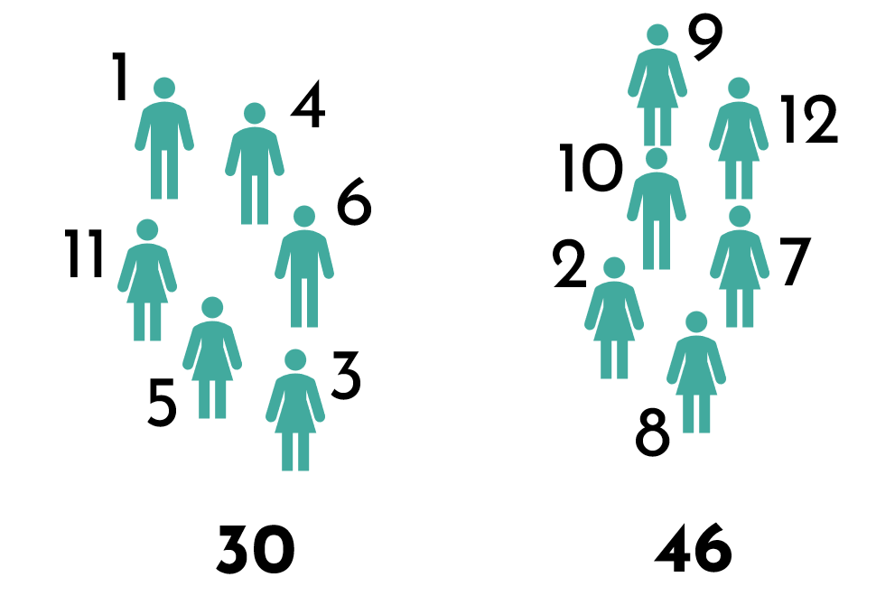
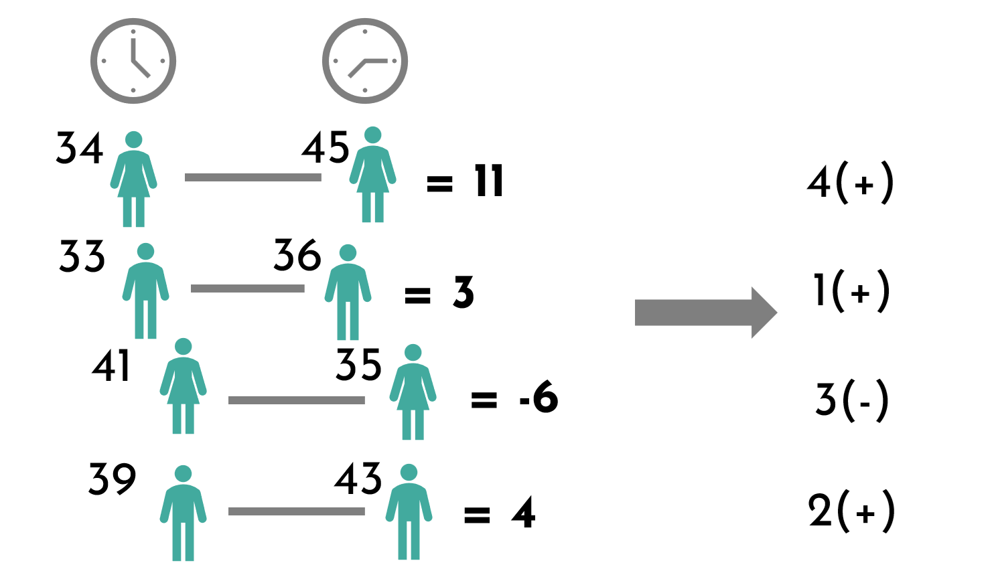

```{r setup, include=FALSE}
options(htmltools.dir.version = FALSE, width = 200)
#knitr::include_graphics()
knitr::opts_chunk$set(
  cache = TRUE,
  echo = TRUE,
  message = FALSE, 
  warning = FALSE,
  hiline = TRUE,
  fig.retina = 5

)
knitr::opts_chunk$set(
  comment = "")

library(ggplot2)
library(readr)
library(knitr)
#pagedown::chrome_print("PresentacionBioestadistica.html")
```

```{r xaringan-themer, include=FALSE, warning=FALSE}
library(xaringanthemer)
style_mono_accent(
  base_color = "#1c5253", link_color =  "#DE1144", code_inline_color = "#DE1144",
  header_font_google = google_font("Josefin Sans"),
  text_font_google   = google_font("Montserrat", "400", "400i"),
  code_font_google   = google_font("Roboto Mono"),
    
)
```


```{r xaringanExtra-clipboard, echo=FALSE}
library(xaringanExtra)
htmltools::tagList(
  xaringanExtra::use_clipboard(
    button_text = "<i class=\"fa fa-clipboard\"></i>",
    success_text = "<i class=\"fa fa-check\" style=\"color: #90BE6D\"></i>",
  ),
  rmarkdown::html_dependency_font_awesome()
)
```


class: title-slide, animated, fadeIn

.left-top[
# Supuestos del t-test y versión no paramétrica

]

.left-bottom[
.authors[
**Bioestadística**
<br><br><br><br>

Marta Coronado ([marta.coronado@uab.cat](mailto:marta.coronado@uab.cat))  
]

.footer-info[
**Grado en Genética | Curso 2026/2027**
]
]

.right-panel[]


<style>
.title-slide {
  background-image: none;
}

/* Contenedor teal superior (solo título) */
.title-slide .left-top {
  position: absolute;
  top: 0; left: 0;
  width: 60%;
  height: 62%;
  background-color: #163a3a;
  color: white;
  padding: 50px 45px 30px 65px;
  margin: 0;
  display: flex;
  flex-direction: column;   /* ← esto faltaba */
  align-items: flex-start;  /* ← con column, flex-end alinearía a la derecha; usa flex-start para pegar a la izquierda */
  justify-content: flex-end;
  box-sizing: border-box;
}

/* Contenedor blanco inferior (autores, fecha) */
.title-slide .left-bottom {
  position: absolute;
  bottom: 0; left: 0;
  width: 60%;
  height: 38%;
  background-color: white;
  color: #222;
  display: flex;
  flex-direction: column;
  justify-content: center;
  box-sizing: border-box;
  padding: 20px 45px 30px 65px;
  margin: 0;
}

.title-slide .right-panel {
  position: absolute;
  top: 0; right: 0; bottom: 0;
  width: 41%;
  background-color: white;
  background-image: url('img/1.png');
  background-size: contain;
  background-repeat: no-repeat;
  background-position: center;
  padding: 40px;
  box-sizing: border-box;
}

.title-slide h1 {
  font-size: 1.9em;
  line-height: 1.25;
  margin: 0;
  font-weight: 400;
}

.title-slide .subtitle {
  display: block;   /* ← esto es la clave: sin esto, margin-top se ignora */
  font-size: 2em;
  font-weight: bold;
  color: #7ac142;
  margin-top: -35px;
  margin-bottom: 15px;
}

.title-slide .authors {
  font-size: 0.95em;
  line-height: 1.6;
  margin-bottom: 12px;
}

.title-slide .authors a {
  color: #e8846b;
  text-decoration: none;
}

.title-slide .footer-info {
  font-size: 0.9em;
  color: #444;
}

.remark-slide-content h2,
.remark-slide-content h3,
.remark-slide-content h4,
.remark-slide-content h5 {
  margin-top: 1em;
  margin-bottom: 0.6em;
}

.remark-slide-content p,
.remark-slide-content ul,
.remark-slide-content ol {
  margin-top: 0.2em;
  margin-bottom: 0.2em;
}

.remark-slide-content li {
  margin-bottom: 0.1em;
}

.practica::before {
  content: "\f303";
  font-family: "Font Awesome 6 Free";
  font-weight: 900;
  position: absolute;
  top: 15px;
  right: 15px;
  font-size: 1.3em;
  color: #1c5253;
}

.R::before {
  content: "\f4f7";
  font-family: "Font Awesome 6 Brands";
  font-weight: 400;
  position: absolute;
  top: 15px;
  right: 15px;
  font-size: 1.3em;
  color: #1c5253;
}
</style>

---
class: animated, fadeIn
# Outline

#### **Pruebas de t-test**

- Intervalos de confianza del t-test

- Supuestos del t-test de muestras independientes

- Varianzas iguales y desiguales (test de Levene)

- Comprobar normalidad (test de Shapiro)

- Versión no paramétrica: test de Mann-Whitney (Wilcoxon de suma de rangos)

- Test de Wilcoxon de rangos con signo (muestras pareadas)
<style>
.title-slide {
  background-image: url('img/1.png');
  background-size: 100%;
}
</style>

---
class: animated, fadeIn

## Intervalos de confianza para la media poblacional con la distribución `t`

- Anteriormente: IC utilizando la distribución normal (muestras grandes)

$$
(\bar{x} \pm z \times \frac{s}{\sqrt{n}})
$$

--

- Intervalos de confianza utilizando la distribución `t` para una sola muestra ($df = n-1$):

> Para una muestra de tamaño $n$ con una media $\bar{x}$ y desviación estándar $s$, el IC bilateral con un nivel de confianza $100(1-\alpha)$% es:

$$
(\bar{x} \pm t_{\alpha/2,\,n-1}\times\frac{s}{\sqrt{n}})
$$

--

> Un intervalo de confianza de una cola (con $t_{\alpha,\,n-1}$) será:

.pull-left[

**Límite superior:**

$$
\mu \le \bar{x} + t_{\alpha, n-1}\times\frac{s}{\sqrt{n}}
$$

]

.pull-right[

**Límite inferior:**

$$
\mu \ge \bar{x} - t_{\alpha, n-1}\times\frac{s}{\sqrt{n}}
$$

]

???
- La diferencia es que utilizamos el valor crítico `t` (en vez del valor z).
- Para $n$ muy grandes, se puede aproximar a una normal (IC 95% = t = 1.96)

---

class: animated, fadeIn

## Intervalos de confianza para la media poblacional con la distribución `t`

<center>

</center>


---
class: animated, fadeIn

## Intervalos de confianza para la media poblacional con la distribución `t`

- Para muestras pareadas:

<center>

$(\bar{x}_{dif} \pm t_{\alpha/2,\,n-1} \frac{s_{dif}}{\sqrt{n}})$

--

Grados de libertad: $n-1$ (igual que una muestra)

---
class: animated, fadeIn

## Intervalos de confianza para la media poblacional con la distribución `t`

- Para muestras independientes:

<center>

$((\bar{x}_{1}-\bar{x}_2) \pm t_{\alpha/2,\,df}\times SE)$

</center>

donde $SE$:

$$
SE_{\bar{x}_1 - \bar{x}_2}=\sqrt{\frac{s^2_1}{n_1}+\frac{s^2_2}{n_2}}
$$

Con este $SE$ (Welch), los grados de libertad se calculan con la fórmula de Welch–Satterthwaite. Solo si asumimos varianzas iguales (y usamos $s_p^2$) son $n_1+n_2-2$.

---
class: animated, fadeIn

## Calcular t-test para muestras independientes

La fórmula para realizar el t-test es diferente **dependiendo de si los grupos tienen las mismas varianzas o no**

<center>


--

</center>

> Para saber si las varianzas son iguales o no, podemos utilizar el **test de Levene**. En la práctica, Welch funciona bien tanto si las varianzas son iguales como si no, por eso es la opción por defecto en `R`.


---
class: animated, fadeIn

### Test de Levene para homogeneidad de varianzas

Si el p-valor del test de Levene es mayor que 0.05, no tenemos evidencia de que las varianzas sean distintas (no rechazamos $H_0$: varianzas iguales)

--

#### Test de Levene en `R`

```{r}
url <- 'https://raw.githubusercontent.com/genomicsclass/dagdata/master/inst/extdata/mice_pheno.csv'
mice <- read.csv(url)
mice <- na.omit(mice)  # eliminamos los ratones sin peso (NA)
mice[23:28,] # muestra unas filas específicas

# install.packages("car")
library(car)

```

---
class: animated, fadeIn

### Test de Levene para homogeneidad de varianzas

Si el p-valor del test de Levene es mayor que 0.05, no tenemos evidencia de que las varianzas sean distintas (no rechazamos $H_0$: varianzas iguales)


#### Test de Levene en `R`

```{r}
mice[24:27,] # muestra unas filas específicas

leveneTest(Bodyweight ~ Diet, data = mice)
```
---
class: animated, fadeIn

### Test de Levene para homogeneidad de varianzas


```{r, fig.align="center", fig.height=6}
ggplot(mice, aes(x = Bodyweight, fill=Diet)) +
   geom_density(alpha=0.8)
```

---
class: animated, fadeIn

## Calcular t-test para muestras independientes

.pull-left[

**Varianzas iguales**

$$
t=\frac{\bar{x}_1 - \bar{x}_2}{\sqrt{s_p^2 \left( \frac{1}{n_1} + \frac{1}{n_2} \right)}}
$$

- Se asume una varianza común, llamada varianza combinada:

$$
s_p^2 = \frac{(n_1 - 1)s_1^2 + (n_2 - 1)s_2^2}{n_1 + n_2 - 2}
$$

- Grados de libertad: $n_1 + n_2 - 2$ 
]

--

.pull-right[

**Varianzas desiguales (t-test de Welch)**

$$
t = \frac{\bar{x}_1 - \bar{x}_2}{\sqrt{\frac{s_1^2}{n_1}+\frac{s_2^2}{n_2}}}
$$

- Los grados de libertad se calculan con la fórmula de Welch-Satterthwaite:

$$
df = \frac{\left( \frac{s_1^2}{n_1} + \frac{s_2^2}{n_2} \right)^2}
{\frac{\left( \frac{s_1^2}{n_1} \right)^2}{n_1 - 1} + \frac{\left( \frac{s_2^2}{n_2} \right)^2}{n_2 - 1}}
$$

]

--

<br>
> En los problemas "a mano" se calculan los g.l. como $n_1+n_2-2$, porque se asume que las varianzas son iguales (y por tanto se usa $s_p^2$ en el cálculo de `t`)

---
class: animated, fadeIn

## Calcular t-test para muestras independientes en `R`

- Por defecto, la función `t.test()` no asume que las varianzas sean iguales (`var.equal=FALSE`), por lo que ejecuta el **t-test de Welch**.

- Para ejecutar el t-test si las varianzas son iguales (*two sample t-test*):

```{r}
t.test(Bodyweight ~ Diet, data = mice, var.equal = TRUE)
```

---
class: animated, fadeIn

## Calcular t-test para muestras independientes en `R`

- Por defecto, la función `t.test()` no asume que las varianzas sean iguales (`var.equal=FALSE`), por lo que ejecuta el **t-test de Welch**.

- Para ejecutar el t-test si las varianzas no son iguales (*Welch two sample t-test*):

```{r}
t.test(Bodyweight ~ Diet, data = mice, var.equal = FALSE)
```

---
class: animated, fadeIn

## Repaso: leer grados de libertad y $t_{crit}$

.pull-left[
- Nivel de significación: $\alpha=0.05$
- Grados de libertad: $df=6$
- Valor t crítico: ?
- Prueba bilateral
]

.pull-right[

```{r echo=F}
library(dplyr)
library(knitr)
library(kableExtra)

# --- Parámetros ---
dfs <- 1:99
probs <- c(0.5, 0.25, 0.2, 0.15, 0.1, 0.05, 0.025, 0.01, 0.005, 0.001)

# --- Calcular valores críticos t (cola superior) ---
# Usamos qt(1 - p, df) para obtener t tal que P(T > t) = p
t_table <- sapply(probs, function(p) qt(1 - p, df = dfs))
t_table_df <- data.frame(df = dfs, round(t_table, 4))
colnames(t_table_df) <- c("gl", paste0("p = ", probs))

t_inf <- sapply(probs, function(p) qnorm(1 - p))          
t_inf_df <- data.frame(df = "∞", t(as.data.frame(round(t_inf, 4))))  
colnames(t_inf_df) <- colnames(t_table_df)

# --- Combinar tablas ---
t_table_df <- rbind(t_table_df, t_inf_df)

# --- Mostrar tabla ---
kable(head(t_table_df,12), row.names = F,  digits = 4, align = "c",
      caption = "Valores críticos de la distribución t (cola superior)") %>%
  kable_styling(
    full_width = FALSE,
    position = "center",
    font_size = 11,
    bootstrap_options = c("condensed")

  ) %>%
  row_spec(0, bold = TRUE, background = "#e6f2ff") %>%
  column_spec(1, bold = TRUE, background = "#e6f2ff")
```

]

---
class: animated, fadeIn

## Repaso: leer grados de libertad y $t_{crit}$

.pull-left[
- Nivel de significación: $\alpha=0.05$
- Grados de libertad: $df=6$
- Valor t crítico: **2.447**
- Prueba bilateral

No rechazamos la hipótesis nula:
$$t_{crit} \ge |t|$$

Rechazamos la hipótesis nula (evidencia a favor de H<sub>A</sub>):
$$t_{crit} < |t|$$

]

.pull-right[

```{r echo=F}
library(dplyr)
library(knitr)
library(kableExtra)

# --- Parámetros ---
dfs <- 1:99
probs <- c(0.5, 0.25, 0.2, 0.15, 0.1, 0.05, 0.025, 0.01, 0.005, 0.001)

# --- Calcular valores críticos t (cola superior) ---
# Usamos qt(1 - p, df) para obtener t tal que P(T > t) = p
t_table <- sapply(probs, function(p) qt(1 - p, df = dfs))
t_table_df <- data.frame(df = dfs, round(t_table, 4))
colnames(t_table_df) <- c("gl", paste0("p = ", probs))

t_inf <- sapply(probs, function(p) qnorm(1 - p))          
t_inf_df <- data.frame(df = "∞", t(as.data.frame(round(t_inf, 4))))  
colnames(t_inf_df) <- colnames(t_table_df)

# --- Combinar tablas ---
t_table_df <- rbind(t_table_df, t_inf_df)

# --- Mostrar tabla ---
kable(head(t_table_df,12), row.names = F,  digits = 4, align = "c",
      caption = "Valores críticos de la distribución t (cola superior)") %>%
  kable_styling(
    full_width = FALSE,
    position = "center",
    font_size = 11,
    bootstrap_options = c("condensed")

  ) %>%
  row_spec(0, bold = TRUE, background = "#e6f2ff") %>%
  column_spec(1, bold = TRUE, background = "#e6f2ff")
```

]

???
https://www.youtube.com/watch?v=x51GDTiPIfI

---

class: animated, fadeIn

### Comprobar si la distribución sigue una normal

- Previamente hemos aprendido a comprobar si una distribución sigue una normal **gráficamente**
<br>

  - QQ-plots
  
--

- Hay tests que permiten saber si los datos siguen una distribución normal (**analítica**)
  - Kolmogorov-Smirnov test (con la corrección de Lilliefors si estimamos $\mu$ y $\sigma$ de la muestra)
  - Shapiro-Wilk test
  - Anderson-Darling test

> Si el p-valor de los tests es mayor que 0.05, no tenemos evidencia de que los datos no sigan una normal (no rechazamos $H_0$: los datos son normales)

---
class: animated, fadeIn

### Desventajas de los tests de normalidad

1. El cálculo del p-valor depende del tamaño de muestra: 
  - si la muestra es pequeña, el test tiene poca potencia: el p-valor puede ser > 0.05 aunque haya desviaciones reales
  - si la muestra es grande, el test detecta desviaciones mínimas que no afectan al t-test: el p-valor puede ser < 0.05
  
<center>


--

</center>

> Cada vez se usan más los métodos gráficos (QQ-plot)

---
class: animated, fadeIn

### Test de normalidad en `R`

```{r}
set.seed(123)
datos_normales <- rnorm(5000, mean=170, sd=10)
```

.pull-left[
```{r echo = F, fig.height=3, fig.width=3, fig.align='center'}

ggplot(data.frame(x=datos_normales), aes(x = x)) +
    geom_histogram(aes(y = after_stat(density)), fill = "salmon", alpha = 0.6) +  # área bajo la curva
      geom_density(linewidth = 1, color = "salmon") +  # área bajo la curva

  labs(    title = "Histograma", x = "Datos normales",
       y = "Densidad") +
  ggthemes::theme_base(base_size = 13) +
  theme(panel.grid=element_blank(),
        axis.text=element_text(color="black"),
        panel.background = element_rect(fill = "white"))

ggplot(data.frame(x=datos_normales), aes(sample = x)) +
  stat_qq(color = "cadetblue4") +
  stat_qq_line(distribution = qnorm, dparams = list(mean = 0, sd = 1), color = "firebrick4", linetype = "dashed", linewidth = 1) +
  labs(
    title = "QQ-plot",
    x = "Cuantiles teóricos",
    y = "Cuantiles muestrales"
  ) +
  ggthemes::theme_base(base_size = 13) +
  theme(panel.grid=element_blank(),
        axis.text=element_text(color="black"),
        panel.background = element_rect(fill = "white"))


 
```
]

--

.pull-right[

```{r}
shapiro.test(datos_normales)
```

]

---
class: animated, fadeIn


## Resumen t-tests y intervalos de confianza

| Tipo de t-test | Estadístico t | Grados de libertad (df) | Intervalo de confianza (IC) |
|----------------|---------------|-------------------------|-----------------------------|
| **1 muestra** | $t = \frac{\bar{x}-\mu_0}{s/\sqrt{n}}$ | $n-1$ | $\bar{x} \pm t_{\alpha/2,\,df} \frac{s}{\sqrt{n}}$ |
| **Pareado** | $t = \frac{\bar{x}_{dif}}{s_{dif}/\sqrt{n}}$ | $n-1$ | $\bar{x}_{dif} \pm t_{\alpha/2,\,df} \frac{s_{dif}}{\sqrt{n}}$ |
| **2 muestras independientes*** | $t = \frac{\bar{x}_1 - \bar{x}_2}{\sqrt{s^2_1/n_1 + s^2_2/n_2}}$ | Welch-Satterthwaite | $(\bar{x}_1 - \bar{x}_2) \pm t_{\alpha/2,\,df} \, \sqrt{s^2_1/n_1 + s^2_2/n_2}$ |

<small>*Fórmula de Welch (por defecto en R). Si asumimos varianzas iguales, $df = n_1+n_2-2$ y se usa $s_p^2$ en vez de $s_1^2, s_2^2$ por separado (ver diapositivas anteriores).</small>

---
class: animated, fadeIn

## Versión no paramétrica: test de Mann-Whitney

- El **test de Mann-Whitney** (también llamado **test de Wilcoxon de suma de rangos**) contrasta si hay diferencias entre **dos muestras independientes**.

- Es la alternativa **no paramétrica** al **t-test de muestras independientes**.

- Lo especial: **no requiere que los datos sigan una distribución normal**. En lugar de los valores, utiliza sus **rangos** (posiciones al ordenarlos).

- Es útil cuando la muestra es **pequeña** y no podemos comprobar la normalidad, o cuando hay **valores atípicos** (*outliers*).

> Para **muestras pareadas**, la alternativa al t-test es el **test de Wilcoxon de rangos con signo** 

---
class: animated, fadeIn

## Test de Mann-Whitney: suma de rangos

<br>

.pull-left[

#### Prueba de t-test

¿Hay diferencia en la **media**?

<br>

<center>

</center>

]

.pull-right[

#### Test de Mann-Whitney

¿Hay diferencia en la **suma de rangos**?

<br>

<center>

</center>

]

---
class: animated, fadeIn

## Test de Mann-Whitney: variables y supuestos

.pull-left[

#### ¿Qué variables necesitamos?

1. **Variable independiente**: nominal u ordinal con **dos categorías** (define los grupos).
  - Control *vs.* tratamiento
  - Grupo A *vs.* grupo B

2. **Variable dependiente**: cuantitativa u ordinal (la que medimos).
  - Expresión génica
  - Nivel de colesterol en sangre

]

.pull-right[

#### Supuestos

- **Dos muestras aleatorias independientes** (p. ej., tratamiento *vs.* control).

- Las observaciones son **independientes** entre sí.

- La variable es al menos **ordinal** (se puede ordenar).

- **No** es necesario que la variable siga una **distribución normal** (ni ninguna otra distribución concreta).

]

---
class: animated, fadeIn

## Test de Mann-Whitney: hipótesis

- **Hipótesis nula ($H_0$)**: en la población, los dos grupos tienen la **misma distribución** (ninguno tiende a tener valores mayores que el otro).
  - Equivalentemente: los rangos están repartidos al azar entre los dos grupos y las **sumas de rangos no difieren** (más allá de lo esperado por el distinto tamaño de los grupos).

<br>

- **Hipótesis alternativa ($H_A$)**: en la población, los valores de un grupo **tienden a ser mayores** que los del otro.
  - Las **sumas de rangos difieren** entre los dos grupos.

<br>

> Si las distribuciones de los dos grupos tienen una **forma parecida**, podemos interpretar el resultado como una diferencia de **medianas**.

---
class: animated, fadeIn

## Test de Mann-Whitney: procedimiento

.pull-left[

1. **Juntamos** los valores de los dos grupos.

2. Los **ordenamos** de menor a mayor y les asignamos un **rango** (1 al más pequeño). Si hay empates, se asigna el rango medio.

3. **Sumamos los rangos** de cada grupo por separado ( $R_1$ y $R_2$ ).

4. Calculamos el estadístico $U$ de cada grupo y nos quedamos con el **menor**.

]

.pull-right[

$$
U_1 = R_1 - \frac{n_1(n_1+1)}{2}
$$

$$
U_2 = R_2 - \frac{n_2(n_2+1)}{2}
$$

$$
U = \min(U_1, U_2)
$$

<small>Comprobación: $U_1 + U_2 = n_1 \, n_2$</small>

]

<br>

> Si $H_0$ es cierta, los rangos altos y bajos estarán repartidos entre los dos grupos y $U \approx \frac{n_1 n_2}{2}$. Si un grupo acumula los rangos altos (o bajos), $U$ será muy pequeño: evidencia contra $H_0$.

---
class: animated, fadeIn

## Test de Mann-Whitney: ejemplo

Medimos la **velocidad de reacción** en dos grupos de personas y queremos saber si hay diferencias entre ellos. Los datos **no se distribuyen de manera normal**.

<br><br>

<table class="table-unshaded" style="margin:auto; border-collapse:collapse; font-size:1.1em;">
<tr><th style="padding:6px 14px; text-align:center; border:1px solid #ccc; font-weight:bold; background:#D1DCDC; background:#1c5253; color:white;">Grupo 1</th><td style="padding:6px 14px; text-align:center; border:1px solid #ccc;">34</td><td style="padding:6px 14px; text-align:center; border:1px solid #ccc;">36</td><td style="padding:6px 14px; text-align:center; border:1px solid #ccc;">41</td><td style="padding:6px 14px; text-align:center; border:1px solid #ccc;">43</td><td style="padding:6px 14px; text-align:center; border:1px solid #ccc;">44</td><td style="padding:6px 14px; text-align:center; border:1px solid #ccc;">37</td></tr>
<tr><th style="padding:6px 14px; text-align:center; border:1px solid #ccc; font-weight:bold; background:#D1DCDC; background:#e8846b; color:white;">Grupo 2</th><td style="padding:6px 14px; text-align:center; border:1px solid #ccc;">45</td><td style="padding:6px 14px; text-align:center; border:1px solid #ccc;">33</td><td style="padding:6px 14px; text-align:center; border:1px solid #ccc;">35</td><td style="padding:6px 14px; text-align:center; border:1px solid #ccc;">39</td><td style="padding:6px 14px; text-align:center; border:1px solid #ccc;">42</td><td style="padding:6px 14px; text-align:center; border:1px solid #ccc;"></td></tr>
</table>

<br>

$$
n_1 = 6 \qquad n_2 = 5
$$

---
class: animated, fadeIn

## Test de Mann-Whitney: ejemplo

**Pasos 1 y 2**: juntamos los valores de los dos grupos, los ordenamos de menor a mayor y asignamos rangos:

<br>

<table class="table-unshaded" style="margin:auto; border-collapse:collapse; font-size:1.1em;">
<tr><th style="padding:6px 14px; text-align:center; border:1px solid #ccc; font-weight:bold; background:#D1DCDC;">Valor</th><td style="padding:6px 14px; text-align:center; border:1px solid #ccc; ">33</td><td style="padding:6px 14px; text-align:center; border:1px solid #ccc; ">34</td><td style="padding:6px 14px; text-align:center; border:1px solid #ccc; ">35</td><td style="padding:6px 14px; text-align:center; border:1px solid #ccc; ">36</td><td style="padding:6px 14px; text-align:center; border:1px solid #ccc; ">37</td><td style="padding:6px 14px; text-align:center; border:1px solid #ccc; ">39</td><td style="padding:6px 14px; text-align:center; border:1px solid #ccc; ">41</td><td style="padding:6px 14px; text-align:center; border:1px solid #ccc; ">42</td><td style="padding:6px 14px; text-align:center; border:1px solid #ccc; ">43</td><td style="padding:6px 14px; text-align:center; border:1px solid #ccc; ">44</td><td style="padding:6px 14px; text-align:center; border:1px solid #ccc; ">45</td></tr>
<tr><th style="padding:6px 14px; text-align:center; border:1px solid #ccc; font-weight:bold; background:#D1DCDC;">Grupo</th><td style="padding:6px 14px; text-align:center; border:1px solid #ccc; background:#e8846b; color:white;">2</td><td style="padding:6px 14px; text-align:center; border:1px solid #ccc; background:#1c5253; color:white;">1</td><td style="padding:6px 14px; text-align:center; border:1px solid #ccc; background:#e8846b; color:white;">2</td><td style="padding:6px 14px; text-align:center; border:1px solid #ccc; background:#1c5253; color:white;">1</td><td style="padding:6px 14px; text-align:center; border:1px solid #ccc; background:#1c5253; color:white;">1</td><td style="padding:6px 14px; text-align:center; border:1px solid #ccc; background:#e8846b; color:white;">2</td><td style="padding:6px 14px; text-align:center; border:1px solid #ccc; background:#1c5253; color:white;">1</td><td style="padding:6px 14px; text-align:center; border:1px solid #ccc; background:#e8846b; color:white;">2</td><td style="padding:6px 14px; text-align:center; border:1px solid #ccc; background:#1c5253; color:white;">1</td><td style="padding:6px 14px; text-align:center; border:1px solid #ccc; background:#1c5253; color:white;">1</td><td style="padding:6px 14px; text-align:center; border:1px solid #ccc; background:#e8846b; color:white;">2</td></tr>
<tr><th style="padding:6px 14px; text-align:center; border:1px solid #ccc; font-weight:bold; background:#D1DCDC;">Rango</th><td style="padding:6px 14px; text-align:center; border:1px solid #ccc; "><b>1</b></td><td style="padding:6px 14px; text-align:center; border:1px solid #ccc; "><b>2</b></td><td style="padding:6px 14px; text-align:center; border:1px solid #ccc; "><b>3</b></td><td style="padding:6px 14px; text-align:center; border:1px solid #ccc; "><b>4</b></td><td style="padding:6px 14px; text-align:center; border:1px solid #ccc; "><b>5</b></td><td style="padding:6px 14px; text-align:center; border:1px solid #ccc; "><b>6</b></td><td style="padding:6px 14px; text-align:center; border:1px solid #ccc; "><b>7</b></td><td style="padding:6px 14px; text-align:center; border:1px solid #ccc; "><b>8</b></td><td style="padding:6px 14px; text-align:center; border:1px solid #ccc; "><b>9</b></td><td style="padding:6px 14px; text-align:center; border:1px solid #ccc; "><b>10</b></td><td style="padding:6px 14px; text-align:center; border:1px solid #ccc; "><b>11</b></td></tr>
</table>

<br>

--

**Paso 3**: sumamos los rangos de cada grupo:

.pull-left[
$$
R_1 = 2 + 4 + 5 + 7 + 9 + 10 = 37
$$
]

.pull-right[
$$
R_2 = 1 + 3 + 6 + 8 + 11 = 29
$$
]

<small>Comprobación: $R_1 + R_2 = 66 = \frac{N(N+1)}{2} = \frac{11 \times 12}{2}$ ✅</small>

---
class: animated, fadeIn

## Test de Mann-Whitney: ejemplo

**Paso 4**: calculamos el estadístico $U$ de cada grupo:

.pull-left[

#### Grupo 1

$n_1 = 6$ &nbsp;&nbsp;&nbsp; $R_1 = 37$

$$
U_1 = R_1 - \frac{n_1(n_1+1)}{2} = 37 - \frac{6 \times 7}{2} = 16
$$

]

.pull-right[

#### Grupo 2

$n_2 = 5$ &nbsp;&nbsp;&nbsp; $R_2 = 29$

$$
U_2 = R_2 - \frac{n_2(n_2+1)}{2} = 29 - \frac{5 \times 6}{2} = 14
$$

]

--

<br>

Comprobación: $U_1 + U_2 = 16 + 14 = 30 = n_1 \, n_2 = 6 \times 5$ ✅

$$
U = \min(U_1, U_2) = \min(16, 14) = 14
$$

---
class: animated, fadeIn

## Test de Mann-Whitney: ejemplo

.pull-left[

#### Aproximación normal

Si $H_0$ es cierta, $U$ sigue aproximadamente una normal con:

**Valor esperado**:
$$
\mu_U = \frac{n_1 \, n_2}{2} = \frac{6 \times 5}{2} = 15
$$

**Error estándar**:
$$
\sigma_U = \sqrt{\frac{n_1 \, n_2 \,(n_1+n_2+1)}{12}} = \sqrt{\frac{6 \times 5 \times 12}{12}} = 5.477
$$

**Estadístico** $z$:
$$
z = \frac{U - \mu_U}{\sigma_U} = \frac{14 - 15}{5.477} = -0.18
$$

]

--

.pull-right[

#### Decisión (bilateral, $\alpha = 0.05$)

- Valor crítico: $z_{\alpha/2} = \pm 1.96$

- $|z| = 0.18 < 1.96$ → **no rechazamos $H_0$**

- p-valor $= 2 \times P(Z \le -0.18) = 0.855$

<br>

> No hay evidencia de que la velocidad de reacción difiera entre los dos grupos.

<br>

<small>La aproximación normal funciona bien con muestras grandes ( $n_1, n_2 \gtrsim 20$ ). Con muestras pequeñas se usan **tablas de valores críticos exactos**: para $n_1 = 6$, $n_2 = 5$ y $\alpha = 0.05$ (bilateral) rechazamos si $U \le 3$. Como $U = 14$, tampoco rechazamos $H_0$.</small>

]

---
class: animated, fadeIn

## Test de Mann-Whitney en `R`

Comprobamos el ejemplo anterior con la función `wilcox.test()`:

.pull-left[

```{r}
grupo1 <- c(34, 36, 41, 43, 44, 37)
grupo2 <- c(45, 33, 35, 39, 42)

wilcox.test(grupo1, grupo2)
```

]

.pull-right[

- `R` lo llama `W`, pero es la **U de Mann-Whitney** del primer grupo: $W = U_1 = 16$.

- Con muestras pequeñas y sin empates, `R` calcula el **p-valor exacto** (0.93), en vez de usar la aproximación normal.

- Si forzamos la aproximación normal obtenemos el mismo p-valor que a mano:

```{r}
wilcox.test(grupo1, grupo2,
            exact = FALSE, correct = FALSE)

```

]


---
class: animated, fadeIn

## Test de Wilcoxon de rangos con signo

- El **test de Wilcoxon de rangos con signo** contrasta si hay diferencias entre **dos muestras dependientes** (pareadas).

- Es la versión **no paramétrica** del **t-test pareado**.

.pull-left[

#### t-test pareado

¿Hay diferencia en la **media** de las diferencias?

]

.pull-right[

#### Test de Wilcoxon

¿Hay diferencia entre la **suma de rangos** de las diferencias positivas y negativas?

]

<center>

</center>

---
class: animated, fadeIn

## Test de Wilcoxon: supuestos e hipótesis

.pull-left[

#### Supuestos

- **Dos muestras dependientes** (pareadas): las mismas personas medidas dos veces (antes/después, mañana/tarde...).

- Los pares son **independientes** entre sí.

- La variable es al menos **ordinal**.

- **No** es necesario que las variables sigan una **distribución normal**.

]

.pull-right[

#### Hipótesis

- **Hipótesis nula ($H_0$)**: en la población, la **tendencia central** de las dos muestras dependientes es la **misma** (la mediana de las diferencias es 0).

- **Hipótesis alternativa ($H_A$)**: en la población, la **tendencia central** de las dos muestras dependientes es **distinta**.

]

---
class: animated, fadeIn

## Test de Wilcoxon: procedimiento

.pull-left[

1. Calculamos la **diferencia** de cada par: $d_i = x_{2i} - x_{1i}$. Descartamos las diferencias iguales a 0.

2. **Ordenamos** las diferencias **en valor absoluto** $|d_i|$ y les asignamos un **rango** (rango medio si hay empates).

3. **Sumamos los rangos** de las diferencias positivas ( $T^+$ ) y de las negativas ( $T^-$ ).

4. El estadístico $W$ es la **menor** de las dos sumas.

]

.pull-right[

$$
T^+ = \sum_{d_i > 0} \text{rango}(|d_i|)
$$

$$
T^- = \sum_{d_i < 0} \text{rango}(|d_i|)
$$

$$
W = \min(T^+, T^-)
$$

<small>Comprobación: $T^+ + T^- = \frac{n(n+1)}{2}$</small>

]

<br>

> Si $H_0$ es cierta, las diferencias positivas y negativas serán igual de grandes y $T^+ \approx T^-$.

---
class: animated, fadeIn

## Test de Wilcoxon: ejemplo

Medimos la **velocidad de reacción** de 7 personas por la **mañana** y por la **tarde**:

<br>

<table class="table-unshaded" style="margin:auto; border-collapse:collapse; font-size:1.05em;">
<tr><th style="padding:6px 14px; text-align:center; border:1px solid #ccc; font-weight:bold; background:#D1DCDC;">Persona</th><td style="padding:6px 14px; text-align:center; border:1px solid #ccc; ">1</td><td style="padding:6px 14px; text-align:center; border:1px solid #ccc; ">2</td><td style="padding:6px 14px; text-align:center; border:1px solid #ccc; ">3</td><td style="padding:6px 14px; text-align:center; border:1px solid #ccc; ">4</td><td style="padding:6px 14px; text-align:center; border:1px solid #ccc; ">5</td><td style="padding:6px 14px; text-align:center; border:1px solid #ccc; ">6</td><td style="padding:6px 14px; text-align:center; border:1px solid #ccc; ">7</td></tr>
<tr><th style="padding:6px 14px; text-align:center; border:1px solid #ccc; font-weight:bold; background:#D1DCDC;">Mañana</th><td style="padding:6px 14px; text-align:center; border:1px solid #ccc; ">34</td><td style="padding:6px 14px; text-align:center; border:1px solid #ccc; ">33</td><td style="padding:6px 14px; text-align:center; border:1px solid #ccc; ">41</td><td style="padding:6px 14px; text-align:center; border:1px solid #ccc; ">39</td><td style="padding:6px 14px; text-align:center; border:1px solid #ccc; ">44</td><td style="padding:6px 14px; text-align:center; border:1px solid #ccc; ">37</td><td style="padding:6px 14px; text-align:center; border:1px solid #ccc; ">39</td></tr>
<tr><th style="padding:6px 14px; text-align:center; border:1px solid #ccc; font-weight:bold; background:#D1DCDC;">Tarde</th><td style="padding:6px 14px; text-align:center; border:1px solid #ccc; ">45</td><td style="padding:6px 14px; text-align:center; border:1px solid #ccc; ">36</td><td style="padding:6px 14px; text-align:center; border:1px solid #ccc; ">35</td><td style="padding:6px 14px; text-align:center; border:1px solid #ccc; ">43</td><td style="padding:6px 14px; text-align:center; border:1px solid #ccc; ">42</td><td style="padding:6px 14px; text-align:center; border:1px solid #ccc; ">42</td><td style="padding:6px 14px; text-align:center; border:1px solid #ccc; ">46</td></tr>
<tr><th style="padding:6px 14px; text-align:center; border:1px solid #ccc; font-weight:bold; background:#D1DCDC;"><i>d</i> = Tarde − Mañana</th><td style="padding:6px 14px; text-align:center; border:1px solid #ccc; background:#1c5253; color:white;">+11</td><td style="padding:6px 14px; text-align:center; border:1px solid #ccc; background:#1c5253; color:white;">+3</td><td style="padding:6px 14px; text-align:center; border:1px solid #ccc; background:#e8846b; color:white;">−6</td><td style="padding:6px 14px; text-align:center; border:1px solid #ccc; background:#1c5253; color:white;">+4</td><td style="padding:6px 14px; text-align:center; border:1px solid #ccc; background:#e8846b; color:white;">−2</td><td style="padding:6px 14px; text-align:center; border:1px solid #ccc; background:#1c5253; color:white;">+5</td><td style="padding:6px 14px; text-align:center; border:1px solid #ccc; background:#1c5253; color:white;">+7</td></tr>
<tr><th style="padding:6px 14px; text-align:center; border:1px solid #ccc; font-weight:bold; background:#D1DCDC;">Rango de |<i>d</i>|</th><td style="padding:6px 14px; text-align:center; border:1px solid #ccc; "><b>7</b></td><td style="padding:6px 14px; text-align:center; border:1px solid #ccc; "><b>2</b></td><td style="padding:6px 14px; text-align:center; border:1px solid #ccc; "><b>5</b></td><td style="padding:6px 14px; text-align:center; border:1px solid #ccc; "><b>3</b></td><td style="padding:6px 14px; text-align:center; border:1px solid #ccc; "><b>1</b></td><td style="padding:6px 14px; text-align:center; border:1px solid #ccc; "><b>4</b></td><td style="padding:6px 14px; text-align:center; border:1px solid #ccc; "><b>6</b></td></tr>
</table>

<center><small><span style="color:#1c5253;">■</span> diferencia positiva &nbsp;&nbsp; <span style="color:#e8846b;">■</span> diferencia negativa</small></center>

--

**Suma de rangos**:

.pull-left[
$$
T^+ = 7 + 2 + 3 + 4 + 6 = 22
$$
]

.pull-right[
$$
T^- = 5 + 1 = 6
$$
]

<small>Comprobación: $T^+ + T^- = 22 + 6 = 28 = \frac{7 \times 8}{2}$ ✅</small>

> **Hipótesis nula**: las dos sumas de rangos son iguales.

---
class: animated, fadeIn

## Test de Wilcoxon: ejemplo

.pull-left[

**Estadístico**:
$$
W = \min(T^+, T^-) = \min(22, 6) = 6
$$

**Valor esperado**:
$$
\mu_W = \frac{n(n+1)}{4} = \frac{7 \times 8}{4} = 14
$$

**Desviación estándar**:
$$
\sigma_W = \sqrt{\frac{n(n+1)(2n+1)}{24}} = \sqrt{\frac{7 \times 8 \times 15}{24}} = 5.916
$$

**Estadístico** $z$:
$$
z = \frac{W - \mu_W}{\sigma_W} = \frac{6 - 14}{5.916} = -1.35
$$

]

--

.pull-right[

#### Decisión (bilateral, $\alpha = 0.05$)

- Valor crítico: $z_{\alpha/2} = \pm 1.96$

- $|z| = 1.35 < 1.96$ → **no rechazamos $H_0$**

- p-valor $= 2 \times P(Z \le -1.35) = 0.176$

<br>

> No hay evidencia de que la velocidad de reacción cambie entre la mañana y la tarde.

<br>

<small>La aproximación normal es adecuada si hay más de ~25 pares. Con menos, se usan **tablas de valores críticos exactos**: para $n = 7$ y $\alpha = 0.05$ (bilateral) rechazamos si $W \le 2$. Como $W = 6$, tampoco rechazamos $H_0$.</small>

]

---
class: animated, fadeIn

## Test de Wilcoxon en `R`

Se usa la misma función `wilcox.test()`, pero con `paired = TRUE`:

.pull-left[

```{r}
manana <- c(34, 33, 41, 39, 44, 37, 39)
tarde  <- c(45, 36, 35, 43, 42, 42, 46)

wilcox.test(tarde, manana, paired = TRUE)
```

]

.pull-right[

- `R` llama al estadístico `V`, que es la **suma de rangos positivos**: $V = T^+ = 22$.

- Con muestras pequeñas y sin empates, `R` calcula el **p-valor exacto** (0.22).

- Con la aproximación normal obtenemos el mismo p-valor que a mano:

```{r eval=FALSE}
wilcox.test(tarde, manana, paired = TRUE,
            exact = FALSE, correct = FALSE)
# V = 22, p-value = 0.1763
```

> ⚠️ El orden de las muestras cambia el valor de `V` ($T^+$ o $T^-$), pero no el p-valor bilateral. Sí importa en tests unilaterales (`alternative = "greater"` o `"less"`).

]

---
class: animated, fadeIn

## ¿Por qué no usar siempre tests no paramétricos?

.pull-left[

#### Tests no paramétricos

- ✅ No requieren normalidad.

- ✅ Robustos frente a valores atípicos.

- ✅ Sirven para variables ordinales.

- ❌ Al usar rangos, **pierden información** de los valores originales.

]

.pull-right[

#### Tests paramétricos

- ✅ Son, en general, **más potentes**: si se cumplen sus supuestos, detectan diferencias con más facilidad.

- ✅ Basta con una **diferencia más pequeña** o una **muestra más pequeña** para obtener un resultado significativo.

- ❌ Requieren que se cumplan sus supuestos (normalidad, etc.).

]

<br>

| Test paramétrico | Alternativa no paramétrica |
|------------------|----------------------------|
| t-test de muestras independientes | Test de Mann-Whitney (Wilcoxon de suma de rangos) |
| t-test pareado | Test de Wilcoxon de rangos con signo |

> Si se cumplen los supuestos, usamos el test **paramétrico**; si no, el **no paramétrico**.


---
class: animated, fadeIn

## Contacto

<div style="margin-top: 20vh; text-align:center;">

| Marta Coronado Zamora | David Castellano | 
|:-:|:-:|
| <a href="mailto:marta.coronado@uab.cat"><i class="fa fa-paper-plane fa-fw"></i> marta.coronado@uab.cat</a> | <a href="mailto:david.castellano@uab.cat"><i class="fa fa-paper-plane fa-fw"></i>&nbsp; david.castellano@uab.cat</a> | 
| <a href="https://bsky.app/profile/geneticament.bsky.social"><i class="fab fa-bluesky fa-fw"></i>&nbsp; @geneticament.bsky.social</a> |                 <a href="https://bsky.app/profile/castellanoed.bsky.social"><i class="fab fa-bluesky fa-fw"></i>&nbsp; @castellanoed.bsky.social</a> |
| <a href="https://www.uab.cat"><i class="fa fa-map-marker fa-fw"></i>&nbsp; Universitat Autònoma de Barcelona</a> |    <a href="https://gutengroup.mcb.arizona.edu/"> <i class="fa fa-map-marker fa-fw"></i>&nbsp; University of Arizona</a> |

