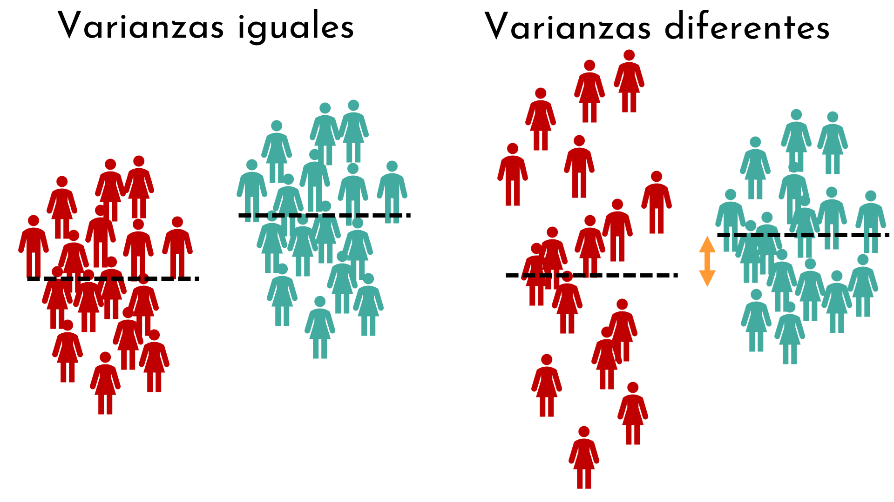
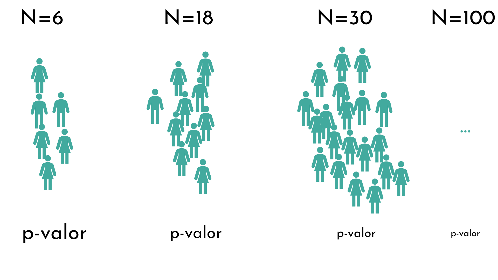

```{r setup, include=FALSE}
options(htmltools.dir.version = FALSE)
#knitr::include_graphics()
knitr::opts_chunk$set(
  cache = TRUE,
  message = FALSE, 
  warning = FALSE,
  hiline = TRUE,
  fig.retina = 5
)
library(ggplot2)
library(readr)
library(knitr)
#pagedown::chrome_print(".html")
```

```{r xaringan-themer, include=FALSE, warning=FALSE}
library(xaringanthemer)
style_mono_accent(
  base_color = "#1c5253", link_color =  "#DE1144", code_inline_color = "#DE1144",
  header_font_google = google_font("Josefin Sans"),
  text_font_google   = google_font("Montserrat", "400", "400i"),
  code_font_google   = google_font("Roboto Mono"),
    
)
```

```{r xaringanExtra-clipboard, echo=FALSE}
library(xaringanExtra)
htmltools::tagList(
  xaringanExtra::use_clipboard(
    button_text = "<i class=\"fa fa-clipboard\"></i>",
    success_text = "<i class=\"fa fa-check\" style=\"color: #90BE6D\"></i>",
  ),
  rmarkdown::html_dependency_font_awesome()
)
```


class: animated, fadeIn
# Outline

#### **Pruebas de t-test**

- Supuestos del T-test de muestras independientes

- Varianzas iguales y desiguales (test de Levene)

- Comprobar normalidad (test de Shapiro)

<style>
.title-slide {
  background-image: url('img/1.png');
  background-size: 100%;
}
</style>

---
class: animated, fadeIn

## Calcular t-test para muestras independientes

La fórmula para realizar el t-test es diferente **dependiendo de si los grupos tienen las mismas varianzas o no**

<center>


--

</center>

> Para saber si las varianzas son iguales o no, podemos utilizar el **test de Levene**


---
class: animated, fadeIn

### Test de Levene para homogeneidad de varianza

Si el p-valor del test de Levene es mayor a 0.05, se asume que las varianzas son iguales ($H_0$)

--

#### Test de Levene en R

```{r}
url <- 'https://raw.githubusercontent.com/genomicsclass/dagdata/master/inst/extdata/mice_pheno.csv'
mice <- read.csv(url)
mice[23:28,] # muestra unas filas específicas

# install.packages("car")
library(car)

```

---
class: animated, fadeIn

### Test de Levene para homogeneidad de varianza

Si el p-valor del test de Levene es mayor a 0.05, se asume que las varianzas son iguales ($H_0$)

--

#### Test de Levene en R

```{r}
mice[24:27,] # muestra unas filas específicas

leveneTest(Bodyweight ~ Diet, data = mice)
```

---
class: animated, fadeIn

## Calcular t-test para muestras independientes

.pull-left[

**Varianzas iguales**

$$
t=\frac{\bar{x}_1 - \bar{x}_2}{\sqrt{s_p^2 \left( \frac{1}{n_1} + \frac{1}{n_2} \right)}}
$$

- Se asume una varianza común, llamada varianza combinada:

$$
s_p^2 = \frac{(n_1 - 1)s_1^2 + (n_2 - 1)s_2^2}{n_1 + n_2 - 2}
$$

- Grados de libertad: $n_1 + n_2 - 2$ 
]

--

.pull-right[

**Varianzas desiguales (t-test de Welch)**

$$
t = \frac{\bar{x}_1 - \bar{x}_2}{\sqrt{\frac{s_1^2}{n_1}+\frac{s_s^2}{n_2}}}
$$

- Los grados de libertad se calculan con la fórmula de Welch-Satterthwaite:

$$
df = \frac{\left( \frac{s_1^2}{n_1} + \frac{s_2^2}{n_2} \right)^2}
{\frac{\left( \frac{s_1^2}{n_1} \right)^2}{n_1 - 1} + \frac{\left( \frac{s_2^2}{n_2} \right)^2}{n_2 - 1}}
$$

]

---
class: animated, fadeIn

## Calcular t-test para muestras independientes en `R`

- Por defecto, la función `t.test()` asume que las varianzas no son iguales (`var.equal=TRUE`), por lo que ejecuta el **t-test de Welch**.

- Para ejecutar el t-test si las varianzas son iguales (*two sample t-test*):

```{r}
t.test(Bodyweight ~ Diet, data = mice, var.equal = TRUE)
```

---
class: animated, fadeIn

## Calcular t-test para muestras independientes en `R`

- Por defecto, la función `t.test()` asume que las varianzas no son iguales (`var.equal=FALSE`), por lo que ejecuta el **t-test de Welch**.

- Para ejecutar el t-test si las varianzas no son iguales (*two sample t-test*):

```{r}
t.test(Bodyweight ~ Diet, data = mice, var.equal = FALSE)
```

---
class: animated, fadeIn

## Repaso: leer grados de libertad y $t_{crit}$

.pull-left[
- Nivel de significancia: $\alpha=0.05$
- Grados de libertad: $df=6$
- Valor t crítico: ?
- Prueba bilateral
]

.pull-right[

```{r echo=F}
library(dplyr)
library(knitr)
library(kableExtra)

# --- Parámetros ---
dfs <- 1:99
probs <- c(0.5, 0.25, 0.2, 0.15, 0.1, 0.05, 0.025, 0.01, 0.005, 0.001)

# --- Calcular valores críticos t (cola superior) ---
# Usamos qt(1 - p, df) para obtener t tal que P(T > t) = p
t_table <- sapply(probs, function(p) qt(1 - p, df = dfs))
t_table_df <- data.frame(df = dfs, round(t_table, 4))
colnames(t_table_df) <- c("gl", paste0("p = ", probs))

t_inf <- sapply(probs, function(p) qnorm(1 - p))          
t_inf_df <- data.frame(df = "∞", t(as.data.frame(round(t_inf, 4))))  
colnames(t_inf_df) <- colnames(t_table_df)

# --- Combinar tablas ---
t_table_df <- rbind(t_table_df, t_inf_df)

# --- Mostrar tabla ---
kable(head(t_table_df,12), row.names = F,  digits = 4, align = "c",
      caption = "Valores críticos de la distribución t (cola superior)") %>%
  kable_styling(
    full_width = FALSE,
    position = "center",
    font_size = 11,
    bootstrap_options = c("condensed")

  ) %>%
  row_spec(0, bold = TRUE, background = "#e6f2ff") %>%
  column_spec(1, bold = TRUE, background = "#e6f2ff")
```

]

---
class: animated, fadeIn

## Repaso: leer grados de libertad y $t_{crit}$

.pull-left[
- Nivel de significancia: $\alpha=0.05$
- Grados de libertad: $df=6$
- Valor t crítico: **2.447**
- Prueba bilateral

Se acepta la hipótesis nula:

$$
t_{crit} \ge t
$$

Se acepta la hipótesis alternativa:

$$
t_{crit} < t
$$

]

.pull-right[

```{r echo=F}
library(dplyr)
library(knitr)
library(kableExtra)

# --- Parámetros ---
dfs <- 1:99
probs <- c(0.5, 0.25, 0.2, 0.15, 0.1, 0.05, 0.025, 0.01, 0.005, 0.001)

# --- Calcular valores críticos t (cola superior) ---
# Usamos qt(1 - p, df) para obtener t tal que P(T > t) = p
t_table <- sapply(probs, function(p) qt(1 - p, df = dfs))
t_table_df <- data.frame(df = dfs, round(t_table, 4))
colnames(t_table_df) <- c("gl", paste0("p = ", probs))

t_inf <- sapply(probs, function(p) qnorm(1 - p))          
t_inf_df <- data.frame(df = "∞", t(as.data.frame(round(t_inf, 4))))  
colnames(t_inf_df) <- colnames(t_table_df)

# --- Combinar tablas ---
t_table_df <- rbind(t_table_df, t_inf_df)

# --- Mostrar tabla ---
kable(head(t_table_df,12), row.names = F,  digits = 4, align = "c",
      caption = "Valores críticos de la distribución t (cola superior)") %>%
  kable_styling(
    full_width = FALSE,
    position = "center",
    font_size = 11,
    bootstrap_options = c("condensed")

  ) %>%
  row_spec(0, bold = TRUE, background = "#e6f2ff") %>%
  column_spec(1, bold = TRUE, background = "#e6f2ff")
```

]

???
https://www.youtube.com/watch?v=x51GDTiPIfI

---

class: animated, fadeIn

### Comprobar si la distribución sigue una normal

- Previamente hemos aprendido a cómo saber si una distribución sigue una normal **gráficamente**
  - QQ-plots
  
--

- Hay test que permiten saber si los datos siguen una distribución normal (**analítica**)
  - Kolmogorov-Smirnov test
  - Shapiro-Wilk test
  - Anderson-Darling test

> Si el p-valor de los test es mayor a 0.05, se asume que los datos siguen una normal ($H_0$)

---
class: animated, fadeIn

### Desventajas de los tests de normalidad

1. El cálculo del p-valor depende del tamaño de muestra: 
  - si la muestra es pequeña, el p-valor puede ser > 0.05
  - si la muestra es grande, el p-valor puede ser < 0.05
  
<center>


--

</center>

> Cada vez se usan más los métodos gráficos (QQ-plot)

---
class: animated, fadeIn

### Test de normalidad en `R`

```{r}
datos_normales <- rnorm(5000, mean=170, sd=10)
```

.pull-left[
```{r echo = F, fig.height=3, fig.width=3, fig.align='center'}

ggplot(data.frame(x=datos_normales), aes(x = x)) +
    geom_histogram(aes(y = ..density..), fill = "salmon", alpha = 0.6) +  # área bajo la curva
      geom_density( size = 1, color = "salmon") +  # área bajo la curva

  labs(    title = "Histograma", x = "Datos normales",
       y = "Densidad") +
  ggthemes::theme_base(base_size = 13) +
  theme(panel.grid=element_blank(),
        axis.text=element_text(color="black"),
        panel.background = element_rect(fill = "white"))

ggplot(data.frame(x=datos_normales), aes(sample = x)) +
  stat_qq(color = "cadetblue4") +
  stat_qq_line(distribution = qnorm, dparams = list(mean = 0, sd = 1), color = "firebrick4", linetype = "dashed", size = 1) +
  labs(
    title = "QQ-plot",
    x = "Cuantiles teóricos",
    y = "Cuantiles muestrales"
  ) +
  ggthemes::theme_base(base_size = 13) +
  theme(panel.grid=element_blank(),
        axis.text=element_text(color="black"),
        panel.background = element_rect(fill = "white"))


 
```
]

--

.pull-right[

```{r}
shapiro.test(datos_normales)
```

]

---
class: animated, fadeIn

## Contacto

<div style="margin-top: 20vh; text-align:center;">

| Marta Coronado Zamora | David Castellano | 
|:-:|:-:|
| <a href="mailto:marta.coronado@uab.cat"><i class="fa fa-paper-plane fa-fw"></i> marta.coronado@uab.cat</a> | <a href="mailto:david.castellano@uab.cat"><i class="fa fa-paper-plane fa-fw"></i>&nbsp; david.castellano@uab.cat</a> | 
| <a href="https://bsky.app/profile/geneticament.bsky.social"><i class="fab fa-bluesky fa-fw"></i>&nbsp; @geneticament.bsky.social</a> |                 <a href="https://bsky.app/profile/castellanoed.bsky.social"><i class="fab fa-bluesky fa-fw"></i>&nbsp; @castellanoed.bsky.social</a> |
| <a href="https://www.uab.cat"><i class="fa fa-map-marker fa-fw"></i>&nbsp; Universitat Autònoma de Barcelona</a> |    <a href="https://gutengroup.mcb.arizona.edu/"> <i class="fa fa-map-marker fa-fw"></i>&nbsp; University of Arizona</a> |

