```{r setup, include=FALSE}
options(htmltools.dir.version = FALSE)
#knitr::include_graphics()
knitr::opts_chunk$set(
  cache = TRUE,
  message = FALSE, 
  warning = FALSE,
  hiline = TRUE,
  fig.retina = 5
)
library(ggplot2)
library(readr)
library(knitr)
#pagedown::chrome_print(".html")
```

```{r xaringan-themer, include=FALSE, warning=FALSE}
library(xaringanthemer)
style_mono_accent(
  base_color = "#1c5253", link_color =  "#DE1144", code_inline_color = "#DE1144",
  header_font_google = google_font("Josefin Sans"),
  text_font_google   = google_font("Montserrat", "400", "400i"),
  code_font_google   = google_font("Roboto Mono")
)
```

```{r xaringanExtra-clipboard, echo=FALSE}
library(xaringanExtra)
htmltools::tagList(
  xaringanExtra::use_clipboard(
    button_text = "<i class=\"fa fa-clipboard\"></i>",
    success_text = "<i class=\"fa fa-check\" style=\"color: #90BE6D\"></i>",
  ),
  rmarkdown::html_dependency_font_awesome()
)
```


class: animated, fadeIn
# Outline

#### **ANOVA**

- Ejemplo
- ¿Qué es un ANOVA?
- ANOVA de una vía
- ANOVA de dos vías
- ANOVA en R

<style>
.title-slide {
  background-image: url('img/1.png');
  background-size: 100%;
}
</style>

---
class: animated, fadeIn

## Ejemplo

_It is thought that stress may increase susceptibility to illness through suppression of the immune system. In an experiment to investigate this theory, 48 rats were randomly allocated to four treatment groups: no stress, mild stress, moderate stress, and high stress. The stress conditions involved various amounts of restraint and electric shock. The concentration of lymphocytes (cells/ml × 10<sup>-6</sup>) in the peripheral blood was measured for each rat._ 

_Perform an appropriate statistical analysis of this experiment._

--

- H<sub>0</sub> y H<sub>1</sub>?
- Variable respuesta?
- Grupos?

---
class: animated, fadeIn

## Ejemplo

_It is thought that **stress may increase susceptibility to illness** through suppression of the immune system. In an experiment to investigate this theory, 48 rats were randomly allocated to **four treatment groups**: no stress, mild stress, moderate stress, and high stress. The stress conditions involved various amounts of restraint and electric shock. The **concentration of lymphocytes** (cells/ml × 10<sup>-6</sup>) in the peripheral blood was measured for each rat._ 

_Perform an appropriate statistical analysis of this experiment._

- ¿Por qué no podemos hacer t-tests a pares? (no stress *vs.* mild stress, no stress *vs.* mild stress, ...) 

--

  - Realizar tests múltiples con los mismos datos incrementa el error tipo I

--

> Análisis de la varianza (_Analysis of variance_, ANOVA), utiliza una sola prueba de hipótesis para comparar varios grupos (>2)

---
class: animated, fadeIn

## ANOVA de una vía

- Prueba de hipótesis que comprueba si hay diferencias significativas entre las **medias** de **tres grupos** o **más**

<center>
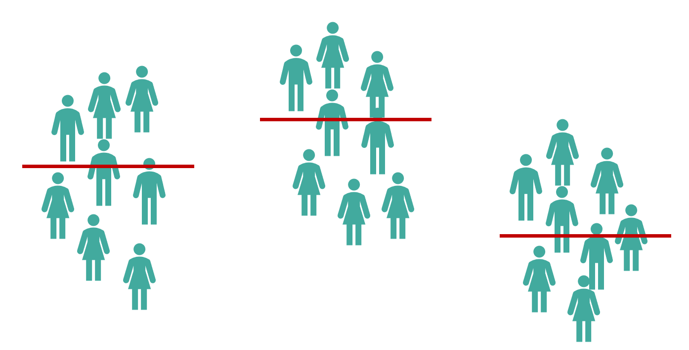

---
class: animated, fadeIn

## ANOVA de una vía

- Prueba de hipótesis que comprueba si hay diferencias significativas entre las **medias** de **tres grupos** o **más**

<center>


---
class: animated, fadeIn

## ANOVA de una vía

- Prueba de hipótesis que comprueba si hay diferencias significativas entre las **medias** de **tres grupos** o **más**

<center>
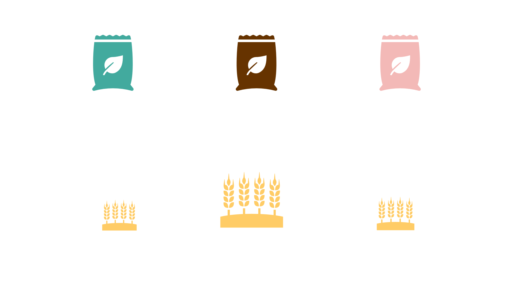

---
class: animated, fadeIn

## ANOVA de una vía

- Prueba de hipótesis que comprueba si hay diferencias significativas entre las **medias** de **tres grupos** o **más**

<center>
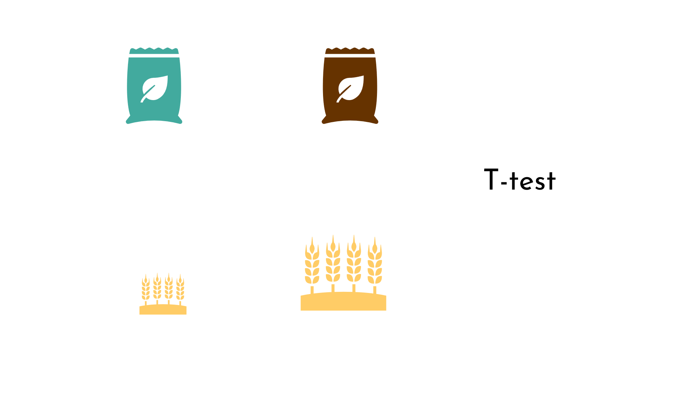


---
class: animated, fadeIn

## ANOVA de una vía

- Prueba de hipótesis que comprueba si hay diferencias significativas entre las **medias** de **tres grupos** o **más**

<center>


---
class: animated, fadeIn

## Hipótesis en ANOVA de una vía

--

.pull-left[
- **Hipótesis nula**: las medias de todos los grupos $k$ son iguales

$$
H_0 = \mu_1 = \mu_2 = ... = \mu_k
$$
<center><br><br>
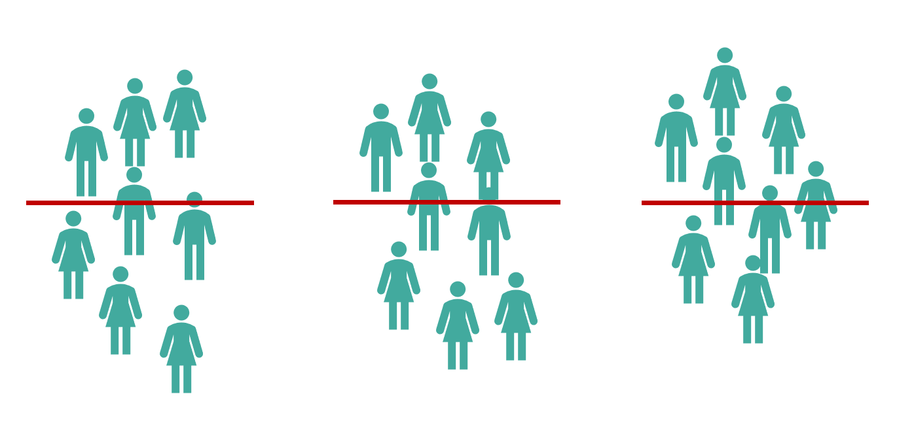

]

.pull-left[
- **Hipótesis alternativa**: las medias de los grupos no son iguales.

$$
H_1=\text{Al menos una } \mu_i \text{ es diferente}
$$
<br><br>
<center>
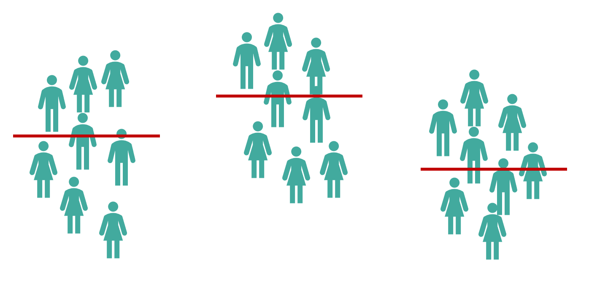

]

---
class: animated, fadeIn

## Supuestos del ANOVA de una vía

--

1. Nivel de medición
2. Independencia
3. Normalidad
4. Homogeneidad 


---
class: animated, fadeIn

## Supuestos del ANOVA de una vía

1. **Nivel de medición**

.pull-left[

Variable **independiente** → **Categórica**

_Ejemplos_:
- Grupo de tratamiento
- Tipo de fertilizante
- ...

]


.pull-left[

Variable **dependiente** → **Continua**

_Ejemplos_:
- Concentración en sangre
- Crecimiento planta
- ...

]

---
class: animated, fadeIn

## Supuestos del ANOVA de una vía

1. Nivel de medición

2. **Independencia**

  -   Los valores medidos en un grupo no deben ser influenciados por las medidas de otro grupo

  -   Individuos o unidades experimentales diferentes


---
class: animated, fadeIn

## Supuestos del ANOVA de una vía

1. Nivel de medición

2. Independencia

3. **Normalidad**

  - Los datos han de seguir una **distribución normal** → especialmente si hay pocos
  
  - Si no se cumple la normalidad, podemos usar el test "Kruskal-Wallis"
  
  


---
class: animated, fadeIn

## Supuestos del ANOVA de una vía

1. Nivel de medición

2. Independencia

3. Normalidad

4. **Homogeneidad**

  - La varianza en cada grupo debería ser parecida entre grupos
  
  - Si no se cumple la homogeneidad de varianzas, podemos usar el test "Welch-ANOVA"
  


---
class: animated, fadeIn

## Cómo funciona un ANOVA de una vía

.pull-left[

$$
\frac{\text{Varianza ENTRE grupos}}{\text{Varianza DENTRO de grupos}}
$$

]

--

.pull-right[

<center>
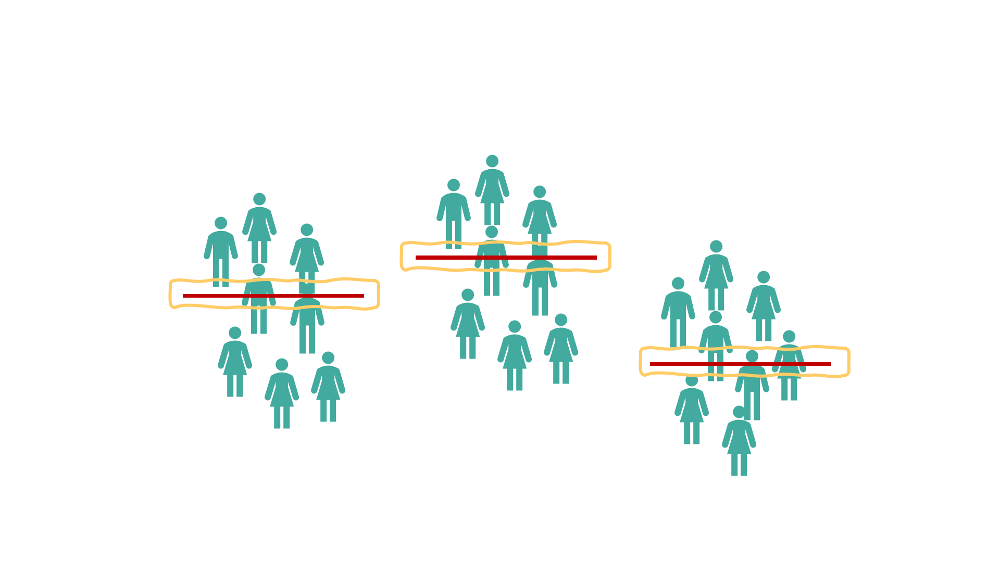

]


---
class: animated, fadeIn

## Cómo funciona un ANOVA de una vía

.pull-left[

$$
\frac{\text{Varianza ENTRE grupos}}{\text{Varianza DENTRO de grupos}}
$$

]

.pull-right[

<center>
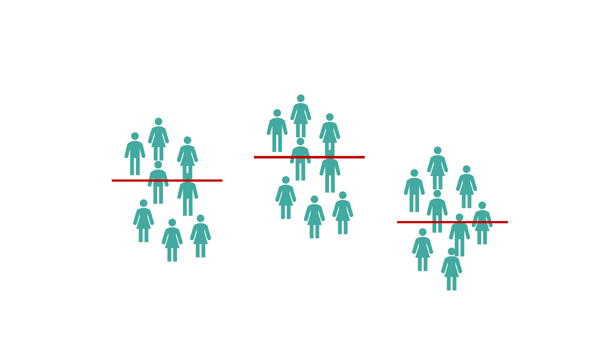

]


---
class: animated, fadeIn

## Cómo funciona un ANOVA de una vía

.pull-left[

$$
\frac{\text{Varianza ENTRE grupos}}{\text{Varianza DENTRO de grupos}}
$$

]

.pull-right[

<center>
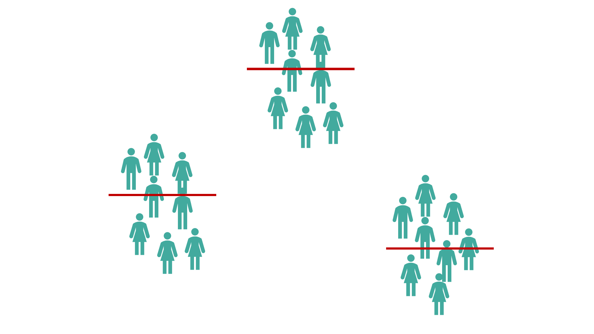

]


---
class: animated, fadeIn

## Cómo funciona un ANOVA de una vía

.pull-left[

$$
\frac{\text{Varianza ENTRE grupos}}{\text{Varianza DENTRO de grupos}}
$$

]

.pull-right[

<center>
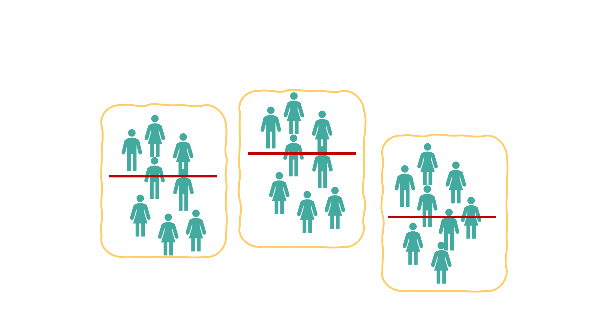

]


---
class: animated, fadeIn

## Cómo funciona un ANOVA de una vía

.pull-left[

$$
\frac{\text{Varianza ENTRE grupos}}{\text{Varianza DENTRO de grupos}}
$$

]

.pull-right[

<center>
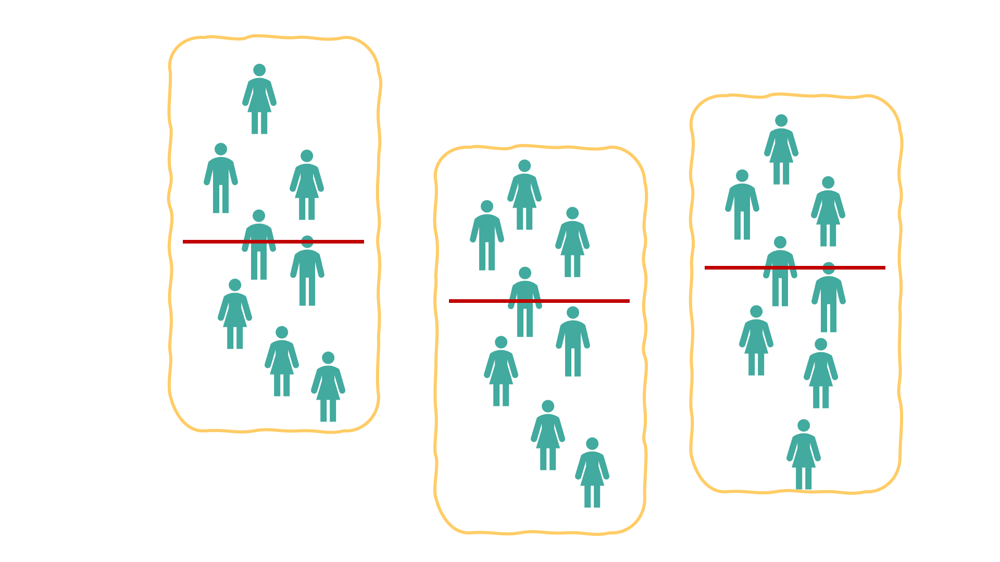

]


---
class: animated, fadeIn

## Cómo funciona un ANOVA de una vía

.pull-left[

**Estadístico F**

$$
\frac{\text{Varianza ENTRE grupos}}{\text{Varianza DENTRO de grupos}}=F
$$

]


---
class: animated, fadeIn

## Cómo funciona un ANOVA de una vía

.pull-left[

**Estadístico F**

$$
\frac{\text{Varianza ENTRE grupos} \downarrow}{\text{Varianza DENTRO de grupos} \uparrow} = F \downarrow
$$

]

.pull-right[

<center>
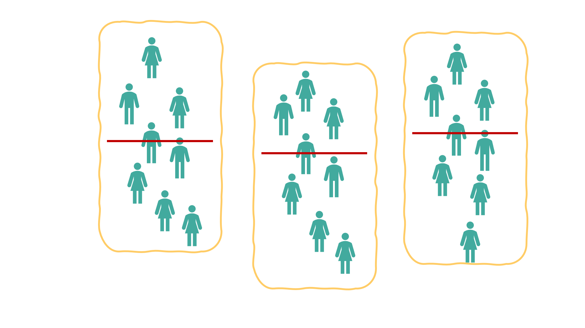


]

--

> Muy prorobable que las diferencias que veamos sean debidas al azar

---
class: animated, fadeIn

## Cómo funciona un ANOVA de una vía

.pull-left[

**Estadístico F**

$$
\frac{\text{Varianza ENTRE grupos} \uparrow}{\text{Varianza DENTRO de grupos} \downarrow} = F \uparrow
$$

]

.pull-right[

<center>
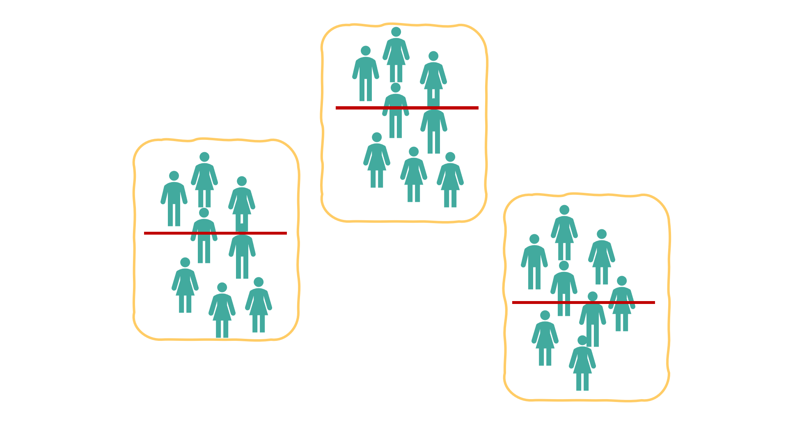


]

--

> Poco probable que las diferencias que veamos sean debidas al azar

--

> Para comprobar nuestra hipótesis y responder si hay o no diferencias significativas, necesitamos calcular el p-valor.


---
class: animated, fadeIn

## Cómo funciona un ANOVA de una vía

**Estadístico F**: pasos para calcularlo:

.pull-left[
**Paso 1:**. Calcular la media conjunta de todos los grupos

$$
G=\frac{\sum{x}}{N}
$$


**Paso 2:**. Calcular la media de cada grupo ($g$) individual

$$
M_i=\frac{\sum^{grupo}{x}}{n_g}
$$
]

--

.pull-right[
**Paso 3:** Suma de cuadrados de los ENTRE grupos (SSB): 

$$
SS_{entre}=\sum^{grupos}n_i(M_i-G)^2
$$


**Paso 4:** Suma de cuadrados de los dentro grupos (SSW): 

$$
SS_{dentro}=\sum^{grupos}\sum^{grupo}(x_mi-M_i)^2
$$

]

---


class: animated, fadeIn

## Cómo funciona un ANOVA de una vía

.pull-left[

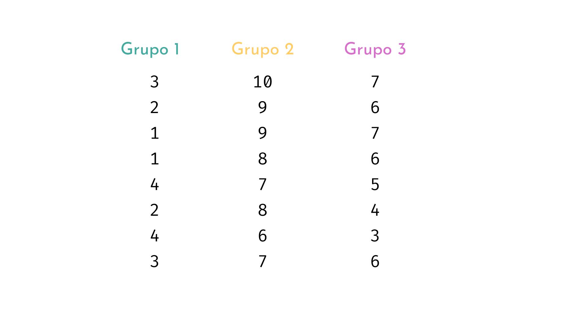

]

.pull-right[

**Media de todos los datos**

$$
G=\frac{\sum{x}}{N}
$$
$$
G=\frac{3+2+...3+10}{24}=5.333
$$

]

---


class: animated, fadeIn

## Cómo funciona un ANOVA de una vía

.pull-left[


]

.pull-right[

**Media de cada grupo**


$$
M_i=\frac{\sum^{grupo}{x}}{n_g}
$$

$$
M_1=\frac{3+2+...+4+3}{8}=2.5
$$


$$
M_2=\frac{10+9+...+6+7}{8}=8
$$


$$
M_3=\frac{7+6+...+3+6}{8}=5.5
$$

]


---


class: animated, fadeIn

## Cómo funciona un ANOVA de una vía

<center>
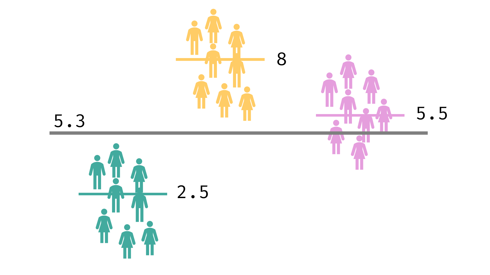

$$
SS_{entre}=\sum^{grupos}n_i(M_i-G)^2
$$


---


class: animated, fadeIn

## Cómo funciona un ANOVA de una vía

<center>


$$
SS_{entre}=8\times((2.5-5.3)^2+(8-5.3)^2+(5.5-5.3)^2)=121.3
$$

---


class: animated, fadeIn

## Cómo funciona un ANOVA de una vía

<center>


$$
SS_{dentro}=\sum^{grupos}\sum^{grupo}(x_mi-M_i)^2
$$

---


class: animated, fadeIn

## Cómo funciona un ANOVA de una vía

<center>
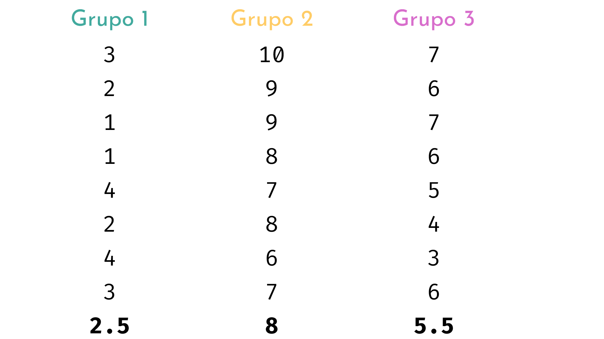


\begin{align*}
SS_{\text{dentro}} &= \sum^{grupos}\sum^{grupo}(x_{mi}-M_i)^2 \\
&= (3-2.5)^2 + (2-2.5)^2 + \ldots \\
&+ (10-8)^2 + (9-8)^2 + \ldots \\
&+ (7-5.5)^2 + (6-5.5)^2 + \ldots=36
\end{align*}

---

class: animated, fadeIn

## Cómo funciona un ANOVA de una vía

**Media total y por grupo**: $G$, $M_1$, $M_2$, $M_3$

**Suma de los cuadrados entre y dentro de grupos**: $SSB$, $SSW$


---
class: animated, fadeIn

## Cómo funciona un ANOVA de una vía

**Estadístico F**: pasos para calcularlo:

.pull-left[
**Paso 1:**. Calcular la media conjunta de todos los grupos

$$
G=\frac{\sum{x}}{N}
$$


**Paso 2:**. Calcular la media de cada grupo ($g$) individual

$$
M_i=\frac{\sum^{grupo}{x}}{n_g}
$$


**Paso 3:** Suma de cuadrados de los ENTRE grupos (SSB): 

$$
SS_{entre}=\sum^{grupos}n_i(M_i-G)^2
$$


]

.pull-right[

**Paso 4:** Suma de cuadrados de los dentro grupos (SSW): 

$$
SS_{dentro}=\sum^{grupos}\sum^{grupo}(x_mi-M_i)^2
$$


**Paso 5:** Media de los cuadrados entre

<center>
$MS_{entre}=\frac{SSB}{gl_e}$
</center>

$gl_{entre}$: número de grupos - 1

**Paso 6:** Media de los cuadrados dentro

$$
MS_{dentro}=\frac{SSW}{gl_d}
$$

$gl_{dentro}$: número de observaciones - número de grupos


]

---
class: animated, fadeIn

## Cómo funciona un ANOVA de una vía

Media de los cuadrados entre:

<center>
$MS_{entre}=\frac{SSB}{gl_e}=\frac{121.3}{2}=60.67$
</center>

$gl_{entre}$: número de grupos - 1 = 3-1 = 2


--

Media de los cuadrados dentro:

$$
MS_{dentro}=\frac{SSW}{gl_d}=\frac{36}{21}=1.71
$$

$gl_{dentro}$: número de observaciones totales - número de grupos = 24 - 3 = 21


---


class: animated, fadeIn

## Cómo funciona un ANOVA de una vía

Cálculo del estadístico `F`:

<center>
$F = \frac{MS_{entre}}{MS_{dentro}}$
</center>

--

<center>
$F = \frac{MS_{entre}}{MS_{dentro}}=\frac{60.67}{1.71}=35.39$
</center>


--

.pull-left[
```{r, echo = F, fig.height=5, fig.width=5}
library(ggplot2)

# Parámetros de la distribución F
df1 <- 2   # grados de libertad del numerador
df2 <- 21  # grados de libertad del denominador

# Crear un rango de valores x
x_vals <- seq(0, 6, length.out = 1000)

# Graficar la distribución F
ggplot(data.frame(x = x_vals), aes(x)) +
  stat_function(fun = df, args = list(df1 = df1, df2 = df2), color = "steelblue", size = 1) +
  labs(
    title = "Distribución F (ANOVA)",
    subtitle = paste("df1 =", df1, ", df2 =", df2),
    x = "Valor de F",
    y = "Densidad"
  ) +
  ggthemes::theme_base(base_size = 13) +
  theme(panel.grid=element_blank(),
        axis.text=element_text(color="black"),
        panel.background = element_rect(fill = "white"))
```
]

--
.pull-right[

<br>

**Propiedades**:

- El valor de F siempre es positivo

- Generalmente se utiliza una $\alpha$ de 0.05 y una hipótesis unilateral (en el ANOVA para comparar medias de grupos)


]
---

class: animated, fadeIn

## Tabla de la distribución F ($\alpha$ = 0.05)


```{r echo = F}
library(dplyr)
library(knitr)
library(kableExtra)

# --- Parámetros ---
df1_vals <- 1:15      # grados de libertad del numerador
df2_vals <- 1:21     # grados de libertad del denominador
alpha <- 0.05        # nivel de significación (cola superior)

# --- Calcular valores críticos F ---
F_table <- sapply(df1_vals, function(df1) qf(1 - alpha, df1 = df1, df2 = df2_vals))

# --- Convertir en data frame ---
F_table_df <- data.frame(df2 = df2_vals, round(F_table, 4))
colnames(F_table_df) <- c("df2", paste0("gl1 = ", df1_vals))
rownames(F_table_df) <- paste0("gl2 = ",rownames(F_table_df))
F_table_df$df2<-NULL

# --- Mostrar tabla ---
kable(F_table_df, row.names = TRUE, align = "c",
      caption = "Valores críticos de la distribución F (cola superior, α = 0.05)") %>%
  kable_styling(
    full_width = FALSE,
    position = "center",
    font_size = 9,  # letra pequeña
    bootstrap_options = c("condensed")
  ) %>%
  row_spec(0, bold = TRUE, background = "#e6f2ff") %>%
  column_spec(1, bold = TRUE, background = "#e6f2ff")


```

---
class: animated, fadeIn

## ANOVA en `R`

Estamos interesados en comprobar si la abundancia de aves depende de la dieta. Total: `n` = 54 aves.

```{r echo = F}
library(data.table)
bird <- fread("https://raw.githubusercontent.com/QCBSRworkshops/workshop04/refs/heads/main/book-en/data/birdsdiet.csv")
bird %>%
  knitr::kable() %>%
  kable_styling(full_width = FALSE, bootstrap_options = c("condensed", "striped")) %>%
  scroll_box(width = "100%", height = "300px")

```

---
class: animated, fadeIn

### Visualizar los datos en `R`

--

.pull-left[

```{r, eval = F}
ggplot(bird, aes(x = Diet,
                 y = log(MaxAbund), 
                 fill=Diet)) +
  geom_boxplot() +
  labs(
    x = "Tipo de dieta",
    y = "log(Max. abundancia)",
    title = "Distribución de abundancia máxima según la dieta"
  ) +
  ggthemes::theme_base(base_size = 14) +
  theme(
    plot.title = element_text(face = "bold", hjust = 0.5),
    axis.text.x = element_text(angle = 45, hjust = 1)
  )
```

]

.pull-right[


```{r echo = F}
ggplot(bird, aes(x = Diet, y = log(MaxAbund), fill=Diet)) +
  geom_boxplot(color = "gray30", show.legend = F) +
  labs(
    x = "Tipo de dieta",
    y = "log(Max Abundancia)",
    title = "Distribución de abundancia máxima según la dieta"
  ) +
  scale_fill_viridis_d() +
  ggthemes::theme_base(base_size = 13) +
  theme(panel.grid=element_blank(),
        axis.text=element_text(color="black"),
        panel.background = element_rect(fill = "white"))
```


]

---
class: animated, fadeIn

## Verificar los supuestos del ANOVA

> Primero, hacemos el ANOVA solo para poder obtener los **residuos** y verificar los supuestos

--

  > Los supuestos del ANOVA se aplican sobre los **residuos**, no sobre los datos originales!

- Los residuos representan el error que comete el modelo al predecir cada observación.

- En el ANOVA, son las diferencias entre los valores observados y las medias de los grupos


| Fuente de variación | Suma de cuadrados (SS) | Grados de libertad (gl) | Media cuadrática (MS) | Estadístico F |
|:--------------------:|:----------------------:|:-----------------------:|:----------------------:|:--------------:|
| **Factor** (variabilidad entre grupos) | $SS_{entre} = \displaystyle \sum_{i=1}^{g} n_i (M_i - G)^2$ | $gl_{entre} = g - 1$ | $MS_{entre} = \dfrac{SS_{entre}}{gl_{entre}}$ | $F = \dfrac{MS_{entre}}{MS_{dentro}}$ |
| **Residuos** (variabilidad dentro de los grupos) | $SS_{dentro} = \displaystyle \sum_{i=1}^{g} \sum_{j=1}^{n_i} (x_{ij} - M_i)^2$ | $gl_{dentro} = N - g$ | $MS_{dentro} = \dfrac{SS_{dentro}}{gl_{dentro}}$ |  |
| **Total** | $SS_{total} = \displaystyle \sum_{i=1}^{g} \sum_{j=1}^{n_i} (x_{ij} - G)^2$ | $gl_{total} = N - 1$ |  |  |

**Donde:**
- $G$ = media global (media conjunta de todos los grupos)  
- $M_i$ = media del grupo *i*  
- $n_i$ = tamaño del grupo *i*  
- $g$ = número de grupos  
- $N$ = número total de observaciones  

???
En un análisis ANOVA, los factores son las variables independientes categóricas que se estudian, mientras que los residuos son la diferencia entre el valor observado y el valor predicho por el modelo ANOVA (es decir, la variación no explicada por los factores). El análisis de los residuos es crucial para verificar la validez del modelo ANOVA, ya que asume que estos errores siguen una distribución normal y son independientes

---
class: animated, fadeIn

## Verificar los supuestos del ANOVA


$MS_{entre}$: es una estimación de la variabilidad entre las poblaciones. Se suele conocer como "varianza explicada" por el factor que define las poblaciones.
- Nos dice cuánta diferencia hay entre los grupos, y por tanto refleja el efecto del tratamiento o del factor que estamos estudiando.

$MS_{dentro}$: es una estimación conjunta de la varianza residual dentro de cada población. Esta varianza se supone que es la misma para todas los gupos.
- Es una medida del “ruido” o la variabilidad natural que hay dentro de cada grupo.
- Nos dice cuánto varían los valores entre sí dentro de los grupos, sin tener en cuenta las diferencias entre grupos.

Así, cuando calculamos el estadístico `F`, estamos viendo si las diferencias entre grupos son mayores que el ruido interno esperado por azar.


---
class: animated, fadeIn

## Verificar los supuestos en `R`

- **Normalidad de los residuos**: los residuos del modelo deben seguir una distribución normal.
  - El **test de Shapiro-Wilk** permite contrastar si los residuos son normales.

Las hipótesis son:

$$
H_0: \text{los residuos siguen una distribución normal}
$$

$$
H_1: \text{los residuos no siguen una distribución normal}
$$

--

- **Homoscedasticidad**: debe comprobarse que las varianzas de los grupos son iguales (o al menos que no existen diferencias significativas entre ellas). 
  - Aplicamos el **Test de Levene**.

Las hipótesis son:

$$
H_0: \sigma^2_1 = \sigma^2_2 = \dots = \sigma^2_p
$$

$$
H_1: \text{existe al menos un par } (i,j) \text{ tal que } \sigma^2_i \neq \sigma^2_j
$$

---
class: animated, fadeIn

## ANOVA en `R`

La función `aov()` permite realizar el ANOVA:

```{r}
aov1 <- aov(log(MaxAbund) ~ Diet, data = bird)
aov1
```


---
class: animated, fadeIn

## ANOVA en `R`

La función `aov()` permite realizar el ANOVA:

```{r eval = F}
aov1 <- aov(log(MaxAbund) ~ Diet, data = bird)
aov1
```

- `log(MaxAbund)` → es la variable dependiente (la que queremos comparar entre grupos). Logaritmo para normalizar.

- `Diet` → es la variable independiente o factor (los grupos que queremos comparar, por ejemplo diferentes tipos de dieta).

- `data = bird` → indica que los datos se encuentran en el `dataframe bird`.

El operador ~ se lee como “en función de”, es decir:“queremos analizar la abundancia máxima en función de la dieta.

---
class: animated, fadeIn

### Normalidad de residuos

Aplicamos el test de Shapiro sobre los residuos, accesibles con la función `resid()`.

```{r}
aov1 <- aov(log(MaxAbund) ~ Diet, data = bird)
head(resid(aov1), 20)
```

- Cada valor es una observación de la tabla (54 en total)
- El residuo se calcula como la resta del valor observado menos el valor predicho por el modelo (es decir, la media del grupo al que pertenece dicho valor)
- Los residuos reflejan cuánto se desvía cada observación de la media de su grupo, es decir, la parte que el modelo no explica.

---
class: animated, fadeIn

### Normalidad de residuos

Aplicamos el test de Shapiro sobre los residuos, accesibles con la función `resid()`.

```{r}
shapiro.test(resid(aov1))
```

--

- Si p-valor > 0.05, no se rechaza H₀: no hay evidencia suficiente para afirmar que los residuos no son normales, y la suposición de normalidad se cumple.

---
class: animated, fadeIn

### Homogeneidad de varianzas

Para verificar si los residuos del ANOVA tienen varianzas similares entre los grupos (supuesto de homogeneidad de varianzas), aplicamos el test de Levene:

```{r}
aov1 <- aov(log(MaxAbund) ~ Diet, data = bird)
```

```{r}
library(car)
leveneTest(aov1)
```

--

- Si p-valor > 0.05 → no se rechaza H₀, las varianzas son aproximadamente iguales entre los grupos y el supuesto se cumple.

---
class: animated, fadeIn

## Anova en `R`

En `R`, el ANOVA se puede ejecutar directamente con la función `aov()`:

```{r}
aov1 <- aov(log(MaxAbund) ~ Diet, data = bird)
summary(aov1)
```

---
class: animated, fadeIn

### Interpretación del ANOVA

```{r echo = F}
aov1 <- aov(log(MaxAbund) ~ Diet, data = bird)
summary(aov1)
```

- `Df` (grados de libertad): número de niveles del factor y residuales.

- `Sum Sq` (suma de cuadrados): cantidad de variación explicada por el factor y por los residuos

- `Mean Sq` (media de cuadrados): varianza estimada por cada componente.

- `F value`: estadístico F, que compara la variabilidad entre grupos con la variabilidad dentro de los grupos.

- `Pr(>F)`: valor p, que indica si las diferencias entre las medias de los grupos son estadísticamente significativas. Se proporciona el valor número y código.

---
class: animated, fadeIn

### Interpretación del ANOVA


```{r echo = F, fig.align='center'}
ggplot(bird, aes(x = Diet, y = log(MaxAbund), fill=Diet)) +
  geom_boxplot(color = "gray30", show.legend = F) +
  labs(
    x = "Tipo de dieta",
    y = "log(Max Abundancia)",
    title = "Distribución de abundancia máxima según la dieta"
  ) +
  scale_fill_viridis_d() +
  ggthemes::theme_base(base_size = 13) +
  theme(panel.grid=element_blank(),
        axis.text=element_text(color="black"),
        panel.background = element_rect(fill = "white"))
```


---
class: animated, fadeIn

## Test complementario: test de Tukey

- ANOVA solo indica si existe una diferencia significativa entre grupos, no cuál es diferente.

- Para identificar qué grupos difieren entre sí, se realizan tests **post-hoc** que comparan los niveles del factor dos a dos.

- Test típico es el Tukey's HSD (_Honestly Significant Difference_):
  - Compara todas las parejas de medias de los grupos tras un ANOVA
  - Garantiza que el nivel global de significancia se mantenga, controlando el error tipo I (falsos positivos) cuando se hacen múltiples comparaciones. 

---
class: animated, fadeIn

## Test complementario: test de Tukey

La función `TukeyHSD` aplica el test de Tukey:

```{r, eval = F}
aov1 <- aov(log(MaxAbund) ~ Diet, data = bird)
TukeyHSD(aov1)
```

```{r, echo = F}
library(knitr)
library(kableExtra)

# Calculamos TukeyHSD
tukey <- TukeyHSD(aov1)

# Convertimos los resultados del factor Diet a data.frame
tukey_df <- as.data.frame(tukey$Diet)

# Ordenamos por la magnitud de la diferencia
tukey_df <- tukey_df[order(abs(tukey_df$`p adj`)), ]

# Mostramos la tabla con kableExtra
kable(tukey_df, digits = 4, caption = "Resultados del test de Tukey para el factor Diet") %>%
  kable_styling(full_width = FALSE, bootstrap_options = c("condensed", "striped")) %>%
  scroll_box(width = "100%", height = "300px")


```

- Aplica el test post-hoc de Tukey (HSD), que compara todas las posibles parejas de grupos de `Diet` para determinar qué grupos son significativamente diferentes entre sí.

---
class: animated, fadeIn

## Test complementario: test de Tukey

- Las comparaciones con un p-valor ajustado (corregido) < 0.05, son las significativas

- En este caso, la única diferencia significativa en la abundancia ocurre entre las dietas `PlantInsect` y `Vertebrate`.


```{r echo = F, fig.align='center', fig.width=6, fig.height=5}
ggplot(bird, aes(x = Diet, y = log(MaxAbund), fill=Diet)) +
  geom_boxplot(color = "gray30", show.legend = F) +
  labs(
    x = "Tipo de dieta",
    y = "log(Max. abundancia)",
    title = "Distribución de abundancia máxima según la dieta"
  ) +
  scale_fill_viridis_d() +
  ggthemes::theme_base(base_size = 13) +
  theme(panel.grid=element_blank(),
        axis.text=element_text(color="black"),
        panel.background = element_rect(fill = "white"))
```

---
class: animated, fadeIn

## Test complementario: test de Tukey

- El test de Tukey HSD está diseñado para comparar todas las medias entre sí sin inflar el error tipo I (el riesgo de falsos positivos): **FWER** - _family-wise error rate_

- El error familiar (FWER) es la probabilidad de cometer al menos un error tipo I en el conjunto de comparaciones.


---
class: animated, fadeIn

### Visualizar el resultado del test de Tukey

.pull-left[
```{r eval = F, fig.height=5,fig.width=3}
tuk <- TukeyHSD(aov1)
plot(tuk, las = 1)  
```

- Las líneas horizontales son el intervalo de confianza (IC) al 95% de la diferencia de medias, ajustado por el método de Tukey.

- La línea vertical discontinua en 0 marca el punto donde no hay diferencia (diferencia = 0).

  - Si el intervalo cruza el 0, la diferencia no es significativa (no puedes descartar que sean iguales).

  - Si el intervalo no toca el 0, la diferencia sí es significativa.

]

.pull-right[
```{r echo = F}
# Set figure margins and layout
par(mar=c(5,8,2,2))  # bottom, left, top, right
par(cex.axis=0.8)     # reduce axis label size if needed
par(cex.lab=1)        # label size

tuk <- TukeyHSD(aov1)
plot(tuk, las = 1)  
```
]


---
class: animated, fadeIn

### Visualizar el resultado del ANOVA

Figura creada con el paquete `ggstatsplot`.

```{r echo = F, fig.align='center', fig.height=6.5}
library(ggstatsplot)
bird$logMaxAbund<-log(bird$MaxAbund)
ggbetweenstats(
    data = bird,
    x = Diet,
    y = logMaxAbund,
    type = "parametric",
    var.equal = TRUE,bf.message = F,pairwise.display = "none") +
  theme(text = element_text(size = 18)) 
    
```


---
class: animated, fadeIn

## Alternativas al ANOVA

Si no se cumplen los supuestos del ANOVA (normalidad o homogeneidad de varianzas), existen dos estrategias principales:

#### Transformación de los datos

- Aplicar logaritmo (`y_transf <- log(y)`): datos sesgados
- Inversa (`y_transf <- 1/y`): datos pequeños
- ...

--

#### Test no paramétrico: Kruskal-Wallis

Si ninguna transformación funciona, usar un test no paramétrico:

```{r eval = F}
kruskal.test(y ~ grupo, data = datos)
```


- No requiere normalidad ni homogeneidad de varianzas

- Compara las medianas de los grupos en lugar de las medias


---
class: animated, fadeIn

## Actividad de ANOVA

Una investigadora desea conocer la efectividad de varios suplementos alimenticios (_feed_) sobre la tasa de crecimiento (_weight_) de los pollos. Los datos están disponibles en la tabla `chickwts` de `R` y se muestran a continuación. Usa ANOVA para examinar la efectividad de los suplementos alimenticios. Ejercicio tomado de: Biostatistics with R. Shahbaba (2012). Springer.<br>
**RETO**: haz la actividad en `R`. La línea de comando para cargar la tabla `chickwts` es `data("chickwts")`.

```{r, echo = F}
library(dplyr)
library(tidyr)
library(knitr)
library(kableExtra)

chickwts %>%
  mutate(weight = as.character(weight)) %>%   # convertir a texto
  group_by(feed) %>%
  mutate(id = row_number()) %>%
  pivot_wider(
    names_from = feed,
    values_from = weight,
    values_fill = list(weight = "")           # celdas vacías en lugar de NA
  ) %>%  # ⬅️ rellena celdas   # formato wide
  dplyr::select(-id) %>%                         # opcional: quitar índice si no lo quieres
  kable(
    caption = "Pesos de pollos por tipo de alimentación",
    digits = 1
  ) %>%
  kable_styling(
    full_width = FALSE,
    font_size = 9,
    bootstrap_options = c("condensed", "striped", "hover")
  )
```


---
class: animated, fadeIn

## Primer paso: comprobar supuestos del ANOVA


```{r }
aov1 <- aov(weight ~ feed, data = chickwts)

library(car)
leveneTest(aov1)

shapiro.test(residuals(aov1))
```


---
class: animated, fadeIn

## Calculadora de la F crítica de Fisher

- Podemos utilizar calculadoras online como:  https://www.danielsoper.com/statcalc/calculator.aspx?id=4 para obtener rápidamente la F crítica.
- Podemos utilizar la tabla:


```{r echo = F}
library(dplyr)
library(knitr)
library(kableExtra)

# --- Parámetros ---
df1_vals <- 1:15      # grados de libertad del numerador
df2_vals <- 55:70     # grados de libertad del denominador
alpha <- 0.05        # nivel de significación (cola superior)

# --- Calcular valores críticos F ---
F_table <- sapply(df1_vals, function(df1) qf(1 - alpha, df1 = df1, df2 = df2_vals))

# --- Convertir en data frame ---
F_table_df <- data.frame(df2 = df2_vals, round(F_table, 4))
colnames(F_table_df) <- c("df2", paste0("gl1 = ", df1_vals))
rownames(F_table_df) <- paste0("gl2 = ",df2_vals)
F_table_df$df2<-NULL

# --- Mostrar tabla ---
kable(F_table_df, row.names = TRUE, align = "c",
      caption = "Valores críticos de la distribución F (cola superior, α = 0.05)") %>%
  kable_styling(
    full_width = FALSE,
    position = "center",
    font_size = 9,  # letra pequeña
    bootstrap_options = c("condensed")
  ) %>%
  row_spec(0, bold = TRUE, background = "#e6f2ff") %>%
  column_spec(1, bold = TRUE, background = "#e6f2ff")


```

  
  
---
class: animated, fadeIn

## Resultado del ANOVA

```{r echo = F, fig.align='center', fig.height=6.5}
library(ggstatsplot)

ggbetweenstats(
    data = chickwts,
    x = feed,
    y = weight,
    type = "parametric",
    var.equal = TRUE,bf.message = F,pairwise.display = "none") +
  theme(text = element_text(size = 18)) 
    
```

---
class: animated, fadeIn

## Resultado del test de Tukey

```{r echo = F}
# Guardar resultados
tuk <- TukeyHSD(aov(aov1), ordered = TRUE)

# Extraer la tabla del factor "Diet"
tuk_diet <- as.data.frame(tuk$feed)

# Mostrarla de forma bonita
library(knitr)
library(kableExtra)

kable(tuk_diet, digits = 4, caption = "Resultados del test de Tukey") %>%
  kable_styling(full_width = FALSE, bootstrap_options = c("condensed", "striped")) %>%
  scroll_box(width = "100%", height = "400px")
```

---
class: animated, fadeIn

## La F crítica y p-valor en `R`

- **F crítico**: valor umbral que define si rechazamos la hipótesis nula $H_0$ al nivel de significancia $\alpha$.  

```{r}
alpha <- 0.05      # nivel de significancia
df1 <- 5           # grados de libertad del numerador (número de grupos - 1)
df2 <- 65          # grados de libertad del denominador (total muestras - número de grupos)

F_critical <- qf(1 - alpha, df1, df2, lower.tail = TRUE)
F_critical
```

La función `qf` devuelve el valor de F que corresponde al 5% de probabilidad de error tipo I (cola superior) dados esos grados de libertad.

> Si $F_{obs} > F_{crit}$ rechazamos $H_0$

---
class: animated, fadeIn

## La F crítica y p-valor en `R`

- **P-valor**: probabilidad de obtener un valor de F igual o mayor que el observado, $F_{obs}$.

```{r}
df1 <- 5
df2 <- 65
F_obs <- 15.36

p_value <- pf(F_obs, df1, df2, lower.tail = FALSE)
p_value
```

La función `pf` calcula directamente esta probabilidad.


> Si $p-valor < \alpha$ → el ANOVA es significativo.

> `lower.tail=FALSE` porque ANOVA siempre mira la cola superior!

---
layout: false
class: left, bottom, inverse, animated, bounceInDown


## ANOVA de DOS VÍAS

---
class: animated, fadeIn

## ANOVA de dos vías

- Método estadístico para probar el efecto de **dos variables categóricas** sobre una **variable continua**.

  - La **variables categóricas** son las **variables independientes**
  
  - las **variables continuas** son las **variables respuesta**

--

- Es una extensión del ANOVA de una vía


---
class: animated, fadeIn

### ¿Cuándo usamos el ANOVA de dos vías?

- Usamos un ANOVA de dos vías cuando queremos evaluar el efecto de **dos factores independientes** sobre una variable dependiente.

<center>
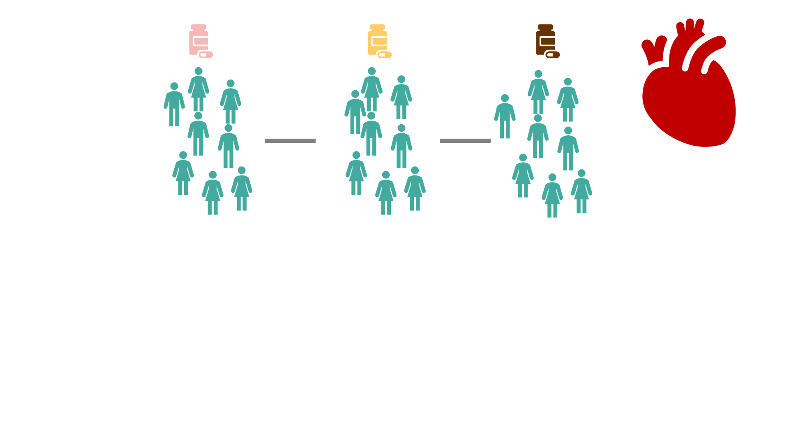

---
class: animated, fadeIn

### ¿Cuándo usamos el ANOVA de dos vías?

- Usamos un ANOVA de dos vías cuando queremos evaluar el efecto de **dos factores independientes** sobre una variable dependiente.

<center>
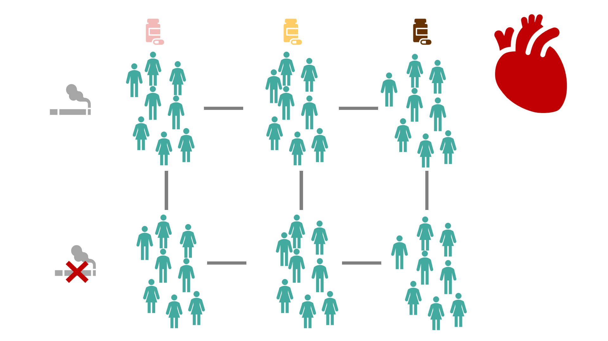

---
class: animated, fadeIn

### Ejemplo de ANOVA de dos vías

- **Variable dependiente**: crecimiento de una planta

- **Factor 1**: tipo de fertilizante (orgánico vs. químico)

- **Factor 2**: cantidad de luz (alta vs. baja)

--

¿El fertilizante y/o la luz afectan al crecimiento? ¿Depende el efecto del fertilizante del nivel de luz?

<center>


---

class: animated, fadeIn

### ¿Qué afirmaciones podemos hacer con un ANOVA de dos vías?

Posibles escenarios de un ANOVA: **efectos principales** e **interacción**

<center>

```{r echo = F, fig.width=10}
library(ggplot2)
library(dplyr)

set.seed(123)
rep <- 5  # réplicas por combinación

# ---- 1. Sin efecto de ningún factor ----
data1 <- expand.grid(
  Fertilizante = c("Orgánico", "Químico"),
  Luz = c("Baja", "Alta"),
  Rep = 1:rep
)
data1$Crecimiento <- rnorm(nrow(data1), mean = 10, sd = 1)
data1$Escenario <- "Sin efecto de ningún factor"

# ---- 2. Solo efecto del fertilizante ----
data2 <- expand.grid(
  Fertilizante = c("Orgánico", "Químico"),
  Luz = c("Baja", "Alta"),
  Rep = 1:rep
)
data2$Crecimiento <- with(data2,
  ifelse(Fertilizante == "Orgánico", rnorm(rep * 2, mean = 12, sd = 1),
                                rnorm(rep * 2, mean = 8, sd = 1)))
data2$Escenario <- "Solo efecto del fertilizante"

# ---- 3. Solo efecto de la luz ----
data3 <- expand.grid(
  Fertilizante = c("Orgánico", "Químico"),
  Luz = c("Baja", "Alta"),
  Rep = 1:rep
)
data3$Crecimiento <- with(data3,
  ifelse(Luz == "Baja", rnorm(rep * 2, mean = 8, sd = 1),
                      rnorm(rep * 2, mean = 12, sd = 1)))
data3$Escenario <- "Solo efecto de la luz"

# ---- 4. Con interacción significativa ----
data4 <- expand.grid(
  Fertilizante = c("Orgánico", "Químico"),
  Luz = c("Baja", "Alta"),
  Rep = 1:rep
)
data4$Crecimiento <- with(data4,
  ifelse(Fertilizante == "Orgánico" & Luz == "Baja", rnorm(rep, 12, 1),
  ifelse(Fertilizante == "Orgánico" & Luz == "Alta", rnorm(rep, 9, 1),
  ifelse(Fertilizante == "Químico" & Luz == "Baja", rnorm(rep, 10, 1),
                                rnorm(rep, 13, 1)))))
data4$Escenario <- "Con interacción significativa"

# ---- Unir los datasets ----
datos <- bind_rows(data1, data2, data3, data4)

# ---- Graficar ----
ggplot(datos, aes(x = Luz, y = Crecimiento, color = Fertilizante, group = Fertilizante)) +
  stat_summary(fun = mean, geom = "point", size = 3) +
  stat_summary(fun = mean, geom = "line", linewidth = 1) +
  stat_summary(fun.data = mean_se, geom = "errorbar", width = 0.1) + 
  facet_wrap(~Escenario, scales = "free_y", ncol = 2) +
  theme_minimal(base_size = 15) +
  labs(
    y = "Crecimiento medio",
    x = "Nivel de luz",
    color = "Fertilizante"
  )  +
  scale_color_manual(values=c("cadetblue4", "firebrick3")) + 
  ggthemes::theme_base(base_size = 18) + 
  theme(
    plot.title = element_text(face = "bold", size = 18, hjust = 0.5),
    strip.text = element_text(size = 13, face = "bold"),
    legend.position = "bottom", 
    panel.grid=element_blank(),
        axis.text=element_text(color="black"),
        panel.background = element_rect(fill = "white") 
  )+
      coord_cartesian(ylim=c(7.5,14))

```

---
class: animated, fadeIn

### ¿Qué afirmaciones podemos hacer con un ANOVA de dos vías?

1. ¿El factor 1 tiene un efecto en la variable dependiente?

2. ¿El factor 2 tiene un efecto en la variable dependiente?

3. ¿Hay interacción entre los dos factores?

---
class: animated, fadeIn

## Hipotesis del ANOVA de dos vías

.pull-left[
Hay **3 hipótesis nulas**:

1. No hay diferencia significativa entre los grupos del primer factor.

2. No hay diferencia significativa entre los grupos del segundo factor.

3. Un factor no influye en el efecto del otro factor (no hay interacción).

]

.pull-right[
Hay **3 hipotesis alternativas**

1. Hay diferencias significativas entre los grupos del primer factor.

2. Hay diferencias significativas entre los grupos del segundo factor.

3. Un factor influye en el efecto del otro factor (sí hay interacción).
]

--

- No tienen que cumplirse (ni rechazarse) las tres hipótesis simultáneamente.

---
class: animated, fadeIn

## Requisitos del ANOVA

--

1. **Normalidad**  
   - Los residuos deben seguir una distribución normal.  
   - Se puede comprobar mediante:
     - Gráfico QQ-plot  
     - Test de Shapiro–Wilk  

2. **Homogeneidad de varianzas**  
   - Los grupos deben tener varianzas similares.  
   - Se verifica con el test de Levene.  

3. **Independencia**  
   - Las observaciones deben ser independientes entre sí.  
   - Las medidas de un grupo no deben influir en las de otro.  

4. **Nivel de medida adecuado**  
   - La variable dependiente debe estar en una escala métrica (cuantitativa).  
   - Los factores deben ser categóricos (niveles o grupos definidos).  


---
class: animated, fadeIn

## ¿Cómo se calcula el ANOVA de dos vías?

> Queremos saber si el tipo de fertilizante (químico u orgánico) y las condiciones de luz (alta o baja) tienen un efecto sobre el crecimiento de las plantas.

--

```{r echo = F}
datos[datos$Escenario=="Solo efecto de la luz",c("Fertilizante", "Luz", "Crecimiento")] %>%
  knitr::kable(row.names = FALSE) %>%
  kable_styling(full_width = FALSE, bootstrap_options = c("condensed", "striped")) %>%
  scroll_box(width = "100%", height = "300px")
```


---
class: animated, fadeIn

## Preguntas posibles

1. ¿El tipo de fertilizante (orgánico o químico) influye en el crecimiento de las plantas?

2. ¿Las condiciones de luz (alta o baja) afectan al crecimiento de las plantas?

3. ¿Existe una interacción entre la luz y el tipo de fertilizante que modifique el crecimiento de las plantas?

<center>


---
class: animated, fadeIn

## ¿Qué hace el análisis de varianza?

En un analisis de ANOVA de dos vías, la varianza total (suma de cuadrados totales, $SS_{total}$) de la variable dependiente se descompone en:

<center>
<br>

$SS_{total}=SS_{A}+SS_{B}+SS_{AB}+SS_{error}$

</center>

- $SS_A$: varianza explicada por el factor A

- $SS_B$: varianza explicada por el factor B

- $SS_{AB}$: varianza debida a la interacción entre A y B

- $SS_{error}$: varianza no explicada (residual)

--

> Queremos evaluar si la variabilidad en el crecimiento de las plantas puede explicarse por los factores luz, fertilizante, o por la interacción entre ambos.

---
class: animated, fadeIn

## ¿Qué hace el análisis de varianza?

<center>
<br>

$SS_{total} = SS_{A} + SS_{B} + SS_{AB} + SS_{error}$

<br>

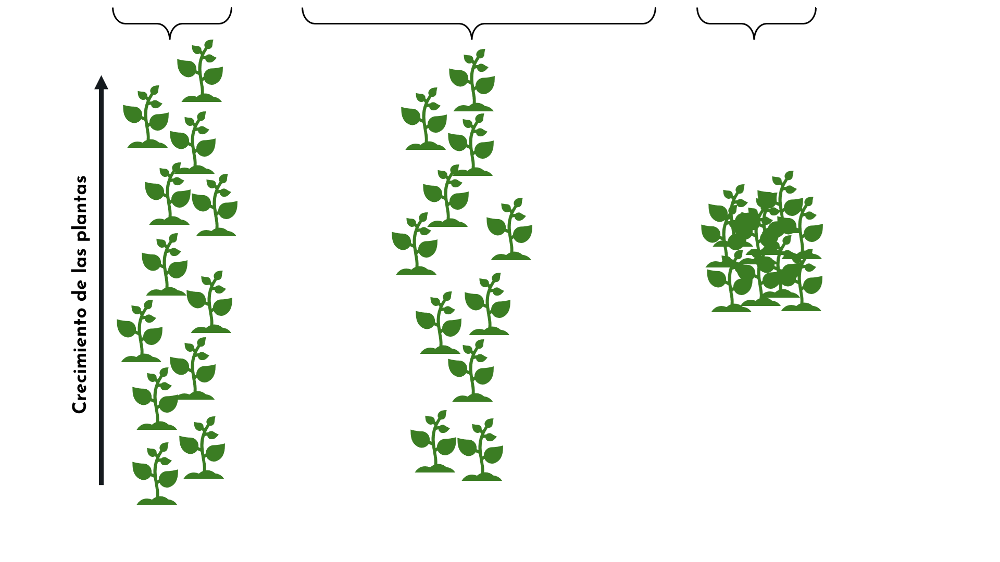
</center>

- La mayor parte de la varianza en el crecimiento se explica por los factores A y B, y su interacción.
- Solo una pequeña proporción de la variabilidad queda sin explicar (error residual).

> Podemos describir muy bien el crecimiento a partir de los factores considerados en el modelo.

---
class: animated, fadeIn

## ¿Qué hace el análisis de varianza?

<center>
<br>

$SS_{total} = SS_{A} + SS_{B} + SS_{AB} + SS_{error}$

<br>

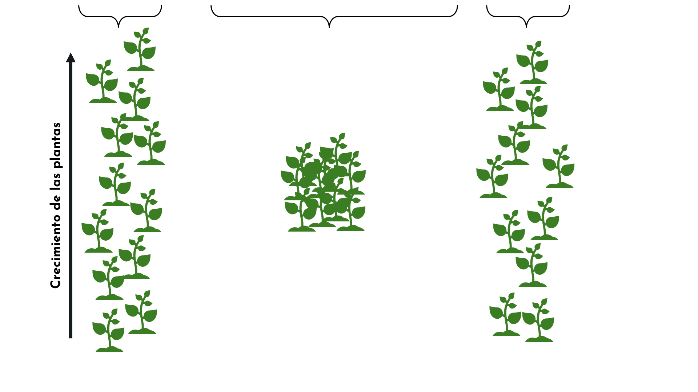
</center>


---
class: animated, fadeIn

## Cómo se calcula el ANOVA de dos vías?

.pull-left[

Calcular todas las medias:
- Media global ($\bar{G}$): media de todas las observaciones.

- Medias marginales de los factores:

  - $\bar{A}_i$ → media de cada nivel del factor A.

  - $\bar{B}_j$ → media de cada nivel del factor B.

  - Medias de celda ($\bar{AB}_{ij}$): media de cada combinación de niveles de A × B.
]

.pull-right[
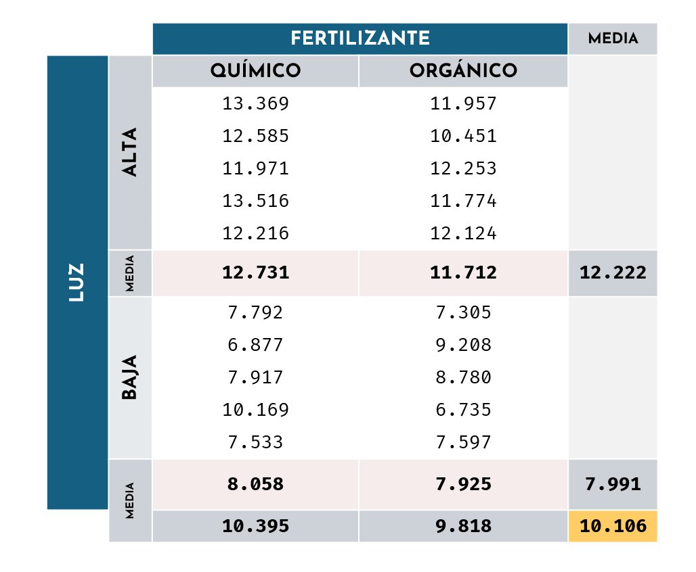
]

---
class: animated, fadeIn

## Cómo se calcula el ANOVA de dos vías?

.pull-left[

Suma de cuadrados totales


$SS_{total}=\sum\sum\sum(x_{mij}-\bar{G})^2=$
$(13.37-10.11)^2+(12.58-10.11)^2+...$
$...+(6.74-10.11)^+(7.6-10.11)^2=106.63$

```{r echo = F, eval = F}
library(dplyr)

# Filtramos el escenario
datos_luz <- datos %>%
  filter(Escenario == "Solo efecto de la luz")

# Media general
media_global <- mean(datos_luz$Crecimiento)

# Suma de cuadrados total
SS_tot <- sum((datos_luz$Crecimiento - media_global)^2)

SS_tot

```

<br>
Grados de libertad:

$$
df_{total}=n\times p \times q-1=
5\times2\times2-1
=19
$$
donde:
- $n$: total de observaciones (plantas)
- $p$: número de grupos en el factor 1 (fertilizante)
- $q$: número de grupos en el factor 2 (luz)

]

.pull-right[

]
 
---
class: animated, fadeIn


## Cómo se calcula el ANOVA de dos vías?


.pull-left[

Suma de cuadrados totales


$SS_{total}=\sum\sum\sum(x_{mij}-\bar{G})^2=$
$(13.37-10.11)^2+(12.58-10.11)^2+...$
$...+(6.74-10.11)^+(7.6-10.11)^2=106.63$

```{r echo = F, eval = F}
library(dplyr)

# Filtramos el escenario
datos_luz <- datos %>%
  filter(Escenario == "Solo efecto de la luz")

# Media general
media_global <- mean(datos_luz$Crecimiento)

# Suma de cuadrados total
SS_tot <- sum((datos_luz$Crecimiento - media_global)^2)

SS_tot

```

<br>
Grados de libertad:

$$
df_{total}=n\times p \times q-1=
5\times2\times2-1
=19
$$
donde:
- $n$: total de observaciones (plantas)
- $p$: número de grupos en el factor 1 (fertilizante)
- $q$: número de grupos en el factor 2 (luz)

**Varianza total**:

$\sigma^2_{total}=\frac{SS_{total}}{df_{total}}=\frac{106.63}{19}=5.612$

]

.pull-right[

]

---
class: animated, fadeIn


## Cómo se calcula el ANOVA de dos vías?


.pull-left[

Suma de cuadrados entre grupos

$SS_{btw}=n\times\sum\sum(\bar{X}_{ij}-\bar{G})^2=$

$5\times((12.731-10.10)^2)+(11.71-10.10)^2)+$
$(8.058-10.10)^2)+(7.925-10.10)^2)=92.12$

```{r echo = F, eval =F}
library(dplyr)

# Filtrar escenario
datos_luz <- datos %>%
  filter(Escenario == "Solo efecto de la luz")

# Calcular media general
media_global <- mean(datos_luz$Crecimiento)

# Calcular medias por combinación Fertilizante:Luz
medias_grupo <- datos_luz %>%
  group_by(Fertilizante, Luz) %>%
  summarise(media = mean(Crecimiento), .groups = "drop")

# Número de réplicas por combinación
n <- datos_luz %>%
  count(Fertilizante, Luz) %>%
  summarise(n = unique(n)) %>%
  pull()

# Suma de cuadrados entre grupos
SS_btw <- n * sum((medias_grupo$media - media_global)^2)
SS_btw

```

<br>

Grados de libertad:

$df_{btw}=p\times q-1=$
$2\times2-1=3$

]

.pull-right[

]

---
class: animated, fadeIn


## Cómo se calcula el ANOVA de dos vías?

.pull-left[

Suma de cuadrados entre grupos

$SS_{btw}=n\times\sum\sum(\bar{X}_{ij}-\bar{G})^2=$

$5\times((12.731-10.10)^2)+(11.71-10.10)^2)+$
$(8.058-10.10)^2)+(7.925-10.10)^2)=92.12$

```{r echo = F, eval =F}
library(dplyr)

# Filtrar escenario
datos_luz <- datos %>%
  filter(Escenario == "Solo efecto de la luz")

# Calcular media general
media_global <- mean(datos_luz$Crecimiento)

# Calcular medias por combinación Fertilizante:Luz
medias_grupo <- datos_luz %>%
  group_by(Fertilizante, Luz) %>%
  summarise(media = mean(Crecimiento), .groups = "drop")

# Número de réplicas por combinación
n <- datos_luz %>%
  count(Fertilizante, Luz) %>%
  summarise(n = unique(n)) %>%
  pull()

# Suma de cuadrados entre grupos
SS_btw <- n * sum((medias_grupo$media - media_global)^2)
SS_btw

```

<br>

Grados de libertad:

$df_{btw}=p\times q-1=$
$2\times2-1=3$

**Varianza entre**

$\sigma^2_{btw}=\frac{SS_{btw}}{df_{btw}}=\frac{92.12}{3}=30.71$

]

.pull-right[

]

---
class: animated, fadeIn


## Cómo se calcula el ANOVA de dos vías?


.pull-left[

Suma de cuadrados del factor A (fertilizante)


$SS_{A}=n\times q\times \sum(\bar{A}_i-\bar{G})^2=$

$5 \times 2\times((10.39-10.11)^2+(9.82-10.11)^2)=1.659$

```{r echo =F , eval = F}

library(dplyr)

# Filtrar escenario
datos_luz <- datos %>%
  filter(Escenario == "Solo efecto de la luz")

# Media global
media_global <- mean(datos_luz$Crecimiento)

# Medias por Fertilizante (factor A)
medias_A <- datos_luz %>%
  group_by(Fertilizante) %>%
  summarise(media = mean(Crecimiento), .groups = "drop")

# Número de réplicas por combinación de factores (A×B)
n <- datos_luz %>%
  count(Fertilizante, Luz) %>%
  summarise(n = unique(n)) %>%
  pull()

# Número de niveles del otro factor (B = Luz)
q <- datos_luz %>%
  summarise(q = n_distinct(Luz)) %>%
  pull()

# Suma de cuadrados del factor A
SS_A <- n * q * sum((medias_A$media - media_global)^2)
SS_A


```

<br>

Grados de libertad

$df_{A}=p-1=2-1=1$

]

.pull-right[

]

---
class: animated, fadeIn


## Cómo se calcula el ANOVA de dos vías?

.pull-left[

Suma de cuadrados del factor A (fertilizante)

$SS_{A}=n\times q\times \sum(\bar{A}_i-\bar{G})^2=$

$5 \times 2\times((10.39-10.11)^2+(9.82-10.11)^2)=1.659$

```{r echo =F , eval = F}

library(dplyr)

# Filtrar escenario
datos_luz <- datos %>%
  filter(Escenario == "Solo efecto de la luz")

# Media global
media_global <- mean(datos_luz$Crecimiento)

# Medias por Fertilizante (factor A)
medias_A <- datos_luz %>%
  group_by(Fertilizante) %>%
  summarise(media = mean(Crecimiento), .groups = "drop")

# Número de réplicas por combinación de factores (A×B)
n <- datos_luz %>%
  count(Fertilizante, Luz) %>%
  summarise(n = unique(n)) %>%
  pull()

# Número de niveles del otro factor (B = Luz)
q <- datos_luz %>%
  summarise(q = n_distinct(Luz)) %>%
  pull()

# Suma de cuadrados del factor A
SS_A <- n * q * sum((medias_A$media - media_global)^2)
SS_A


```

<br>

Grados de libertad

$df_{A}=p-1=2-1=1$

**Varianza del factor A (fertilizante)**

$\sigma^2_{A}=\frac{SS_A}{df_A}=\frac{1.659}{1}=1.659$

]

.pull-right[

]


---
class: animated, fadeIn


## Cómo se calcula el ANOVA de dos vías?

.pull-left[

Suma de cuadrados del factor B (luz)

$SS_{B}=n\times q\times \sum(\bar{B}_i-\bar{G})^2=$

$5 \times 2\times((12.22-10.11)^2+(7.99-10.11)^2)=89.465$

```{r echo =F , eval = F}

library(dplyr)

# Filtramos el escenario
datos_luz <- datos %>%
  filter(Escenario == "Solo efecto de la luz")

# Media global
media_global <- mean(datos_luz$Crecimiento)

# Medias por nivel de Luz
medias_B <- datos_luz %>%
  group_by(Luz) %>%
  summarise(media = mean(Crecimiento), .groups = "drop")

# Número de réplicas por combinación A×B
n <- datos_luz %>%
  count(Fertilizante, Luz) %>%
  summarise(n = unique(n)) %>%
  pull()

# Número de niveles del otro factor (p = Fertilizante)
p <- datos_luz %>%
  summarise(p = n_distinct(Fertilizante)) %>%
  pull()

# Suma de cuadrados del factor B (Luz)
SS_B <- n * p * sum((medias_B$media - media_global)^2)
SS_B


```

<br>

Grados de libertad

$df_{B}=p-1=2-1=1$

]

.pull-right[

]

---
class: animated, fadeIn


## Cómo se calcula el ANOVA de dos vías?

.pull-left[

Suma de cuadrados del factor B (luz)

$SS_{B}=n\times q\times \sum(\bar{B}_i-\bar{G})^2=$

$5 \times 2\times((12.22-10.11)^2+(7.99-10.11)^2)=89.481$

```{r echo =F , eval = F}

library(dplyr)

# Filtramos el escenario
datos_luz <- datos %>%
  filter(Escenario == "Solo efecto de la luz")

# Media global
media_global <- mean(datos_luz$Crecimiento)

# Medias por nivel de Luz
medias_B <- datos_luz %>%
  group_by(Luz) %>%
  summarise(media = mean(Crecimiento), .groups = "drop")

# Número de réplicas por combinación A×B
n <- datos_luz %>%
  count(Fertilizante, Luz) %>%
  summarise(n = unique(n)) %>%
  pull()

# Número de niveles del otro factor (p = Fertilizante)
p <- datos_luz %>%
  summarise(p = n_distinct(Fertilizante)) %>%
  pull()

# Suma de cuadrados del factor B (Luz)
SS_B <- n * p * sum((medias_B$media - media_global)^2)
SS_B


```

<br>

Grados de libertad

$df_{B}=p-1=2-1=1$

**Varianza del factor B (luz)**

$\sigma^2_{B}=\frac{SS_B}{df_B}=\frac{89.481}{1}=89.481$

]

.pull-right[

]

---
class: animated, fadeIn

## Cómo se calcula el ANOVA de dos vías?


.pull-left[

Suma de cuadrados de la interacción

$SS_{AB}=SS_{btw}-SS_{A}-SS_{B}=$

$= 92.123 - 1.659 - 89.481 = 0.983$

<br>

Grados de libertad:

$df_{AB}=(p-1)\times(q-1)=$

$df_{AB}=1\times1=1$


]

.pull-right[

]


---
class: animated, fadeIn

## Cómo se calcula el ANOVA de dos vías?


.pull-left[

Suma de cuadrados de la interacción

$SS_{AB}=SS_{btw}-SS_{A}-SS_{B}=$

$= 92.123 - 1.659 - 89.481 = 0.983$

<br>

Grados de libertad:

$df_{AB}=(p-1)\times(q-1)=$

$df_{AB}=1\times1=1$

**Varianza**

$\sigma^2_{AB}=\frac{SS_{AB}}{df_{AB}}=\frac{0.983}{1}=0.983$

]

.pull-right[

]


---
class: animated, fadeIn

## Cómo se calcula el ANOVA de dos vías?


.pull-left[

Suma de cuadrados del error

$SS_{error}=\sum\sum\sum(x_{mij}-\bar{AB}_{ij})^2$

$= (13.37-12.73)^2+(11.96-11.71)^2+...$
$...+(7.79-8.058)^2+(7.30-7.925)^2=14.51$

```{r eval=F, echo = F}

library(dplyr)

# Filtramos el escenario de interés
datos_error <- datos %>%
  filter(Escenario == "Solo efecto de la luz")

# Calculamos la media por combinación (A × B)
medias_AB <- datos_error %>%
  group_by(Fertilizante, Luz) %>%
  summarise(media_AB = mean(Crecimiento), .groups = "drop")

# Añadimos esa media al dataset original
datos_error <- left_join(datos_error, medias_AB, by = c("Fertilizante", "Luz"))

# Calculamos el SS_error
SS_error <- sum((datos_error$Crecimiento - datos_error$media_AB)^2)
SS_error


```

<br>

Grados de libertad:

$df_{error}=(n-1)\times p \times q=$

$4\times2\times2=16$


]

.pull-right[

]

---
class: animated, fadeIn

## Cómo se calcula el ANOVA de dos vías?


.pull-left[

Suma de cuadrados del error

$SS_{error}=\sum\sum\sum(x_{mij}-\bar{AB}_{ij})^2$

$= (13.37-12.73)^2+(11.96-11.71)^2+...$
$...+(7.79-8.058)^2+(7.30-7.925)^2=14.51$

```{r eval=F, echo = F}

library(dplyr)

# Filtramos el escenario de interés
datos_error <- datos %>%
  filter(Escenario == "Solo efecto de la luz")

# Calculamos la media por combinación (A × B)
medias_AB <- datos_error %>%
  group_by(Fertilizante, Luz) %>%
  summarise(media_AB = mean(Crecimiento), .groups = "drop")

# Añadimos esa media al dataset original
datos_error <- left_join(datos_error, medias_AB, by = c("Fertilizante", "Luz"))

# Calculamos el SS_error
SS_error <- sum((datos_error$Crecimiento - datos_error$media_AB)^2)
SS_error


```

<br>

Grados de libertad:

$df_{error}=(n-1)\times p \times q=$

$4\times2\times2=16$

**Varianza**

$\sigma^2_{error}=\frac{SS_{error}}{df_{error}}=14.51/16=0.907$

]

.pull-right[

]

---
class: animated, fadeIn

# Cálculo de la F

Se obtienen dividiendo cada varianza (A, B y la interacción) por la varianza del error:

.pull-left[
Cálculo de F:

$F_A = \frac{\sigma^2_A}{\sigma^2_{error}}=\frac{1.659}{0.907}=1.829$
<br>
<br>
<br>
$F_B = \frac{\sigma^2_B}{\sigma^2_{error}}=\frac{89.481}{0.907}=98.656$
<br>
<br>
<br>
$F_{AB} = \frac{\sigma^2_{AB}}{\sigma^2_{error}}=\frac{0.983}{0.907}=1.084$


]

.pull-right[

Grados de libertad factor A:
- $df_{A}$=1
- $df_{error}$=16

Grados de libertad factor B:
- $df_{B}$=1
- $df_{error}$=16

Grados de libertad interacción:
- $df_{B}$=1
- $df_{error}$=16

]
---
class: animated, fadeIn

## Tabla de la distribución de F

```{r echo = F}
library(dplyr)
library(knitr)
library(kableExtra)

# --- Parámetros ---
df1_vals <- 1:15      # grados de libertad del numerador
df2_vals <- 1:21     # grados de libertad del denominador
alpha <- 0.05        # nivel de significación (cola superior)

# --- Calcular valores críticos F ---
F_table <- sapply(df1_vals, function(df1) qf(1 - alpha, df1 = df1, df2 = df2_vals))

# --- Convertir en data frame ---
F_table_df <- data.frame(df2 = df2_vals, round(F_table, 4))
colnames(F_table_df) <- c("df2", paste0("gl1 = ", df1_vals))
rownames(F_table_df) <- paste0("gl2 = ",rownames(F_table_df))
F_table_df$df2<-NULL

# --- Mostrar tabla ---
kable(F_table_df, row.names = TRUE, align = "c",
      caption = "Valores críticos de la distribución F (cola superior, α = 0.05)") %>%
  kable_styling(
    full_width = FALSE,
    position = "center",
    font_size = 9,  # letra pequeña
    bootstrap_options = c("condensed")
  ) %>%
  row_spec(0, bold = TRUE, background = "#e6f2ff") %>%
  column_spec(1, bold = TRUE, background = "#e6f2ff")


```


---

## ANOVA de dos vías en `R`

```{r}
modelo <- aov(Crecimiento ~ Fertilizante * Luz, data = datos_luz)
summary(modelo)

```

- **Fertilizante**: efecto principal del tipo de fertilizante.

- **Luz**: efecto principal del nivel de luz.

- **Fertilizante:Luz**: interacción entre ambos factores.

- **Residuals**: variabilidad no explicada por el modelo, incluye diferencias individuales o ruido experimental.


---

class: animated, fadeIn

## ANOVA de dos vías en `R`

.pull-left[
```{r eval=F}
ggplot(datos_luz, aes(x = Luz, y = Crecimiento, color = Fertilizante, group = Fertilizante)) +
  stat_summary(fun = mean, geom = "point", size = 3) +
  stat_summary(fun = mean, geom = "line", linewidth = 1) +
  stat_summary(fun.data = mean_se, geom = "errorbar", width = 0.1) +
  labs(
    title = "Efecto del fertilizante y la luz sobre el crecimiento",
    y = "Crecimiento medio",
    x = "Nivel de luz"
  ) +
  ggthemes::theme_base(base_size = 13) +
  theme(panel.grid=element_blank(),
        axis.text=element_text(color="black"),
        panel.background = element_rect(fill = "white"))
  
```
]

.pull-right[
```{r echo = F}
ggplot(datos_luz, aes(x = Luz, y = Crecimiento, color = Fertilizante, group = Fertilizante)) +
  stat_summary(fun = mean, geom = "point", size = 3) +
  stat_summary(fun = mean, geom = "line", linewidth = 1) +
  stat_summary(fun.data = mean_se, geom = "errorbar", width = 0.1) +
  labs(
    title = "Efecto del fertilizante y la luz sobre el crecimiento",
    y = "Crecimiento medio",
    x = "Nivel de luz"
  ) +
  ggthemes::theme_base(base_size = 13) +
  theme(panel.grid=element_blank(),
        axis.text=element_text(color="black"),
        panel.background = element_rect(fill = "white"))
  
```
]

  
---
class: animated, fadeIn

## ANOVA de dos vías en `R`

.pull-left[

#### Comprobar los supuestos

**Normalidad**
```{r}
shapiro.test(resid(modelo))

modelo <- aov(Crecimiento ~ Fertilizante * Luz, data = datos_luz)
```
]

.pull-right[
```{r fig.height=5, fig.width=5}
# QQ-plot
qqnorm(resid(modelo))
qqline(resid(modelo), col = "red", lwd = 2)
```
]

---
class: animated, fadeIn

## ANOVA de dos vías en `R`

#### Comprobar los supuestos

**Homogeneidad de varianzas**

```{r}
library(car)
leveneTest(Crecimiento ~ Fertilizante * Luz, data = datos_luz)
```  

---
class: animated, fadeIn

### Conecta resultado de ANOVA con su tabla

.pull-left[

```{r echo = F, size='small'}
library(dplyr)

# Dividimos el dataset por escenario
escenarios <- split(datos, datos$Escenario)

# Función para hacer ANOVA de dos vías y resumir resultados
run_anova <- function(df) {
  modelo <- aov(Crecimiento ~ Fertilizante * Luz, data = df)
  summary(modelo)
}

# Aplicamos a cada escenario
resultados <- lapply(escenarios, run_anova)

# Mostramos resultados
names(resultados) <- c("Caso1", "Caso2", "Caso3", "Caso4")

resultados[1:2]

#graficos de antes
```

]
---

class: animated, fadeIn

### Conecta resultado de ANOVA con su tabla

.pull-left[

```{r echo = F, size='small'}
library(dplyr)

# Dividimos el dataset por escenario
escenarios <- split(datos, datos$Escenario)

# Función para hacer ANOVA de dos vías y resumir resultados
run_anova <- function(df) {
  modelo <- aov(Crecimiento ~ Fertilizante * Luz, data = df)
  summary(modelo)
}

# Aplicamos a cada escenario
resultados <- lapply(escenarios, run_anova)

# Mostramos resultados
names(resultados) <- c("Caso1", "Caso2", "Caso3", "Caso4")

resultados[3:4]

#graficos de antes
```

]

---
class: animated, fadeIn

## Casos

<center>

```{r echo = F, fig.width=10}
library(ggplot2)
library(dplyr)

set.seed(123)
rep <- 5  # réplicas por combinación

# ---- 1. Sin efecto de ningún factor ----
data1 <- expand.grid(
  Fertilizante = c("Orgánico", "Químico"),
  Luz = c("Baja", "Alta"),
  Rep = 1:rep
)
data1$Crecimiento <- rnorm(nrow(data1), mean = 10, sd = 1)
data1$Escenario <- "Sin efecto de ningún factor"

# ---- 2. Solo efecto del fertilizante ----
data2 <- expand.grid(
  Fertilizante = c("Orgánico", "Químico"),
  Luz = c("Baja", "Alta"),
  Rep = 1:rep
)
data2$Crecimiento <- with(data2,
  ifelse(Fertilizante == "Orgánico", rnorm(rep * 2, mean = 12, sd = 1),
                                rnorm(rep * 2, mean = 8, sd = 1)))
data2$Escenario <- "Solo efecto del fertilizante"

# ---- 3. Solo efecto de la luz ----
data3 <- expand.grid(
  Fertilizante = c("Orgánico", "Químico"),
  Luz = c("Baja", "Alta"),
  Rep = 1:rep
)
data3$Crecimiento <- with(data3,
  ifelse(Luz == "Baja", rnorm(rep * 2, mean = 8, sd = 1),
                      rnorm(rep * 2, mean = 12, sd = 1)))
data3$Escenario <- "Solo efecto de la luz"

# ---- 4. Con interacción significativa ----
data4 <- expand.grid(
  Fertilizante = c("Orgánico", "Químico"),
  Luz = c("Baja", "Alta"),
  Rep = 1:rep
)
data4$Crecimiento <- with(data4,
  ifelse(Fertilizante == "Orgánico" & Luz == "Baja", rnorm(rep, 12, 1),
  ifelse(Fertilizante == "Orgánico" & Luz == "Alta", rnorm(rep, 9, 1),
  ifelse(Fertilizante == "Químico" & Luz == "Baja", rnorm(rep, 10, 1),
                                rnorm(rep, 13, 1)))))
data4$Escenario <- "Con interacción significativa"

# ---- Unir los datasets ----
datos <- bind_rows(data4, data1, data3, data2)

# ---- Graficar ----
ggplot(datos, aes(x = Luz, y = Crecimiento, color = Fertilizante, group = Fertilizante)) +
  stat_summary(fun = mean, geom = "point", size = 3) +
  stat_summary(fun = mean, geom = "line", linewidth = 1) +
  stat_summary(fun.data = mean_se, geom = "errorbar", width = 0.1) + 
  facet_wrap(~Escenario, scales = "free_y", ncol = 2) +
  theme_minimal(base_size = 15) +
  labs(
    y = "Crecimiento medio",
    x = "Nivel de luz",
    color = "Fertilizante"
  )  +
  scale_color_manual(values=c("cadetblue4", "firebrick3")) + 
  ggthemes::theme_base(base_size = 18) + 
  theme(
    plot.title = element_text(face = "bold", size = 18, hjust = 0.5),
    strip.text = element_text(size = 13, face = "bold"),
    legend.position = "bottom", 
    panel.grid=element_blank(),
        axis.text=element_text(color="black"),
        panel.background = element_rect(fill = "white") 
  )+
      coord_cartesian(ylim=c(7.5,14))

```


---
class: animated, fadeIn

## Coeficiente de determinacion de ANOVA (R²)


- Mide qué proporción de la variabilidad total de la variable dependiente es explicada por los factores incluidos en el modelo.
- Es una medida de bondad de ajuste del modelo ANOVA.
- Va de 0 a 1 (o de 0 a 100%)

--

En cualquier ANOVA, la variabilidad se puede descomponer como:

<center>

$SS_{total} = SS_{modelo} + SS_{error}$

</center>

- $SS_{total}$: suma de cuadrados total
- $SS_{modelo}$: suma de cuadrados explicada por los factores (efectos principales + interacción, si la hay)
- $SS_{error}$: suma de cuadrados de los residuos (error)

--

<center>

$R^2=\frac{SS_{modelo}}{SS_{total}} = 1 - \frac{SS_{error}}{SS_{total}}$

---
class: animated, fadeIn

## Coeficiente de determinacion de ANOVA (R²)

.pull-left[
En ANOVA de una vía:

$SS_{total} = SS_{entre} + SS_{dentro}$

$R^2=\frac{SS_{entre}}{SS_{total}} = 1 - \frac{SS_{dentro}}{SS_{total}}$

> ¿Qué porcentaje de la varianza total explica el factor A?
]

--

.pull-right[
En ANOVA de dos vías:

$SS_{total} = SS_{A} + SS_{B} + SS_{AB} + SS_{error}$

$R^2=\frac{SS_{A}+SS_{B}+SS_{AB}}{SS_{total}} = 1 - \frac{SS_{error}}{SS_{total}}$

> ¿Qué porcentaje de la varianza total explican ambos factores y su interacción?
]

--

| Tipo de ANOVA | Descomposición                                     | Componentes              | R²                                            |
| ------------- | -------------------------------------------------- | ------------------------ | --------------------------------------------- |
| **Una vía**   | $SS_{total} = SS_{entre} + SS_{dentro}$                   | 1 factor                 | $R^2 = SS_{entre} / SS_{total}$                      |
| **Dos vías**  | $SS_{total} = SS_A + SS_B + SS_{A:B} + SS_{error}$ | 2 factores + interacción | $R^2 = (SS_A + SS_B + SS_{A:B}) / SS_{total}$ |


---
class: animated, fadeIn

## Coeficiente de determinacion de ANOVA (R²)
 
 | Valor de ($R^2$) | Significado                                                    |
| -------------- | -------------------------------------------------------------- |
| **0**          | El modelo **no explica nada** de la variabilidad de los datos. |
| **1**          | El modelo **explica toda** la variabilidad observada.          |
| **0.3–0.6**    | El modelo explica **una parte moderada** de la variabilidad.   |
| **> 0.7**      | El modelo tiene **buena capacidad explicativa**.               |

---
class: animated, fadeIn

## Coeficiente de determinacion de ANOVA (R²) en `R`

La función `lm()`: ajusta una recta que explica una variable dependiente (respuesta) en función de una o más variables independientes (factores).

> En ANOVA, `lm()` estima efectos medios de los factores y de sus interacciones

```{r eval = F}
summary(lm(Crecimiento ~ Fertilizante * Luz, data = datos_luz))
```

--

<br>

> También lo podríamos calcular directamente con SS_{AB}, SS_{A}, SS_{B} y SS_{total} que hemos calculado previamente.

```{r}
1.659 + 89.481 + 0.983 # SS modelo (SS dentro): SS_A + SS_B + SS_AB
92.123/106.63 ## SS_modelo / SS_total
```


---
class: animated, fadeIn

## Coeficiente de determinacion de ANOVA (R²) en `R`


```{r echo = F}
summary(lm(Crecimiento ~ Fertilizante * Luz, data = datos_luz))
```

---
class: animated, fadeIn

## _Batch effect_

- Variación sistemática no biológica entre grupos de muestras que fueron procesadas en momentos o condiciones distintas.

Por ejemplo:

- Las plantas del fertilizante orgánico se midieron en un día distinto que las del químico.

- Las muestras de RNA-seq fueron secuenciadas en distintos "batches".

- Se usaron distintos experimentadores o cámaras de luz.

Este factor no es de interés biológico, pero puede introducir ruido o confusión si no se controla.

---
class: animated, fadeIn

## _Batch effect_

```{r echo = F}
datos_luz$Lote <- rep(c("Lote1", "Lote2"), each = nrow(datos_luz)/2)

head(datos_luz,20)
```


---
class: animated, fadeIn

## Cómo controlamos por el _batch effect_ en ANOVA

```{r}
modelo_batch <- aov(Crecimiento ~ Fertilizante * Luz + Lote, data = datos)
summary(modelo_batch)
```

- `Lote` añadido como **covariable**

- Los efectos de `Fertilizante` y `Luz` se estiman independientemente de las diferencias entre lotes.

  - Si el efecto de Lote es significativo → el batch effect está influyendo en el crecimiento
  - Si no lo es → las diferencias entre lotes no tienen un impacto relevante


---
class: animated, fadeIn

## Cómo controlamos por el _batch effect_ en ANOVA

Verificación visual de si hay efecto:

```{r echo = F, fig.align='center'}
library(ggplot2)

ggplot(datos_luz, aes(x = Lote, y = Crecimiento, fill = Lote)) +
  geom_violin(trim = FALSE, alpha = 0.7, show.legend = F) +
  geom_boxplot(width = 0.1, color = "black", alpha = 0.5, show.legend = F) +
  labs(title = "Efecto de lote (batch effect) sobre el crecimiento") +
  ggthemes::theme_base(base_size = 13) +
  scale_fill_brewer(palette="Set2") + 
  theme(panel.grid=element_blank(),
        axis.text=element_text(color="black"),
        panel.background = element_rect(fill = "white"))
  
```


---
class: animated, fadeIn

## Cómo controlamos por el _batch effect_ en ANOVA

```{r}
anova(aov(Crecimiento ~ Fertilizante * Luz, data = datos_luz),
      aov(Crecimiento ~ Fertilizante * Luz + Lote, data = datos_luz))
```


- Añadir el batch efecto  no implica ningun cambio (el modelo no mejora)

--

- El RSS (_Residual Sum of Squares_batch_) mide la variación no explicada por el modelo:
  - Cuanto menor sea el RSS → mejor explica el modelo la variación de los datos
  - Pero cuidado: añadir más variables siempre reduce el RSS, aunque no sean realmente relevantes

- < 0.05 → el modelo más complejo (con más términos) mejora significativamente el ajuste

- \> 0.05 → la mejora del ajuste no es significativa → conviene quedarse con el modelo más simple (principio de parsimonia)

---
class: animated, fadeIn

## Contacto

<div style="margin-top: 20vh; text-align:center;">

| Marta Coronado Zamora | David Castellano | 
|:-:|:-:|
| <a href="mailto:marta.coronado@uab.cat"><i class="fa fa-paper-plane fa-fw"></i> marta.coronado@uab.cat</a> | <a href="mailto:david.castellano@uab.cat"><i class="fa fa-paper-plane fa-fw"></i>&nbsp; david.castellano@uab.cat</a> | 
| <a href="https://bsky.app/profile/geneticament.bsky.social"><i class="fab fa-bluesky fa-fw"></i>&nbsp; @geneticament.bsky.social</a> |                 <a href="https://bsky.app/profile/castellanoed.bsky.social"><i class="fab fa-bluesky fa-fw"></i>&nbsp; @castellanoed.bsky.social</a> |
| <a href="https://www.uab.cat"><i class="fa fa-map-marker fa-fw"></i>&nbsp; Universitat Autònoma de Barcelona</a> |    <a href="https://gutengroup.mcb.arizona.edu/"> <i class="fa fa-map-marker fa-fw"></i>&nbsp; University of Arizona</a> |

