```{r setup, include=FALSE}
options(htmltools.dir.version = FALSE)
#knitr::include_graphics()
knitr::opts_chunk$set(
  cache = TRUE,
  message = FALSE, 
  warning = FALSE,
  hiline = TRUE,
  fig.retina = 5
)
library(ggplot2)
library(readr)
library(knitr)
#pagedown::chrome_print(".html")
```

```{r xaringan-themer, include=FALSE, warning=FALSE}
library(xaringanthemer)
style_mono_accent(
  base_color = "#1c5253", link_color =  "#DE1144", code_inline_color = "#DE1144",
  header_font_google = google_font("Josefin Sans"),
  text_font_google   = google_font("Montserrat", "400", "400i"),
  code_font_google   = google_font("Roboto Mono")
)
```

```{r xaringanExtra-clipboard, echo=FALSE}
library(xaringanExtra)
htmltools::tagList(
  xaringanExtra::use_clipboard(
    button_text = "<i class=\"fa fa-clipboard\"></i>",
    success_text = "<i class=\"fa fa-check\" style=\"color: #90BE6D\"></i>",
  ),
  rmarkdown::html_dependency_font_awesome()
)
```


class: animated, fadeIn
# Outline

#### **Correlación**

- Qué es un análisis de correlación?
- Tipos más importantes (Pearson, Spearman, Kendall)
- Diferencias entre correlación y causalidad
- Correlación vs. regresión

<style>
  .title-slide {
    background-image: url('img/1.png');
    background-size: 100%;
  }
</style>

---
class: animated, fadeIn

# Pruebas estadísticas
<center>


---
class: animated, fadeIn

# ¿Qué es un análisis de correlación?

- Prueba estadística que permite medir la relación entre **dos variables cuantitativas**

--

```{r echo = F, fig.align='center'}

# Cargar librerías
library(ggplot2)

library(DT)
datatable(
  iris,
  options = list(
    pageLength = 10,
    scrollX = TRUE
  ),
  class = 'compact'  # hace la tabla más pequeña
) %>%
  formatStyle(
    columns = names(iris),
    fontSize = '80%'   # tamaño de fuente más pequeño
  )
```

  
---
class: animated, fadeIn

# ¿Qué es un análisis de correlación?

- Prueba estadística que permite medir la relación entre dos variables cuantitativas

```{r echo = F, fig.align='center', fig.width=7, fig.height=6}

# Cargar librerías
library(ggplot2)

# Representar gráficamente la relación
ggplot(iris, aes(x = Sepal.Length, y = Sepal.Width)) +
  geom_point(size = 3, alpha = 0.7) +
  geom_smooth(method = "lm", se = FALSE, color = "black") +
  theme_minimal(base_size = 16) +
  labs(
    title = "Correlación entre largo y ancho del sépalo",
    x = "Largo del sépalo (cm)",
    y = "Ancho del sépalo (cm)"
  )+
    ggthemes::theme_base(base_size = 13) +
    theme(
      panel.grid = element_blank(),
      axis.title = element_blank(),
      axis.text = element_text(color = "black"),
      panel.background = element_rect(fill = "white"))
```

--

> ¿Qué es cada punto?

---
class: animated, fadeIn

# ¿Qué es un análisis de correlación?

- Prueba estadística que permite medir la relación entre dos variables cuantitativas

```{r echo = F, fig.align='center', fig.width=7, fig.height=6}

# Cargar librerías
library(ggplot2)

# Representar gráficamente la relación
ggplot(iris[iris$Species=="setosa",], aes(x = Sepal.Length, y = Sepal.Width)) +
  geom_point(size = 3, alpha = 0.7) +
  geom_smooth(method = "lm", se = FALSE, color = "black") +
  theme_minimal(base_size = 16) +
  labs(
    title = "Correlación entre largo y ancho del sépalo en setosa",
    x = "Largo del sépalo (cm)",
    y = "Ancho del sépalo (cm)"
  )+
    ggthemes::theme_base(base_size = 13) +
    theme(
      panel.grid = element_blank(),
      axis.title = element_blank(),
      axis.text = element_text(color = "black"),
      panel.background = element_rect(fill = "white"))
```


---
class: animated, fadeIn

## Análisis de correlación

Nos interesa conocer:

1. Lo **fuerte** que es la correlación
2. La **dirección** de la correlación

--

Ambas medidas se veran reflejadas en el **coeficiente de correlación** (`r`): de -1 a 1

--

#### Fuerza de la correlación según el valor de *r*

| Valor de `r`        | Interpretación        |
|---------------------:|:----------------------|
| `r` < 0.1           | No correlación        |
| 0.1 < `r` ≤ 0.3     | Correlación baja      |
| 0.3 < `r` ≤ 0.5     | Correlación media     |
| 0.5 < `r` ≤ 0.7     | Correlación alta      |
| 0.7 < `r` ≤ 1.0     | Correlación muy alta  |

---
class: animated, fadeIn

#### Ejemplos

```{r echo = F, fig.align='center', fig.height=8, fig.width=12}
library(ggplot2)
library(ggthemes)
library(patchwork)

set.seed(123)

# Define correlation values: positive and negative
r_values <- c(0.9, 0.4, 0.01,
              -0.01, -0.4, -0.9)
names(r_values) <- c("Muy alta (r=0.9)", "Media (r=0.5)", "Baja (r=0.1)",
                     "Baja (r=-0.1)", "Media (r=-0.5)", "Muy alta (r=-0.9)")

# Function to generate data with controlled correlation
make_data <- function(r, n = 30){
  x <- seq(1, n)
  y <- r * x + (1 - abs(r)) * rnorm(n, sd = 8)
  data.frame(x, y)
}

# Create plots with uniform y-axis limits and show real r
plots <- lapply(names(r_values), function(label){
  r <- r_values[label]
  df <- make_data(r)
  r_real <- cor(df$x, df$y)
  
  ggplot(df, aes(x, y)) +
    geom_point(size = 3, color = "#007C91") +
    geom_smooth(method = "lm", se = FALSE, color = "black") +
    ggthemes::theme_base(base_size = 13) +
    theme(
      panel.grid = element_blank(),
      axis.title = element_blank(),
      axis.text = element_text(color = "black"),
      panel.background = element_rect(fill = "white"),
      plot.title = element_text(hjust = 0.5, face = "bold")
    ) +
    ggtitle(paste0("Correlación ","(r = ", round(r_real, 2), ")"))
  })

# Combine all plots: 2 rows x 3 columns
wrap_plots(plots, ncol = 3)


```

---
class: animated, fadeIn

## Tipos de coeficientes de correlacion

1. R de Pearson

2. R de Spearman

3. R de Kendall

---
class: animated, fadeIn

### Correlación de Pearson

- Medida estadística que cuantifica la relación entre dos variables.

- Se mide la relación lineal entre dos variables cuantitativas.


```{r echo = F, fig.align='center', fig.height=5, fig.width=5}
library(ggplot2)
library(ggthemes)
library(patchwork)

set.seed(123)

# Define correlation values: positive and negative
r_values <- c(0.8)
names(r_values) <- c("Muy alta (r=0.9)")

# Function to generate data with controlled correlation
make_data <- function(r, n = 30){
  x <- seq(1, n)
  y <- r * x + (1 - abs(r)) * rnorm(n, sd = 8)
  data.frame(x, y)
}

# Create plots with uniform y-axis limits and show real r
plots <- lapply(names(r_values), function(label){
  r <- r_values[label]
  df <- make_data(r)
  r_real <- cor(df$x, df$y)
  
  ggplot(df, aes(x, y)) +
    geom_point(size = 3, color = "#007C91") +
    geom_smooth(method = "lm", se = FALSE, color = "black") +
    ggthemes::theme_base(base_size = 13) +
    theme(
      panel.grid = element_blank(),
      axis.title = element_blank(),
      axis.text = element_text(color = "black"),
      panel.background = element_rect(fill = "white"),
      plot.title = element_text(hjust = 0.5, face = "bold")
    ) +
    ggtitle(paste0("Correlación ","(r = ", round(r_real, 2), ")"))
  })

# Combine all plots: 2 rows x 3 columns
wrap_plots(plots, ncol = 1)


```

--

- El coeficiente de correlación de Pearson nos informará de lo **fuerte** que es y la **dirección** de la relación lineal de dos variables

---
class: animated, fadeIn

## Cómo calcular el coeficiente de correlación de Pearson

<center>

$r = \frac{\sum_{i=1}^{n}(x_i - \bar{x})(y_i - \bar{y})}{\sqrt{\sum_{i=1}^{n}(x_i - \bar{x})^2} \, \sqrt{\sum_{i=1}^{n}(y_i - \bar{y})^2}}$

</center>

donde:

- $r$: coeficiente de correlación de Pearson  
- $x_i$: valores individuales de la variable $x$  
- $y_i$: valores individuales de la variable $y$  
- $\bar{x}$: media de la variable $x$  
- $\bar{y}$: media de la variable $y$  


--

- Los valores promedio de cada variable se restan primero de los valores individuales de ambas variables. Luego, se multiplican.

- La expresión del denominador se asegura de que el coeficiente de correlación esté **escalado entre -1 y 1**.


---
class: animated, fadeIn

## Hipótesis

- Queremos saber si hay una **correlación en la población** (aunque el test lo hacemos en la muestra). 

--

- Comprobamos si el **coeficiente de correlación de la muestra** es **significativamente distinto de 0**.

--

.pull-left[
$H_0$: el coeficiente de correlación no difiere de 0: no hay relación lineal
]

.pull-right[
$H_1$: el coeficiente de correlación sí difiere de 0: sí hay relación lineal
]

--

<br>
<br>

> **Recuerda**: en las pruebas de hipótesis, siempre comprobamos si la hipótesis nula se rechaza o no

---
class: animated, fadeIn

### Ejemplo: correlación entre la anchura y longitud del sépalo


.pull-left[
```{r echo = F, fig.align='center', fig.width=7, fig.height=6}

# Cargar librerías
library(ggplot2)

# Representar gráficamente la relación
ggplot(iris[iris$Species=="setosa",], aes(x = Sepal.Length, y = Sepal.Width)) +
  geom_point(size = 3, alpha = 0.7) +
  geom_smooth(method = "lm", se = FALSE, color = "black") +
  theme_minimal(base_size = 16) +
  labs(
    title = "Correlación entre largo y ancho del sépalo en setosa",
    x = "Largo del sépalo (cm)",
    y = "Ancho del sépalo (cm)"
  )+
    ggthemes::theme_base(base_size = 13) +
    theme(
      panel.grid = element_blank(),
      axis.title = element_blank(),
      axis.text = element_text(color = "black"),
      panel.background = element_rect(fill = "white"))
```
]

--

.pull-right[
- $H_0$: no hay una correlación entre la anchura y la longitud del sépalo: `r` es 0

- $H_1$: sí hay una correlación entre la anchura y la longitud del sépalo: `r` no es 0

]


---
class: animated, fadeIn

### Ejemplo: correlación entre la anchura y longitud del sépalo


.pull-left[
```{r echo = F, fig.align='center', fig.width=7, fig.height=6}

# Cargar librerías
library(ggplot2)

# Representar gráficamente la relación
ggplot(iris[iris$Species=="setosa",], aes(x = Sepal.Length, y = Sepal.Width)) +
  geom_point(size = 3, alpha = 0.7) +
  geom_smooth(method = "lm", se = FALSE, color = "black") +
  theme_minimal(base_size = 16) +
  labs(
    title = "Correlación entre largo y ancho del sépalo en setosa",
    x = "Largo del sépalo (cm)",
    y = "Ancho del sépalo (cm)"
  )+
    ggthemes::theme_base(base_size = 13) +
    theme(
      panel.grid = element_blank(),
      axis.title = element_blank(),
      axis.text = element_text(color = "black"),
      panel.background = element_rect(fill = "white"))
```
]

.pull-right[
- $H_0$: no hay una correlación entre la anchura y la longitud del sépalo: `r` es 0

- $H_1$: sí hay una correlación entre la anchura y la longitud del sépalo: `r` no es 0

**Test del coeficiente de correlación**

Para comprobar si el coeficiente de correlación es diferente de 0 utilizaremos un **t-test**:

$$
t = \frac{r \sqrt{n-2}}{\sqrt{1-r^2}}
$$

- **r:** coeficiente de correlación de la muestra  
- **n:** tamaño de la muestra  
- El **p-valor** se calculará usando la distribución `t` con $n-2$ grados de libertad

]


---
class: animated, fadeIn

## Consideraciones para el coeficiente de correlación de Pearson: dependen de lo que queramos

- Para calcular el coeficiente de correlación de Pearson necesitamos **dos variables métricas**.  

- El coeficiente indica **la fuerza de la relación lineal**.  
  - Si no hay relación lineal, **el coeficiente no lo refleja**.  

--

<br>

- Para probar si el coeficiente es **significativamente distinto de 0**, ambas variables deben aproximarse a una **distribución normal**.  

- Si la normalidad no se cumple:  
  - La prueba de Pearson no es válida.  
  - Alternativa: **correlación de Spearman** (no paramétrica).

---
class: animated, fadeIn

## Correlación de Pearson en `R`

.pull-left[
```{r}
library(dplyr)

setosa <- filter(iris, Species == "setosa")

shapiro.test(setosa$Sepal.Length)
shapiro.test(setosa$Sepal.Width)

```

]

.pull-right[


```{r echo = F, fig.align='center', fig.width=7, fig.height=6}

# Cargar librerías
library(ggplot2)

# Representar gráficamente la relación
ggplot(iris[iris$Species=="setosa",], aes(x = Sepal.Length, y = Sepal.Width)) +
  geom_point(size = 3, alpha = 0.7) +
  geom_smooth(method = "lm", se = FALSE, color = "black") +
  theme_minimal(base_size = 16) +
  labs(
    title = "Correlación entre largo y ancho del sépalo en setosa",
    x = "Largo del sépalo (cm)",
    y = "Ancho del sépalo (cm)"
  )+
    ggthemes::theme_base(base_size = 13) +
    theme(
      panel.grid = element_blank(),
      axis.title = element_blank(),
      axis.text = element_text(color = "black"),
      panel.background = element_rect(fill = "white"))
```


]


---
class: animated, fadeIn

## Correlación de Pearson en `R`

.pull-left[
```{r}
cor.test(setosa$Sepal.Length, setosa$Sepal.Width,
         method = "pearson",
         alternative  = "two.sided")

```


]

.pull-right[


```{r echo = F, fig.align='center', fig.width=7, fig.height=6}

# Cargar librerías
library(ggplot2)

# Representar gráficamente la relación
ggplot(iris[iris$Species=="setosa",], aes(x = Sepal.Length, y = Sepal.Width)) +
  geom_point(size = 3, alpha = 0.7) +
  geom_smooth(method = "lm", se = FALSE, color = "black") +
  theme_minimal(base_size = 16) +
  labs(
    title = "Correlación entre largo y ancho del sépalo en setosa",
    x = "Largo del sépalo (cm)",
    y = "Ancho del sépalo (cm)"
  )+
    ggthemes::theme_base(base_size = 13) +
    theme(
      panel.grid = element_blank(),
      axis.title = element_blank(),
      axis.text = element_text(color = "black"),
      panel.background = element_rect(fill = "white"))
```


]

---
class: animated, fadeIn

## Correlación de Pearson en `R`

.pull-left[
```{r eval = F}
cor.test(setosa$Sepal.Length, setosa$Petal.Length,
         method = "pearson",
         alternative  = "two.sided")

```

Salida esperada:

- `t`: valor del estadístico de contraste

- `df`: grados de libertad (n - 2)

- `p-value`: significación

- `cor`: coeficiente de Pearson 

> Podemos indicar `greater` y `lower` en `alternative` para cambiar la hipótesis
]

.pull-right[


```{r echo = F, fig.align='center', fig.width=7, fig.height=6}

# Cargar librerías
library(ggplot2)
library(ggpubr)  # para stat_cor

# Representar gráficamente la relación con la correlación de Pearson
ggplot(iris[iris$Species == "setosa", ], aes(x = Sepal.Length, y = Sepal.Width)) +
  geom_point(size = 3, alpha = 0.7) +
  geom_smooth(method = "lm", se = FALSE, color = "black") +
  theme_minimal(base_size = 16) +
  labs(
    title = "Correlación entre largo y ancho del sépalo en setosa",
    x = "Largo del sépalo (cm)",
    y = "Ancho del sépalo (cm)"
  ) +
  ggthemes::theme_base(base_size = 13) +
  theme(
    panel.grid = element_blank(),
    axis.title = element_blank(),
    axis.text = element_text(color = "black"),
    panel.background = element_rect(fill = "white")
  )

```


]

---
class: animated, fadeIn

## Correlación de Pearson en `R`

.pull-left[
```{r eval = F}

ggplot(setosa, 
       aes(x = Sepal.Length, y = Sepal.Width)) +
  
  geom_point() +
 
  geom_smooth(method = "lm", se = FALSE, color = "black") +
  
  stat_cor(method = "pearson")
           
```

]

.pull-right[


```{r echo = F, fig.align='center', fig.width=7, fig.height=6}

# Cargar librerías
library(ggplot2)
library(ggpubr)  # para stat_cor

# Representar gráficamente la relación con la correlación de Pearson
ggplot(iris[iris$Species == "setosa", ], aes(x = Sepal.Length, y = Sepal.Width)) +
  geom_point(size = 3, alpha = 0.7) +
  geom_smooth(method = "lm", se = FALSE, color = "black") +
  stat_cor(method = "pearson", size = 5) +  # añade correlación
  theme_minimal(base_size = 16) +
  labs(
    title = "Correlación entre largo y ancho del sépalo en setosa",
    x = "Largo del sépalo (cm)",
    y = "Ancho del sépalo (cm)"
  ) +
  ggthemes::theme_base(base_size = 13) +
  theme(
    panel.grid = element_blank(),
    axis.title = element_blank(),
    axis.text = element_text(color = "black"),
    panel.background = element_rect(fill = "white")
  )

```


]


---
class: animated, fadeIn

## Correlación (de rangos) de Spearman

- En lugar de usar los datos originales, **Spearman utiliza los rangos**.  

```{r echo = F, fig.align='center', fig.width=10, fig.height=6}
# Cargar librerías
library(ggplot2)
library(dplyr)
library(tidyr)
library(patchwork)  # Para combinar plots

# Datos de ejemplo similares a la imagen
set.seed(123)
x <- c(5, 10, 12, 15, 18, 20, 25)
y <- c(10, 20, 22, 30, 40, 60, 80)

df <- data.frame(x, y)

# Crear rangos
df_rank <- df %>%
  mutate(
    x_rank = rank(x),
    y_rank = rank(y)
  )

# Gráfico de valores originales
p1 <- ggplot(df, aes(x = x, y = y)) +
  geom_point(size = 3, color = "steelblue") +
  labs(x = "X original", y = "Y original") +
  theme_minimal() +
  ggtitle("Valores originales")+
    ggthemes::theme_base(base_size = 13) +
    theme(
      panel.grid = element_blank(),
      axis.title = element_blank(),
      axis.text = element_text(color = "black"),
      panel.background = element_rect(fill = "white"))

# Gráfico de rangos
p2 <- ggplot(df_rank, aes(x = x_rank, y = y_rank)) +
  geom_point(size = 3, color = "steelblue") +
  labs(x = "Rango de X", y = "Rango de Y") +
  theme_minimal() +
  ggtitle("Rangos")+
    ggthemes::theme_base(base_size = 13) +
    theme(
      panel.grid = element_blank(),
      axis.title = element_blank(),
      axis.text = element_text(color = "black"),
      panel.background = element_rect(fill = "white")) + scale_x_continuous(breaks=seq(1,10))+ scale_y_continuous(breaks=seq(1,10))

# Combinar los dos plots
p1 + p2

```


---
class: animated, fadeIn

### Ejemplo de correación de Spearman

<center>
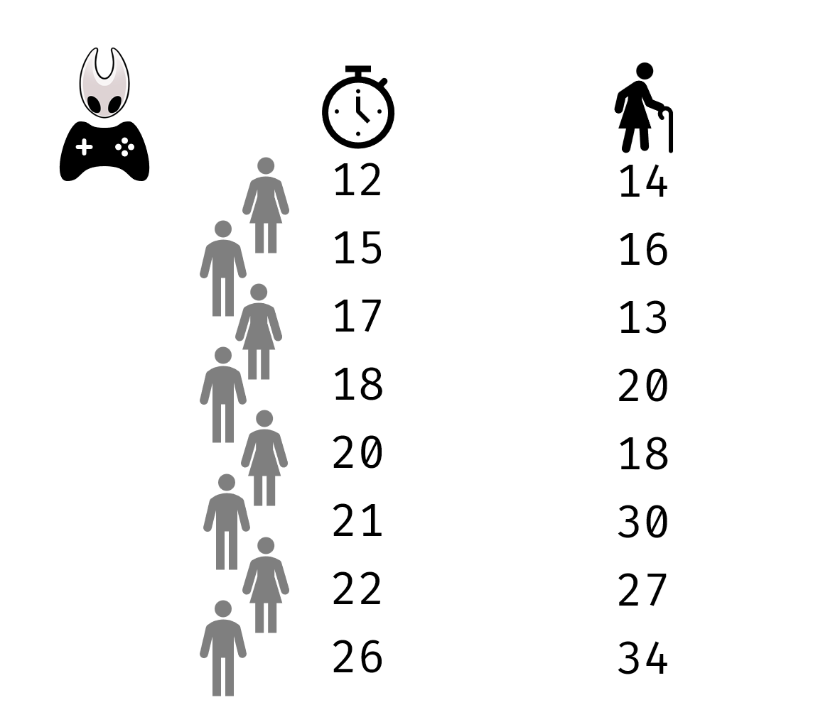


---
class: animated, fadeIn

### Ejemplo de correación de Spearman

<center>
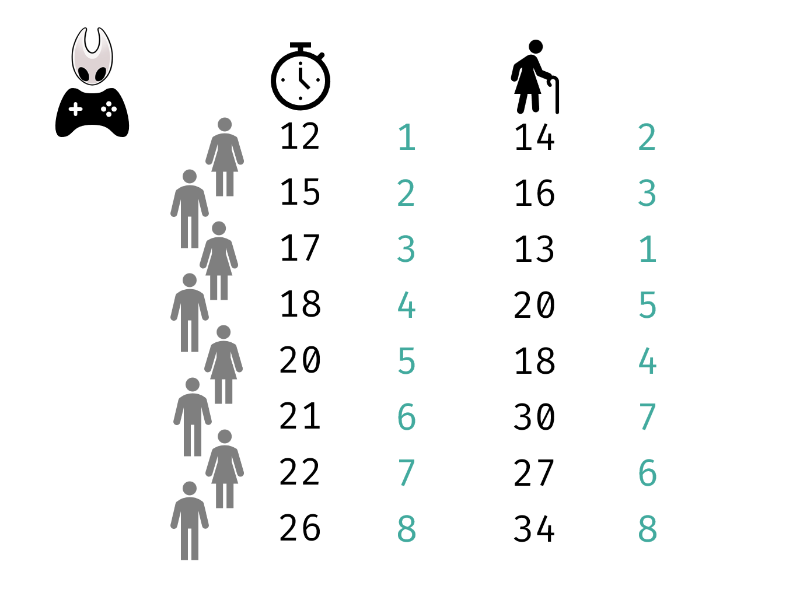


---
class: animated, fadeIn

### Ejemplo de correación de Spearman

```{r echo = F, fig.align='center', fig.width=8, fig.height=5}
# Cargar librerías
library(ggplot2)
library(dplyr)
library(tidyr)
library(patchwork)  # Para combinar plots

# Datos de ejemplo similares a la imagen
set.seed(123)
x <- c(14, 16, 13, 20, 18, 30, 27, 34)
y <- c(12, 15, 17, 18, 20, 21, 22, 26)

df <- data.frame(x, y)

# Crear rangos
df_rank <- df %>%
  mutate(
    x_rank = rank(x),
    y_rank = rank(y)
  )

# Gráfico de valores originales
p1 <- ggplot(df, aes(x = x, y = y)) +
  geom_point(size = 3, color = "steelblue") +
  labs(x = "X original", y = "Y original") +
  theme_minimal() +
  ggtitle("Valores originales")+
    ggthemes::theme_base(base_size = 13) +
    theme(
      panel.grid = element_blank(),
      axis.title = element_blank(),
      axis.text = element_text(color = "black"),
      panel.background = element_rect(fill = "white"))

# Gráfico de rangos
p2 <- ggplot(df_rank, aes(x = x_rank, y = y_rank)) +
  geom_point(size = 3, color = "steelblue") +
  labs(x = "Rango de X", y = "Rango de Y") +
  theme_minimal() +
  ggtitle("Rangos")+
    ggthemes::theme_base(base_size = 16) +
    theme(
      panel.grid = element_blank(),
      axis.title = element_blank(),
      axis.text = element_text(color = "black"),
      panel.background = element_rect(fill = "white")) + scale_x_continuous(breaks=seq(1,10))+ scale_y_continuous(breaks=seq(1,10))

# Combinar los dos plots
p1 + p2

```

- Los datos se distribuyen de manera más uniforme

--

> La correlación de Spearman es como la de Pearson, pero utiliza los rangos en vez de los valores crudos

---
class: animated, fadeIn

### Ecuación de la correlación de Spearman

- Si no hay **empates** en los rangos:

<center>
$r_s = 1 - \frac{6 \sum d_i^2}{n(n^2 - 1)}$
</center>

donde: 

- $r_s$ es el coeficiente de correlación de Spearman  
- $n$ es el número de pares de datos  
- $d_i = R(X_i) - R(Y_i)$ es la diferencia entre los rangos del i-ésimo par de valores  
- $\sum_{i=1}^{n} d_i^2$ es la suma de los cuadrados de las diferencias de rangos


---
class: animated, fadeIn

### Ejemplo de correación de Spearman

<center>
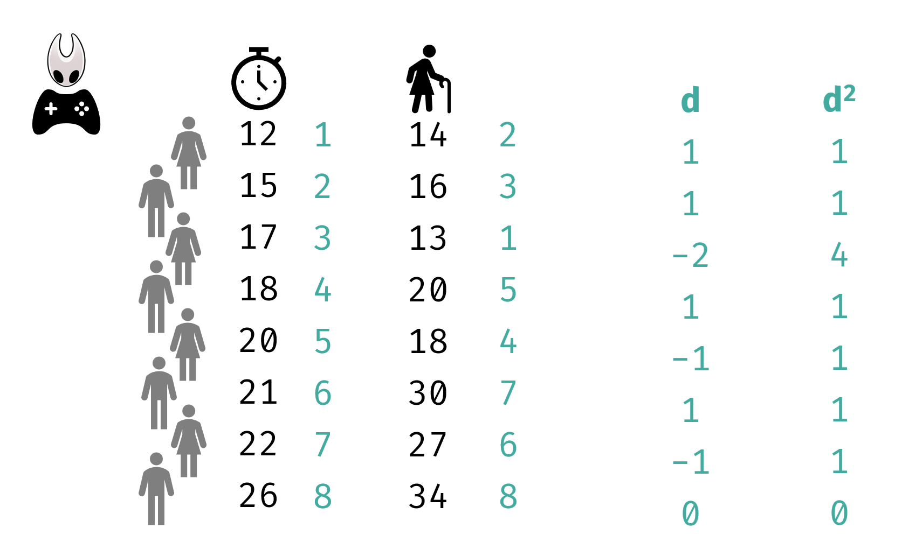


---
class: animated, fadeIn

### Ejemplo de correación de Spearman

.pull-left[
<center>

$r_s = 1 - \frac{6 \sum d_i^2}{n(n^2 - 1)}= 1 - \frac{6 \times 10}{8(8^2 - 1)}=0.88$

</center>

]

.pull-right[

```{r echo = F, fig.align='center', fig.width=8, fig.height=5}
# Cargar librerías
library(ggplot2)
library(dplyr)
library(tidyr)
library(patchwork)  # Para combinar plots

# Datos de ejemplo similares a la imagen
set.seed(123)
x <- c(14, 16, 13, 20, 18, 30, 27, 34)
y <- c(12, 15, 17, 18, 20, 21, 22, 26)

df <- data.frame(x, y)

# Crear rangos
df_rank <- df %>%
  mutate(
    x_rank = rank(x),
    y_rank = rank(y)
  )

# Gráfico de valores originales
p1 <- ggplot(df, aes(x = x, y = y)) +
  geom_point(size = 3, color = "steelblue") +
  labs(x = "X original", y = "Y original") +
  theme_minimal() +
  ggtitle("Valores originales")+
    ggthemes::theme_base(base_size = 13) +
    theme(
      panel.grid = element_blank(),
      axis.title = element_blank(),
      axis.text = element_text(color = "black"),
      panel.background = element_rect(fill = "white"))

# Gráfico de rangos
p2 <- ggplot(df_rank, aes(x = x_rank, y = y_rank)) +
  geom_point(size = 3, color = "steelblue") +
  labs(x = "Rango de X", y = "Rango de Y") +
  theme_minimal() +
  ggtitle("Rangos")+
    ggthemes::theme_base(base_size = 16) +
    theme(
      panel.grid = element_blank(),
      axis.title = element_blank(),
      axis.text = element_text(color = "black"),
      panel.background = element_rect(fill = "white")) + scale_x_continuous(breaks=seq(1,10))+ scale_y_continuous(breaks=seq(1,10))

# Combinar los dos plots
p1 + p2

```

]

--

- El coeficiente de correlación de spearman va de -1 a 1


---

## Coeficiente de correlación de Spearman en `R`

```{r}
edad <- c(14, 16, 13, 20, 18, 30, 27, 34)
tiempo_reaccion <- c(12, 15, 17, 18, 20, 21, 22, 26)

cor.test(edad, tiempo_reaccion, method = "spearman", alternative = "two.sided")
```


---
class: animated, fadeIn

## Coeficiente de correlación de rango de Kendall (τ de Kendall)

- **Correlación de Kendall (τ)** es un **procedimiento no paramétrico**

  - No requiere que los datos sigan una **distribución normal**

- Mide la **asociación entre dos variables ordinales**
 
- Es **similar a la correlación de Spearman**, pero:
  - Es **más robusta** cuando hay **pocos datos** o **muchos empates en los rangos (rank ties)**


---
class: animated, fadeIn

## Coeficiente de correlación de rango de Kendall (τ de Kendall)


$$
\tau = \frac{(n_c - n_d)}{n_c+n_d}
$$

donde:  
- $n_c$: número de pares **concordantes**  
- $n_d$: número de pares **discordantes**  

---
class: animated, fadeIn

### Ejemplo
<center>
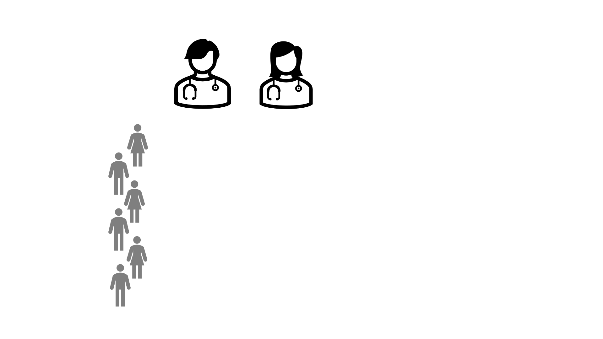

---
class: animated, fadeIn

### Ejemplo
<center>
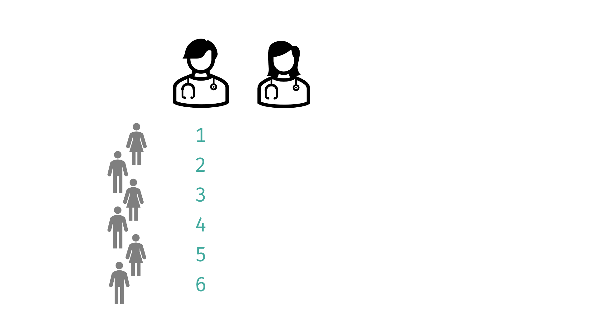
---
class: animated, fadeIn

### Ejemplo
<center>
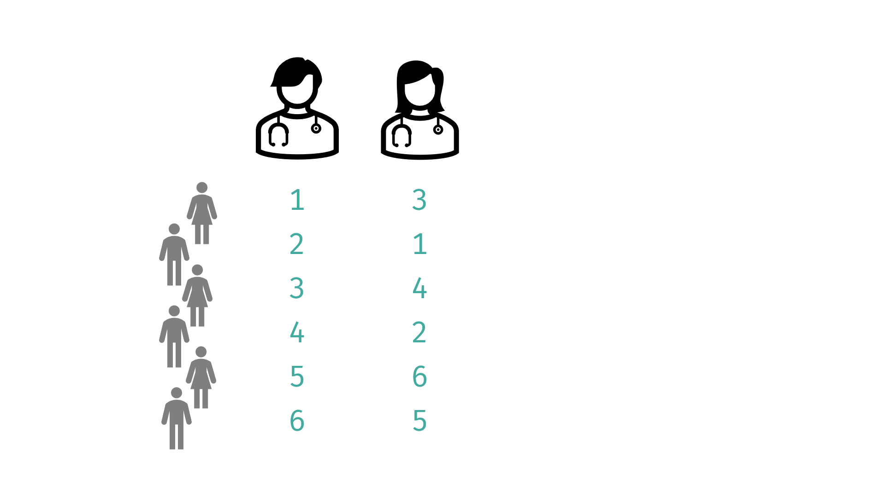
---
class: animated, fadeIn

### Ejemplo
<center>
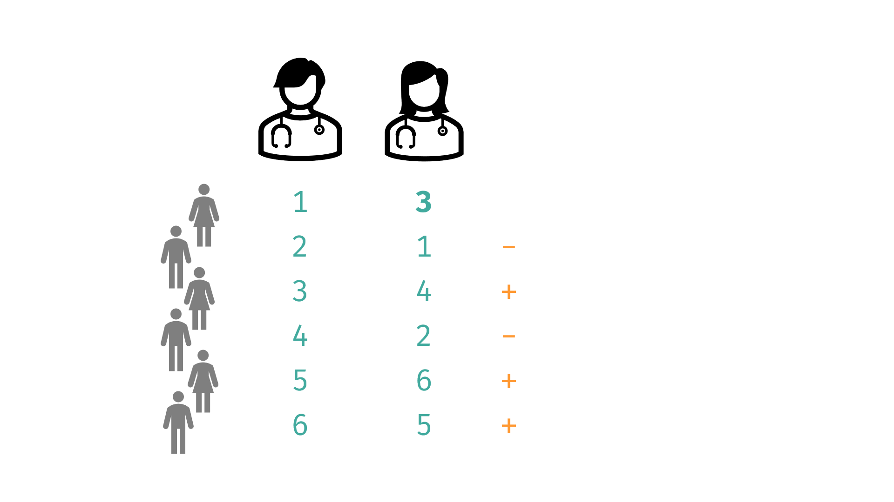
---
class: animated, fadeIn

### Ejemplo
<center>
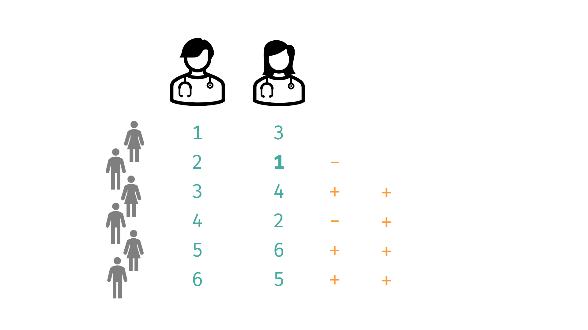
---
class: animated, fadeIn

### Ejemplo
<center>
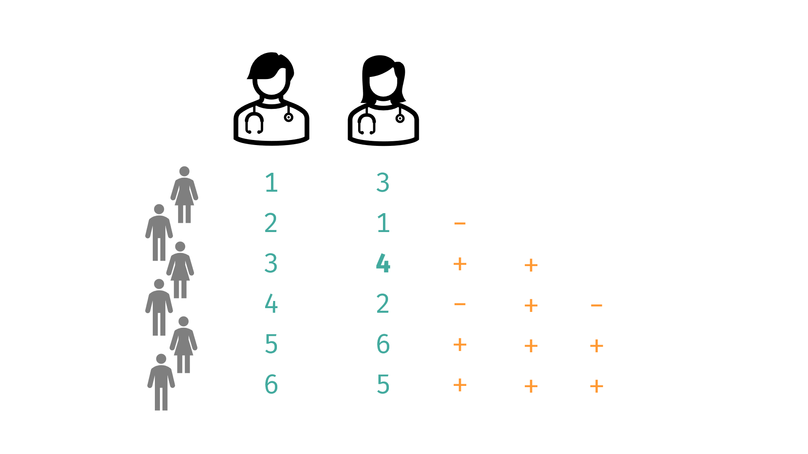

---
class: animated, fadeIn

### Ejemplo
<center>
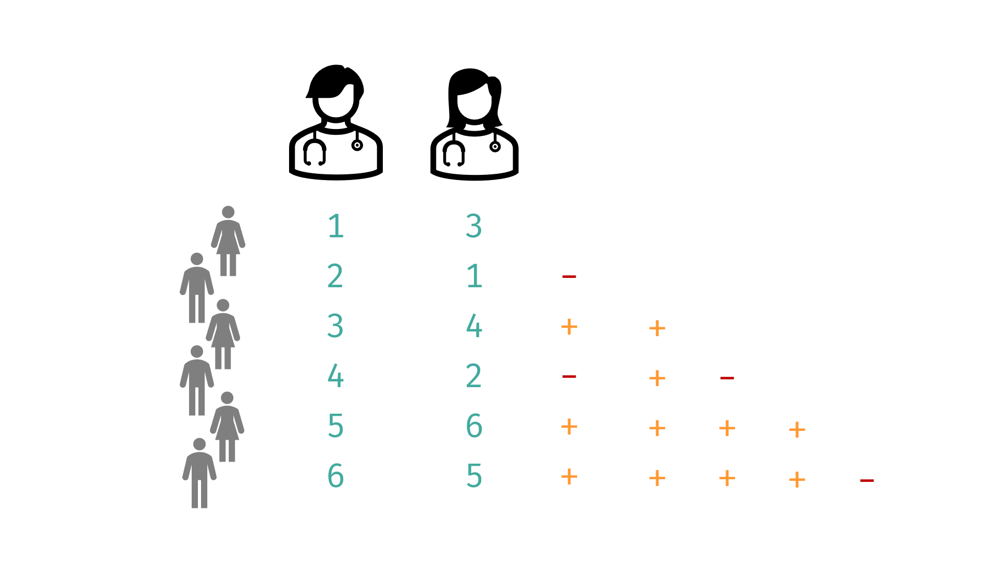

---
class: animated, fadeIn

### Ejemplo
.pull-left[

$$\tau=\frac{11-4}{11+4}=0.47$$

]
.pull-right[
<center>

]
--

- El coeficiente de tau también va de -1 a 1

---
class: animated, fadeIn

## Test de hipótesis

- La **τ de Kendall** se puede contrastar estadísticamente usando la **distribución normal (z)** como aproximación.

- Esta aproximación **solo es válida cuando el tamaño muestral es suficientemente grande**, **n ≥ 40**.

--

Para calcular el valor z, utilizamos la fórmula: 

$$
z = \frac{3\tau\sqrt{n(n-1)}}{\sqrt{2(2n + 5)}}
$$
--

- Si $|z| > 1.96$, podemos rechazar la hipótesis nula de **no correlación** (al nivel de significación 0.05). 

- Un valor de **τ positivo** indica **concordancia** entre los rangos;  
  uno **negativo**, **discordancia**.

---
class: animated, fadeIn

## Coeficiente de correlación de rango de Kendall en `R`

```{r}
medico1 <- c(1,2,3,4,5,6)
medico2 <- c(3,1,4,2,6,5)

cor.test(medico1, medico2, method = "kendall")

```


---
class: animated, fadeIn

## Causalidad vs. correlación

--

- Causalidad es la relación entre una **causa** y un **efecto**

--

- La correlación nos dice si hay una **relación** entre dos variables

--

<center>
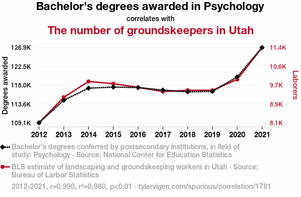

---
class: animated, fadeIn

## Causalidad vs. correlación

> **No podemos asumir causalidad a partir de una correlación.**

La correlación solo indica que las variables se mueven juntas, no que una cause a la otra.

--

<br>

Se debe cumplir:

1. Correlación significativa

2. Los siguientres tres escenarios:
  
  a. Secuencia cronológica
  
  b. Experimento controlado
  
  c. Fundamento teórico sólido


---
class: animated, fadeIn

<BR>
<BR>
<BR>
<BR>
<center>

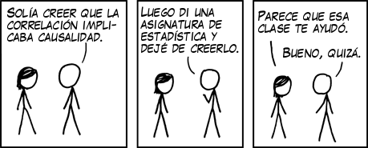

---
class: animated, fadeIn

## Contacto

<div style="margin-top: 20vh; text-align:center;">

| Marta Coronado Zamora | David Castellano | 
|:-:|:-:|
| <a href="mailto:marta.coronado@uab.cat"><i class="fa fa-paper-plane fa-fw"></i> marta.coronado@uab.cat</a> | <a href="mailto:david.castellano@uab.cat"><i class="fa fa-paper-plane fa-fw"></i>&nbsp; david.castellano@uab.cat</a> | 
| <a href="https://bsky.app/profile/geneticament.bsky.social"><i class="fab fa-bluesky fa-fw"></i>&nbsp; @geneticament.bsky.social</a> |                 <a href="https://bsky.app/profile/castellanoed.bsky.social"><i class="fab fa-bluesky fa-fw"></i>&nbsp; @castellanoed.bsky.social</a> |
| <a href="https://www.uab.cat"><i class="fa fa-map-marker fa-fw"></i>&nbsp; Universitat Autònoma de Barcelona</a> |    <a href="https://gutengroup.mcb.arizona.edu/"> <i class="fa fa-map-marker fa-fw"></i>&nbsp; University of Arizona</a> |


