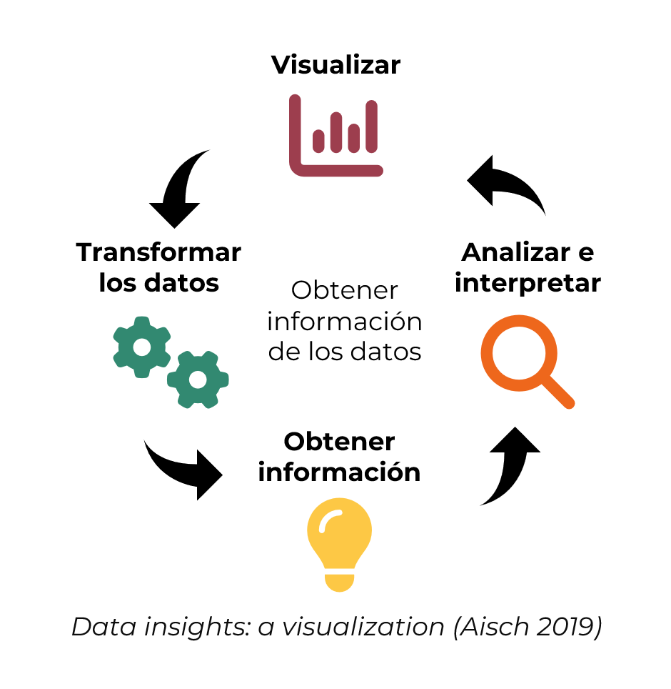
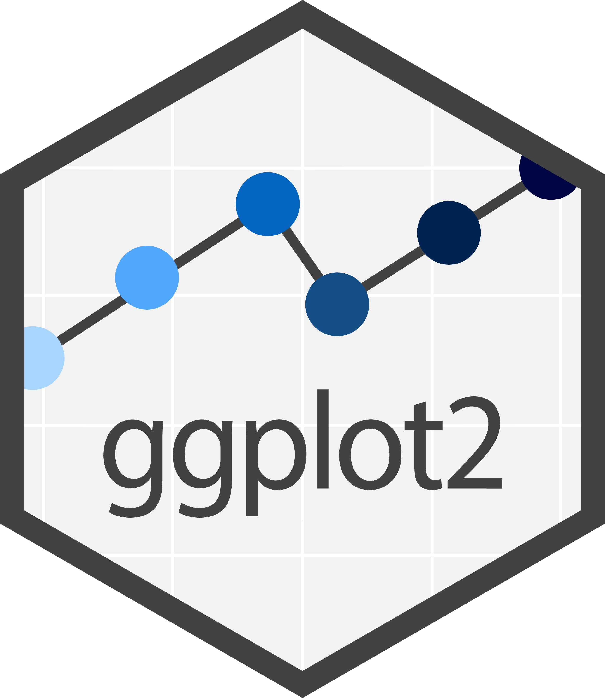
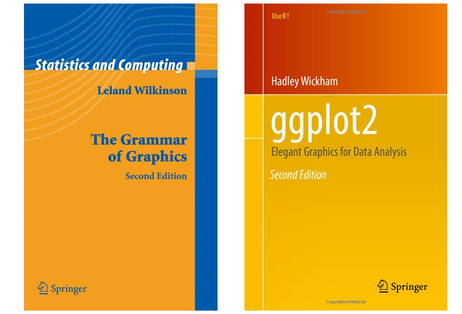
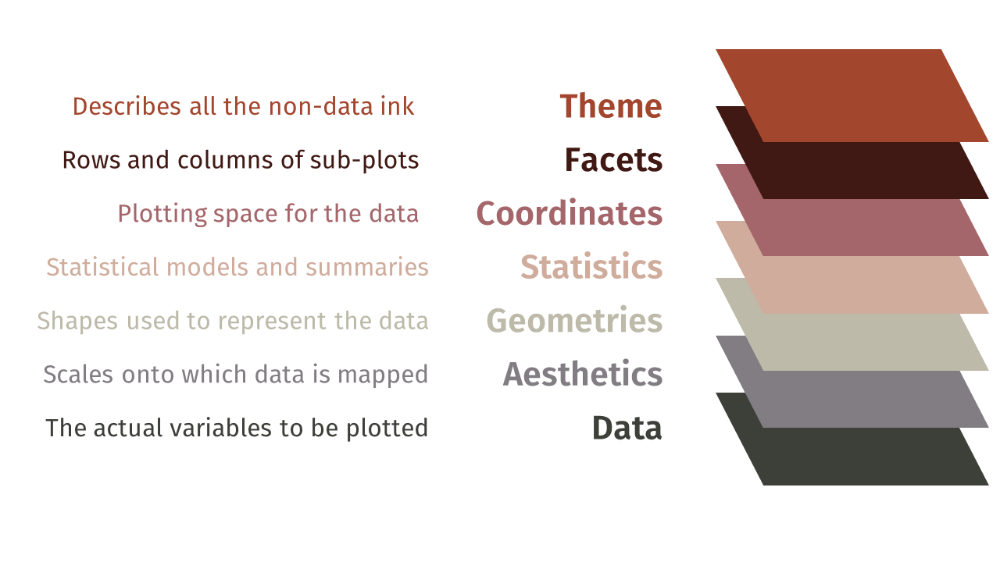
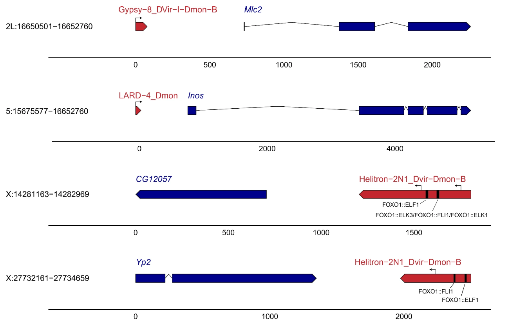

```{r setup, include=FALSE}
options(htmltools.dir.version = FALSE)
#knitr::include_graphics()
knitr::opts_chunk$set(
  cache = FALSE,
  message = FALSE, 
  warning = FALSE,
  hiline = TRUE,
  fig.retina = 5
)
library(ggplot2)
library(readr)
library(knitr)
library(tidyverse)
library(gtsummary)
library(ggsignif)

#pagedown::chrome_print(".html")
```

```{r xaringan-themer, include=FALSE, warning=FALSE}
library(xaringanthemer)
style_mono_accent(
  base_color = "#1c5253", link_color =  "#DE1144", code_inline_color = "#DE1144",
  header_font_google = google_font("Josefin Sans"),
  text_font_google   = google_font("Montserrat", "400", "400i"),
  code_font_google   = google_font("Roboto Mono"),
  
)
```

class: animated, fadeIn
# Outline

#### **1. Gramática de los gráficos**
- Tidy data

#### **2. Gráficos con `ggplot2`**
- Boxplot
- Histograma
- Scatterplot

#### **3. Librerías especializadas**


<style>
  .title-slide {
    background-image: url('img/1.png');
    background-size: 100%;
  }
</style>
  
  
---
layout: false
class: left, bottom, inverse, animated, bounceInDown

# 01
##  La gramática de los gráficos


---
layout: true
class: animated, fadeIn
---

# ¿Qué es la visualización de datos?

- La **visualización de datos** es la **representación gráfica** de los **datos**
- El objetivo principal es **comunicar información de manera clara** y **efectiva** 
- La **funcionalidad** y la **estética** han de ir de la mano

<center>

</center>


---
.pull-left[</img>]

.pull-right[
<br>
<br>
`ggplot2` es un popular paquete de visualización de datos de código abierto para el **lenguaje de programación R**.

<br>
Fue desarrollado por **Hadley Wickham** y se basa en la **gramática de gráficos**, que proporciona un marco coherente y sistemático para crear una amplia gama de visualizaciones de datos.

<br><b>
1. Capas (Layering)
2. Flexibilidad
3. Reproducibilidad
4. Comunidad
]

---

# La gramática de los gráficos

.pull-left[
#### Gramática original
<i class="fas fa-book"></i> Wilkinson, Leland. The grammar of graphics. Springer Science & Business Media, 2006.
]

.pull-right[
<center>
</img>
]

--

#### Adaptado a `R` en el paquete `ggplot2`

<i class="fas fa-book"></i> Hadley Wickham. ggplot2: elegant graphics for data analysis. Springer, 2009.

"La gramática nos dice que un **gráfico estadístico** es un **mapeo** de **datos** a **atributos estéticos** (color, forma, tamaño) de **objetos geométricos** (puntos, líneas, barras). El gráfico también puede contener **transformaciones estadísticas** de los datos y se dibuja en un **sistema de coordenadas específico**. Es la **combinación de estos componentes independientes lo que forma un gráfico**."

---

## Sintaxis 

En `ggplot2` hay diferentes componentes que podemos añadir a un gráfico:

.pull-left[
```r
ggplot(data = <DATA>,
    mapping = aes(<MAPPINGS>)) +

    <GEOM_FUNCTION>(stat = <STAT>,
    position = <POSITION>) +
  
    <SCALE_FUNCTION>() +
  
    <COORDINATE_FUNCTION>() +
  
    <FACET_FUNCTION>() +
  
    <THEME_FUNCTION>
```

]



<center>
<p style="position:absolute; bottom:125px; right:200px;">
Grammar of Graphics:<br>A layered approach to elegant visuals
</p>

---
### Datos ordenados (tidy data)

Data frames con una observación por fila y una variable por columna.

<center>

</center>

---

### Datos ordenados (tidy data)

Dos tipos de estructuras de datos ordenados:

* **Formato ancho** (el más común): en un formato ancho, las múltiples medidas de una sola observación se almacenan en una sola fila.

```{r, eval = TRUE, echo = F}
options(width = 300)

wide_df <- data.frame(
  Student = c("A", "B", "C"),
  Math = c(99, 73, 12),
  Literature = c(45, 78, 96),
  PE = c(56, 55, 57)
)
wide_df
```

--

* **Formato largo**: cada fila corresponde a una medida de una observación.

```{r, eval = TRUE, echo = F}
library(tidyverse)
long_df <- pivot_longer(
  wide_df,
  cols = c(Math, Literature, PE),
  names_to = "Subject",
  values_to = "Score"
)
long_df
```


---
### Datos ordenados (tidy data)

Existen funciones para cambiar del formato ancho al formato largo:

```{r eval = TRUE, echo = TRUE}
# Paquete tidyverse, función pivot_longer
library(tidyverse)
long_df <- pivot_longer(
  wide_df,
  cols = c(Math, Literature, PE), # o  cols = -c(Student),
  names_to = "Subject",
  values_to = "Score"
  )
long_df
``` 
  

---
class: animated, fadeIn
# Trabajando con datos

Leeremos los datos que corresponden a casos de una epidemia de ébola simulada (obtenidos de: https://www.epirhandbook.com/). En R, una tabla se llama **data.frame**.

```{r}
surv_raw <- read_tsv("data/ebola_epidemic.tab", col_names = T)
``` 

<div style="font-size: 60%;">

```{r, echo = F, tidy=T}
head(surv_raw, 25) %>% 
  tibble() %>% 
  DT::datatable(
    options = list(
      scrollY = 300,
      scrollX = 600,
      pageLength = 25,
      fontSize = '5%',
      dom = "ti",
      ordering = FALSE,
      rownames = FALSE,
      options = list(pageLength = 5, scrollX=T),
      class = 'white-space: nowrap' 
    )
  )
``` 
</div> 

---
layout: false
class: left, bottom, inverse, animated, bounceInDown

# 02
## Gráficos con `ggplot2`


---
class: animated, fadeIn

## Cómo hacer boxplots avanzados?

.pull-left[

Queremos representar la edad (`age`) de los grupos de `outcome` de nuestra tabla `surv_raw`.

```{r, echo = F, eval = T}
surv_raw %>% 
  group_by(outcome) %>% 
  summarise(
    n_rows  = n())
```

Primero, indicamos los datos (el **dataframe**):

```{r, echo = T, eval = F}
ggplot(data = surv_raw)  #<<
```

]

.pull-right[
```{r, echo = FALSE, fig.height=6, fig.width=6}
ggplot(data = surv_raw)

```

]

---

## Cómo hacer boxplots avanzados?

.pull-left[

Queremos representar la edad (`age`) de los grupos de `outcome` de nuestra tabla `surv_raw`.

Después, indicamos las variables que usamos para los ejes `x` e `y`:

```{r, echo = T, eval = F}
ggplot(data = surv_raw,
       mapping = aes(x = outcome, y = age))  #<<
```

]

.pull-right[
```{r, echo = FALSE, fig.height=6, fig.width=6}
ggplot(data = surv_raw,
       mapping = aes(x = outcome, y = age))  #<<
```

]


---
## Cómo hacer boxplots avanzados?

.pull-left[

Queremos representar la edad (`age`) de los grupos de `outcome` de nuestra tabla `surv_raw`.

Indicamos de qué tipo es el gráfico, en este caso, haremos un boxplot:


```{r, echo = T, eval = F}
ggplot(data = surv_raw,
       mapping = aes(x = outcome, y = age)) +
  geom_boxplot() #<<
```

]

.pull-right[
```{r, echo = FALSE, fig.height=6, fig.width=6}
ggplot(data = surv_raw,
       mapping = aes(x = outcome, y = age)) +
  geom_boxplot() #<<

```

]


---
## Cómo hacer boxplots avanzados?

.pull-left[

Queremos representar la edad (`age`) de los grupos de `outcome` de nuestra tabla `surv_raw`.

Podemos usar la función `drop_na()` para eliminar los casos NA (no tenemos información de la edad):


```{r, echo = T, eval = F}
library(tidyr) #<<

ggplot(data = surv_raw %>% drop_na(outcome), #<<
       mapping = aes(x = outcome, y = age)) +
  geom_boxplot() 
```

]

.pull-right[
```{r, echo = FALSE, fig.height=6, fig.width=6}
library(tidyr)

ggplot(data = surv_raw  %>% drop_na(outcome),
       mapping = aes(x = outcome, y = age)) +
  geom_boxplot() 
```

]


---
## Cómo hacer boxplots avanzados?

.pull-left[

Queremos representar la edad (`age`) de los grupos de `outcome` de nuestra tabla `surv_raw`.

Con `fill`, indicamos que queremos colorear según el grupo de `outcome`.


```{r, echo = T, eval = F}
ggplot(data = surv_raw %>% drop_na(outcome), 
       mapping = aes(x = outcome, y = age,
                     fill = outcome)) + #<<
  geom_boxplot() 
```

]

.pull-right[
```{r, echo = FALSE, fig.height=6, fig.width=6}
ggplot(data = surv_raw  %>% drop_na(outcome),
       mapping = aes(x = outcome, y = age,
                     fill = outcome)) +
  geom_boxplot() 
```

]

---
## Cómo hacer boxplots avanzados?

.pull-left[

Queremos representar la edad (`age`) de los grupos de `outcome` de nuestra tabla `surv_raw`.

Con `scale_fill_manual`, indicamos que de manera manual asignaremos los colores que queremos usar:


```{r, echo = T, eval = F}
ggplot(data = surv_raw %>% drop_na(outcome), 
       mapping = aes(x = outcome, y = age, 
                     fill = outcome)) + 
  geom_boxplot() +
    scale_fill_manual(      #<<
    values = c("Death" = "aquamarine4",  #<<
              "Recover" = "bisque4")) #<<
```

]

.pull-right[
```{r, echo = FALSE, fig.height=6, fig.width=6}
ggplot(data = surv_raw %>% drop_na(outcome), 
       mapping = aes(x = outcome, y = age, 
                     fill = outcome)) + 
  geom_boxplot() +
    scale_fill_manual(      #<<
    values = c("Death" = "aquamarine4",  #<<
              "Recover" = "bisque4")) #<<

```

]

Puedes consultar la guía de colores aquí: https://r-charts.com/colors/

---
## Cómo hacer boxplots avanzados?

.pull-left[

Queremos representar la edad (`age`) de los grupos de `outcome` de nuestra tabla `surv_raw`.

Podemos aplicar un tema con `theme_*`:


```{r, echo = T, eval = F}
ggplot(data = surv_raw %>% drop_na(outcome), 
       mapping = aes(x = outcome, y = age,
                     fill = outcome)) + 
  geom_boxplot() +
    scale_fill_manual(      
    values = c("Death" = "aquamarine4",  
              "Recover" = "bisque4")) +
  theme_minimal() #<<
```

]

.pull-right[
```{r, echo = FALSE, fig.height=6, fig.width=6}
ggplot(data = surv_raw %>% drop_na(outcome), 
       mapping = aes(x = outcome, y = age,
                     fill = outcome)) + 
  geom_boxplot() +
    scale_fill_manual(      
    values = c("Death" = "aquamarine4",  
              "Recover" = "bisque4")) +
  theme_minimal() #<<

```

]

Puedes consultar los temas disponibles en: https://ggplot2.tidyverse.org/reference/ggtheme.html


---
## Cómo hacer boxplots avanzados?

.pull-left[

Queremos representar la edad (`age`) de los grupos de `outcome` de nuestra tabla `surv_raw`.

Con `labs()`, indicamos los títulos para los ejes y un título general.


```{r, echo = T, eval = F}
ggplot(data = surv_raw %>% drop_na(outcome), 
       mapping = aes(x = outcome, y = age,
                     fill = outcome)) + 
  geom_boxplot() +
    scale_fill_manual(      
    values = c("Death" = "aquamarine4",  
              "Recover" = "bisque4")) +
  theme_minimal() +
  labs(y = "Age", x = "Outcome",#<<
       title = "Boxplot by outcome") #<<
```

]

.pull-right[
```{r, echo = FALSE, fig.height=6, fig.width=6}
ggplot(data = surv_raw %>% drop_na(outcome), 
       mapping = aes(x = outcome, y = age,
                     fill = outcome)) + 
  geom_boxplot() +
    scale_fill_manual(      
    values = c("Death" = "aquamarine4",  
              "Recover" = "bisque4")) +
  theme_minimal() +
  labs(y = "Age", x = "Outcome",#<<
       title = "Boxplot by outcome") #<<

```

]

---

## Cómo hacer boxplots avanzados?

.pull-left[

Queremos representar la edad (`age`) de los grupos de `outcome` de nuestra tabla `surv_raw`.

Con `theme()`, podemos aplicar **cualquier** modificación al gráfico (¡avanzado!). Por ejemplo, indicar que no queremos la leyenda.

```{r, echo = T, eval = F}
ggplot(data = surv_raw %>% drop_na(outcome), 
       mapping = aes(x = outcome, y = age,
                     fill = outcome)) + 
  geom_boxplot() +
    scale_fill_manual(      
    values = c("Death" = "aquamarine4",  
              "Recover" = "bisque4")) +
  theme_minimal() +
  labs(y = "Age", x = "Outcome",
       title = "Boxplot by outcome") +
  theme(legend.position = "none") #<<


```

]

.pull-right[
```{r, echo = FALSE, fig.height=6, fig.width=6}
ggplot(data = surv_raw %>% drop_na(outcome), 
       mapping = aes(x = outcome, y = age,
                     fill = outcome)) + 
  geom_boxplot() +
    scale_fill_manual(      
    values = c("Death" = "aquamarine4",  
              "Recover" = "bisque4")) +
  theme_minimal() +
  labs(y = "Age", x = "Outcome",
       title = "Boxplot by outcome") +
  theme(legend.position = "none") 
```

]

---
## Cómo hacer boxplots avanzados?

.pull-left[

Queremos representar la edad (`age`) de los grupos de `outcome` de nuestra tabla `surv_raw`.

Podemos agregar la significancia con el paquete `ggsignif`.

```{r, echo = T, eval = F}
library(ggsignif)

ggplot(data = surv_raw %>% drop_na(outcome), 
       mapping = aes(x = outcome, y = age,
                     fill = outcome)) + 
  geom_boxplot() +
    scale_fill_manual(      
    values = c("Death" = "aquamarine4",  
              "Recover" = "bisque4")) +
  theme_minimal() +
  labs(y = "Age", x = "Outcome",
       title = "Boxplot by outcome") +
  theme(legend.position = "none") +
  geom_signif(comparisons = #<<
                list(c("Death", "Recover")),#<<
              test = "wilcox.test")#<<

```

]

.pull-right[
```{r, echo = FALSE, fig.height=6, fig.width=6}
ggplot(data = surv_raw %>% drop_na(outcome), 
       mapping = aes(x = outcome, y = age,
                     fill = outcome)) + 
  geom_boxplot() +
    scale_fill_manual(      
    values = c("Death" = "aquamarine4",  
              "Recover" = "bisque4")) +
  theme_minimal() +
  labs(y = "Age", x = "Outcome",
       title = "Boxplot by outcome") +
  theme(legend.position = "none") +
  geom_signif(comparisons =
                list(c("Death", "Recover")), #<<
              test = "wilcox.test") #<<
```

]

---

## Cómo hacer un histograma avanzado?

.pull-left[
Queremos hacer una curva epidémica para cada hospital.


```{r, echo = T, eval = F}

ggplot(data = surv_raw) #<<


```

]

.pull-right[
```{r, echo = FALSE, fig.height=6, fig.width=6}

ggplot(data = surv_raw)


```

]

---
## Cómo hacer un histograma avanzado?

.pull-left[
Queremos hacer una curva epidémica para cada hospital.

```{r, echo = T, eval = F}

ggplot(data = surv_raw) +
    geom_histogram(aes(x = date_onset)) #<<

```

]

.pull-right[
```{r, echo = FALSE, fig.height=6, fig.width=6}

ggplot(data = surv_raw) +
    geom_histogram(aes(x = date_onset)) #<<
```

]


---
## Cómo hacer un histograma avanzado?

.pull-left[
Queremos hacer una curva epidémica para cada hospital.


```{r, echo = T, eval = F}

ggplot(data = surv_raw) +
    geom_histogram(aes(x = date_onset,
                       fill = hospital)) +
   scale_fill_brewer(type = "qual",#<<
                     palette = 1)#<<


```

]

.pull-right[
```{r, echo = FALSE, fig.height=6, fig.width=6}

ggplot(data = surv_raw) +
    geom_histogram(aes(x = date_onset,
                       fill = hospital)) +
   scale_fill_brewer(type = "qual",
                     palette = 1) #<<


```

]

Hemos utilizado una paleta de colores preexistente. Puedes consultarlas en: https://ggplot2.tidyverse.org/reference/scale_brewer.html

---

## Cómo hacer un histograma avanzado?

.pull-left[
Queremos hacer una curva epidémica para cada hospital.


```{r, echo = T, eval = F, fig.height=6, fig.width=6}

ggplot(data = surv_raw) +
    geom_histogram(aes(x = date_onset,
                       fill = hospital)) +
   scale_fill_brewer(type = "qual", palette = 1) +
  theme_minimal() #<<


```

]

.pull-right[
```{r, echo = FALSE, fig.height=6, fig.width=6}

ggplot(data = surv_raw) +
    geom_histogram(aes(x = date_onset,
                       fill = hospital)) +
   scale_fill_brewer(type = "qual", palette = 1) +
  theme_minimal() #<<


```

]


---

## Cómo hacer un histograma avanzado?

.pull-left[
Queremos hacer una curva epidémica para cada hospital.


```{r, echo = T, eval = F}

ggplot(data = surv_raw) +
    geom_histogram(aes(x = date_onset,
                       fill = hospital)) +
   scale_fill_brewer(type = "qual", palette = 1) +
  theme_minimal() +
  theme(legend.position = "bottom")#<<


```

]

.pull-right[
```{r, echo = FALSE, fig.height=6, fig.width=6}

ggplot(data = surv_raw) +
    geom_histogram(aes(x = date_onset,
                       fill = hospital)) +
   scale_fill_brewer(type = "qual", palette = 1) +
  theme_minimal() +
  theme(legend.position = "bottom")#<<


```

]


---

## Cómo hacer un histograma avanzado?

.pull-left[
Queremos hacer una curva epidémica para cada hospital.


```{r, echo = T, eval = F}

ggplot(data = surv_raw) +
    geom_histogram(aes(x = date_onset,
                       fill = hospital)) +
   scale_fill_brewer(type = "qual", palette = 1) +
  theme_minimal() +
  theme(legend.position = "bottom") +
  labs(x = "Onset date", y = "",#<<
       title = "Epidemic curve")#<<


```

]

.pull-right[
```{r, echo = FALSE, fig.height=6, fig.width=6}

ggplot(data = surv_raw) +
    geom_histogram(aes(x = date_onset,
                       fill = hospital)) +
   scale_fill_brewer(type = "qual", palette = 1) +
  theme_minimal() +
  theme(legend.position = "bottom") +
  labs(x = "Onset date", y = "", title = "Epidemic curve")#<<


```

]

---


## Cómo hacer un scatterplot?

Queremos representar la relación entre altura y peso de los pacientes.


```{r}
library(dplyr)

# Calcular los cuantiles para 5 grupos
q <- seq(0, 1, 1/5)
age_quints <- quantile(surv_raw$age, probs = q, na.rm = TRUE)
age_quints

# Crear etiquetas con los rangos de edad
age_labels <- paste0("(",age_quints[-length(age_quints)], "-", age_quints[-1],"]")

age_labels
```


---


## Cómo hacer un scatterplot?

Queremos representar la relación entre altura y peso de los pacientes.


```{r}
# Crear la columna age_cat_5 con etiquetas de rango
surv_raw <- surv_raw %>%
  mutate(age_cat_5 = cut(age,
                         breaks = age_quints,
                         include.lowest = TRUE,
                         labels = age_labels))
surv_raw[,c("case_id", "age", "age_cat_5")]
```

---


## Cómo hacer un scatterplot?

Queremos representar la relación entre altura y peso de los pacientes.

.pull-left[
```{r, echo = T, eval = F}

ggplot(surv_raw, 
       aes(x = ht_cm, y = wt_kg))#<<

```

]

.pull-right[
```{r, echo = FALSE, fig.height=6, fig.width=6}

ggplot(surv_raw, 
       aes(x = ht_cm, y = wt_kg))

```

]

---


## Cómo hacer un scatterplot?

Queremos representar la relación entre altura y peso de los pacientes.

.pull-left[
```{r, echo = T, eval = F}

ggplot(surv_raw, 
       aes(x = ht_cm, y = wt_kg)) +
    geom_point() #<<

```

]

.pull-right[
```{r, echo = FALSE, fig.height=6, fig.width=6}

ggplot(surv_raw, 
       aes(x = ht_cm, y = wt_kg)) +
    geom_point()


```

]

---


## Cómo hacer un scatterplot?

Queremos representar la relación entre altura y peso de los pacientes.

.pull-left[
```{r, echo = T, eval = F}

ggplot(surv_raw, 
       aes(x = ht_cm, y = wt_kg,
           color=age_cat_5)) + #<<
    geom_point()

```

]

.pull-right[
```{r, echo = FALSE, fig.height=6, fig.width=6}

ggplot(surv_raw, aes(x = ht_cm, y = wt_kg,
                     color=age_cat_5)) + #<<
    geom_point()


```

]

---


## Cómo hacer un scatterplot?

Queremos representar la relación entre altura y peso de los pacientes.

.pull-left[
```{r, echo = T, eval = F}

ggplot(surv_raw, 
       aes(x = ht_cm, y = wt_kg,
           color=age_cat_5,
           shape=age_cat_5)) + #<<
    geom_point()

```

]

.pull-right[
```{r, echo = FALSE, fig.height=6, fig.width=6}

ggplot(surv_raw, 
       aes(x = ht_cm, y = wt_kg,
           color=age_cat_5,
           shape=age_cat_5)) + #<<
    geom_point()

```

]

---


## Cómo hacer un scatterplot?

Queremos representar la relación entre altura y peso de los pacientes.

.pull-left[
```{r, echo = T, eval = F}

ggplot(surv_raw, 
       aes(x = ht_cm, y = wt_kg,
           color=age_cat_5,
           shape=age_cat_5)) +
    geom_point() +
    labs(title = "Relación peso-altura",
         x = "Altura (cm)",
         y = "Peso (kg)") +
    scale_color_brewer(palette = "Set2") + #<<
    theme_minimal()

```

]

.pull-right[
```{r, echo = FALSE, fig.height=6, fig.width=6}

ggplot(surv_raw, 
       aes(x = ht_cm, y = wt_kg,
           color=age_cat_5,
           shape=age_cat_5)) +
    geom_point() +
    labs(title = "Relación peso-altura",
         x = "Altura (cm)",
         y = "Peso (kg)") +
    scale_color_brewer(palette = "Set2") +
    theme_minimal()


```

]

---


## Cómo hacer un scatterplot?

Queremos representar la relación entre altura y peso de los pacientes.

.pull-left[
```{r, echo = T, eval = F}

ggplot(surv_raw %>% drop_na(age_cat_5), #<<
       aes(x = ht_cm, y = wt_kg,
           color=age_cat_5,
           shape=age_cat_5)) +
    geom_point() +
    labs(title = "Relación peso-altura",
         x = "Altura (cm)",
         y = "Peso (kg)") +
    scale_color_brewer(palette = "Set2") + 
    theme_minimal()

```

]

.pull-right[
```{r, echo = FALSE, fig.height=6, fig.width=6}

ggplot(surv_raw %>% drop_na(age_cat_5), 
       aes(x = ht_cm, y = wt_kg,
           color=age_cat_5,
           shape=age_cat_5)) +
    geom_point() +
    labs(title = "Relación peso-altura",
         x = "Altura (cm)",
         y = "Peso (kg)") +
    scale_color_brewer(palette = "Set2") +
    theme_minimal()


```

]

---


## Cómo hacer un scatterplot?

Queremos representar la relación entre altura y peso de los pacientes.

.pull-left[
```{r, echo = T, eval = F}

ggplot(surv_raw %>% drop_na(age_cat_5),
       aes(x = ht_cm, y = wt_kg,
           color=age_cat_5,
           shape=age_cat_5)) +
    geom_point() +
    labs(title = "Relación peso-altura",
         x = "Altura (cm)",
         y = "Peso (kg)",
         color="Categoría edad", #<<
         shape="Categoría edad") + #<<
    scale_color_brewer(palette = "Set2") + 
    theme_minimal()

```

]

.pull-right[
```{r, echo = FALSE, fig.height=6, fig.width=6}

ggplot(surv_raw %>% drop_na(age_cat_5), 
       aes(x = ht_cm, y = wt_kg,
           color=age_cat_5,
           shape=age_cat_5)) +
    geom_point() +
    labs(title = "Relación peso-altura",
         x = "Altura (cm)",
         y = "Peso (kg)",
         color="Categoría edad",
         shape="Categoría edad") +
    scale_color_brewer(palette = "Set2") +
    theme_minimal()


```

]


---
layout: false
class: left, bottom, inverse, animated, bounceInDown

# 03
## Librerías especializadas


---
layout: true
class: animated, fadeIn

---
# Bibliotecas y software especializados

- Paquetes de software integrados
- Javascript
    + [BioJS](https://biojs.net)
- Bibliotecas de R
    + Repositorios especializados [Bioconductor](https://bioconductor.org)
    + Extensiones de [`ggplot2`](https://exts.ggplot2.tidyverse.org/)
    + [`htmlwidgets`](http://gallery.htmlwidgets.org/), algunos utilizando bibliotecas de BioJS

---

## Estructuras anatómicas: `gganatogram`

https://github.com/jespermaag/gganatogram

```{r echo = F}
# Install from github
# devtools::install_github("jespermaag/gganatogram")
# sample data set
organ_df <- data.frame(organ = c("heart", "leukocyte", "nerve", "brain", "liver", "stomach", "colon"), 
 type = c("circulation", "circulation",  "nervous system", "nervous system", "digestion", "digestion", "digestion"), 
 colour = c("red", "red", "purple", "purple", "orange", "orange", "orange"), 
 value = c(10, 5, 1, 8, 2, 5, 5),
 stringsAsFactors=F)
```

```{r echo=TRUE, fig.height=4.7, fig.width=7.8}
library(gganatogram)
gganatogram(data=organ_df, fillOutline='#a6bddb', organism='human',
            sex='female', fill="value") +
    scale_fill_gradient(low = "white", high = "red") + 
    facet_wrap(~ type) 
```

---

## Logos: `ggseqlogo`

https://omarwagih.github.io/ggseqlogo/ 

```{r, warning=F, echo = F}
# Install from CRAN
# install.packages("ggseqlogo")
## Or install from github
## devtools::install_github("omarwagih/ggseqlogo")

library(ggseqlogo)
# Sample data
data(ggseqlogo_sample)
# str(seqs_dna)
```

```{r echo=TRUE, fig.height=3.5, fig.width=4.5, warning=F, fig.show='hold'}
library(ggseqlogo)
ggplot() + geom_logo(seqs_dna$MA0002.1) +
    theme_logo() + labs(title = "My TFBS profile")
ggplot() +
    annotate(geom = "rect", xmin = 2.5, xmax = 4.5,
             ymin = -Inf, ymax = Inf, alpha = 0.2) +
    geom_logo(seqs_dna$MA0008.1, method = "probability") +
    theme_logo() 
```

---

## Estructuras de genes: `gggenes` y `gggenomes`

https://github.com/wilkox/gggenes - 
https://thackl.github.io/gggenomes/

.pull-left[
```{r eval = F}
library(gggenes)
ggplot(example_genes, aes(xmin = start, xmax = end, y = molecule, fill = gene)) +
  geom_feature(
    data = example_features,
    aes(x = position, y = molecule, forward = forward)
    ) +
  geom_feature_label(
    data = example_features,
    aes(x = position, y = molecule, label = name, forward = forward)
    ) +
  geom_gene_arrow() +
  geom_blank(data = example_dummies) +
  facet_wrap(~ molecule, scales = "free", ncol = 1) +
  scale_fill_brewer(palette = "Set3") +
  theme_genes()

```
]

.pull-right[

<small>
Figure 7 - Tahami, M.S., Vargas-Chavez, C., Poikela, N., Coronado-Zamora, M., et al. Transposable elements in Drosophila montana from harsh cold environments. Mobile DNA 15, 18 (2024). https://doi.org/10.1186/s13100-024-00328-7
]

---

# Resumen

- La mayoría de los gráficos exploratorios y de comunicación básicos en biología se pueden generar con herramientas generales de gráficos estadísticos (`ggplot2`) --> Datos cuantitativos y cualitativos

  - Diagramas de dispersión (scatterplots)
  - Diagramas de barras (barplots)
  - Diagramas de caja (boxplots)
  - Histoggramas
  - Mapas de calor (heatmaps), ...

- La complejidad y las características de algunos datos biológicos requieren herramientas especializadas.
    + Si los requisitos son estáticos, las extensiones de `ggplot2` pueden ser útiles.
    + Revisa las herramientas utilizadas en estudios similares.


