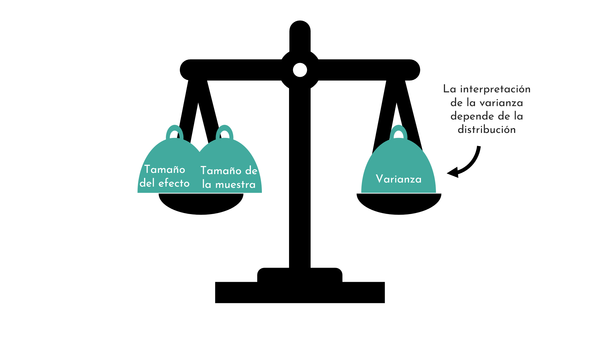

```{r setup, include=FALSE}
options(htmltools.dir.version = FALSE)
#knitr::include_graphics()
knitr::opts_chunk$set(
  cache = TRUE,
  message = FALSE, 
  warning = FALSE,
  hiline = TRUE,
  fig.retina = 5
)
library(ggplot2)
library(readr)
library(knitr)
#pagedown::chrome_print(".html")
```

```{r xaringan-themer, include=FALSE, warning=FALSE}
library(xaringanthemer)
style_mono_accent(
  base_color = "#1c5253", link_color =  "#DE1144", code_inline_color = "#DE1144",
  header_font_google = google_font("Josefin Sans"),
  text_font_google   = google_font("Montserrat", "400", "400i"),
  code_font_google   = google_font("Roboto Mono"),
    
)
```

```{r xaringanExtra-clipboard, echo=FALSE}
library(xaringanExtra)
htmltools::tagList(
  xaringanExtra::use_clipboard(
    button_text = "<i class=\"fa fa-clipboard\"></i>",
    success_text = "<i class=\"fa fa-check\" style=\"color: #90BE6D\"></i>",
  ),
  rmarkdown::html_dependency_font_awesome()
)
```


class: animated, fadeIn
# Outline

#### **1. Motivación**
#### **2. Muestreo**
#### **3. Distribuciones de probabilidad**
- Tipos
- Como medir las distribuciones

<style>
.title-slide {
  background-image: url('img/1.png');
  background-size: 100%;
}
</style>


---

layout: false
class: left, bottom, inverse, animated, bounceInDown
# 01
## Motivación

---
class: animated, fadeIn

# Motivación

.pull-left[

]

---
class: animated, fadeIn

# Motivación

.pull-left[

]

---
class: animated, fadeIn

# Motivación

.pull-left[

]

.pull-right[
**Inferencia**:

- Identificar las **reglas** que siguen los datos

- Ajustar un modelo o **distribución** a los datos

- Extraer conclusiones sobre la **realidad**

- Las distribuciones son importantes para los **test estadísticos**
]

---
class: animated, fadeIn

# Motivación

.pull-left[
```{r, echo = F, fig.height=4, fig.width=5}
url <- 'https://raw.githubusercontent.com/genomicsclass/dagdata/master/inst/extdata/mice_pheno.csv'
mice <- read.csv(url)

ggplot(mice, aes(x=Diet, y =Bodyweight, fill=Diet)) +
  geom_boxplot(show.legend = F) +
  ggthemes::theme_base(base_size = 16) +
  theme(panel.grid=element_blank(),
        axis.text=element_text(color="black"),
        panel.background = element_rect(fill = "white")) +
  scale_fill_manual(values=c("cadetblue4", "orange2"))

```

**Modelo estadístico**
$$
peso = dieta + residuos
$$
- $dieta$: promedio de los grupos
- $residuos$: siguen una distribución estadística

]

.pull-right[
**Pregunta**: hay diferencia en el peso en ratones control *vs.* con una dieta alta en grasas?

**Problema**: la diferencia en las medias puede deberse al azar:
- Sólo tenemos una muestra de ratones en cada muestra
- Hay variación en los pesos

Saber las reglas de la aleatoriedad/variación nos dirá cuán probable es que estas diferencias se deban al azar.
]


---
class: animated, fadeIn

# Motivación

.pull-left[
```{r, echo = F, fig.height=4, fig.width=5}
library(gghalves)

ggplot(mice, aes(x=Diet, y =Bodyweight, fill=Diet)) +
    geom_half_boxplot(center=TRUE, errorbar.draw=FALSE,width=0.5, nudge=n,show.legend = F) +
  geom_half_violin(side="r", nudge=n,show.legend = F) +
  ggthemes::theme_base(base_size = 16) +
  theme(panel.grid=element_blank(),
        axis.text=element_text(color="black"),
        panel.background = element_rect(fill = "white")) +
  scale_fill_manual(values=c("cadetblue4", "orange2"))

```

**Modelo estadístico**
$$
peso = dieta + residuos
$$
- $dieta$: promedio de los grupos
- $residuos$: siguen una distribución estadística (no siempre siguen una distribución Gaussiana...)

]

.pull-right[
**Pregunta**: hay diferencia en el peso en ratones control *vs.* con una dieta alta en grasas?

**Problema**: la diferencia en las medias puede deberse al azar:
- Sólo tenemos una muestra de ratones en cada muestra
- Hay variación en los pesos

Saber las reglas de la aleatoriedad/variación nos dirá cuán probable es que estas diferencias se deban al azar.
]


---
class: animated, fadeIn

# Motivación

<center>



---

layout: false
class: left, bottom, inverse, animated, bounceInDown
# 02
## Muestreo

---
class: animated, fadeIn

# Muestreo (*sampling*)

Estimar la fracción de ranas verde claro.

<center>


</center>

--

- **Muestra**: eventos seleccionados de manera aleatoria e independiente de las poblaciones de interés
- **Población**: la población o proceso que es de tu interés


---
class: animated, fadeIn

# Muestreo (*sampling*)

Estimar la fracción de ranas verde claro.

<center>


</center>

- **Aleatorización**: se espera que la muestra represente bien a la población/realidad, pero no está garantizado

---
class: animated, fadeIn

# Muestreo (*sampling*)

Estimar la fracción de ranas verde claro.

<center>


</center>

- **Aleatorización**: se espera que la muestra represente bien a la población/realidad, pero no está garantizado


---
class: animated, fadeIn

# Muestreo (*sampling*)

Estimar la fracción de ranas verde claro.

<center>


</center>

- **Independencia**: las observaciones no dependen las unas de las otras


---
class: animated, fadeIn

# Muestreo (*sampling*)

Estimar la fracción de ranas verde claro.

<center>


</center>

- **Tamaño de muestra**: número de observaciones en tu muestra
- **Distribución**: reglas que siguen los valores aleatorios


---

layout: false
class: left, bottom, inverse, animated, bounceInDown
# 03
## Distribuciones de probabilidad

---
class: animated, fadeIn

## Qué es una distribución de probabilidad?

.pull-left[
- Asigna probabilidades a los posibles resultados de un experimento
- Reglas de aleatorización 
]

---
class: animated, fadeIn

## Qué es una distribución de probabilidad?

.pull-left[
- Asigna probabilidades a los posibles resultados de un experimento
- Reglas de aleatorización 

**Por ejemplo**:
- Número de ranas verde clarito en 10 capturas
- Fracción real: 1/3
- Hay 11 posibles resultados: 0, 1, ... 10

Resultados posibles:<br>


]

--

.pull-right[

```{r, echo = F, fig.height=5,fig.width=5,fig.align='center'}

library(ggplot2)

# parámetros
n <- 10        # número de capturas
p <- 1/3       # probabilidad real de rana verde clara

# posibles resultados (0 a 10 ranas claras)
x <- 0:n

# calcular probabilidades con distribución binomial
prob <- dbinom(x, size = n, prob = p)

# crear data.frame
df <- data.frame(light_frogs = x, probability = prob)

# graficar
ggplot(df, aes(x = as.integer(light_frogs), y = probability)) +
  geom_point(size = 3) +
  labs(x = "Número de ranas de color verde clarito\n\n(Posibles resultados)", y = "Probabilidad") +
  ggthemes::theme_base(base_size = 16) +
  theme(panel.grid=element_blank(),
        axis.text=element_text(color="black"),
        panel.background = element_rect(fill = "white"))  +
  scale_y_continuous(breaks = seq(0, 0.4, 0.1), limits = c(0, 0.33)) +
  scale_x_continuous(breaks = 0:10, limits = c(0, 10))
```

]

---
class: animated, fadeIn

## Qué es una distribución de probabilidad?

.pull-left[
- Asigna probabilidades a los posibles resultados de un experimento
- Reglas de aleatorización 

**Por ejemplo**:
- Número de ranas verde clarito en 10 capturas
- Fracción real: 1/3
- Hay 11 posibles resultados: 0, 1, ... 10

Resultados posibles:<br>


]


.pull-right[

```{r, echo = F, fig.height=5,fig.width=5,fig.align='center'}

library(ggplot2)

# parámetros
n <- 10        # número de capturas
p <- 1/3       # probabilidad real de rana verde clara

# posibles resultados (0 a 10 ranas claras)
x <- 0:n

# calcular probabilidades con distribución binomial
prob <- dbinom(x, size = n, prob = p)

# crear data.frame
df <- data.frame(light_frogs = x, probability = prob)

# graficar
ggplot(df, aes(x = as.integer(light_frogs), y = probability)) +
  geom_point(size = 3) +
  labs(x = "Número de ranas de color verde clarito\n\n(Posibles resultados)", y = "Probabilidad") +
  ggthemes::theme_base(base_size = 16) +
  theme(panel.grid=element_blank(),
        axis.text=element_text(color="black"),
        panel.background = element_rect(fill = "white"))  +
  scale_y_continuous(breaks = seq(0, 0.4, 0.1), limits = c(0, 0.33)) +
  scale_x_continuous(breaks = 0:10, limits = c(0, 10)) +
  # anotación para x = 3
  annotate("segment", x = 3, xend = 3, y = 0.31, yend = 0.28,
           arrow = arrow(length = unit(0.2, "cm")), color = "black") +
  annotate("text", x = 3, y = 0.32, label = "probabilidad de capturar 3 ranas", color = "black", size = 4) +

  # anotación para x = 10
  annotate("segment", x = 9.5, xend = 9.8, y = 0.06, yend = 0.02,
           arrow = arrow(length = unit(0.2, "cm")), color = "black") +
  annotate("text", x = 9.5, y = 0.08, label = "evento\nraro", color = "black", size = 4)
```

]

---
class: animated, fadeIn

## Tipos de distribuciones de probabilidad

.pull-left[
**Discreta**: observaciones que sólo pueden tomar números enteros (por ejemplo, contajes)

Función de masa de probabilidad:
- Probabilidad de que la variable tome un valor específico.
- La probabilidad de que tome un valor intermedio es 0.

```{r, echo = F, fig.height=4.5,fig.width=4.5,fig.align='center'}

library(ggplot2)

# parámetros
n <- 10        # número de capturas
p <- 1/3       # probabilidad real de rana verde clara

# posibles resultados (0 a 10 ranas claras)
x <- 0:n

# calcular probabilidades con distribución binomial
prob <- dbinom(x, size = n, prob = p)

# crear data.frame
df <- data.frame(light_frogs = x, probability = prob)

# graficar
ggplot(df, aes(x = as.integer(light_frogs), y = probability)) +
  geom_point(size = 3) +
  labs(x = "Número de ranas de color verde clarito\n\n(Posibles resultados)", y = "Probabilidad") +
  ggthemes::theme_base(base_size = 16) +
  theme(panel.grid=element_blank(),
        axis.text=element_text(color="black"),
        panel.background = element_rect(fill = "white"))  +
  scale_y_continuous(breaks = seq(0, 0.4, 0.1), limits = c(0, 0.33)) +
  scale_x_continuous(breaks = 0:10, limits = c(0, 10)) +

  # anotación para x = 10
  annotate("segment", x = 8.7, xend = 9, y = 0.06, yend = 0.02,
           arrow = arrow(length = unit(0.2, "cm")), color = "black") +
  annotate("text", x = 8.7, y = 0.08, label = "probabilidad de\ncontar X=9 ranas", color = "black", size = 4)
```


]

--
.pull-right[

**Continua**: observaciones que toman números continuos (por ejemplo: tamaño de las ranas, en cm)

Función de densidad de probabilidad (FDP):
- Se define mediante parámetros como la media y la varianza
- Valores infinitos en el eje `x`
- La probabilidad de que la variable tome un valor exacto es 0; en cambio, se calcula la probabilidad de que esté dentro de un intervalo, mediante el área bajo la curva de la FDP.

]

---
class: animated, fadeIn

## Tipos de distribuciones de probabilidad

.pull-left[

**Continua**: observaciones que toman números continuos (por ejemplo: tamaño de las ranas, en cm)

Función de densidad de probabilidad (FDP):
- Se define mediante parámetros como la media y la varianza
- Valores infinitos en el eje `x`
- La probabilidad de que la variable tome un valor exacto es 0; en cambio, se calcula la probabilidad de que esté dentro de un intervalo, mediante el área bajo la curva de la FDP.
- La suma area bajo la curva (AUC) es 1

]

.pull-right[
```{r, echo = F, fig.height=5,fig.width=5,fig.align='center'}

library(ggplot2)

# Parámetros de la distribución
mu <- 7
sigma <- 2  # desviación estándar, ajustable según tus datos
x <- seq(0, 15, length.out = 1000)

# Datos para la curva normal
df <- data.frame(
  x = x,
  y = dnorm(x, mean = mu, sd = sigma)
)

# Área sombreada entre 8 y 9
df_shade <- subset(df, x >= 8 & x <= 10)

# Graficar
ggplot(df, aes(x, y)) +
  geom_line() +
  geom_ribbon(data = df_shade, aes(ymin = 0, ymax = y), fill = "cadetblue4", alpha = 0.5) +
  annotate("segment", x = 6.5, xend = 8, y = 0.055, yend = 0.04,arrow = arrow(length = unit(0.3, "cm")), color = "black") +
  annotate("text", x = 6, y = 0.06, label = "P(8≤X ≤10)", color = "black", hjust = 0.5) +
  labs(x = "Tamaño de las ranas (cm)",
       y = "Densidad")  +
  scale_x_continuous(breaks=seq(0,15,2.5))+
  ggthemes::theme_base(base_size = 16) +
  theme(panel.grid=element_blank(),
        axis.text=element_text(color="black"),
        panel.background = element_rect(fill = "white"))

```

]

---
class: animated, fadeIn

## Distribución de muestreo

- Los datos pueden seguir patrones definidos por una distribución teórica
- Al tratarse de un muestreo, siempre hay un componente de aleatoriedad

```{r, echo = F, fig.height=5,fig.width=5,fig.align='center'}

set.seed(123)  # para reproducibilidad

# Parámetros de la distribución
mu <- 7
sigma <- 2
n <- 350  # tamaño de la muestra

# Simular muestra
muestra <- rnorm(n, mean = mu, sd = sigma)

# Crear data frame
df <- data.frame(tamano = muestra)

# Para la curva teórica
x <- seq(0, 15, length.out = 1000)
df_teorica <- data.frame(
  x = x,
  y = dnorm(x, mean = mu, sd = sigma)
)

# Histograma + curva teórica
ggplot(df, aes(x = tamano)) +
  geom_histogram(aes(y = ..count..), bins = 25, fill = "cadetblue4", color = "black", alpha = 0.6) +
  labs(x = "Tamaño de las ranas (cm)",
       y = "Contaje") +
  scale_x_continuous(breaks=seq(0,15,2.5))+
  ggthemes::theme_base(base_size = 16) +
  theme(panel.grid=element_blank(),
        axis.text=element_text(color="black"),
        panel.background = element_rect(fill = "white"))

```

---
class: animated, fadeIn

## Preguntas

### Pregunta 1

**¿Cuáles de las siguientes afirmaciones son verdaderas?**

1. Las probabilidades en una distribución estadística suman 1.  
2. Una distribución de probabilidad asigna probabilidades a los posibles resultados de un experimento.  
3. Si los experimentos no son aleatorizados, los resultados no siguen una distribución estadística.

---
class: animated, fadeIn

## Preguntas

### Pregunta 1

**¿Cuáles de las siguientes afirmaciones son verdaderas?**

1. Las probabilidades en una distribución estadística suman 1. ✔️ 
2. Una distribución de probabilidad asigna probabilidades a los posibles resultados de un experimento. ✔️
3. Si los experimentos no son aleatorizados, los resultados no siguen una distribución estadística.❌ 
---
class: animated, fadeIn

## Preguntas

### Pregunta 2

**¿Cuál es la probabilidad de obtener un resultado de \(X = 1.5\) en una distribución discreta?**

1. 0.15
2. 0
3. 1

---
class: animated, fadeIn

## Preguntas

### Pregunta 2

**¿Cuál es la probabilidad de obtener un resultado de \(X = 1.5\) en una distribución discreta?**

1. 0.15 ❌ 
2. 0 ✔️
3. 1 ❌ 

En distribuciones discretas, solo los valores exactos que pertenecen al conjunto discreto tienen probabilidad > 0.  


---
class: animated, fadeIn

## Visión global de distribuciones

Existe una gran variedad de distribuciones en las que pueden caer las variables.

Las principales son:

- **Binomial**: número de éxitos en una serie de ensayos.

- **Poisson**: probabilidad de que ocurra un número dado de eventos en un intervalo fijo de tiempo o espacio.

- **Gaussiana (normal)**: distribución continua con forma de campana, caracterizada por su media y desviación estándar.

```{r,  eval=T, echo = F, fig.height=2.8,fig.width=8, fig.align="center", fig.retina=5}
library(ggplot2)
library(dplyr)
library(patchwork)

# Función para simplificar el tema de cada gráfico
clean_theme <- function() {
  theme_void() + 
    theme(
      plot.title = element_text(hjust = 0.5), # centrar títulos
      panel.border = element_rect(colour = "black", fill = NA, size = 0.8) # marco exterior
    )
}

# Normal
df_norm <- data.frame(x = seq(-4, 4, 0.01), y = dnorm(seq(-4, 4, 0.01), 0, 1))
p_norm <- ggplot(df_norm, aes(x, y)) +
  geom_area(fill = "#0E8A8A", alpha = 0.6) +
  labs(title = "Normal") +
  clean_theme()

# Distribuciones discretas
# Binomial
x_binom <- 0:20
df_binom <- data.frame(x = x_binom, y = dbinom(x_binom, size = 20, prob = 0.5))
p_binom <- ggplot(df_binom, aes(x, y)) +
  geom_col(fill = "#0E8A8A", alpha = 0.6) +
  labs(title = "Binomial") +
  clean_theme()

lambda <- 2
poisson_data <- data.frame(x = 0:10,
                           y = dpois(0:10, lambda = lambda))

p_poisson <- ggplot(poisson_data, aes(x, y)) +
  geom_col(fill = "#0E8A8A", alpha = 0.6) +
  labs(title = "Possion") +
  clean_theme()

# Organizar en cuadrícula 2x3
(p_binom | p_poisson | p_norm)

```

---
class: animated, fadeIn

## Como medir las distribuciones

Las distribuciones se pueden describrir con parámetros clásicos de estadística descriptiva:

.pull-left[
- Media
- Moda
- Mediana
- Rango
]

.pull-right[
- Varianza
- Desviación estándard
- Rango de cuantiles
- Asimetría
- Curtosis
]

---
class: animated, fadeIn

### Asimetría

**Describe la simetría y la longitud relativa de las colas de una distribución.**

- Asimetría positiva (skew positivo): la cola derecha es más larga que la izquierda.

- Asimetría nula (skew = 0): distribución simétrica.

- Asimetría negativa (skew negativo): la cola izquierda es más larga que la derecha.


```{r,  eval=T, echo = F, fig.height=2.8,fig.width=8, fig.align="center", fig.retina=5}
library(ggplot2)
library(dplyr)
library(patchwork)

# Función para simplificar el tema de cada gráfico
clean_theme <- function() {
  theme_void() + 
    theme(
      plot.title = element_text(hjust = 0.5), # centrar títulos
      panel.border = element_rect(colour = "black", fill = NA, size = 0.8) # marco exterior
    )
}

# Sym
x_sym <- seq(-4, 4, length.out = 1000)
data_sym <- data.frame(x = x_sym, y = dnorm(x_sym, mean = 0, sd = 1))

p_norm <- ggplot(data_sym, aes(x, y)) +
  geom_area(fill = "#0E8A8A", alpha = 0.6) +
  labs(title = "Simétrica") +
  clean_theme()

# Asimetría positiva
x_pos <- seq(0, 10, length.out = 1000)
data_pos <- data.frame(x = x_pos, y = dgamma(x_pos, shape = 2, scale = 1))
p_pos <- ggplot(data_pos, aes(x, y)) +
  geom_col(fill = "#0E8A8A", alpha = 0.6) +
  labs(title = "Asimetría positiva") +
  clean_theme()

# Asimetría negativa
data_neg <- data.frame(x = -x_pos, y = dgamma(x_pos, shape = 2, scale = 1))
p_neg <- ggplot(data_neg, aes(x, y)) +
  geom_col(fill = "#0E8A8A", alpha = 0.6) +
  labs(title = "Asimetría negativa") +
  clean_theme()

# Organizar en cuadrícula 2x3
(p_pos | p_norm | p_neg)

```

---
class: animated, fadeIn

### Curtosis

**Describe la aplanamiento o longitud de las colas de una distribución.**

- Curtosis positiva: distribución de colas cortas, también llamada leptocúrtica.

- Curtosis = 0: representación base de una distribución dada, también llamada mesocúrtica.

- Curtosis negativa: distribución de colas largas, también llamada platicúrtica.

```{r echo = F, fig.height=5, fig.width=8,fig.align='center'}
library(ggplot2)
library(dplyr)

# Crear secuencia de valores x
x <- seq(-5, 5, length.out = 1000)

# Distribución mesocúrtica (normal)
meso <- data.frame(
  x = x,
  y = dnorm(x, mean = 0, sd = 1),
  Tipo = "Mesocúrtica (normal)"
)

# Distribución leptocúrtica (colas cortas, más alta en el centro)
lepto <- data.frame(
  x = x,
  y = dnorm(x, mean = 0, sd = 0.5),
  Tipo = "Leptocúrtica (colas cortas)"
)

# Distribución platicúrtica (colas largas, más baja y ancha)
plati <- data.frame(
  x = x,
  y = dnorm(x, mean = 0, sd = 2),
  Tipo = "Platicúrtica (colas largas)"
)

# Unir los datos
df <- bind_rows(meso, lepto, plati)

# Graficar
ggplot(df, aes(x = x, y = y, color = Tipo)) +
  geom_line() +
  labs(x="",
       y = "Densidad") +
  theme_minimal() +
  scale_color_manual(values = c("cadetblue3", "orange2", "firebrick3")) +
  ggthemes::theme_base(base_size = 16) +
  theme(panel.grid=element_blank(),
        axis.text=element_text(color="black"),
        panel.background = element_rect(fill = "white"))
```


---
class: animated, fadeIn

## Contacto

<div style="margin-top: 20vh; text-align:center;">

| Marta Coronado Zamora | David Castellano | 
|:-:|:-:|
| <a href="mailto:marta.coronado@uab.cat"><i class="fa fa-paper-plane fa-fw"></i> marta.coronado@uab.cat</a> | <a href="mailto:david.castellano@uab.cat"><i class="fa fa-paper-plane fa-fw"></i>&nbsp; david.castellano@uab.cat</a> | 
| <a href="https://bsky.app/profile/geneticament.bsky.social"><i class="fab fa-bluesky fa-fw"></i>&nbsp; @geneticament.bsky.social</a> |                 <a href="https://bsky.app/profile/castellanoed.bsky.social"><i class="fab fa-bluesky fa-fw"></i>&nbsp; @castellanoed.bsky.social</a> |
| <a href="https://www.uab.cat"><i class="fa fa-map-marker fa-fw"></i>&nbsp; Universitat Autònoma de Barcelona</a> |    <a href="https://gutengroup.mcb.arizona.edu/"> <i class="fa fa-map-marker fa-fw"></i>&nbsp; University of Arizona</a> |

---
layout: false
class: left, bottom, inverse, animated, bounceInDown
### Créditos
#### Adaptado de: CSDA tutorial - Probability distributions (EMBL, Sarah Kaspar, PhD), Erik Kusch (Aarhus University)  
