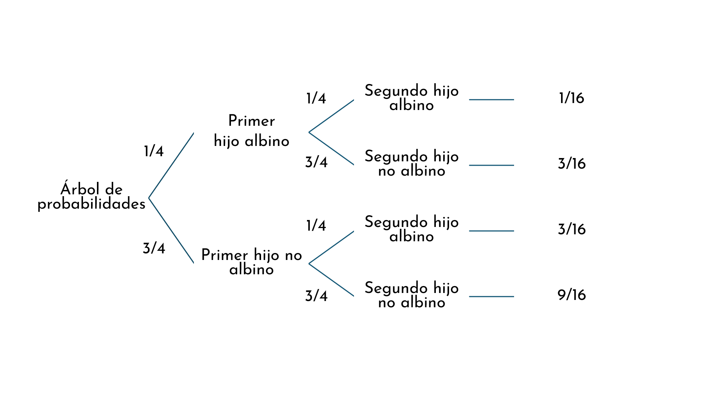
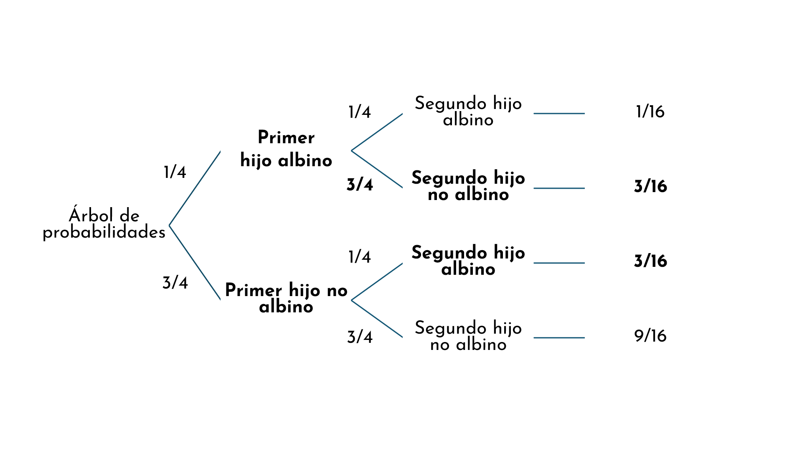

```{r setup, include=FALSE}
options(htmltools.dir.version = FALSE)
#knitr::include_graphics()
knitr::opts_chunk$set(
  cache = TRUE,
  message = FALSE, 
  warning = FALSE,
  hiline = TRUE,
  fig.retina = 5
)
library(ggplot2)
library(readr)
library(knitr)
#pagedown::chrome_print(".html")
```

```{r xaringan-themer, include=FALSE, warning=FALSE}
library(xaringanthemer)
style_mono_accent(
  base_color = "#1c5253", link_color =  "#DE1144", code_inline_color = "#DE1144",
  header_font_google = google_font("Josefin Sans"),
  text_font_google   = google_font("Montserrat", "400", "400i"),
  code_font_google   = google_font("Roboto Mono"),
    
)
```

```{r xaringanExtra-clipboard, echo=FALSE}
library(xaringanExtra)
htmltools::tagList(
  xaringanExtra::use_clipboard(
    button_text = "<i class=\"fa fa-clipboard\"></i>",
    success_text = "<i class=\"fa fa-check\" style=\"color: #90BE6D\"></i>",
  ),
  rmarkdown::html_dependency_font_awesome()
)
```


class: animated, fadeIn
# Outline

#### **1. Motivación**
#### **2. Muestreo**
#### **3. Distribuciones de probabilidad**
- Tipos
- Como medir las distribuciones

<style>
.title-slide {
  background-image: url('img/1.png');
  background-size: 100%;
}
</style>


---

layout: false
class: left, bottom, inverse, animated, bounceInDown
# 01
## Motivación

---
class: animated, fadeIn

## Distribución binomial

.pull-left[

- Modela el número de éxitos en un serie de intentos independientes, cada uno con una probabilidad de éxito constante ($p$), dentro de un tamaño fijo de muestra ($n$)

]

---
class: animated, fadeIn

## Distribución binomial

.pull-left[

- Modela el número de éxitos en un serie de intentos independientes, cada uno con una probabilidad de éxito constante ($p$), dentro de un tamaño fijo de muestra ($n$)

**Ejemplos**
- Prevalencia de una enfermedad dentro de un fijado número de pacientes
- El número de mutaciones del genoma
- Cuántas ranas capturadas son de color verde 
- Muchas preguntas en Biología pueden tener solo dos posibles respuestas (*outcomes*)
<center>

]


---
class: animated, fadeIn

## Distribución binomial

.pull-left[

- Modela el número de éxitos en un serie de intentos independientes, cada uno con una probabilidad de éxito constante ($p$), dentro de un tamaño fijo de muestra ($n$)

**Ejemplos**
- Prevalencia de una enfermedad dentro de un fijado número de pacientes
- El número de mutaciones del genoma
- Cuántas ranas capturadas son de color verde 
- Muchas preguntas en Biología pueden tener solo dos posibles respuestas (*outcomes*)
<center>

]

.pull-right[
$$
P(X = k) = \binom{n}{k} p^k (1-p)^{n-k}
$$
]
donde $n$ es el número de ranas capturadas y $p$ la probabilidad de que una rana sea verde clarito

--

```{r, echo = F, fig.height=5,fig.width=6,fig.align='center'}

library(ggplot2)

# parámetros
n <- 10        # número de capturas
p <- 1/3       # probabilidad real de rana verde clara

# posibles resultados (0 a 10 ranas claras)
x <- 0:n

# calcular probabilidades con distribución binomial
prob <- dbinom(x, size = n, prob = p)

# crear data.frame
df <- data.frame(light_frogs = x, probability = prob)

# graficar
ggplot(df, aes(x = as.integer(light_frogs), y = probability)) +
  geom_point(size = 3) +
  labs(x = "Número de ranas de color verde clarito", y = "Probabilidad") +
  ggthemes::theme_base(base_size = 16) +
  theme(panel.grid=element_blank(),
        axis.text=element_text(color="black"),
        panel.background = element_rect(fill = "white"))  +
  scale_y_continuous(breaks = seq(0, 0.4, 0.1), limits = c(0, 0.33)) +
  scale_x_continuous(breaks = 0:10, limits = c(0, 10))  +
  annotate("text", x = 7, y = 0.2, label = "p=0.3\nn=10", color = "black", size = 7)
```

]

---
class: animated, fadeIn

## Distribución binomial

.pull-left[

- Modela el número de éxitos en un serie de intentos independientes, cada uno con una probabilidad de éxito constante ($p$), dentro de un tamaño fijo de muestra ($n$)

**Ejemplos**
- Prevalencia de una enfermedad dentro de un fijado número de pacientes
- El número de mutaciones del genoma
- Cuántas ranas capturadas son de color verde 
- Muchas preguntas en Biología pueden tener solo dos posibles respuestas (*outcomes*)
<center>


]

.pull-right[
$$
P(X = k) = \binom{n}{k} p^k (1-p)^{n-k}
$$
]
donde $n$ es el número de ranas captadas y $p$ la probabilidad de que una rana sea verde clarito

```{r, echo = F, fig.height=5,fig.width=6,fig.align='center'}

library(ggplot2)

# parámetros
n <- 10        # número de capturas
p <- 1/3       # probabilidad real de rana verde clara

# posibles resultados (0 a 10 ranas claras)
x <- 0:n

# calcular probabilidades con distribución binomial
prob <- dbinom(x, size = n, prob = p)

# crear data.frame
df <- data.frame(light_frogs = x, probability = prob)

# graficar
ggplot(df, aes(x = as.integer(light_frogs), y = probability)) +
  geom_point(size = 3) +
  labs(x = "Número de ranas de color verde clarito", y = "Probabilidad") +
  ggthemes::theme_base(base_size = 16) +
  theme(panel.grid=element_blank(),
        axis.text=element_text(color="black"),
        panel.background = element_rect(fill = "white"))  +
  scale_y_continuous(breaks = seq(0, 0.4, 0.1), limits = c(0, 0.33)) +
  scale_x_continuous(breaks = 0:10, limits = c(0, 10))  +
  annotate("text", x = 7, y = 0.2, label = "p=0.4\nn=10", color = "black", size = 7) +
  # anotación para x = 3
  annotate("segment", x = 3, xend = 3, y = 0.31, yend = 0.28,
           arrow = arrow(length = unit(0.2, "cm")), color = "black") +
  annotate("text", x = 3, y = 0.32, label = "valor esperado: n×p", color = "black", size = 6) 
```

]


---
class: animated, fadeIn

## Preguntas

### Pregunta 1

**Estamos en un laboratorio de diagnóstico que recibe muestras de sangre de pacientes que ingresan en el hospital y las analiza para detectar una enfermedad. ¿Cuál de estos experimentos se puede modelar con una distribución binomial?**

1. Contar el número total de muestras que se analizan en un día.  
2. Medir el volumen (en mL) de todas las muestras de sangre.  
3. Contar el número de muestras positivas de entre 50 muestras que se analizan sucesivamente.

---
class: animated, fadeIn

## Preguntas

### Pregunta 1

**Estamos en un laboratorio de diagnóstico que recibe muestras de sangre de pacientes que ingresan en el hospital y las analiza para detectar una enfermedad. ¿Cuál de estos experimentos se puede modelar con una distribución binomial?**

1. Contar el número total de muestras que se analizan en un día. ❌
2. Medir el volumen (en mL) de todas las muestras de sangre. ❌
3. Contar el número de muestras positivas de entre 50 muestras que se analizan sucesivamente.✔️

---
class: animated, fadeIn

###  Distribucion binomial 

Cada tipo de distribución, `R` tiene cuatro funciones distintas. En el caso de la distribución binomial, todas terminan con `binom`:

- `dbinom`: función de masa/densidad de probabilidad
- `pbinom`: función de distribución acumulada 
- `qbinom`: función cuantil (inversa de la distribución acumulada)
- `rbinom`: generador de números aleatorios: simula valores de una binomial

---
class: animated, fadeIn

###  Función de densidad de probabilidad de la distribución binomial
  - Se utiliza para calcular $P(X = k)$
  - Por ejemplo: ¿Cuál es la probabilida de coger 5 ranas de color verde, si $n=10$ y $p=1/3$?

--

La fórmula general es:

$$
P(X = k) = \binom{n}{k} p^k (1-p)^{n-k}
$$

--

Aplicamos con $n=10$, $k=5$, $p=1/3$:

$$
P(X=5) = \binom{10}{5} \left(\frac{1}{3}\right)^5 \left(\frac{2}{3}\right)^5
$$


--

Coeficiente binomial:

$$
\binom{10}{5} = \frac{10!}{5!(10-5)!} = \frac{10\times9\times8\times7\times6}{5\times4\times3\times2\times1}=252 
$$

--
Resolvemos:

$$
P(X=5) = 252 \times \tfrac{1}{243} \times \tfrac{32}{243}
= \tfrac{8064}{59049} \approx 0.1366
$$

---
class: animated, fadeIn

### Función de densidad de probabilidad de la distribución binomial en R (`dbinom`)
  - Se utiliza para calcular $P(X = k)$
  - Por ejemplo: ¿Cuál es la probabilida de coger 5 ranas de color verde, si $n=10$ y $p=1/3$?

En `R`:

```{r eval = T}
dbinom(x = 5, size = 10, prob = 1/3)
```


---
class: animated, fadeIn

###  Distribucion binomial 

Cada tipo de distribución, `R` tiene cuatro funciones distintas. En el caso de la distribución binomial, todas terminan con `binom`:

- `dbinom`: función de masa/densidad de probabilidad
- `pbinom`: función de distribución acumulada 
- `qbinom`: función cuantil (inversa de la distribución acumulada)
- `rbinom`: generador de números aleatorios: simula valores de una binomial

---
class: animated, fadeIn

### Función de distribución acumulada binomial 

La función de distribución acumulada permite calcular **probabilidades de rangos**, no solo una probabilidad exacta:

- Probabilidad de hasta cierto número de éxitos: $P(X ≤ k)$

- Probabilidad de superar un valor $P(X > k)$, $P(X ≥ k)$

- O para menos que $P(X < k)$

--

<br>
- Por ejemplo: ¿cuál es la probabilidad de coger **al menos** 6 ranas? y de coger **como mucho** 5 ranas? 

  - Al menos 6 ranas: $P(X ≥ k)$
  
  - Como mucho 5 ranas: $P(X ≤ k)$


---

class: animated, fadeIn

### Función de distribución acumulada binomial 

Tabla resumen:

| Símbolo      | Significado    | Expresión | R con `pbinom`                          |
| ------------ | -------------- | -------------------------------- | --------------------------------------- |
| $P(X \le k)$ | “como mucho k” | $P(X \le k)$                    | `pbinom(k, n, p)`                       |
| $P(X < k)$   | “menos de k”   | $P(X \le k-1)$                   | `pbinom(k-1, n, p)`                     |
| $P(X \ge k)$ | “al menos k”   | $1 - P(X \le k-1)$               | `pbinom(k-1, n, p, lower.tail = FALSE)` |
| $P(X > k)$   | “más de k”     | $1 - P(X \le k)$                 | `pbinom(k, n, p, lower.tail = FALSE)`   |

--

<br>
Probabilidad de capturar como mucho 5 ranas verde claro (de 0 a 5).

--

$$
P(X ≤ 5)
$$

---

class: animated, fadeIn

###  Función de distribución acumulada binomial 

Probabilidad de capturar como mucho 5 ranas verde claro (de 0 a 5).

--

$$
P(X ≤ 5)
$$

--

.pull-left[
```{r, echo = F, fig.height=5,fig.width=6,fig.align='center'}
library(ggplot2)
library(dplyr)

# Parámetros
n <- 10
p <- 1/3

# Distribución de probabilidad
df <- data.frame(
  x = 0:n,
  prob = dbinom(0:n, size = n, prob = p)
) %>%
  mutate(destacado = x <= 5)   # Resaltar X > 5

# Probabilidad acumulada P(X > 5)
p_gt5 <- pbinom(q = 5, size = n, prob = p)

# Gráfico
ggplot(df, aes(x = factor(x), y = prob, fill = destacado)) +
  geom_col(color = "white") +
  scale_fill_manual(values = c("FALSE" = "cadetblue3", "TRUE" = "orange2"),
                    labels = c("FALSE"="Mayor a 5","TRUE"="Menor o igual a 5")) +
  labs(
    x = "Número de ranas verde clarito (X)",
    y = "P(X = k)",
    fill = "Zona"
  ) +
  theme_minimal(base_size = 14)
```
]

.pull-right[

```{r}
pbinom(q = 5, size = n, prob = p)

```


]

---

class: animated, fadeIn

### Función de distribución acumulada binomial 

Tabla resumen:

| Símbolo      | Significado    | Expresión | R con `pbinom`                          |
| ------------ | -------------- | -------------------------------- | --------------------------------------- |
| $P(X \le k)$ | “como mucho k” | $P(X \le k)$                    | `pbinom(k, n, p)`                       |
| $P(X < k)$   | “menos de k”   | $P(X \le k-1)$                   | `pbinom(k-1, n, p)`                     |
| $P(X \ge k)$ | “al menos k”   | $1 - P(X \le k-1)$               | `pbinom(k-1, n, p, lower.tail = FALSE)` |
| $P(X > k)$   | “más de k”     | $1 - P(X \le k)$                 | `pbinom(k, n, p, lower.tail = FALSE)`   |

<br>
Probabilidad de capturar más de 5 ranas verde claro (6 o más).

--

$$
P(X > 5) = 1 - P(X ≤ 5)
$$

---

class: animated, fadeIn

###  Función de distribución acumulada binomial 
Probabilidad de capturar más de 5 ranas verde claro (6 o más).

$$
P(X > 5) = 1 - P(X ≤ 5)
$$

.pull-left[
```{r, echo = F, fig.height=5,fig.width=7,fig.align='center'}
library(ggplot2)
library(dplyr)

# Parámetros
n <- 10
p <- 1/3

# Distribución de probabilidad
df <- data.frame(
  x = 0:n,
  prob = dbinom(0:n, size = n, prob = p)
) %>%
  mutate(destacado = x > 5)   # Resaltar X > 5

# Probabilidad acumulada P(X > 5)
p_gt5 <- pbinom(q = 5, size = n, prob = p, lower.tail = FALSE)

# Gráfico
ggplot(df, aes(x = factor(x), y = prob, fill = destacado)) +
  geom_col(color = "white") +
  scale_fill_manual(values = c("FALSE" = "cadetblue3", "TRUE" = "orange2"),
                    labels = c("FALSE"="Menor o igual a 5","TRUE"="Mayor a 5")) +
  labs(
    x = "Número de ranas verde clarito (X)",
    y = "P(X = k)",
    fill = "Zona"
  ) +
  theme_minimal(base_size = 14)
```
]

.pull-right[

```{r}
pbinom(q = 5,
       size = 10,
       prob = 1/3,
       lower.tail = FALSE)

```


]

---

class: animated, fadeIn

###  Distribucion binomial (`pbinom`)

| Opción                              | Cola                           | Qué calcula                                           | Ejemplo con `pbinom(q=5, n=10, p=1/3)`            |
| ----------------------------------- | ------------------------------ | ----------------------------------------------------- | ------------------------------------------------- |
| `lower.tail = TRUE` *(por defecto)* | Cola inferior | $P(X \le k)$ → probabilidad acumulada desde 0 hasta k | `pbinom(5,10,1/3)` → $P(X \le 5)$                 |
| `lower.tail = FALSE`                | Cola superior | $P(X > k)$ → probabilidad acumulada desde k+1 hasta n | `pbinom(5,10,1/3, lower.tail=FALSE)` → $P(X > 5)$ |


---

class: animated, fadeIn

###  Función de distribución acumulada binomial 

Probabilidad de capturar más de 5 ranas verde claro (6 o más).

$$
P(X > 5) = 1 - P(X ≤ 5)
$$


Si lo haces “a mano”, sin usar la función acumulada, tendrías que sumar las probabilidades puntuales desde $k$=6 hasta $k$=10.

--

En `R` sería equivalente con la función `dbinom`:

```{r}
dbinom(6, size = 10, prob = 1/3) + dbinom(7, size = 10, prob = 1/3) + 
dbinom(8, size = 10, prob = 1/3) + dbinom(9, size = 10, prob = 1/3) + 
dbinom(10, size = 10, prob = 1/3) 
  
# más elegante: sum(dbinom(6:10, size = 10, prob = 1/3))

```

```{r}
pbinom(5, size = 10, prob = 1/3, lower.tail = FALSE)
```


---

class: animated, fadeIn

###  Función de distribución acumulada binomial 

Probabilidad de capturar como mucho 5 ranas verde claro (de 0 a 5).

$$
P(X ≤ 5)
$$

Hacerlo a mano consistiría en sumar las probabilidades puntuales desde $k$=0 hasta $k$=5.

En `R` sería equivalente con la función `dbinom`:

```{r}
dbinom(0, size = 10, prob = 1/3) + dbinom(1, size = 10, prob = 1/3) + 
dbinom(2, size = 10, prob = 1/3) + dbinom(3, size = 10, prob = 1/3) +
dbinom(4, size = 10, prob = 1/3) + dbinom(5, size = 10, prob = 1/3) 
  
# más elegante: sum(dbinom(0:5, size = 10, prob = 1/3))

```

```{r}
pbinom(5, size = 10, prob = 1/3)
```


---

class: animated, fadeIn

###  Pregunta

En una población donde la prevalencia de una enfermedad es del 4%, se selecciona un grupo de 100 personas al azar.  ¿Qué comando nos da la probabilidad de que **exactamente 7** personas tengan la enfermedad?  

a) `dbinom(7, size=100, prob=0.04)` 

b) `pbinom(7, size=100, prob=0.04)` 

c) `pbinom(7, size=100, prob=0.04, lower.tail=F)` 

d) `dbinom(7, size=100, prob=0.04, lower.tail=F)` 

---

class: animated, fadeIn

###  Pregunta

En una población donde la prevalencia de una enfermedad es del 4%, se selecciona un grupo de 100 personas al azar.  ¿Qué comando nos dala probabilidad de que **exactamente 7** personas tengan la enfermedad?  

a) `dbinom(x=7, size=100, prob=0.04)` ✅ 

b) `pbinom(q=7, size=100, prob=0.04)` ❌

c) `pbinom(q=7, size=100, prob=0.04, lower.tail=F)` ❌

d) `dbinom(7, size=100, prob=0.04, lower.tail=F)` ❌

---


class: animated, fadeIn

###  Pregunta

En una población donde la prevalencia de una enfermedad es del 4%, se selecciona un grupo de 100 personas al azar.  ¿Qué comando nos dala probabilidad de que **exactamente 7** personas tengan la enfermedad?  

--

$$
X \sim \text{Binomial}(n = 100, p = 0.04)
$$
y buscamos:
$$
P(X = 7)
$$


$$
P(X = 7) = \binom{100}{7} (0.04)^7 (0.96)^{93}
$$
$$
P(X=7) = 0.058  
$$

--
En R, podemos calcular el coeficiente binomial conl a función `choose`: 

```{r}
choose(100, 7)
```


---

###  Función de distribución acumulada binomial 

Probabilidad de capturar entre 2 y 5 ranas verde claro.

$$
P(2 \le X \le 5)
$$

.pull-left[
```{r, echo = F, fig.height=5, fig.width=6, fig.align='center'}
library(ggplot2)
library(dplyr)

# Parámetros
n <- 10
p <- 1/3

# Distribución de probabilidad
df <- data.frame(
  x = 0:n,
  prob = dbinom(0:n, size = n, prob = p)
) %>%
  mutate(destacado = x >= 2 & x <= 5)   # Resaltar X entre 2 y 5

# Probabilidad acumulada P(2 <= X <= 5)
p_2_5 <- sum(dbinom(2:5, size = n, prob = p))

# Gráfico
ggplot(df, aes(x = factor(x), y = prob, fill = destacado)) +
  geom_col(color = "white") +
  scale_fill_manual(values = c("FALSE" = "cadetblue3", "TRUE" = "orange2"),
                    labels = c("FALSE"="Fuera de 2-5","TRUE"="Entre 2 y 5")) +
  labs(
    x = "Número de ranas verde clarito (X)",
    y = "P(X = k)",
    fill = "Zona"
  ) +
  theme_minimal(base_size = 14)
```
]
.pull-right[

```{r}
sum(dbinom(2:5, size = n, prob = p))

```

 
]
---

## Cálculo de la media y la varianza en una binomial

Supongamos:

- **Número de ensayos (n):**  
  $n = 10$ (por ejemplo, 10 ranas capturadas)

- **Probabilidad de “éxito” (p):**  
 $p = \frac{1}{3}$ &nbsp; (por ejemplo, que una rana realice cierta acción)

--
<br>
Si la variable aleatoria
$$
X \sim \text{Binomial}(n, p)
$$

entonces:

- **Media**  
$$
\mu = n \times p
$$

- **Varianza**  
$$
\sigma^2 = n \times p \times (1 - p)
$$

---

## Cálculo de la media y la varianza en una binomial
Para $n = 10$ y $p = \dfrac{1}{3}$:

$$
\mu = 10 \times \frac{1}{3} \approx 3.33
$$

$$
\sigma^2 = 10 \times \frac{1}{3} \times \left(1 - \frac{1}{3}\right)
= 10 \times \frac{1}{3} \times \frac{2}{3}
\approx 2.22
$$

---


## Ejemplo: albinismo

- Condición **autosómica** y **recesiva**

--

- Si **dos portadores** del gen de albinismo tienen hijos:

  - Cada hijo tiene probabilidad $p = \tfrac{1}{4}$ de ser **albino**  
  - La probabilidad es **independiente** entre hijos (modelo de ensayos independientes).  
  - $n$ = número de hijos en la familia.

--

Usando **A** = albino, **N** = no albino:

| Nº hijos | Posibles combinaciones | Probabilidades |
|--------------|------------------------|----------------|
| **1** | A , N | $P(0A) = \left(\tfrac{3}{4}\right)^1 = 0.75$ o $P(1A) = \left(\tfrac{1}{4}\right)^1 = 0.25$ |
| **2** | NN ; AN ; NA ; AA | $P(0A) = \left(\tfrac{3}{4}\right)^2 = \tfrac{9}{16}$ o $P(1A) = \binom{2}{1}\left(\tfrac{1}{4}\right)^1\left(\tfrac{3}{4}\right)^1 = \tfrac{6}{16}$ o $P(2A) = \left(\tfrac{1}{4}\right)^2 = \tfrac{1}{16}$ |


---
## Ejemplo: albinismo


| Nº hijos | Posibles combinaciones | Probabilidades |
|--------------|------------------------|----------------|
| **1** | A , N | $P(0A) = \left(\tfrac{3}{4}\right)^1 = 0.75$ o $P(1A) = \left(\tfrac{1}{4}\right)^1 = 0.25$ |
| **2** | NN ; AN ; NA ; AA | $P(0A) = \left(\tfrac{3}{4}\right)^2 = \tfrac{9}{16}$ o $P(1A) = \binom{2}{1}\left(\tfrac{1}{4}\right)^1\left(\tfrac{3}{4}\right)^1 = \tfrac{6}{16}$ o $P(2A) = \left(\tfrac{1}{4}\right)^2 = \tfrac{1}{16}$ |
| **3** | NNN ; (ANN, NAN, NNA) ; (AAN, ANA, NAA) ; AAA | $P(0A) = \left(\tfrac{3}{4}\right)^3 = \tfrac{27}{64}$ o $P(1A) = \binom{3}{1}\left(\tfrac{1}{4}\right)^1\left(\tfrac{3}{4}\right)^2 = \tfrac{27}{64}$ o $P(2A) = \binom{3}{2}\left(\tfrac{1}{4}\right)^2\left(\tfrac{3}{4}\right)^1 = \tfrac{9}{64}$ o $P(3A) = \left(\tfrac{1}{4}\right)^3 = \tfrac{1}{64}$ |
| **4** | NNNN ; … ; AAAA | $P(0A) = \left(\tfrac{3}{4}\right)^4 = \tfrac{81}{256}$ o $P(1A) = \binom{4}{1}\left(\tfrac{1}{4}\right)^1\left(\tfrac{3}{4}\right)^3 = \tfrac{108}{256}$ o $P(2A) = \binom{4}{2}\left(\tfrac{1}{4}\right)^2\left(\tfrac{3}{4}\right)^2 = \tfrac{54}{256}$ o $P(3A) = \binom{4}{3}\left(\tfrac{1}{4}\right)^3\left(\tfrac{3}{4}\right)^1 = \tfrac{12}{256}$ o $P(4A) = \left(\tfrac{1}{4}\right)^4 = \tfrac{1}{256}$ |

---

### Árbol de decisiones

<center>


--
<br>
¿Cuál es la probabilidad que una pareja portadora del gen del albisnimo tenga 2 hijos y 1 sea albino?
---

### Árbol de decisiones

<center>


--

$$
3/16 + 3/16 = 0.375
$$
---

### Problema

Supongamos que dos portadores del gen de albinismo tienen una familia de 3 hijos. ¿Cuál es la probabilidad de que exactamente un hijo sea albino?

- Resuélvelo con la fórmula de la binomial
- Resuélvelo con R


---
class: animated, fadeIn

## Contacto

<div style="margin-top: 20vh; text-align:center;">

| Marta Coronado Zamora | David Castellano | 
|:-:|:-:|
| <a href="mailto:marta.coronado@uab.cat"><i class="fa fa-paper-plane fa-fw"></i> marta.coronado@uab.cat</a> | <a href="mailto:david.castellano@uab.cat"><i class="fa fa-paper-plane fa-fw"></i>&nbsp; david.castellano@uab.cat</a> | 
| <a href="https://bsky.app/profile/geneticament.bsky.social"><i class="fab fa-bluesky fa-fw"></i>&nbsp; @geneticament.bsky.social</a> |                 <a href="https://bsky.app/profile/castellanoed.bsky.social"><i class="fab fa-bluesky fa-fw"></i>&nbsp; @castellanoed.bsky.social</a> |
| <a href="https://www.uab.cat"><i class="fa fa-map-marker fa-fw"></i>&nbsp; Universitat Autònoma de Barcelona</a> |    <a href="https://gutengroup.mcb.arizona.edu/"> <i class="fa fa-map-marker fa-fw"></i>&nbsp; University of Arizona</a> |

---
layout: false
class: left, bottom, inverse, animated, bounceInDown
### Créditos
#### Adaptado de: CSDA tutorial - Probability distributions (EMBL, Sarah Kaspar, PhD)
