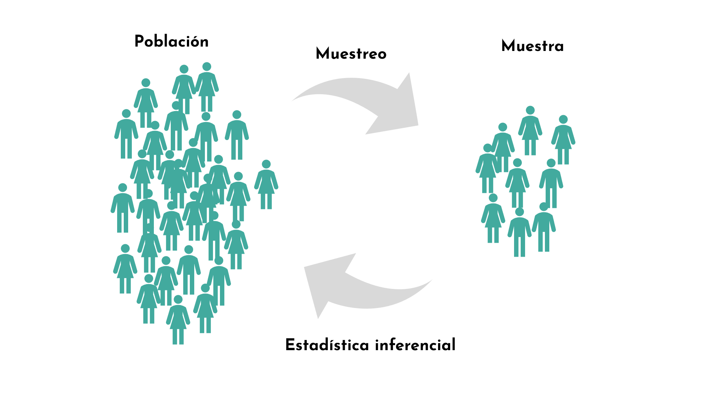
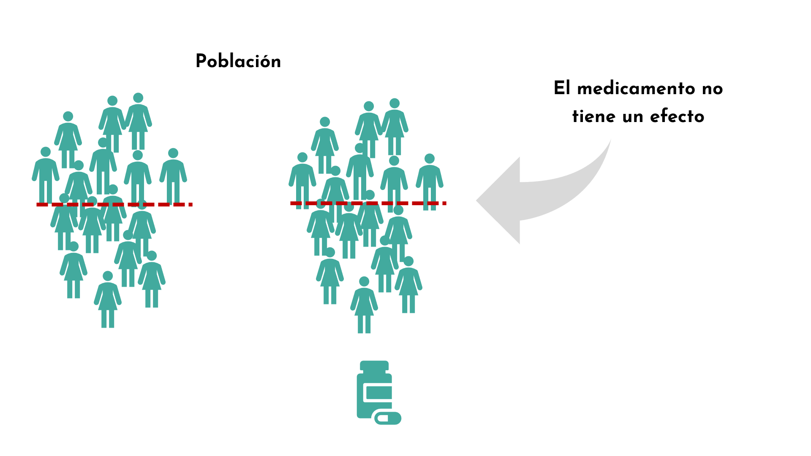
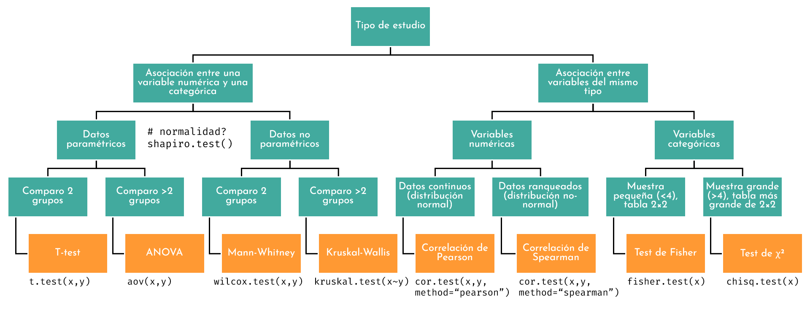

```{r setup, include=FALSE}
options(htmltools.dir.version = FALSE, width = 200)
#knitr::include_graphics()
knitr::opts_chunk$set(
  cache = TRUE,
  echo = TRUE,
  message = FALSE, 
  warning = FALSE,
  hiline = TRUE,
  fig.retina = 5

)
knitr::opts_chunk$set(
  comment = "")

library(ggplot2)
library(readr)
library(knitr)
#pagedown::chrome_print("PresentacionBioestadistica.html")
```

```{r xaringan-themer, include=FALSE, warning=FALSE}
library(xaringanthemer)
style_mono_accent(
  base_color = "#1c5253", link_color =  "#DE1144", code_inline_color = "#DE1144",
  header_font_google = google_font("Josefin Sans"),
  text_font_google   = google_font("Montserrat", "400", "400i"),
  code_font_google   = google_font("Roboto Mono"),
    
)
```


```{r xaringanExtra-clipboard, echo=FALSE}
library(xaringanExtra)
htmltools::tagList(
  xaringanExtra::use_clipboard(
    button_text = "<i class=\"fa fa-clipboard\"></i>",
    success_text = "<i class=\"fa fa-check\" style=\"color: #90BE6D\"></i>",
  ),
  rmarkdown::html_dependency_font_awesome()
)
```


class: title-slide, animated, fadeIn

.left-top[
# Inferencia estadística

]

.left-bottom[
.authors[
**Bioestadística**
<br><br><br><br>

Marta Coronado ([marta.coronado@uab.cat](mailto:marta.coronado@uab.cat))  
]

.footer-info[
**Grado en Genética | Curso 2026/2027**
]
]

.right-panel[]


<style>
.title-slide {
  background-image: none;
}

/* Contenedor teal superior (solo título) */
.title-slide .left-top {
  position: absolute;
  top: 0; left: 0;
  width: 60%;
  height: 62%;
  background-color: #163a3a;
  color: white;
  padding: 50px 45px 30px 65px;
  margin: 0;
  display: flex;
  flex-direction: column;   /* ← esto faltaba */
  align-items: flex-start;  /* ← con column, flex-end alinearía a la derecha; usa flex-start para pegar a la izquierda */
  justify-content: flex-end;
  box-sizing: border-box;
}

/* Contenedor blanco inferior (autores, fecha) */
.title-slide .left-bottom {
  position: absolute;
  bottom: 0; left: 0;
  width: 60%;
  height: 38%;
  background-color: white;
  color: #222;
  display: flex;
  flex-direction: column;
  justify-content: center;
  box-sizing: border-box;
  padding: 20px 45px 30px 65px;
  margin: 0;
}

.title-slide .right-panel {
  position: absolute;
  top: 0; right: 0; bottom: 0;
  width: 41%;
  background-color: white;
  background-image: url('img/1.png');
  background-size: contain;
  background-repeat: no-repeat;
  background-position: center;
  padding: 40px;
  box-sizing: border-box;
}

.title-slide h1 {
  font-size: 1.9em;
  line-height: 1.25;
  margin: 0;
  font-weight: 400;
}

.title-slide .subtitle {
  display: block;   /* ← esto es la clave: sin esto, margin-top se ignora */
  font-size: 2em;
  font-weight: bold;
  color: #7ac142;
  margin-top: -35px;
  margin-bottom: 15px;
}

.title-slide .authors {
  font-size: 0.95em;
  line-height: 1.6;
  margin-bottom: 12px;
}

.title-slide .authors a {
  color: #e8846b;
  text-decoration: none;
}

.title-slide .footer-info {
  font-size: 0.9em;
  color: #444;
}

.remark-slide-content h2,
.remark-slide-content h3,
.remark-slide-content h4,
.remark-slide-content h5 {
  margin-top: 1em;
  margin-bottom: 0.6em;
}

.remark-slide-content p,
.remark-slide-content ul,
.remark-slide-content ol {
  margin-top: 0.2em;
  margin-bottom: 0.2em;
}

.remark-slide-content li {
  margin-bottom: 0.1em;
}

.practica::before {
  content: "\f303";
  font-family: "Font Awesome 6 Free";
  font-weight: 900;
  position: absolute;
  top: 15px;
  right: 15px;
  font-size: 1.3em;
  color: #1c5253;
}

.R::before {
  content: "\f4f7";
  font-family: "Font Awesome 6 Brands";
  font-weight: 400;
  position: absolute;
  top: 15px;
  right: 15px;
  font-size: 1.3em;
  color: #1c5253;
}
</style>


---
class: animated, fadeIn
# Outline

#### **Inferencia estadística**
- Motivación
- Proceso de inferencia estadística
- Hipótesis
- Muestra
- Pruebas de hipótesis
- Significancia y p-valor
- Tipos de errores
- Importancia diseño de estudio
- Visión general de las pruebas estadísticas
- Data snooping/HARKing
- Relación entre las pruebas de hipótesis y los IC
- Test de dos colas y de una cola

<style>
.title-slide {
  background-image: url('img/1.png');
  background-size: 100%;
}
</style>


---
class: animated, fadeIn

## Motivación

¿Qué es un test de hipótesis? ¿por qué lo necesitamos?

<center>


---
class: animated, fadeIn

#### Ejemplo: peso de ratones

.pull-left[
```{r, echo = F, fig.height=4, fig.width=5}
url <- 'https://raw.githubusercontent.com/genomicsclass/dagdata/master/inst/extdata/mice_pheno.csv'
mice <- read.csv(url)

ggplot(mice, aes(x=Diet, y =Bodyweight, fill=Diet)) +
  geom_boxplot(show.legend = F) +
  ggthemes::theme_base(base_size = 16) +
  theme(panel.grid=element_blank(),
        axis.text=element_text(color="black"),
        panel.background = element_rect(fill = "white")) +
  scale_fill_manual(values=c("cadetblue4", "orange2"))

```

**Modelo estadístico**
$$
peso = dieta + residuos
$$
- $dieta$: promedio de los grupos
- $residuos$: siguen una distribución estadística

]

.pull-right[
**Pregunta**: hay diferencia en el peso en ratones control *vs.* con una dieta alta en grasas?

**Problema**: la diferencia en las medias puede deberse al azar:
- Solo tenemos una muestra de ratones en cada grupo de dieta
- Hay variación en los pesos

Saber las reglas de la aleatoriedad/variación nos dirá **cuán probable sería observar una diferencia así si la dieta no tuviera ningún efecto**.
]


---
class: animated, fadeIn

#### Ejemplo: peso de ratones

.pull-left[
```{r, echo = F, fig.height=4, fig.width=5}

library(gghalves)
n <- 0.1

ggplot(mice, aes(x=Diet, y =Bodyweight, fill=Diet)) +
    geom_half_boxplot(center=TRUE, errorbar.draw=FALSE,width=0.5, nudge=n,show.legend = F) +
  geom_half_violin(side="r", nudge=n,show.legend = F) +
  ggthemes::theme_base(base_size = 16) +
  theme(panel.grid=element_blank(),
        axis.text=element_text(color="black"),
        panel.background = element_rect(fill = "white")) +
  scale_fill_manual(values=c("cadetblue4", "orange2"))

```

**Modelo estadístico**
$$
peso = dieta + residuos
$$
- $dieta$: promedio de los grupos
- $residuos$: siguen una distribución estadística (no siempre siguen una distribución Gaussiana...)

]

.pull-right[
**Pregunta**: hay diferencia en el peso en ratones control *vs.* con una dieta alta en grasas?

**Problema**: la diferencia en las medias puede deberse al azar:
- Sólo tenemos una muestra de ratones en cada muestra
- Hay variación en los pesos

Saber las reglas de la aleatoriedad/variación nos dirá **cuán probable sería observar una diferencia así si la dieta no tuviera ningún efecto**.
]

---
class: animated, fadeIn


## Hipótesis nula y alternativa

#### Hipótesis nula (H₀)
- No hay diferencia entre los dos grupos de dieta. 
- Modelo nulo:  

$$
\text{peso} = \text{media general} + \text{residuos}
$$
- La media general representa promedio de todos los ratones, sin importar el grupo de dieta

--

#### Hipótesis alternativa (H₁)
- Existe una diferencia entre los dos grupos de dieta.  
- Modelo alternativo: 

$$
\text{peso} = \text{efecto de la dieta} + \text{residuos}
$$

#### Rechazo de H₀

- Rechazamos la hipótesis nula cuando, **asumiendo que H₀ es verdadera**, es muy poco probable observar una diferencia tan extrema como la que muestran nuestros datos **por azar**.

---

layout: false
class: left, bottom, inverse, animated, bounceInDown

## Proceso de inferencia estadística


---
class: animated, fadeIn

## Introducción

> La estadística inferencial se utiliza para **extraer conclusiones a partir de una muestra**.

- **Objetivo:** formular hipótesis y testarlas para hacer **generalizaciones sobre una población** a partir de una muestra.  
- **Procedimiento:** usar **muestreo aleatorio** y **pruebas de hipótesis** para evaluar la validez de hipótesis previamente establecidas.

> La estadística inferencial suele invocar **medidas de significancia estadística**.

<center>


---
class: animated, fadeIn

## Introducción

<center>


---
class: animated, fadeIn

## Introducción


<center>


---
class: animated, fadeIn

## 1. Hipótesis

#### ¿Qué es una hipótesis?

Una hipótesis es una **afirmación** sobre **un parámetro de la población** o el **fenómeno que estudiamos**, que **podemos poner a prueba con una muestra usando métodos estadísticos**.

#### ¿Por qué son importantes?

- Las hipótesis son **simplificaciones de posibles normas de procesos naturales** y permiten que las afirmaciones sean **testables**.  

- Formular la hipótesis correcta es esencial para **obtener las respuestas correctas**.  


--

**Ejemplo**:
.pull-left[
> Queremos saber si un medicamento tiene un efecto **sobre la presión arterial** en personas con hipertensión.
]
.pull-right[
<center>

]

---

class: animated, fadeIn

## 2. Muestra

- La población de estudio serán todas las personas con hipertensión de Catalunya
- Muestreamos un subconjunto 
<center>


---

class: animated, fadeIn

## 3. Prueba de hipótesis

> La **prueba de hipótesis** es un método para evaluar una afirmación sobre un **parámetro poblacional** utilizando datos **obtenidos de una muestra**.

--

- Hay muchísimas pruebas de hipótesis:
  - T-test
  - ANOVA
  - Prueba de  $\chi^2$
  - Pruebas de regresión y correlación
  - ...
  
- La elección de la prueba depende de:
  - El tipo de variable (numérica, categórica)
  - El número de grupos o comparaciones
  - Supuestos sobre la distribución de los datos (normalidad)
  - El tamaño de la muestra

En general, cada prueba está diseñada para responder una pregunta específica sobre los datos, garantizando que la inferencia sea válida.

---


class: animated, fadeIn

## 3. Prueba de hipótesis

> ¿Cómo funciona un test de hipótesis? 

Cuando llevamos a cabo una prueba de hipótesis, empezamos con una **hipótesis** de investigación, también llamada **hipótesis alternativa**.

- La hipótesis alternativa es por la que intentamos encontrar evidencia a favor.

--

Nuestra hipótesis alternativa es que **el medicamento tiene un efecto en la presión arterial**.

<center>

</center>

-  Pero no podemos demostrarla directamente: en su lugar, evaluamos si los datos son compatibles con la hipótesis contraria, **la hipótesis nula**:

---


class: animated, fadeIn

## 3. Prueba de hipótesis

> ¿Cómo funciona un test de hipótesis? 

Cuando llevamos a cabo una prueba de hipótesis, empezamos con una **hipótesis** de investigación, también llamada **hipótesis alternativa**.

- La hipótesis alternativa es por la que intentamos encontrar evidencia a favor.


**Hipótesis nula: el medicamento NO tiene un efecto sobre la presión arterial**:

<center>

</center>

---

class: animated, fadeIn

## 3. Prueba de hipótesis

<center>

</center>

---

class: animated, fadeIn

## 3. Prueba de hipótesis

- Asumimos que el medicamento no tiene un efecto sobre la población: asumimos que las personas que toman el medicamento y las que no tienen en promedio una presión sanguínea similar.

<center>

</center>

---

class: animated, fadeIn

## 3. Prueba de hipótesis

- Si cogemos una muestra al azar y observamos un efecto grande, podemos preguntarnos qué tan probable sería obtener una muestra así si el medicamento realmente no tuviera efecto.

<center>

</center>

---

class: animated, fadeIn

## 3. Prueba de hipótesis

- Si esa probabilidad es muy baja, entonces sí tenemos suficiente evidencia de que el medicamento tiene un efecto sobre la población. Rechazamos la hipótesis nula. Esta probabilidad es el **p-valor**.

<center>

</center>

---
class: animated, fadeIn

## 3. Prueba de hipótesis

1. La hipótesis nula dice que **no** hay diferencia en la población.

2. La prueba de hipótesis mide cuánto se desvía la evidencia de la muestra respecto a lo que predice la hipótesis nula.

3. El p-valor indica la probabilidad de obtener un resultado tan extremo (o más) que el observado bajo el supuesto de que la hipótesis nula es verdadera.

<center>

</center>


---
class: animated, fadeIn

## 4. Significancia y p-valor

- Si el p-valor es más pequeño que un umbral predefinido (p < 0.05) el resultado se considera estadísticamente significativo.

- Sería muy poco probable observar un resultado así si la hipótesis nula fuera cierta.

- Tenemos suficiente evidencia para rechazar la hipótesis nula.

.pull-left[
- Un p-valor pequeño (< 0.05) sugiere que:
  - Los datos observados, nuestra muestra, **son incompatibles** con la hipótesis nula
  - Rechazamos la hipótesis nula a favor de la hipótesis alternativa
]

.pull-right[
- Un p-valor grande (> 0.05) sugiere que:
  - Los datos observados son consistentes con la hipótesis nula 
  - No rechazamos la hipótesis nula (no hay evidencia suficiente a favor de la alternativa)
]

--

> **Siempre hay un riesgo de cometer un error!**

- Un p-valor pequeño NO demuestra que la hipótesis alternativa sea verdadera 
  - Solo nos dice que es muy improbable obtener un resultado como el que hemos obtenido (o más extremo) **si la hipótesis nula fuera cierta**
  
- Un p-valor grande NO demuestra que la hipótesis nula sea verdadera
  - Solo nos dice que **no es lo bastante improbable** obtener un resultado como el que hemos obtenido (o más extremo) **si la hipótesis nula fuera cierta**


---
class: animated, fadeIn

## 5. Tipos de errores

Si realizamos un test y decidimos **rechazar o no H₀**, existen cuatro posibles resultados:

| Decisión | H₀ cierta | H_A cierta |
|--------------------|---------------|-----------------|
| **No rechazamos H₀**   | Correcto (1-α)   | Error tipo II (β), falso negativo        |
| **Rechazamos H₀**       | Error tipo I (α), falso positivo       | Correcto (1-β) = potencia   |

- **Error tipo I ($\alpha$)**:
rechazamos la H₀ cuando es verdadera  
- **Error tipo II ($\beta$)**: no rechazamos H₀ cuando es falsa

<br>
**Ejemplo:**

- El medicamento no tiene un efecto y por lo tanto no hay diferencias en la presión arterial, pero en nuestra muestra los valores están tan alejados que por error pensamos que sí hay un efecto del medicamento.

- El medicamento sí tiene un efecto, y por lo tanto sí hay diferencias en la presión arterial, pero nuestra muestra no muestra diferencias claras: no rechazamos H₀ y nos perdemos un efecto que sí existe 

---
class: animated, fadeIn

## 5. Tipos de errores

### Clasificaciones incorrectas

- **Falso positivo (Error tipo I)**: rechazamos H₀ cuando es verdadera  
  - Si H₀ es cierta, ocurre en una proporción α de los casos (5% si α = 0.05)  

- **Falso negativo (error tipo II)**: no rechazamos H₀ aunque H₀ sea falsa  
  - Suele ocurrir si hay **muy pocos datos** o métodos poco sensibles  
  - Se reduce **aumentando el tamaño de muestra** o usando métodos con **mayor potencia estadística**

---
class: animated, fadeIn

## 5. Tipos de errores

```{r, echo = F, fig.align='center', fig.height=6, fig.width=12}
library(ggplot2)

# Parámetros
mu0 <- 0      # media bajo H0
mua <- 3      # media bajo Ha
sd0 <- 1      # desviación típica (igual en ambas)
crit <- 1.645  # valor crítico (alfa = 0.05, test unilateral)

# Colores
col_h0    <- "#2C7BB6"  # azul
col_ha    <- "#D95F02"  # naranja
col_alpha <- "#D7191C"  # rojo
col_beta  <- "#1A9641"  # verde

# Datos de las curvas
x  <- seq(-4, 7, length.out = 1000)
df <- data.frame(
  x    = x,
  h0   = dnorm(x, mu0, sd0),
  ha   = dnorm(x, mua, sd0)
)

# Áreas sombreadas
df_alpha <- subset(df, x >= crit)   # cola derecha de H0  -> error tipo I
df_beta  <- subset(df, x <= crit)   # cola izquierda de Ha -> error tipo II

# Probabilidades (para mostrarlas si se quiere)
alpha <- 1 - pnorm(crit, mu0, sd0)
beta  <- pnorm(crit, mua, sd0)

ggplot(df, aes(x)) +
  # Áreas
  geom_area(data = df_beta,  aes(y = ha, fill = "Error tipo II (β)"),  alpha = 0.6) +
  geom_area(data = df_alpha, aes(y = h0, fill = "Error tipo I (α)"),   alpha = 0.8) +
  # Curvas
  geom_line(aes(y = h0), colour = col_h0, linewidth = 1) +
  geom_line(aes(y = ha), colour = col_ha, linewidth = 1) +
  # Líneas verticales: medias y valor crítico
  geom_segment(aes(x = mu0, xend = mu0, y = 0, yend = dnorm(0)), colour = col_h0) +
  geom_segment(aes(x = mua, xend = mua, y = 0, yend = dnorm(0)), colour = col_ha) +
  annotate("segment", x = crit, xend = crit, y = -0.015, yend = 0.38, linetype = "dashed") +
  # Títulos de las distribuciones
  annotate("text", x = mu0, y = 0.44, label = 'paste("Distribución bajo ", H[0])',
           parse = TRUE, colour = col_h0, size = 5) +
  annotate("text", x = mua, y = 0.44, label = 'paste("Distribución bajo ", H[a])',
           parse = TRUE, colour = col_ha, size = 5) +
  # Etiquetas α y β con flechas
  annotate("text", x = crit + 1.3, y = 0.09, label = "alpha", parse = TRUE,
           colour = col_alpha, size = 7) +
  annotate("segment", x = crit + 1.1, xend = crit + 0.45, y = 0.075, yend = 0.03,
           colour = col_alpha, arrow = arrow(length = unit(0.2, "cm"))) +
  annotate("text", x = crit - 1.3, y = 0.2, label = "beta", parse = TRUE,
           colour = col_beta, size = 7) +
  annotate("segment", x = crit - 1.1, xend = crit - 0.4, y = 0.185, yend = 0.11,
           colour = col_beta, arrow = arrow(length = unit(0.2, "cm"))) +
  # Etiquetas del eje: c, H0, Ha
  annotate("text", x = crit, y = -0.035, label = "c", fontface = "italic", size = 5) +
  annotate("text", x = mu0, y = -0.035, label = "H[0]", parse = TRUE, size = 5) +
  annotate("text", x = mua, y = -0.035, label = "H[a]", parse = TRUE, size = 5) +
  # Flechas y regiones de decisión
  annotate("segment", x = crit, xend = -4, y = -0.065, yend = -0.065,
           arrow = arrow(length = unit(0.25, "cm"))) +
  annotate("segment", x = crit, xend = 7, y = -0.065, yend = -0.065,
           arrow = arrow(length = unit(0.25, "cm"))) +
  annotate("text", x = (crit - 4) / 2, y = -0.095,
           label = 'paste("Región donde NO rechazamos ", H[0])', parse = TRUE, size = 4.5) +
  annotate("text", x = (crit + 7) / 2, y = -0.095,
           label = 'paste("Región donde rechazamos ", H[0])', parse = TRUE, size = 4.5) +
  # Leyenda y tema
  scale_fill_manual(values = c("Error tipo I (α)"  = col_alpha,
                               "Error tipo II (β)" = col_beta),
                    name = NULL) +
  coord_cartesian(ylim = c(-0.11, 0.46)) +
  theme_void(base_size = 14) +
  theme(legend.position = c(0.9, 0.85))
```

**Compromiso:** si movemos *c* a la derecha, **α baja pero β sube** (y viceversa). La única forma de reducir ambos a la vez es aumentar el tamaño muestral.


---
class: animated, fadeIn

### Proceso para probar hipótesis

#### 1. Establecer la hipótesis
- Definir la **hipótesis nula (H₀)** y la **hipótesis alternativa (H₁)** **antes de ver los datos**.

#### 2. Planificación del estudio y recolección de datos
- Diseñar la **estrategia de muestreo** (aleatorio, estratificado, etc.).  
- Determinar el **tamaño de muestra** necesario según precisión deseada.  
- Recolectar los datos siguiendo **protocolos consistentes y confiables**.

#### 3. Prueba de hipótesis
- **Análisis exploratorio de datos:** inspección de distribuciones, outliers y tendencias.  
- **Visualización de datos:** histogramas, boxplots, gráficos de dispersión.  
- **Verificación de supuestos:** normalidad, homogeneidad de varianzas, independencia, etc.
- **Análisis final:** aplicar la prueba estadística adecuada y calcular p-valores o intervalos de confianza.

#### 4. Interpretación y comunicación de resultados
- Determinar si se **rechaza o no H₀** basándose en los resultados.  
- Presentar los resultados de manera clara, incluyendo **gráficos finales** y **resumen de hallazgos**.  
- Documentar **limitaciones** y posibles sesgos.


---
class: animated, fadeIn

## Importancia de un buen diseño de estudio

.pull-left[*“To call in the statistician after the experiment is done may be no more than asking them to perform a post mortem examination: they may be able to say what the experiment died of.”*

— Ronald A. Fisher 
]
.pull-right[
<center>

]

--

Al recolectar datos, asegúrate de:  

- Utilizar **estándares relevantes** y **esquemas de medición estandarizados y consistentes**.

- Asegurar **réplicas** suficientes, y un  tamaño de muestra (**n**) adecuado


---
class: animated, fadeIn

## Importancia de un buen diseño de estudio

Dependiendo de cómo esté estructurado tu proyecto, necesitarás **extraer muestras** de tus datos. Los métodos de muestreo más comunes son:

.pull-left[
#### 1. Muestreo aleatorio (*random sampling*)
- El más utilizado.  
- Todos los individuos tienen la misma probabilidad de ser seleccionados.
]

.pull-right[
#### 2. Muestreo estratificado (*stratified sampling*)
- Se usa para asegurarse de que **subgrupos específicos de la población estén bien representados** en la muestra.  
- Procedimiento:  
  1. Dividir la población en **estratos** (grupos).  
  2. Realizar **muestreo aleatorio dentro de cada estrato**.  
  3. Combinar las muestras de todos los estratos para obtener la muestra final.  
- Útil cuando se quiere **garantizar la representación de cada subgrupo y reducir la variabilidad**.
]

---
class: animated, fadeIn

<center>


---
class: animated, fadeIn

## Importancia de un buen diseño de estudio

### Supuestos de las pruebas de hipótesis

.pull-left[
Los tests estadísticos se basan en **supuestos específicos** sobre los datos. Los más importantes son:

- **Normalidad:** los datos **(o los residuos)** siguen una **distribución normal**  
- **Aleatoriedad:** **la muestra se obtiene de forma aleatoria** 
- **Independencia:** los datos son **independientes** entre sí.  
- **Homogeneidad de varianzas:** los datos de distintos grupos tienen **la misma varianza**.  
- **Linealidad:** los datos presentan una **relación lineal** cuando corresponde.
]

.pull-right[
<center>

]

---
class: animated, fadeIn


## Visión general de las pruebas estadísticas

<center>


---
class: animated, fadeIn


## Visión general de las pruebas estadísticas

.pull-left[
#### 1. Pruebas paramétricas

Requieren supuestos estrictos sobre la distribución de los datos (por ejemplo, normalidad) y generalmente comparan medias o varianzas.

- Más restrictivas: requieren supuestos sobre la distribución de los datos.  
- Fácil de interpretar.  
- Más potentes (necesitan menos datos) cuando se cumplen los supuestos.
]

.pull-right[
#### 2. Pruebas no paramétricas
No requieren supuestos fuertes sobre la distribución. Suelen basarse en **rangos** o **medianas**.

- Menos restrictivas.  
- Hacen **pocos o ningún supuesto** sobre la distribución.  
- A veces funcionan como una "caja negra" (interpretación menos directa).  
- Requieren **más datos** (menos potentes si se cumplen los supuestos paramétricos).
]

---
class: animated, fadeIn

## El p-valor

- El **p-valor** es la medida de **significancia estadística** más utilizada en la ciencia actual.  
- Un p-valor por debajo del **nivel de significancia** ($\alpha$, normalmente 0.05) indica que la prueba es **estadísticamente significativa**.  
- Los p-valores son objeto de **debate** porque:  
  - Todos buscan resultados significativos.  
  - El concepto de p-valor suele **malinterpretarse**.  

> Un p-valor **no mide la probabilidad de que la hipótesis nula sea verdadera**, sino la probabilidad de observar datos tan extremos como los obtenidos **asumiendo que H₀ es cierta**.

.pull-left[
#### Conceptos erróneos:
- “El p-valor es la probabilidad de que la hipótesis nula sea verdadera.”  
- “El p-valor es la probabilidad de que los efectos observados se hayan producido únicamente por azar.”  
- “El p-valor indica el tamaño o la importancia del efecto observado.”
]

.pull-right[
#### Concepto correcto:
-  “El p-valor es la probabilidad de obtener, de manera aleatoria, un efecto al menos tan extremo como el observado en tus datos muestrales, **asumiendo que la hipótesis nula es verdadera**.”
]

> El nivel de significancia de 0.05 es una **convención arbitraria**, no una regla absoluta.


---
class: animated, fadeIn

## *Data Snooping / HARKing*

- Decidir **qué hipótesis investigar** después de **ver los resultados**.
- El nivel de significancia ($\alpha$) ya **no es válido**, porque los datos influyen en la elección de la hipótesis. 
- Esto puede **inflar la probabilidad de obtener resultados “significativos” falsamente**.  

> HARKing: *Hypothesizing After the Results are Known*

--

.pull-left[
**Ejemplos:**

- Cambiar la hipótesis original después de ver los datos.
- Analizar subgrupos solo porque muestran un efecto “significativo”.
- Ajustar la dirección del efecto para que coincida con los resultados.

**Consecuencias:**

- Resultados engañosos o irreproducibles.
- Inflación de la tasa de falsos positivos.
- Pérdida de confianza en la investigación.
]
.pull-right[
<center>
<br>
<small>[Baker et al. 2016](https://www.nature.com/articles/533452a)
]

---

layout: false
class: left, bottom, inverse, animated, bounceInDown

## Relación entre las pruebas de hipótesis y los IC

---
class: animated, fadeIn

## Relación entre pruebas de hipótesis  y los IC

- La relación entre un test de hipótesis y el intervalo de confianza correspondiente se define por el **nivel de significancia $\alpha$**. 

- Ambos enfoques se basan en la misma lógica inferencial y difieren únicamente en la **perspectiva**.

  - El test de hipótesis evalúa si un valor específico es plausible.
  - El intervalo de confianza muestra el rango de valores plausibles para el parámetro.

---
class: animated, fadeIn

## Test de dos colas e IC

- Si queremos probar **si la media poblacional $\mu$ es distinta de un valor de referencia $\mu_0$**:  
$$
  H_0: \mu = \mu_0 \quad \text{vs.} \quad H_A: \mu \neq \mu_0
$$

- Entonces, **rechazamos H₀** al nivel de significancia $\alpha$ **si el intervalo de confianza del $100(1-\alpha)\%$ para $\mu$  no contiene $\mu_0$**.

--

Supongamos que queremos probar si la altura media de la clase difiere de 170 cm.

- Hipótesis: $H_0: \mu = 170 \quad \text{vs.} \quad H_A: \mu \neq 170$

- Tomamos una muestra de 50 estudiantes y obtenemos una media muestral $\bar{x}=166.5\text{ cm}$ y un error estándar $SE = 2\text{ cm}$.

- Calculamos el IC del 95%:
$$
IC_{95\%} = \bar{x} \pm 1.96 \times SE = 166.5 \pm 1.96 \times 2 = (162.58, 170.42)
$$
- Como $\mu_0 = 170$ **queda dentro del intervalo**, **no rechazamos $H_0$** al nivel $\alpha = 0.05$.

> Conclusión: la muestra **no proporciona evidencia suficiente** para afirmar que la altura media difiere de 170 cm.

---

class: animated, fadeIn

## Test de dos colas e IC: p-valor

- Como $\mu_0 = 170$ **queda dentro del intervalo**, **no rechazamos $H_0$** al nivel $\alpha = 0.05$.

> Conclusión: la muestra **no proporciona evidencia suficiente** para afirmar que la altura media difiere de 170 cm.

- El p-valor será > 0.05. ¿Podemos calcularlo?

--

1. Calculamos el estadístico $z$

$$
z = \frac{\bar{x}-\mu_0}{SE}=\frac{166.5-170}{2}=-1.75
$$
2. Calcular el p-valor. Como es un test de dos colas, el p-valor es la probabilidad de obtener un resultado igual o más extremo que $z$ = -1.75 en cualquiera de las dos direcciones:

$$
p = 2 \times P(Z \le -1.75) \approx 0.08
$$

---
class: animated, fadeIn

## Test de una cola y CI

Queremos probar **si la media poblacional $\mu$ es menor que un valor de referencia $\mu_0$**:
$$
  H_0: \mu = \mu_0 \quad \text{vs.} \quad H_A: \mu \lt \mu_0
$$


- Rechazamos H₀ al nivel $\alpha$ **si el límite superior del IC unilateral** es menor que $\mu_0$:  
  
$$
(-\infty, \bar{x} + m)
$$ 

--

Supongamos que queremos probar si la altura media de la clase es menor a 170 cm.

- Hipótesis: $H_0: \mu = 170 \quad \text{vs.} \quad H_A: \mu \lt 170$

- Tomamos una muestra de 50 estudiantes y obtenemos una media muestral $\bar{x}=166.5\text{ cm}$ y un error estándar $SE = 2\text{ cm}$.

- Calculamos el IC del 95% (límite superior):

$$
IC_{95\%} = (-\infty, \bar{x} + 1.645 \times SE) = (-\infty, 166.5 + 1.645 \times 2) \approx (-\infty, 169.79)
$$
- Observa que $\mu_0 = 170$ **no queda dentro del IC**, por lo que **rechazamos $H_0$** al nivel $\alpha = 0.05$.

> Conclusión: la muestra **proporciona evidencia suficiente** para afirmar que la altura media es menor de 170 cm.

---
class: animated, fadeIn

## Test de una cola y CI

```{r echo=FALSE, fig.height=5, fig.width=13, fig.align='center'}


library(ggplot2)
library(ggthemes)

# Datos
mu0 <- 170          # valor bajo H0
xbar <- 166.5       # media muestral
SE <- 2             # error estándar
alpha <- 0.05

# IC bilateral 95%
z_bilateral <- 1.96
x_lower_bi <- xbar - z_bilateral*SE
x_upper_bi <- xbar + z_bilateral*SE

# IC unilateral 95% (test inferior)
z_unilateral <- 1.645
x_upper_uni <- xbar + z_unilateral*SE

# Secuencia para curva normal de la media muestral
x <- seq(xbar - 4*SE, xbar + 4*SE, length=1000)
y <- dnorm(x, mean=xbar, sd=SE)
df <- data.frame(x=x, y=y)

# Gráfico bilateral
p_bi <- ggplot(df, aes(x=x, y=y)) +
    geom_line(size=1.2, color="black") +
    geom_area(data=subset(df, x >= x_lower_bi & x <= x_upper_bi), aes(x=x, y=y), fill="cadetblue3", alpha=0.5) +
    geom_area(data=subset(df, x < x_lower_bi), aes(x=x, y=y), fill="firebrick3", alpha=0.4) +
    geom_area(data=subset(df, x > x_upper_bi), aes(x=x, y=y), fill="firebrick3", alpha=0.4) +
    geom_vline(xintercept = c(x_lower_bi, x_upper_bi), linetype="dashed", color="firebrick3", size=1) +
    annotate("text", x=x_lower_bi - 1.5, y=max(y)*0.1, label="α/2") +
    annotate("text", x=x_upper_bi + 1.5, y=max(y)*0.1, label="α/2") +
    annotate("text", x=xbar, y=max(y)*0.5, label="95% IC", fontface="bold", color="orange4") +
    labs(title="IC bilateral de 95% (dos colas)",
         x="Altura (cm)", y="Densidad") +
    ggthemes::theme_base(base_size = 16) +
    theme(panel.grid=element_blank(),
          axis.text=element_text(color="black"),
          panel.background = element_rect(fill = "white"))

# Gráfico unilateral
p_uni <- ggplot(df, aes(x=x, y=y)) +
    geom_line(size=1.2, color="black") +
    geom_area(data=subset(df, x <= x_upper_uni), aes(x=x, y=y), fill="cadetblue3", alpha=0.5) +
    geom_area(data=subset(df, x > x_upper_uni), aes(x=x, y=y), fill="firebrick3", alpha=0.4) +
    geom_vline(xintercept = x_upper_uni, linetype="dashed", color="firebrick3", size=1) +
    annotate("text", x=x_upper_uni + 0.5, y=max(y)*0.1, label="α") +
    annotate("text", x=xbar, y=max(y)*0.5, label="95% IC unilateral", fontface="bold", color="orange4") +
    labs(title="IC unilateral de 95% (cola inferior)",
         x="Altura (cm)", y="Densidad") +
    ggthemes::theme_base(base_size = 16) +
    theme(panel.grid=element_blank(),
          axis.text=element_text(color="black"),
          panel.background = element_rect(fill = "white"))

# Mostrar ambos
library(gridExtra)
grid.arrange(p_bi, p_uni, ncol=2)
```

--

Ejemplo de **data snooping o HARKing**, hemos cambiado nuestra hipótesis para que el resultado salga significativo.

> El **segundo análisis** solo es válido si la hipótesis unilateral se planteó antes de ver los datos. Con la hipótesis bilateral, $p \approx 0.08 > 0.05$: solo al cambiar a unilateral (después de ver que $\bar{x} < 170$) sale "significativo".

---
class: animated, fadeIn

## Test de una cola y CI: p-valor

- Como $\mu_0 = 170$ **queda fuera del intervalo**, **rechazamos $H_0$** al nivel $\alpha = 0.05$.

> Conclusión: la muestra **proporciona evidencia suficiente** para afirmar que la altura media es menor de 170 cm.

- El p-valor será < 0.05. ¿Podemos calcularlo?

--

1. Calculamos el estadístico $z$

$$
z = \frac{\bar{x}-\mu_0}{SE}=\frac{166.5-170}{2}=-1.75
$$
2. Calcular el p-valor. Como es un test de una cola, el p-valor es la probabilidad de obtener un valor $z$ igual o más extremo hacia la izquierda que -1.75:

$$
p = P(Z \le -1.75) \approx 0.04
$$


---
class: animated, fadeIn

## Resumen: tests de dos y una cola

Queremos probar **si la media poblacional $\mu$ es distinta de un valor de referencia $\mu_0$**:  
$$
  H_0: \mu = \mu_0 \quad \text{vs.} \quad H_A: \mu \neq \mu_0
$$

- Rechazamos H₀ al nivel $\alpha$ si $\mu_0$ queda fuera del IC bilateral:

$$
(\bar{x} - m,\ \bar{x} + m)
$$


Queremos probar **si la media poblacional $\mu$ es menor que un valor de referencia $\mu_0$**:
$$
  H_0: \mu = \mu_0 \quad \text{vs.} \quad H_A: \mu \lt \mu_0
$$


- Rechazamos H₀ al nivel $\alpha$ **si el límite superior del IC unilateral** es menor que $\mu_0$:  
  
$$
(-\infty, \bar{x} + m)
$$ 

Queremos probar **si la media poblacional $\mu$ es mayor que un valor de referencia $\mu_0$**:
$$
  H_0: \mu = \mu_0 \quad \text{vs.} \quad H_A: \mu \gt \mu_0
$$


- Rechazamos H₀ al nivel $\alpha$ **si el límite inferior del IC unilateral** es mayor que $\mu_0$:  
  
$$
(\bar{x} - m,\infty)
$$

---
class: animated, fadeIn

## Resumen: ¿qué representa cada contraste?

```{r echo=FALSE, fig.height=5, fig.width=16, fig.align='center'}
library(ggplot2)
library(ggthemes)
library(gridExtra)

# Datos del ejemplo
mu0  <- 170         # valor bajo H0
xbar <- 166.5       # media muestral
SE   <- 2           # error estándar

# Curva normal de la media muestral
x  <- seq(xbar - 4*SE, xbar + 4*SE, length=1000)
y  <- dnorm(x, mean=xbar, sd=SE)
df <- data.frame(x=x, y=y)

# Base común a los tres gráficos
base <- ggplot(df, aes(x=x, y=y)) +
    geom_line(size=1.2, color="black") +
    ggthemes::theme_base(base_size = 14) +
    theme(panel.grid=element_blank(),
          axis.text=element_text(color="black"),
          panel.background = element_rect(fill = "white"),
          plot.subtitle = element_text(size = 11))

# Línea y etiqueta de mu0 (común a los tres)
linea_mu0 <- list(
    geom_vline(xintercept = mu0, color="black", size=1),
    annotate("text", x=mu0, y=max(y)*0.95, label="mu[0] == 170", parse=TRUE, hjust=-0.1)
)

# Subtítulo: IC y decisión
texto <- function(ic, rechaza) {
    paste0(ic, "\n", ifelse(rechaza,
           "mu0 queda fuera del IC: rechazamos H0",
           "mu0 queda dentro del IC: no rechazamos H0"))
}

# 1. Dos colas: H_A: mu != mu0
z_bi     <- 1.96
lower_bi <- xbar - z_bi*SE
upper_bi <- xbar + z_bi*SE
rech_bi  <- mu0 < lower_bi | mu0 > upper_bi

p_bi <- base +
    geom_area(data=subset(df, x >= lower_bi & x <= upper_bi), fill="cadetblue3", alpha=0.5) +
    geom_area(data=subset(df, x < lower_bi), fill="firebrick3", alpha=0.4) +
    geom_area(data=subset(df, x > upper_bi), fill="firebrick3", alpha=0.4) +
    geom_vline(xintercept=c(lower_bi, upper_bi), linetype="dashed", color="firebrick3", size=1) +
    linea_mu0 +
    annotate("text", x=lower_bi - 1.5, y=max(y)*0.1, label="α/2") +
    annotate("text", x=upper_bi + 1.5, y=max(y)*0.1, label="α/2") +
    annotate("text", x=xbar, y=max(y)*0.5, label="95% IC", fontface="bold", color="orange4") +
    labs(title=expression(paste("Dos colas: ", H[A], ": ", mu != mu[0])),
         subtitle=texto(paste0("IC = (", round(lower_bi,2), ", ", round(upper_bi,2), ")"), rech_bi),
         x="Altura (cm)", y="Densidad")

# 2. Cola inferior: H_A: mu < mu0
z_uni    <- 1.645
upper_lo <- xbar + z_uni*SE
rech_lo  <- upper_lo < mu0

p_lo <- base +
    geom_area(data=subset(df, x <= upper_lo), fill="cadetblue3", alpha=0.5) +
    geom_area(data=subset(df, x > upper_lo), fill="firebrick3", alpha=0.4) +
    geom_vline(xintercept=upper_lo, linetype="dashed", color="firebrick3", size=1) +
    linea_mu0 +
    annotate("text", x=upper_lo + 1.5, y=max(y)*0.1, label="α") +
    annotate("text", x=xbar, y=max(y)*0.5, label="95% IC unilateral", fontface="bold", color="orange4") +
    labs(title=expression(paste("Cola inferior: ", H[A], ": ", mu < mu[0])),
         subtitle=texto(paste0("IC = (-Inf, ", round(upper_lo,2), ")"), rech_lo),
         x="Altura (cm)", y="Densidad")

# 3. Cola superior: H_A: mu > mu0
lower_up <- xbar - z_uni*SE
rech_up  <- lower_up > mu0

p_up <- base +
    geom_area(data=subset(df, x >= lower_up), fill="cadetblue3", alpha=0.5) +
    geom_area(data=subset(df, x < lower_up), fill="firebrick3", alpha=0.4) +
    geom_vline(xintercept=lower_up, linetype="dashed", color="firebrick3", size=1) +
    linea_mu0 +
    annotate("text", x=lower_up - 1.5, y=max(y)*0.1, label="α") +
    annotate("text", x=xbar, y=max(y)*0.5, label="95% IC unilateral", fontface="bold", color="orange4") +
    labs(title=expression(paste("Cola superior: ", H[A], ": ", mu > mu[0])),
         subtitle=texto(paste0("IC = (", round(lower_up,2), ", Inf)"), rech_up),
         x="Altura (cm)", y="Densidad")

grid.arrange(p_bi, p_lo, p_up, ncol=3)
```

---
class: animated, fadeIn

## Contacto

<div style="margin-top: 20vh; text-align:center;">

| Marta Coronado Zamora | David Castellano | 
|:-:|:-:|
| <a href="mailto:marta.coronado@uab.cat"><i class="fa fa-paper-plane fa-fw"></i> marta.coronado@uab.cat</a> | <a href="mailto:david.castellano@uab.cat"><i class="fa fa-paper-plane fa-fw"></i>&nbsp; david.castellano@uab.cat</a> | 
| <a href="https://bsky.app/profile/geneticament.bsky.social"><i class="fab fa-bluesky fa-fw"></i>&nbsp; @geneticament.bsky.social</a> |                 <a href="https://bsky.app/profile/castellanoed.bsky.social"><i class="fab fa-bluesky fa-fw"></i>&nbsp; @castellanoed.bsky.social</a> |
| <a href="https://www.uab.cat"><i class="fa fa-map-marker fa-fw"></i>&nbsp; Universitat Autònoma de Barcelona</a> |    <a href="https://gutengroup.mcb.arizona.edu/"> <i class="fa fa-map-marker fa-fw"></i>&nbsp; University of Arizona</a> |

