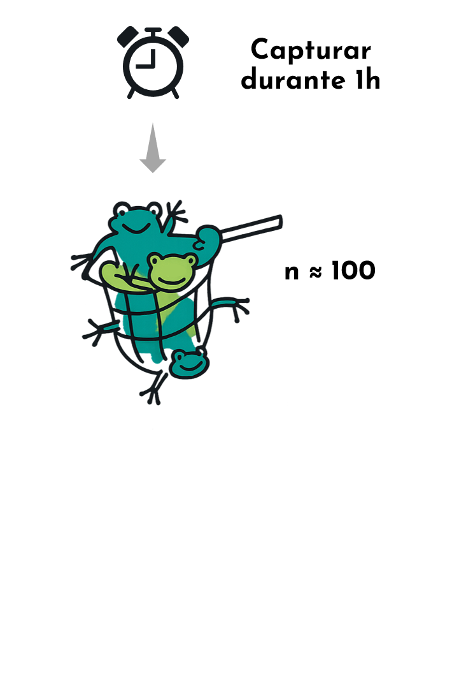
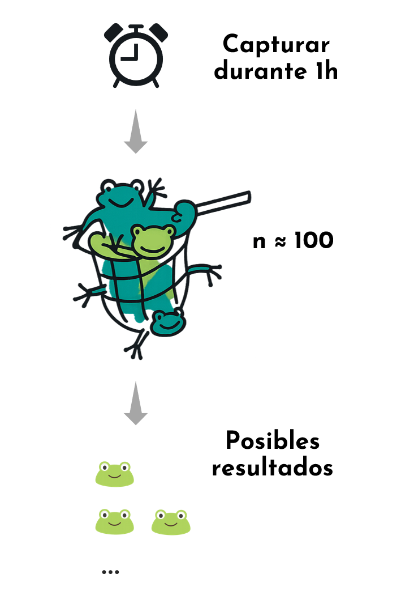
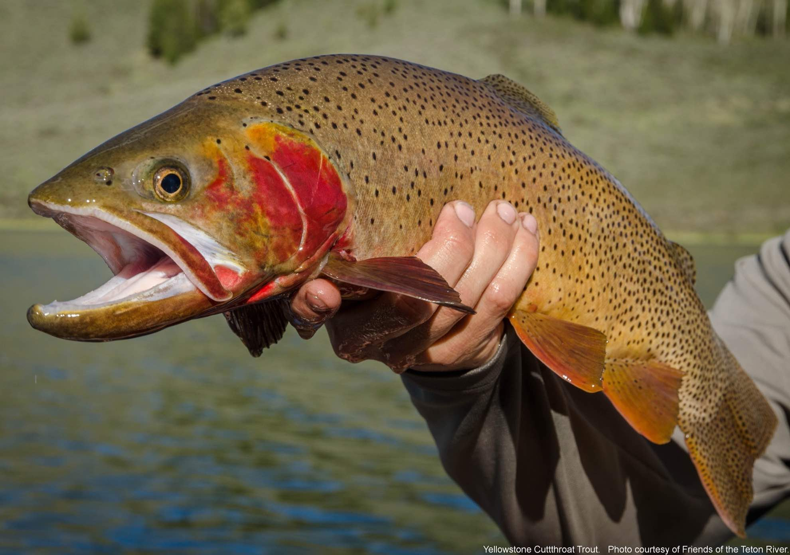

```{r setup, include=FALSE}
options(htmltools.dir.version = FALSE)
#knitr::include_graphics()
knitr::opts_chunk$set(
  cache = TRUE,
  message = FALSE, 
  warning = FALSE,
  hiline = TRUE,
  fig.retina = 5
)
library(ggplot2)
library(readr)
library(knitr)
#pagedown::chrome_print(".html")
```

```{r xaringan-themer, include=FALSE, warning=FALSE}
library(xaringanthemer)
style_mono_accent(
  base_color = "#1c5253", link_color =  "#DE1144", code_inline_color = "#DE1144",
  header_font_google = google_font("Josefin Sans"),
  text_font_google   = google_font("Montserrat", "400", "400i"),
  code_font_google   = google_font("Roboto Mono"),
    
)
```

```{r xaringanExtra-clipboard, echo=FALSE}
library(xaringanExtra)
htmltools::tagList(
  xaringanExtra::use_clipboard(
    button_text = "<i class=\"fa fa-clipboard\"></i>",
    success_text = "<i class=\"fa fa-check\" style=\"color: #90BE6D\"></i>",
  ),
  rmarkdown::html_dependency_font_awesome()
)
```


class: animated, fadeIn
# Outline

#### **Distribución de Poisson**
- Aproximación de la binomial
- Distribución de Poisson en `R`
- Ejemplos


<style>
.title-slide {
  background-image: url('img/1.png');
  background-size: 100%;
}
</style>

---
class: animated, fadeIn

## Aproximación de la distribución binomial

**Caso especial**: $n$ muy grande y $p$ pequeña

--

.pull-left[
- Capturamos 100 ranas en una hora: $n\approx100$
- la fracción de ranas de color verde es baja: $p=0.02$
]
.pull-right[
<center>

</center>
]


---
class: animated, fadeIn

## Aproximación de la distribución binomial

**Caso especial**: $n$ muy grande y $p$ pequeña

.pull-left[
- Capturamos 100 ranas en una hora: $n\approx100$
- la fracción de ranas de color verde es baja: $p=0.02$

Cuántas ranas de color verde claro esperamos capturar en 1h?

]
.pull-right[
<center>

</center>
]


---
class: animated, fadeIn

## Aproximación de la distribución binomial

**Caso especial**: $n$ muy grande y $p$ pequeña

.pull-left[
- Capturamos 100 ranas en una hora: $n\approx100$
- la fracción de ranas de color verde es baja: $p=0.02$

Cuántas ranas de color verde claro esperamos capturar en 1h?

- **El número de ranas de color verde claro por hora es**:

$$
\lambda = n \times p = 100 \times 0.02 = 2
$$

]
.pull-right[
<center>

</center>
]


---
class: animated, fadeIn

## Distribución de Poisson

.pull-left[
- Contar eventos en un dominio fijado (tiempo, espacio, volumen)
- Los eventos ocurren de manera independiente con una tasa subyacente constante ($\lambda$)


]


---
class: animated, fadeIn

## Distribución de Poisson

.pull-left[
- Contar eventos en un dominio fijado (tiempo, espacio, volumen)
- Los eventos ocurren de manera independiente con una tasa subyacente constante ($\lambda$)


**Ejemplos:**
- Número de ranas observadas en 1 hora o en una zona específica del lago.
- Número de células dentro de un volumen determinado.
- Número de mutaciones en una secuencia de DNA por unidad de tiempo.
- Número de infecciones por virus en un servidor de archivos de un centro de datos durante 24 horas.

]

--

.pull-right[

$$
P(X = k) = \frac{ e^{-\lambda} \lambda^k}{k!}
$$

donde:

- $X$: número de eventos en un intervalo dado  
- $\lambda$: tasa esperada de eventos en ese intervalo  
- $k$: número de eventos observados

```{r, echo = F, fig.height=3.7, fig.width=5, fig.align='center'}
library(ggplot2)
library(dplyr)

# Parámetros
lambdas <- c(1, 3, 7, 10)
x <- 0:25

# Crear un data frame con las distribuciones
df <- expand.grid(x = x, lambda = lambdas) %>%
    mutate(prob = dpois(x, lambda))

# Gráfico
ggplot(df, aes(x = x, y = prob, color = factor(lambda))) +
    geom_point() + geom_line()+
    scale_color_brewer(palette = "Set2", name = expression(lambda)) +
    labs(x = "Conteo de ranas",
         y = "P(X = k)") +
    ggthemes::theme_base(base_size = 16) +
  theme(panel.grid=element_blank(),
        axis.text=element_text(color="black"),
        panel.background = element_rect(fill = "white"))

```

]

---
class: animated, fadeIn

## Pregunta

**De nuevo, estamos en un laboratorio de diagnóstico que recibe muestras de sangre de pacientes hospitalarios y las analiza para detectar alguna enfermedad. ¿Cuál de estos experimentos se puede modelar con una distribución de Poisson?**

1. Contar el número de muestras que dan positivo en el transcurso de una hora.
2. Contar el número de muestras positivas de entre 50 muestras analizadas sucesivamente. 
3. Contar el número de muestras que se analizan en el transcurso de una hora. 

---
class: animated, fadeIn

## Pregunta

**De nuevo, estamos en un laboratorio de diagnóstico que recibe muestras de sangre de pacientes hospitalarios y las analiza para detectar alguna enfermedad. ¿Cuál de estos experimentos se puede modelar con una distribución de Poisson?**

1. Contar el número de muestras que dan positivo en el transcurso de una hora. ✔️
2. Contar el número de muestras positivas de entre 50 muestras analizadas sucesivamente. ✔️
3. Contar el número de muestras que se analizan en el transcurso de una hora. ✔️

---
class: animated, fadeIn

## Distribución de Pisson


$$
P(X = k) = \frac{ e^{-\lambda} \lambda^k}{k!}
$$

.pull-left[
La media de la distribución de Poisson es:

$$
\mu = \lambda
$$

]

.pull-right[
La desviación estándard es:

$$
\sigma = \sqrt{\lambda}
$$
]

--

La probabilidad de exáctamente $x$ eventos en $t$ unidades de tiempo es:

$$
P(X = k) = \frac{e^{-\lambda t} (\lambda t)^k }{k!}
$$


En $t$ unidades de tiempo, la media y desviación estandard son:

.pull-left[

$$
\mu = \lambda t
$$
]

.pull-right[
$$
\sigma = \sqrt{\lambda t}
$$
]


---
class: animated, fadeIn

## Ejemplo: Tasa de leucemia linfocítica aguda (ALL) en niños

- En niños de **0 a 14 años**, la tasa de incidencia de ALL es de  
  **30 casos diagnosticados por millón de niños al año** en la década **2000–2010**.  
- Aproximadamente un **20% de la población de EEUU** se encuentra en este rango de edad.  

--

1. ¿Cuál es la incidencia esperada en un período de **5 años**?  
2. En una población pequeña de **75,000 habitantes**, ¿cuál es la probabilidad de observar  
   **exactamente 8 casos** en un período de 5 años?  
3. En esa misma población, ¿cuál es la probabilidad de observar  
   **8 o más casos** en un período de 5 años?  


---
class: animated, fadeIn

## Ejemplo: Tasa de leucemia linfocítica aguda (ALL) en infantes

La tasa de incidencia de ALL en un año es de 30 por 1,000,000 niños:

$$
\frac{30}{1000000}=0.000003=3\times10^{-5}
$$


--
La tasa de incidencia en un periodo de 5 años es ($5\times30$) por 1,000,000 niños:

$$
\frac{150}{1000000}=0.000015=1.5\times10^{-4}
$$

--

En una ciudad de 75,000 habitantes, aproximadamente $75,000\times0.2=15,000$ niños tendrán entre 0-14 años:

La tasa de nuevos casos en 5 años en la ciudad será:

$$
1.5\times10^{-4} \times 15000 = 2.25 
$$


---
class: animated, fadeIn

## Ejemplo: Tasa de leucemia linfocítica aguda (ALL) en infantes

¿Cuál es la probabilidad de 8 casos en un periodo de 5 años?

$$
P(X = 8) = \frac{e^{-\lambda} (\lambda)^k }{k!} = \frac{e^{-2.25}2.25^8 }{8!}=0.0017
$$

--

En `R`:

Suponiendo que $X$ sigue una distribución de Poisson on parámetro $\lambda$:

```{r}
dpois(x = 8, lambda = 2.25)
```

---
class: animated, fadeIn

## Ejemplo: Tasa de leucemia linfocítica aguda (ALL) en infantes

¿Cuál es la probabilidad de 8 casos o más en un periodo de 5 años?


```{r}
ppois(q = 7, lambda = 2.25, lower.tail=FALSE) # P(X > k)
```

---
class: animated, fadeIn


### Función de distribución acumulada de Poisson

| Símbolo      | Significado    | Expresión | R con `ppois`                           |
| ------------ | -------------- | --------- | --------------------------------------- |
| $P(X \le k)$ | “como mucho k” | $P(X \le k)$ | `ppois(k, lambda)`                      |
| $P(X < k)$   | “menos de k”   | $P(X \le k-1)$ | `ppois(k-1, lambda)`                    |
| $P(X \ge k)$ | “al menos k”   | $1 - P(X \le k-1)$ | `ppois(k-1, lambda, lower.tail = FALSE)` |
| $P(X > k)$   | “más de k”     | $1 - P(X \le k)$ | `ppois(k, lambda, lower.tail = FALSE)`   |


---
class: animated, fadeIn

## Tabla resumen de las distribuciones vistas:

|                  | Binomial       | Normal       | Poisson      |
|:----------------:|:--------------:|:------------:|:------------:|
| Parámetros       | $n$, $p$           | $μ$, $σ$         |  $λ$            |
| Valores posibles  | $0, 1, ..., n$   | $(-∞, ∞)$      | $0, 1, ..., ∞$ |
| Media             | $np$             | $\mu$            | $\lambda$            |
| Desviación estándard | $\sqrt{np(1-p)}$   | $σ$            | $\sqrt{\lambda}$ ($\sqrt{\lambda t}$)           |


---
class: animated, fadeIn

# Ejercicio

.pull-left[El Lago Pyramid se encuentra en Nevada, en la reserva india Paiute. El lago se describe como una hermosa joya en un precioso entorno desértico. Además de su belleza natural, el lago alberga algunas de las truchas corteza más grandes del mundo. Cada temporada se capturan ejemplares de 5,4 a 6,8 kg como trofeos.

La Nación Paiute emplea biólogos pesqueros altamente capacitados para estudiar y mantener esta famosa pesquería.
En una de sus publicaciones, Creel Chronicle (Vol. 3, Núm. 2), se proporcionó la siguiente información sobre la captura de noviembre para los pescadores en barco:

**Pesca total por hora = 0,667 peces**

Supongamos que decides pescar en el Lago Pyramid durante 7 horas en el mes de noviembre.

]
.pull-right[
<center>

]

---
class: animated, fadeIn

# Ejercicio

.pull-left[
Usa la información proporcionada por los biólogos pesqueros en Creel Chronicle para encontrar una distribución de probabilidad para $r$, el número de peces (de todos los tamaños) que capturas en un período de 7 horas. 

1. ¿Cuál es la probabilidad de que en 7 horas pescarás al menos 3 peces de cualquier tamaño?

2. ¿Cuál es la probabilidad de pescar 4 o más peces en 7 horas?
]
.pull-right[
<center>

]


---
class: animated, fadeIn

## Contacto

<div style="margin-top: 20vh; text-align:center;">

| Marta Coronado Zamora | David Castellano | 
|:-:|:-:|
| <a href="mailto:marta.coronado@uab.cat"><i class="fa fa-paper-plane fa-fw"></i> marta.coronado@uab.cat</a> | <a href="mailto:david.castellano@uab.cat"><i class="fa fa-paper-plane fa-fw"></i>&nbsp; david.castellano@uab.cat</a> | 
| <a href="https://bsky.app/profile/geneticament.bsky.social"><i class="fab fa-bluesky fa-fw"></i>&nbsp; @geneticament.bsky.social</a> |                 <a href="https://bsky.app/profile/castellanoed.bsky.social"><i class="fab fa-bluesky fa-fw"></i>&nbsp; @castellanoed.bsky.social</a> |
| <a href="https://www.uab.cat"><i class="fa fa-map-marker fa-fw"></i>&nbsp; Universitat Autònoma de Barcelona</a> |    <a href="https://gutengroup.mcb.arizona.edu/"> <i class="fa fa-map-marker fa-fw"></i>&nbsp; University of Arizona</a> |

---
layout: false
class: left, bottom, inverse, animated, bounceInDown
### Créditos
#### Adaptado de: CSDA tutorial - Probability distributions (EMBL, Sarah Kaspar, PhD)
#### Dr. Hafid Laayouni por compartir sus materiales
