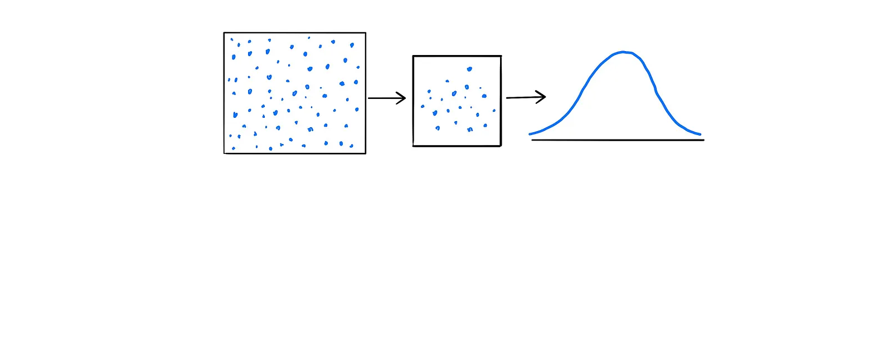
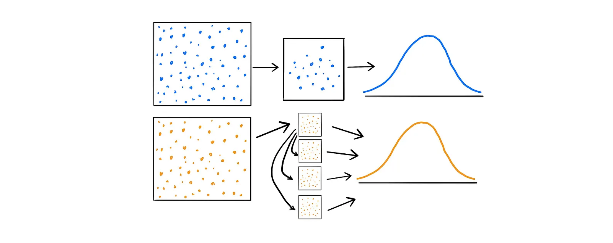
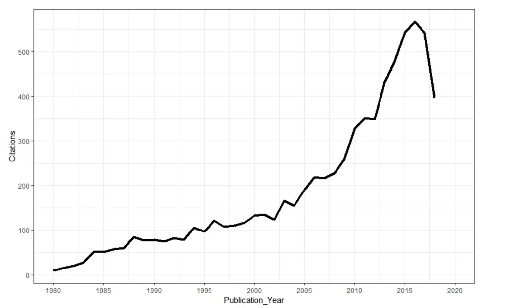
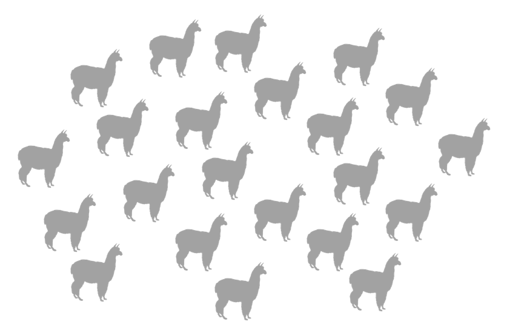
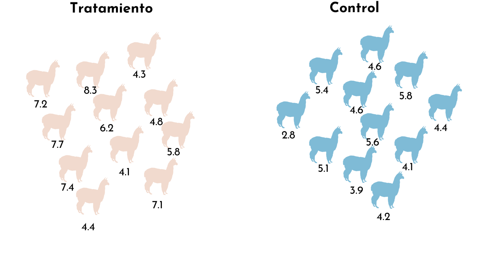
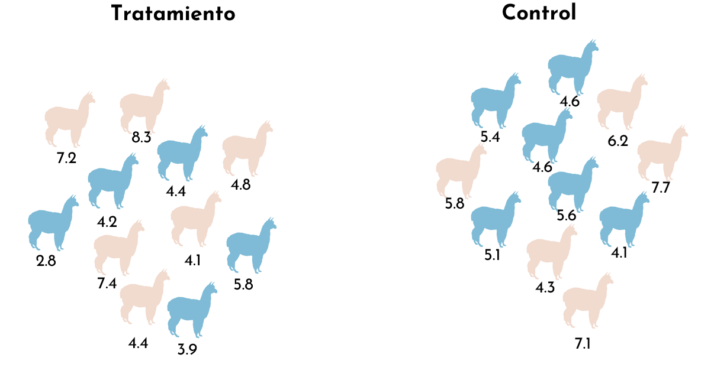
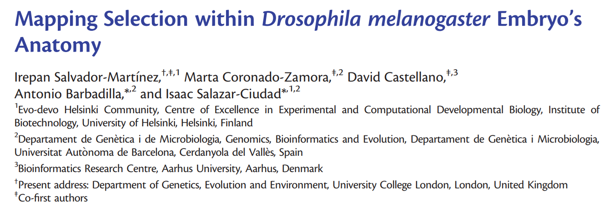
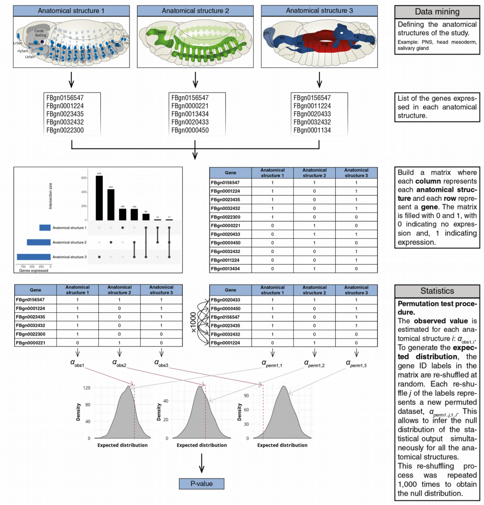
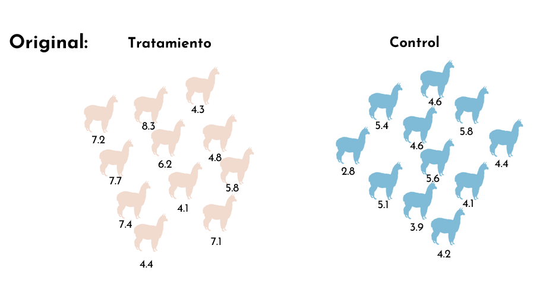
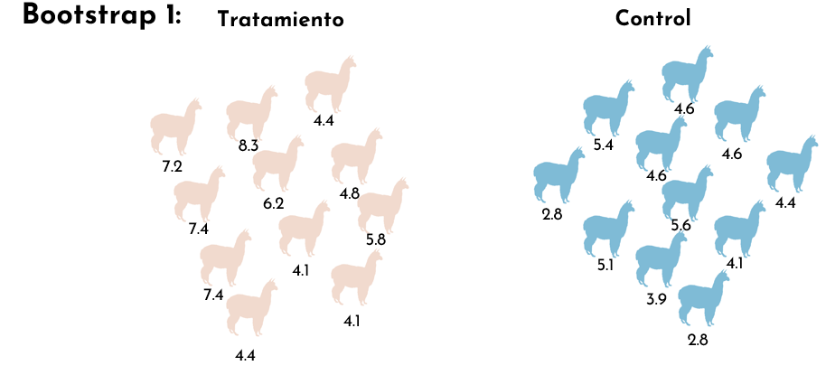

```{r setup, include=FALSE}
options(htmltools.dir.version = FALSE, width = 200)
#knitr::include_graphics()
knitr::opts_chunk$set(
  cache = TRUE,
  echo = TRUE,
  message = FALSE, 
  warning = FALSE,
  hiline = TRUE,
  fig.retina = 5

)
knitr::opts_chunk$set(
  comment = "")

library(ggplot2)
library(readr)
library(knitr)
#pagedown::chrome_print("PresentacionBioestadistica.html")
```

```{r xaringan-themer, include=FALSE, warning=FALSE}
library(xaringanthemer)
style_mono_accent(
  base_color = "#1c5253", link_color =  "#DE1144", code_inline_color = "#DE1144",
  header_font_google = google_font("Josefin Sans"),
  text_font_google   = google_font("Montserrat", "400", "400i"),
  code_font_google   = google_font("Roboto Mono"),
    
)
```


```{r xaringanExtra-clipboard, echo=FALSE}
library(xaringanExtra)
htmltools::tagList(
  xaringanExtra::use_clipboard(
    button_text = "<i class=\"fa fa-clipboard\"></i>",
    success_text = "<i class=\"fa fa-check\" style=\"color: #90BE6D\"></i>",
  ),
  rmarkdown::html_dependency_font_awesome()
)
```


class: title-slide, animated, fadeIn

.left-top[
# Bootstrap y test de permutación

]

.left-bottom[
.authors[
**Bioestadística**
<br><br><br><br>

Marta Coronado ([marta.coronado@uab.cat](mailto:marta.coronado@uab.cat))  
]

.footer-info[
**Grado en Genética | Curso 2026/2027**
]
]

.right-panel[]


<style>
.title-slide {
  background-image: none;
}

/* Contenedor teal superior (solo título) */
.title-slide .left-top {
  position: absolute;
  top: 0; left: 0;
  width: 60%;
  height: 62%;
  background-color: #163a3a;
  color: white;
  padding: 50px 45px 30px 65px;
  margin: 0;
  display: flex;
  flex-direction: column;   /* ← esto faltaba */
  align-items: flex-start;  /* ← con column, flex-end alinearía a la derecha; usa flex-start para pegar a la izquierda */
  justify-content: flex-end;
  box-sizing: border-box;
}

/* Contenedor blanco inferior (autores, fecha) */
.title-slide .left-bottom {
  position: absolute;
  bottom: 0; left: 0;
  width: 60%;
  height: 38%;
  background-color: white;
  color: #222;
  display: flex;
  flex-direction: column;
  justify-content: center;
  box-sizing: border-box;
  padding: 20px 45px 30px 65px;
  margin: 0;
}

.title-slide .right-panel {
  position: absolute;
  top: 0; right: 0; bottom: 0;
  width: 41%;
  background-color: white;
  background-image: url('img/1.png');
  background-size: contain;
  background-repeat: no-repeat;
  background-position: center;
  padding: 40px;
  box-sizing: border-box;
}

.title-slide h1 {
  font-size: 1.9em;
  line-height: 1.25;
  margin: 0;
  font-weight: 400;
}

.title-slide .subtitle {
  display: block;   /* ← esto es la clave: sin esto, margin-top se ignora */
  font-size: 2em;
  font-weight: bold;
  color: #7ac142;
  margin-top: -35px;
  margin-bottom: 15px;
}

.title-slide .authors {
  font-size: 0.95em;
  line-height: 1.6;
  margin-bottom: 12px;
}

.title-slide .authors a {
  color: #e8846b;
  text-decoration: none;
}

.title-slide .footer-info {
  font-size: 0.9em;
  color: #444;
}

.remark-slide-content h2,
.remark-slide-content h3,
.remark-slide-content h4,
.remark-slide-content h5 {
  margin-top: 1em;
  margin-bottom: 0.6em;
}

.remark-slide-content p,
.remark-slide-content ul,
.remark-slide-content ol {
  margin-top: 0.2em;
  margin-bottom: 0.2em;
}

.remark-slide-content li {
  margin-bottom: 0.1em;
}

.practica::before {
  content: "\f303";
  font-family: "Font Awesome 6 Free";
  font-weight: 900;
  position: absolute;
  top: 15px;
  right: 15px;
  font-size: 1.3em;
  color: #1c5253;
}

.R::before {
  content: "\f4f7";
  font-family: "Font Awesome 6 Brands";
  font-weight: 400;
  position: absolute;
  top: 15px;
  right: 15px;
  font-size: 1.3em;
  color: #1c5253;
}
</style>

  

---
class: animated, fadeIn
# Outline

- ¿Qué es **remuestrear**?

- ¿Por qué necesitamos **remuestrear**?

- Dos métodos:
  - _Bootstrap_
  - Test de permutación 

---
class: animated, fadeIn

## Muestra y muestreo

- Una **muestra** es un subconjunto de la población
- El **muestreo** es la selección de un subconjunto de unidades dentro de una población para estimar las características de toda la población

</img>

---
class: animated, fadeIn

## Remuestreo (_resampling_)

- **Remuestreo** consiste en muestrear una muestra 
- La **muestra original** se considera como la **población**
- Remuestrear es un método **no-paramétrico** - no asume que los datos siguen una distribución concreta (como la normal)

</img>

---
class: animated, fadeIn 

### Métodos paramétricos vs. no paramétricos

- Un método **paramétrico** asume que los datos siguen una distribución concreta, descrita por unos pocos **parámetros**

<br>
.pull-left[
**Ejemplos:**
- Distribución de Poisson: un único parámetro, λ (media de ocurrencias por unidad de tiempo)
- Distribución normal: dos parámetros, μ (media) y σ (desviación estándar)
]
.pull-right[
- Si la distribución asumida es correcta → estimaciones fiables, intervalos de confianza válidos, tests de hipótesis correctos
- Si la distribución asumida **no** es correcta → conclusiones potencialmente engañosas, intervalos de confianza inválidos
]

--

<br>
- Los métodos **no paramétricos** (o *distribution-free*), como el remuestreo, no dependen de que una distribución concreta sea la correcta

---
class: animated, fadeIn

## ¿Por qué es útil el remuestreo?

- Para casi cualquier estadístico (media, varianza) existen fórmulas clásicas que nos dan su error estándar o su intervalo de confianza

<br>
- Pero, **¿y si el estadístico que nos interesa no tiene una fórmula conocida?** (por ejemplo, la mediana)

<br>

**Otras limitaciones:**
- Los datos no siguen una distribución normal
- La muestra es pequeña
- Conseguir más datos es caro, lento o directamente imposible (secuenciar más genomas, más pacientes, ...)

--

<br>

- El remuestreo nos permite estimar la variabilidad de **cualquier** estadístico, sea cual sea su fórmula, sin asumir una distribución concreta, simplemente **recalculándolo muchas veces sobre variaciones de nuestra propia muestra**


---
class: animated, fadeIn

## Supuestos del remuestreo

- Los estadísticos muestrales son aproximaciones lo bastante buenas al estadístico poblacional como para que podamos remuestrear la muestra en lugar de la población, y aun así estimar bien los errores estándar

  - Ejemplo con la media: al remuestrear repetidamente nuestra muestra, obtenemos muchas medias distintas; asumimos que la variabilidad entre esas medias (su desviación estándar) se parece a la que tendríamos si pudiéramos repetir el muestreo directamente sobre la población real

---
class: animated, fadeIn

# Métodos de remuestreo


## *Bootstrapping*

- Se utiliza para estimar la precisión de los estadísticos muestrales extrayendo aleatoriamente, con reemplazamiento, de la muestra original

## Test de permutaciones

- Un test de hipótesis no paramétrico


---
class: animated, fadeIn


## *Bootstrapping*

**Efron & Tibsihrani (1993)**: Libro clásico que popularizó el método.

- Idea central: Remuestrear con reemplazo para estimar la distribución de un estadístico y obtener intervalos de confianza, sesgo y varianza.

> Muy flexible; necesita muestras representativas y mejor con _n_ grande; impulsado por computación y, más tarde, por big data.

</img>

---

class: animated, fadeIn

## *Bootstrapping*

.pull-left[
El objetivo de Efron fue:

> _“Poder hacer inferencia estadística usando solo la muestra disponible, como si la muestra fuera la población.”_

- Esto revolucionó la estadística computacional.
- Antes del bootstrap, los estadísticos estaban limitados por las matemáticas.
- Después del bootstrap, estaban limitados solo por la computación.
- El bootstrap se convirtió en la herramienta clave de la estadística moderna y del big data.
]

.pull-right[
</img>
<br>
Bradley Efron - Premio Nobel de estadística en 2018 por la creación del método _bootstrap_: _a method that “transformed science’s ability to use and understand data and helped usher in the era of data analysis through computing”_
]

---

class: animated, fadeIn

## *Bootstrapping*

.pull-left[
El objetivo de Efron fue:

> _“Poder hacer inferencia estadística usando solo la muestra disponible, como si la muestra fuera la población.”_

- Esto revolucionó la estadística computacional.
- Antes del bootstrap, los estadísticos estaban limitados por las matemáticas.
- Después del bootstrap, estaban limitados solo por la computación.
- El bootstrap se convirtió en la herramienta clave de la estadística moderna y del big data.
]

.pull-right[
</img>
<br>
Número de citas del paper de Efron de 1979, por año (a fecha de septiembre 2026: 30,245 citas)
]

---


class: animated, fadeIn

## *Bootstrapping*

**¿Qué significa “bootstrap” coloquialmente?**

<br>
> _“To pull oneself up by one’s own bootstraps.”_

<br>
Literalmente:

<br>
> “levantarse tirando de los cordones de tus zapatos.”

<br>
- La idea es hacer algo sin ayuda externa, usando solo lo que ya tienes. Efron usó el término porque su método hace **estadística remuestreando únicamente la muestra disponible, sin más información que los propios datos.**

- Es decir: los datos “se levantan solos”, reconstruyendo su propia variabilidad.


---
class: animated, fadeIn

## Bootstrapping

- Imagina que hemos desarrollado un nuevo medicamento para tratar una enfermedad

<center>
<h1>
💊 vs. 🦠 
</h1>
</center>

--

- Damos el medicamento a 8 personas diferentes para tratar esa enfermedad:

```{r echo = F, fig.height=1, fig.align='center', fig.width=12}

library(ggplot2)
library(patchwork)

set.seed(14)

# --- Datos originales: 8 "bolitas" con un valor y un color propio ---
n <- 8
colors8 <- c("#E8735C", "#7DBF4A", "#F2E14A", "#3FA34D",
             "#F0A8D0", "#4FA8D8", "#3D3D3D", "#F2A6A6")

original <- data.frame(
  id    = factor(1:n),
  #value = round(runif(n, -4, 4), 2),
  value = c(-3.6, -3.2, -1.8, 0.8, 1.3, 2.4, 3.2, 3.6),
  color = colors8
)

# --- Remuestreo bootstrap: se extraen 8 valores CON reemplazo ---
boot_idx <- sample(1:n, size = n, replace = TRUE)

bootstrap <- original[boot_idx, ]
bootstrap$draw <- 1:n  # posicion en la que salio en el remuestreo

# Para separar visualmente los puntos que se repiten, añadimos un
# pequeño jitter vertical proporcional a cuantas veces se repite un valor
bootstrap$y_jitter <- ave(bootstrap$value, bootstrap$value,
                           FUN = function(x) seq(0, 0.15 * (length(x) - 1), length.out = length(x)))

# --- Grafico 1: valores originales ---
p_original <- ggplot(original, aes(x = value, y = 0)) +
  geom_hline(yintercept = 0, color = "grey40", linewidth = 0.6) +
  geom_point(aes(fill = id), shape = 21, size = 8, color = "black", stroke = 0.8) +
  scale_fill_manual(values = setNames(colors8, 1:n)) +
  scale_x_continuous(limits = c(-4.5, 4.5), breaks = -4:4) +
  scale_y_continuous(limits = c(-0.5, 0.5)) +
  labs(x = NULL, y = NULL) +
  theme_minimal(base_size = 18) +
  theme(
    axis.text.y = element_blank(),
    panel.grid.major.y = element_blank(),
    panel.grid.minor = element_blank(),
    legend.position = "none"
  )

# --- Grafico 2: remuestreo bootstrap (con reemplazo) ---
p_bootstrap <- ggplot(bootstrap, aes(x = value, y = y_jitter)) +
  geom_hline(yintercept = 0, color = "grey40", linewidth = 0.6) +
  geom_point(aes(fill = id), shape = 21, size = 8, color = "black", stroke = 0.8) +
  scale_fill_manual(values = setNames(colors8, 1:n)) +
  scale_x_continuous(limits = c(-4.5, 4.5), breaks = -4:4) +
  scale_y_continuous(limits = c(-0.2, 0.8)) +
  labs(title = "Bootstrap (con reemplazo)", x = NULL, y = NULL) +
  theme_minimal(base_size = 14) +
  theme(
    axis.text.y = element_blank(),
    panel.grid.major.y = element_blank(),
    panel.grid.minor = element_blank(),
    legend.position = "none"
  )

# --- Combinar ambos graficos, uno encima del otro ---
p_original

```

--

- La media de la respuesta al fármaco es `r  round(mean(original$value),3)` 

--

<br>

- ¿Hace algo el fármaco? Quizás el incremento de 0.5 es por cosas que no podemos controlar... **¿podemos hacer algo?**

--

<br>
Sí, repetir el experimento (💸, ⏳)

--

<br>
- O utilizar ***boostrapping!***

---

class: animated, fadeIn

## Bootstrapping


```{r echo = F, fig.height=4, fig.align='center', fig.width=12}

library(ggplot2)
library(patchwork)

set.seed(14)

# --- Datos originales: 8 "bolitas" con un valor y un color propio ---
n <- 8
colors8 <- c("#E8735C", "#7DBF4A", "#F2E14A", "#3FA34D",
             "#F0A8D0", "#4FA8D8", "#3D3D3D", "#F2A6A6")

original <- data.frame(
  id    = factor(1:n),
  #value = round(runif(n, -4, 4), 2),
  value = c(-3.6, -3.2, -1.8, 0.8, 1.3, 2.4, 3.2, 3.6),
  color = colors8
)

# --- Remuestreo bootstrap: se extraen 8 valores CON reemplazo ---
boot_idx <- sample(1:n, size = n, replace = TRUE)

bootstrap <- original[boot_idx, ]
bootstrap$draw <- 1:n  # posicion en la que salio en el remuestreo

# Para separar visualmente los puntos que se repiten, añadimos un
# pequeño jitter vertical proporcional a cuantas veces se repite un valor
bootstrap$y_jitter <- ave(bootstrap$value, bootstrap$value,
                           FUN = function(x) seq(0, 0.15 * (length(x) - 1), length.out = length(x)))

# --- Grafico 1: valores originales ---
p_original <- ggplot(original, aes(x = value, y = 0)) +
  geom_hline(yintercept = 0, color = "grey40", linewidth = 0.6) +
  geom_point(aes(fill = id), shape = 21, size = 8, color = "black", stroke = 0.8) +
  scale_fill_manual(values = setNames(colors8, 1:n)) +
  scale_x_continuous(limits = c(-4.5, 4.5), breaks = -4:4) +
  scale_y_continuous(limits = c(-0.5, 0.5)) +
  labs(subtitle="Original", x = NULL, y = NULL) +
  theme_minimal(base_size = 18) +
  theme(
    axis.text.y = element_blank(),
    panel.grid.major.y = element_blank(),
    panel.grid.minor = element_blank(),
    legend.position = "none"
  )

# --- Grafico 2: remuestreo bootstrap (con reemplazo) ---
p_bootstrap <- ggplot(bootstrap, aes(x = value, y = y_jitter)) +
  geom_hline(yintercept = 0, color = "grey40", linewidth = 0.6) +
  #geom_point(aes(fill = id), shape = 21, size = 8, color = "black", stroke = 0.8) +
  scale_fill_manual(values = setNames(colors8, 1:n)) +
  scale_x_continuous(limits = c(-4.5, 4.5), breaks = -4:4) +
  scale_y_continuous(limits = c(-0.2, 0.8)) +
  labs(subtitle="Bootstrap 1", x = NULL, y = NULL) +
  theme_minimal(base_size = 18) +
  theme(
    axis.text.y = element_blank(),
    panel.grid.major.y = element_blank(),
    panel.grid.minor = element_blank(),
    legend.position = "none"
  )

# --- Combinar ambos graficos, uno encima del otro ---
p_original /
p_bootstrap
```


---

class: animated, fadeIn

## Bootstrapping


```{r echo = F, fig.height=4, fig.align='center', fig.width=12}

library(ggplot2)
library(patchwork)

set.seed(14)

# --- Datos originales: 8 "bolitas" con un valor y un color propio ---
n <- 8
colors8 <- c("#E8735C", "#7DBF4A", "#F2E14A", "#3FA34D",
             "#F0A8D0", "#4FA8D8", "#3D3D3D", "#F2A6A6")

original <- data.frame(
  id    = factor(1:n),
  #value = round(runif(n, -4, 4), 2),
  value = c(-3.6, -3.2, -1.8, 0.8, 1.3, 2.4, 3.2, 3.6),
  color = colors8
)

# --- Remuestreo bootstrap: se extraen 8 valores CON reemplazo ---
boot_idx <- sample(1:n, size = n, replace = TRUE)

bootstrap <- original[boot_idx, ]
bootstrap$draw <- 1:n  # posicion en la que salio en el remuestreo

# Para separar visualmente los puntos que se repiten, añadimos un
# pequeño jitter vertical proporcional a cuantas veces se repite un valor
bootstrap$y_jitter <- ave(bootstrap$value, bootstrap$value,
                           FUN = function(x) seq(0, 0.15 * (length(x) - 1), length.out = length(x)))

# --- Grafico 1: valores originales ---
p_original <- ggplot(original, aes(x = value, y = 0)) +
  geom_hline(yintercept = 0, color = "grey40", linewidth = 0.6) +
  geom_point(aes(fill = id), shape = 21, size = 8, color = "black", stroke = 0.8) +
  scale_fill_manual(values = setNames(colors8, 1:n)) +
  scale_x_continuous(limits = c(-4.5, 4.5), breaks = -4:4) +
  scale_y_continuous(limits = c(-0.5, 0.5)) +
  labs(subtitle="Original", x = NULL, y = NULL) +
  theme_minimal(base_size = 18) +
  theme(
    axis.text.y = element_blank(),
    panel.grid.major.y = element_blank(),
    panel.grid.minor = element_blank(),
    legend.position = "none"
  )

# --- Grafico 2: remuestreo bootstrap (con reemplazo) ---
p_bootstrap <- ggplot(head(bootstrap,1), aes(x = value, y = y_jitter)) +
  geom_hline(yintercept = 0, color = "grey40", linewidth = 0.6) +
  geom_point(aes(fill = id), shape = 21, size = 8, color = "black", stroke = 0.8) +
  scale_fill_manual(values = setNames(colors8, 1:n)) +
  scale_x_continuous(limits = c(-4.5, 4.5), breaks = -4:4) +
  scale_y_continuous(limits = c(-0.2, 0.8)) +
  labs(subtitle="Bootstrap 1", x = NULL, y = NULL) +
  theme_minimal(base_size = 18) +
  theme(
    axis.text.y = element_blank(),
    panel.grid.major.y = element_blank(),
    panel.grid.minor = element_blank(),
    legend.position = "none"
  )

# --- Combinar ambos graficos, uno encima del otro ---
p_original /
p_bootstrap
```


---

class: animated, fadeIn

## Bootstrapping


```{r echo = F, fig.height=4, fig.align='center', fig.width=12}

library(ggplot2)
library(patchwork)

set.seed(14)

# --- Datos originales: 8 "bolitas" con un valor y un color propio ---
n <- 8
colors8 <- c("#E8735C", "#7DBF4A", "#F2E14A", "#3FA34D",
             "#F0A8D0", "#4FA8D8", "#3D3D3D", "#F2A6A6")

original <- data.frame(
  id    = factor(1:n),
  #value = round(runif(n, -4, 4), 2),
  value = c(-3.6, -3.2, -1.8, 0.8, 1.3, 2.4, 3.2, 3.6),
  color = colors8
)

# --- Remuestreo bootstrap: se extraen 8 valores CON reemplazo ---
boot_idx <- sample(1:n, size = n, replace = TRUE)

bootstrap <- original[boot_idx, ]
bootstrap$draw <- 1:n  # posicion en la que salio en el remuestreo

# Para separar visualmente los puntos que se repiten, añadimos un
# pequeño jitter vertical proporcional a cuantas veces se repite un valor
bootstrap$y_jitter <- ave(bootstrap$value, bootstrap$value,
                           FUN = function(x) seq(0, 0.15 * (length(x) - 1), length.out = length(x)))

# --- Grafico 1: valores originales ---
p_original <- ggplot(original, aes(x = value, y = 0)) +
  geom_hline(yintercept = 0, color = "grey40", linewidth = 0.6) +
  geom_point(aes(fill = id), shape = 21, size = 8, color = "black", stroke = 0.8) +
  scale_fill_manual(values = setNames(colors8, 1:n)) +
  scale_x_continuous(limits = c(-4.5, 4.5), breaks = -4:4) +
  scale_y_continuous(limits = c(-0.5, 0.5)) +
  labs(subtitle="Original", x = NULL, y = NULL) +
  theme_minimal(base_size = 18) +
  theme(
    axis.text.y = element_blank(),
    panel.grid.major.y = element_blank(),
    panel.grid.minor = element_blank(),
    legend.position = "none"
  )

# --- Grafico 2: remuestreo bootstrap (con reemplazo) ---
p_bootstrap <- ggplot(bootstrap[c(1,3),], aes(x = value, y = y_jitter)) +
  geom_hline(yintercept = 0, color = "grey40", linewidth = 0.6) +
  geom_point(aes(fill = id), shape = 21, size = 8, color = "black", stroke = 0.8) +
  scale_fill_manual(values = setNames(colors8, 1:n)) +
  scale_x_continuous(limits = c(-4.5, 4.5), breaks = -4:4) +
  scale_y_continuous(limits = c(-0.2, 0.8)) +
  labs(subtitle="Bootstrap 1", x = NULL, y = NULL) +
  theme_minimal(base_size = 18) +
  theme(
    axis.text.y = element_blank(),
    panel.grid.major.y = element_blank(),
    panel.grid.minor = element_blank(),
    legend.position = "none"
  )

# --- Combinar ambos graficos, uno encima del otro ---
p_original /
p_bootstrap
```


---

class: animated, fadeIn

## Bootstrapping


```{r echo = F, fig.height=4, fig.align='center', fig.width=12}

library(ggplot2)
library(patchwork)

set.seed(14)

# --- Datos originales: 8 "bolitas" con un valor y un color propio ---
n <- 8
colors8 <- c("#E8735C", "#7DBF4A", "#F2E14A", "#3FA34D",
             "#F0A8D0", "#4FA8D8", "#3D3D3D", "#F2A6A6")

original <- data.frame(
  id    = factor(1:n),
  #value = round(runif(n, -4, 4), 2),
  value = c(-3.6, -3.2, -1.8, 0.8, 1.3, 2.4, 3.2, 3.6),
  color = colors8
)

# --- Remuestreo bootstrap: se extraen 8 valores CON reemplazo ---
boot_idx <- sample(1:n, size = n, replace = TRUE)

bootstrap <- original[boot_idx, ]
bootstrap$draw <- 1:n  # posicion en la que salio en el remuestreo

# Para separar visualmente los puntos que se repiten, añadimos un
# pequeño jitter vertical proporcional a cuantas veces se repite un valor
bootstrap$y_jitter <- ave(bootstrap$value, bootstrap$value,
                           FUN = function(x) seq(0, 0.15 * (length(x) - 1), length.out = length(x)))

# --- Grafico 1: valores originales ---
p_original <- ggplot(original, aes(x = value, y = 0)) +
  geom_hline(yintercept = 0, color = "grey40", linewidth = 0.6) +
  geom_point(aes(fill = id), shape = 21, size = 8, color = "black", stroke = 0.8) +
  scale_fill_manual(values = setNames(colors8, 1:n)) +
  scale_x_continuous(limits = c(-4.5, 4.5), breaks = -4:4) +
  scale_y_continuous(limits = c(-0.5, 0.5)) +
  labs(subtitle="Original", x = NULL, y = NULL) +
  theme_minimal(base_size = 18) +
  theme(
    axis.text.y = element_blank(),
    panel.grid.major.y = element_blank(),
    panel.grid.minor = element_blank(),
    legend.position = "none"
  )

# --- Grafico 2: remuestreo bootstrap (con reemplazo) ---
p_bootstrap <- ggplot(head(bootstrap,3), aes(x = value, y = y_jitter)) +
  geom_hline(yintercept = 0, color = "grey40", linewidth = 0.6) +
  geom_point(aes(fill = id), shape = 21, size = 8, color = "black", stroke = 0.8) +
  scale_fill_manual(values = setNames(colors8, 1:n)) +
  scale_x_continuous(limits = c(-4.5, 4.5), breaks = -4:4) +
  scale_y_continuous(limits = c(-0.2, 0.8)) +
  labs(subtitle="Bootstrap 1", x = NULL, y = NULL) +
  theme_minimal(base_size = 18) +
  theme(
    axis.text.y = element_blank(),
    panel.grid.major.y = element_blank(),
    panel.grid.minor = element_blank(),
    legend.position = "none"
  )

# --- Combinar ambos graficos, uno encima del otro ---
p_original /
p_bootstrap
```


---

class: animated, fadeIn

## Bootstrapping


```{r echo = F, fig.height=4, fig.align='center', fig.width=12}

library(ggplot2)
library(patchwork)

set.seed(14)

# --- Datos originales: 8 "bolitas" con un valor y un color propio ---
n <- 8
colors8 <- c("#E8735C", "#7DBF4A", "#F2E14A", "#3FA34D",
             "#F0A8D0", "#4FA8D8", "#3D3D3D", "#F2A6A6")

original <- data.frame(
  id    = factor(1:n),
  #value = round(runif(n, -4, 4), 2),
  value = c(-3.6, -3.2, -1.8, 0.8, 1.3, 2.4, 3.2, 3.6),
  color = colors8
)

# --- Remuestreo bootstrap: se extraen 8 valores CON reemplazo ---
boot_idx <- sample(1:n, size = n, replace = TRUE)

bootstrap <- original[boot_idx, ]
bootstrap$draw <- 1:n  # posicion en la que salio en el remuestreo

# Para separar visualmente los puntos que se repiten, añadimos un
# pequeño jitter vertical proporcional a cuantas veces se repite un valor
bootstrap$y_jitter <- ave(bootstrap$value, bootstrap$value,
                           FUN = function(x) seq(0, 0.15 * (length(x) - 1), length.out = length(x)))

# --- Grafico 1: valores originales ---
p_original <- ggplot(original, aes(x = value, y = 0)) +
  geom_hline(yintercept = 0, color = "grey40", linewidth = 0.6) +
  geom_point(aes(fill = id), shape = 21, size = 8, color = "black", stroke = 0.8) +
  scale_fill_manual(values = setNames(colors8, 1:n)) +
  scale_x_continuous(limits = c(-4.5, 4.5), breaks = -4:4) +
  scale_y_continuous(limits = c(-0.5, 0.5)) +
  labs(subtitle="Original", x = NULL, y = NULL) +
  theme_minimal(base_size = 18) +
  theme(
    axis.text.y = element_blank(),
    panel.grid.major.y = element_blank(),
    panel.grid.minor = element_blank(),
    legend.position = "none"
  )

# --- Grafico 2: remuestreo bootstrap (con reemplazo) ---
p_bootstrap <- ggplot(bootstrap, aes(x = value, y = y_jitter)) +
  geom_hline(yintercept = 0, color = "grey40", linewidth = 0.6) +
  geom_point(aes(fill = id), shape = 21, size = 8, color = "black", stroke = 0.8) +
  scale_fill_manual(values = setNames(colors8, 1:n)) +
  scale_x_continuous(limits = c(-4.5, 4.5), breaks = -4:4) +
  scale_y_continuous(limits = c(-0.2, 0.8)) +
  labs(subtitle="Bootstrap 1", x = NULL, y = NULL) +
  theme_minimal(base_size = 18) +
  theme(
    axis.text.y = element_blank(),
    panel.grid.major.y = element_blank(),
    panel.grid.minor = element_blank(),
    legend.position = "none"
  )

# --- Combinar ambos graficos, uno encima del otro ---
p_original /
p_bootstrap
```

--

- Escogemos hasta 8 valores (porque la muestra original son 8)
- Siempre volvemos a escoger de todos los valores posibles
- Pueden haber datos repetidos (muestreo con reemplazamiento, _sampling with replacement_)

> Este nuevo conjunto de datos, creado con muestreo con reemplazamiento, se llama "muestra _bootstrap_"

---


class: animated, fadeIn

## Bootstrapping


```{r echo = F, fig.height=4, fig.align='center', fig.width=12}

library(ggplot2)
library(patchwork)

set.seed(14)

# --- Datos originales: 8 "bolitas" con un valor y un color propio ---
n <- 8
colors8 <- c("#E8735C", "#7DBF4A", "#F2E14A", "#3FA34D",
             "#F0A8D0", "#4FA8D8", "#3D3D3D", "#F2A6A6")

original <- data.frame(
  id    = factor(1:n),
  #value = round(runif(n, -4, 4), 2),
  value = c(-3.6, -3.2, -1.8, 0.8, 1.3, 2.4, 3.2, 3.6),
  color = colors8
)

# --- Remuestreo bootstrap: se extraen 8 valores CON reemplazo ---
boot_idx <- sample(1:n, size = n, replace = TRUE)

bootstrap <- original[boot_idx, ]
bootstrap$draw <- 1:n  # posicion en la que salio en el remuestreo

# Para separar visualmente los puntos que se repiten, añadimos un
# pequeño jitter vertical proporcional a cuantas veces se repite un valor
bootstrap$y_jitter <- ave(bootstrap$value, bootstrap$value,
                           FUN = function(x) seq(0, 0.15 * (length(x) - 1), length.out = length(x)))

# --- Grafico 1: valores originales ---
p_original <- ggplot(original, aes(x = value, y = 0)) +
  geom_hline(yintercept = 0, color = "grey40", linewidth = 0.6) +
  geom_point(aes(fill = id), shape = 21, size = 8, color = "black", stroke = 0.8) +
  scale_fill_manual(values = setNames(colors8, 1:n)) +
  scale_x_continuous(limits = c(-4.5, 4.5), breaks = -4:4) +
  scale_y_continuous(limits = c(-0.5, 0.5)) +
  labs(subtitle="Original", x = NULL, y = NULL) +
  theme_minimal(base_size = 18) +
  theme(
    axis.text.y = element_blank(),
    panel.grid.major.y = element_blank(),
    panel.grid.minor = element_blank(),
    legend.position = "none"
  )

# --- Grafico 2: remuestreo bootstrap (con reemplazo) ---
p_bootstrap <- ggplot(bootstrap, aes(x = value, y = y_jitter)) +
  geom_hline(yintercept = 0, color = "grey40", linewidth = 0.6) +
  geom_point(aes(fill = id), shape = 21, size = 8, color = "black", stroke = 0.8) +
  scale_fill_manual(values = setNames(colors8, 1:n)) +
  scale_x_continuous(limits = c(-4.5, 4.5), breaks = -4:4) +
  scale_y_continuous(limits = c(-0.2, 0.8)) +
  labs(subtitle="Bootstrap 1", x = NULL, y = NULL) +
  theme_minimal(base_size = 18) +
  theme(
    axis.text.y = element_blank(),
    panel.grid.major.y = element_blank(),
    panel.grid.minor = element_blank(),
    legend.position = "none"
  )

# --- Combinar ambos graficos, uno encima del otro ---
p_original /
p_bootstrap
```

- La media de la muestra _bootstrap_ es `r round(mean(bootstrap$value),3)`

--

- Repetimos el proceso

---


class: animated, fadeIn

## Bootstrapping


```{r echo = F, fig.height=5, fig.align='center', fig.width=12}

library(ggplot2)
library(patchwork)

set.seed(14)

# --- Datos originales: 8 "bolitas" con un valor y un color propio ---
n <- 8
colors8 <- c("#E8735C", "#7DBF4A", "#F2E14A", "#3FA34D",
             "#F0A8D0", "#4FA8D8", "#3D3D3D", "#F2A6A6")

original <- data.frame(
  id    = factor(1:n),
  #value = round(runif(n, -4, 4), 2),
  value = c(-3.6, -3.2, -1.8, 0.8, 1.3, 2.4, 3.2, 3.6),
  color = colors8
)

# --- Remuestreo bootstrap: se extraen 8 valores CON reemplazo ---
boot_idx <- sample(1:n, size = n, replace = TRUE)

bootstrap <- original[boot_idx, ]
bootstrap$draw <- 1:n  # posicion en la que salio en el remuestreo

# Para separar visualmente los puntos que se repiten, añadimos un
# pequeño jitter vertical proporcional a cuantas veces se repite un valor
bootstrap$y_jitter <- ave(bootstrap$value, bootstrap$value,
                           FUN = function(x) seq(0, 0.15 * (length(x) - 1), length.out = length(x)))

# --- Remuestreo bootstrap: se extraen 8 valores CON reemplazo ---
boot_idx <- sample(1:n, size = n, replace = TRUE)

bootstrap2 <- original[boot_idx, ]
bootstrap2$draw <- 1:n  # posicion en la que salio en el remuestreo

# Para separar visualmente los puntos que se repiten, añadimos un
# pequeño jitter vertical proporcional a cuantas veces se repite un valor
bootstrap2$y_jitter <- ave(bootstrap2$value, bootstrap2$value,
                           FUN = function(x) seq(0, 0.15 * (length(x) - 1), length.out = length(x)))

# --- Grafico 1: valores originales ---
p_original <- ggplot(original, aes(x = value, y = 0)) +
  geom_hline(yintercept = 0, color = "grey40", linewidth = 0.6) +
  geom_point(aes(fill = id), shape = 21, size = 8, color = "black", stroke = 0.8) +
  scale_fill_manual(values = setNames(colors8, 1:n)) +
  scale_x_continuous(limits = c(-4.5, 4.5), breaks = -4:4) +
  scale_y_continuous(limits = c(-0.5, 0.5)) +
  labs(subtitle="Original", x = NULL, y = NULL) +
  theme_minimal(base_size = 18) +
  theme(
    axis.text.y = element_blank(),
    panel.grid.major.y = element_blank(),
    panel.grid.minor = element_blank(),
    legend.position = "none"
  )

# --- Grafico 2: remuestreo bootstrap (con reemplazo) ---
p_bootstrap <- ggplot(bootstrap, aes(x = value, y = y_jitter)) +
  geom_hline(yintercept = 0, color = "grey40", linewidth = 0.6) +
  geom_point(aes(fill = id), shape = 21, size = 8, color = "black", stroke = 0.8) +
  scale_fill_manual(values = setNames(colors8, 1:n)) +
  scale_x_continuous(limits = c(-4.5, 4.5), breaks = -4:4) +
  scale_y_continuous(limits = c(-0.2, 0.8)) +
  labs(subtitle="Bootstrap 1", x = NULL, y = NULL) +
  theme_minimal(base_size = 18) +
  theme(
    axis.text.y = element_blank(),
    panel.grid.major.y = element_blank(),
    panel.grid.minor = element_blank(),
    legend.position = "none"
  )

# --- Grafico 2: remuestreo bootstrap (con reemplazo) ---
p_bootstrap2 <- ggplot(bootstrap2, aes(x = value, y = y_jitter)) +
  geom_hline(yintercept = 0, color = "grey40", linewidth = 0.6) +
  geom_point(aes(fill = id), shape = 21, size = 8, color = "black", stroke = 0.8) +
  scale_fill_manual(values = setNames(colors8, 1:n)) +
  scale_x_continuous(limits = c(-4.5, 4.5), breaks = -4:4) +
  scale_y_continuous(limits = c(-0.2, 0.8)) +
  labs(subtitle="Bootstrap 2", x = NULL, y = NULL) +
  theme_minimal(base_size = 18) +
  theme(
    axis.text.y = element_blank(),
    panel.grid.major.y = element_blank(),
    panel.grid.minor = element_blank(),
    legend.position = "none"
  )
# --- Combinar ambos graficos, uno encima del otro ---
p_original /
p_bootstrap /
p_bootstrap2
```


---


class: animated, fadeIn

## Bootstrapping


```{r echo = F, fig.height=5, fig.align='center', fig.width=12}
library(ggplot2)
library(patchwork)

set.seed(14)

# --- Datos originales: 8 "bolitas" con un valor y un color propio ---
n <- 8
colors8 <- c("#E8735C", "#7DBF4A", "#F2E14A", "#3FA34D",
             "#F0A8D0", "#4FA8D8", "#3D3D3D", "#F2A6A6")

original <- data.frame(
  id    = factor(1:n),
  value = c(-3.6, -3.2, -1.8, 0.8, 1.3, 2.4, 3.2, 3.6),
  color = colors8
)

mean_original <- mean(original$value)

# --- Remuestreo bootstrap 1: se extraen 8 valores CON reemplazo ---
boot_idx <- sample(1:n, size = n, replace = TRUE)

bootstrap <- original[boot_idx, ]
bootstrap$draw <- 1:n

bootstrap$y_jitter <- ave(bootstrap$value, bootstrap$value,
                           FUN = function(x) seq(0, 0.15 * (length(x) - 1), length.out = length(x)))

mean_boot1 <- mean(bootstrap$value)

# --- Remuestreo bootstrap 2: se extraen 8 valores CON reemplazo ---
boot_idx <- sample(1:n, size = n, replace = TRUE)

bootstrap2 <- original[boot_idx, ]
bootstrap2$draw <- 1:n

bootstrap2$y_jitter <- ave(bootstrap2$value, bootstrap2$value,
                            FUN = function(x) seq(0, 0.15 * (length(x) - 1), length.out = length(x)))

mean_boot2 <- mean(bootstrap2$value)

# --- Etiquetas de texto con la media, redondeada a maximo 3 decimales ---
label_original <- paste0("mean = ", round(mean_original, 3))
label_boot1    <- paste0("mean = ", round(mean_boot1, 3))
label_boot2    <- paste0("mean = ", round(mean_boot2, 3))

# --- Grafico 1: valores originales ---
p_original <- ggplot(original, aes(x = value, y = 0)) +
  geom_hline(yintercept = 0, color = "grey40", linewidth = 0.6) +
  geom_point(aes(fill = id), shape = 21, size = 8, color = "black", stroke = 0.8) +
  geom_vline(xintercept = mean_original, color = "red", linewidth = 1.3) +
  annotate("text", x = mean_original, y = 0.35, label = label_original,
           color = "red", fontface = "bold", size = 5, hjust = -0.1) +
  scale_fill_manual(values = setNames(colors8, 1:n)) +
  scale_x_continuous(limits = c(-4.5, 4.5), breaks = -4:4) +
  scale_y_continuous(limits = c(-0.5, 0.5)) +
  labs(subtitle="Original", x = NULL, y = NULL) +
  theme_minimal(base_size = 18) +
  theme(
    axis.text.y = element_blank(),
    panel.grid.major.y = element_blank(),
    panel.grid.minor = element_blank(),
    legend.position = "none"
  )

# --- Grafico 2: remuestreo bootstrap 1, con linea y etiqueta salmon ---
p_bootstrap <- ggplot(bootstrap, aes(x = value, y = y_jitter)) +
  geom_hline(yintercept = 0, color = "grey40", linewidth = 0.6) +
  geom_vline(xintercept = mean_boot1, color = "salmon", linewidth = 1.3) +
  annotate("text", x = mean_boot1, y = 0.5, label = label_boot1,
           color = "salmon", fontface = "bold", size = 5, hjust = -0.1) +
  geom_point(aes(fill = id), shape = 21, size = 8, color = "black", stroke = 0.8) +
  scale_fill_manual(values = setNames(colors8, 1:n)) +
  scale_x_continuous(limits = c(-4.5, 4.5), breaks = -4:4) +
  scale_y_continuous(limits = c(-0.2, 0.8)) +
  labs(subtitle="Bootstrap 1", x = NULL, y = NULL) +
  theme_minimal(base_size = 18) +
  theme(
    axis.text.y = element_blank(),
    panel.grid.major.y = element_blank(),
    panel.grid.minor = element_blank(),
    legend.position = "none"
  )

# --- Grafico 3: remuestreo bootstrap 2, con linea y etiqueta salmon ---
p_bootstrap2 <- ggplot(bootstrap2, aes(x = value, y = y_jitter)) +
  geom_hline(yintercept = 0, color = "grey40", linewidth = 0.6) +
  geom_vline(xintercept = mean_boot2, color = "salmon", linewidth = 1.3) +
  annotate("text", x = mean_boot2, y = 0.5, label = label_boot2,
           color = "salmon", fontface = "bold", size = 5, hjust = -0.1) +
  geom_point(aes(fill = id), shape = 21, size = 8, color = "black", stroke = 0.8) +
  scale_fill_manual(values = setNames(colors8, 1:n)) +
  scale_x_continuous(limits = c(-4.5, 4.5), breaks = -4:4) +
  scale_y_continuous(limits = c(-0.2, 0.8)) +
  labs(subtitle="Bootstrap 2", x = NULL, y = NULL) +
  theme_minimal(base_size = 18) +
  theme(
    axis.text.y = element_blank(),
    panel.grid.major.y = element_blank(),
    panel.grid.minor = element_blank(),
    legend.position = "none"
  )

# --- Combinar los 3 graficos, uno encima del otro ---
p_original /
p_bootstrap /
p_bootstrap2

```


Bootstrapping consiste en 3 pasos:
1. Crear una muestra bootstrap
2. Calcular algún estadístico (media, mediana, sd, etc.)
3. Guardar ese valor 

Lo repetimos 1,000 veces.

---

class: animated, fadeIn

## Bootstrapping

- El histograma nos informa de cómo podría cambiar la media si repitiésemos el experimento muchas veces.

```{r echo = F, fig.align='center', fig.height=5, fig.width=6}

library(ggplot2)

set.seed(14)

# --- Datos originales: los mismos 8 valores que ya tenias ---
n <- 8
original_values <- c(-3.6, -3.2, -1.8, 0.8, 1.3, 2.4, 3.2, 3.6)

# --- Remuestreo bootstrap: 1000 remuestras de tamaño 8, CON reemplazo ---
n_boot <- 1000

boot_means <- replicate(n_boot, {
  resample <- sample(original_values, size = n, replace = TRUE)
  mean(resample)
})

boot_df <- data.frame(mean_value = boot_means)

# --- Histograma de las 1000 medias bootstrap ---
p_hist <- ggplot(boot_df, aes(x = mean_value)) +
  geom_histogram(
    binwidth = 0.3,
    fill = "#F2A6A6",
    color = "black",
    linewidth = 0.4
  ) +
  geom_hline(yintercept = 0, color = "grey40", linewidth = 0.6) +
  scale_x_continuous(limits = c(-4.5, 4.5), breaks = -4:4) +
  labs(x = "Media de las 1000 réplicas bootstrap", y = "Frecuencia") +
  theme_minimal(base_size = 18) +
  theme(
    panel.grid.minor = element_blank(),
    panel.grid.major.x = element_blank()
  )

print(p_hist)
```

--

- Si queremos saber el error estándard de la media de nuestro experimento original, podemos calcularla a partir de nuestra distribución de _bootstrap_

---


class: animated, fadeIn

## Bootstrapping

- El histograma nos informa de cómo podría cambiar la media si repitiésemos el experimento muchas veces.

```{r echo = F, fig.align='center', fig.height=5, fig.width=6}
library(ggplot2)
library(patchwork)

set.seed(14)

# --- Datos originales ---
n <- 8
colors8 <- c("#E8735C", "#7DBF4A", "#F2E14A", "#3FA34D",
             "#F0A8D0", "#4FA8D8", "#3D3D3D", "#F2A6A6")

original <- data.frame(
  id    = factor(1:n),
  value = c(-3.6, -3.2, -1.8, 0.8, 1.3, 2.4, 3.2, 3.6),
  color = colors8
)

mean_orig <- mean(original$value)

# --- Remuestreo bootstrap: 1000 remuestras de tamaño 8, CON reemplazo ---
n_boot <- 1000

boot_means <- replicate(n_boot, {
  resample <- sample(original$value, size = n, replace = TRUE)
  mean(resample)
})

boot_df <- data.frame(mean_value = boot_means)

# --- Intervalo de confianza al 95% (percentiles 2.5% y 97.5%) ---
ci <- quantile(boot_means, probs = c(0.025, 0.975))

# --- Grafico 1: valores originales, con linea roja en la media ---
p_original <- ggplot(original, aes(x = value, y = 0)) +
  geom_hline(yintercept = 0, color = "grey40", linewidth = 0.6) +
  geom_vline(xintercept = mean_orig, color = "red", linewidth = 1.3) +
  geom_point(aes(fill = id), shape = 21, size = 8, color = "black", stroke = 0.8) +
  scale_fill_manual(values = setNames(colors8, 1:n)) +
  scale_x_continuous(limits = c(-4.5, 4.5), breaks = -4:4) +
  scale_y_continuous(limits = c(-0.5, 0.5)) +
  labs(title = "", x = NULL, y = NULL) +
  theme_minimal(base_size = 18) +
  theme(
    axis.text = element_blank(),
    panel.grid.major.y = element_blank(),
    panel.grid.minor = element_blank(),
    legend.position = "none",
  )

# --- Calcular altura maxima del histograma, para colocar el corchete del IC arriba ---
bin_width <- 0.3
counts <- hist(boot_means, breaks = seq(-4.5, 4.5, by = bin_width), plot = FALSE)$counts
y_bracket <- max(counts) * 1.15
tick_height <- max(counts) * 0.04

# --- Grafico 2: histograma con linea roja + corchete verde del IC 95% ---
p_hist <- ggplot(boot_df, aes(x = mean_value)) +
  geom_histogram(
    binwidth = bin_width,
    fill = "#F2A6A6",
    color = "black",
    linewidth = 0.4
  ) +
  geom_hline(yintercept = 0, color = "grey40", linewidth = 0.6) +
  # Corchete horizontal del IC 95%
  annotate("segment", x = ci[1], xend = ci[2], y = y_bracket, yend = y_bracket,
           color = "#2E8B22", linewidth = 1.5) +
  # Ticks verticales en los extremos del corchete
  annotate("segment", x = ci[1], xend = ci[1],
           y = y_bracket - tick_height, yend = y_bracket + tick_height,
           color = "#2E8B22", linewidth = 1.5) +
  annotate("segment", x = ci[2], xend = ci[2],
           y = y_bracket - tick_height, yend = y_bracket + tick_height,
           color = "#2E8B22", linewidth = 1.5) +
  annotate("text", x = mean(ci), y = y_bracket + tick_height * 2.5,
           label = "IC 95%", color = "#2E8B22", fontface = "bold", size = 5) +
  scale_x_continuous(limits = c(-4.5, 4.5), breaks = -4:4) +
  scale_y_continuous(expand = expansion(mult = c(0, 0.15))) +
  labs(x = "Media de las 1000 réplicas bootstrap", y = "Frecuencia") +
  theme_minimal(base_size = 16) +
  theme(
    panel.grid.major.y = element_blank(),
    panel.grid.minor = element_blank(),
    legend.position = "none",
  )

combined <- p_original / p_hist

print(combined)
```

--

- Como el IC contiene el 0, no podemos rechazar la hipótesis de que el fármaco no esté haciendo nada.


---

class: animated, fadeIn

## Bootstrapping

- Podemos aplicarlo a **cualquier estadístico** para crear un histograma de lo que pasaría si repitiésemos el experimento muchas veces

- Esa información nos sirve para calcular el error estándar o el intervalo de confianza, sin necesidad de conocer una fórmula analítica

- Independientemente del estadístico, el bootstrap nos permite verlo en el contexto de una distribución, que podemos usar para interpretar los resultados


- Las distribuciones bootstrap aproximan la dispersión, el sesgo y la forma de la distribución muestral real

- El bootstrap **no** sirve para obtener mejores estimaciones del parámetro: las distribuciones bootstrap están centradas en el estadístico calculado a partir de la muestra original, no en el valor poblacional desconocido

- Es útil para cuantificar el comportamiento de una estimación, su error estándar, su asimetría (*skewness*) o su sesgo, o para calcular intervalos de confianza


---

class: animated, fadeIn


### ¿Cuántas remuestras se necesitan?

- Normalmente, 1.000 muestras bootstrap son suficientes para obtener aproximaciones aproximadas

- La regla general es usar al menos 10.000 remuestras bootstrap, y más cuando la precisión importa

- Aumentar el número de remuestras (m) no aumenta la información contenida en los datos, esa depende del tamaño de la muestra original (n), que se mantiene fijo en cada remuestra. Más remuestras solo dan una mejor estimación de la distribución muestral, no más información nueva

---
class: animated, fadeIn

## Test de permutación

- Un test de hipótesis no paramétrico
- Se basa en remuestrear los datos originales asumiendo la hipótesis nula
- A partir de los datos remuestreados se puede concluir cuán probable es que los datos originales ocurran bajo la hipótesis nula


---
class: animated, fadeIn

## Test de permutación

- Intervienen dos o más muestras
- Hipótesis nula: las dos muestras provienen de la misma distribución

--

<br>
**Ejemplo**
<br>
- Queremos saber si un champú incrementa la calidad de la lana de nuestras alpacas

<center>
</img>

---
class: animated, fadeIn

## Test de permutación

.pull-left[
$$H_0: \mu_{treatment} \le \mu_{control}$$

- El champú no incrementa la calidad de la lana
]

.pull-right[
$$H_A: \mu_{treatment} \gt \mu_{control}$$
- El champú incrementa la calidad de la lana
]


---
class: animated, fadeIn

## Test de permutación

#### Paso 2: prueba estadística

- Para determinar si el champú es o no efectivo, necesitamos una manera de cuantificar la diferencia entre nuestras hipótesis nula y alternativa: **prueba estadística**

- Podemos utilizar la diferencia de medias de la respuesta entre los dos champús:

<br><center>
$\text{prueba estadística} = \mu_{tratamiento} - \mu_{control} = 6.118 - 4.591 = 1.527$
<br><br>
</img>
</center>


---
class: animated, fadeIn

## Test de permutación

#### Paso 3: permutación

- Permutamos (_shuffle_) las asignaciones (etiquetas) de las alpacas, y re-calculamos el valor estadístico (diferencia de medias)
- Hacemos esto porque analizamos los resultados del experimento relativos a la hipótesis nula, que dice que el nuevo champú no tiene ningún beneficio sobre la calidad de la lana
- Si el nuevo champú no mejora la calidad de la lana, permutar las etiquetas y recalcular los valores no tendría impacto: obtendríamos valores similares en los dos grupos

<br><center>
$\text{prueba estadística} = \mu_{tratamiento} - \mu_{control} = 5.209 - 5.5 = −0.291$
<br><br>
</img>
</center>

---
class: animated, fadeIn

## Test de permutación

#### Paso 3: permutación

.pull-left[
- El proceso se repite, permutando los datos una y otra vez, y recalculando el estadístico (diferencia de medias) en cada iteración
- Tras un número suficiente de permutaciones (1.000-10.000), obtenemos la distribución aproximada del estadístico bajo la hipótesis nula
- Esta distribución nos permite calcular la probabilidad de obtener distintos valores de diferencia de medias, asumiendo que el nuevo champú no mejora la calidad de la lana
- Viendo dónde cae nuestro estadístico observado dentro de esta distribución, obtenemos la pieza final del test: el valor p.
]

.pull-right[
```{r echo = F, fig.height=7, fig.align='center', fig.width=8}

library(ggplot2)

set.seed(14)

# --- Datos originales de las alpacas ---
tratamiento <- c(7.2, 8.3, 4.3, 7.7, 6.2, 4.8, 7.4, 4.1, 5.8, 4.4, 7.1)
control     <- c(2.8, 5.4, 4.6, 5.8, 4.6, 4.4, 5.1, 5.6, 4.1, 3.9, 4.2)

# Diferencia de medias observada (estadistico original)
obs_diff <- mean(tratamiento) - mean(control)

# --- Test de permutacion: 1000 iteraciones ---
n_treat <- length(tratamiento)
n_ctrl  <- length(control)
all_values <- c(tratamiento, control)
n_total <- length(all_values)

n_perm <- 1000

perm_diffs <- replicate(n_perm, {
  shuffled <- sample(all_values, size = n_total, replace = FALSE)
  perm_treat <- shuffled[1:n_treat]
  perm_ctrl  <- shuffled[(n_treat + 1):n_total]
  mean(perm_treat) - mean(perm_ctrl)
})

perm_df <- data.frame(diff = perm_diffs)

# --- Grafico tipo "piramide de puntos" (dotplot) ---
p_perm <- ggplot(perm_df, aes(x = diff)) +
  geom_dotplot(
    binwidth = 0.08,
    dotsize = 0.6,
    stackratio = 1,
    fill = "#F2A6A6",
    color = "black",
    stroke = 0.2
  ) +
  scale_x_continuous(breaks = seq(-2.5, 2.5, by = 0.5)) +
  scale_y_continuous(NULL, breaks = NULL, expand = expansion(mult = c(0, 0.1))) +
  labs(x = "Diferencia de medias (permutada)", y = NULL) +
  theme_minimal(base_size = 18) +
  theme(
    panel.grid = element_blank(),
    axis.line.x = element_line(color = "grey30"),
    axis.ticks.x = element_line(color = "grey30")
  )


print(p_perm)


```
]

---
class: animated, fadeIn

## Test de permutación

#### Paso 4: p-valor

.pull-left[
- El p-valor representa la probabilidad de obtener el valor observado, asumiendo que la hipótesis nula es cierta
- Comparamos el  p-valor con un nivel de significación (que debería fijarse a priori; usaremos el 5%). Si el  p-valor es menor o igual que ese nivel, rechazamos la hipótesis nula: el resultado se considera estadísticamente significativo
- Un  p-valor bajo indica que, si la hipótesis nula fuera cierta, sería poco probable obtener la diferencia en la calidad de la lana que observamos; un  p-valor alto indica lo contrario, que ese resultado sería bastante probable bajo la hipótesis nula

]

.pull-right[
```{r echo = F, fig.height=7, fig.align='center', fig.width=8}

library(ggplot2)

set.seed(14)

# --- Datos originales de las alpacas ---
tratamiento <- c(7.2, 8.3, 4.3, 7.7, 6.2, 4.8, 7.4, 4.1, 5.8, 4.4, 7.1)
control     <- c(2.8, 5.4, 4.6, 5.8, 4.6, 4.4, 5.1, 5.6, 4.1, 3.9, 4.2)

# Diferencia de medias observada (estadistico original)
obs_diff <- mean(tratamiento) - mean(control)

# --- Test de permutacion: 1000 iteraciones ---
n_treat <- length(tratamiento)
n_ctrl  <- length(control)
all_values <- c(tratamiento, control)
n_total <- length(all_values)

n_perm <- 1000

perm_diffs <- replicate(n_perm, {
  shuffled <- sample(all_values, size = n_total, replace = FALSE)
  perm_treat <- shuffled[1:n_treat]
  perm_ctrl  <- shuffled[(n_treat + 1):n_total]
  mean(perm_treat) - mean(perm_ctrl)
})

perm_df <- data.frame(diff = perm_diffs)

# Marcamos como "extremo" cualquier permutacion cuyo |diff| sea >= |diff observada|
# (test de dos colas). Si quieres un test de una cola (solo diff >= obs_diff),
# usa en su lugar: perm_df$extreme <- perm_df$diff >= obs_diff
perm_df$extreme <- perm_df$diff >= obs_diff

# --- Grafico tipo "piramide de puntos" (dotplot), coloreando los extremos ---
p_perm <- ggplot(perm_df, aes(x = diff, fill = extreme)) +
  geom_dotplot(
    binwidth = 0.08,
    dotsize = 0.6,
    stackratio = 1,
    color = "black",
    stroke = 0.4
  ) +
  scale_fill_manual(values = c("FALSE" = "#F2A6A6", "TRUE" = "#D62728"), guide = "none") +
  scale_x_continuous(breaks = seq(-2.5, 2.5, by = 0.5)) +
  scale_y_continuous(NULL, breaks = NULL, expand = expansion(mult = c(0, 0.1))) +
  labs(x = "Diferencia de medias (permutada)", y = NULL) +
  theme_minimal(base_size = 18) +
  theme(
    panel.grid = element_blank(),
    axis.line.x = element_line(color = "grey30"),
    axis.ticks.x = element_line(color = "grey30")
  )

print(p_perm)


```
]


---
class: animated, fadeIn

## Test de permutación

#### Paso 4: p-valor

.pull-left[
- Para calcular el p-valor, simplemente contamos el número de estadísticos igual o más extremos que nuestro estadístico inicial, y dividimos ese número por el total de estadísticos calculados.

$$
p-valor = 5 / 1000 = 0.005
$$
- Si realmente fuera cierto que el nuevo champú no mejora la calidad de la lana, obtener la diferencia inicial que observamos ocurriría con una probabilidad de solo el 0.5%
- Esa es una probabilidad muy baja.Con nuestro nivel de significación del 5%, rechazamos la hipótesis nula y aceptamos la alternativa: el nuevo champú sí parece mejorar la calidad de la lana.

]

.pull-right[
```{r echo = F, fig.height=7, fig.align='center', fig.width=8}

library(ggplot2)

set.seed(14)

# --- Datos originales de las alpacas ---
tratamiento <- c(7.2, 8.3, 4.3, 7.7, 6.2, 4.8, 7.4, 4.1, 5.8, 4.4, 7.1)
control     <- c(2.8, 5.4, 4.6, 5.8, 4.6, 4.4, 5.1, 5.6, 4.1, 3.9, 4.2)

# Diferencia de medias observada (estadistico original)
obs_diff <- mean(tratamiento) - mean(control)

# --- Test de permutacion: 1000 iteraciones ---
n_treat <- length(tratamiento)
n_ctrl  <- length(control)
all_values <- c(tratamiento, control)
n_total <- length(all_values)

n_perm <- 1000

perm_diffs <- replicate(n_perm, {
  shuffled <- sample(all_values, size = n_total, replace = FALSE)
  perm_treat <- shuffled[1:n_treat]
  perm_ctrl  <- shuffled[(n_treat + 1):n_total]
  mean(perm_treat) - mean(perm_ctrl)
})

perm_df <- data.frame(diff = perm_diffs)

# Marcamos como "extremo" cualquier permutacion cuyo |diff| sea >= |diff observada|
# (test de dos colas). Si quieres un test de una cola (solo diff >= obs_diff),
# usa en su lugar: perm_df$extreme <- perm_df$diff >= obs_diff
perm_df$extreme <- perm_df$diff >= obs_diff

# --- Grafico tipo "piramide de puntos" (dotplot), coloreando los extremos ---
p_perm <- ggplot(perm_df, aes(x = diff, fill = extreme)) +
  geom_dotplot(
    binwidth = 0.08,
    dotsize = 0.6,
    stackratio = 1,
    color = "black",
    stroke = 0.4
  ) +
  scale_fill_manual(values = c("FALSE" = "#F2A6A6", "TRUE" = "#D62728"), guide = "none") +
  scale_x_continuous(breaks = seq(-2.5, 2.5, by = 0.5)) +
  scale_y_continuous(NULL, breaks = NULL, expand = expansion(mult = c(0, 0.1))) +
  labs(x = "Diferencia de medias (permutada)", y = NULL) +
  theme_minimal(base_size = 18) +
  theme(
    panel.grid = element_blank(),
    axis.line.x = element_line(color = "grey30"),
    axis.ticks.x = element_line(color = "grey30")
  )

print(p_perm)


```
]


---

class: animated, fadeIn

## Test de permutación

### Resumen: el algoritmo en tres pasos

1. Determinar y calcular el estadístico de prueba inicial
2. Construir la distribución aproximada del estadístico
3. Calcular el p-valor

<br>

### Supuestos

- **Intercambiabilidad** (*exchangeability*) de las observaciones bajo la hipótesis nula
  - Un supuesto más débil que asumir que los puntos muestrales son independientes e idénticamente distribuidos
  - Permutar significa intercambiar las etiquetas de los puntos de datos, o cambiar el orden de un conjunto de valores

---

class: animated, fadeIn

## ¿Qué problema resuelve el test de permutación?

- **Para qué sirve:** contrastar hipótesis sin necesidad de asumir una distribución concreta
- **Pregunta que responde:** ¿mi efecto observado es real, o podría haber aparecido por azar?

--

.pull-left[
### Ventajas

- No requiere normalidad
- Funciona con muestras pequeñas
- Válido para cualquier estadístico
- Permite hipótesis complejas (permutaciones restringidas, manteniendo bloques, familias, pedigrí, estructura genética...)
]

.pull-right[
### Limitaciones

- Requiere intercambiabilidad bajo la hipótesis nula
- No siempre es fácil o posible permutar (series temporales, autocorrelación espacial)
- En diseños complejos, requiere permutaciones condicionadas (no siempre trivial)
- Coste computacional elevado si *n* es grande
- No da estimaciones de parámetros, solo p-valores (a diferencia del bootstrap)
]

---

class: animated, fadeIn

## Test de permutación

#### P-valor de dos colas

.pull-left[
- Si la hipótesis hubiera sido más general —que el champú **tiene algún efecto** sobre la calidad de la lana, sin importar la dirección:

$$H_0: \mu_{tratamiento} = \mu_{control}$$
$$H_A: \mu_{tratamiento} \neq \mu_{control}$$

- sería una prueba de **dos colas**: nos interesarían tanto las diferencias muy positivas (el champú mejora mucho) como las muy negativas (el champú empeora mucho la lana)

- Por eso el p-valor se calcula usando el **valor absoluto** del estadístico:

$$p\text{-valor} = \frac{\#\{|\text{diff}_{perm}| \geq |\text{diff}_{obs}|\}}{n_{perm}}$$

- Al contar extremos en ambas direcciones, el p-valor de dos colas suele ser aproximadamente el doble (en este caso, p-valor = 0.008)

]

.pull-right[
```{r echo = F, fig.height=7, fig.align='center', fig.width=8}

library(ggplot2)

set.seed(14)

# --- Datos originales de las alpacas ---
tratamiento <- c(7.2, 8.3, 4.3, 7.7, 6.2, 4.8, 7.4, 4.1, 5.8, 4.4, 7.1)
control     <- c(2.8, 5.4, 4.6, 5.8, 4.6, 4.4, 5.1, 5.6, 4.1, 3.9, 4.2)

# Diferencia de medias observada (estadistico original)
obs_diff <- mean(tratamiento) - mean(control)

# --- Test de permutacion: 1000 iteraciones ---
n_treat <- length(tratamiento)
n_ctrl  <- length(control)
all_values <- c(tratamiento, control)
n_total <- length(all_values)

n_perm <- 1000

perm_diffs <- replicate(n_perm, {
  shuffled <- sample(all_values, size = n_total, replace = FALSE)
  perm_treat <- shuffled[1:n_treat]
  perm_ctrl  <- shuffled[(n_treat + 1):n_total]
  mean(perm_treat) - mean(perm_ctrl)
})

perm_df <- data.frame(diff = perm_diffs)

# Marcamos como "extremo" cualquier permutacion cuyo |diff| sea >= |diff observada|
# (test de dos colas). Si quieres un test de una cola (solo diff >= obs_diff),
# usa en su lugar: perm_df$extreme <- perm_df$diff >= obs_diff
perm_df$extreme <- abs(perm_df$diff) >= abs(obs_diff)

# --- Grafico tipo "piramide de puntos" (dotplot), coloreando los extremos ---
p_perm <- ggplot(perm_df, aes(x = diff, fill = extreme)) +
  geom_dotplot(
    binwidth = 0.08,
    dotsize = 0.6,
    stackratio = 1,
    color = "black",
    stroke = 0.4
  ) +
  scale_fill_manual(values = c("FALSE" = "#F2A6A6", "TRUE" = "#D62728"), guide = "none") +
  scale_x_continuous(breaks = seq(-2.5, 2.5, by = 0.5)) +
  scale_y_continuous(NULL, breaks = NULL, expand = expansion(mult = c(0, 0.1))) +
  labs(x = "Diferencia de medias (permutada)", y = NULL) +
  theme_minimal(base_size = 18) +
  theme(
    panel.grid = element_blank(),
    axis.line.x = element_line(color = "grey30"),
    axis.ticks.x = element_line(color = "grey30")
  )

print(p_perm)


```
]


---
class: animated, fadeIn

## Ejemplo: ¿por qué importa qué permutamos?

.pull-left[
**Pregunta:** ¿las clases de repaso afectan al rendimiento universitario, controlando por la renta familiar?

- Bajo H₀: las clases de repaso no están relacionadas con el rendimiento (una vez controlada la renta)

- **Problema:** si permutamos las puntuaciones de rendimiento, rompemos también su relación con la renta

- La renta es un factor de confusión real — su asociación con el rendimiento no debería destruirse al permutar

- Permutar la variable de resultado invalida la prueba sin darnos cuenta, porque destruye una característica real de los datos, no solo la relación que queremos testar
]

.pull-right[

```{r echo = F, fig.height=7, fig.align='center', fig.width=6}
library(ggplot2)

# --- Datos originales ---
# rendimiento | renta | clases de repaso
datos <- data.frame(
  fila        = 1:5,
  rendimiento = c(75, 60, 50, 90, 100),
  renta       = c("High", "Low", "Mid", "High", "Mid"),
  repaso      = c("Yes", "No", "No", "Yes", "Yes")
)

# --- Colores por categoria ---
col_renta <- c(
  "High" = "#EE3B3B",
  "Low"  = "#FFFFFF",
  "Mid"  = "#FBE58A"
)
txt_renta <- c(
  "High" = "white",
  "Low"  = "black",
  "Mid"  = "black"
)

col_repaso <- c(
  "Yes" = "#1690A0",
  "No"  = "#F2A900"
)
txt_repaso <- c(
  "Yes" = "white",
  "No"  = "black"
)

# --- Reestructuramos a formato largo: una fila por "pildora" a dibujar ---
plot_df <- data.frame(
  fila  = rep(datos$fila, times = 3),
  col   = rep(1:3, each = nrow(datos)),
  label = c(as.character(datos$rendimiento), datos$renta, datos$repaso),
  fill  = c(
    rep("#ECECEC", nrow(datos)),           # columna 1: rendimiento, gris
    col_renta[datos$renta],                # columna 2: renta
    col_repaso[datos$repaso]               # columna 3: repaso
  ),
  text_color = c(
    rep("black", nrow(datos)),
    txt_renta[datos$renta],
    txt_repaso[datos$repaso]
  ),
  border = c(
    rep("grey70", nrow(datos)),
    ifelse(datos$renta == "Low", "grey70", NA),
    rep(NA, nrow(datos))
  )
)

# y invertido para que la fila 1 quede arriba
plot_df$y <- max(datos$fila) - plot_df$fila + 1

p_badges <- ggplot(plot_df, aes(x = col, y = y, label = label)) +
  geom_label(
    aes(fill = fill, color = text_color),
    label.size = 0,
    label.r = unit(0.5, "lines"),
    label.padding = unit(0.6, "lines"),
    size = 6,
    fontface = "bold"
  ) +
  scale_fill_identity() +
  scale_color_identity() +
  scale_x_continuous(limits = c(0.4, 3.6)) +
  scale_y_continuous(limits = c(0.3, nrow(datos) + 0.7)) +
  labs(caption = "Datos originales") +
  theme_void(base_size = 16) +
  theme(
    plot.caption = element_text(hjust = 0.5, size = 13, margin = margin(t = 15)),
    plot.margin = margin(20, 20, 20, 20)
  )

# Anadir borde fino a las pildoras "Low" (fondo blanco), para que no se pierdan
p_badges <- p_badges +
  geom_label(
    data = subset(plot_df, !is.na(border)),
    aes(x = col, y = y, label = label),
    fill = NA,
    color = "black",
    label.size = 0.4,
    label.r = unit(0.5, "lines"),
    label.padding = unit(0.6, "lines"),
    size = 6,
    fontface = "bold"
  )

print(p_badges)
```
]


---
class: animated, fadeIn

## Ejemplo: ¿por qué importa qué permutamos?

.pull-left[
- Esta permutación NO es válida porque NO mantenemos la relación original entre el rendimiento y la renta.

]

.pull-right[

```{r echo = F, fig.height=7, fig.align='center', fig.width=6}
library(ggplot2)

# --- Datos originales ---
# rendimiento | renta | clases de repaso
datos <- data.frame(
  fila        = 1:5,
  rendimiento = c(100, 50, 75, 90, 60),
  renta       = c("High", "Low", "Mid", "High", "Mid"),
  repaso      = c("Yes", "No", "No", "Yes", "Yes")
)

# --- Colores por categoria ---
col_renta <- c(
  "High" = "#EE3B3B",
  "Low"  = "#FFFFFF",
  "Mid"  = "#FBE58A"
)
txt_renta <- c(
  "High" = "white",
  "Low"  = "black",
  "Mid"  = "black"
)

col_repaso <- c(
  "Yes" = "#1690A0",
  "No"  = "#F2A900"
)
txt_repaso <- c(
  "Yes" = "white",
  "No"  = "black"
)

# --- Reestructuramos a formato largo: una fila por "pildora" a dibujar ---
plot_df <- data.frame(
  fila  = rep(datos$fila, times = 3),
  col   = rep(1:3, each = nrow(datos)),
  label = c(as.character(datos$rendimiento), datos$renta, datos$repaso),
  fill  = c(
    rep("#ECECEC", nrow(datos)),           # columna 1: rendimiento, gris
    col_renta[datos$renta],                # columna 2: renta
    col_repaso[datos$repaso]               # columna 3: repaso
  ),
  text_color = c(
    rep("black", nrow(datos)),
    txt_renta[datos$renta],
    txt_repaso[datos$repaso]
  ),
  border = c(
    rep("grey70", nrow(datos)),
    ifelse(datos$renta == "Low", "grey70", NA),
    rep(NA, nrow(datos))
  )
)

# y invertido para que la fila 1 quede arriba
plot_df$y <- max(datos$fila) - plot_df$fila + 1

p_badges <- ggplot(plot_df, aes(x = col, y = y, label = label)) +
  geom_label(
    aes(fill = fill, color = text_color),
    label.size = 0,
    label.r = unit(0.5, "lines"),
    label.padding = unit(0.6, "lines"),
    size = 6,
    fontface = "bold"
  ) +
  scale_fill_identity() +
  scale_color_identity() +
  scale_x_continuous(limits = c(0.4, 3.6)) +
  scale_y_continuous(limits = c(0.3, nrow(datos) + 0.7)) +
  labs(caption = "Datos originales") +
  theme_void(base_size = 16) +
  theme(
    plot.caption = element_text(hjust = 0.5, size = 13, margin = margin(t = 15)),
    plot.margin = margin(20, 20, 20, 20)
  )

# Anadir borde fino a las pildoras "Low" (fondo blanco), para que no se pierdan
p_badges <- p_badges +
  geom_label(
    data = subset(plot_df, !is.na(border)),
    aes(x = col, y = y, label = label),
    fill = NA,
    color = "black",
    label.size = 0.4,
    label.r = unit(0.5, "lines"),
    label.padding = unit(0.6, "lines"),
    size = 6,
    fontface = "bold"
  )

print(p_badges)
```
]

---
class: animated, fadeIn

## Solución: estratificación (bloques de intercambiabilidad)

- Si la renta se puede categorizar en niveles discretos (bajo, medio, alto), la estratificación es una alternativa sencilla

--

**Paso 1: Estratificar los datos**
- Agrupar las observaciones en estratos (bloques) según su nivel de renta

**Paso 2: Permutar dentro de cada estrato**
- Permutar las etiquetas de clases de repaso solo entre individuos del **mismo** estrato de renta

**Paso 3: Calcular y repetir**
- Calcular el estadístico de prueba con los datos permutados, y repetir el proceso miles de veces para construir la distribución nula

--

- Esto preserva la asociación general entre renta y rendimiento, ya que solo se intercambian individuos dentro del mismo nivel de renta

---

class: animated, fadeIn

## Solución: estratificación (bloques de intercambiabilidad)

.pull-left[
- Esta permutación es válida porque mantenemos la relación original entre el rendimiento y la renta.

]

.pull-right[

```{r echo = F, fig.height=7, fig.align='center', fig.width=6}
library(ggplot2)

# --- Datos originales ---
# rendimiento | renta | clases de repaso
datos <- data.frame(
  fila        = 1:5,
  rendimiento = c(90, 60, 100, 75, 50),
  renta       = c("High", "Low", "Mid", "High", "Mid"),
  repaso      = c("Yes", "No", "No", "Yes", "Yes")
)

# --- Colores por categoria ---
col_renta <- c(
  "High" = "#EE3B3B",
  "Low"  = "#FFFFFF",
  "Mid"  = "#FBE58A"
)
txt_renta <- c(
  "High" = "white",
  "Low"  = "black",
  "Mid"  = "black"
)

col_repaso <- c(
  "Yes" = "#1690A0",
  "No"  = "#F2A900"
)
txt_repaso <- c(
  "Yes" = "white",
  "No"  = "black"
)

# --- Reestructuramos a formato largo: una fila por "pildora" a dibujar ---
plot_df <- data.frame(
  fila  = rep(datos$fila, times = 3),
  col   = rep(1:3, each = nrow(datos)),
  label = c(as.character(datos$rendimiento), datos$renta, datos$repaso),
  fill  = c(
    rep("#ECECEC", nrow(datos)),           # columna 1: rendimiento, gris
    col_renta[datos$renta],                # columna 2: renta
    col_repaso[datos$repaso]               # columna 3: repaso
  ),
  text_color = c(
    rep("black", nrow(datos)),
    txt_renta[datos$renta],
    txt_repaso[datos$repaso]
  ),
  border = c(
    rep("grey70", nrow(datos)),
    ifelse(datos$renta == "Low", "grey70", NA),
    rep(NA, nrow(datos))
  )
)

# y invertido para que la fila 1 quede arriba
plot_df$y <- max(datos$fila) - plot_df$fila + 1

p_badges <- ggplot(plot_df, aes(x = col, y = y, label = label)) +
  geom_label(
    aes(fill = fill, color = text_color),
    label.size = 0,
    label.r = unit(0.5, "lines"),
    label.padding = unit(0.6, "lines"),
    size = 6,
    fontface = "bold"
  ) +
  scale_fill_identity() +
  scale_color_identity() +
  scale_x_continuous(limits = c(0.4, 3.6)) +
  scale_y_continuous(limits = c(0.3, nrow(datos) + 0.7)) +
  labs(caption = "Datos originales") +
  theme_void(base_size = 16) +
  theme(
    plot.caption = element_text(hjust = 0.5, size = 13, margin = margin(t = 15)),
    plot.margin = margin(20, 20, 20, 20)
  )

# Anadir borde fino a las pildoras "Low" (fondo blanco), para que no se pierdan
p_badges <- p_badges +
  geom_label(
    data = subset(plot_df, !is.na(border)),
    aes(x = col, y = y, label = label),
    fill = NA,
    color = "black",
    label.size = 0.4,
    label.r = unit(0.5, "lines"),
    label.padding = unit(0.6, "lines"),
    size = 6,
    fontface = "bold"
  )

print(p_badges)
```
]


---
class: animated, fadeIn


## Ejemplo con expresión génica en embriones de _Drosophila_

<center>



---

<center>


---

class: animated, fadeIn

## Bootstrap vs test de permutación

| | Bootstrap | Test de permutación |
|---|---|---|
| **Uso** | Estimar la precisión de estadísticos muestrales | Un test de hipótesis no paramétrico |
| **Supuestos** | Sin supuestos | Intercambiabilidad bajo la hipótesis nula |
| **Reemplazamiento** | Con reemplazamiento | Sin reemplazamiento |

--

¿Podemos utilizar el bootstrap como prueba estadística? Vamos a verlo con la prueba de las alpacas.

---

class: animated, fadeIn

## Bootstrap 

.pull-left[
- Nuestro estadístico de interés es la diferencia de las medias 

> Atención!
- No reetiqueta
- No mezcla datos entre condiciones
- Por tanto, no simula la hipótesis nula de igualdad entre grupos
]
.pull-right[

<center>



]
---

class: animated, fadeIn

## Bootstrap 
.pull-left[

- Distribución de nuestro estadístico en 1,000 réplicas con reemplazamiento


- El intervalo de confianza al 95% de las réplicas (coloreado en verde) no solapa con 0.

- Las diferencias son significativas.

- P-valor una cola: Una cola (H_A: el champú mejora la calidad, tratamiento > control): mean(boot_diffs <= 0) — la proporción de réplicas que caen en el lado "equivocado" (0 o negativo), que es la única dirección que te interesa para esta hipótesis.

- P-valor de dos colas: multiplicaría por 2 ese valor

]
.pull-right[
```{r echo = F, fig.height=7, fig.align='center', fig.width=6}
library(ggplot2)

set.seed(14)

# --- Datos originales ---
tratamiento <- c(7.2, 8.3, 4.3, 7.7, 6.2, 4.8, 7.4, 4.1, 5.8, 4.4, 7.1)
control     <- c(2.8, 5.4, 4.6, 5.8, 4.6, 4.4, 5.1, 5.6, 4.1, 3.9, 4.2)

n_treat <- length(tratamiento)
n_ctrl  <- length(control)

# Estadistico observado: diferencia de media
obs_diff <- mean(tratamiento) - mean(control)

# --- Bootstrap: 1000 iteraciones, remuestreando CADA GRUPO POR SEPARADO ---
# (esto es bootstrap, no permutacion: no se mezclan los grupos)
n_boot <- 1000

boot_diffs <- replicate(n_boot, {
  resample_treat <- sample(tratamiento, size = n_treat, replace = TRUE)
  resample_ctrl  <- sample(control, size = n_ctrl, replace = TRUE)
  mean(resample_treat) - mean(resample_ctrl)
})

boot_df <- data.frame(diff = boot_diffs)

# --- Intervalo de confianza al 95% ---
ci <- quantile(boot_diffs, probs = c(0.025, 0.975))

# Marcamos si cada replica cae dentro (verde) o fuera (rojo) del IC 95%
boot_df$dentro_ci <- boot_df$diff >= ci[1] & boot_df$diff <= ci[2]

# --- Grafico: histograma coloreado por dentro/fuera del IC ---
p_boot <- ggplot(boot_df, aes(x = diff, fill = dentro_ci)) +
  geom_histogram(binwidth = 0.05, color = "black", linewidth = 0.2) +
  scale_fill_manual(values = c("FALSE" = "#D62728", "TRUE" = "#2CA02C"), guide = "none") +
  geom_vline(xintercept = 0, color = "red", linetype = "dashed", linewidth = 1) +
  geom_vline(xintercept = obs_diff, color = "black", linetype = "dashed", linewidth = 1) +
  annotate("text", x = 0, y = Inf, label = "Diferencia = 0 si\nH0 es verdadera",
           color = "red", vjust = 1.5, hjust = 1.1, size = 4) +
  annotate("text", x = obs_diff, y = Inf, label = "Diferencia de\nmedias observada",
           color = "black", vjust = 1.5, hjust = -0.1, size = 4) +
  labs(
    title = "Distribución de nuestro estadístico en 1.000 réplicas\ncon reemplazamiento",
    x = "Diferencia bootstrap de medias",
    y = "Frecuencia"
  ) +
  theme_minimal(base_size = 18) +
  theme(panel.grid.minor = element_blank())

print(p_boot)

``` 

]
---

class: animated, fadeIn

## Bootstrap vs. test de permutación: el p-valor

> **Test de permutación:** "p = probabilidad de obtener un valor del estadístico tan extremo **como el observado**, si los grupos fueran idénticos (H₀ exacta)"

> **Bootstrap:** "p = proporción de réplicas bootstrap que caen **del lado de H₀** (cruzan el 0); refleja la variabilidad de los datos observados"

- Ambos p-valores se interpretan como evidencia contra H₀, pero miden cosas ligeramente distintas
- El bootstrap da un extra: además del p-valor, permite conocer la variabilidad/incertidumbre de nuestro estadístico (el intervalo de confianza)


