```{r setup, include=FALSE}
options(htmltools.dir.version = FALSE, width = 200)
#knitr::include_graphics()
knitr::opts_chunk$set(
  cache = TRUE,
  echo = TRUE,
  message = FALSE, 
  warning = FALSE,
  hiline = TRUE,
  fig.retina = 5

)
knitr::opts_chunk$set(
  comment = "")

library(ggplot2)
library(readr)
library(knitr)
#pagedown::chrome_print("PresentacionBioestadistica.html")
```

```{r xaringan-themer, include=FALSE, warning=FALSE}
library(xaringanthemer)
style_mono_accent(
  base_color = "#1c5253", link_color =  "#DE1144", code_inline_color = "#DE1144",
  header_font_google = google_font("Josefin Sans"),
  text_font_google   = google_font("Montserrat", "400", "400i"),
  code_font_google   = google_font("Roboto Mono"),
    
)
```


```{r xaringanExtra-clipboard, echo=FALSE}
library(xaringanExtra)
htmltools::tagList(
  xaringanExtra::use_clipboard(
    button_text = "<i class=\"fa fa-clipboard\"></i>",
    success_text = "<i class=\"fa fa-check\" style=\"color: #90BE6D\"></i>",
  ),
  rmarkdown::html_dependency_font_awesome()
)
```


class: title-slide, animated, fadeIn

.left-top[
# Prueba de t-test

]

.left-bottom[
.authors[
**Bioestadística**
<br><br><br><br>

Marta Coronado ([marta.coronado@uab.cat](mailto:marta.coronado@uab.cat))  
]

.footer-info[
**Grado en Genética | Curso 2026/2027**
]
]

.right-panel[]


<style>
.title-slide {
  background-image: none;
}

/* Contenedor teal superior (solo título) */
.title-slide .left-top {
  position: absolute;
  top: 0; left: 0;
  width: 60%;
  height: 62%;
  background-color: #163a3a;
  color: white;
  padding: 50px 45px 30px 65px;
  margin: 0;
  display: flex;
  flex-direction: column;   /* ← esto faltaba */
  align-items: flex-start;  /* ← con column, flex-end alinearía a la derecha; usa flex-start para pegar a la izquierda */
  justify-content: flex-end;
  box-sizing: border-box;
}

/* Contenedor blanco inferior (autores, fecha) */
.title-slide .left-bottom {
  position: absolute;
  bottom: 0; left: 0;
  width: 60%;
  height: 38%;
  background-color: white;
  color: #222;
  display: flex;
  flex-direction: column;
  justify-content: center;
  box-sizing: border-box;
  padding: 20px 45px 30px 65px;
  margin: 0;
}

.title-slide .right-panel {
  position: absolute;
  top: 0; right: 0; bottom: 0;
  width: 41%;
  background-color: white;
  background-image: url('img/1.png');
  background-size: contain;
  background-repeat: no-repeat;
  background-position: center;
  padding: 40px;
  box-sizing: border-box;
}

.title-slide h1 {
  font-size: 1.9em;
  line-height: 1.25;
  margin: 0;
  font-weight: 400;
}

.title-slide .subtitle {
  display: block;   /* ← esto es la clave: sin esto, margin-top se ignora */
  font-size: 2em;
  font-weight: bold;
  color: #7ac142;
  margin-top: -35px;
  margin-bottom: 15px;
}

.title-slide .authors {
  font-size: 0.95em;
  line-height: 1.6;
  margin-bottom: 12px;
}

.title-slide .authors a {
  color: #e8846b;
  text-decoration: none;
}

.title-slide .footer-info {
  font-size: 0.9em;
  color: #444;
}

.remark-slide-content h2,
.remark-slide-content h3,
.remark-slide-content h4,
.remark-slide-content h5 {
  margin-top: 1em;
  margin-bottom: 0.6em;
}

.remark-slide-content p,
.remark-slide-content ul,
.remark-slide-content ol {
  margin-top: 0.2em;
  margin-bottom: 0.2em;
}

.remark-slide-content li {
  margin-bottom: 0.1em;
}

.practica::before {
  content: "\f303";
  font-family: "Font Awesome 6 Free";
  font-weight: 900;
  position: absolute;
  top: 15px;
  right: 15px;
  font-size: 1.3em;
  color: #1c5253;
}

.R::before {
  content: "\f4f7";
  font-family: "Font Awesome 6 Brands";
  font-weight: 400;
  position: absolute;
  top: 15px;
  right: 15px;
  font-size: 1.3em;
  color: #1c5253;
}
</style>

---
class: animated, fadeIn
# Outline

#### **Pruebas de t-test**

- T-test de una muestra

- T-test de muestras independientes

- T-test de muestras pareadas

- Requisitos y supuestos

- Hipótesis

- Cómo se realiza un t-test

<style>
.title-slide {
  background-image: url('img/1.png');
  background-size: 100%;
}
</style>

---
class: animated, fadeIn

## Tipos de t-test

<center>
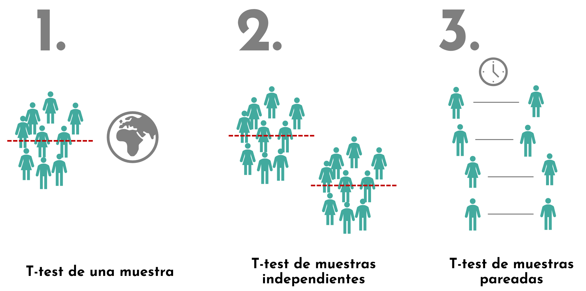

---
class: animated, fadeIn

## ¿Cuándo usamos el t-test de una muestra?

- Queremos comparar la **media de una muestra** con una **media de referencia conocida**.

<center>
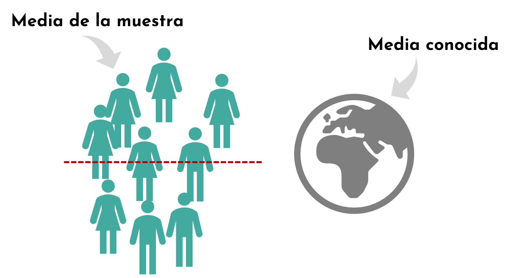


---
class: animated, fadeIn

## ¿Cuándo usamos el t-test de una muestra?

### Ejemplo

.pull-left[
- Una compañía de chocolate asegura que sus tabletas pesan 50g.
]
.pull-right[

]

---
class: animated, fadeIn

## ¿Cuándo usamos el t-test de una muestra?

### Ejemplo

.pull-left[
- Una compañía de chocolate asegura que sus tabletas pesan 50g.

- Para comprobarlo, cogemos una muestra de 30 tabletas, y las pesamos.
  - La media de esta muestra es 48g.

]
.pull-right[
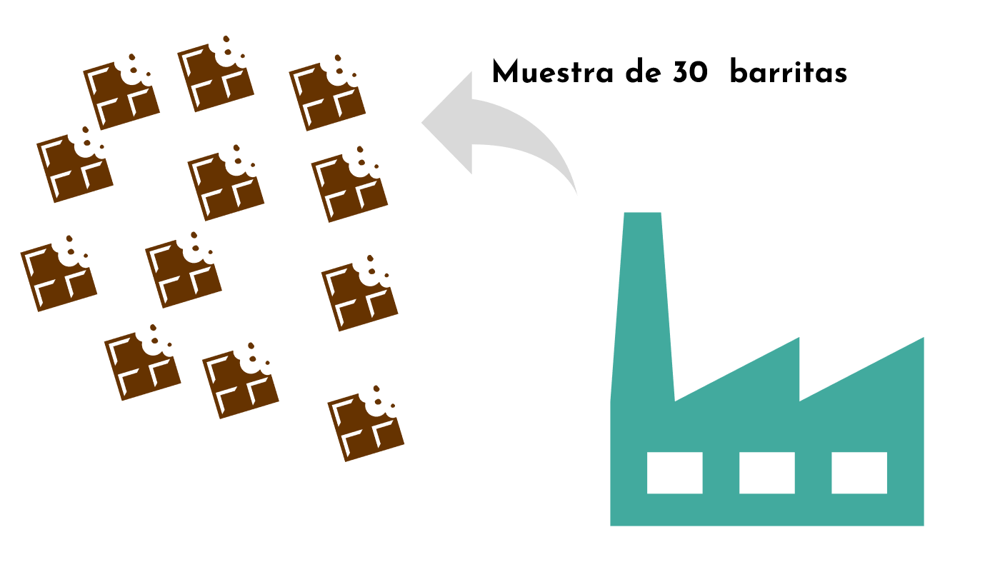
]


---
class: animated, fadeIn

## ¿Cuándo usamos el t-test de una muestra?

### Ejemplo

.pull-left[
- Una compañía de chocolate asegura que sus tabletas pesan 50g.

- Para comprobarlo, cogemos una muestra de 30 tabletas, y las pesamos.
  - La media de esta muestra es 48g.

]
.pull-right[
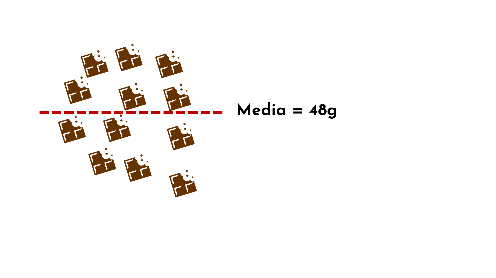
]


---
class: animated, fadeIn

## ¿Cuándo usamos el t-test de una muestra?

### Ejemplo

.pull-left[
- Una compañía de chocolate asegura que sus tabletas pesan 50g.

- Para comprobarlo, cogemos una muestra de 30 tabletas, y las pesamos.
  - La media de esta muestra es 48g.

- Usamos el t-test de una muestra para saber si la media de 48g es estadísticamente diferente a la media de 50g.

]
.pull-right[
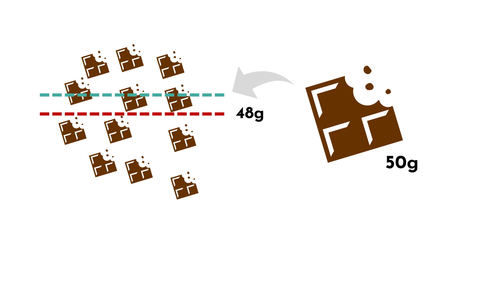
]


---
class: animated, fadeIn

## Tipos de t-test

<center>


---
class: animated, fadeIn

## ¿Cuándo usamos el t-test de muestras independientes?

- Queremos comparar la **media de dos grupos o muestras independientes** y saber si hay una **diferencia significativa** entre las dos medias.


<center>
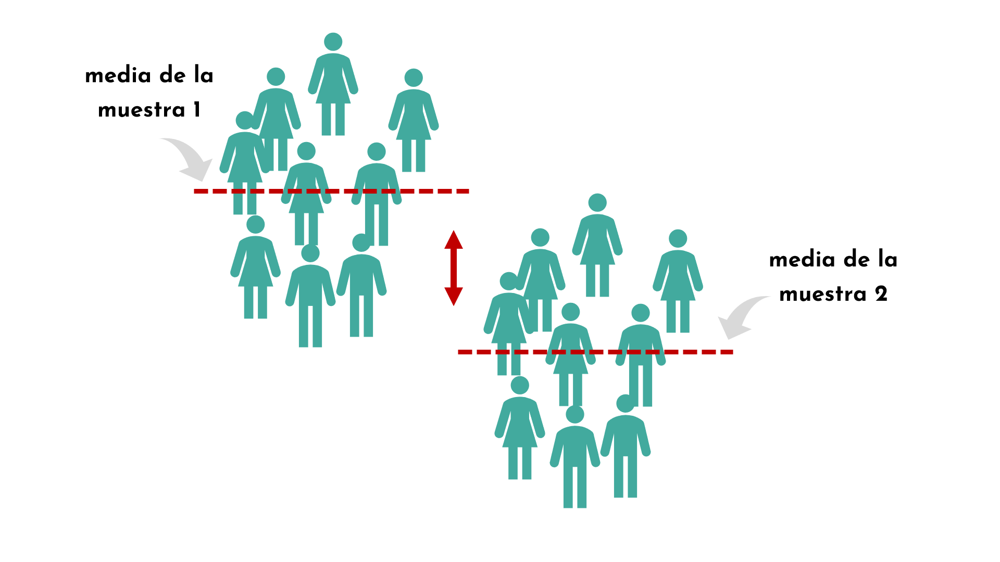


---
class: animated, fadeIn

## ¿Cuándo usamos el t-test de muestras independientes?

### Ejemplo

.pull-left[
- Queremos comparar la eficacia de dos analgésicos.
]

.pull-right[
<center>
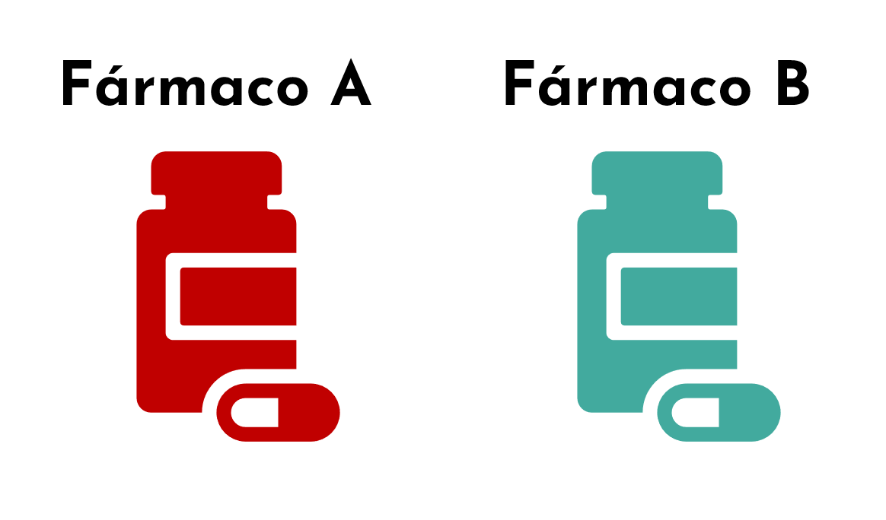

]

---
class: animated, fadeIn

## ¿Cuándo usamos el t-test de muestras independientes?

### Ejemplo

.pull-left[
- Queremos comparar la eficacia de dos analgésicos.

- Dividimos aleatoriamente a los pacientes en dos grupos:
  - El primer grupo recibe el analgésico A
  - El segundo grupo recibe el analgésico B
  
- Utilizando un t-test de dos muestras independientes, podemos saber si hay una diferencia significativa en el alivio del dolor entre los dos analgésicos.

]

.pull-right[
<center>
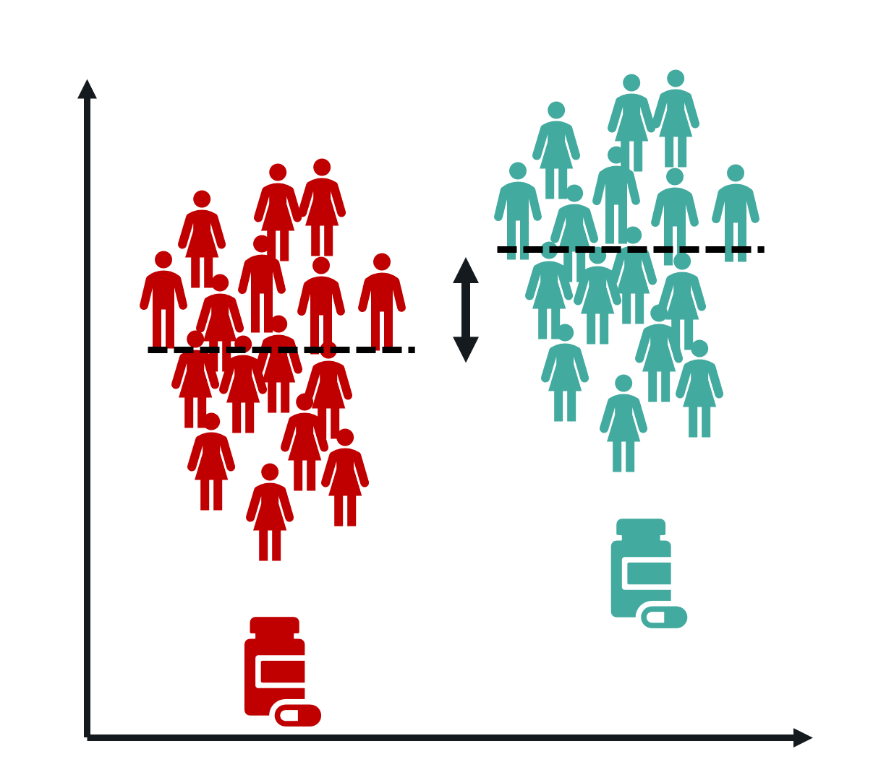

]


---
class: animated, fadeIn

## Tipos de t-test

<center>


---
class: animated, fadeIn

## ¿Cuándo usamos el t-test para muestras pareadas?

- Utilizamos el t-test pareado para **comparar las medias de dos grupos o muestras dependientes**.

<center>
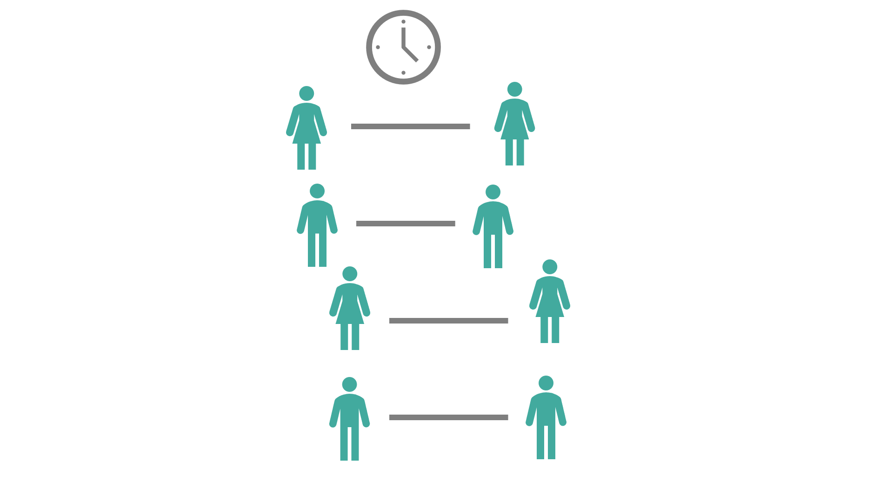


---
class: animated, fadeIn

## ¿Cuándo usamos el t-test para muestras pareadas?

### Ejemplo

.pull-left[
- Queremos saber la eficacia de un programa de mindfulness para reducir el estrés.

- El grupo cuantifica su nivel de estrés antes y después de realizar el programa.
]

.pull-right[
<center>
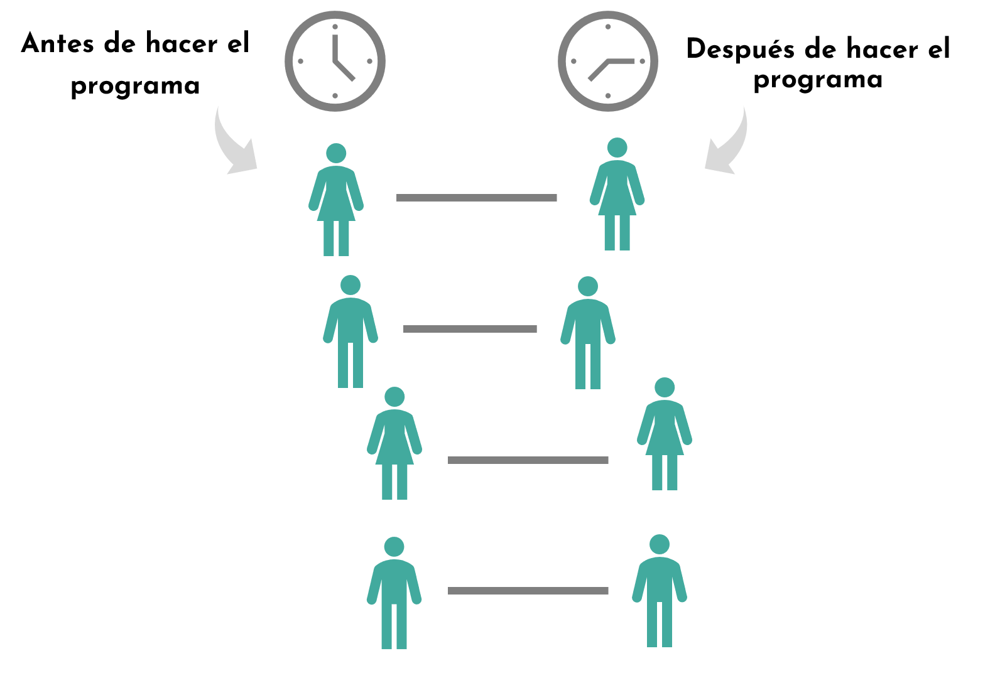


]


---
class: animated, fadeIn

## ¿Cuándo usamos el t-test para muestras pareadas?

### Ejemplo

.pull-left[
- Queremos saber la eficacia de un programa de mindfulness para reducir el estrés.

- El grupo cuantifica su nivel de estrés antes y después de realizar el programa.

- Medimos las diferencias en el nivel de estrés para cada sujeto.

- Podemos realizar un t-test pareado para saber si hay una diferencia significativa.

]

.pull-right[
<center>
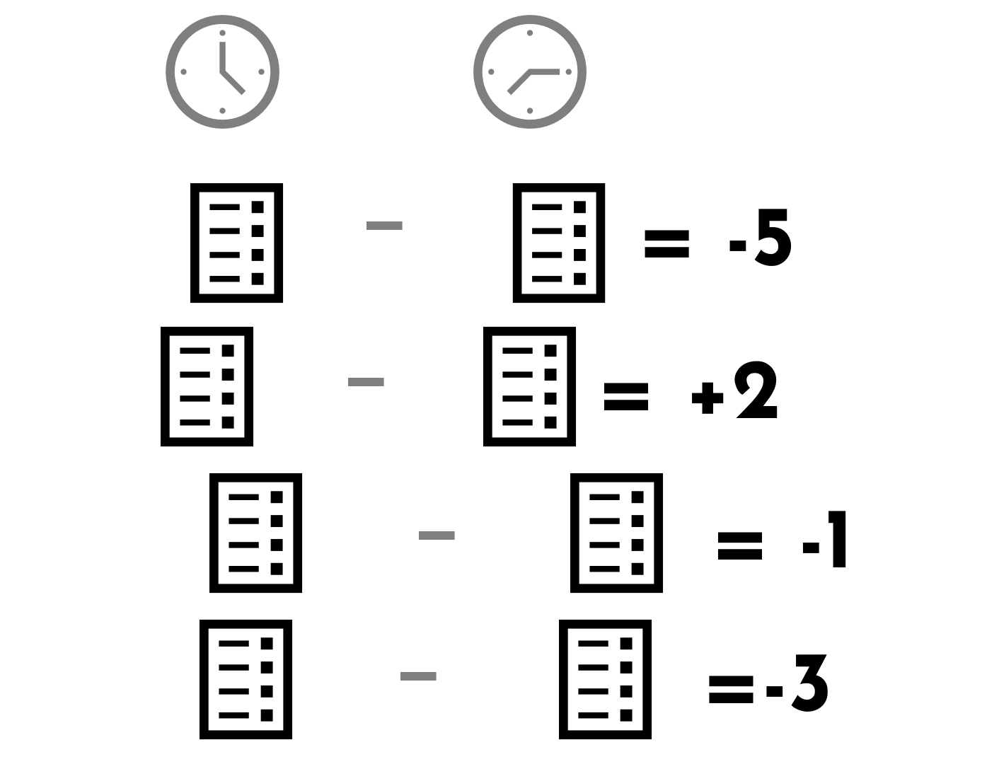


]


---
class: animated, fadeIn

## T-test pareado vs. t-test muestras independientes

.pull-left[
- En un t-test pareado las medidas están disponibles por pares  (mismas observaciones/sujetos antes y después)
]

.pull-right[
- En un t-test de muestras independientes, las observaciones son independientes entre los grupos

]

<center>
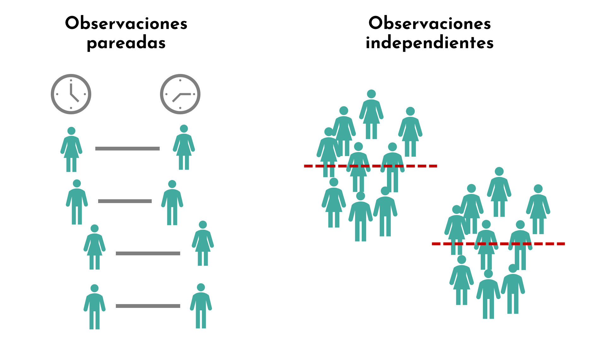

---
class: animated, fadeIn

## T-test pareado vs. t-test de una muestra

-  El t-test pareado es muy similar al t-test de una muestra.

<center>
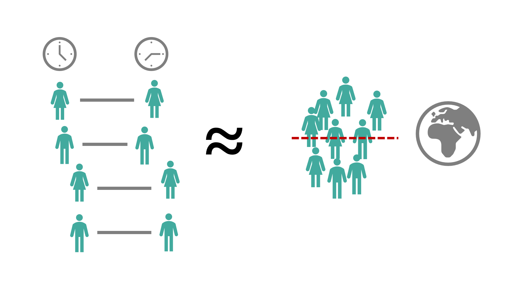

---
class: animated, fadeIn

## T-test pareado vs. t-test de una muestra

-  El t-test pareado es muy similar al t-test de una muestra.

- El valor de referencia en un t-test pareado es 0 (no hay diferencias).

<center>
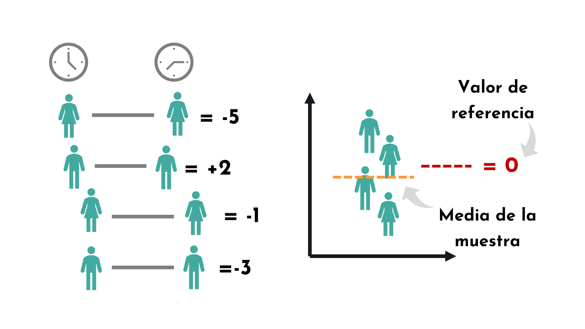


---
class: animated, fadeIn

## Suposiciones y requisitos del t-test

- **T-test de una muestra**: necesitamos **una muestra** y un **valor de referencia** con el que comparar la media de esa muestra.  

- **T-test de muestras independientes**: necesitamos **dos grupos independientes** (ej: tratamiento vs. control).  

- **T-test de muestras pareadas**: necesitamos **muestras pareadas**, por ejemplo, medidas tomadas sobre los mismos individuos antes y después de un tratamiento


- En todos los casos, la variable que queremos testar ha de ser **numérica cuantitativa** y los sujetos (o pares) **independientes** entre sí.

- La variable ha de **seguir una distribución normal** (*test de Shapiro, QQ-plots*) en cada grupo; en el t-test pareado, lo que debe ser normal son **las diferencias**. Con muestras grandes el t-test es robusto a desviaciones de la normalidad.

-  En el caso de un t-test de muestras independientes, idealmente las **varianzas** de los dos grupos serían **equivalentes (homogéneas)** (*test de Levene*), pero por defecto usaremos siempre la versión de **Welch**, que corrige automáticamente aunque las varianzas sean distintas.


---
class: animated, fadeIn

## Hipótesis de los t-test

#### T-test de una muestra

.pull-left[
**Hipótesis nula**

- La media de la población de la que procede la muestra ($\mu$) es igual al valor de referencia

  $$
  H_0: \ \mu = \mu_0
  $$
  
]

<center>


---
class: animated, fadeIn

## Hipótesis de los t-test

#### T-test de una muestra

.pull-left[
**Hipótesis nula**

- La media de la población de la que procede la muestra ($\mu$) es igual al valor de referencia

  $$
  H_0: \ \mu = \mu_0
  $$
  
]

.pull-right[
**Hipótesis alternativa**

- La media de la población de la que procede la muestra ($\mu$) no es igual al valor de referencia

  $$
  H_A: \ \mu \neq \mu_0
  $$
  
]

<center>
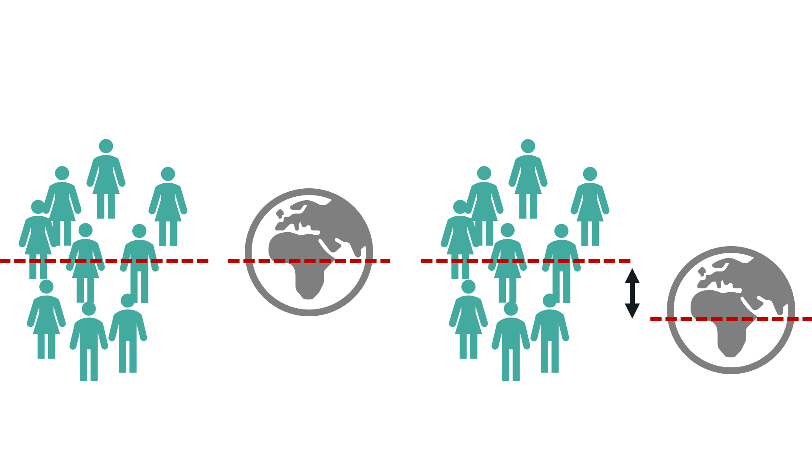


---
class: animated, fadeIn


## Hipótesis de los t-test

#### T-test de muestras independientes 

.pull-left[
**Hipótesis nula**

- Las medias poblacionales de los dos grupos son iguales

  $$
  H_0: \ \mu_1 = \mu_2
  $$

]

<center>


---
class: animated, fadeIn


## Hipótesis de los t-test

#### T-test de muestras independientes 

.pull-left[
**Hipótesis nula**

- Las medias poblacionales de los dos grupos son iguales

  $$
  H_0: \ \mu_1 = \mu_2
  $$
  
]

.pull-right[
**Hipótesis alternativa**

- Las medias poblacionales de los dos grupos no son iguales

  $$
  H_A: \ \mu_1 \neq \mu_2
  $$

]

<center>
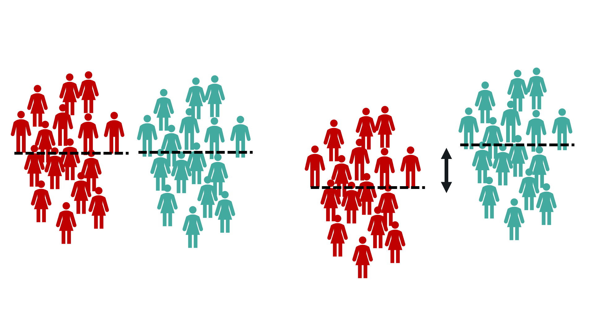


---
class: animated, fadeIn


## Hipótesis de los t-test

#### T-test de muestras pareadas 

.pull-left[
**Hipótesis nula**

- La media poblacional de las diferencias entre 
los pares ($\mu_d$) es 0


$$
  H_0: \ \mu_d = 0
$$

]

<center>
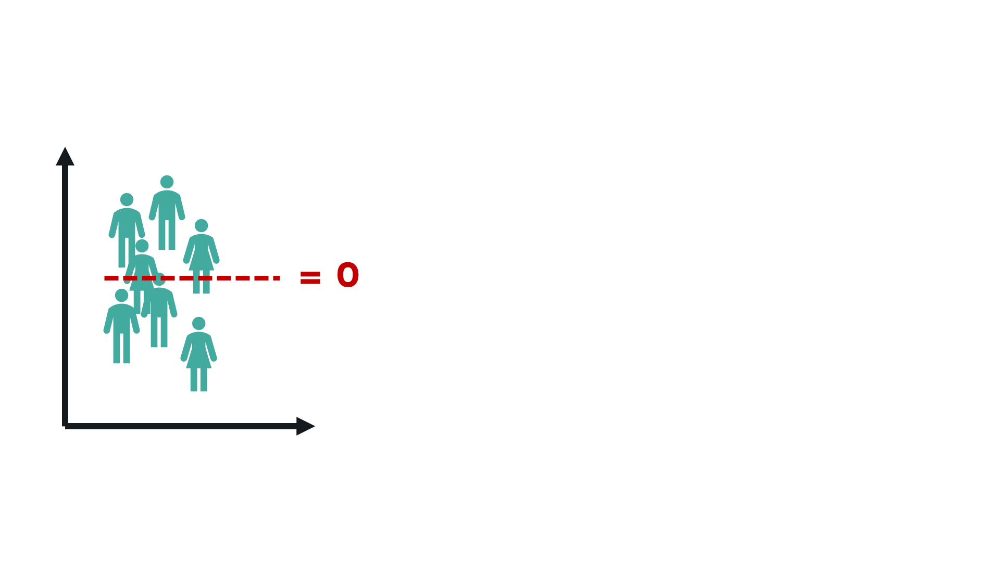


---
class: animated, fadeIn


## Hipótesis de los t-test

#### T-test de muestras pareadas 

.pull-left[
**Hipótesis nula**

- La media poblacional de las diferencias entre 
los pares ($\mu_d$) es 0

$$
  H_0: \ \mu_d = 0
$$

]

.pull-right[
**Hipótesis alternativa**

- La media poblacional de las diferencias entre 
los pares ($\mu_d$) no es 0

$$
  H_A: \ \mu_d \neq 0
$$

]


<center>
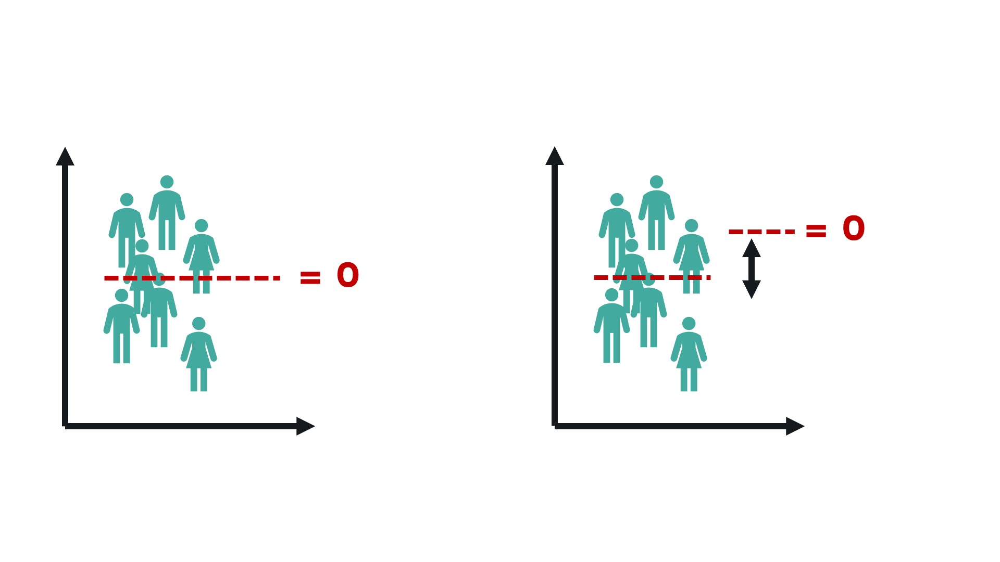

---
class: animated, fadeIn

## Hipótesis de los t-test

En los tres tipos de t-test, las hipótesis pueden ser de dos tipos:

- Las hipótesis son **no dirigidas**, bilaterales o de dos colas, cuando la **hipótesis alternativa no especifica dirección**, sólo indica que hay **diferencia**

$$
  H_A: \ \mu \neq \mu_0 \quad \quad \quad H_A: \ \mu_1 \neq \mu_2 \quad \quad \quad H_A: \mu_d \neq 0
$$

> Las usamos cuando **no sabemos, a priori, si el efecto será positivo o negativo** 

<br> 

--

- Las hipótesis son **dirigidas**, unilaterales o de una cola, cuando **sí se especifica dirección** (mayor o menor)

$$
  H_A: \ \mu > \mu_0 \quad \quad \quad H_A: \ \mu_1 > \mu_2 \quad \quad \quad H_A: \mu_d > 0
$$

$$
  H_A: \ \mu < \mu_0 \quad \quad \quad H_A: \ \mu_1 < \mu_2 \quad \quad \quad H_A: \mu_d < 0
$$

> Las usamos cuando tenemos una expectativa clara sobre el efecto


---
class: animated, fadeIn

## ¿Cómo hacemos un t-test? 

- Primero calculamos el valor `t` a partir de:

  - La **diferencia entre las medias** (o valor de referencia)
  
  - La **desviación estándar de la media** (error estándar)
  
<center>
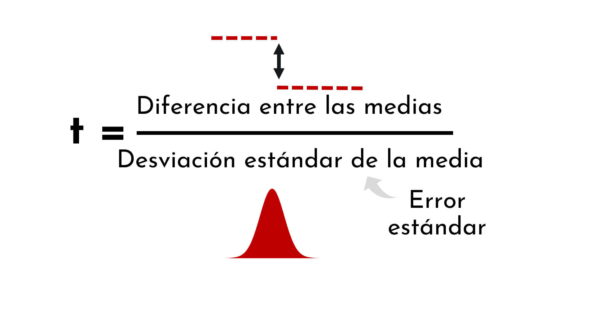

---
class: animated, fadeIn

## T-test de una muestra

.pull-left[
$$
t=\frac{\bar{x}-\mu}{\frac{s}{\sqrt{n}}}
$$


donde:
- $\bar{x}$: media de la muestra

- $\mu$: valor de referencia

- $s$: desviación estándar de la muestra

- $n$: tamaño de la muestra

- $\frac{s}{\sqrt{n}}$ es el error estándar

]

.pull-right[
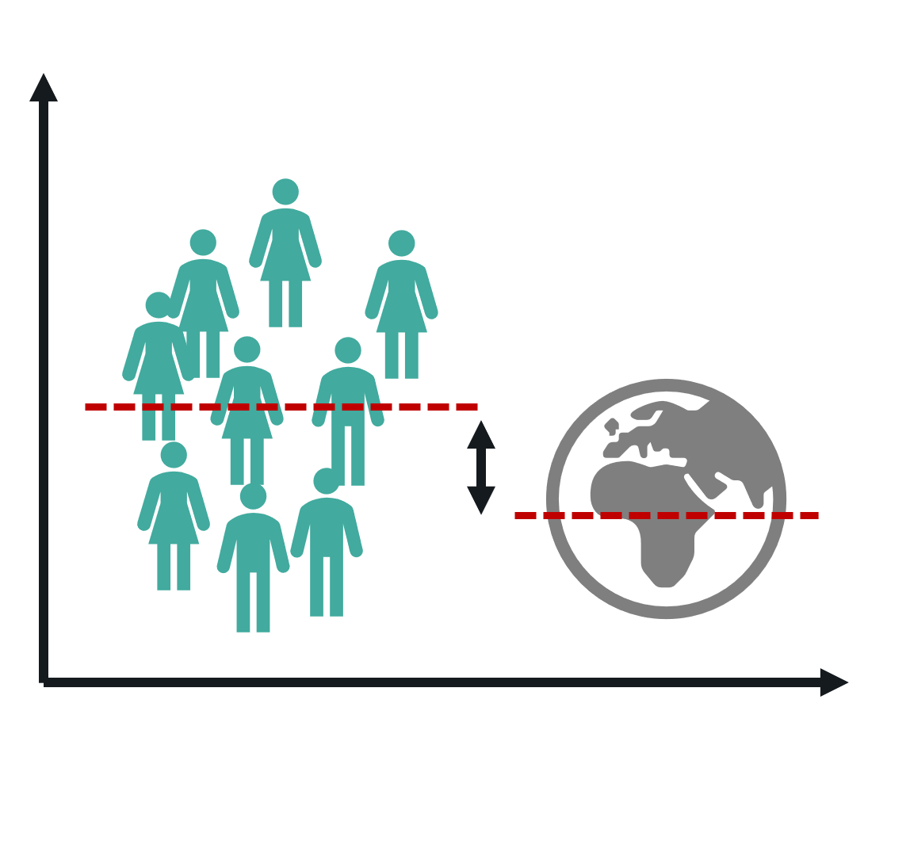
]

---
class: animated, fadeIn

## T-test de una muestra

### Ejemplo 🐁


.pull-left[

- Registramos el peso de 20 ratones que han recibido una dieta especial. Queremos **comparar la media de la muestra** ($\bar{x}$) con la **media de referencia del peso de los ratones** <br>($\mu_0$).

  - **Hipótesis nula ($H_0$)**:  los ratones alimentados con la dieta especial **no difieren en peso** respecto a otros ratones; la muestra proviene de una población con media $\mu_0$

  - **Hipótesis alternativa ($H_A$)**: la dieta **tiene un efecto sobre el peso**;  la muestra proviene de una población con media diferente a $\mu_0$

]

.pull-right[
```{r, echo = F, fig.height=5, fig.width=6}
weights <- c(31.41, 28.29, 22.82, 26.07, 31.97, 22.60, 31.47, 29.18, 22.98, 23.26, 23.48, 20.88, 28.44, 30.34, 23.14, 22.80, 24.47, 39.73, 25.71, 22.74)
set.seed(11)
ggplot(data.frame(data=weights), aes(x="sample",y=weights)) + geom_point(pos="jitter", size = 6) +labs(x="muestra", y = "peso")+
    ggthemes::theme_base(base_size = 18) +
    theme(panel.grid=element_blank(),
          axis.text=element_text(color="black"),
          panel.background = element_rect(fill = "white"),
          axis.text.x=element_blank(),
          axis.ticks.x=element_blank()) +
    geom_hline(yintercept = 23.89338, color="cadetblue4", size=2) + annotate("text", label = "Referencia~mu[0]",  parse = TRUE, x =  0.6, y = 23.89338+1, size=6,color="cadetblue4")

```

]


---
class: animated, fadeIn

## T-test de una muestra

### Ejemplo 🐁


.pull-left[

- Compara la media de la muestra ($\bar{x}$) a la referencia $\mu_0$

$$
t=\frac{\bar{x}-\mu}{\frac{s}{\sqrt{n}}}
$$


]

.pull-right[
```{r, echo = F, fig.height=5, fig.width=6}
weights <- c(31.41, 28.29, 22.82, 26.07, 31.97, 22.60, 31.47, 29.18, 22.98, 23.26, 23.48, 20.88, 28.44, 30.34, 23.14, 22.80, 24.47, 39.73, 25.71, 22.74)
set.seed(11)

ggplot(data.frame(data=weights), aes(x="sample",y=weights)) + geom_point(pos="jitter", size = 6) +labs(x="muestra", y = "peso")+
    ggthemes::theme_base(base_size = 18) +
    theme(panel.grid=element_blank(),
          axis.text=element_text(color="black"),
          panel.background = element_rect(fill = "white"),
          axis.text.x=element_blank(),
          axis.ticks.x=element_blank()) +
    geom_hline(yintercept = 23.89338, color="cadetblue4", size=2) + annotate("text", label = "Referencia~mu[0]",  parse = TRUE, x =  0.6, y = 23.89338+1, size=6,color="cadetblue4")

```

]


---
class: animated, fadeIn

## T-test de una muestra

.pull-left[

#### ¿Por qué es `t` un estadístico útil?

$$
t=\frac{\bar{x}-\mu}{\frac{s}{\sqrt{n}}}
$$

- Evidencia contra la hipótesis nula: `t` será **próximo a 0** cuando haya **poca evidencia** contra $H_0$, y tomará **valores grandes (en valor absoluto)** cuando exista **mucha evidencia** contra $H_0$.

- El valor de `t` tiene en cuenta el **tamaño del efecto**, el **tamaño de la muestra** y la **varianza**:

  - **Tamaño del efecto:** diferencia entre la media de la muestra y la media de referencia ($\bar{x} - \mu_0$). Cuanto **mayor sea esta diferencia**, **mayor será el valor absoluto de `t`**.


]

.pull-right[
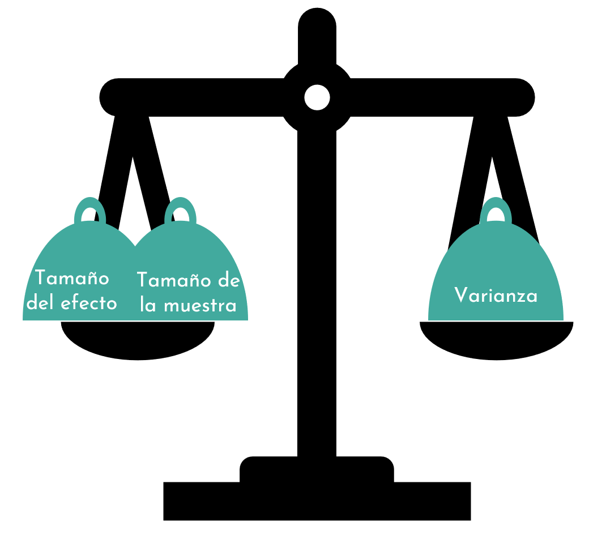
]


---
class: animated, fadeIn

## T-test de una muestra

.pull-left[

#### ¿Por qué es `t` un estadístico útil?

$$
t=\frac{\bar{x}-\mu}{\frac{s}{\sqrt{n}}}
$$

- Evidencia contra la hipótesis nula: `t` será **próximo a 0** cuando haya **poca evidencia** contra $H_0$, y tomará **valores grandes (en valor absoluto)** cuando exista **mucha evidencia** contra $H_0$.

- El valor de `t` tiene en cuenta el **tamaño del efecto**, el **tamaño de la muestra** y la **varianza**:
<small>
  - **Tamaño de la muestra:** si el tamaño del efecto se calcula a partir de una **muestra grande**, es **menos probable** que las diferencias observadas se deban al azar.  **A mayor tamaño de muestra**, **mayor será el valor absoluto de `t`**, ya que la estimación de la media es más precisa.

]

.pull-right[

]

---
class: animated, fadeIn

## T-test de una muestra

.pull-left[

#### ¿Por qué es `t` un estadístico útil?

$$
t=\frac{\bar{x}-\mu}{\frac{s}{\sqrt{n}}}
$$

- Evidencia contra la hipótesis nula: `t` será **próximo a 0** cuando haya **poca evidencia** contra $H_0$, y tomará **valores grandes (en valor absoluto)** cuando exista **mucha evidencia** contra $H_0$.

- El valor de `t` tiene en cuenta el **tamaño del efecto**, el **tamaño de la muestra** y la **varianza**:

  - **Varianza**:  si la muestra presenta una **varianza grande** en comparación con el tamaño del efecto, es más probable que las diferencias observadas se deban al azar. **A mayor varianza**, **menor será el valor absoluto de `t`**.

]

.pull-right[

]


---
class: animated, fadeIn

## T-test de una muestra

### Ejemplo 🐁

.pull-left[
$$
t=\frac{\bar{x}-\mu}{\frac{s}{\sqrt{n}}}=2.57
$$

- ¿Es 2.57 un valor esperado según la distribución nula?

- ¿Respecto a qué distribución?

]

.pull-right[
```{r, echo = F, fig.height=5, fig.width=5}
library(ggplot2)
library(ggthemes)

# Parámetros
dfree <- 19          # grados de libertad
t_star <- 2.0930       # valor crítico
conf_level <- 1 - 2 * (1 - pt(t_star, df = dfree))  # nivel de confianza correspondiente

# Secuencia de valores t y densidad
t_vals <- seq(-4, 4, length.out = 1000)
y <- dt(t_vals, df = dfree)
df <- data.frame(t_vals = t_vals, y = y)

# Límites del intervalo
t_lower <- -t_star
t_upper <- t_star

ggplot(df, aes(x = t_vals, y = y)) +
  geom_line(size = 1.2, color = "black", linetype="dashed") +
  # Área dentro del IC
  geom_area(fill = "cadetblue3", alpha = 0.5) +
  # Texto α/2 en las colas (usando parse = TRUE)
  labs(title = "Distribución nula de ...",
       x = "???", y = "") +
  ggthemes::theme_base(base_size = 16) +
  theme(panel.grid = element_blank(),
        axis.text = element_text(color = "black"),
        panel.background = element_rect(fill = "white"))


```

]


---
class: animated, fadeIn

### ¿Por qué usamos la distribución de `t` y no una normal?

Distribución normal estándar ($Z$):

$$
\frac{\bar{x}-\mu}{\frac{\sigma}{\sqrt{n}}}
$$

¿Qué problema tiene?

--

- Requiere conocer la desviación estándar poblacional $\sigma$ (el valor de $\mu$ lo fija $H_0$)

- En la práctica no conocemos $\sigma$: la reemplazamos por la desviación estándar de la muestra ($s$) 

--

<br><br>

Para muestras pequeñas (n<30), la estimación de $s$ es más variable.

- La distribución `t` corrige esta incertidumbre.

---
class: animated, fadeIn

## El origen del t-test: una fábrica de cerveza 🍺

.pull-left[

- **William Sealy Gosset** (1876–1937) era químico en la fábrica **Guinness** de Dublín.

- Su trabajo era controlar la calidad de la cebada, el lúpulo y la levadura, casi siempre con **muestras muy pequeñas** (a veces menos de 10).

- Con tan pocos datos, $s$ es una estimación poco fiable de $\sigma$, y usar la distribución normal daba **demasiados falsos positivos**.

- Gosset dedujo la distribución correcta para muestras pequeñas: la **distribución `t`**.

- Guinness no dejaba publicar a sus empleados (por miedo a revelar secretos industriales), así que en **1908** lo publicó en *Biometrika* con el seudónimo **"Student"**.

> Por eso hoy hablamos del **t de Student**. La letra `t` la puso después R. A. Fisher, que generalizó y difundió el test.

]

.pull-right[
<center>
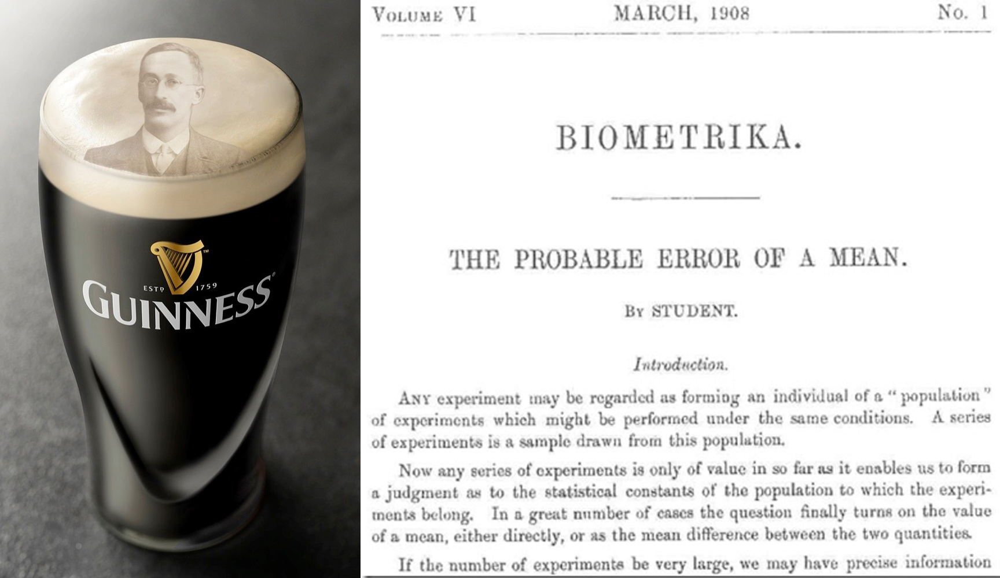
]


---
class: animated, fadeIn

## T-test de una muestra

### Ejemplo 🐁

.pull-left[
$$
t=\frac{\bar{x}-\mu}{\frac{s}{\sqrt{n}}}=2.57
$$

- ¿Es 2.57 un valor esperado según la distribución nula?

- Utilizaremos la tabla de la distribución `t` 

]

.pull-right[
```{r, echo = F, fig.height=5, fig.width=5}
library(ggplot2)
library(ggthemes)

# Parámetros
dfree <- 19          # grados de libertad
t_star <- 2.0930       # valor crítico
conf_level <- 1 - 2 * (1 - pt(t_star, df = dfree))  # nivel de confianza correspondiente

# Secuencia de valores t y densidad
t_vals <- seq(-4, 4, length.out = 1000)
y <- dt(t_vals, df = dfree)
df <- data.frame(t_vals = t_vals, y = y)

# Límites del intervalo
t_lower <- -t_star
t_upper <- t_star

ggplot(df, aes(x = t_vals, y = y)) +
  geom_line(size = 1.2, color = "black") +
  # Área dentro del IC
  geom_area(data = subset(df, t_vals >= t_lower & t_vals <= t_upper),
            aes(x = t_vals, y = y), fill = "cadetblue3", alpha = 0.5) +
  # Área de colas (alpha)
  geom_area(data = subset(df, t_vals < t_lower),
            aes(x = t_vals, y = y), fill = "firebrick3", alpha = 0.4) +
  geom_area(data = subset(df, t_vals > t_upper),
            aes(x = t_vals, y = y), fill = "firebrick3", alpha = 0.4) +
  # Líneas verticales en los límites del IC
  geom_vline(xintercept = c(2.57),
             linetype = "dashed", color = "firebrick3", size = 1) +
  # Texto α/2 en las colas (usando parse = TRUE)
  labs(title = "Distribución nula de t",
       x = "t", y = "") +
  ggthemes::theme_base(base_size = 16) +
  theme(panel.grid = element_blank(),
        axis.text = element_text(color = "black"),
        panel.background = element_rect(fill = "white"))


```

]

---
class: animated, fadeIn

.pull-left[

### La tabla de la distribución `t`

- **Grados de libertad**: se calculan como $n-1$ (para un t-test de una muestra)

- **Significación**: valor $\alpha$ - típicamente 0.05

]

.pull-right[
```{r, echo = F}
library(dplyr)
library(knitr)
library(kableExtra)

# --- Parámetros ---
dfs <- 1:20
probs <- c(0.25, 0.1, 0.05, 0.025, 0.01, 0.005)

# --- Calcular valores críticos t (cola superior) ---
# Usamos qt(1 - p, df) para obtener t tal que P(T > t) = p
t_table <- sapply(probs, function(p) qt(1 - p, df = dfs))
t_table_df <- data.frame(df = dfs, round(t_table, 4))
colnames(t_table_df) <- c("gl", paste0("p = ", probs))

# --- Mostrar tabla ---
kable(t_table_df, digits = 4, align = "c",
      caption = "Valores críticos de la distribución t (cola superior)") %>%
  kable_styling(
    full_width = FALSE,
    position = "center",
    font_size = 14
  ) %>%
  row_spec(0, bold = TRUE, background = "#e6f2ff") %>%
  column_spec(1, bold = TRUE, background = "#e6f2ff")
```
]


---
class: animated, fadeIn

.pull-left[

### La tabla de la distribución `t`

- **Grados de libertad**: se calculan como $n-1$ (para un t-test de una muestra)

- **Significación**: valor $\alpha$ - típicamente 0.05

-  Como la hipótesis es **bilateral** ($H_A: \mu \ne \mu_0$), tenemos que tener en cuenta que el **nivel de significación $\alpha$ se reparte entre las dos colas** de la distribución `t`.  Por lo tanto, para un $\alpha = 0.05$ bilateral, cada cola tendrá $\alpha/2 = 0.025$.

<center>
```{r, echo = F, fig.height=3, fig.width=4}
library(ggplot2)
library(ggthemes)

# Parámetros
dfree <- 19          # grados de libertad
t_star <- 2.0930       # valor crítico
conf_level <- 1 - 2 * (1 - pt(t_star, df = dfree))  # nivel de confianza correspondiente

# Secuencia de valores t y densidad
t_vals <- seq(-4, 4, length.out = 1000)
y <- dt(t_vals, df = dfree)
df <- data.frame(t_vals = t_vals, y = y)

# Límites del intervalo
t_lower <- -t_star
t_upper <- t_star

ggplot(df, aes(x = t_vals, y = y)) +
  geom_line(size = 1.2, color = "black") +
  # Área dentro del IC
  geom_area(data = subset(df, t_vals >= t_lower & t_vals <= t_upper),
            aes(x = t_vals, y = y), fill = "cadetblue3", alpha = 0.5) +
  # Área de colas (alpha)
  geom_area(data = subset(df, t_vals < t_lower),
            aes(x = t_vals, y = y), fill = "firebrick3", alpha = 0.4) +
  geom_area(data = subset(df, t_vals > t_upper),
            aes(x = t_vals, y = y), fill = "firebrick3", alpha = 0.4) +
  # Líneas verticales en los límites del IC
  geom_vline(xintercept = c(2.57),
             linetype = "dashed", color = "firebrick3", size = 1) +
    annotate("text", x = t_star + 0.4, y = 0.1,
           label = "alpha == 0.025", parse = TRUE, color = "firebrick3", size = 5) +
      annotate("text", x = - t_star - 0.4, y = 0.1,
           label = "alpha == 0.025", parse = TRUE, color = "firebrick3", size = 5) +
  # Texto α/2 en las colas (usando parse = TRUE)
  labs(title = "Distribución nula de t",
       x = "t", y = "") +
  ggthemes::theme_base(base_size = 16) +
  theme(panel.grid = element_blank(),
        axis.text = element_text(color = "black"),
        panel.background = element_rect(fill = "white"))
```

]

.pull-right[
```{r, echo = F}
library(dplyr)
library(knitr)
library(kableExtra)

# --- Parámetros ---
dfs <- 1:20
probs <- c(0.25, 0.1, 0.05, 0.025, 0.01, 0.005)

# --- Calcular valores críticos t (cola superior) ---
# Usamos qt(1 - p, df) para obtener t tal que P(T > t) = p
t_table <- sapply(probs, function(p) qt(1 - p, df = dfs))
t_table_df <- data.frame(df = dfs, round(t_table, 4))
colnames(t_table_df) <- c("gl", paste0("p = ", probs))

# --- Mostrar tabla ---
kable(t_table_df, digits = 4, align = "c",
      caption = "Valores críticos de la distribución t (cola superior)") %>%
  kable_styling(
    full_width = FALSE,
    position = "center",
    font_size = 14
  ) %>%
  row_spec(0, bold = TRUE, background = "#e6f2ff") %>%
  column_spec(1, bold = TRUE, background = "#e6f2ff")
```
]


---
class: animated, fadeIn

.pull-left[

### La tabla de la distribución `t`

- **Grados de libertad**: se calculan como $n-1$: 19

- **Significación**: valor $\alpha$ - típicamente 0.05

El valor crítico `t` para 19 grados de libertad y $\alpha = 0.05$ bilateral ($\alpha/2 = 0.025$ en cada cola) es $t_{19,\,0.025}=2.0930$

> Como $t_{19,\,0.025}=2.0930$ es **más pequeño** que nuestro valor `t` ($2.57$), rechazamos la hipótesis nula $H_0$

<center>
```{r, echo = F, fig.height=3, fig.width=4}
library(ggplot2)
library(ggthemes)

# Parámetros
dfree <- 19          # grados de libertad
t_star <- 2.0930       # valor crítico
conf_level <- 1 - 2 * (1 - pt(t_star, df = dfree))  # nivel de confianza correspondiente

# Secuencia de valores t y densidad
t_vals <- seq(-4, 4, length.out = 1000)
y <- dt(t_vals, df = dfree)
df <- data.frame(t_vals = t_vals, y = y)

# Límites del intervalo
t_lower <- -t_star
t_upper <- t_star

ggplot(df, aes(x = t_vals, y = y)) +
  geom_line(size = 1.2, color = "black") +
  # Área dentro del IC
  geom_area(data = subset(df, t_vals >= t_lower & t_vals <= t_upper),
            aes(x = t_vals, y = y), fill = "cadetblue3", alpha = 0.5) +
  # Área de colas (alpha)
  geom_area(data = subset(df, t_vals < t_lower),
            aes(x = t_vals, y = y), fill = "firebrick3", alpha = 0.4) +
  geom_area(data = subset(df, t_vals > t_upper),
            aes(x = t_vals, y = y), fill = "firebrick3", alpha = 0.4) +
  # Líneas verticales en los límites del IC
  geom_vline(xintercept = c(2.57),
             linetype = "dashed", color = "firebrick3", size = 1) +
    annotate("text", x = t_star + 0.4, y = 0.1,
           label = "alpha == 0.025", parse = TRUE, color = "firebrick3", size = 5) +
      annotate("text", x = - t_star - 0.4, y = 0.1,
           label = "alpha == 0.025", parse = TRUE, color = "firebrick3", size = 5) +
  # Texto α/2 en las colas (usando parse = TRUE)
  labs(title = "Distribución nula de t",
       x = "t", y = "") +
  ggthemes::theme_base(base_size = 16) +
  theme(panel.grid = element_blank(),
        axis.text = element_text(color = "black"),
        panel.background = element_rect(fill = "white"))
```

]

.pull-right[
```{r, echo = F}
library(dplyr)
library(knitr)
library(kableExtra)

# --- Parámetros ---
dfs <- 1:20
probs <- c(0.25, 0.1, 0.05, 0.025, 0.01, 0.005)

# --- Calcular valores críticos t (cola superior) ---
# Usamos qt(1 - p, df) para obtener t tal que P(T > t) = p
t_table <- sapply(probs, function(p) qt(1 - p, df = dfs))
t_table_df <- data.frame(df = dfs, round(t_table, 4))
colnames(t_table_df) <- c("gl", paste0("p = ", probs))

# --- Mostrar tabla ---
kable(t_table_df, digits = 4, align = "c",
      caption = "Valores críticos de la distribución t (cola superior)") %>%
  kable_styling(
    full_width = FALSE,
    position = "center",
    font_size = 14
  ) %>%
  row_spec(0, bold = TRUE, background = "#e6f2ff") %>%
  column_spec(1, bold = TRUE, background = "#e6f2ff")
```
]


---
class: animated, fadeIn

.pull-left[

### La tabla de la distribución `t`

Si nuestra hipótesis alternativa hubiera sido direccional (**una cola**), el resultado sería también significativo, y el p-valor sería aún menor:

$$
H_0: \ \mu = \mu_0 \qquad H_A: \ \mu > \mu_0
$$

El valor crítico `t` para 19 grados de libertad y $\alpha = 0.05$ en una cola es $t_{19,\,0.05}=1.7291$

> Como $t_{19,\,0.05}=1.7291$ es **más pequeño** que nuestro valor `t` ($2.57$), rechazamos la hipótesis nula $H_0$

<center>
```{r, echo = F, fig.height=3, fig.width=4}
library(ggplot2)
library(ggthemes)

# Parámetros
dfree <- 19           # grados de libertad
t_star <- 1.729       # valor crítico para una cola (df=19, α=0.05)
alpha <- 0.05

# Secuencia de valores t y densidad
t_vals <- seq(-4, 4, length.out = 1000)
y <- dt(t_vals, df = dfree)
df <- data.frame(t_vals = t_vals, y = y)

# Gráfico
ggplot(df, aes(x = t_vals, y = y)) +
  geom_line(size = 1.2, color = "black") +
  # Área de aceptación (izquierda)
  geom_area(data = subset(df, t_vals <= t_star),
            aes(x = t_vals, y = y), fill = "cadetblue3", alpha = 0.5) +
  # Área de rechazo (cola derecha)
  geom_area(data = subset(df, t_vals > t_star),
            aes(x = t_vals, y = y), fill = "firebrick3", alpha = 0.5) +
  # Línea vertical en el valor crítico
  geom_vline(xintercept = 2.57, 
             linetype = "dashed", color = "firebrick3", size = 1.2) +
  # Etiquetas
  annotate("text", x = t_star + 1.1, y = 0.2,
           label = "alpha == 0.05", parse = TRUE, color = "firebrick3", size = 5) +
  labs(title = "Distribución nula de t\n(una cola)",
       x = "t", y = "") +
  ggthemes::theme_base(base_size = 16) +
  theme(panel.grid = element_blank(),
        axis.text = element_text(color = "black"),
        panel.background = element_rect(fill = "white"))
```

]

.pull-right[
```{r, echo = F}
library(dplyr)
library(knitr)
library(kableExtra)

# --- Parámetros ---
dfs <- 1:20
probs <- c(0.25, 0.1, 0.05, 0.025, 0.01, 0.005)

# --- Calcular valores críticos t (cola superior) ---
# Usamos qt(1 - p, df) para obtener t tal que P(T > t) = p
t_table <- sapply(probs, function(p) qt(1 - p, df = dfs))
t_table_df <- data.frame(df = dfs, round(t_table, 4))
colnames(t_table_df) <- c("gl", paste0("p = ", probs))

# --- Mostrar tabla ---
kable(t_table_df, digits = 4, align = "c",
      caption = "Valores críticos de la distribución t (cola superior)") %>%
  kable_styling(
    full_width = FALSE,
    position = "center",
    font_size = 14
  ) %>%
  row_spec(0, bold = TRUE, background = "#e6f2ff") %>%
  column_spec(1, bold = TRUE, background = "#e6f2ff")
```
]


---
class: animated, fadeIn

## Cómo hacemos un t-test en `R`

### La función `t.test`

.pull-left[
```{r}
mu0 <- 23.89338

t.test(weights, mu = mu0, 
       alternative = "two.sided")
```
]

.pull-right[


```{r, echo = F, fig.height=4, fig.width=5, fig.align='center'}

library(ggplot2)
library(ggthemes)

# Parámetros
dfree <- 19          # grados de libertad
t_star <- 2.0930       # valor crítico
conf_level <- 1 - 2 * (1 - pt(t_star, df = dfree))  # nivel de confianza correspondiente

# Secuencia de valores t y densidad
t_vals <- seq(-4, 4, length.out = 1000)
y <- dt(t_vals, df = dfree)
df <- data.frame(t_vals = t_vals, y = y)

# Límites del intervalo
t_lower <- -t_star
t_upper <- t_star

ggplot(df, aes(x = t_vals, y = y)) +
  geom_line(size = 1.2, color = "black") +
  # Área dentro del IC
  geom_area(data = subset(df, t_vals >= t_lower & t_vals <= t_upper),
            aes(x = t_vals, y = y), fill = "cadetblue3", alpha = 0.5) +
  # Área de colas (alpha)
  geom_area(data = subset(df, t_vals < t_lower),
            aes(x = t_vals, y = y), fill = "firebrick3", alpha = 0.4) +
  geom_area(data = subset(df, t_vals > t_upper),
            aes(x = t_vals, y = y), fill = "firebrick3", alpha = 0.4) +
  # Líneas verticales en los límites del IC
  geom_vline(xintercept = c(2.57),
             linetype = "dashed", color = "firebrick3", size = 1) +
    annotate("text", x = t_star + 0.4, y = 0.1,
           label = "alpha == 0.025", parse = TRUE, color = "firebrick3", size = 5) +
      annotate("text", x = - t_star - 0.4, y = 0.1,
           label = "alpha == 0.025", parse = TRUE, color = "firebrick3", size = 5) +
  # Texto α/2 en las colas (usando parse = TRUE)
  labs(title = "Distribución nula de t",
       x = "t", y = "") +
  ggthemes::theme_base(base_size = 16) +
  theme(panel.grid = element_blank(),
        axis.text = element_text(color = "black"),
        panel.background = element_rect(fill = "white"))

```

]

---
class: animated, fadeIn

## Cómo hacemos un t-test en `R`

### La función `t.test`

.pull-left[
```{r}
t.test(weights, mu = mu0, 
       alternative = "greater")
```
]

.pull-right[

<center>
```{r, echo = F, fig.height=4, fig.width=5, fig.align='center'}
library(ggplot2)
library(ggthemes)

# Parámetros
dfree <- 19           # grados de libertad
t_star <- 1.729       # valor crítico para una cola (df=19, α=0.05)
alpha <- 0.05

# Secuencia de valores t y densidad
t_vals <- seq(-4, 4, length.out = 1000)
y <- dt(t_vals, df = dfree)
df <- data.frame(t_vals = t_vals, y = y)

# Gráfico
ggplot(df, aes(x = t_vals, y = y)) +
  geom_line(size = 1.2, color = "black") +
  # Área de aceptación (izquierda)
  geom_area(data = subset(df, t_vals <= t_star),
            aes(x = t_vals, y = y), fill = "cadetblue3", alpha = 0.5) +
  # Área de rechazo (cola derecha)
  geom_area(data = subset(df, t_vals > t_star),
            aes(x = t_vals, y = y), fill = "firebrick3", alpha = 0.5) +
  # Línea vertical en el valor crítico
  geom_vline(xintercept = 2.57, 
             linetype = "dashed", color = "firebrick3", size = 1.2) +
  # Etiquetas
  annotate("text", x = t_star + 1.1, y = 0.2,
           label = "alpha == 0.05", parse = TRUE, color = "firebrick3", size = 5) +
  labs(title = "Distribución nula de t\n(una cola)",
       x = "t", y = "") +
  ggthemes::theme_base(base_size = 16) +
  theme(panel.grid = element_blank(),
        axis.text = element_text(color = "black"),
        panel.background = element_rect(fill = "white"))
```

]

---
class: animated, fadeIn

## T-test con dos muestras independientes

- Utilizamos el t-test para comparar **dos muestras**.

--

Por ejemplo, una muestra de ratones con **dieta alta en grasa** se comparó con un grupo de ratones alimentados con una **dieta de control**.

.pull-left[
<center>
```{r, echo = F, fig.height=4, fig.width=5}
url <- 'https://raw.githubusercontent.com/genomicsclass/dagdata/master/inst/extdata/mice_pheno.csv'
mice <- read.csv(url)
mice <- na.omit(mice)  # eliminamos los ratones sin peso (NA)

ggplot(mice, aes(x=Diet, y =Bodyweight, fill=Diet)) +
  geom_boxplot(show.legend = F, alpha = 0.3) +
  geom_jitter(aes(color=Diet), show.legend = F, alpha=0.5) + 
  ggthemes::theme_base(base_size = 16) +
  theme(panel.grid=element_blank(),
        axis.text=element_text(color="black"),
        panel.background = element_rect(fill = "white")) +
  scale_fill_manual(values=c("cadetblue4", "orange2"))+
  scale_color_manual(values=c("cadetblue4", "orange2"))

```
]

--

.pull-right[

- Resumimos los datos con el estadístico `t` y calculamos la probabilidad bajo la hipótesis nula.

- **Sólo cambia la fórmula de `t`**, pero no el cálculo de la probabilidad.

$$
t = \frac{\bar{x}_1 - \bar{x}_2}{\sqrt{\frac{s_1^2}{n_1} + \frac{s_2^2}{n_2}}}
$$


- Si $H_0$ es cierta, `t` sigue (aproximadamente) una distribución `t`. Con la corrección de **Welch**, los grados de libertad se calculan con la fórmula de Welch–Satterthwaite (`R` lo hace automáticamente). Solo si asumimos varianzas iguales (t-test de Student) son $n_1 + n_2 - 2$.

]


---
class: animated, fadeIn

## T-test con dos muestras independientes

.pull-left[
<center>
```{r, echo = F, fig.height=4, fig.width=5}
url <- 'https://raw.githubusercontent.com/genomicsclass/dagdata/master/inst/extdata/mice_pheno.csv'
mice <- read.csv(url)
mice <- na.omit(mice)  # eliminamos los ratones sin peso (NA)

ggplot(mice, aes(x=Diet, y =Bodyweight, fill=Diet)) +
  geom_boxplot(show.legend = F, alpha = 0.3) +
  geom_jitter(aes(color=Diet), show.legend = F, alpha=0.5) + 
  ggthemes::theme_base(base_size = 16) +
  theme(panel.grid=element_blank(),
        axis.text=element_text(color="black"),
        panel.background = element_rect(fill = "white")) +
  scale_fill_manual(values=c("cadetblue4", "orange2"))+
  scale_color_manual(values=c("cadetblue4", "orange2"))

```
]

.pull-right[

$$
t = \frac{\bar{x}_1 - \bar{x}_2}{\sqrt{\frac{s_1^2}{n_1} + \frac{s_2^2}{n_2}}} = -7.1932
$$

Podemos rechazar la hipótesis nula: el valor crítico `t` para 735 grados de libertad (Welch) y $\alpha = 0.05$ bilateral es $\approx t_{\infty,\,0.025}=1.96$, y $|t| = 7.19 > 1.96$

]

--

> ¿De qué te suena el 1.96? Para grados de libertad grandes (>100) la distribución `t` y la normal estándar son prácticamente iguales, por eso se puede usar 1.96 como aproximación.

```{r, echo = F}
library(dplyr)
library(knitr)
library(kableExtra)

# --- Parámetros ---
dfs <- 80:100                      
probs <- c(0.25, 0.1, 0.05, 0.025, 0.01, 0.005)  

# --- Calcular valores críticos t (cola superior) para df 80-100 ---
t_table <- sapply(probs, function(p) qt(1 - p, df = dfs))
t_table_df <- data.frame(df = dfs, round(t_table, 4))
colnames(t_table_df) <- c("gl", paste0("p = ", probs))

# --- Calcular fila para df = ∞ (aproximación normal) ---
t_inf <- sapply(probs, function(p) qnorm(1 - p))          
t_inf_df <- data.frame(df = "∞", t(as.data.frame(round(t_inf, 4))))  
colnames(t_inf_df) <- colnames(t_table_df)

# --- Combinar tablas ---
t_table_df <- rbind(t_table_df, t_inf_df)

# --- Filtrar solo 98, 99, 100 y ∞ ---
t_table_df <- t_table_df %>% filter(gl %in% c(98, 99, 100, "∞"))

# --- Mostrar tabla con estilo ---
kable(t_table_df, row.names = F, digits = 4, align = "c",
      caption = "Valores críticos de la distribución t (cola superior)") %>%
  kable_styling(
    full_width = FALSE,
    position = "center",
    font_size = 14
  ) %>%
  row_spec(0, bold = TRUE, background = "#e6f2ff") %>%
  column_spec(1, bold = TRUE, background = "#e6f2ff") %>%
  row_spec(nrow(t_table_df), bold = TRUE, background = "#ffe6e6")  # resalta la fila ∞


```


---
class: animated, fadeIn

## T-test con dos muestras independientes en `R`

### La función `t.test`

```{r}

colnames(mice)

head(mice)

t.test(Bodyweight ~ Diet, 
       data = mice,
       alternative = "two.sided")

```


---
class: animated, fadeIn

## T-test con dos muestras independientes en `R`

### La función `t.test`

```{r}

t.test(Bodyweight ~ Diet, 
       data = mice,
       alternative = "two.sided")

```


---
class: animated, fadeIn

## T-test con dos muestras independientes en `R`

### La función `t.test`

```{r}

diet_hf <- subset(mice, Diet=="hf") %>% pull(Bodyweight)

diet_ctrl <- subset(mice, Diet=="chow") %>% pull(Bodyweight)

t.test(diet_ctrl, diet_hf, 
       alternative = "two.sided")

```

---
class: animated, fadeIn

## T-test con dos muestras independientes en `R`

### La función `t.test`

.pull-left[
<center>
```{r, echo = F, fig.height=4, fig.width=5}
url <- 'https://raw.githubusercontent.com/genomicsclass/dagdata/master/inst/extdata/mice_pheno.csv'
mice <- read.csv(url)
mice <- na.omit(mice)  # eliminamos los ratones sin peso (NA)

ggplot(mice, aes(x=Diet, y =Bodyweight, fill=Diet)) +
  geom_boxplot(show.legend = F, alpha = 0.3) +
  geom_jitter(aes(color=Diet), show.legend = F, alpha=0.5) + 
  ggthemes::theme_base(base_size = 16) +
  theme(panel.grid=element_blank(),
        axis.text=element_text(color="black"),
        panel.background = element_rect(fill = "white")) +
  scale_fill_manual(values=c("cadetblue4", "orange2"))+
  scale_color_manual(values=c("cadetblue4", "orange2"))  +
  ggsignif::geom_signif(comparisons = #<<
                list(c("chow", "hf")),#<<
              test = "t.test")#<<

```
]

.pull-right[

```{r, echo = F, fig.height=4, fig.width=5}
url <- 'https://raw.githubusercontent.com/genomicsclass/dagdata/master/inst/extdata/mice_pheno.csv'
mice <- read.csv(url)
mice <- na.omit(mice)  # eliminamos los ratones sin peso (NA)

ggplot(mice, aes(x=Diet, y =Bodyweight, fill=Diet)) +
  geom_boxplot(show.legend = F, alpha = 0.3) +
  geom_jitter(aes(color=Diet), show.legend = F, alpha=0.5) + 
  ggthemes::theme_base(base_size = 16) +
  theme(panel.grid=element_blank(),
        axis.text=element_text(color="black"),
        panel.background = element_rect(fill = "white")) +
  scale_fill_manual(values=c("cadetblue4", "orange2"))+
  scale_color_manual(values=c("cadetblue4", "orange2"))  +
  ggsignif::geom_signif(comparisons = #<<
                list(c("chow", "hf")),#<<
              test = "t.test", map_signif_level = T)#<<

```

]


---
class: animated, fadeIn

## T-test con dos muestras independientes en `R`

### La función `t.test`

.pull-left[

<center>

| Símbolo | Nivel de significación |
|:--------:|:---------------------:|
| `ns`     | p > 0.05             |
| `*`      | p ≤ 0.05             |
| `**`     | p ≤ 0.01             |
| `***`    | p ≤ 0.001            |

]

.pull-right[

```{r, echo = F, fig.height=4, fig.width=5}
url <- 'https://raw.githubusercontent.com/genomicsclass/dagdata/master/inst/extdata/mice_pheno.csv'
mice <- read.csv(url)
mice <- na.omit(mice)  # eliminamos los ratones sin peso (NA)

ggplot(mice, aes(x=Diet, y =Bodyweight, fill=Diet)) +
  geom_boxplot(show.legend = F, alpha = 0.3) +
  geom_jitter(aes(color=Diet), show.legend = F, alpha=0.5) + 
  ggthemes::theme_base(base_size = 16) +
  theme(panel.grid=element_blank(),
        axis.text=element_text(color="black"),
        panel.background = element_rect(fill = "white")) +
  scale_fill_manual(values=c("cadetblue4", "orange2"))+
  scale_color_manual(values=c("cadetblue4", "orange2"))  +
  ggsignif::geom_signif(comparisons = #<<
                list(c("chow", "hf")),#<<
              test = "t.test", map_signif_level = T)#<<

```

]


---
class: animated, fadeIn

## T-test para muestras pareadas

.pull-left[

**Ejemplo**: el peso de 15 ratones se mide antes y después de 1 mes con dieta alta en grasa 

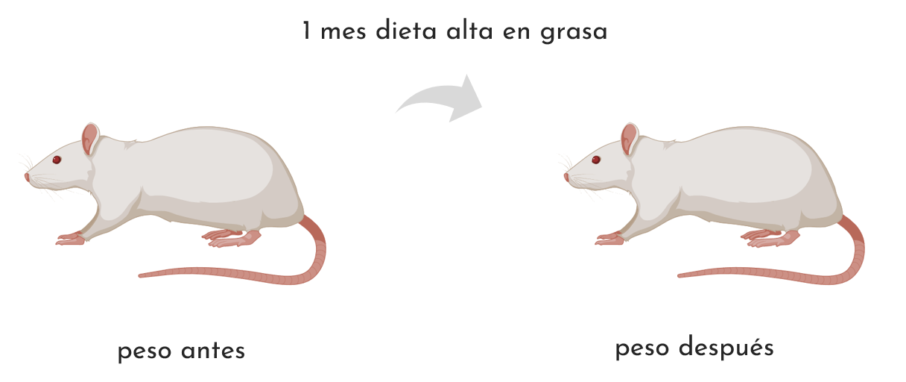
]


.pull-right[

```{r echo = F, fig.align='center', fig.height=5, fig.width=5}
library(ggplot2)
library(dplyr)

set.seed(123)

# Simular pesos antes y después para 15 ratones
n <- 15
before <- rnorm(n, mean = 25, sd = 3)

# Aumentos siempre positivos (entre 0.5 y 3 g)
increase <- runif(n, min = 0.5, max = 3)
after <- before + increase

# Crear dataframe largo
mice_paired <- data.frame(
    ID = rep(1:n, times = 2),
    Time = factor(rep(c("antes", "despues"), each = n), levels = c("antes", "despues")),
    Bodyweight = c(before, after)
)

# Gráfico
ggplot(mice_paired, aes(x = Time, y = Bodyweight, group = ID)) +
    geom_point(aes(color = Time), size = 3,
             position = position_jitter(width = 0.01, height = 0)) +
    scale_color_manual(values = c("antes" = "salmon", "despues" = "cadetblue3")) +
    labs(x = "Tiempo", y = "Peso") +
    ggthemes::theme_base(base_size = 18) +
    theme(
        legend.position = "none",
        plot.title = element_text(face = "bold", hjust = 0.5)
    )+
    theme(panel.grid=element_blank(),
          axis.text=element_text(color="black"),
          panel.background = element_rect(fill = "white")) 
```


]

--

- La varianza es muy elevada entre los ratones.

--

- Si  hacemos un t-test de muestras independientes, el resultado es `r round(t.test(Bodyweight~Time, data = mice_paired)$statistic,3)*-1` (p=`r round(t.test(Bodyweight~Time, data = mice_paired)$p.value,3)`)

---
class: animated, fadeIn

## T-test para muestras pareadas

.pull-left[

**Ejemplo**: el peso de 15 ratones se mide antes y después de 1 mes con dieta alta en grasa 


]


.pull-right[

```{r echo = F, fig.align='center', fig.height=5, fig.width=5}
library(ggplot2)
library(dplyr)

set.seed(123)

# Simular pesos antes y después para 15 ratones
n <- 15
before <- rnorm(n, mean = 25, sd = 3)

# Aumentos siempre positivos (entre 0.5 y 3 g)
increase <- runif(n, min = 0.5, max = 3)
after <- before + increase

# Crear dataframe largo
mice_paired <- data.frame(
    ID = rep(1:n, times = 2),
    Time = factor(rep(c("antes", "despues"), each = n), levels = c("antes", "despues")),
    Bodyweight = c(before, after)
)

# Gráfico
ggplot(mice_paired, aes(x = Time, y = Bodyweight, group = ID)) +
    geom_line(color = "gray70", alpha = 0.7) +
    geom_point(aes(color = Time), size = 3,
             position = position_jitter(width = 0.01, height = 0)) +
    scale_color_manual(values = c("antes" = "salmon", "despues" = "cadetblue3")) +
    labs(x = "Tiempo", y = "Peso") +
    ggthemes::theme_base(base_size = 18) +
    theme(
        legend.position = "none",
        plot.title = element_text(face = "bold", hjust = 0.5)
    )+
    theme(panel.grid=element_blank(),
          axis.text=element_text(color="black"),
          panel.background = element_rect(fill = "white")) 
```


]

- Al visualizar los datos pareados (línea gris) vemos que todos los ratones han incrementado de peso.

---
class: animated, fadeIn

## T-test para muestras pareadas

.pull-left[

```{r echo = F, fig.align='center', fig.height=5, fig.width=5}
library(ggplot2)
library(dplyr)
library(tidyr)

set.seed(123)

# Simular pesos antes y después para 15 ratones
n <- 15
before <- rnorm(n, mean = 25, sd = 3)

# Aumentos siempre positivos (entre 0.5 y 3 g)
increase <- runif(n, min = 0.5, max = 3)
after <- before + increase

# Crear dataframe largo
mice_paired <- data.frame(
    ID = rep(1:n, times = 2),
    Time = factor(rep(c("antes", "despues"), each = n), levels = c("antes", "despues")),
    Bodyweight = c(before, after)
)

# --- Pasar a formato ancho ---
mice_wide <- mice_paired %>%
  pivot_wider(
    names_from = Time,
    values_from = Bodyweight
  )

# --- Calcular la diferencia ---
mice_wide <- mice_wide %>%
  mutate(diff = despues - antes)

# --- Visualizar la diferencia ---
ggplot(mice_wide, aes(x = factor(ID), y = diff)) +
  geom_point(fill = "cadetblue3", color = "black") +
  geom_hline(yintercept = 0, linetype = "dashed", color = "grey40") +
  labs(
    x = "ID",
    y = "Cambio en peso (después - antes)",
  ) +
    ggthemes::theme_base(base_size = 18) +
    theme(
        legend.position = "none",
        plot.title = element_text(face = "bold", hjust = 0.5)
    )+
    theme(panel.grid=element_blank(),
          axis.text=element_text(color="black"),
          panel.background = element_rect(fill = "white")) +
  ylim(c(-4,4))
```

]


.pull-right[

```{r echo = F, fig.align='center', fig.height=5, fig.width=5}
library(ggplot2)
library(dplyr)

set.seed(123)

# Simular pesos antes y después para 15 ratones
n <- 15
before <- rnorm(n, mean = 25, sd = 3)

# Aumentos siempre positivos (entre 0.5 y 3 g)
increase <- runif(n, min = 0.5, max = 3)
after <- before + increase

# Crear dataframe largo
mice_paired <- data.frame(
    ID = rep(1:n, times = 2),
    Time = factor(rep(c("antes", "despues"), each = n), levels = c("antes", "despues")),
    Bodyweight = c(before, after)
)

# Gráfico
ggplot(mice_paired, aes(x = Time, y = Bodyweight, group = ID)) +
    geom_line(color = "gray70", alpha = 0.7) +
    geom_point(aes(color = Time), size = 3,
             position = position_jitter(width = 0.01, height = 0)) +
    scale_color_manual(values = c("antes" = "salmon", "despues" = "cadetblue3")) +
    labs(x = "Tiempo", y = "Peso") +
    ggthemes::theme_base(base_size = 18) +
    theme(
        legend.position = "none",
        plot.title = element_text(face = "bold", hjust = 0.5)
    )+
    theme(panel.grid=element_blank(),
          axis.text=element_text(color="black"),
          panel.background = element_rect(fill = "white")) 
```


]

---
class: animated, fadeIn

## T-test para muestras pareadas

.pull-left[

```{r echo = F, fig.align='center', fig.height=5, fig.width=5}
library(ggplot2)
library(dplyr)

set.seed(123)

# Simular pesos antes y después para 15 ratones
n <- 15
before <- rnorm(n, mean = 25, sd = 3)

# Aumentos siempre positivos (entre 0.5 y 3 g)
increase <- runif(n, min = 0.5, max = 3)
after <- before + increase

# Crear dataframe largo
mice_paired <- data.frame(
    ID = rep(1:n, times = 2),
    Time = factor(rep(c("antes", "despues"), each = n), levels = c("antes", "despues")),
    Bodyweight = c(before, after)
)

# --- Pasar a formato ancho ---
mice_wide <- mice_paired %>%
  pivot_wider(
    names_from = Time,
    values_from = Bodyweight
  )

# --- Calcular la diferencia ---
mice_wide <- mice_wide %>%
  mutate(diff = despues - antes)

# --- Visualizar la diferencia ---
ggplot(mice_wide, aes(x = factor(ID), y = diff)) +
  geom_point(fill = "cadetblue3", color = "black") +
  geom_hline(yintercept = 0, linetype = "dashed", color = "grey40") +
  labs(
    x = "ID",
    y = "Cambio en peso (después - antes)",
  ) +
  annotate("text",y = 0.3, x = 12,  label = "mu[0] == 0", parse = TRUE)+
    ggthemes::theme_base(base_size = 18) +
    theme(
        legend.position = "none",
        plot.title = element_text(face = "bold", hjust = 0.5)
    )+
    theme(panel.grid=element_blank(),
          axis.text=element_text(color="black"),
          panel.background = element_rect(fill = "white")) +
  ylim(c(-4,4))
```

]

.pull-right[

#### T-test de una muestra

- El valor de referencia es $\mu_0=0$.

- El valor `t` es `r round(t.test(mice_wide$diff,mu = 0)$statistic,3)`, por lo que ahora sí es significativo

$$
t=\frac{\bar{x}-0}{\frac{s}{\sqrt{n}}}
$$

]

---
class: animated, fadeIn

## El t-test con datos pareados aumenta la potencia estadística

.pull-left[
- El t-test pareado tiene más potencia estadística (capacidad de detectar diferencias reales) que el t-test de muestras independientes

- Fuentes de variabilidad:
  - Diferencias entre individuos (p. ej., el peso inicial de los ratones es diferente)
  - Diferencias en la respuesta de cada ratón a la dieta
  
> Al comparar cada ratón consigo mismo, el t-test pareado elimina la variabilidad debida a las diferencias entre individuos

]

.pull-right[

```{r echo = F, fig.align='center', fig.height=5, fig.width=5}
library(ggplot2)
library(dplyr)

set.seed(123)

# Simular pesos antes y después para 15 ratones
n <- 15
before <- rnorm(n, mean = 25, sd = 3)

# Aumentos siempre positivos (entre 0.5 y 3 g)
increase <- runif(n, min = 0.5, max = 3)
after <- before + increase

# Crear dataframe largo
mice_paired <- data.frame(
    ID = rep(1:n, times = 2),
    Time = factor(rep(c("antes", "despues"), each = n), levels = c("antes", "despues")),
    Bodyweight = c(before, after)
)

# --- Pasar a formato ancho ---
mice_wide <- mice_paired %>%
  pivot_wider(
    names_from = Time,
    values_from = Bodyweight
  )

# --- Calcular la diferencia ---
mice_wide <- mice_wide %>%
  mutate(diff = despues - antes)

# --- Visualizar la diferencia ---
ggplot(mice_wide, aes(x = factor(ID), y = diff)) +
  geom_point(fill = "cadetblue3", color = "black") +
  geom_hline(yintercept = 0, linetype = "dashed", color = "grey40") +
  labs(
    x = "ID",
    y = "Cambio en peso (después - antes)",
  ) +
  annotate("text",y = 0.3, x = 12,  label = "mu[0] == 0", parse = TRUE)+
    ggthemes::theme_base(base_size = 18) +
    theme(
        legend.position = "none",
        plot.title = element_text(face = "bold", hjust = 0.5)
    )+
    theme(panel.grid=element_blank(),
          axis.text=element_text(color="black"),
          panel.background = element_rect(fill = "white")) +
  ylim(c(-4,4))
```

]

---
class: animated, fadeIn

## T-test para muestras pareadas en `R`

### La función `t.test`

> La tabla tiene dos columnas con los valores de antes y después pareados

.pull-left[
```{r echo = F}
head(mice_wide,8)
```
]

.pull-right[

```{r echo = T}
t.test(mice_wide$antes, mice_wide$despues,
       paired = TRUE, alternative = "two.sided")
```
]

---
class: animated, fadeIn

## T-test para muestras pareadas en `R`

### La función `t.test`

> La tabla tiene una columna con la condición y otra con los valores (ordenados por ID, para que los pares coincidan)

.pull-left[
```{r echo = F}
head(arrange(mice_paired,ID),8)
```
]

.pull-right[

```{r echo = T}
antes   <- subset(mice_paired, Time == "antes")$Bodyweight
despues <- subset(mice_paired, Time == "despues")$Bodyweight

t.test(antes, despues,
       paired = TRUE, alternative = "two.sided")
```
]

---
class: animated, fadeIn

## Interpretando p-valores

.pull-left[

- Se compararon las respuestas a dos tratamientos, A y B, para ver si había diferencias entre ellos.

- Si estuvieras en una compañía farmacéutica, ¿continuarías investigando el tratamiento B?

- La diferencia entre las medias de las dos respuestas es de solo ~0.5
  - El gráfico puede engañar
  - El p-valor es significativo

> Hay que tener en cuenta que la **significación estadística** no es lo mismo que la **relevancia biológica**

]

.pull-right[

```{r echo = F, fig.align='center', fig.height=5, fig.width=5}
# Cargar librerías
library(ggplot2)
library(dplyr)

set.seed(123)  # reproducibilidad

# Generar datos simulados
# Grupo A y B con diferencia pequeña
grupo <- rep(c("A", "B"), each = 30)
valor <- c(rnorm(30, mean = 5, sd = 1),
           rnorm(30, mean = 5.3, sd = 1))  # diferencia pequeña

datos <- data.frame(grupo, valor)

# t-test de muestras independientes (Welch)
t_test <- t.test(valor ~ grupo, data = datos)

# Graficar boxplots
ggplot(datos, aes(x = grupo, y = valor, fill = grupo)) +
  geom_boxplot(width = 0.6) +
  geom_jitter(width = 0.1, alpha = 0.5) +
  theme_minimal() +
  labs(title = paste("p-value =", round(t_test$p.value, 3)),
       x = "Grupo", y = "Valor") +
  scale_fill_manual(values = c("cadetblue4", "orange3")) +
    ggthemes::theme_base(base_size = 18) +
    theme(
        legend.position = "none",
        plot.title = element_text(face = "bold", hjust = 0.5)
    )+
    theme(panel.grid=element_blank(),
          axis.text=element_text(color="black"),
          panel.background = element_rect(fill = "white"))

```

]


---
class: animated, fadeIn

## Interpretando p-valores

.pull-left[

- El p-valor indica la probabilidad de obtener unos datos tan o más extremos que los observados suponiendo que la hipótesis nula es cierta; no es la probabilidad de que la hipótesis nula sea verdadera.

- Ausencia de evidencia no equivale a evidencia de ausencia. No detectar un efecto puede deberse a que los datos son insuficientes para demostrarlo.

- Los niveles de significación son arbitrarios: un p-valor de 0.049 no es sustancialmente distinto de uno de 0.051.

]

.pull-right[

```{r echo = F, fig.align='center', fig.height=5, fig.width=5}
# Cargar librerías
library(ggplot2)
library(dplyr)

set.seed(123)  # reproducibilidad

# Generar datos simulados
# Grupo A y B con diferencia pequeña
grupo <- rep(c("A", "B"), each = 30)
valor <- c(rnorm(30, mean = 5, sd = 1),
           rnorm(30, mean = 5.3, sd = 1))  # diferencia pequeña

datos <- data.frame(grupo, valor)

# t-test de muestras independientes (Welch)
t_test <- t.test(valor ~ grupo, data = datos)

# Graficar boxplots
ggplot(datos, aes(x = grupo, y = valor, fill = grupo)) +
  geom_boxplot(width = 0.6) +
  geom_jitter(width = 0.1, alpha = 0.5) +
  theme_minimal() +
  labs(title = paste("p-value =", round(t_test$p.value, 3)),
       x = "Grupo", y = "Valor") +
  scale_fill_manual(values = c("cadetblue4", "orange3")) +
    ggthemes::theme_base(base_size = 18) +
    theme(
        legend.position = "none",
        plot.title = element_text(face = "bold", hjust = 0.5)
    )+
    theme(panel.grid=element_blank(),
          axis.text=element_text(color="black"),
          panel.background = element_rect(fill = "white"))

```

]

---
class: animated, fadeIn

# Resumen

El **manual de instrucciones** para realizar test es el siguiente:

1. Plantea una hipótesis $H_0$ que quieras rechazar.

2. Elige un test estadístico que sea sensible a desviaciones de $H_0$. 

3. Determina la distribución nula del test estadístico: la distribución que sigue bajo la hipótesis nula.

4. Calcula el valor observado del estadístico de contraste.

5. Calcula el p-valor: la probabilidad de obtener un valor al menos tan extremo como el observado según la distribución nula.

6. Decide (basándote en el nivel de significación) si  rechazas la hipótesis nula.


---
class: animated, fadeIn

## Contacto

<div style="margin-top: 20vh; text-align:center;">

| Marta Coronado Zamora | David Castellano | 
|:-:|:-:|
| <a href="mailto:marta.coronado@uab.cat"><i class="fa fa-paper-plane fa-fw"></i> marta.coronado@uab.cat</a> | <a href="mailto:david.castellano@uab.cat"><i class="fa fa-paper-plane fa-fw"></i>&nbsp; david.castellano@uab.cat</a> | 
| <a href="https://bsky.app/profile/geneticament.bsky.social"><i class="fab fa-bluesky fa-fw"></i>&nbsp; @geneticament.bsky.social</a> |                 <a href="https://bsky.app/profile/castellanoed.bsky.social"><i class="fab fa-bluesky fa-fw"></i>&nbsp; @castellanoed.bsky.social</a> |
| <a href="https://www.uab.cat"><i class="fa fa-map-marker fa-fw"></i>&nbsp; Universitat Autònoma de Barcelona</a> |    <a href="https://gutengroup.mcb.arizona.edu/"> <i class="fa fa-map-marker fa-fw"></i>&nbsp; University of Arizona</a> |

