```{r setup, include=FALSE}
options(htmltools.dir.version = FALSE)
#knitr::include_graphics()
knitr::opts_chunk$set(
  cache = TRUE,
  message = FALSE, 
  warning = FALSE,
  hiline = TRUE,
  fig.retina = 5
)
library(ggplot2)
library(readr)
library(knitr)
#pagedown::chrome_print(".html")
```

```{r xaringan-themer, include=FALSE, warning=FALSE}
library(xaringanthemer)
style_mono_accent(
  base_color = "#1c5253", link_color =  "#DE1144", code_inline_color = "#DE1144",
  header_font_google = google_font("Josefin Sans"),
  text_font_google   = google_font("Montserrat", "400", "400i"),
  code_font_google   = google_font("Roboto Mono"),
    
)
```

```{r xaringanExtra-clipboard, echo=FALSE}
library(xaringanExtra)
htmltools::tagList(
  xaringanExtra::use_clipboard(
    button_text = "<i class=\"fa fa-clipboard\"></i>",
    success_text = "<i class=\"fa fa-check\" style=\"color: #90BE6D\"></i>",
  ),
  rmarkdown::html_dependency_font_awesome()
)
```


class: animated, fadeIn
# Outline

#### **Introducción**
- Herramientas de inferencia

#### **Variabilidad en las estimas**
- Distribución muestral de la media
- Error estándard de la media muestral

#### **Intervalo de confianza**
- IC bilateral
- Estimación de la media poblacional a partir de una muestra
- Precisión de la media según el tamaño de la muestra
- N necesaria
- IC unilateral
- Interpretación correcta del IC


<style>
.title-slide {
  background-image: url('img/1.png');
  background-size: 100%;
}
</style>


---
class: animated, fadeIn

## Introducción

<center>

</center>

--
- **Parámetro poblacional**: valor verdadero que describe una característica de toda la población (por ejemplo: media, $\mu$).
- **Estadístico muestral**: valor calculado a partir de una muestra, utilizado para estimar el parámetro poblacional ($\bar{x}$).
- **Variabilidad del muestreo**: diferentes muestras aleatorias producen diferentes estimaciones.

---
class: animated, fadeIn

## Herramientas de inferencia

1. **Estimación puntual**: un único valor calculado a partir de los datos de la muestra que sirve como la mejor aproximación del parámetro desconocido de la población.  

2. **Intervalos de confianza**: permiten cuantificar la incertidumbre asociada a la estimación puntual, dando un rango plausible para el parámetro con un cierto nivel de confianza (ej. 95%).  

3. **Pruebas de hipótesis**: permiten contrastar si una afirmación sobre la población es consistente con los datos muestrales, evaluando la evidencia estadística (ej. ¿es el tamaño medio mayor en una isla que en el continente?).

--

### Idea clave

> La inferencia estadística permite **hacer conclusiones sobre poblaciones a partir de muestras**, incorporando la **incertidumbre** del muestreo.

---

layout: false
class: left, bottom, inverse, animated, bounceInDown

## Variabilidad en las estimas

---
class: animated, fadeIn

## Variabilidad en las estimas

- Una manera natural de estimar una característica de una población (**parámetro poblacional**, por ejemplo la media, $\mu$), es calcular el **estadístico muestral** correspondiente (media muestral, $\bar{x}$) a partir de una muestra.

--

Ejemplo con la altura de personas adultas:

  - La media de altura en una muestra de 60 adultos es $\bar{x}_{altura} = 170cm$.
  - Esta media muestral es una **estimación puntual** de la **media poblacional**, $\mu_{altura}$.  
  - Si se tomara una muestra diferente de otros 60 individuos, la nueva media muestral probablemente sería distinta como resultado de la **variación del muestreo**.  

---
class: animated, fadeIn

## Variabilidad en las estimas

```{r}
# Simulamos una "población" de alturas (100000 datos, media=170, sd=10)
poblacion <- rnorm(100000, mean = 170, sd = 10)
# Media real de la población
media_real <- mean(poblacion); media_real
# Muestreos de n = 30
mean(sample(poblacion, 30)) # una muestra

mean(sample(poblacion, 30)) # otra muestra
```

Aunque las **estimaciones muestrales** varían de una muestra a otra, la **media poblacional** es un valor fijo.

---
class: animated, fadeIn

## Variabilidad en las estimas

¿Cómo crees que influye el **tamaño muestral**?
--

```{r}
n <- 500
mean(sample(poblacion, n))

n <- 50
mean(sample(poblacion, n))

n <- 5
mean(sample(poblacion, n))
```


---
class: animated, fadeIn

## Variabilidad en las estimas

```{r, echo = F, fig.align='center', fig.height=6, fig.width=12}
library(ggplot2)

set.seed(123)  # para reproducibilidad

poblacion <- rnorm(100000, mean = 170, sd = 10)

# media real de la población
media_real <- mean(poblacion)

# creamos las medias muestrales para n = 1:500 (500 muestras, de 1, 2, ... 500 individuos)
sample_sizes <- 1:1000
medias_muestrales <- sapply(sample_sizes, function(n) {
  mean(sample(poblacion, n))
})

# dataframe para graficar
df <- data.frame(
  sample_size = sample_sizes,
  media_muestral = medias_muestrales
)

# gráfico
ggplot(df, aes(x = sample_size, y = media_muestral)) +
  geom_line(color = "cadetblue4") +
  geom_hline(yintercept = media_real, linetype = "dashed", color = "firebrick4") +
  labs(
    x = "Tamaño de la muestra (n)",
    y = "Media altura (cm)",
    title = "Convergencia de la media muestral hacia la media poblacional"
  ) +
  ggthemes::theme_base(base_size = 13) +
  theme(panel.grid=element_blank(),
        axis.text=element_text(color="black"),
        panel.background = element_rect(fill = "white"))

```

> Las estimaciones puntuales son más precisas a medida que aumenta el tamaño muestral.

---
class: animated, fadeIn

### Distribución muestral de la media

- Cada media muestral $\bar{x}$ puede considerarse como una única observación de una variable aleatoria $\bar{X}$.  
- La distribución de $\bar{X}$ se denomina **distribución muestral de la media muestral**, y tiene su propia **media** y **desviación estándar**.  

```{r, echo = F, fig.align='center', fig.height=5, fig.width=9}
library(ggplot2)
set.seed(123)

# 1. Simulamos la "población"
poblacion <- rnorm(100000, mean = 170, sd = 10)

# 2. Tomamos 1000 muestras de tamaño 60 y calculamos la media de cada una
n <- 50
reps <- 1000
medias_muestrales <- replicate(reps, mean(sample(poblacion, n)))

# 3. Creamos un único dataframe para facetear
df <- data.frame(
  valor = c(poblacion, medias_muestrales),
  tipo = factor(
    c(rep("Población", length(poblacion)),
      rep("Medias muestrales (n = 50)", length(medias_muestrales))),
    levels = c("Población", "Medias muestrales (n = 50)")
  )
)

# 4. Graficar con facet_grid (uno debajo del otro)
ggplot(df, aes(x = valor, fill = tipo)) +
  geom_histogram(color = "white", bins = 100, show.legend = FALSE) +
  facet_grid(rows = vars(tipo), scales = "free_y") +
  labs(
    title = "Distribución de la población vs. distribución de medias muestrales",
    x = "Valor / Media muestral",
    y = "Frecuencia"
  ) +
  scale_fill_manual(values = c("cadetblue4", "orange2")) +
  theme(
    strip.text = element_text(face = "bold"),
    plot.title = element_text(face = "bold", hjust = 0.5)
  )+
  scale_x_continuous(breaks=seq(100,220,10)) +
  ggthemes::theme_base(base_size = 13) +
  theme(panel.grid=element_blank(),
        axis.text=element_text(color="black"),
        panel.background = element_rect(fill = "white"))
```

- La distribución muestral es la distribución de las estimaciones puntuales basadas en muestras de un tamaño fijo tomadas de una determinada población.
- **Teorema central del límite**: la distribución de la media muestral se aproximará a una normal.

---

### Teorema central del límite

```{r, echo = F, fig.align='center', fig.height=6.8, fig.width=10}

library(ggplot2)
set.seed(123)

# 1. Simulamos una "población" sesgada (por ejemplo, ingresos anuales)
# Log-normal -> variable positiva, con fuerte sesgo a la derecha
poblacion <- rlnorm(100000, meanlog = 10, sdlog = 0.5)  # ~ingresos simulados en $
n <- 30
reps <- 1000

# 2. Tomamos muchas muestras y calculamos la media de cada una
medias_muestrales <- replicate(reps, mean(sample(poblacion, n)))

# 3. Unimos en un solo dataframe
df <- data.frame(
  valor = c(poblacion, medias_muestrales),
  tipo = factor(
    c(rep("Población", length(poblacion)),
      rep("Distribución de medias muestrales (n = 30)", length(medias_muestrales))),
    levels = c("Población",
               "Distribución de medias muestrales (n = 30)")
  )
)

# 4. Graficar con facet_grid (uno debajo del otro)
ggplot(df, aes(x = valor, fill = tipo)) +
  geom_histogram(color = "white", bins = 100, show.legend = FALSE) +
  facet_grid(rows = vars(tipo), scales = "free_y") +
  labs(
    title = "Teorema del Límite Central: de una población sesgada a una distribución normal",
    x = "Valor / Media muestral",
    y = "Frecuencia"
  ) +
  scale_fill_manual(values = c("cadetblue4", "orange2")) +
  theme(
    strip.text = element_text(face = "bold"),
    plot.title = element_text(face = "bold", hjust = 0.5)
  )+
  ggthemes::theme_base(base_size = 13) +
  theme(panel.grid=element_blank(),
        axis.text=element_text(color="black"),
        panel.background = element_rect(fill = "white"))
```

- Aunque la población sea sesgada, la distribución de las medias muestrales tiende a ser aproximadamente normal cuando el tamaño de la muestra es suficiente.

---
class: animated, fadeIn

### Distribución muestral de la media

.pull-left[
- **Población**: media $\mu$ y desviación estándard $\sigma$
- **Muestra**: media $\bar{X}$ 
  - La distribución de las medias muestrales es **mucho más compacta** que la de la población original. Su desviación estándar (error estándar) es:

$$
\sigma_{\bar{X}} = \frac{\sigma}{\sqrt{n}}
$$

donde  $n$ es el tamaño de la muestra.

A medida que aumenta el tamaño muestral, la distribución de $\bar{X}$ se vuelve más estrecha y más concentrada alrededor del valor central $\mu$.

]
.pull-right[

```{r, echo = F, fig.align='center', fig.height=5, fig.width=9}
library(ggplot2)
set.seed(123)

# 1. Simulamos la "población"
poblacion <- rnorm(100000, mean = 170, sd = 10)

# 2. Tomamos 1000 muestras de tamaño 60 y calculamos la media de cada una
n <- 50
reps <- 1000
medias_muestrales <- replicate(reps, mean(sample(poblacion, n)))

# 3. Creamos un único dataframe para facetear
df <- data.frame(
  valor = c(poblacion, medias_muestrales),
  tipo = factor(
    c(rep("Población", length(poblacion)),
      rep("Medias muestrales (n = 50)", length(medias_muestrales))),
    levels = c("Población", "Medias muestrales (n = 50)")
  )
)

# 4. Graficar con facet_grid (uno debajo del otro)
ggplot(df, aes(x = valor, fill = tipo)) +
  geom_histogram(color = "white", bins = 100, show.legend = FALSE) +
  facet_grid(rows = vars(tipo), scales = "free_y") +
  labs(
    title = "Distribución de la población vs. distribución de medias muestrales",
    x = "Valor / Media muestral",
    y = "Frecuencia"
  ) +
  scale_fill_manual(values = c("cadetblue4", "orange2")) +
  theme(
    strip.text = element_text(face = "bold"),
    plot.title = element_text(face = "bold", hjust = 0.5)
  )+
  scale_x_continuous(breaks=seq(100,220,10)) +
  ggthemes::theme_base(base_size = 13) +
  theme(panel.grid=element_blank(),
        axis.text=element_text(color="black"),
        panel.background = element_rect(fill = "white"))
```

]

---
class: animated, fadeIn

### Distribución muestral de la media

.pull-left[
- **Población**: media $\mu$ y desviación estándard $\sigma$
- **Muestra**: media $\bar{X}$ 
  - La distribución de las medias muestrales es **mucho más compacta** que la de la población original. Su desviación estándar (error estándar) es:

$$
\sigma_{\bar{X}} = \frac{\sigma}{\sqrt{n}}
$$

donde  $n$ es el tamaño de la muestra.

A medida que aumenta el tamaño muestral, la distribución de $\bar{X}$ se vuelve más estrecha y más concentrada alrededor del valor central $\mu$.

]
.pull-right[

```{r, echo = F, fig.align='center', fig.height=7, fig.width=9}
library(ggplot2)
set.seed(123)

# 1. Simulamos la "población"
poblacion <- rnorm(100000, mean = 170, sd = 10)

# 2. Tomamos 1000 muestras de tamaño 60 y calculamos la media de cada una
n1 <- 50
n2 <- 500

medias_muestrales_50 <- replicate(reps, mean(sample(poblacion, n1)))
medias_muestrales_500 <- replicate(reps, mean(sample(poblacion, n2)))

# 3. Creamos un único dataframe para facetear
df <- data.frame(
  valor = c(poblacion, medias_muestrales_50, medias_muestrales_500),
  tipo = factor(
    c(
      rep("Población", length(poblacion)),
      rep("Medias muestrales (n = 50)", length(medias_muestrales_50)),
      rep("Medias muestrales (n = 500)", length(medias_muestrales_500))
    ),
    levels = c("Población", "Medias muestrales (n = 50)", "Medias muestrales (n = 500)")
  )
)

# 4. Graficar con facet_grid (uno debajo del otro)
ggplot(df, aes(x = valor, fill = tipo)) +
  geom_histogram(color = "white", bins = 100, show.legend = FALSE) +
  facet_grid(rows = vars(tipo), scales = "free_y") +
  labs(
    title = "Distribución de la población vs. distribución de medias muestrales",
    x = "Valor / Media muestral",
    y = "Frecuencia"
  ) +
  scale_fill_manual(values = c("cadetblue4", "orange2", "firebrick3")) +
  theme(
    strip.text = element_text(face = "bold"),
    plot.title = element_text(face = "bold", hjust = 0.5)
  )+
  scale_x_continuous(breaks=seq(100,220,10)) +
  ggthemes::theme_base(base_size = 13) +
  theme(panel.grid=element_blank(),
        axis.text=element_text(color="black"),
        panel.background = element_rect(fill = "white"))
```

]
---
class: animated, fadeIn

### Distribución muestral de la media

.pull-left[

Las dos distribuciones siguen una distribución normal con media $\mu$, pero cambia la desviación estándar:


- $N(\mu, \sigma)$  

- $N(\mu, \frac{\sigma}{\sqrt{n}})$

]
.pull-right[

```{r, echo = F, fig.align='center', fig.height=7, fig.width=9}
library(ggplot2)
set.seed(123)

# 1. Simulamos la "población"
poblacion <- rnorm(100000, mean = 170, sd = 10)

# 2. Tomamos 1000 muestras de tamaño 60 y calculamos la media de cada una
n1 <- 50
n2 <- 500

medias_muestrales_50 <- replicate(reps, mean(sample(poblacion, n1)))
medias_muestrales_500 <- replicate(reps, mean(sample(poblacion, n2)))

# 3. Creamos un único dataframe para facetear
df <- data.frame(
  valor = c(poblacion, medias_muestrales_50, medias_muestrales_500),
  tipo = factor(
    c(
      rep("Población", length(poblacion)),
      rep("Medias muestrales (n = 50)", length(medias_muestrales_50)),
      rep("Medias muestrales (n = 500)", length(medias_muestrales_500))
    ),
    levels = c("Población", "Medias muestrales (n = 50)", "Medias muestrales (n = 500)")
  )
)

# 4. Graficar con facet_grid (uno debajo del otro)
ggplot(df, aes(x = valor, fill = tipo)) +
  geom_histogram(color = "white", bins = 100, show.legend = FALSE) +
  facet_grid(rows = vars(tipo), scales = "free_y") +
  labs(
    title = "Distribución de la población vs. distribución de medias muestrales",
    x = "Valor / Media muestral",
    y = "Frecuencia"
  ) +
  scale_fill_manual(values = c("cadetblue4", "orange2", "firebrick3")) +
  theme(
    strip.text = element_text(face = "bold"),
    plot.title = element_text(face = "bold", hjust = 0.5)
  )+
  scale_x_continuous(breaks=seq(100,220,10)) +
  ggthemes::theme_base(base_size = 13) +
  theme(panel.grid=element_blank(),
        axis.text=element_text(color="black"),
        panel.background = element_rect(fill = "white"))
```

]

---
class: animated, fadeIn

## Error estándard de la media muestral

El **error estándar (SE)** de la media muestral mide la **variabilidad entre muestras** de $\bar{X}$,  es decir, el grado en que los valores de las medias muestrales repetidas oscilan alrededor de la **media poblacional**.  

El error estándar teórico de la media muestral se calcula dividiendo la **desviación estándar poblacional** ($\sigma$)   entre la raíz cuadrada del tamaño de muestra $n$:  
$$
SE = \frac{\sigma}{\sqrt{n}}
$$

Dado que la desviación estándar poblacional $\sigma$ suele ser desconocida, se utiliza con frecuencia la **desviación estándar muestral** $s$ como estimador de $\sigma$.  

$$
SE = \frac{s}{\sqrt{n}}
$$


De este modo, $s$ constituye una buena aproximación en la práctica para calcular el error estándar.


---
class: animated, fadeIn

### Resumen

- La **media** y la **desviación estándar poblacional** se denotan por $\mu$ y $\sigma$.  
- La **media** y la **desviación estándar muestral** se denotan por $\bar{x}$ y $s$.  
- Una **variable aleatoria** $X$ representa los valores posibles de una característica de la población; las **medias muestrales** $\bar{X}$ forman la **distribución muestral de la media** si extrajéramos repetidamente múltiples muestras de tamaño $n$.  
- La media de la distribución muestral es igual a la **media poblacional**:  
$$
\mu_{\bar{X}} = E(\bar{X}) = \mu
$$
- La **desviación estándar de la distribución muestral**, denominada **error estándar (SE)**, mide la **variabilidad de las medias muestrales**:  
$$
\sigma_{\bar{X}} = SE = \frac{\sigma}{\sqrt{n}}
$$
- Como $\sigma$ suele ser desconocida, se utiliza la **desviación estándar muestral** $s$ para estimar el SE:  
$$
SE \approx \frac{s}{\sqrt{n}}
$$
- **Cuanto mayor es el tamaño de la muestra**, más **pequeño y preciso** será el SE.  
- El SE es **una estimación confiable** de la dispersión teórica de $\bar{X}$ cuando $n \ge 30$ y la población no está muy sesgada.


---
class: animated, fadeIn

### Ejemplo 1: Duración de las bombillas 💡

Sabemos que la duración media de las bombillas de una determinada marca sigue una distribución normal:  

$$
X \sim N(\mu = 1500, \sigma = 160)
$$

a) Queremos calcular la probabilidad de que una bombilla al azar funcione más de 1524h.

b) Queremos calcular la probabilidad de que una muestra de 100 bombillas funcionen en promedio más de 1524h.

---
class: animated, fadeIn

### Ejemplo 1: Duración de las bombillas 💡

.pull-left[
**a) Una bombilla al azar**
- Queremos calcular la probabilidad de que funcione más de 1524h:  
$$
P(X > 1524)
$$

- Calculamos el valor $z$:  
$$
z = \frac{1524 - 1500}{160} = 0.15
$$
- Miramos la tabla de la distribución normal:  
$$
P(Z>0.15) \approx 0.4404
$$

]
.pull-right[
```{r ggplot-una-bombilla, echo=FALSE, fig.height=5, fig.width=7, fig.align='center'}
library(ggplot2)

mu <- 1500
sigma <- 160
x <- seq(mu - 4*sigma, mu + 4*sigma, length=1000)
y <- dnorm(x, mu, sigma)

df <- data.frame(x, y)

ggplot(df, aes(x=x, y=y)) +
  geom_line(color="cadetblue4", size=1.2) +
  geom_area(data=subset(df, x > 1524), aes(y=y), fill="orange1", alpha=0.5) +
  labs(title="Probabilidad de una bombilla > 1524h",
       x="Duración (horas)", y="Densidad")  +
  ggthemes::theme_base(base_size = 13) +
  theme(panel.grid=element_blank(),
        axis.text=element_text(color="black"),
        panel.background = element_rect(fill = "white"))
```
]
---

class: animated, fadeIn

### Ejemplo 1: Duración de las bombillas 💡

.pull-left[

**b) Muestra de 100 bombillas**

La media de la muestra se distribuye como:  

$$
\bar{X} \sim N\left(\mu = 1500, \frac{\sigma}{\sqrt{n}} = \frac{160}{\sqrt{100}} = 16 \right)
$$

Queremos calcular la probabilidad de que la **media de la muestra** sea superior a 1524 horas:  

- Calculamos el valor $z$:
$$
Z = \frac{1524 - 1500}{16} = 1.5
$$

- Probabilidad:
$$
P(\bar{X} > 1524) = P(Z>1.5) \approx 0.0668
$$

]

.pull-right[

```{r echo=FALSE, fig.height=5, fig.width=7, fig.align='center'}
library(ggplot2)

# Parámetros
mu <- 1500
sigma <- 160
n <- 100
sigma_n <- sigma / sqrt(n)

# Secuencia para densidad
x <- seq(mu - 4*sigma_n, mu + 4*sigma_n, length=1000)
y <- dnorm(x, mu, sigma_n)
df <- data.frame(x, y)

# Gráfico
ggplot(df, aes(x=x, y=y)) +
  geom_line(color="cadetblue4", size=1.2) +
  geom_area(data=subset(df, x > 1524), aes(y=y), fill="orange1", alpha=0.5) +
  labs(title="Distribución muestral de la media (n=100)",
       x="Media de duración (horas)", y="Densidad") +
  ggthemes::theme_base(base_size = 13) +
  theme(panel.grid=element_blank(),
        axis.text=element_text(color="black"),
        panel.background = element_rect(fill = "white"))
```

]

---


class: animated, fadeIn

### Ejemplo 2: Muestra de lubinas (n=20) 🐟

.pull-left[
Se conoce que el peso de las lubinas producidas en una piscifactoría se puede aproximar por:  

$$
X \sim N(\mu = 600, \sigma = 100)
$$

Considerando una muestra aleatoria simple de tamaño $n = 20$, queremos calcular la probabilidad de que el **peso medio** sea inferior a 550g.

]

---

class: animated, fadeIn

### Ejemplo 2: Muestra de lubinas (n=20) 🐟

.pull-left[
La media de la muestra se distribuye como:  

$$
\bar{X} \sim N\left(\mu = 600, \frac{\sigma}{\sqrt{n}} = \frac{100}{\sqrt{20}} \approx 22.36 \right)
$$

Queremos calcular:

$$
P(\bar{X} < 550)
$$

- Calculamos el valor $z$:
$$
Z = \frac{550 - 600}{22.36} \approx -2.236
$$

- Probabilidad:
$$
P(Z < -2.236) \approx 0.0127
$$
]

.pull-right[


```{r echo=FALSE, fig.height=3, fig.width=7, fig.align='center'}
library(ggplot2)

mu <- 600
sigma <- 100
n <- 20

# Población
x_pop <- seq(mu - 4*sigma, mu + 4*sigma, length=1000)
y_pop <- dnorm(x_pop, mu, sigma)
df_pop <- data.frame(x=x_pop, y=y_pop)

ggplot(df_pop, aes(x=x, y=y)) +
  geom_line(color="cadetblue4", size=1) +
  geom_area(data=subset(df_pop, x < 550), aes(x=x, y=y), fill="orange1", alpha=0.5) +
  labs(title="Distribución poblacional del peso de lubinas",
       x="Peso (g)", y="Densidad")  +
  ggthemes::theme_base(base_size = 13) +
  theme(panel.grid=element_blank(),
        axis.text=element_text(color="black"),
        panel.background = element_rect(fill = "white"))+ xlim(c(200,1000))

sigma_n <- sigma / sqrt(n)

# Distribución muestral
x_m <- seq(mu - 4*sigma_n, mu + 4*sigma_n, length=1000)
y_m <- dnorm(x_m, mu, sigma_n)
df_m <- data.frame(x=x_m, y=y_m)

ggplot(df_m, aes(x=x, y=y)) +
  geom_line(color="darkgreen", size=1) +
  geom_area(data=subset(df_m, x < 550), aes(x=x, y=y), fill="orange1", alpha=0.5) +
  labs(title="Distribución muestral de la media (n=20)",
       x="Media del peso (g)", y="Densidad") +
  ggthemes::theme_base(base_size = 13) +
  theme(panel.grid=element_blank(),
        axis.text=element_text(color="black"),
        panel.background = element_rect(fill = "white")) + xlim(c(200,1000))
```


]

---

layout: false
class: left, bottom, inverse, animated, bounceInDown

## Intervalo de confianza

---

class: animated, fadeIn

## Distribución normal


.pull-left[
Sabemos calcular todo esto con la tabla de la distribució normal:

- Área por debajo de un valor positivo
- Área por encima de un valor positivo
- Área por debajo de un valor negativo
- Área por encima de un valor negativo
- Área entre dos valores
]
.pull-right[
```{r echo=FALSE, fig.height=6, fig.width=10, fig.align='center'}

library(ggplot2)
library(gridExtra)
mu <- 0
sigma <- 1
x <- seq(mu - 4*sigma, mu + 4*sigma, length=1000)
y <- dnorm(x, mu, sigma)
df <- data.frame(x, y)
# 1. Área por debajo de un valor positivo (z=1)
p1 <- ggplot(df, aes(x=x, y=y)) +
  geom_line() +
  geom_area(data=subset(df, x <= 1), aes(x=x, y=y), fill="steelblue", alpha=0.5) +
  labs(subtitle="Área por debajo de z=1") +
  ggthemes::theme_base(base_size = 13) +
  theme(panel.grid=element_blank(),
        axis.text=element_text(color="black"),
        panel.background = element_rect(fill = "white"))

# 2. Área por encima de un valor positivo (z=1)
p2 <- ggplot(df, aes(x=x, y=y)) +
  geom_line() +
  geom_area(data=subset(df, x >= 1), aes(x=x, y=y), fill="darkorange", alpha=0.5) +
  labs(subtitle="Área por encima de z=1") +
  ggthemes::theme_base(base_size = 13) +
  theme(panel.grid=element_blank(),
        axis.text=element_text(color="black"),
        panel.background = element_rect(fill = "white"))

# 3. Área por debajo de un valor negativo (z=-1)
p3 <- ggplot(df, aes(x=x, y=y)) +
  geom_line() +
  geom_area(data=subset(df, x <= -1), aes(x=x, y=y), fill="darkgreen", alpha=0.5) +
  labs(subtitle="Área por debajo de z=-1") +
  ggthemes::theme_base(base_size = 13) +
  theme(panel.grid=element_blank(),
        axis.text=element_text(color="black"),
        panel.background = element_rect(fill = "white"))
# 4. Área por encima de un valor negativo (z=-1)
p4 <- ggplot(df, aes(x=x, y=y)) +
  geom_line() +
  geom_area(data=subset(df, x >= -1), aes(x=x, y=y), fill="purple", alpha=0.5) +
  labs(subtitle="Área por encima de z=-1") +
  ggthemes::theme_base(base_size = 13) +
  theme(panel.grid=element_blank(),
        axis.text=element_text(color="black"),
        panel.background = element_rect(fill = "white"))

# 5. Área entre dos valores (z=-1 a z=1)
p5 <- ggplot(df, aes(x=x, y=y)) +
  geom_line() +
  geom_area(data=subset(df, x >= -1 & x <= 1), aes(x=x, y=y), fill="pink", alpha=0.5) +
  labs(subtitle="Área entre z=-1 y z=1") +
  ggthemes::theme_base(base_size = 13) +
  theme(panel.grid=element_blank(),
        axis.text=element_text(color="black"),
        panel.background = element_rect(fill = "white"))

# Mostrar los 5 gráficos juntos
grid.arrange(p1, p2, p3, p4, p5, ncol=3)
```
]

---
class: animated, fadeIn

## Intervalo de confianza

Un **intervalo de confianza (IC)** es un rango de valores **simétrico respecto a la media** que, con un determinado **nivel de confianza**, se utiliza para **estimar un parámetro poblacional desconocido**.

- Permite cuantificar la **incertidumbre** de la estimación de la media.  

--

- Se suele expresar como:  

$$
CI = \bar{x} \pm z \times \frac{s}{\sqrt{n}}
$$
donde:
  - $\bar{x}$ = media muestral  
  - $z$ = valor crítico según el nivel de confianza  
  - $s/\sqrt{n}$ = error estándar de la media  

---
class: animated, fadeIn, center

<center>
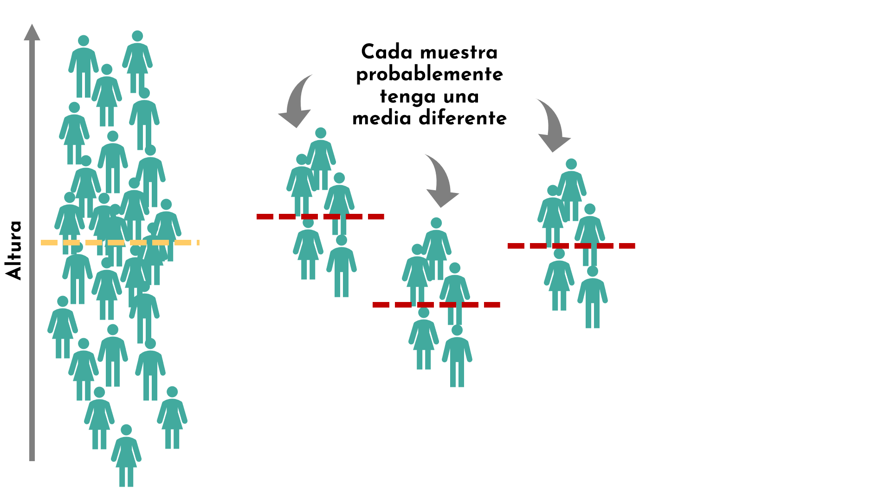

---
class: animated, fadeIn, center

<center>
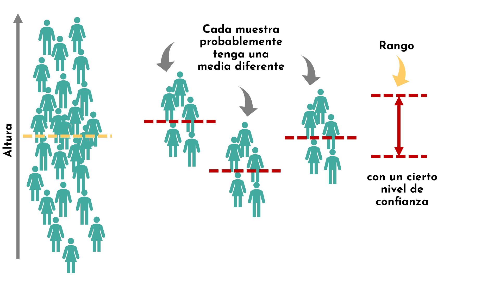

---
class: animated, fadeIn, center

<center>
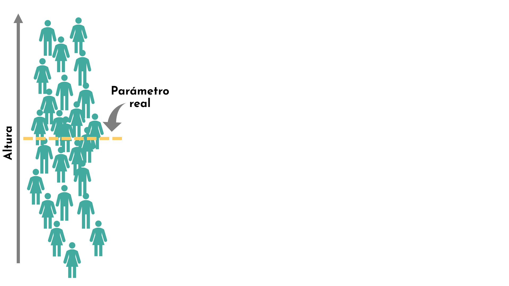

---
class: animated, fadeIn, center

<center>
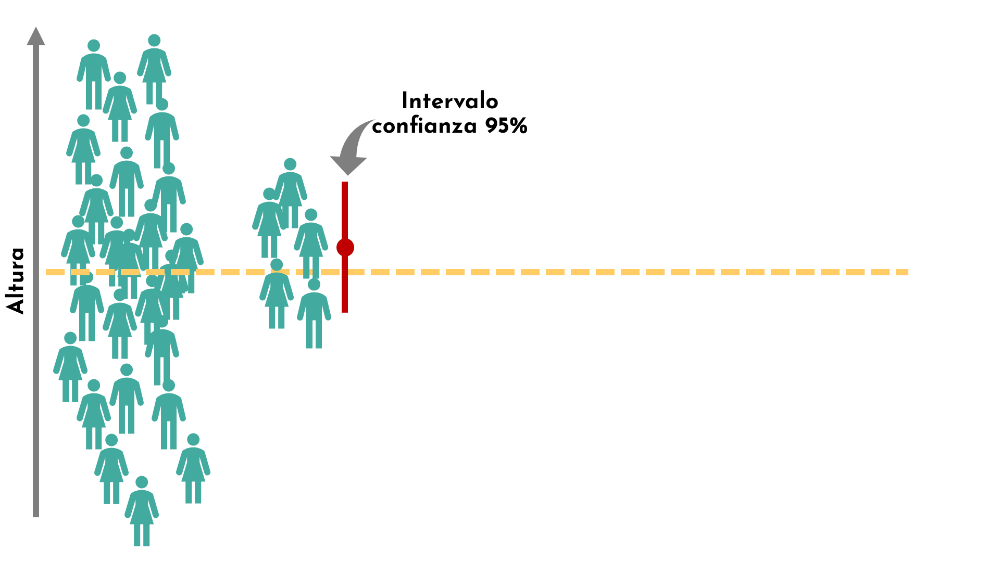

---
class: animated, fadeIn, center

<center>
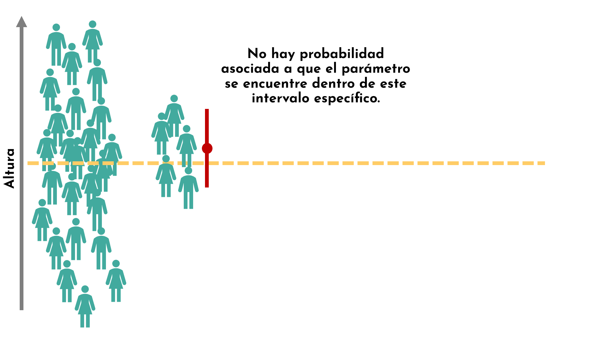

---
class: animated, fadeIn, center

<center>
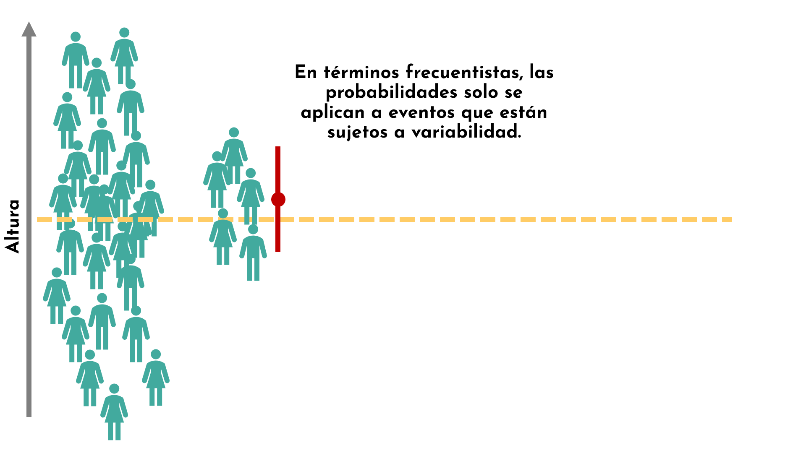

---
class: animated, fadeIn, center

<center>
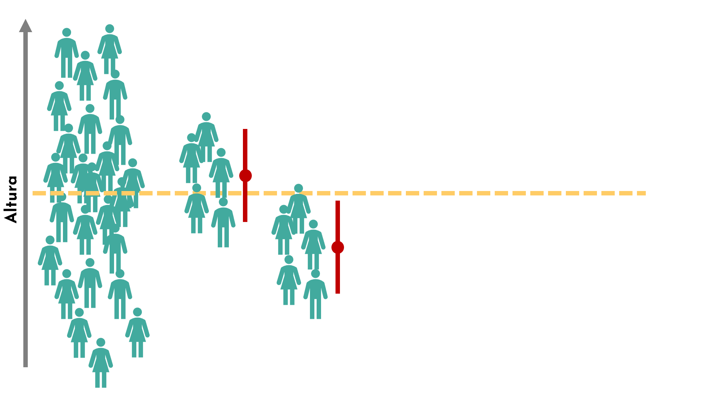

---
class: animated, fadeIn, center

<center>
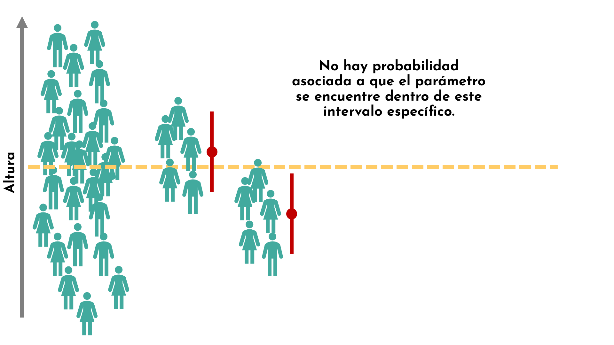

---
class: animated, fadeIn, center

<center>
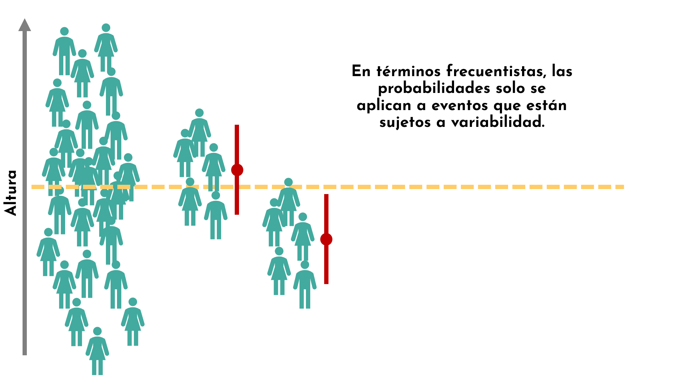

---
class: animated, fadeIn, center

<center>
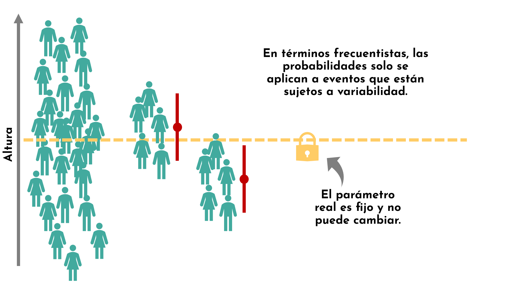

---
class: animated, fadeIn, center

<center>
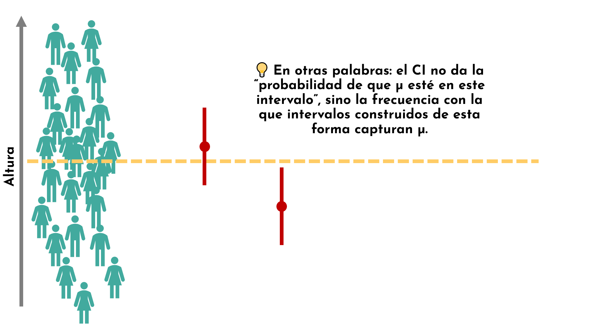

---
class: animated, fadeIn, center

<center>
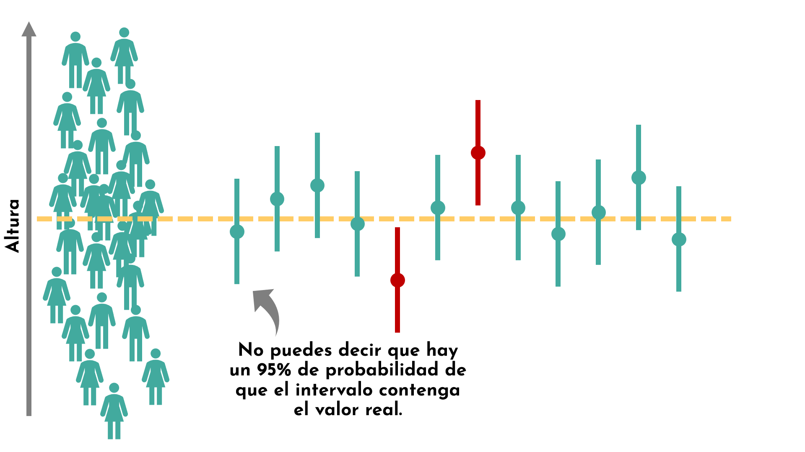

---
class: animated, fadeIn, center

<center>
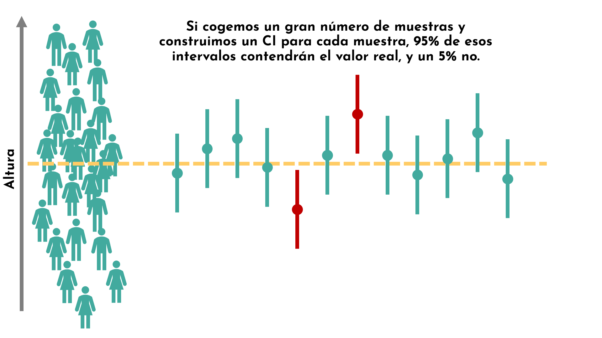

---
class: animated, fadeIn, center

<center>
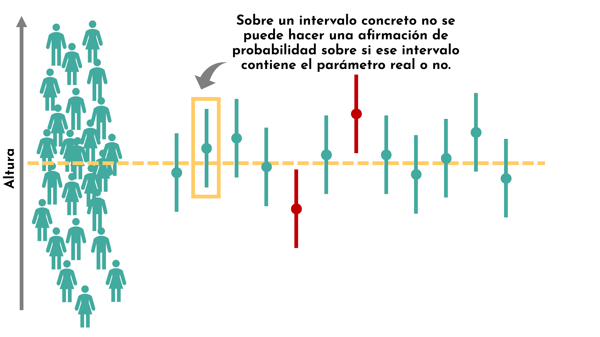

---
class: animated, fadeIn

## Intervalo de confianza (bilateral, *two-tailed*)

.pull-left[
Mientras que una **estimación puntual** consiste en un único valor, una **estimación por intervalo** proporciona un **rango plausible** de valores para un parámetro poblacional.  

Cuando estimamos una media poblacional $\mu$, un intervalo de confianza tiene la forma general:

$$
(\bar{x} - m, \bar{x} + m) = \bar{x} \pm m
$$

donde $m$ es el **margen de error**.  

Se llaman **intervalos de confianza de dos lados** porque proporcionan tanto el **límite inferior** ($\bar{x} - m$) como el **límite superior** ($\bar{x} + m$).

- El área **fuera del intervalo** se llama $\alpha$ (**nivel de significancia**).  
- Por eso, los valores críticos se denotan como $-z_{\alpha/2}$ y $z_{\alpha/2}$.
]

.pull-left[
```{r echo=FALSE, fig.height=3.5, fig.width=5, fig.align='center'}

library(ggplot2)
library(grid)

# Parámetros
conf_level <- 0.95
alpha <- 1 - conf_level
z_star <- qnorm(1 - alpha/2)

# Eje x: z-scores
x <- seq(-4, 4, length=1000)
y <- dnorm(x, 0, 1)
df <- data.frame(x=x, y=y)

ggplot(df, aes(x=x, y=y)) +
  geom_line(size=1.2, color="black") +
  # Área dentro del IC
  geom_area(data=subset(df, x >= -z_star & x <= z_star), aes(x=x, y=y), fill="cadetblue3", alpha=0.5) +
  # Área de colas (alpha)
  geom_area(data=subset(df, x < -z_star), aes(x=x, y=y), fill="firebrick3", alpha=0.4) +
  geom_area(data=subset(df, x > z_star), aes(x=x, y=y), fill="firebrick3", alpha=0.4) +
  # Líneas verticales en -z y z
  geom_vline(xintercept = c(-z_star, z_star), linetype="dashed", color="firebrick3", size=1) +
  # Flechas y texto para alpha/2
  annotate("text", x=-z_star-0.7, y=0.05, label="alpha/2", parse=TRUE) +
  annotate("text", x=z_star+0.7, y=0.05, label="alpha/2", parse=TRUE) +
  # Texto central IC
  annotate("text", x=0, y=0.25, label=paste0(conf_level*100, "% IC"), fontface="bold", color="orange4") +
  labs(title="Intervalo de confianza de dos lados",
       x=expression(z), y="Densidad")  +
  ggthemes::theme_base(base_size = 13) +
  theme(panel.grid=element_blank(),
        axis.text=element_text(color="black"),
        panel.background = element_rect(fill = "white"))
```

El margen de error $m$ se define como:

$$
m=z_{\alpha/2}\times\frac{s}{\sqrt{n}}
$$

]

---
class: animated, fadeIn

### Cálculo del IC

.pull-left[
Queremos saber **entre qué dos alturas se encuentra el 95% de la población** en una distribución normal.  

- Nivel de confianza deseado: 95% 
- Área fuera del intervalo: $\alpha = 1 - 0.95 = 0.05$  
- Como es simétrico: 2.5% en la cola inferior y 2.5% en la superior.
]

.pull-right[
```{r echo=FALSE, fig.height=3.5, fig.width=5, fig.align='center'}

library(ggplot2)
library(grid)

# Parámetros
conf_level <- 0.95
alpha <- 1 - conf_level
z_star <- qnorm(1 - alpha/2)

# Eje x: z-scores
x <- seq(-4, 4, length=1000)
y <- dnorm(x, 0, 1)
df <- data.frame(x=x, y=y)

ggplot(df, aes(x=x, y=y)) +
  geom_line(size=1.2, color="black") +
  # Área dentro del IC
  geom_area(data=subset(df, x >= -z_star & x <= z_star), aes(x=x, y=y), fill="cadetblue3", alpha=0.5) +
  # Área de colas (alpha)
  geom_area(data=subset(df, x < -z_star), aes(x=x, y=y), fill="firebrick3", alpha=0.4) +
  geom_area(data=subset(df, x > z_star), aes(x=x, y=y), fill="firebrick3", alpha=0.4) +
  # Líneas verticales en -z y z
  geom_vline(xintercept = c(-z_star, z_star), linetype="dashed", color="firebrick3", size=1) +
  # Flechas y texto para alpha/2
  annotate("text", x=-z_star-0.7, y=0.05, label="alpha/2", parse=TRUE) +
  annotate("text", x=z_star+0.7, y=0.05, label="alpha/2", parse=TRUE) +
  # Texto central IC
  annotate("text", x=0, y=0.25, label=paste0(conf_level*100, "% IC"), fontface="bold", color="orange4") +
  labs(title="Intervalo de confianza de dos lados",
       x=expression(z), y="Densidad")  +
  ggthemes::theme_base(base_size = 13) +
  theme(panel.grid=element_blank(),
        axis.text=element_text(color="black"),
        panel.background = element_rect(fill = "white"))
```
]

---
class: animated, fadeIn

### Cálculo del IC

.pull-left[
Queremos saber **entre qué dos alturas se encuentra el 95% de la población** en una distribución normal.  

- Nivel de confianza deseado: 95% 
- Área fuera del intervalo: $\alpha = 1 - 0.95 = 0.05$  
- Como es simétrico: 2.5% en la cola inferior y 2.5% en la superior.


#### Cómo usar la tabla Z (N(0,1))

1. La **tabla Z** nos da el área acumulada **por debajo de un valor Z**.  
2. No nos da directamente el valor que deja un porcentaje **entre dos límites**, pero usando simetría podemos calcularlo.  

]

.pull-right[
```{r echo=FALSE, fig.height=3.5, fig.width=5, fig.align='center'}

library(ggplot2)
library(grid)

# Parámetros
conf_level <- 0.95
alpha <- 1 - conf_level
z_star <- qnorm(1 - alpha/2)

# Eje x: z-scores
x <- seq(-4, 4, length=1000)
y <- dnorm(x, 0, 1)
df <- data.frame(x=x, y=y)

ggplot(df, aes(x=x, y=y)) +
  geom_line(size=1.2, color="black") +
  # Área dentro del IC
  geom_area(data=subset(df, x >= -z_star & x <= z_star), aes(x=x, y=y), fill="cadetblue3", alpha=0.5) +
  # Área de colas (alpha)
  geom_area(data=subset(df, x < -z_star), aes(x=x, y=y), fill="firebrick3", alpha=0.4) +
  geom_area(data=subset(df, x > z_star), aes(x=x, y=y), fill="firebrick3", alpha=0.4) +
  # Líneas verticales en -z y z
  geom_vline(xintercept = c(-z_star, z_star), linetype="dashed", color="firebrick3", size=1) +
  # Flechas y texto para alpha/2
  annotate("text", x=-z_star-0.7, y=0.05, label="alpha/2", parse=TRUE) +
  annotate("text", x=z_star+0.7, y=0.05, label="alpha/2", parse=TRUE) +
  # Texto central IC
  annotate("text", x=0, y=0.25, label=paste0(conf_level*100, "% IC"), fontface="bold", color="orange4") +
  labs(title="Intervalo de confianza de dos lados",
       x=expression(z), y="Densidad")  +
  ggthemes::theme_base(base_size = 13) +
  theme(panel.grid=element_blank(),
        axis.text=element_text(color="black"),
        panel.background = element_rect(fill = "white"))
```
]


---
class: animated, fadeIn

### Cálculo del IC

  - Queremos que el área entre los dos valores centrales sea 0.95 → cada cola tiene 0.025
  
  - El área acumulada hasta el límite superior será:  

$$
0.95 + \frac{0.05}{2} = 0.975
$$

- Buscamos en la tabla $Z$ el valor que deja **0.975 debajo de** $z$, ese será el $z$ **superior**, y el inferior será $-z$.


.pull-left[
```{r echo=FALSE, fig.height=3.5, fig.width=5, fig.align='center'}

library(ggplot2)
library(grid)

# Parámetros
conf_level <- 0.95
alpha <- 1 - conf_level
z_star <- qnorm(1 - alpha/2)

# Eje x: z-scores
x <- seq(-4, 4, length=1000)
y <- dnorm(x, 0, 1)
df <- data.frame(x=x, y=y)

ggplot(df, aes(x=x, y=y)) +
  geom_line(size=1.2, color="black") +
  # Área dentro del IC
  geom_area(data=subset(df, x >= -z_star & x <= z_star), aes(x=x, y=y), fill="cadetblue3", alpha=0.5) +
  # Área de colas (alpha)
  geom_area(data=subset(df, x < -z_star), aes(x=x, y=y), fill="firebrick3", alpha=0.4) +
  geom_area(data=subset(df, x > z_star), aes(x=x, y=y), fill="firebrick3", alpha=0.4) +
  # Líneas verticales en -z y z
  geom_vline(xintercept = c(-z_star, z_star), linetype="dashed", color="firebrick3", size=1) +
  # Flechas y texto para alpha/2
  annotate("text", x=-z_star-0.7, y=0.05, label="alpha/2", parse=TRUE) +
  annotate("text", x=z_star+0.7, y=0.05, label="alpha/2", parse=TRUE) +
  # Texto central IC
  annotate("text", x=0, y=0.25, label=paste0(conf_level*100, "% IC"), fontface="bold", color="orange4") +
  labs(title="Intervalo de confianza de dos lados",
       x=expression(z), y="Densidad")  +
  ggthemes::theme_base(base_size = 13) +
  theme(panel.grid=element_blank(),
        axis.text=element_text(color="black"),
        panel.background = element_rect(fill = "white"))
```

]

--

.pull-right[
```{r echo = F}
library(dplyr)
library(knitr)
library(kableExtra)

# Valores de las filas (0.0 a 3.0 por 0.1)
rows <- seq(1.5, 2.0, by = 0.1)

# Valores de las columnas (0.00 a 0.09 por 0.01)
cols <- seq(0, 0.08, by = 0.01)

# Generar tabla
z_table <- sapply(cols, function(c){
    sapply(rows, function(r){
        pnorm(r + c)
    })
})

# Convertir a data frame y agregar columna de fila
z_table_df <- as.data.frame(z_table)
z_table_df <- cbind(Z = rows, z_table_df)

# Nombres de columnas tipo tabla Z
colnames(z_table_df) <- c("Z", paste0("0.0", 0:8))

# Mostrar tabla
# --- Tabla bonita ---
kable(head(z_table_df, 17), digits = 4, align = "c",
      caption = "Tabla: Probabilidades acumuladas P(Z ≤ z)") %>%
    kable_styling(
        full_width = FALSE,   # evita que ocupe todo el ancho
        position = "center",  # centra la tabla
        font_size = 14
    ) %>%
    row_spec(0, bold = TRUE, background = "#e6f2ff") %>%  # encabezado en gris claro
    column_spec(1, bold = TRUE, background = "#e6f2ff") 

```

> El valor $z$ es 1.96.
]

---
class: animated, fadeIn

### Cálculo del IC

El intervalo de confianza del 95% está entre:

$$
z_{0.025} = -1.96 
$$

$$
z_{0.975} = 1.96
$$

```{r echo=FALSE, fig.height=3.5, fig.width=5, fig.align='center'}

library(ggplot2)
library(grid)

# Parámetros
conf_level <- 0.95
alpha <- 1 - conf_level
z_star <- qnorm(1 - alpha/2)

# Eje x: z-scores
x <- seq(-4, 4, length=1000)
y <- dnorm(x, 0, 1)
df <- data.frame(x=x, y=y)

ggplot(df, aes(x=x, y=y)) +
  geom_line(size=1.2, color="black") +
  # Área dentro del IC
  geom_area(data=subset(df, x >= -z_star & x <= z_star), aes(x=x, y=y), fill="cadetblue3", alpha=0.5) +
  # Área de colas (alpha)
  geom_area(data=subset(df, x < -z_star), aes(x=x, y=y), fill="firebrick3", alpha=0.4) +
  geom_area(data=subset(df, x > z_star), aes(x=x, y=y), fill="firebrick3", alpha=0.4) +
  # Líneas verticales en -z y z
  geom_vline(xintercept = c(-z_star, z_star), linetype="dashed", color="firebrick3", size=1) +
  # Flechas y texto para alpha/2
  annotate("text", x=-z_star-0.7, y=0.05, label="alpha/2", parse=TRUE) +
  annotate("text", x=z_star+0.7, y=0.05, label="alpha/2", parse=TRUE) +
  # Texto central IC
  annotate("text", x=0, y=0.25, label=paste0(conf_level*100, "% IC"), fontface="bold", color="orange4") +
  labs(title="Intervalo de confianza de dos lados",
       x=expression(z), y="Densidad")  +
  ggthemes::theme_base(base_size = 13) +
  theme(panel.grid=element_blank(),
        axis.text=element_text(color="black"),
        panel.background = element_rect(fill = "white"))
```

--

$$
IC_{95\%} = \bar{x} \pm 1.96 \cdot \frac{s}{\sqrt{n}}
$$

---
class: animated, fadeIn

### Cálculo del IC

.pull-left[
- Nivel de confianza: 90% → $\alpha = 0.10$  
- Distribuido simétricamente: 5% en cada cola  
- Queremos $z$ tal que el **área acumulada a la izquierda del límite superior = 0.90 + 0.05 = 0.95**  
- De la tabla Z: $z \approx 1.645$  
- Intervalo de confianza:  
$$
IC_{95\%} = \bar{x} \pm 1.645 \cdot \frac{s}{\sqrt{n}}
$$
]
.pull-right[


```{r echo=FALSE, fig.height=3.5, fig.width=5, fig.align='center'}

library(ggplot2)
library(grid)

# Parámetros
conf_level <- 0.9
alpha <- 1 - conf_level
z_star <- qnorm(1 - alpha/2)

# Eje x: z-scores
x <- seq(-4, 4, length=1000)
y <- dnorm(x, 0, 1)
df <- data.frame(x=x, y=y)

ggplot(df, aes(x=x, y=y)) +
  geom_line(size=1.2, color="black") +
  # Área dentro del IC
  geom_area(data=subset(df, x >= -z_star & x <= z_star), aes(x=x, y=y), fill="cadetblue3", alpha=0.5) +
  # Área de colas (alpha)
  geom_area(data=subset(df, x < -z_star), aes(x=x, y=y), fill="firebrick3", alpha=0.4) +
  geom_area(data=subset(df, x > z_star), aes(x=x, y=y), fill="firebrick3", alpha=0.4) +
  # Líneas verticales en -z y z
  geom_vline(xintercept = c(-z_star, z_star), linetype="dashed", color="firebrick3", size=1) +
  # Flechas y texto para alpha/2
  annotate("text", x=-z_star-0.9, y=0.05, label="alpha/2", parse=TRUE) +
  annotate("text", x=z_star+0.9, y=0.05, label="alpha/2", parse=TRUE) +
  # Texto central IC
  annotate("text", x=0, y=0.25, label=paste0(conf_level*100, "% IC"), fontface="bold", color="orange4") +
  labs(title="Intervalo de confianza de dos lados",
       x=expression(z), y="Densidad")  +
  ggthemes::theme_base(base_size = 13) +
  theme(panel.grid=element_blank(),
        axis.text=element_text(color="black"),
        panel.background = element_rect(fill = "white"))
```

]

```{r echo = F}
library(dplyr)
library(knitr)
library(kableExtra)

# Valores de las filas (0.0 a 3.0 por 0.1)
rows <- seq(1.5, 2.0, by = 0.1)

# Valores de las columnas (0.00 a 0.09 por 0.01)
cols <- seq(0, 0.09, by = 0.01)

# Generar tabla
z_table <- sapply(cols, function(c){
    sapply(rows, function(r){
        pnorm(r + c)
    })
})

# Convertir a data frame y agregar columna de fila
z_table_df <- as.data.frame(z_table)
z_table_df <- cbind(Z = rows, z_table_df)

# Nombres de columnas tipo tabla Z
colnames(z_table_df) <- c("Z", paste0("0.0", 0:9))

# Mostrar tabla
# --- Tabla bonita ---
kable(head(z_table_df, 17), digits = 4, align = "c",
      caption = "Tabla: Probabilidades acumuladas P(Z ≤ z)") %>%
    kable_styling(
        full_width = FALSE,   # evita que ocupe todo el ancho
        position = "center",  # centra la tabla
        font_size = 14
    ) %>%
    row_spec(0, bold = TRUE, background = "#e6f2ff") %>%  # encabezado en gris claro
    column_spec(1, bold = TRUE, background = "#e6f2ff") 

```

---
class: animated, fadeIn


## Ejemplo: duración de los neumáticos 🚗

La duración (en km) de los neumáticos de cierta marca se ajusta a una distribución normal:

$$
X \sim N(\mu = 48000, \sigma = 3000)
$$

> ¿Cuál es el intervalo dentro del cual se encuentra, con un 80% de confianza, la media de duración de los neumáticos de esta marca?

--

#### Paso 1: Determinar $\alpha$ y $z$ crítico

- Nivel de confianza: 80% → $\alpha = 1 - 0.8 = 0.2$  
- Área en cada cola: 0.1  
- Buscamos $z$ tal que **área acumulada a la izquierda = 0.8 + 0.1 = 0.9**  


```{r echo = F}
library(dplyr)
library(knitr)
library(kableExtra)

# Valores de las filas (0.0 a 3.0 por 0.1)
rows <- seq(1, 1.3, by = 0.1)

# Valores de las columnas (0.00 a 0.09 por 0.01)
cols <- seq(0, 0.09, by = 0.01)

# Generar tabla
z_table <- sapply(cols, function(c){
    sapply(rows, function(r){
        pnorm(r + c)
    })
})

# Convertir a data frame y agregar columna de fila
z_table_df <- as.data.frame(z_table)
z_table_df <- cbind(Z = rows, z_table_df)

# Nombres de columnas tipo tabla Z
colnames(z_table_df) <- c("Z", paste0("0.0", 0:9))

# Mostrar tabla
# --- Tabla bonita ---
kable(head(z_table_df, 17), digits = 4, align = "c",
      caption = "Tabla: Probabilidades acumuladas P(Z ≤ z)") %>%
    kable_styling(
        full_width = FALSE,   # evita que ocupe todo el ancho
        position = "center",  # centra la tabla
        font_size = 14
    ) %>%
    row_spec(0, bold = TRUE, background = "#e6f2ff") %>%  # encabezado en gris claro
    column_spec(1, bold = TRUE, background = "#e6f2ff") 

```

<center>
De la tabla Z:  $z \approx 1.28$

---
class: animated, fadeIn


## Ejemplo: duración de los neumáticos 🚗

#### Paso 2: Convertir a valores de la población

Fórmula de conversión de $Z$ a $X$:  

$$
Z=\frac{X-\mu}{\sigma}, \quad
X = \mu + z \times \sigma
$$

- Límite inferior:  
$$
x_{\text{inf}} = \mu + (-1.28) \cdot \sigma = 48000 - 1.28 \cdot 3000 \approx 44160
$$

- Límite superior:  
$$
x_{\text{sup}} = \mu + 1.28 \cdot \sigma = 48000 + 1.28 \cdot 3000 \approx 51840
$$

**Intervalo de confianza 80%:**  
$$
IC_{80\%} = (44160, 51840)
$$

> Con un **80% de confianza**, la media de duración de los neumáticos se encuentra entre 44,160 km y 51,840 km.

---
class: animated, fadeIn


## Ejemplo: duración de los neumáticos 🚗

#### Visualización

```{r ic-neumaticos, echo=FALSE, fig.height=6, fig.width=9, fig.align='center'}
library(ggplot2)
library(ggthemes)

# Datos
mu <- 48000
sigma <- 3000
z_star <- 1.28        # Para IC 80%
conf_level <- 0.80

# Límites del IC en valores originales
x_lower <- mu - z_star*sigma
x_upper <- mu + z_star*sigma

# Secuencia para curva normal
x <- seq(mu - 4*sigma, mu + 4*sigma, length=1000)
y <- dnorm(x, mean=mu, sd=sigma)
df <- data.frame(x=x, y=y)

ggplot(df, aes(x=x, y=y)) +
    geom_line(size=1.2, color="black") +
    # Área dentro del IC
    geom_area(data=subset(df, x >= x_lower & x <= x_upper), aes(x=x, y=y), fill="cadetblue3", alpha=0.5) +
    # Área de colas (alpha)
    geom_area(data=subset(df, x < x_lower), aes(x=x, y=y), fill="firebrick3", alpha=0.4) +
    geom_area(data=subset(df, x > x_upper), aes(x=x, y=y), fill="firebrick3", alpha=0.4) +
    # Líneas verticales en los límites del IC
    geom_vline(xintercept = c(x_lower, x_upper), linetype="dashed", color="firebrick3", size=1) +
    # Texto para alpha/2
  annotate("text", x=x_lower - 2000, y=0.00004, label="α/2") +
annotate("text", x=x_upper + 2000, y=0.00004, label="α/2") +
    # Texto central IC
    annotate("text", x=mu, y=0.00012, label=paste0(conf_level*100, "% IC"), fontface="bold", color="orange4") +
    labs(title="Intervalo de confianza de dos lados",
         x="Duración (km)", y="Densidad") +
    ggthemes::theme_base(base_size = 16) +
    theme(panel.grid=element_blank(),
          axis.text=element_text(color="black"),
          panel.background = element_rect(fill = "white"))
```
---

class: animated, fadeIn


### Estimación de la media poblacional a partir de una muestra

Supongamos que queremos estimar la **estatura media en Catalunya ($\mu$)**.

- Tomamos una **muestra aleatoria** de $N = 100$ personas y obtenemos una **media muestral**: $\bar{x} = 169 \text{cm}$  

- ¿Podemos afirmar que la media poblacional $\mu$ es igual a 169 cm?  

--

> No. Solo con una muestra no podemos afirmar el valor exacto de $\mu$.  

Lo que sí podemos hacer es construir un **intervalo de confianza** alrededor de la media muestral dentro del cual **esperamos que se encuentre $\mu$ con cierta seguridad**.


---

class: animated, fadeIn


### Estimación de la media poblacional a partir de una muestra

A partir de la **media muestral $\bar{x}$** y el **error estándar**, podemos calcular:

$$
IC = (\bar{X} - \text{error}, \bar{X} + \text{error})
$$

donde el **error** se calcula como:

$$
\text{error} = z_{\alpha/2} \cdot \frac{\sigma}{\sqrt{N}}
$$

- $z_{\alpha/2}$: valor crítico según el nivel de confianza deseado  
- $\sigma$: desviación estándar poblacional  
- $N$: tamaño de la muestra  

Por lo tanto, los límites del IC son:

$$
x_1 = \bar{X} - z_{\alpha/2} \frac{\sigma}{\sqrt{N}}, \quad
x_2 = \bar{X} + z_{\alpha/2} \frac{\sigma}{\sqrt{N}}
$$


---
class: animated, fadeIn


### Estimación de la media poblacional a partir de una muestra


```{r echo=FALSE, fig.height=6, fig.width=9, fig.align='center'}
library(ggplot2)
library(ggthemes)

# Datos
mu <- 169
sigma <- 10
z_star <- 1.96       
conf_level <- 0.95

# Límites del IC en valores originales
x_lower <- mu - z_star*sigma
x_upper <- mu + z_star*sigma

# Secuencia para curva normal
x <- seq(mu - 4*sigma, mu + 4*sigma, length=1000)
y <- dnorm(x, mean=mu, sd=sigma)
df <- data.frame(x=x, y=y)

ggplot(df, aes(x=x, y=y)) +
    geom_line(size=1.2, color="black") +
    # Área dentro del IC
    geom_area(data=subset(df, x >= x_lower & x <= x_upper), aes(x=x, y=y), fill="cadetblue3", alpha=0.5) +
    # Área de colas (alpha)
    geom_area(data=subset(df, x < x_lower), aes(x=x, y=y), fill="firebrick3", alpha=0.4) +
    geom_area(data=subset(df, x > x_upper), aes(x=x, y=y), fill="firebrick3", alpha=0.4) +
    # Líneas verticales en los límites del IC
    geom_vline(xintercept = c(x_lower, x_upper), linetype="dashed", color="firebrick3", size=1) +
    # Texto para alpha/2
  annotate("text", x=x_lower - 10, y=0.005, label="α/2") +
annotate("text", x=x_upper + 10, y=0.005, label="α/2") +
    # Texto central IC
    annotate("text", x=mu, y=0.012, label=paste0(conf_level*100, "% IC"), fontface="bold", color="orange4") +
    labs(title="Intervalo de confianza de dos lados",
         x="Altura", y="Densidad") +
    ggthemes::theme_base(base_size = 16) +
    theme(panel.grid=element_blank(),
          axis.text=element_text(color="black"),
          panel.background = element_rect(fill = "white"))
```
---

class: animated, fadeIn

## Precisión de la media según el tamaño de la muestra

- Cuanto mayor sea $N$, **más precisa** será la media muestral $\bar{X}$

- El **error estándar** disminuye:

$$
\text{error} = z_{\alpha/2} \cdot \frac{\sigma}{\sqrt{N}}
$$

- IC más estrecho → media poblacional más centrada

---
class: animated, fadeIn

### Ejemplo: Tiempo diario dedicado a actividades deportivas 🤸

- Distribución poblacional: $X \sim N(\mu, \sigma=20 \text{ min})$

- Muestra aleatoria simple: $N = 250$

- Media muestral: $\bar{x} = 90 \text{ min}$

- Queremos **IC del 90%** para $\mu$

--

#### Cálculo del IC

- Nivel de confianza: 90% → $\alpha = 0.10$  

- $z$ crítico: $z_{0.95} = 1.645$  

$$
\text{error} = z \times \frac{\sigma}{\sqrt{N}} = 1.645 \times \frac{20}{\sqrt{250}} \approx 2.08
$$

$$
IC_{90\%} = (\bar{x} - \text{error}, \bar{x} + \text{error}) = (90 - 2.08, 90 + 2.08) \approx (87.92, 92.08)
$$


> Con un 90% de certeza, la **media poblacional \(\mu\)** está entre **87.92 y 92.08 minutos diarios**.


---
class: animated, fadeIn

### Ejemplo: Tiempo diario dedicado a actividades deportivas 🤸

```{r echo=FALSE, fig.height=6, fig.width=9, fig.align='center'}
library(ggplot2)
library(ggthemes)

# Datos
mu <- 90
sigma <- 20
N <- 250
z_star <- 1.645       # IC 90%
conf_level <- 0.9

SE <- sigma / sqrt(N)

# Límites del IC en valores originales
x_lower <- mu - z_star*SE
x_upper <- mu + z_star*SE

# Secuencia para curva normal de la media muestral
x <- seq(mu - 4*SE, mu + 4*SE, length=1000)
y <- dnorm(x, mean=mu, sd=SE)
df <- data.frame(x=x, y=y)

ggplot(df, aes(x=x, y=y)) +
    geom_line(size=1.2, color="black") +
    geom_area(data=subset(df, x >= x_lower & x <= x_upper), aes(x=x, y=y), fill="cadetblue3", alpha=0.5) +
    geom_area(data=subset(df, x < x_lower), aes(x=x, y=y), fill="firebrick3", alpha=0.4) +
    geom_area(data=subset(df, x > x_upper), aes(x=x, y=y), fill="firebrick3", alpha=0.4) +
    geom_vline(xintercept = c(x_lower, x_upper), linetype="dashed", color="firebrick3", size=1) +
    annotate("text", x=x_lower - 1, y=max(y)*0.1, label="α/2") +
    annotate("text", x=x_upper + 1, y=max(y)*0.1, label="α/2") +
    annotate("text", x=mu, y=max(y)*0.5, label=paste0(conf_level*100, "% IC"), fontface="bold", color="orange4") +
    labs(title="Intervalo de confianza de dos lados",
         x="Minutos actividades deportivas", y="Densidad") +
    ggthemes::theme_base(base_size = 16) +
    theme(panel.grid=element_blank(),
          axis.text=element_text(color="black"),
          panel.background = element_rect(fill = "white"))
```

---

class: animated, fadeIn

## Permitir un error máximo

Queremos estimar la media poblacional $\mu$ de **tiempo diario dedicado a deporte** con un **error máximo permitido** de 1 minuto y un **nivel de confianza del 90%**.

- Desviación estándar poblacional conocida: $\sigma = 20$ min  

- Nivel de confianza: 90% → $z_{\alpha/2} = 1.645$  

- **Error máximo permitido**: $E = 1 min.$ 

--

#### Fórmula para el tamaño de la muestra

$$
\text{error} = z_{\alpha/2} \cdot \frac{\sigma}{\sqrt{N}} \le E
$$

De donde despejamos $N$:

$$
\sqrt{N} \ge \frac{z_{\alpha/2} \times \sigma}{E} 
$$

$$
\implies N \ge \left(\frac{z_{\alpha/2} \times \sigma}{E}\right)^2
$$
---

class: animated, fadeIn

## Permitir un error máximo

$$
N \ge \left(\frac{1.645 \times 20}{1}\right)^2
$$

$$
N \ge 1082.41
$$

> Por lo tanto, necesitamos **al menos 1083 individuos** (redondeando hacia arriba) para garantizar que el error máximo en la estimación de $\mu$ sea menor a 1 minuto con un 90% de confianza.

---

class: animated, fadeIn

## Permitir un error máximo

- Fórmula general:

$$
N = \left(\frac{z_{\alpha/2} \times \sigma}{\text{error deseado}}\right)^2
$$

- Siempre redondear hacia arriba para asegurar que se cumple la condición.

- Cuanto mayor sea $N$, más precisa será la estimación de la media poblacional.

---
class: animated, fadeIn

## Intervalos de confianza unilaterales (*one-sided*)

- Proporcionan **un límite inferior o un límite superior**, pero **no ambos**.

- Forma general:  

$$
(-\infty, \bar{x} + \text{error}) \quad \text{o} \quad (\bar{x} - \text{error}, \infty)
$$

- Se utiliza **el error estándar (SE)** y un valor $z$ crítico, pero el $z$ **es distinto** que para intervalos bilaterales.  

--

#### Ejemplo conceptual

Queremos construir un IC del **95%** de manera que podamos afirmar que, basándonos en la muestra, la media poblacional $\mu$ se encuentre **por debajo de** $\bar{x} + \text{error}$.  

- Calculamos $z$ tal que el área en la **cola derecha = 0.05**  

- Intervalo de confianza superior: 

$$
(-\infty, \bar{x} + 1.645 \times SE)
$$

---

class: animated, fadeIn

## Intervalos de confianza unilaterales (*one-sided*)

**Datos:**  
- Muestra de 60 adultos  
- Media muestral: $\bar{x} = 77$  
- Error estándar: $SE = 2.87$

**Cálculo del límite inferior de un IC de 95% (*one-sided*):**  

$$
\text{límite inferior} = \bar{x} - (1.645 \times SE) = 77 - (1.645 \times 2.87) \approx 72.28
$$

**Intervalo de confianza:**  
$$
(72.28, \infty)
$$

> Con un 95% de confianza, el peso promedio de los adultos en EEUU se encuentra por encima de 72.28kg.

---
class: animated, fadeIn

## Interpretación correcta de un IC

- La interpretación correcta de un IC XX% es: 

> **"Estamos XX% seguros de que el parámetro poblacional se encuentra dentro del intervalo."  **

- No se debe decir que hay XX% de probabilidad de que el parámetro esté dentro del intervalo.

- El nivel de confianza refleja la **fiabilidad del procedimiento**, es decir, que si repitiéramos el procedimiento muchas veces bajo los mismos supuestos, el IC contendría el parámetro verdadero XX% de las veces.  


```{r echo=FALSE, fig.height=4, fig.width=6, fig.align='center'}
library(ggplot2)
library(ggthemes)


X_bar <- 77
SE <- 2.87
z <- 1.645

# Límite inferior
lower <- X_bar - z*SE
# Límite superior infinito
upper <- Inf

x <- seq(lower - 10, X_bar + 3*SE, length=1000)
y <- dnorm(x, mean=X_bar, sd=SE)
df <- data.frame(x=x, y=y)

ggplot(df, aes(x=x, y=y)) +
  geom_line(size=1.2) +
  geom_area(data=subset(df, x >= lower), aes(x=x, y=y), fill="orange1", alpha=0.5) +
  geom_area(data=subset(df, x < lower), aes(x=x, y=y), fill="firebrick3", alpha=0.3) +
  geom_vline(xintercept=lower, linetype="dashed", color="firebrick3") +
  annotate("text", x=lower + 5, y=max(y)*0.7, label="IC 95% one-sided", fontface="bold", color="orange1") +
  labs(title="Intervalo de confianza one-sided (inferior)", x="Peso (kg)", y="Densidad") +
  ggthemes::theme_base(base_size = 13) +
  theme(panel.grid=element_blank(),
        axis.text=element_text(color="black"),
        panel.background = element_rect(fill = "white"))
```

---
class: animated, fadeIn

## Contacto

<div style="margin-top: 20vh; text-align:center;">

| Marta Coronado Zamora | David Castellano | 
|:-:|:-:|
| <a href="mailto:marta.coronado@uab.cat"><i class="fa fa-paper-plane fa-fw"></i> marta.coronado@uab.cat</a> | <a href="mailto:david.castellano@uab.cat"><i class="fa fa-paper-plane fa-fw"></i>&nbsp; david.castellano@uab.cat</a> | 
| <a href="https://bsky.app/profile/geneticament.bsky.social"><i class="fab fa-bluesky fa-fw"></i>&nbsp; @geneticament.bsky.social</a> |                 <a href="https://bsky.app/profile/castellanoed.bsky.social"><i class="fab fa-bluesky fa-fw"></i>&nbsp; @castellanoed.bsky.social</a> |
| <a href="https://www.uab.cat"><i class="fa fa-map-marker fa-fw"></i>&nbsp; Universitat Autònoma de Barcelona</a> |    <a href="https://gutengroup.mcb.arizona.edu/"> <i class="fa fa-map-marker fa-fw"></i>&nbsp; University of Arizona</a> |

