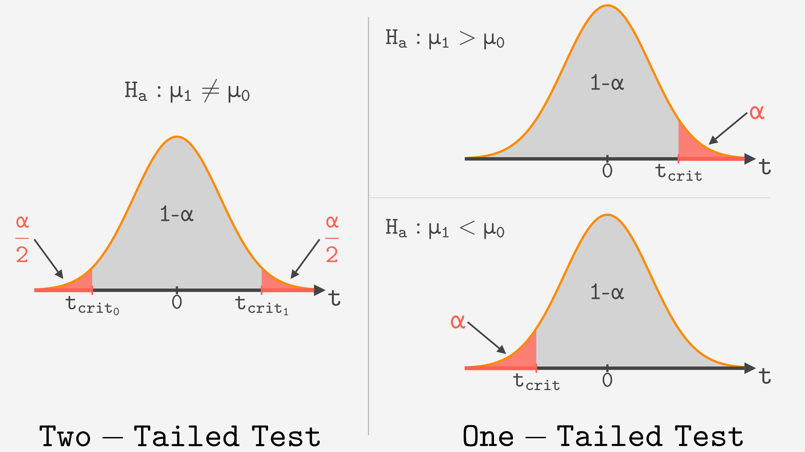

```{r setup, include=FALSE}
# Load useful packages
library(rmdformats)   # for extra formatting if needed
knitr::opts_chunk$set(echo = TRUE, warning = F, message = F, fig.retina = 5)
library(ggplot2)
```

```{=html}
<style>
body {
  font-size: 14px;   /* un poco más grande */
  color: black;      /* asegura texto en negro */
}

h1, h2, h3, h4, h5, h6 {
  color: #5dc1b9;        /* títulos en rojo */
  font-size: 16px
}

h3, h4, h5, h6 {
  color: black;        /* títulos en rojo */
}

h3 {
  font-size: 1em;   /* tamaño igual al texto normal */
}

</style>
```

## **Estadística descriptiva**

**Media aritmética**

$$
\bar{x} = \mu = \frac{1}{n} \sum_{i=1}^{n} x_i
$$

donde:

-   $\bar{x} = \mu$ : media aritmética\
-   $n$ : número de muestras
-   $i$ : índice de los valores de la variable ($i = 1, 2, \dots, n$)\
-   $x_i$ : valor $i$-ésimo de la variable $x$

<br>

**Mediana**

-   Para un número **impar** de observaciones ($n$):

$$
\text{mediana}(x) = \left(\frac{n+1}{2}\right)^{\text{th}}
$$

-   Para un número **par** de observaciones:

$$
\text{mediana}(x) = \frac{\left(
{\left(\tfrac{n}{2}\right)}^{\text{th}} + {\left(\tfrac{n}{2}+1\right)}^{\text{th}}\right)
}{2}
$$

donde:

-   $\text{mediana}(x)$: mediana de los valores disponibles de la
    variable $x$\
-   $n$: número de observaciones disponibles para $x$

<br>

**Moda**

$$
moda(x)=max_{k=1}(I_{i=1}(x_i=x_k))
$$

donde:

-   $\text{moda}(x)$: moda de los valores disponibles de la variable $x$
-   $\max_{k=1}()$: argumento que maximiza sobre $k$ en $1$ a $p$
-   $I_i()$: función indicadora que devuelve 1 si la condición interna
    es cierta para $i$ en $1$ a $n$

<br>

**Rango**

Diferencia entre el valor máximo y el mínimo de una variable $x$:

$$
rango = x_{\text{max}} - x_{\text{min}}
$$

<br>

**Varianza**

$$
s^2 = \frac{1}{n-1} \sum_{i=1}^{n} (x_i - \bar{x})^2
$$

donde:

-   $s^2$: varianza\
-   $n$: número de observaciones de la muestra\
-   $i$: índice de los valores de la variable ($i = 1, 2, \dots, n$)\
-   $x_i$: valor $i$-ésimo de la variable $x$\
-   $\bar{x}$: media aritmética

<br>

**Desviación estándard**

$$
SD = s = \sqrt{s^2}
$$

donde:

-   $SD = s$: desviación estándar\
-   $s^2$: varianza

<br>

**Cuantiles**

| Nombre | Símbolo | Porcentaje de los datos | Interpretación |
|:-----------------|:-----------------|:-----------------|:-----------------|
| Primer cuartil | $Q_1$ | 25% | El 25% de los datos son menores o iguales que este valor |
| Segundo cuartil (mediana) | $Q_2$ | 50% | El 50% de los datos son menores o iguales que este valor |
| Tercer cuartil | $Q_3$ | 75% | El 75% de los datos son menores o iguales que este valor |

<br>

**Rango intercuartílico**

$$
IQR=Q_3-Q_1
$$

<br>

***Outliers***

$$
\text{Cerca inferior} = Q_1 - 1.5 \times IQR
$$

$$
\text{Cerca superior} = Q_3 + 1.5 \times IQR
$$

<hr>

## **Distribuciones**

**Asimetría**

```{r,  eval=T, echo = F, fig.height=2.8,fig.width=8, fig.align="center", fig.retina=5}
library(ggplot2)
library(dplyr)
library(patchwork)

# Función para simplificar el tema de cada gráfico
clean_theme <- function() {
  theme_void() + 
    theme(
      plot.title = element_text(hjust = 0.5), # centrar títulos
      panel.border = element_rect(colour = "black", fill = NA, size = 0.8) # marco exterior
    )
}

# Sym
x_sym <- seq(-4, 4, length.out = 1000)
data_sym <- data.frame(x = x_sym, y = dnorm(x_sym, mean = 0, sd = 1))

p_norm <- ggplot(data_sym, aes(x, y)) +
  geom_area(fill = "#0E8A8A", alpha = 0.6) +
  labs(title = "Simétrica") +
  clean_theme()

# Asimetría positiva
x_pos <- seq(0, 10, length.out = 1000)
data_pos <- data.frame(x = x_pos, y = dgamma(x_pos, shape = 2, scale = 1))
p_pos <- ggplot(data_pos, aes(x, y)) +
  geom_col(fill = "#0E8A8A", alpha = 0.6) +
  labs(title = "Asimetría positiva") +
  clean_theme()

# Asimetría negativa
data_neg <- data.frame(x = -x_pos, y = dgamma(x_pos, shape = 2, scale = 1))
p_neg <- ggplot(data_neg, aes(x, y)) +
  geom_col(fill = "#0E8A8A", alpha = 0.6) +
  labs(title = "Asimetría negativa") +
  clean_theme()

# Organizar en cuadrícula 2x3
(p_pos | p_norm | p_neg)

```

<br>

**Curtosis**

```{r echo = F, fig.height=5, fig.width=8,fig.align='center'}
library(ggplot2)
library(dplyr)

# Crear secuencia de valores x
x <- seq(-5, 5, length.out = 1000)

# Distribución mesocúrtica (normal)
meso <- data.frame(
  x = x,
  y = dnorm(x, mean = 0, sd = 1),
  Tipo = "Mesocúrtica (normal)"
)

# Distribución leptocúrtica (colas cortas, más alta en el centro)
lepto <- data.frame(
  x = x,
  y = dnorm(x, mean = 0, sd = 0.5),
  Tipo = "Leptocúrtica (colas cortas)"
)

# Distribución platicúrtica (colas largas, más baja y ancha)
plati <- data.frame(
  x = x,
  y = dnorm(x, mean = 0, sd = 2),
  Tipo = "Platicúrtica (colas largas)"
)

# Unir los datos
df <- bind_rows(meso, lepto, plati)

# Graficar
ggplot(df, aes(x = x, y = y, color = Tipo)) +
  geom_line() +
  labs(x="",
       y = "Densidad") +
  theme_minimal() +
  scale_color_manual(values = c("cadetblue3", "orange2", "firebrick3")) +
  ggthemes::theme_base(base_size = 16) +
  theme(panel.grid=element_blank(),
        axis.text=element_text(color="black"),
        panel.background = element_rect(fill = "white"))
```

<hr>

## **Distribución binomial**

**Fórmula de la distribución binomial**

$$
P(X = k) = \binom{n}{k} p^k (1-p)^{n-k}
$$

donde:

-   $n$: número total de ensayos o repeticiones del experimento
-   $k$: número de éxitos observados
-   $p$: probabilidad de éxito en un solo ensayo
-   $1 - p$: probabilidad de fracaso

<br>

**Coeficiente binomial**

$$
{n \choose k} \;=\; \frac{n!}{k!\,(n - k)!}
$$

donde:

-   $n = 1, 2, \dots$: número total de ensayos
-   $k = 0, 1, 2, \dots , n$: número de éxitos posibles
-   Para cualquier número entero $m$,
    $m! = m \times (m - 1) \times (m - 2) \times \dots \times 1$

<br>

**Tabla resumen de la binomial**

| Símbolo      | Significado    | Expresión          |
|:-------------|:---------------|:-------------------|
| $P(X \le k)$ | “como mucho k” | $P(X \le k)$       |
| $P(X < k)$   | “menos de k”   | $P(X \le k-1)$     |
| $P(X \ge k)$ | “al menos k”   | $1 - P(X \le k-1)$ |
| $P(X > k)$   | “más de k”     | $1 - P(X \le k)$   |

<br>

Si la variable aleatoria sigue una distribución
$X \sim \text{Binomial}(n, p)$, entonces:

-   **Media**\
    $$
    \mu = n \times p
    $$

-   **Varianza**\
    $$
    \sigma^2 = n \times p \times (1 - p)
    $$

<hr>

## **Distribución normal**

Si la variable aleatoria sigue una distribución
$X \sim N(\mu, \sigma^2)$, entonces:

-   $\mu$ representa la **media**
-   $\sigma$ representa la **desviación estándar**

<br>

**Estandarización**

Si una variable aleatoria $X$ sigue una distribución normal con media
$\mu$ y varianza $\sigma^2$, $X \sim N(\mu,\ \sigma^2)$, entonces la
variable estandarizada:

$$
Z = \frac{X - \mu}{\sigma}
$$

sigue una distribución normal estándar: $Z \sim N(0,1)$.

<br>

**Tabla resumen de la normal**

| Símbolo | Significado | Expresión |
|:-----------------------|:-----------------------|:-----------------------|
| $P(X \le x)$ | “como mucho x” | $P(X \le x)$ |
| $P(X < x)$ | “menos de x” | $P(X \le x)$ (igual, continua) |
| $P(X \ge x)$ | “al menos x” | $1 - P(X \le x)$ |
| $P(X > x)$ | “más de x” | $1 - P(X \le x)$ |
| $P(a \le X \le b)$ | “entre a y b” | $P(X \le b) - P(X \le a)$ |
| $P(a < X < b)$ | “entre a y b” | $P(X \le b) - P(X \le a)$ (igual, continua) |

<br>

**Regla empírica ("68-95-99.7")**:

```{r, echo = F, fig.align='center', fig.height=4.1, fig.width=5}
library(ggplot2)
library(dplyr)
library(ggthemes)

# Parámetros
mu <- 0
sigma <- 1

# Secuencia de valores para la curva
x <- seq(mu - 4*sigma, mu + 4*sigma, length.out = 1000)
df <- data.frame(x = x, y = dnorm(x, mean = mu, sd = sigma))

# Rellenos para cada rango
fill_areas <- list(
  data.frame(x = x[x >= mu - sigma & x <= mu + sigma],
             y = dnorm(x[x >= mu - sigma & x <= mu + sigma], mu, sigma),
             area = "±1σ"),
  data.frame(x = x[x >= mu - 2*sigma & x <= mu + 2*sigma],
             y = dnorm(x[x >= mu - 2*sigma & x <= mu + 2*sigma], mu, sigma),
             area = "±2σ"),
  data.frame(x = x[x >= mu - 3*sigma & x <= mu + 3*sigma],
             y = dnorm(x[x >= mu - 3*sigma & x <= mu + 3*sigma], mu, sigma),
             area = "±3σ")
) %>% bind_rows()

# Valores para las líneas verticales
sd_lines <- data.frame(
  x = c(mu - 3*sigma, mu - 2*sigma, mu - sigma, mu,
        mu + sigma, mu + 2*sigma, mu + 3*sigma),
  label = c("-3σ", "-2σ", "-1σ", "μ",
            "+1σ", "+2σ", "+3σ")
)

# Segmentos horizontales para porcentajes
segments <- data.frame(
  y = c(0.09, 0.05, 0),        # altura donde poner el segmento
  xstart = c(mu - sigma, mu - 2*sigma, mu - 3*sigma),
  xend   = c(mu + sigma, mu + 2*sigma, mu + 3*sigma),
  label  = c("68%", "95%", "99.7%")
)

# Gráfico
ggplot() +
  # Áreas rellenas (las más pequeñas encima de las grandes)
  geom_ribbon(data = filter(fill_areas, area == "±3σ"),
              aes(x = x, ymin = 0, ymax = y, fill = area), alpha = 0.3, show.legend = F) +
  geom_ribbon(data = filter(fill_areas, area == "±2σ"),
              aes(x = x, ymin = 0, ymax = y, fill = area), alpha = 0.4, show.legend = F) +
  geom_ribbon(data = filter(fill_areas, area == "±1σ"),
              aes(x = x, ymin = 0, ymax = y, fill = area), alpha = 0.6, show.legend = F) +
  # Curva
  geom_line(data = df, aes(x = x, y = y), size = 1, color = "white") +
  # Líneas verticales
  geom_vline(data = sd_lines, aes(xintercept = x),
             linetype = "dashed", color = "gray70") +
  # Segmentos horizontales
  geom_segment(
  data = segments,
  aes(x = xstart, xend = xend, y = y, yend = y),
  color = "black",
  linewidth = 1,
  arrow = arrow(ends = "both",    # flecha en ambos extremos <--->
                type = "closed",  # estilo "cerrado" para que sea triangular
                length = unit(0.05, "inches")) # tamaño de las puntas
) +
  geom_text(data = segments,
            aes(x = mu, y = y + 0.02, label = label),
            color = "black") +
  # Personalizar eje x
  scale_x_continuous(
    breaks = sd_lines$x,
    labels = sd_lines$label
  ) +
  scale_fill_manual(values = c("±1σ" = "orange2",
                               "±2σ" = "gold",
                               "±3σ" = "cadetblue3")) +
  labs(
    x = "Desviaciones estándar",
    y = "",
    fill = "Área"
  ) +
  ggthemes::theme_base(base_size = 18) +
  theme(panel.grid = element_blank(),
        axis.text = element_text(color = "black"),
        axis.text.y = element_blank(),
        axis.ticks.y = element_blank(),
        panel.background = element_rect(fill = "white"))


```

-   \~68% de los valores dentro de 1 desviación estándar de la media
-   \~95% dentro de 2 desviaciones estándar
-   \~99.7% dentro de 3 desviaciones estándar

<hr>

## **Distribución de Poisson**

**Fórmula de la distribución de Poisson**

$$
P(X = k) = \frac{ e^{-\lambda} \lambda^k}{k!}
$$

donde:

-   $X$: número de eventos en un intervalo dado\
-   $\lambda$: tasa esperada de eventos en ese intervalo ($n \times p$)
-   $k$: número de eventos observados

<br>

Si la variable aleatoria sigue una distribución de Poisson
$X \sim \text{Poisson}(\lambda)$, entonces:

-   $\lambda$ representa tanto la media como el parámetro de la
    distribución: $\mu = \lambda$

-   La desviación estándar es: $\sigma = \sqrt{\lambda}$

<br>

La probabilidad de exáctamente $x$ eventos en $t$ unidades de tiempo es:

$$
P(X = k) = \frac{e^{-\lambda t} (\lambda t)^k }{k!}
$$

En $t$ unidades de tiempo, la media es $\mu = \lambda t$ y desviación
estandard $\sigma = \sqrt{\lambda t}$.

<br>

**Tabla resumen de la distribución de Poisson**

| Símbolo      | Significado    | Expresión          |
|:-------------|:---------------|:-------------------|
| $P(X \le k)$ | “como mucho k” | $P(X \le k)$       |
| $P(X < k)$   | “menos de k”   | $P(X \le k-1)$     |
| $P(X \ge k)$ | “al menos k”   | $1 - P(X \le k-1)$ |
| $P(X > k)$   | “más de k”     | $1 - P(X \le k)$   |

<br>

## **Tabla resumen de las distribuciones**

|   | Binomial | Normal | Poisson |
|:----------------:|:----------------:|:----------------:|:----------------:|
| Parámetros | $n$, $p$ | $μ$, $σ$ | $λ$ |
| Valores posibles | $0, 1, ..., n$ | $(-∞, ∞)$ | $0, 1, ..., ∞$ |
| Media | $np$ | $\mu$ | $\lambda$ |
| Desviación estándard | $\sqrt{np(1-p)}$ | $σ$ | $\sqrt{\lambda}$ ($\sqrt{\lambda t}$) |

</hr>

## **Intervalos de confianza**

**Desviación estándar de la distribución muestral [error estándar
(SE)]**

$$
\sigma_{\bar{X}} = SE = \frac{\sigma}{\sqrt{n}}
$$

Si solo tienes la desviación estándar muestral, entonces:

$$
SE = \frac{s}{\sqrt{n}}
$$

<hr>

**Intervalo de confianza (CI)**

$$
CI = \bar{x} \pm z \times \frac{\sigma}{\sqrt{n}}
$$

donde:

-   $\bar{x}$ = media muestral\
-   $z$ = valor crítico según el nivel de confianza (por ejemplo, 1.96
    para 95%)
-   $\sigma/\sqrt{n}$ = error estándar de la media

Cuando estimamos una media poblacional $\mu$, un intervalo de confianza
tiene la forma general:

$$
(\bar{x} - m, \bar{x} + m) = \bar{x} \pm m
$$

donde:

-   $m$: **margen de error**

El margen de error $m$ se define como:

$$
m=z_{\alpha/2}\times\frac{\sigma}{\sqrt{n}}
$$

A partir de la **media muestral** $\bar{x}$ y el **error**, podemos
calcular:

$$
IC = (\bar{x} - \text{error}, \bar{x} + \text{error})
$$

donde el error se calcula como:

$$
\text{error} = z_{\alpha/2} \cdot \frac{\sigma}{\sqrt{N}}
$$

-   $z_{\alpha/2}$: valor crítico según el nivel de confianza deseado\
-   $\sigma$: desviación estándar poblacional\
-   $N$: tamaño de la muestra

Por lo tanto, los límites del IC son:

$$
x_1 = \bar{x} - z_{\alpha/2} \frac{\sigma}{\sqrt{N}}, \quad
x_2 = \bar{x} + z_{\alpha/2} \frac{\sigma}{\sqrt{N}}
$$

<br>

**Fórmula para el tamaño de la muestra**

$$
N = \left(\frac{z_{\alpha/2} \times \sigma}{\text{error deseado}}\right)^2
$$

<br>

**Intervalos de confianza unilaterales (*one-sided*)**

-   Proporcionan **un límite inferior o un límite superior**, pero **no
    ambos**.

-   Forma general:

$$
(-\infty, \bar{x} + \text{error}) \quad \text{o} \quad (\bar{x} - \text{error}, \infty)
$$

-   Se utiliza **el error estándar (SE)** y un valor $z$ crítico, pero
    el $z$ **es distinto** que para intervalos bilaterales.

<br>

**Estadístico z para una media muestral**

$$
z = \frac{\bar{x} - \mu}{\sigma / \sqrt{n}}
$$

donde:

-   $\bar{x}$ = media muestral\
-   $\mu$ = media poblacional bajo $H_0$\
-   $\sigma$ = desviación estándar poblacional\
-   $n$ = tamaño de la muestra

<hr>

## **T-test**

**Tablas resumen para t-test**

| Tipo de t-test | Estadístico t | Grados de libertad (df) | Intervalo de confianza (IC) |
|------------------|------------------|------------------|------------------|
| **1 muestra** | $t = \frac{\bar{x}-\mu_0}{s/\sqrt{n}}$ | $n-1$ | $\bar{x} \pm t_{df} \frac{s}{\sqrt{n}}$ |
| **Pareado** | $t = \frac{\bar{x}_{dif}}{s_{dif}/\sqrt{n}}$ | $n-1$ | $\bar{x}_{dif} \pm t_{df} \frac{s_{dif}}{\sqrt{n}}$ |
| **2 muestras independientes** | $t = \frac{\bar{x}_1 - \bar{x}_2}{\sqrt{s^2_1/n_1 + s^2_2/n_2}}$ | $n_1 + n_2 - 2$ | $(\bar{x}_1 - \bar{x}_2) \pm t_{df} \sqrt{s^2_1/n_1 + s^2_2/n_2}$ |

<br>

| Tipo de t-test | Hipótesis nula ($H_0$) | Hipótesis alternativa ($H_A$) |
|------------------------|------------------------|------------------------|
| **1 muestra** | $\mu = \mu_0$ | $\mu \ne \mu_0$ |
| **Pareado** | $\mu_{dif} = 0$ | $\mu_{dif} \ne 0$ |
| **2 muestras independientes** | $\mu_1 = \mu_2$ | $\mu_1 \ne \mu_2$ |

<br>

| Tipo de test | Hipótesis | IC / Zona crítica | Interpretación |
|------------------|------------------|------------------|------------------|
| **Bilateral (dos colas)** | $H_0: \mu = \mu_0$ <br> $H_A: \mu \ne \mu_0$ | $IC = \bar{x} \pm |t_{crit}| \times SE$ | IC simétrico alrededor de $\bar{x}$. Si $\mu_0$ **no está dentro**, se rechaza $H_0$. |
| **Unilateral (cola derecha)** | $H_0: \mu = \mu_0$ <br> $H_A: \mu > \mu_0$ | $IC = (\bar{x} - |t_{crit}| \times SE, +\infty)$ | Si límite inferior \> $\mu_0$, se rechaza $H_0$. |
| **Unilateral (cola izquierda)** | $H_0: \mu = \mu_0$ <br> $H_A: \mu < \mu_0$ | $IC = (-\infty, \bar{x} + |t_{crit}| \times SE)$ | Si límite superior \< $\mu_0$, se rechaza $H_0$. |

<br>

<center></img></center>

## **ANOVA**

#### ANOVA de una vía

| Fuente de variación | Suma de cuadrados (SS) | Grados de libertad (gl) | Media cuadrática (MS) | Estadístico F |
|:--------------------:|:----------------------:|:-----------------------:|:----------------------:|:--------------:|
| **Factor** (variabilidad entre grupos) | $SS_{entre} = \displaystyle \sum_{i=1}^{g} n_i (M_i - G)^2$ | $gl_{entre} = g - 1$ | $MS_{entre} = \dfrac{SS_{entre}}{gl_{entre}}$ | $F = \dfrac{MS_{entre}}{MS_{dentro}}$ |
| **Residuos** (variabilidad dentro de los grupos) | $SS_{dentro} = \displaystyle \sum_{i=1}^{g} \sum_{j=1}^{n_i} (x_{ij} - M_i)^2$ | $gl_{dentro} = N - g$ | $MS_{dentro} = \dfrac{SS_{dentro}}{gl_{dentro}}$ |  |
| **Total** | $SS_{total} = \displaystyle \sum_{i=1}^{g} \sum_{j=1}^{n_i} (x_{ij} - G)^2$ | $gl_{total} = N - 1$ |  |  |

**Donde:**

- $G$ = media global (media conjunta de todos los grupos)  
- $M_i$ = media del grupo *i*  
- $n_i$ = tamaño del grupo *i*  
- $g$ = número de grupos  
- $N$ = número total de observaciones  

<br>

#### ANOVA de dos vías

|  Fuente de variación |                                                                       Suma de cuadrados (SS)                                                                      | Grados de libertad (gl) |         Media cuadrática (MS)        |           Estadístico F          |
| :------------------: | :---------------------------------------------------------------------------------------------------------------------------------------------------------------: | :---------------------: | :----------------------------------: | :------------------------------: |
|     **Factor A**     |                               $SS_{A}=n\times p\times \sum(\bar{A}_i-\bar{G})^2$                              |      $gl_A = p - 1$     |      $MS_A = \dfrac{SS_A}{gl_A}$     |    $F_A = \dfrac{MS_A}{MS_E}$    |
|     **Factor B**     |                              $SS_{B}=n\times q\times \sum(\bar{B}_i-\bar{G})^2$                             |      $gl_B = q - 1$     |      $MS_B = \dfrac{SS_B}{gl_B}$     |    $F_B = \dfrac{MS_B}{MS_E}$    |
|     **Entre grupos**     |                              $SS_{btw}=n\times\sum\sum(\bar{X}_{ij}-\bar{G})^2$                             |      $gl_{btw} = p \times q - 1$     |      $MS_B = \dfrac{SS_{btw}}{gl_{btw}}$     |  |
|  **Interacción A×B** | $SS_{A:B}=SS_{btw}-SS_{A}-SS_{B}$ |  $gl_{AB} = (p-1)(q-1)$ | $MS_{AB} = \dfrac{SS_{A:B}}{gl_{AB}}$ | $F_{A:B} = \dfrac{MS_{A:B}}{MS_E}$ |
| **Residuos (Error)** |                             $SS_{error}=\sum\sum\sum(x_{mij}-\bar{AB}_{ij})^2$                             |     $gl_E = (n-1)\times p \times q$     |      $MS_E = \dfrac{SS_E}{gl_E}$     |                                  |
|       **Total**      |                                            $SS_{total}=\sum\sum\sum(x_{mij}-\bar{G})^2$                                            |      $gl_T = n\times p \times q-1$     |                                      |                                  |

**Donde:**

- $n$: total de observaciones
- $p$: número de grupos en el factor A
- $q$: número de grupos en el factor B
- $\bar{G}$ = media global de todas las observaciones
- $\bar{A}_i$ = media de cada nivel del factor A
- $\bar{B}_i$ = media de cada nivel del factor B
- $\bar{AB}_{ij}$: media de cada combinación de niveles de A × B.

<br>

| Tipo de ANOVA | Descomposición                                     | Componentes              | R²                                            |
| ------------- | -------------------------------------------------- | ------------------------ | --------------------------------------------- |
| **Una vía**   | $SS_{total} = SS_{entre} + SS_{dentro}$                   | 1 factor                 | $R^2 = SS_{entre} / SS_{total}$ o $R^2 = 1 - SS_{res}/SS_{total}$                      |
| **Dos vías**  | $SS_{total} = SS_A + SS_B + SS_{A:B} + SS_{error}$ | 2 factores + interacción | $R^2 = (SS_A + SS_B + SS_{A:B}) / SS_{total}$ o $R^2 = 1 - SS_{res}/SS_{total}$ |


## **Coeficiente de correlación de Pearson**

$r = \frac{\sum_{i=1}^{n}(x_i - \bar{x})(y_i - \bar{y})}{\sqrt{\sum_{i=1}^{n}(x_i - \bar{x})^2} \, \sqrt{\sum_{i=1}^{n}(y_i - \bar{y})^2}}$

donde:

- $r$: coeficiente de correlación de Pearson  
- $x_i$: valores individuales de la variable $x$  
- $y_i$: valores individuales de la variable $y$  
- $\bar{x}$: media de la variable $x$  
- $\bar{y}$: media de la variable $y$  


<br>

## **Correlación de Spearman**


$r_s = 1 - \frac{6 \sum d_i^2}{n(n^2 - 1)}$

donde: 

- $r_s$ es el coeficiente de correlación de Spearman  
- $n$ es el número de pares de datos  
- $d_i = R(X_i) - R(Y_i)$ es la diferencia entre los rangos del i-ésimo par de valores  
- $\sum_{i=1}^{n} d_i^2$ es la suma de los cuadrados de las diferencias de rangos

<br>

**Test del coeficiente de correlación**

$t = \frac{r \sqrt{n-2}}{\sqrt{1-r^2}}$

- $r$: coeficiente de correlación de la muestra  
- $n$: tamaño de la muestra  
- El **p-valor** se calculará usando la distribución `t` con $n-2$ grados de libertad

<br>

## **τ de Kendall**


$\tau = \frac{(n_c - n_d)}{n_c+n_d}$

donde:  

- $n_c$: número de pares **concordantes**  
- $n_d$: número de pares **discordantes**  

<br>

**Test del coeficiente de τ de Kendall**

$z = \frac{3\tau\sqrt{n(n-1)}}{\sqrt{2(2n + 5)}}$

<br>

## **Chi-cuadrado**

$\chi^2 = \sum \frac{(O - E)^2}{E}$

$gl = (r - 1)(c - 1)$

donde:

- $r$ es el número de filas  
- $c$ es el número de columnas  

## **Test exacto de Fisher**

Para una tabla de contingencia \(2 \times 2\):

$\begin{array}{c|cc|c}
 & \text{Éxito} & \text{Fracaso} & \text{Total} \\
\hline
\text{Grupo A} & a & b & a + b \\
\text{Grupo B} & c & d & c + d \\
\hline
\text{Total} & a + c & b + d & n
\end{array}$

La probabilidad exacta de observar esta tabla viene dada por la distribución hipergeométrica:

$P = \frac{\binom{a+b}{a}\binom{c+d}{c}}{\binom{n}{a+c}}$


## **_Odds ratio_**

$OR=\frac{\frac{a}{b}}{\frac{c}{d}}=\frac{ad}{bc}$

## **D de Cohen**

$d = \frac{\bar{X}_1-\bar{X}_2}{s_p}$

donde

$s_p=\sqrt{\frac{(n_1-1)s^2_1+(n_2-1)s^2_2}{n_1+n_2-2}}$

## **Teorema de Bayes**

$p(θ|d) = \frac{p(d|θ)p(θ)}{p(d)}$

donde:

- $p(θ|d)$: _posterior prob._
- $p(d|θ)$: _verosimilitud likelihood_
- $p(θ)$: _prior_
- $p(d)$: constante normalizadora o probabilidad marginal

$p(θ|d) ∝ p(d|θ)p(θ)$: _unscaled prior_

<br>

**Bayes Factor**

$BF_{10}\frac{P(datos|H_1)}{P(datos|H_0)}$