```{r setup, include=FALSE}
knitr::opts_chunk$set(echo = TRUE, fig.width = 6, fig.height = 4, fig.align = "center")
library(ggplot2)
```

::: {style="background-color: #86CBBB; 1px; height:3px "}
:::

## 1. Introduction

**Data visualization** refers to the techniques used to communicate data
or information by encoding it as visual objects (e.g., points, lines or
bars) contained in **graphics**. According to [Friedman
(2008)](https://www.smashingmagazine.com/2008/01/monday-inspiration-data-visualization-and-infographics/)
the main goal of data visualization is to **communicate information
clearly** and **effectively** through graphical means.

According to Friedman, that does not mean that data visualization needs
to look ***boring*** to be functional or extremely sophisticated to look
***beautiful***. To convey ideas effectively, both aesthetic form and
functionality need to go hand in hand. However, designers often fail to
achieve a balance between form and function, creating gorgeous data
visualizations which fail to serve their main purpose, communicate
information ([Friedman
2008](https://www.smashingmagazine.com/2008/01/monday-inspiration-data-visualization-and-infographics/)).

::: {style="background-color:#FFDAA1"}
<i class="fa fa-key"></i> **Key concept**<br> Graphs are a great tool to
explore the data and they are essential for presenting results. Their
main goal is to communicate information clearly and efficiently to
users. It is one of the steps in data analysis or data science.
:::

Each new visualization can give us **insights** about our data. Some of
this **revealing information** may already be known (but perhaps not yet
demonstrated), while other aspects may be completely new to us. The
figure below represents the process of searching new perceptions in the
data ([Aisch
2019](https://interactivos.lanacion.com.ar/manual-data/entender_los_datos_7.html)).

<center>

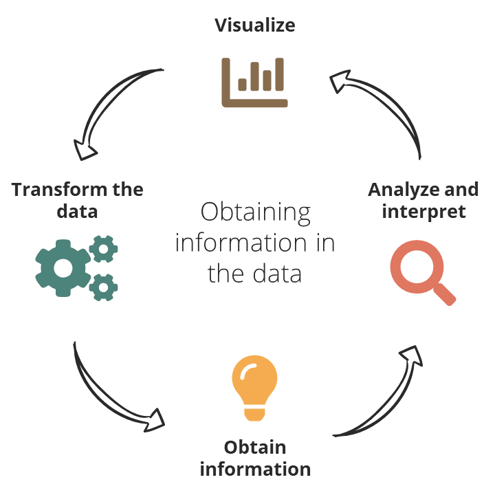

</center>

#### P2 Learning outcomes

-   Learn the grammar of graphics of `ggplot2`

-   Create the most common bioinformatic graphs (scatter plots, line
    plots, bar plots, ...)

-   Distinguish graphic quality indicators

    -   Integrity
    -   Chartjunk
    -   Data-ink ratio

-   Learn the characteristics of effective graphic displays

### 1.1 Practicals organization

In this practical, we are going to use the
[**RStudio**](https://posit.co/products/open-source/rstudio/) integrated development environment
(IDE) for R. R is a programming language for statistical computing and
graphics.

<center>

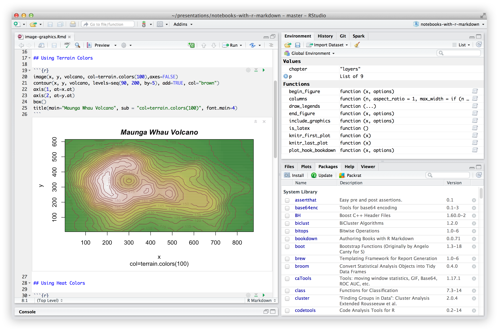

</center>

The current document in which we are working is an **R Markdown**
document. Similar to a Jupyter Notebook, R Markdown documents are fully
reproducible and allow you to combine text, images and code --this time,
R programming language.

To **render** a R Markdown document to a HTML file, you just need to
click the `Knit` button that you'll see in the RStudio bar. This HTML
file can be shared as a report.

You don't need to render the whole document every time you want to see
the result of your R code. You can click in the
`Run current chunk button` or use the keyboard shortcut `Ctrl`+`Alt`+`C`
and the result of the code will appear below it.

<center>

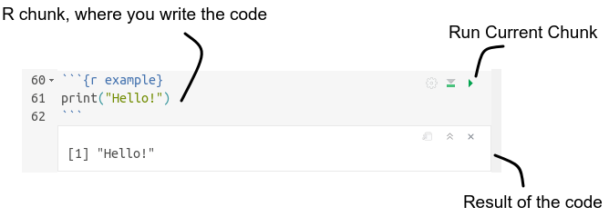

</center>

You will see different icons through the document, the meaning of which
is:

<i class="fas fa-info-circle"></i>: additional or useful information<br>
<i class="fas fa-search"></i>: a worked example<br>
<i class="fa fa-cogs"></i>: a practical exercise<br>
<i class="fas fa-comment-dots"></i>: a space to answer the exercise<br>
<i class="fa fa-key"></i>: a hint to solve an exercise<br>
<i class="fa fa-rocket"></i>: a more challenging exercise<br><br>

::: {style="background-color: #86CBBB; 1px; height:3px "}
:::

# 2. Tools installation

We strongly recommend using a **Linux** operating system and get used to
work with the **terminal**. In this practical though, we won't use it
and there's almost no difference in using Windows RStudio or Linux
RStudio.

## 2.1 Installing R

R programming language can be downloaded from
[here](https://cran.rediris.es/), and is available for Windows, Linux
and macOS.

## 2.2 Installing RStudio

RStudio is available to download from
[here](https://posit.co/download/rstudio-desktop/?utm_source=downloadrstudio&utm_medium=Site&utm_campaign=home-hero-cta).
You can easily install it in Windows, Linux and macOS.

## 2.3 Installing a package

R packages are collections of functions and/or data developed by the
community.

To install a package, we use the `install.packages()` function,
indicating between quotes the name of the package we want to install.

### 2.3.1 Installing `ggplot2`

`ggplot2` is a data visualization package for the statistical
programming language R ([Wickham
2009](https://www.springer.com/gp/book/9780387981413)). It was created
by Hadley Wickham, implementing Leland Wilkinson's Grammar of Graphics
---a general scheme for data visualization which breaks up graphs into
semantic components ([Wilkinson
2010](https://onlinelibrary.wiley.com/doi/full/10.1002/wics.118)).

To install the `ggplot2` package, use the following:

> `install.packages("ggplot2")`

## 2.4 Loading a package

To load a package, we use the function `library()`, indicating the name
of the library we want to load.

In the case of `ggplot2`, you'll use:

> `library("ggplot2")`

You're ready to start creating graphs!

```{r example, echo = FALSE}
# Simulate data
set.seed(170513)
n <- 5000
d <- data.frame(a = rnorm(n))
d$b <- .4 * (d$a + rnorm(n))

# Compute first principal component
d$pc <- predict(prcomp(~a+b, d))[,1]

# Plot
ggplot(d, aes(a, b, color = pc)) +
  geom_point(shape = 16, size = 5, show.legend = FALSE, alpha = 0.4) +
  theme_minimal() +
  scale_color_gradient(low = "#0091FF", high = "#F0650E") + labs(x = "", y = "") +
  scale_x_continuous(breaks = round(seq(-2,2, by = 1),0))
```

::: {style="background-color: #86CBBB; 1px; height:3px "}
:::

# 3. Quick introduction to R

## 3.1 Loading data

To **load data from a delimited text file**, we normally use the
`read.table()` function, indicating the name of the file we want to load
(including the directory if the file is not located in the same working
directory as the R session). Furthermore, we can specify if the file has
a header with `header = TRUE` (by default `FALSE`) or the file delimiter
with `sep =` (by default `sep = ""`).

For example, for loading the content of `data.txt` file, which has a
header and it's a tab-delimited file, we will write:

> `data <- read.table("data.txt", header = TRUE, sep = "\t")`

Also, the `read.csv()` function allows opening files with a `.csv`
format (comma-separated values data) and the `read.xlsx()` function of
the `xlsx` package allows opening Microsoft Excel files.

## 3.2 Data formats

In R, the most **common data types** are:

-   **Character**: consist of numbers, letters or words delimited with
    quotes (e.g. `"AGT"`, `"2"`)
    -   **Numeric**: consists of numbers such as integers (e.g. `1`, `-3`)
    or doubles (e.g. `0.5`, `-12.3`)
-   **Integer**: integer numbers, such as `2L` (the `L` tells R to store
    this as an integer)
-   **Logical**: logical values can take on one of two values: `TRUE`, T
    or `FALSE`, F

::: {style="background-color:#FFDAA1"}
<i class="fas fa-info-circle"></i> To know the data type, you can use
the `class()` function.
:::

```{r}
type_list <- list(TRUE, 1.2, 10L, "a")
sapply(type_list, class)
```

Elements of the previous data types may be combined to form **data
structures**. The main data structures are:

-   **Vector**: consists of an ordered set of values of the same type
    and/or class (e.g. numeric, character, date, etc.).

```{r}
# A vector x of mode numeric
x <- c(1, 2, 3)

# A vector y of mode logical
y <- c(TRUE, TRUE, FALSE, FALSE)

# A vector z of mode character
z <- c("Sarah", "Tracy", "Jon")
```

-   **Matrices**: vectors indexed using two indices instead of one.

```{r, eval = FALSE}
# A 2 x 2 matrix
matrix22 <- matrix(
  c(1, 2, 3, 4),
  nrow = 2,
  ncol = 2)
```

-   **Factors**: a collection of values that all come from a fixed set
    of possible values. A factor is similar to a vector, except that the
    values within a factor are limited to a fixed set of possible
    values.

```{r}
# A vector containing "dna" and "rna"
factor_vector <- as.factor(c("rna", "dna", "dna", "rna"))
str(factor_vector)
```

::: {style="background-color:#FFDAA1"}
<i class="fas fa-info-circle"></i> **Remember to always transform
categorical variables to a factor**. You can have a categorical variable
as characters, like the previous example ("`dna`" and "`rna`") but also
as numerical values (you can have groups "`1`", "`2`" and "`3`"). In
this case you need to tell R to use numerical values as a factor,
transforming them using the `as.factor()` function.
:::

-   **Lists**: a collection of data structures. The components of a list
    can be of any structure.

```{r, , eval = FALSE}
# A list
x <- list(1, "a", TRUE, 1+4i)
```

-   **Data.Frame**: a collection of vectors that all have the same
    length. This is like a matrix, except that each column can contain a
    different data type. The attributes of an object provide specific
    information about the object itself.

```{r, , eval = FALSE}
# A dataframe
dat <- data.frame(id = letters[1:10], x = 1:10, y = 11:20)
```

::: {style="background-color: #86CBBB; 1px; height:3px "}
:::

# 4. Data visualization theory

There is grounded theory about data visualization ([Ortiz
2014](https://tereom.github.io/est-computacional-2018/)). This section
highlights the pioneering contribution of the work of **Edward Tufte**
(1942--), American statistician and professor emeritus of political
science, statistics, and computer science at Yale University. One of the
central ideas of Tufte's work refers to the **removal of non-useful
elements** in the graphics, as they distract attention from the
explanatory elements. He coined the word **chartjunk** to refer to this
useless, non-informative, or information-obscuring elements ([Minguillon
2016](http://openaccess.uoc.edu/webapps/o2/handle/10609/57624)). In
contrast, the concept of **excellence** was defined as the
**communication of complex ideas with clarity, precision and
efficiency** ([Minguillon
2016](http://openaccess.uoc.edu/webapps/o2/handle/10609/57624)).

# 4.1 Graphic quality indicators

Applicable to any graphic. These are concrete and relatively objective
guides to assess the quality of a graph ([Tufte,
2001](https://www.edwardtufte.com/tufte/books_vdqi)).

::: {style="background-color:#FFDAA1"}
-   **Graphical integrity**: refers to how accurately the visual
    elements represent the data. The lie factor, how much a graphic
    deviates from the actual data, should be minimized.
-   **Chartjunk**: minimize the use of graphic decoration that
    interferes with the interpretation of the data: 3D effect,
    patterns...
-   **Data-ink ratio**: maximize the data ink vs. total ink used to
    print the graphic.
:::

# 4.1.1 Lie factor, chartjunk and pies

<center>

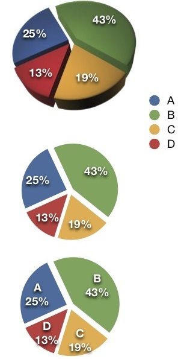

</center>

The **lie factor** is the ratio of the size of an effect shown in the
graphic to the size of the effect in the data. Ideally, the lie factor
should be 1 (no distortion).

A **chartjunk** is an unnecessary or confusing visual element in graphs
and are not necessary to comprehend the information represented on the
graph or distract the the viewer from this information.

A popular design that qualifies as chartjunk and introduce lie factors
is the **3D pie**. In the figure, we can see how segment C looks bigger
than B, although is not the case (lie factor). The reason is the
variation in the perspective that does not correspond to variation in
the data (chartjunk).

If we correct by removing the 3D effect, the lie factor is reduced, but
there are still elements that can improve the understanding of the
graph: the relation between the colour, the quantification and the
category. We can add tags as shown in the series on the right, but then:
why not simply show the data in a table? What does the pie graph add to
the interpretation? This could be more difficult if, for example, more
categories are added.

# 4.1.2 Data-ink ratio

Maximizing the proportion of **data-ink** in our graphs has immediate
benefits. The rule is: **if there is ink that does not represent
variation in the data, or the removal of that ink does not represent
loss of meaning, that ink must be removed**.

$$ Data-ink\;ratio\;=\;\frac{Data-ink}{Total\;ink\;used\;to\;print\;the\;graphic}  $$
According to the Tufte principle, the data must be displayed above all,
so that everything that does not provide information, must be deleted
(including background color, borders, grids, ...).

<center>

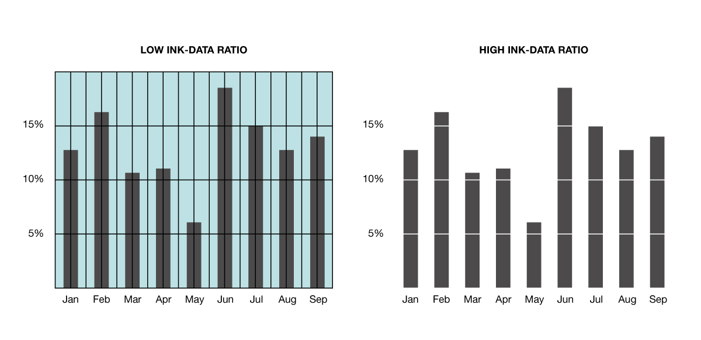

</center>

# 4.2 Characteristics of effective graphic displays

As we have previously introduced, Tufte defined the term excellence in
data visualization as communicating complex ideas with clarity,
precision and efficiency. A good visualization should:

-   Show the data
-   Induce the viewer to think about the substance rather than about
    methodology, graphic design, the technology of graphic production or
    something else
-   Avoid distorting what the data has to say (use fair axis, avoid
    using more than one `y`axis)
-   Present many numbers in a small space
-   Make large datasets coherent
-   Encourage the eye to compare different pieces of data
-   Reveal the data at several levels of detail, from a broad overview
    to the fine structure
-   Serve a reasonably clear purpose: description, exploration,
    tabulation or decoration
-   Be closely integrated with the statistical and verbal descriptions
    of a dataset

::: {style="background-color: #86CBBB; 1px; height:3px "}
:::

# 5. The grammar of graphics

In a natural language, there are a series of rules that organize words
into sentences, the grammar. [Wilkinson
(2005)](https://www.springer.com/gp/book/9780387245447), created a
grammar of graphics which offers us the basic elements to create them.

The **components** (or layers) of the grammar of graphics are:

-   The **data** that you want to visualize
-   A set of **aesthetic mappings** (`aes`) describing how variables in
    the data are mapped to aesthetic attributes that you can perceive
-   The **scales** map values in the data space to values in an
    aesthetic space, whether it be colour, or size, or shape. Scales
    draw a legend or axes, which provide and inverse mapping to make it
    possible to read the original data values from the graph
-   **Statistical transformations** (`stat`), summarise data in many
    useful ways. For example, binning and counting observations to
    create a histogram, or summarising a 2d relationship with a linear
    model
-   **Geometric objects** (`geom`) represent what you actually see on
    the plot: points, lines, polygons, etc.
-   A **coordinate system** (`coord`) describes how data coordinates
    aremapped to the plane of the graphic. It also provides axes and
    grid lines to make it possible to read the graph. We normally use a
    Cartesian coordinate system, but a number of others are available,
    including polar coordinates and map projections
-   A **faceting** describes how to break up the data into subsets and
    how to display those subsets as small multiples

<center>

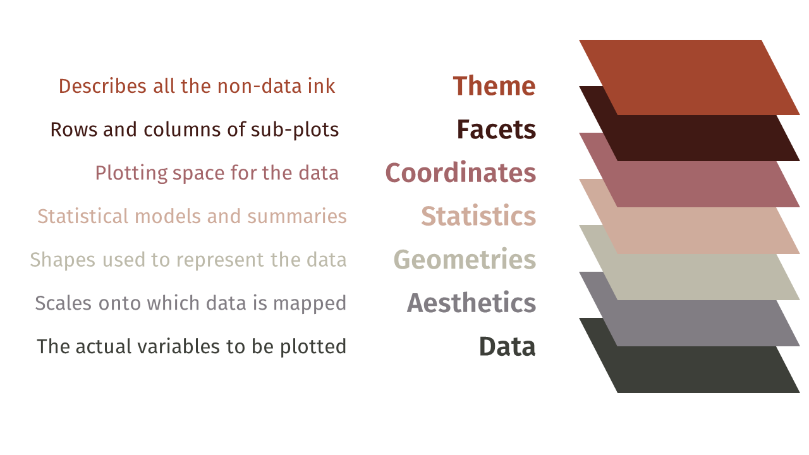

</center>

::: {style="background-color: #86CBBB; 1px; height:3px "}
:::

# 6. First steps with `ggplot2`

The following examples will walk you through the basic components of the
`ggplot2` grammar. The examples use data from the `datasets` package,
which is already loaded by default in the `R` session, as well as some
datasets loaded with `ggplot2` package. `ggplot2` requires data to be
stored in **data frames** and in a **tidy format** (one observation per
row and one variable per column):

```{r}
head(iris)
class(iris)
```

------------------------------------------------------------------------

## <i class="fas fa-search"></i> Example 1 \| Creating a scatter plot

### **1a** \| Basic scatter plot

For the first problem we want to represent the **relationship** between
the variables `Sepal.Width` and `Sepal.Length` from the `iris` data
frame. This data frame a collection of data that quantifies the
morphologic variation of **iris flowers** of three related species
(setosa, versicolor and virginica).

<center>

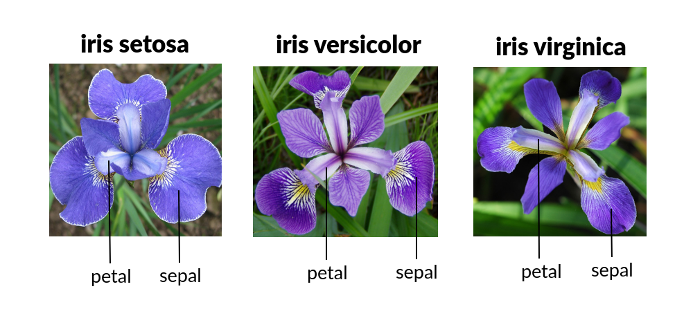

</center>

::: {style="background-color:#FFDAA1"}
<i class="fas fa-info-circle"></i> This famous (Fisher's or Anderson's)
`iris` dataset gives the measurements in centimeters of the variables
sepal length and width and petal length and width, respectively, for 50
flowers from each of 3 species of iris. You can type `??iris` in the `R`
console to read a description of the data.
:::

To represent any graph in `ggplot2` we need two basic functions that are
combined with a `+` sign:

```{r scatter-ggplot2}
ggplot(data = iris, mapping = aes(x = Sepal.Width, y = Sepal.Length)) +
  geom_point()
```

The variables that we want to represent are wrapped within an `aes()`
function, that specifies the ***mapping*** between the variables and the
***aesthetic attributes*** (in this case we map them to spatial
positions, `x` and `y`). We call the variables directly by their names,
because we also pass the entire data frame to the call with the data
argument, so `ggplot` knows were to get them from. Finally, we need to
add the ***geometric object*** we want to represent. In this case,
points.

### **1b** \| Represent extra variables

Another variable in the data indicates the species (`Species`) it was
measured. There are three species: setosa, versicolor and virginica.

```{r table-species}
table(iris$Species)
```

Let's say we want to represent the different types of species in
different colours. In this case we want to use `Species` as a
**categorical variable**, i.e., as a factor. By default, this variable
is already a factor:

```{r check class}
class(iris$Species)
```

We use `Species` in the `colour` aesthetic:

```{r groups-ggplot2}
ggplot(data = iris, mapping = aes(x = Sepal.Width, y = Sepal.Length, colour = Species)) +
  geom_point()
```

::: {style="background-color:#FFDAA1"}
<i class="fas fa-info-circle"></i> Note that `ggplot` adds a **legend**
by default for all the variables that have been mapped to some aesthetic
attribute. This way we can read all the variables without extra effort.
:::

### <i class="fa fa-cogs"></i> Exercise

Try mapping `Species` to another aesthetic attribute instead of
`colour`, such as `shape`, `size`, `alpha`. Are you getting any warning
message? Why?

::: {style="background-color:#F0F0F0"}
##### <i class="fas fa-comment-dots"></i> Answer:

```{r answer1.1}

```
:::

------------------------------------------------------------------------

## <i class="fas fa-search"></i> **Example 2** \| Creating a bar plot

For this second exercise we are going to use `mtcars` dataset, which
contain information about the **fuel consumption and 10 aspects of
automobile design and performance for 32 automobiles**.

```{r}
head(mtcars)
class(mtcars)
```

::: {style="background-color:#FFDAA1"}
<i class="fas fa-info-circle"></i> The data was extracted from the 1974
Motor Trend US magazine, and comprises fuel consumption and 10 aspects
of automobile design and performance for 32 automobiles (1973--74
models). You can type `??mtcars` in the `R` console to read a
description of the data.
:::

One of the variables of interests in the data indicates the number of
cylinders of the car engines (`cyl`). There are cars with 4, 6 or 8
cylinders.

### **2a** \| Basic bar plot

We want to summarize this data in a simple **bar plot** representing the
number of cars in each cylinder category; i.e., how many cars have 4, 6
or 8 cylinders. However, the number of cars with 4 cylinders is not a
piece of information present in the dataset, for example. To know the
number it is necessary to count the rows where `cyl = 4`, and we are not
going to do it <i class="fas fa-smile-wink"></i>.

`ggplot2` is capable to do simple summary operations with the input
variables, referred as **statistical transformations**. One of them is to
count the occurrences of each value in a variable, which is precisely
what we want to do. And `geom_bar` function happen to use the `count`
statistical transformation by default on the variable mapped to the `x`
axis.

The first thing that we are going to do is to check the class of the
`cyl` variable:

```{r class-cyl}
# First we check the class of cyl
class(mtcars$cyl)
```

We see that it's a numeric variable. In this case we want to use `cyl`
as a categorical variable, distinguishing groups rather than indicating
a value in a numerical continuous scale. For that, we need to change its
class before giving it to `ggplot` using the `as.factor()` function.

```{r factor-cyl}
# We create a new variable in the dataframe, cyl_f, that is cyl converted to factor
mtcars$cyl_f <- as.factor(mtcars$cyl)
```

Now we can create the bar plot:

```{r barplot-ggplot2}
ggplot(data = mtcars, mapping = aes(x = cyl_f)) +
  geom_bar()
```

Imagine that we have already a table with the number of cars with each
cylinder category. If we had a precomputed data frame with `cyl` and
`number_of_cars` instead, we could pass `number_of_cars` variable to
`geom_col` function instead of `geom_bar`, that by default takes the
variables mapped to `x` and `y` without transformation.

```{r barplot-table}
# Let's create the data frame
counts_by_cyl_data_frame <- as.data.frame(table(mtcars$cyl))
names(counts_by_cyl_data_frame) <- c("cyl", "number_of_cars")

# See the data frame
counts_by_cyl_data_frame

# New graph with geom_col
ggplot(data = counts_by_cyl_data_frame, mapping = aes(x = cyl, y = number_of_cars)) +
  geom_col()
```

::: {style="background-color:#FFDAA1"}
<i class="fas fa-hand-point-up"></i> We'll use `geom_bar` if the dataset
is not processed and we need to count the occurrences of a category. If
we have a processed dataset with the counts, we'll use `geom_col`.
:::

### **2b** \| Groups and position

We have seen in the scatter plot example how to represent groups encoded
in extra variables as colours. Say we now want to show transmission type
(`am`) in the bar plot, in addition to the number of cylinders. We can
map `am` to the filling colour of the bars, `fill` (`colour` aesthetic
would change the edges of the rectangles). There are two types of
transmission: `0` for automatic cars and `1` for manual cars.

```{r groups-bar}
# First we check the class of the variable
class(mtcars$am)

# We make am factor, and we can change the 0/1 notation for a more informative notation: automatic/manual
mtcars$am_f <- factor(mtcars$am, levels = c(0, 1), labels = c("automatic", "manual"))

# Plot
ggplot(data = mtcars, mapping = aes(x = cyl_f, fill = am_f)) +
  geom_bar()
```

Each geometric object in `ggplot2` also has a **position** argument that
controls how groups are arranged. In `geom_bar` the default position is
to stack the groups. We can change it for a side-by-side position with
`position = "dodge"`.

```{r position-bar-ggplot2}
ggplot(data = mtcars, mapping = aes(x = cyl_f, fill = am_f)) +
  geom_bar(position = "dodge")
```

### <i class="fa fa-cogs"></i> Exercise

Update the plot above with the `"fill"` position adjustment instead of
`"dodge"`. What it is doing?

::: {style="background-color:#F0F0F0"}
##### <i class="fas fa-comment-dots"></i> Answer:

```{r positions-ggplot2 answer2.1}

```
:::

Update the previous plot to group by the variable `gear` instead of the
transmission type (`am_f`). `gear` variable is the number of forward
gear: cars can have 3, 4 and 5 gears. Check if you need to transform
`gear` to a factor.

::: {style="background-color:#F0F0F0"}
##### <i class="fas fa-comment-dots"></i> Answer:

```{r positions-ggplot2 answer2.2}

```
:::

------------------------------------------------------------------------

## <i class="fas fa-search"></i> **Example 3** \| Showing the distribution of a variable: histograms

### **3a** \| Simple histogram

Now we have a new dataset called `diamonds` and we need to understand
the distribution of some of its continuous variables. A good place to
start is a histogram, that represents the number of observations in
different ranges as bars.

```{r}
head(diamonds)
class(diamonds)
```

::: {style="background-color:#FFDAA1"}
<i class="fas fa-info-circle"></i> `diamonds` is a dataset containing
the prices and other attributes of almost 54,000 diamonds. You can type
`??diamonds` in the `R` console to read a description of the data.
:::

The function that we need is called `geom_histogram()` and has the
statistical transformation `bin` by default. In this case, `bin` divides
the variable mapped to `x` in ranges and counts the number of values in
each bin. The number of bins is controlled with the argument `binwidth`.
In this example we show the distribution of the weights of diamonds
(`carat`).

```{r histogram}
ggplot(data = diamonds, mapping = aes(x = carat)) +
  geom_histogram(binwidth = 0.3)
```

::: {style="background-color:#FFDAA1"}
<i class="fas fa-info-circle"></i> Note that histograms deal with
*continuous* variables while bar plots with *discrete*, but are
sometimes
[confused](https://www.google.com/search?q=histograms+and+bar+graphs+difference).
:::

### **3b** \| Multiple histograms

The `diamonds` dataset contains more information about diamonds, such as
the quality (`cut`) or the color (`color`). To see the distribution of
the weight we can try to map it to the filling `cut`:

```{r histogram-fill}
ggplot(data = diamonds, mapping = aes(x = carat, fill = cut)) +
  geom_histogram(binwidth = 0.3) 
```

Stacked histograms are difficult to interpret. We can use another
position instead of the default "`stacked`" position. For example, using
`position = "dodge"`.

```{r histogram dodge}
ggplot(data = diamonds, mapping = aes(x = carat, fill = cut)) +
  geom_histogram(position = "dodge", binwidth = 0.3)
```

But there's even a better option. `ggplot2` provides a simple way of
creating small multiples or **facets** with the function `facet_grid`:

```{r facets}
ggplot(data = diamonds, mapping = aes(x = carat, fill = cut)) +
  geom_histogram(position = "dodge", binwidth = 0.3) + 
  facet_grid(cut ~ .)
```

### <i class="fa fa-cogs"></i> Exercise

What happens if you change the order of the `facet_grid` elements, i.e.,
`(. ~ cut)`?

::: {style="background-color:#F0F0F0"}
##### <i class="fas fa-comment-dots"></i> Answer:

```{r diamonds-facets answer 3.1}

```
:::

Which is the best subplot configuration to compare the distributions and
why?

::: {style="background-color:#F0F0F0"}
##### <i class="fas fa-comment-dots"></i> Answer:
:::

------------------------------------------------------------------------

## <i class="fas fa-search"></i> **Example 4** \| Showing the distribution of a variable: boxplot

### **4a** \| Simple boxplot

Another way of showing the distribution of numerical data is by means of
a boxplot. It allows to better understand the skewness through
displaying the data quartiles and averages. It also shows outliers as
separated dots.

The function that we are going to use is `geom_boxplot()`. In this
example we show the distribution of the weights of diamonds (`carat`).

```{r boxplot}
ggplot(data = diamonds, mapping = aes(y = carat)) +
  geom_boxplot()
```

One characteristic of boxplots is that you can show the distribution of
one variable (`carat`) with respect to another categorical variable. For
example, we can show the distribution of `carat` based on the color of
the diamond (`color`).

```{r boxplot2}
ggplot(data = diamonds, mapping = aes(y = carat, x = color)) +
  geom_boxplot()
```

### <i class="fa fa-cogs"></i> Exercise

Try to fill with a color the boxplot. How would you do it?

::: {style="background-color:#F0F0F0"}
##### <i class="fas fa-comment-dots"></i> Answer:

```{r diamonds-facets answer 4.1}

```
:::

------------------------------------------------------------------------

## <i class="fas fa-search"></i> **Example 5** \| Customizing a plot

### **5a** \| Modify colours

So far we have used the **default colour palettes** for all our
representations. We may need to change them to make them accessible to
**colourblind people**, match the colour palette of our project or give
**meaningful values** (e.g., red for positive and blue for negative). We
can control the exact mapping of a variable to an aesthetic attribute
with the functions `scale_*`.

In the following example we manually set the color of the five type of
diamond qualities. You can use other color names checking the following
[R color guide](http://www.stat.columbia.edu/~tzheng/files/Rcolor.pdf).

```{r change-col-ggplot2}
ggplot(data = diamonds, mapping = aes(x = carat, fill = cut)) +
  geom_histogram(position = "dodge", binwidth = 0.3) + 
  facet_grid(cut ~ .) +
  scale_fill_manual(values = c("sienna1", "orange", "lightseagreen", "orangered", "red4"))
```

::: {style="background-color:#FFDAA1"}
<i class="fas fa-info-circle"></i> Note that scale functions update both
the aesthetic mappings in the plot and in the legend.
:::

### **5b** \| Change (or add) axis, legend and plot titles

We may also need to add a **title** to the plot or change the **axis
titles**. There are several options for that: \* In `ggplot2`, axis and
legend titles can be specified with `name` argument within a `scale_*`
function \* The title can be changed with `+ ggtitle("Title name")` \*
You can also use the convenience function `labs()`, with `fill = ""` you
will set a new legend title and `title = ""` a new title. See the
working example:

```{r titles-ggplot2}
# We save the common part of the plot in a variable and then we can add more components with the "+" sign
p <- ggplot(data = diamonds, mapping = aes(x = carat, fill = cut)) +
  geom_histogram(position = "dodge", binwidth = 0.3) + 
  facet_grid(cut ~ .)
  
# Option A:
p + scale_fill_manual(values = c("sienna1", "orange", "lightseagreen", "orangered", "red4"), name = "Quality") +
  scale_x_continuous(name = "Weight of the diamond") + 
  ggtitle("Diamond weight variation")

# Option B:
# p + scale_fill_manual(values = c("sienna1", "orange", "lightseagreen", "orangered", "red4")) +
#   labs(title = "Diamond weight variation", x = "Weight of the diamond", fill = "Quality")
```

### **5c** \| Change theme

The appearance of `ggplot2` plots is controlled by the **themes**. The
default `ggplot2` theme has a gray background and "*is designed to put
the data forward yet make comparisons easy*". You can change the general
appearance by choosing a different theme with `theme_*` functions. There
are [eight different
themes](https://ggplot2.tidyverse.org/reference/ggtheme.html) available.
The following example uses the "black and white" theme (`theme_bw()`):

```{r theme}
ggplot(data = diamonds, mapping = aes(x = carat, fill = cut)) +
  geom_histogram(position = "dodge", binwidth = 0.3) + 
  facet_grid(cut ~ .) +
  scale_fill_manual(values = c("sienna1", "orange", "lightseagreen", "orangered", "red4"), name = "Quality") +
  scale_x_continuous(name = "Weight of the diamond") + 
  ggtitle("Diamond weight variation") +
  theme_bw()
```

### <i class="fas fa-cogs"></i> Exercise

Using the following code, try other `scale_fill_*` functions in
`ggplot2` with pre-defined palettes, such as `scale_fill_hue()`,
`scale_fill_brewer()`, `scale_fill_viridis_d()` (default) and
`scale_fill_grey()`. Which palette would you use to ensure that
colourblind people can distinguish the colours, `scale_fill_hue()` or
`scale_fill_viridis_d()`?

::: {style="background-color:#F0F0F0"}
##### <i class="fas fa-comment-dots"></i> Answer:

```{r answer5.1}

```
:::

Try `subtitle = ""`, `caption =""` and `tag =""` arguments from the
`labs()` function. What are they for?

::: {style="background-color:#F0F0F0"}
##### <i class="fas fa-comment-dots"></i> Answer:

```{r answer5.2}

```
:::

Which theme of the [eight
available](https://ggplot2.tidyverse.org/reference/ggtheme.html) do you
think that maximizes the data-ink ratio?

::: {style="background-color:#F0F0F0"}
##### <i class="fas fa-comment-dots"></i> Answer:

```{r answer5.3}

```
:::

------------------------------------------------------------------------

## <i class="fas fa-info-circle"></i> Saving the plots

There are several ways to save a plot to a file. Here you have a couple
of examples:

A. Export button from `RStudio` plot panel:


B. `ggsave` function from `ggplot2` package

```{r ggsave, eval = FALSE}

p <- ggplot(data = iris, mapping = aes(x = Sepal.Width, y = Sepal.Length)) + geom_point()

ggsave(filename = "plot.png", plot = p, width = 6, height = 4) # In inches by default
```

Plots can be saved using different image file formats. Option **A**
gives you the format options in a drop list (image format: PNG, JPG,
...), option **B** guesses the format from the extension (e.g.
`plot.png` or `plot.pdf`).

The main formats can be classified into:

-   Raster/bitmat formats, where information is stored in pixels and
    have a maximum resolution.

    -   **PNG**: extension .png, supports transparent background, good
        compression, doesn't lose quality
    -   **JPEG**: extensions .jpg and .jpeg, very good compression, used
        in personal photography but suffers from quality degradation
        with repeated modifications
    -   **TIFF**: extensions .tif and .tiff, preferred format for
        professional printing

-   Vector formats, where information is encoded in geometric shapes
    that can be rendered at any size without losing resolution.

    -   **SVG**: extension .svg, standard for vector graphics, requires
        `svglite` package

-   Hybrid

    -   **PDF**: can contain both vector graphics and raster images

### <i class="fas fa-cogs"></i> Exercise

Save the plot `p` in a raster and a vector format with the same size
using `ggsave()` (e.g.: `width = 6, height = 4`). What
differences do you observe when you zoom in them?

<i class="fas fa-info-circle"></i> Note: svg devices require `svglite` R
package and other system libraries (`libcairo2-dev` and
`libfontconfig1-dev`). Skip the exercise if you get an error!

::: {style="background-color:#F0F0F0"}
##### <i class="fas fa-comment-dots"></i> Answer:

```{r answer 6.1}

```
:::

------------------------------------------------------------------------

## <i class="fa fa-cogs"></i> Wrap up exercise

If for representing a scatter plot we use `geom_point()`, a bar plot
`geom_bar()` ... could you guess how to represent a **line** plot with
`ggplot2` syntax?

-   Represent how `unemploy` variable changes over time (`date`
    variable) from `economics` dataset with a line plot using `ggplot2`
    syntax
-   Modify axis names and add a title
-   Use a theme
-   Save the plot to a file using a raster image format (png)

::: {style="background-color:#F0F0F0"}
##### <i class="fas fa-comment-dots"></i> Answer:

```{r wrap-exercise-line-plot}

```
:::

<i class="fa fa-key"></i> The final image should look like this:

<center>


</center>

::: {style="background-color: #86CBBB; 1px; height:3px "}
:::

# <i class="fa fa-cogs"></i> Try to reproduce a plot!

Pick one of the following plots. With your knowledge on `ggplot2`
try to write the code that reproduce the same figure. You are given the name of the dataset and the color palette (or other hints).

| Group | Dataset      | Description                                                       | Hint                                                                            |
|-------|--------------|-------------------------------------------------------------------|---------------------------------------------------------------------------------|
| 1     | `Titanic`    | Survival of passengers on the Titanic                             | Color palette is: "#79AEB2", "#4A6274"                                          |
| 2     | `ToothGrowth`  | The Effect of Vitamin C on Tooth Growth in Guinea Pigs            | Color palette is: "#58A6A6", "#EFA355"                                          |
| 3     | `msleep`       | An updated and expanded version of the mammals sleep dataset.     | You can color in gray the NA values inside the scale_fill (na.value = "grey80") |
| 4     | `mpg`          | Fuel economy data from 1999 and 2008 for 38 popular models of car | Color palette is: "#4CC3CD", "#FEE883"                                          |
| 5     | `midwest`      | Midwest demographics.                                             | Two aesthetics are combined inside geom_point(), color and size.                |
| 6     | `diamonds`     | Prices of 50,000 round cut diamonds                               | The viridis palette is used.                                                    |
| 7     | `HairEyeColor` | Hair and Eye Color of Statistics Students                         | Color palette is: "#58A6A6", "#EFA355"                                          |
| 8     | `infert`       | Infertility after Spontaneous and Induced Abortion                | Color palette is: "#900C3F", "#C70039", "#FF5733"                               |                              |


<a href="titanic2020_11_7D10_3_14.png" target="new">
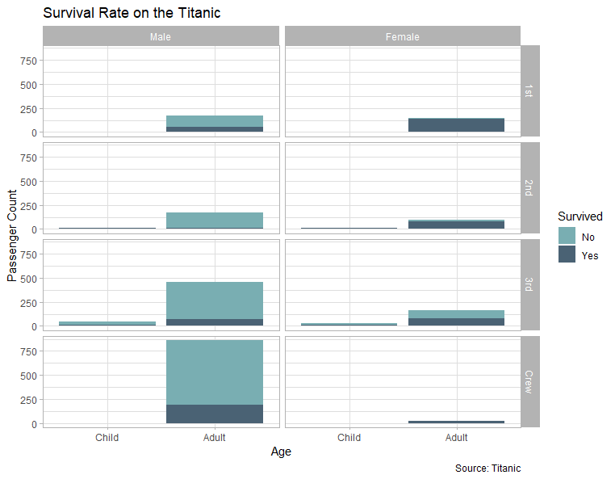
</a><a href="toothGrowth2020_11_7D10_6_32.png" target="new">
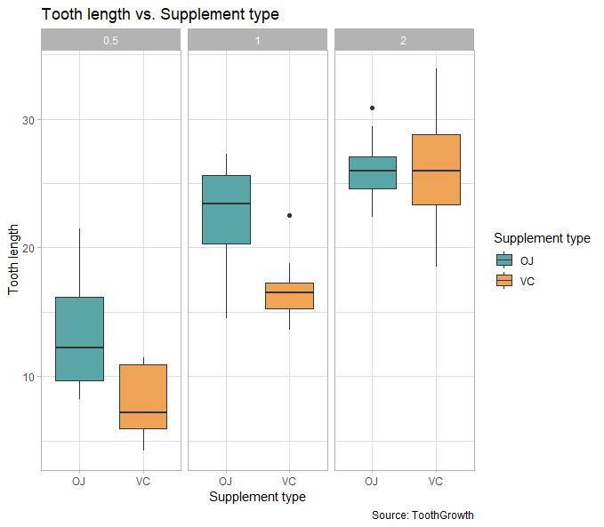
</a><a href="msleep2020_11_7D10_9_41.png" target="new">
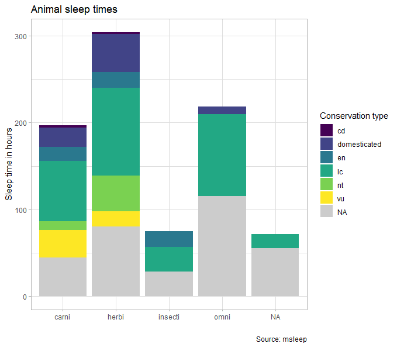
</a>
<a href="mpg2020_11_7D10_10_11.png" target="new">
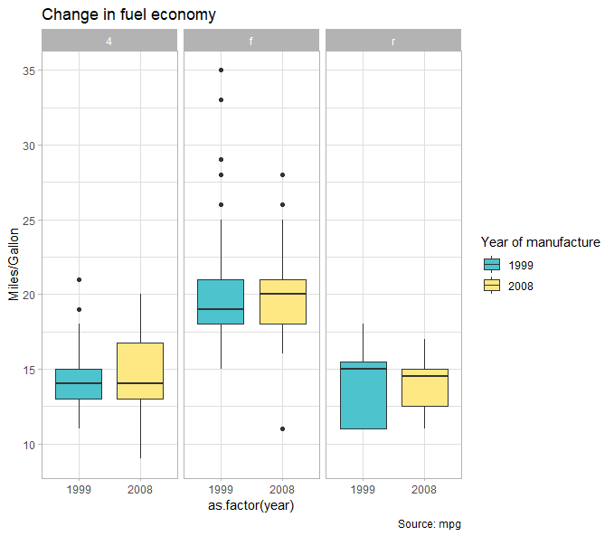
</a><a href="midwest2020_11_7D10_10_38.png" target="new">

</a>
<a href="diamonds2020_11_7D10_11_9.png" target="new">
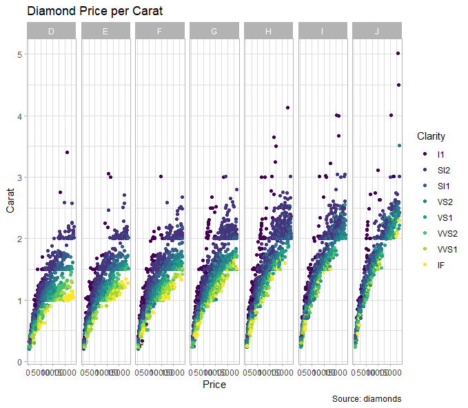
</a><a href="HairEyeColor2020_11_7D10_11_42.png" target="new">

</a>
<a href="infert2020_11_7D10_11_54.png" target="new">

</a>

```{r reproducing-ggplot2}

```

::: {style="background-color: #86CBBB; 1px; height:3px "}
:::

# <i class="fa fa-rocket"></i> Analyze a real scientific dataset

We want practice with real-world data sets that are the appropriate to build our `ggplot2` skills. You have available to choose from 7 datasets. Make a meaningful representation of the data they contain. You have available the corresponding research article and a short description that can help.

Datasets from: Whitlock, Michael C, and Dolph Schluter. 2020. The Analysis of Biological Data. Third Edition.


### 1. Zika and head size
Zika virus can be spread by mosquitos, sexual contact or from mom to fetus. In 2015 there was an outbreak in Brazil that spread to other countries in the Americas. Small head size (microcephaly) associated with abnormal brain development was frequently reported in newborn babies of infected mothers. Here are data for head measurements of fetuses in pregnant women infected with Zika, taken from ultrasounds between 33 and 36 weeks. A head size between 80 and 94 mm is considered normal for uninfected mothers at this age.

Data link: https://raw.githubusercontent.com/marta-coronado/TAB-data-figs/refs/heads/main/P2_datasets/chap02e2bZikaBiparietalDiameter.csv
- [Read the study](https://www.nejm.org/doi/full/10.1056/nejmoa1602412)

### 2. Life at high altitude
Living at high altitude represents some physiological challenges of living with a limited oxygen supply. Human populations in the Andes, Ethiopia, and Tibet have faced these challenges, and adapted. One potential mechanism of this adaptation is to raise the hemoglobin content of blood to get more oxygen. Beall et al. measured the hemoglobin content of people from these three populations as well as a control of males living at sea level in America.

Data link: https://raw.githubusercontent.com/marta-coronado/TAB-data-figs/refs/heads/main/P2_datasets/chap02e3bHumanHemoglobinElevation.csv
- [Read the study](https://www.pnas.org/doi/10.1073/pnas.252649199)

### 3. Don't go to the light!
The study found that moth populations from urban areas with decades of light pollution exhibit a significantly weaker attraction to light compared to moths from pristine, dark-sky areas, suggesting an evolutionary adaptation to artificial light at night

Data link: https://raw.githubusercontent.com/marta-coronado/TAB-data-figs/refs/heads/main/P2_datasets/chap02q15MothsToLight.csv
- [Read the study](https://royalsocietypublishing.org/doi/10.1098/rsbl.2016.0111)

### 4. Hearing color
Some people experience one of their senses through another. For example, you might hear the name “Bob” and see grey. Saenz and Koch were interested to see how this type of perception impacted the ability to complete complex multi-sensory tasks. So they compared people with and without this unique type of sensory perception (known as synesthetes) to a group of people without such abilities, on a test involving rhythmic temporal patterns similar to Morse code. 
Data link: https://raw.githubusercontent.com/marta-coronado/TAB-data-figs/refs/heads/main/P2_datasets/chap02q10Synesthetes.csv
- [Read the study](https://www.sciencedirect.com/science/article/pii/S0960982208007343)

### 5. Eat less, live longer?
For some reason, restricting food intake often increases lifespan. To see if this was the case, Mattison et al fed 17 rhesus monkeys (7 females, 10 males) a reduced diet with 30% of the normal nutrition, and 17 other rhesus monkeys (8 females, 9 males) a normal nutritious diet.
Data link: https://raw.githubusercontent.com/marta-coronado/TAB-data-figs/refs/heads/main/P2_datasets/chap02q35FoodReductionLifespan.csv 
- [Read the study](https://www.sciencedirect.com/science/article/pii/S0960982208007343)

### 6. A gene for monogamy?
The gene for the vasopressin receptor V1a is expressed at higher levels in the forebrain of monogamous than promiscuous vole species. To see if expression of this gene influenced monogamy, Lim et al experimentally enhanced V1a expression in the forebrain of 11 males of the meadow vole - a solitary promiscuous species, and compared the percentage of time these and control males spent huddling with a female placed with him (ass a measure of monogamy). 
Data link: https://raw.githubusercontent.com/marta-coronado/TAB-data-figs/refs/heads/main/P2_datasets/chap03q15VasopressinVoles.csv
- [Read the study](https://www.nature.com/articles/nature02539)

### 7. Running with a lighter load
Male spiders in the genus Tidarren are tiny and weigh about 1 percent as much as females. Just before sexual maturity, males voluntarily amputate one of their two organs just before sexual maturity. Could this maybe allow them to move faster?

Data link: https://raw.githubusercontent.com/marta-coronado/TAB-data-figs/refs/heads/main/P2_datasets/chap03e2SpiderAmputation.csv
- [Read the study](https://www.pnas.org/content/101/14/4883)

<i class="fa fa-key"></i> Hint: you can read the data directly using the link as:

```{r eval = F}
data <- read.csv("https://raw.githubusercontent.com/marta-coronado/TAB-data-figs/refs/heads/main/P2_datasets/chap03e2SpiderAmputation.csv")
```

```{r analyse_dataset}

```


# Upload your results to your GitHub

Upload this Rmd document and the figures you have generated to your
GitHub repository.

::: {style="background-color: #86CBBB; 1px; height:3px "}
:::

<br>
