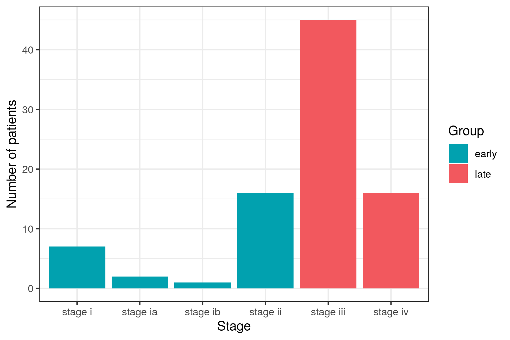
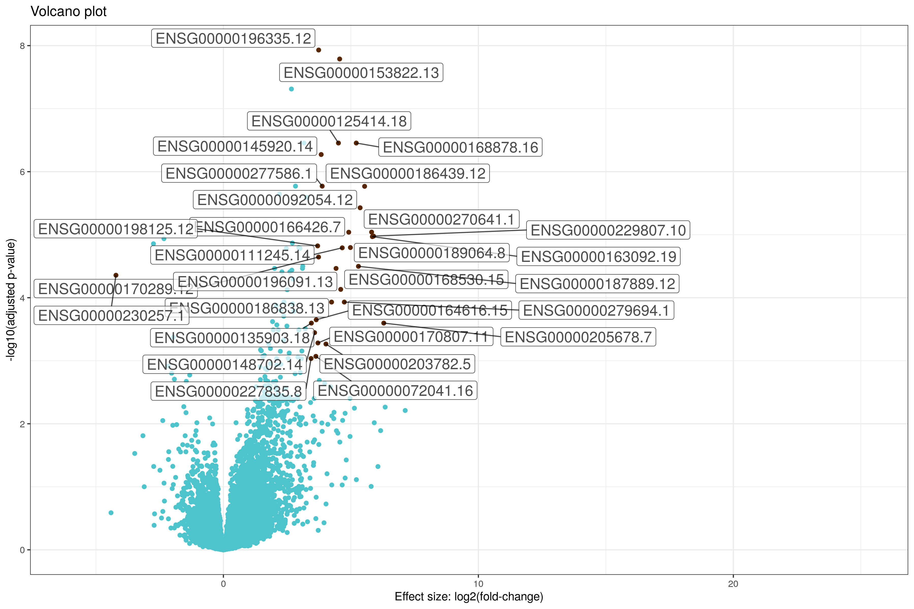

```{r setup, include = FALSE, warning = FALSE}
knitr::opts_chunk$set(echo = TRUE, fig.align = "center", fig.width = 6, fig.height = 4)
library(SummarizedExperiment)
library(edgeR)
library(DESeq2)
library(GOstats)
library(annotate)
library(org.Hs.eg.db)
library(biomaRt)
library(ggplot2)
library(ggrepel)
library(dplyr)
library(tibble)
library(clusterProfiler)
library(pathview)
library(pheatmap)
```

<style>
  @import url(https://fonts.googleapis.com/css?family=Fira+Sans:300,300i,400,400i,500,500i,700,700i);
  @import url(https://cdn.rawgit.com/tonsky/FiraCode/1.204/distr/fira_code.css);
  @import url("https://use.fontawesome.com/releases/v5.10.1/css/all.css");
</style>

<div style="background-color: #86CBBB; 1px; height:3px " ></div>

## 1. Introduction

**RNA-seq** is a recent approach to carry out expression profiling using high-throughput sequencing (HTS) technologies. Pre-2008, microarrays were predominantly used, but because the sequencing costs have decreased, RNA-seq became the preferred option to simultaneously measure the expression of tens of thousands of genes for multiple samples.

In this tutorial we walk through a gene-level RNA-seq differential expression analysis using **Bioconductor** packages to find genes over- or under-expressed in cancer patients.

### 1.1 Experimental data

The [**Cancer Genome Atlas**](https://www.cancer.gov/about-nci/organization/ccg/research/structural-genomics/tcga) (**TCGA**) is a collaboration between the National Cancer Institute (NCI) and the National Human Genome Research Institute (NHGRI) that has generated comprehensive, multi-dimensional maps of the key genomic changes in 33 types of cancer. The TCGA dataset, comprising more than two petabytes of genomic data, has been made publicly available, and this genomic information helps the cancer research community to improve the prevention, diagnosis, and treatment of cancer.

[**Recount**](https://jhubiostatistics.shinyapps.io/recount/)  is an online resource consisting of RNA-seq gene and exon counts for different studies, including TCGA data. From there, we can download the RNA-seq data of different cancer types that we will use in this practical:

| **Cancer** | **Download** |
|------------|-------------------------------------------------------------------------|
| Bile duct  | [Link](http://duffel.rail.bio/recount/v2/TCGA/rse_gene_bile_duct.Rdata) |
| Eye        | [Link](http://duffel.rail.bio/recount/v2/TCGA/rse_gene_eye.Rdata)       |
| Testis     | [Link](http://duffel.rail.bio/recount/v2/TCGA/rse_gene_testis.Rdata)    |
| Pancreas   | [Link](http://duffel.rail.bio/recount/v2/TCGA/rse_gene_pancreas.Rdata)  |
| Esophagus  | [Link](http://duffel.rail.bio/recount/v2/TCGA/rse_gene_esophagus.Rdata) |
| Adrenal gland | [Link](http://duffel.rail.bio/recount/v2/TCGA/rse_gene_adrenal_gland.Rdata) |
| Liver      | [Link](http://duffel.rail.bio/recount/v2/TCGA/rse_gene_liver.Rdata)     |
| Bladder    | [Link](http://duffel.rail.bio/recount/v2/TCGA/rse_gene_bladder.Rdata)   |
| Stomach    | [Link](http://duffel.rail.bio/recount/v2/TCGA/rse_gene_stomach.Rdata)   |
| Skin       | [Link](http://duffel.rail.bio/recount/v2/TCGA/rse_gene_skin.Rdata)      |


The practical consist on a worked example using data from **pleural cancer**. Each group must select a cancer type from the table to perform their own differential expression analysis. 

#### P4 Learning outcomes

* Data manipulation (P1)
* Descriptive analysis of the data (P1)
* Perform statistical tests to find which genes are deferentially expressed in different human cancers
* Enrichment analysis 
* Visualize the results (P2)

### 1.2 Practicals organization

In this practical, we are going to use the [**RStudio**](https://posit.co/) integrated development environment (IDE) for R. R is a programming language for statistical computing and graphics.  

You will see different icons through the document, the meaning of which is:

&emsp;<i class="fas fa-info-circle"></i>: additional or useful information<br>
&emsp;<i class="fas fa-search"></i>: a worked example<br>
&emsp;<i class="fa fa-cogs"></i>: a practical exercise<br>
&emsp;<i class="fas fa-comment-dots"></i>: a space to answer the exercise<br>
&emsp;<i class="fa fa-key"></i>: a hint to solve an exercise<br>
&emsp;<i class="fa fa-rocket"></i>: a more challenging exercise<br><br>

<div style="background-color: #86CBBB; 1px; height:3px " ></div>

# 2. Tools installation 

Follow `P2.Rmd` instructions if you need to install **[R](https://cran.r-project.org/)** and/or **[RStudio](https://posit.co/download/rstudio-desktop/#download)** for either Windows or Linux.

### 2.1 Required R packages

Bioconductor has many packages supporting analysis of high-throughput sequence data, including RNA-seq. The packages that we will use in this tutorial include core packages maintained by the Bioconductor core team for importing and processing raw sequencing data and loading gene annotations.

You don't need to install the packages in the UAB computers, only loading them.

```{r packages, eval = FALSE}
install.packages("ggplot2")
install.packages("ggrepel")
install.packages("dplyr")
install.packages("pheatmap")
install.packages("tibble")
install.packages("BiocManager")
BiocManager::install(c("SummarizedExperiment", "DESeq2", "org.Hs.eg.db", "biomaRt", "edgeR", "GOstats", "annotate", "biomaRt","clusterProfiler","pathview"))
```

Load the packages:

```{r load_packages}
library(SummarizedExperiment)
library(edgeR)
library(DESeq2)
library(GOstats)
library(annotate)
library(org.Hs.eg.db)
library(biomaRt)
library(ggplot2)
library(ggrepel)
library(dplyr)
library(tibble)
library(clusterProfiler)
library(pathview)
library(pheatmap)
```

<div style="background-color: #86CBBB; 1px; height:3px " ></div>

# <i class = "fa fa-search"></i>Conducting an RNA-seq analysis

With this worked example, we are going to illustrate how to perform an RNA-seq expression analysis on RNA-seq data from patients diagnosed with mesothelioma (pleural cancer). The goal is to compare the transcriptomic profile of patients in an early tumoral stage with ones in an advanced stage of this disease. The objective is to find differential expressed in this type of cancer.

The data is available in a **Ranged Summarized Experiment** (RSE) format. It is a matrix-like container where rows represent ranges of interest and columns represent samples (with sample data summarized as a `data.frame`).

### 1. Prepare data

**<i class="fa fa-cogs"></i> Create a working directory named `Practical 4` and create a folder named `data` and inside, `pleuralCancer` folder. **

```{r, eval = FALSE}
# bash code to create directories

```

**<i class="fa fa-cogs"></i> Navigate to the `pleuralCancer` folder and download the [RSE data](http://duffel.rail.bio/recount/v2/TCGA/rse_gene_pleura.Rdata) for pleura cancer using wget. **


```{r, eval = FALSE}
# bash code to download the data

```

**<i class="fa fa-cogs"></i> RSE data can be loaded into `R` with the `load()` function.**

<i class="fa fa-key"></i> Remember to change the working directory to properly load the data if it's necessary:

```{r read-RNA-seq-data}
# Read RSE data of the cancer experiment
load(file = "rse_gene_pleura.Rdata")
```

An object called `rse_gene` will be in your R environment.

Exploring the data using the `dim()` function, we see that there are `r dim(rse_gene)[1]` genes (number of rows) analyzed in a cohort of `r dim(rse_gene)[2]` patients with cancer (number of columns).

The variable `gdc_cases.diagnoses.tumor_stage` which is inside the `rse_gene` object contains information of the tumoral stage (i.e.: `r sort(unique(rse_gene$gdc_cases.diagnoses.tumor_stage))`). We can use this information to create a new variable in the `rse_gene` object called `GROUP` distinguishing "_early_" and "_late_" tumours. Early tumours are those in stages i and ii, while late tumours those in stages iii and iv. 

The following code will add an additional column `GROUP` to the meta-data to organize the cancer stages:

```{r create-group}
stage <- rse_gene$gdc_cases.diagnoses.tumor_stage

# id list of early tumours
ids.early <-grep(paste("stage i$", "stage ia$","stage ib$","stage ic$", "stage ii$", "stage iia$","stage iib$", "stage iic$",sep="|"), stage)

# id list of late tumours
ids.late <-grep(paste("stage iii$", "stage iiia$", "stage iiib$","stage iiic$", "stage iv$", "stage iva$","stage ivb$", "stage ivc$",sep="|"), stage)

# create an empty column named GROUP
colData(rse_gene)$GROUP <-rep(NA, ncol(rse_gene))
# add early for those patients with tumours at stages i-ii
colData(rse_gene)$GROUP[ids.early] <- "early"
# add late for those patients with tumours at stages iii-iv
colData(rse_gene)$GROUP[ids.late] <- "late"
```

<center>
  
</center>

<i class="fa fa-question-circle"></i> **Can you reproduce the previous figure using the following `data.frame`?**

```{r data-frame-fig}
# create dataframe
dataGroups <- data.frame(Stage = rse_gene$gdc_cases.diagnoses.tumor_stage, Group = rse_gene$GROUP)

# ggplot2 plot

```

It is important to remove all patients whose stage of the cancer was not recorded. We can check if it's necessary in the pleura cancer dataset using the `table()` function:

```{r check-na}
# Check if the status is NA
naData <- is.na(rse_gene$GROUP)
table(naData)
```

As we can see, all patients have information because all the results are `FALSE` when we check if something "_is na?_". But if we are dealing with some `TRUE` results (i.e., there's no data for some patients), we can remove it as:

```{r remove-na}
# After removing
dim(rse_gene)

# Remove NA
rse_gene <- rse_gene[, !naData]
dim(rse_gene)
```

We can summarize individuals in each category as "early" and "late" using the `table()` function. We can see that there are more than two times patients in the late stage than in the early stage.

```{r summary}
# summary of the patients
table(rse_gene$GROUP)
```

After exploring a bit the data, we can now get the **read counts** data. It can be retrieved using the `assay()` function. 

```{r save-counts}
# save the count data
counts <- assay(rse_gene, "counts")
counts[1:5, 1:2]
```

The data related to the **phenotype** of the patients can also be retrieved using the `colData()` function:

```{r save-pheno}
# save the phenotype data
phenotype <- colData(rse_gene)
phenotype[1:5, 1:2]
```
 
We need to check that the same individuals are found both in the `counts` dataset and in the `phenotype` dataset.

```{r check-ind}
# check if the same individuals are found in the datasets
identical(colnames(counts), rownames(phenotype))
```
 
Because the result is `TRUE`, it means that we have the same individuals in both datasets. If the result were `FALSE`, we would need to only keep those individuals in common in both datasets. For that, we can use the `intersect` function.

```{r keep-same-individuals}
# save a vector with the id of the individuals in common in both datasets
individualsCommon <- intersect(colnames(counts),rownames(phenotype))
# filter the count dataset to keep only the individuals in the vector
counts <- counts[, individualsCommon]
# filter the phenotype dataset to keep only the individuals in the vector
phenotype <- phenotype[individualsCommon ,]
```

In this case, we still have the `r length(individualsCommon)` individuals.

Finally, the **gene information** can be retrived usiing the `rowData()` function:

```{r annotation}
# save the annotation data
annotation <- rowData(rse_gene)
```

We have information for a total of `r length(annotation$gene_id)` genes.

<i class="fa fa-question-circle"></i> **Can you explore which information is available for each gene?**


<div style="background-color:#F0F0F0">
##### &emsp;<i class="fas fa-comment-dots"></i> Answer:

</div>

<i class="fa fa-question-circle"></i> **Write a short summary of the information you have available (e.g., total number of individuals, filtered individuals, individuals by stage, number of genes, ...)**

<div style="background-color:#F0F0F0">
##### &emsp;<i class="fas fa-comment-dots"></i> Answer:

</div>


### 2. Differential expression analysis

The R package `DESeq2` allows researchers to test differential gene expression analysis based on the negative binomial distribution ([Love, et al., 2014](https://genomebiology.biomedcentral.com/articles/10.1186/s13059-014-0550-8)).

The starting point of a `DESeq2` analysis is a count matrix with one row for each gene and one column for each sample.

This  function  requires  the  `SummarizedExperiment` object  and the design, which in this case is given in the variable `GROUP`  because we want to compare early vs. late tumor stages. 

```{r diffgen}
# stage of each patient
pheno.stage <- subset(phenotype, select=GROUP)

# recreate the counts in a new matrix
counts.adj <- matrix((as.vector(as.integer(counts))), nrow=nrow(counts), ncol=ncol(counts))

rownames(counts.adj) = rownames(counts)
colnames(counts.adj) = colnames(counts)

# check information
identical(colnames(counts.adj), rownames(pheno.stage))

# transform the group variable to factor
pheno.stage$GROUP <- as.factor(pheno.stage$GROUP)

# create the DESeqDataSet input
DEs <- DESeqDataSetFromMatrix(countData = counts.adj,
                              colData = pheno.stage,
                              design = ~ GROUP)

# differential expression analysis
dds <- DESeq(DEs)

# results extracts a result table from a DESEq analysis 
res <- results(dds, pAdjustMethod = "fdr")

head(res)
```

<i class="fa fa-question-circle"></i> **What type of object is <code>res</code>?**

<i class="fa fa-key"></i> **Hint**: You can use the function <code>class</code>.

<div style="background-color:#F0F0F0">
##### &emsp;<i class="fas fa-comment-dots"></i> Answer:

</div>

To simplify the workflow and make plotting easier, we will convert the results into a `data.frame` of type `tibble`. Additionally, we will save the gene names in a new column called "gene" and remove rows with `NA` values in the corrected p-value column `padj`:

```{r resultstotibble}
library(dplyr)
library(tibble)

res_tb <- res %>%
  data.frame() %>%
  rownames_to_column(var="gene") %>% 
  as_tibble() %>% 
  filter(!is.na(padj))
```

```{r, echo=F}
head(res_tb)
```

Let's investigate how many DEG we find in the analysis:

1. Count genes whose adjusted p-value is lower than 0.001 and a positive log2FoldChange (fill the ???):

```{r result1, eval = F}
nrow(res_tb[res_tb$??? < ??? &
              res_tb$??? > ???,]) 

```


2. Count genes whose adjusted p-value is lower than 0.001 and a negative log2FoldChange (fill the ???):

```{r result2, eval = F}
nrow(res_tb[res_tb$??? < ??? &
              res_tb$??? < ???,]) 

```


<i class="fa fa-question-circle"></i> **Write a short summary of the result of the DE analysis. How many genes are overexpressed? And underexpressed? Fill the table. You may one to try other criteria for filtering, for example based on the log2C (example: abs(res_tb$log2FoldChange) > log2(10),]) # absolute fold change 1.5).**


| Underexpressed | Not differentially expressed | Overexpressed |
|----------------|------------------------------|---------------|
|                |                              |               |

<div style="background-color:#F0F0F0">
##### &emsp;<i class="fas fa-comment-dots"></i> Answer:

</div>

### 3. Post RNA-seq analysis: visualization

## BioMart

Have you noticed the gene names? Those codes belong to **Ensembl**. As researchers, we are more accustomed to **Hugo** symbols (HGNC), which are more readable and easier for humans to remember 👽.

Each analysis with `biomaRt` starts with selecting a BioMart database to use. The following commands will connect us to the most recent version of Ensembl for *Human Genes*.

```{r biomart_evalt}
library(biomaRt)
mart <-  useEnsembl(biomart = "genes", dataset = "hsapiens_gene_ensembl")
```

If this is your first time using `biomaRt`, you might wonder how to find the two arguments we provided to the `useEnsembl()` function. This is a two-step process, but once you know the configuration you need, you can use a single command. I've provided the [BiomaRt help documentation](https://bioconductor.org/packages/release/bioc/vignettes/biomaRt/inst/doc/accessing_ensembl.html) here if you need it for a different use than the one we'll cover today.


```{r}
# Obtain list of gene names
gene_list <- res_tb$gene

# Remove the version number from the Ensembl gene IDs
gene_list_clean <- sub("\\..*", "", gene_list)

# Now query Ensembl
equivalencias <- getBM(attributes = c("hgnc_symbol", 'ensembl_gene_id'),
                       filters = "ensembl_gene_id", values = gene_list_clean,
                       bmHeader = TRUE, mart = mart)

# Modify column names
colnames(equivalencias) <- c("hgnc_symbol", "gene")
```

Now, `equivalencias` contains the mappings between the Entrez symbol and the HGNC symbol.


```{r, echo=F}
head(equivalencias)
```

Let's set the symbols we obtained as the `rownames` of the `countData` table:

```{r}
res_tb$gene <- sub("\\..*", "", res_tb$gene)
res_tb <- merge(res_tb,equivalencias,by="gene")
```

This is how the `res_tb` table looks now:

```{r, echo=F}
head(res_tb)
```


# Volcano plot

In statistics, a **volcano plot** is a type of scatter-plot that is used to identify changes in large data sets. It plots significance vs. fold-change on the `y` and `x` axes, respectively. 

More specifically, a volcano plot is essentially an scatter plot, constructed by plotting the **negative log of the P-value** on the `y`-axis (usually base 10). This results in data points with low P-values (highly significant) appearing toward the top of the plot. The `x`-axis is the **log of the fold change** between the two conditions (usually base 2). Each point (gene) will be colored based on the filtering (`filter`).

```{r df}
# new column with TRUE/FALSE representing if a gene is deferentially expressed or not
res_tb$filter <- abs(res_tb$log2FoldChange) > log2(10) & res_tb$padj < 0.001 
table(res_tb$filter)
```

1. With the previous information, build the basic `ggplot()` layer (i.e., `ggplot() + geom_*()`)

```{r ggplot1}

```

2. Improving the graph with publication-quality details
    + Use a nice theme (`+ theme_*`)
    + Colour-blind palettes (you can use a manual palette using `scale_color_manual()`)
    + Use informative labels and titles (`+ labs()`)
    + Etc.

```{r ggplot2}

```

3. One finally thing we can do is to annotate the name of the DE genes. For that we can use the `geom_label_repel()` function from the `ggrepel` library.

```{r ggplot3}

# plot + geom_label_repel(data=res_tb[abs(res_tb$log2FoldChange) > log2(10) & res_tb$padj < 0.001 ,], aes(label = as.factor(hgnc_symbol)), alpha = 0.7, size = 5, force = 1.3)  

```

The resulting figure could look like something like this:

<center>
  
</center>

### 4. Post RNA-seq analysis: gene onthology enrichment and pathways

### Enrichment analysis with ClusterProfiler

This package supports functional features of both coding and non-coding genomic data for thousands of species with updated genetic annotations. It provides a universal interface for functional annotation of genes from a variety of sources, making it applicable in diverse scenarios. It offers a streamlined interface to access, manipulate, and visualize enrichment results, helping users achieve efficient data interpretation. Datasets obtained from multiple treatments and time points can be analyzed and compared in a single run, easily revealing functional consensus and differences between different conditions.

#### enrichGO function

Function `enrichGO`: Given a vector of genes, this function will return the GO enrichment categories after FDR control. GO includes three orthogonal ontologies: molecular function (MF), biological process (BP), and cellular component (CC).


```{r, echo=T, eval=T, message=F}
# load libreries
library(clusterProfiler)
library(org.Hs.eg.db)

# extract significant results
signif_res <- res_tb[res_tb$padj < 0.001 & 
                       abs(res_tb$log2FoldChange) >= log2(1.5), ]
# Gene vector
signif_genes <- as.character(signif_res$hgnc_symbol)

# Execute GO analysis
ego <- enrichGO(gene = signif_genes,
                keyType = "SYMBOL", # change name to symbols
                OrgDb = org.Hs.eg.db,
                ont = "BP", # Biological process, molecular function (MF) and cell component (CC) available
                pAdjustMethod = "BH",
                qvalueCutoff = 0.05,
                readable = F)
```

The `dotplot` function creates a plot with the enrichment results.

```{r, echo=T, eval=T}
dotplot(ego, showCategory=15) +
  theme(axis.text.y = element_text(size=8))
```

<i class="fa fa-question-circle"></i> **Perform the GO enrichment for MF and CC categories. Interpret the results. **

<div style="background-color:#F0F0F0">
##### &emsp;<i class="fas fa-comment-dots"></i> Answer:

</div>

<div style="background-color: #86CBBB; 1px; height:3px " ></div>

### enrichKEGG: KEGG pathways enrichment

Function `enrichKEGG`: given a vector of genes, this function will return the KEGG enrichment categories with FDR control. As `enrichGO`, it requires a vector of genes of interest (e.g., the most significant ones), but it only works with a particular gene ID format, so we need first to obtain them with `biomaRt`.


```{r kegg_gene_list}
#install.packages("R.utils")
#library(R.utils)
R.utils::setOption("clusterProfiler.download.method","auto")

# Convert gene IDs for the function
# We will lose some genes here because not all IDs will be converted
ids <- bitr(signif_genes, fromType = "SYMBOL", toType = "ENTREZID", OrgDb = org.Hs.eg.db)

# Remove duplicate IDs (here we use "SYMBOL", but it should match the selected key type)
dedup_ids <- ids[!duplicated(ids[c("SYMBOL")]),]

# run enrichKEGG
kegg_organism = "hsa"
keggResult = enrichKEGG(gene = dedup_ids$ENTREZID,
              organism = kegg_organism,
              minGSSize = 3,
              maxGSSize = 800,
              pvalueCutoff = 0.05,
              pAdjustMethod = "BH",
              keyType = "ncbi-geneid")
```


<i class="fa fa-question-circle"></i> **Run the function `dotplot` on the KEGG enrichment output. Interpret the results. **

<div style="background-color:#F0F0F0">
##### &emsp;<i class="fas fa-comment-dots"></i> Answer:

</div>

### Pathview

This package will generate a PNG image and a PDF of the enriched KEGG pathway we select.

First we visualize the pathways with the following code:

```{r keggresult}
keggResult[,1:2]
```

We can select the pathway that interests us the most, for example, the first one, by extracting only the ID:

```{r pathway}
pathway <- keggResult$ID[1]
```

Next, we call `pathview` to obtain an image of the pathway we are interested in, using the FC values from our data:

```{r pathview_evalf, eval=F, echo=T}
library(pathview)
r1 = pathview(gene.data = dedup_ids$ENTREZID, pathway.id = pathway, species = kegg_organism)
```


<i class="fa fa-question-circle"></i> **Perform the analysis on a pathway of your choice and interpret the results. **

<div style="background-color:#F0F0F0">
##### &emsp;<i class="fas fa-comment-dots"></i> Answer:

</div>


# <i class="fa fa-cogs"></i> Perform a RNA-seq analysis

**Following the pleura cancer example, perform a RNA-seq analysis using one of the tumor data provided in the table (ideally, each group analyze a different tumor dataset).**

<div style="background-color: #86CBBB; 1px; height:3px " ></div>

# 3. Write an article in Overleaf 

**Write a short article of your RNA-seq analysis. You can use the [Overleaf report sample](https://www.overleaf.com/read/vchzpswtycyg). The article should contain the following sections:**

1. Short abstract
2. Methods
    + Packages and tools used
    + Data description
    + Statistical tests
3. Results with figures
4. Discussion
4. Bibliography 
5. Appendix with supplementary figures and the code (commented and with proper objects names)

<div style="background-color: #86CBBB; 1px; height:3px " ></div>

# 4. Upload your results to your GitHub

Upload this `Rmd` document and the figures you have generated to your GitHub repository.

<div style="background-color: #86CBBB; 1px; height:3px " ></div>

# 5. References

Practical based on Juan Ramón González' material available at [GitHub](https://github.com/isglobal-brge/TeachingMaterials/tree/master/Master_Bioinformatics) and CIBEREHD Bioinformatics Initiation course by Ana Maria Corraliza and Marta Coronado Zamora.

<div style="background-color: #86CBBB; 1px; height:3px " ></div>
<br>